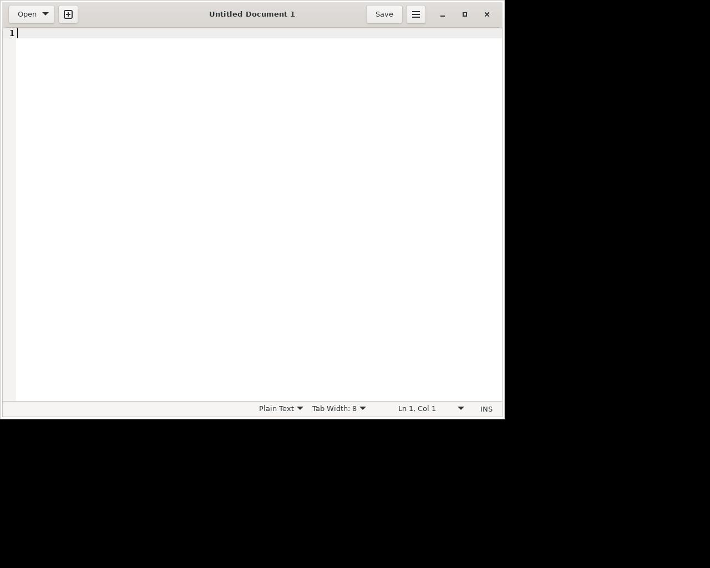
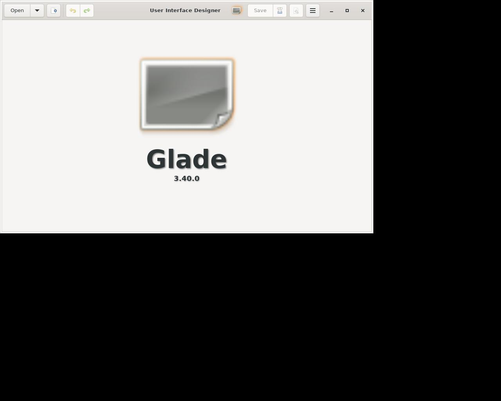

# amd64 - 构建统计
| 索引数  | 构建数 | 成功数 | 失败数  | 成功率  | 完成度  |
|--------|--------|-------|---------| -------|-----|
|3160|642|277 |365 | 43.15%| 8.77%|
## 仓库统计
| 仓库  | 索引数 |构建数| 成功数 | 失败数  | 成功率  | 完成度  |
|--------|------|-----|-------|---------| -------|-----|
|ubuntu-noble|2779|356|205 |151 | 57.58%| 7.38%|
|deepin-v23|380|285|71 |214 | 24.91%| 18.68%|
|obs-studio|1|1|1 |0 | 100.00%| 100.00%|
## 详细结果
| 包名   | 架构 |仓库| 版本    | 测试结果 | SHA256SUM |
|-------|------|-----|----|---------|-----------|
| [0install](./0install) | amd64  | ubuntu-noble | 2.18-2ubuntu2 |  | N/A |
| [2048](./2048) | amd64  | ubuntu-noble | 0.20221023.1237-1-20250327 | 失败 | N/A |
| [2048-qt](./2048-qt) | amd64  | ubuntu-noble | 0.1.6-2build4 |  | N/A |
| [3dchess](./3dchess) | amd64  | ubuntu-noble | 0.8.1-21ubuntu1 |  | N/A |
| [3depict](./3depict) | amd64  | ubuntu-noble | 0.0.23-2build3 |  | N/A |
| [4pane](./4pane) | amd64  | ubuntu-noble | 8.0-1build4 |  | N/A |
| [7kaa](./7kaa) | amd64  | ubuntu-noble | 2.15.6+ds-1build2 |  | N/A |
| [a2d](./a2d) | amd64  | ubuntu-noble | 2.0.3-2-20250327 | 失败 | N/A |
| [a7xpg](./a7xpg) | amd64  | ubuntu-noble | 0.11.dfsg1-11 |  | N/A |
| [abe](./abe) | amd64  | ubuntu-noble | 1.1+dfsg-5 |  | N/A |
| [abiword](./abiword) | amd64  | ubuntu-noble | 3.0.5~dfsg-3.2build4 |  | N/A |
| [accerciser](./accerciser) | amd64  | ubuntu-noble | 3.42.0-1ubuntu0.1-20250327 | 失败 | N/A |
| [accountwizard](./accountwizard) | amd64  | ubuntu-noble | 23.08.5-0ubuntu3-20250327 | 失败 | N/A |
| [ace-of-penguins](./ace-of-penguins) | amd64  | ubuntu-noble | 1.5~rc2-5ubuntu4 |             | N/A |
| [acetoneiso](./acetoneiso) | amd64  | ubuntu-noble | 2.4-4build2 |  | N/A |
| [achilles](./achilles) | amd64  | ubuntu-noble | 2-12build2 |  | N/A |
| [aclock.app](./aclock.app) | amd64  | ubuntu-noble | 0.4.0-2build5 |  | N/A |
| [aconnectgui](./aconnectgui) | amd64  | ubuntu-noble | 0.9.0rc2-1-10.3build2 |  | N/A |
| [actiona](./actiona) | amd64  | ubuntu-noble | 3.10.1-1build6 |  | N/A |
| [activity-aware-firefox](./activity-aware-firefox) | amd64  | ubuntu-noble | 0.4.2-1-20250327 | 失败 | N/A |
| [activity-log-manager](./activity-log-manager) | amd64  | ubuntu-noble | 0.9.7-0ubuntu31 |  | N/A |
| [add64](./add64) | amd64  | ubuntu-noble | 3.9.3-0ubuntu3 |  | N/A |
| [addressmanager.app](./addressmanager.app) | amd64  | ubuntu-noble | 0.4.8-3build6 |  | N/A |
| [adonthell-data](./adonthell-data) | amd64  | ubuntu-noble | 0.3.8-1 |  | N/A |
| [adun.app](./adun.app) | amd64  | ubuntu-noble | 0.81-14build4 |  | N/A |
| [aegisub](./aegisub) | amd64  | ubuntu-noble | 3.2.2+dfsg-7.1build2 |  | N/A |
| [aeolus](./aeolus) | amd64  | ubuntu-noble | 0.10.4-1build3-20250327 | 失败 | N/A |
| [aerc](./aerc) | amd64  | ubuntu-noble | 0.17.0-1ubuntu0.24.04.2-20250327 | 失败 | N/A |
| [afterstep](./afterstep) | amd64  | ubuntu-noble | 2.2.12-17.1build3-20250327 | 失败 | N/A |
| [afterstep-data](./afterstep-data) | amd64  | ubuntu-noble | 2.2.12-17.1build3-20250327 | 失败 | N/A |
| [agenda.app](./agenda.app) | amd64  | ubuntu-noble | 0.46-3build3 |  | N/A |
| [aghermann](./aghermann) | amd64  | ubuntu-noble | 1.1.2-5build2 |  | N/A |
| [agordejo](./agordejo) | amd64  | ubuntu-noble | 0.4.2-0ubuntu1-20250327 | 失败 | N/A |
| [airstrike](./airstrike) | amd64  | ubuntu-noble | 0.99+1.0pre6a-11 |  | N/A |
| [aisleriot](./aisleriot) | amd64  | ubuntu-noble | 3.22.31-1build2 |  | N/A |
| [akira](./akira) | amd64  | ubuntu-noble | 0.0.16-2build2 |  | N/A |
| [akonadi-import-wizard](./akonadi-import-wizard) | amd64  | ubuntu-noble | 23.08.5-0ubuntu4 |  | N/A |
| [akonadiconsole](./akonadiconsole) | amd64  | ubuntu-noble | 23.08.5-0ubuntu5.2 |  | N/A |
| [akregator](./akregator) | amd64  | ubuntu-noble | 23.08.5-0ubuntu4.1 |  | N/A |
| [alacarte](./alacarte) | amd64  | ubuntu-noble | 3.52.0-1-20250327 | 失败 | N/A |
| [alacritty](./alacritty) | amd64  | deepin-v23 | 0.13.2-2 |  | [SHA256SUM](./alacritty/SHA256SUMS) |
| [aladin](./aladin) | amd64  | ubuntu-noble | 12.060+dfsg-3 |  | N/A |
| [alarm-clock-applet](./alarm-clock-applet) | amd64  | ubuntu-noble | 0.4.1-5build2 |  | N/A |
| [alex4](./alex4) | amd64  | ubuntu-noble | 1.1-10ubuntu4-20250327 | 失败 | N/A |
| [algobox](./algobox) | amd64  | ubuntu-noble | 1.1.1+dfsg-1build2 |  | N/A |
| [alien-arena](./alien-arena) | amd64  | ubuntu-noble | 7.71.3+dfsg-3ubuntu1-20250327 | 失败 | N/A |
| [alienblaster](./alienblaster) | amd64  | ubuntu-noble | 1.1.0-11 |  | N/A |
| [aliki](./aliki) | amd64  | ubuntu-noble | 0.3.0-6build2 |   | N/A |
| [alkimia-bin](./alkimia-bin) | amd64  | ubuntu-noble | 8.1.2-2build2-20250327 | 失败 | N/A |
| [allure](./allure) | amd64  | ubuntu-noble | 0.11.0.0-1 |  | N/A |
| [almanah](./almanah) | amd64  | ubuntu-noble | 0.12.3-2build3 |  | N/A |
| [alsa-scarlett-gui](./alsa-scarlett-gui) | amd64  | ubuntu-noble | 0.4.0-1 |  | N/A |
| [alsa-tools-gui](./alsa-tools-gui) | amd64  | deepin-v23 | 1.2.11-1.1-20250327 | 失败 | N/A |
| [alsamixergui](./alsamixergui) | amd64  | ubuntu-noble | 0.9.0rc2-1-10.2build2 |  | N/A |
| [alsaplayer-common](./alsaplayer-common) | amd64  | ubuntu-noble | 0.99.81-2build6 |  | N/A |
| [altos](./altos) | amd64  | ubuntu-noble | 1.9.17-1ubuntu3 |    | N/A |
| [amberol](./amberol) | amd64  | ubuntu-noble | 0.10.3-3ubuntu1 |  | N/A |
| [amide](./amide) | amd64  | ubuntu-noble | 1.0.6-5build2 |  | N/A |
| [amoebax](./amoebax) | amd64  | ubuntu-noble | 0.2.1+dfsg-6 |  | N/A |
| [amphetamine](./amphetamine) | amd64  | ubuntu-noble | 0.8.10-21build1 |  | N/A |
| [ams](./ams) | amd64  | ubuntu-noble | 2.2.1-1build3-20250327 | 失败 | N/A |
| [amsynth](./amsynth) | amd64  | ubuntu-noble | 1.13.2-1build2 |  | N/A |
| [amule](./amule) | amd64  | ubuntu-noble | 2.3.3-3build5 |  | N/A |
| [amule-utils-gui](./amule-utils-gui) | amd64  | ubuntu-noble | 2.3.3-3build5 |    | N/A |
| [anarchism](./anarchism) | amd64  | ubuntu-noble | 15.3-3-20250327 | 失败 | N/A |
| [android-file-transfer](./android-file-transfer) | amd64  | ubuntu-noble | 4.3-1build3 |  | N/A |
| [angband-data](./angband-data) | amd64  | ubuntu-noble | 4.2.5+dfsg1-1-20250327 | 失败 | N/A |
| [angelfish](./angelfish) | amd64  | ubuntu-noble | 23.08.5-0ubuntu3-20250327 | 失败 | N/A |
| [angrydd](./angrydd) | amd64  | ubuntu-noble | 1.0.1-14 |  | N/A |
| [anki](./anki) | amd64  | ubuntu-noble | 2.1.15+dfsg-3ubuntu4.1 |  | N/A |
| [ansifilter-gui](./ansifilter-gui) | amd64  | ubuntu-noble | 2.18+dfsg1-2build2 |  | N/A |
| [antigravitaattori](./antigravitaattori) | amd64  | ubuntu-noble | 0.0.3-10build2-20250327 | 失败 | N/A |
| [antimicro](./antimicro) | amd64  | ubuntu-noble | 3.1.4-2 |  | N/A |
| [antimony](./antimony) | amd64  | ubuntu-noble | 0.9.3-2build9 |  | N/A |
| [anymeal](./anymeal) | amd64  | ubuntu-noble | 1.26-1build2 |  | N/A |
| [aobook](./aobook) | amd64  | ubuntu-noble | 1.0.3-3build2 |  | N/A |
| [aoflagger](./aoflagger) | amd64  | ubuntu-noble | 3.4.0-2build4 |   | N/A |
| [apitrace-gui](./apitrace-gui) | amd64  | ubuntu-noble | 11.1+repack-1.2build3 |  | N/A |
| [apostrophe](./apostrophe) | amd64  | ubuntu-noble | 2.6.3-4-20250327 | 失败 | N/A |
| [apper](./apper) | amd64  | ubuntu-noble | 1.0.0-5build2-20250327 | 失败 | N/A |
| [apport-gtk](./apport-gtk) | amd64  | ubuntu-noble | 2.28.1-0ubuntu3.5-20250327 | 失败 | N/A |
| [apport-kde](./apport-kde) | amd64  | ubuntu-noble | 2.28.1-0ubuntu3.5-20250327 | 失败 | N/A |
| [apt-offline-gui](./apt-offline-gui) | amd64  | ubuntu-noble | 1.8.5-1 |  | N/A |
| [apturl-common](./apturl-common) | amd64  | ubuntu-noble | 0.5.2ubuntu23-20250327 | 失败 | N/A |
| [apvlv](./apvlv) | amd64  | ubuntu-noble | 0.5.0+repack-2build3 |  | N/A |
| [aqemu](./aqemu) | amd64  | ubuntu-noble | 0.9.2-3ubuntu2 |  | N/A |
| [arandr](./arandr) | amd64  | ubuntu-noble | 0.1.11-1-20250327 | 失败 | N/A |
| [aranym](./aranym) | amd64  | ubuntu-noble | 1.1.0-2 |    | N/A |
| [aravis-tools](./aravis-tools) | amd64  | ubuntu-noble | 0.8.30-1build2-20250327 | 失败 | N/A |
| [arb](./arb) | amd64  | ubuntu-noble | 6.0.6-7build3-20250327 | 失败 | N/A |
| [arc-gui-clients](./arc-gui-clients) | amd64  | ubuntu-noble | 0.4.6-7build5 |     | N/A |
| [ardentryst](./ardentryst) | amd64  | ubuntu-noble | 1.71-10 |  | N/A |
| [ardour](./ardour) | amd64  | ubuntu-noble | 8.4.0+ds1-2ubuntu8 |  | N/A |
| [arduino](./arduino) | amd64  | ubuntu-noble | 1.8.19+dfsg1-2 |  | N/A |
| [ares](./ares) | amd64  | ubuntu-noble | 134+dfsg-1build2 |  | N/A |
| [ario](./ario) | amd64  | ubuntu-noble | 1.6-1.2build4 |  | N/A |
| [ark](./ark) | amd64  | ubuntu-noble | 23.08.5-0ubuntu5 |  | N/A |
| [armagetronad](./armagetronad) | amd64  | ubuntu-noble | 0.2.9.1.1-1build2 |  | N/A |
| [arqiver](./arqiver) | amd64  | ubuntu-noble | 0.9.0-1build2 |  | N/A |
| [artemis](./artemis) | amd64  | ubuntu-noble | 18.2.0+dfsg-3 |     | N/A |
| [artha](./artha) | amd64  | ubuntu-noble | 1.0.5-3build2 |  | N/A |
| [artikulate](./artikulate) | amd64  | ubuntu-noble | 23.08.5-0ubuntu3 |  | N/A |
| [asc](./asc) | amd64  | ubuntu-noble | 2.6.1.0-9build5 |  | N/A |
| [asciijump](./asciijump) | amd64  | ubuntu-noble | 1.0.2~beta-10-20250327 | 失败 | N/A |
| [ase](./ase) | amd64  | ubuntu-noble | 3.22.1-4 |  | N/A |
| [aseba](./aseba) | amd64  | ubuntu-noble | 1.6.99+dfsg-9build2 |        | N/A |
| [assaultcube](./assaultcube) | amd64  | ubuntu-noble | 1.3.0.2+dfsg-5 |  | N/A |
| [astromenace](./astromenace) | amd64  | ubuntu-noble | 1.3.2+repack-7 |  | N/A |
| [asunder](./asunder) | amd64  | ubuntu-noble | 3.0.1+ds-1build2 |  | N/A |
| [asylum](./asylum) | amd64  | ubuntu-noble | 0.3.2-3build1 |  | N/A |
| [atanks](./atanks) | amd64  | ubuntu-noble | 6.6~dfsg-1build2 |  | N/A |
| [atari800](./atari800) | amd64  | ubuntu-noble | 5.0.0-1build2 |  | N/A |
| [atomes](./atomes) | amd64  | ubuntu-noble | 1.1.12+repack-2ubuntu2 |  | N/A |
| [atomix](./atomix) | amd64  | ubuntu-noble | 44.0-3build3 |  | N/A |
| [atril](./atril) | amd64  | ubuntu-noble | 1.26.2-3build2 |  | N/A |
| [audacious](./audacious) | amd64  | ubuntu-noble | 4.3.1-2.1build2 |  | N/A |
| [audacity](./audacity) | amd64  | deepin-v23 | 3.4.2+dfsg-1deepin0 |  | [SHA256SUM](./audacity/SHA256SUMS) |
| [audmes](./audmes) | amd64  | ubuntu-noble | 2024.02.18-1build2 |  | N/A |
| [aumix](./aumix) | amd64  | ubuntu-noble | 2.9.1-7.1-20250327 | 失败 | N/A |
| [auralquiz](./auralquiz) | amd64  | ubuntu-noble | 1.0.0-3build3 |  | N/A |
| [aurora-printer-a121](./aurora-printer-a121) | amd64  | deepin-v23 | 1.0.3-20250327 | 失败 | N/A |
| [ausweisapp](./ausweisapp) | amd64  | ubuntu-noble | 2.1.0-1build1 |  | N/A |
| [auto-multiple-choice](./auto-multiple-choice) | amd64  | ubuntu-noble | 1.6.0-3build4-20250327 | 失败 | N/A |
| [autokey-gtk](./autokey-gtk) | amd64  | ubuntu-noble | 0.95.10-2.1-20250327 | 失败 | N/A |
| [autokey-qt](./autokey-qt) | amd64  | ubuntu-noble | 0.95.10-2.1 |  | N/A |
| [autorenamer](./autorenamer) | amd64  | ubuntu-noble | 0.6-1-20250327 | 失败 | N/A |
| [avahi-discover](./avahi-discover) | amd64  | ubuntu-noble | 0.8-13ubuntu6-20250327 | 失败 | N/A |
| [avahi-ui-utils](./avahi-ui-utils) | amd64  | ubuntu-noble | 0.8-13ubuntu6 |   | N/A |
| [avogadro](./avogadro) | amd64  | ubuntu-noble | 1.99.0-1build2 |  | N/A |
| [awf-gtk3](./awf-gtk3) | amd64  | ubuntu-noble | 2.8.0-1build2 |  | N/A |
| [awf-gtk4](./awf-gtk4) | amd64  | ubuntu-noble | 2.8.0-1build2 |  | N/A |
| [ayatana-settings](./ayatana-settings) | amd64  | ubuntu-noble | 23.11.14-1-20250327 | 失败 | N/A |
| [ayatana-webmail](./ayatana-webmail) | amd64  | ubuntu-noble | 23.12.25+dfsg-1-20250327 | 失败 | N/A |
| [backintime-qt](./backintime-qt) | amd64  | ubuntu-noble | 1.4.3-1 |  | N/A |
| [bacula-console-qt](./bacula-console-qt) | amd64  | ubuntu-noble | 13.0.4-1build3 |  | N/A |
| [bacula-tray-monitor](./bacula-tray-monitor) | amd64  | ubuntu-noble | 13.0.4-1build3 |  | N/A |
| [ballerburg](./ballerburg) | amd64  | ubuntu-noble | 1.2.1-1 |  | N/A |
| [ballview](./ballview) | amd64  | ubuntu-noble | 1.5.0+git20180813.37fc53c-11build5 |  | N/A |
| [ballz](./ballz) | amd64  | ubuntu-noble | 1.0.4-1.1build2 |  | N/A |
| [balsa](./balsa) | amd64  | ubuntu-noble | 2.6.4-2build5-20250327 | 失败 | N/A |
| [bambam](./bambam) | amd64  | ubuntu-noble | 1.2.1+dfsg-1 |  | N/A |
| [bambootracker](./bambootracker) | amd64  | ubuntu-noble | 0.6.1-1build2-20250327 | 失败 | N/A |
| [baobab](./baobab) | amd64  | ubuntu-noble | 46.0-1build1 |  | N/A |
| [barrage](./barrage) | amd64  | ubuntu-noble | 1.0.5-1 |  | N/A |
| [barrier](./barrier) | amd64  | ubuntu-noble | 2.4.0+dfsg-4build3 |  | N/A |
| [basex](./basex) | amd64  | ubuntu-noble | 10.5-1-20250327 | 失败 | N/A |
| [basic256](./basic256) | amd64  | ubuntu-noble | 2.0.99.7-2build3 |  | N/A |
| [basilisk2](./basilisk2) | amd64  | ubuntu-noble | 0.9.20240401-1 |  | N/A |
| [basket](./basket) | amd64  | ubuntu-noble | 2.49-1build3 |  | N/A |
| [bastet](./bastet) | amd64  | ubuntu-noble | 0.43-7build1-20250327 | 失败 | N/A |
| [batmon.app](./batmon.app) | amd64  | ubuntu-noble | 0.9-2build5 |  | N/A |
| [battery-stats](./battery-stats) | amd64  | ubuntu-noble | 0.5.6-2.1 |  | N/A |
| [bb](./bb) | amd64  | deepin-v23 | 1.3rc1-13 | 失败 | [SHA256SUM](./bb/SHA256SUMS) |
| [bbpager](./bbpager) | amd64  | ubuntu-noble | 0.4.7-10-20250327 | 失败 | N/A |
| [bcnc](./bcnc) | amd64  | ubuntu-noble | 0.9.14.318+ds-4 |  | N/A |
| [bdbvu](./bdbvu) | amd64  | ubuntu-noble | 0.1-3.1build2 |  | N/A |
| [beads](./beads) | amd64  | ubuntu-noble | 1.1.22-1build4 |  | N/A |
| [bear-factory](./bear-factory) | amd64  | ubuntu-noble | 0.6.0-8build5 |    | N/A |
| [beneath-a-steel-sky](./beneath-a-steel-sky) | amd64  | ubuntu-noble | 0.0372-8 |  | N/A |
| [berusky](./berusky) | amd64  | ubuntu-noble | 1.7.2-3build2 |  | N/A |
| [berusky2](./berusky2) | amd64  | ubuntu-noble | 0.12-4 |  | N/A |
| [bespokesynth](./bespokesynth) | amd64  | ubuntu-noble | 1.2.1+dfsg-4build4 |  | N/A |
| [betaradio](./betaradio) | amd64  | ubuntu-noble | 1.6-1build3 |  | N/A |
| [between](./between) | amd64  | ubuntu-noble | 6+dfsg1-4 |  | N/A |
| [bibledit](./bibledit) | amd64  | ubuntu-noble | 5.1.002-1build5 |  | N/A |
| [bibletime](./bibletime) | amd64  | ubuntu-noble | 3.0.3-3build2 |  | N/A |
| [bibshelf](./bibshelf) | amd64  | ubuntu-noble | 1.6.0-0ubuntu9 |  | N/A |
| [biglybt](./biglybt) | amd64  | ubuntu-noble | 3.4.0.0-1-20250327 | 失败 | N/A |
| [bijiben](./bijiben) | amd64  | ubuntu-noble | 40.1-6build4-20250327 | 失败 | N/A |
| [billard-gl](./billard-gl) | amd64  | ubuntu-noble | 1.75-17build2 |  | N/A |
| [biloba](./biloba) | amd64  | ubuntu-noble | 0.9.3-11 |  | N/A |
| [biniax2](./biniax2) | amd64  | ubuntu-noble | 1.30-7 |  | N/A |
| [bino](./bino) | amd64  | ubuntu-noble | 2.1-1build2-20250327 | 失败 | N/A |
| [biogenesis](./biogenesis) | amd64  | ubuntu-noble | 0.8-3.1 |  | N/A |
| [birdfont](./birdfont) | amd64  | ubuntu-noble | 2.33.1-3build3 |  | N/A |
| [bisheng-engine](./bisheng-engine) | amd64  | deepin-v23 | 2.0.14-1 | 失败 | [SHA256SUM](./bisheng-engine/SHA256SUMS) |
| [bitsnpicas](./bitsnpicas) | amd64  | ubuntu-noble | 2.0+ds-2-20250327 | 失败 | N/A |
| [biz.zcjt.gaopaiyi](./biz.zcjt.gaopaiyi) | amd64  | deepin-v23 | 1.0.0-20250327 | 失败 | N/A |
| [biz.zcjt.scanner](./biz.zcjt.scanner) | amd64  | deepin-v23 | 1.0.2.0-20250327 | 失败 | N/A |
| [biz.zcjt.zc-a5930dn](./biz.zcjt.zc-a5930dn) | amd64  | deepin-v23 | 1.0.0-23166 |   | N/A |
| [biz.zcjt.zc-a5933dn](./biz.zcjt.zc-a5933dn) | amd64  | deepin-v23 | 1.0.0-23324 |   | N/A |
| [biz.zcjt.zhongchu-sane](./biz.zcjt.zhongchu-sane) | amd64  | deepin-v23 | 20240911-6.6.10.030-20250327 | 失败 | N/A |
| [bkchem](./bkchem) | amd64  | ubuntu-noble | 0.14.0~pre4+git20211228-3-20250327 | 失败 | N/A |
| [black-box](./black-box) | amd64  | ubuntu-noble | 1.4.8-4build1 |  | N/A |
| [blackbox-terminal](./blackbox-terminal) | amd64  | ubuntu-noble | 0.14.0-2build2 |  | N/A |
| [blastem](./blastem) | amd64  | ubuntu-noble | 0.6.3.4-1build1 |  | N/A |
| [bleachbit](./bleachbit) | amd64  | ubuntu-noble | 4.6.0-3-44b4f74 | 失败 | N/A |
| [blender](./blender) | amd64  | ubuntu-noble | 4.0.2+dfsg-1ubuntu8 |  | N/A |
| [blinken](./blinken) | amd64  | ubuntu-noble | 23.08.5-0ubuntu4 |  | N/A |
| [blobandconquer](./blobandconquer) | amd64  | ubuntu-noble | 1.11-dfsg+20-2-44b4f74 | 失败 | N/A |
| [blobby](./blobby) | amd64  | ubuntu-noble | 1.1+ds-1ubuntu1 |  | N/A |
| [bloboats](./bloboats) | amd64  | ubuntu-noble | 1.0.2+dfsg-4 |  | N/A |
| [blobwars](./blobwars) | amd64  | ubuntu-noble | 2.00-4ubuntu1 |  | N/A |
| [blockattack](./blockattack) | amd64  | ubuntu-noble | 2.8.0-1build1 |  | N/A |
| [blockout2](./blockout2) | amd64  | ubuntu-noble | 2.5+dfsg1-1build3 |  | N/A |
| [blocks-of-the-undead](./blocks-of-the-undead) | amd64  | ubuntu-noble | 1.0-7build1 |  | N/A |
| [bluedevil](./bluedevil) | amd64  | ubuntu-noble | 5.27.11-0ubuntu2 |  | N/A |
| [bluefish](./bluefish) | amd64  | ubuntu-noble | 2.2.15-1 |  | N/A |
| [blueman](./blueman) | amd64  | deepin-v23 | 2.3.5-3deepin0+rb1-44b4f74 | 失败 | N/A |
| [blupimania](./blupimania) | amd64  | ubuntu-noble | 1.6.2-17-g5f6cf8b-1 |  | N/A |
| [boats](./boats) | amd64  | ubuntu-noble | 202008-1build2 |  | N/A |
| [boinc-manager](./boinc-manager) | amd64  | ubuntu-noble | 7.24.1+dfsg-4build1 |  | N/A |
| [bomber](./bomber) | amd64  | ubuntu-noble | 23.08.5-0ubuntu3 |  | N/A |
| [bomberclone](./bomberclone) | amd64  | ubuntu-noble | 0.11.9-7.1 |  | N/A |
| [bookletimposer](./bookletimposer) | amd64  | ubuntu-noble | 0.3.1-4ubuntu1-44b4f74 | 失败 | N/A |
| [bookworm](./bookworm) | amd64  | ubuntu-noble | 1.1.2+git20210715-4build3 |  | N/A |
| [boomaga](./boomaga) | amd64  | ubuntu-noble | 3.0.0+git13-g7f7ad47-1build4 |  | N/A |
| [bossa](./bossa) | amd64  | ubuntu-noble | 1.9.1-3ubuntu5 |  | N/A |
| [boswars](./boswars) | amd64  | ubuntu-noble | 2.8-2build2 |  | N/A |
| [bouncy](./bouncy) | amd64  | ubuntu-noble | 0.6.20071104-9 |  | N/A |
| [bovo](./bovo) | amd64  | ubuntu-noble | 23.08.5-0ubuntu3 |  | N/A |
| [bpython](./bpython) | amd64  | ubuntu-noble | 0.24-1 |  | N/A |
| [brainparty](./brainparty) | amd64  | ubuntu-noble | 0.61+dfsg-7 |  | N/A |
| [brasero](./brasero) | amd64  | ubuntu-noble | 3.12.3-2build4 |  | N/A |
| [brewtarget](./brewtarget) | amd64  | ubuntu-noble | 3.0.6-1build2 |  | N/A |
| [briquolo](./briquolo) | amd64  | ubuntu-noble | 0.5.7-11build2 |  | N/A |
| [brp-pacu](./brp-pacu) | amd64  | ubuntu-noble | 2.1.2+git20210421-1build2 |  | N/A |
| [brutalchess](./brutalchess) | amd64  | ubuntu-noble | 0.5.2+dfsg-8build1 |  | N/A |
| [bsdgames](./bsdgames) | amd64  | ubuntu-noble | 2.17-33 |           | N/A |
| [btanks](./btanks) | amd64  | ubuntu-noble | 0.9.8083-9build1 |  | N/A |
| [btop](./btop) | amd64  | deepin-v23 | 1.3.0-1 | 失败 | [SHA256SUM](./btop/SHA256SUMS) |
| [budgie-arm-environment](./budgie-arm-environment) | amd64  | ubuntu-noble | 0.20.13-44b4f74 | 失败 | N/A |
| [budgie-control-center](./budgie-control-center) | amd64  | ubuntu-noble | 1.4.0-2build3-44b4f74 | 失败 | N/A |
| [budgie-core](./budgie-core) | amd64  | ubuntu-noble | 10.9.1-3ubuntu4-44b4f74 | 失败 | N/A |
| [budgie-desktop-environment](./budgie-desktop-environment) | amd64  | ubuntu-noble | 0.20.13-44b4f74 | 失败 | N/A |
| [budgie-desktop-view](./budgie-desktop-view) | amd64  | ubuntu-noble | 1.3-2build1-44b4f74 | 失败 | N/A |
| [budgie-hotcorners-applet](./budgie-hotcorners-applet) | amd64  | ubuntu-noble | 1.8.0-1build3 |  | N/A |
| [budgie-previews](./budgie-previews) | amd64  | ubuntu-noble | 1.8.0-1build3 |  | N/A |
| [budgie-quickchar](./budgie-quickchar) | amd64  | ubuntu-noble | 1.8.0-1build3-44b4f74 | 失败 | N/A |
| [budgie-wallstreet](./budgie-wallstreet) | amd64  | ubuntu-noble | 1.8.0-1build3 |  | N/A |
| [budgie-welcome](./budgie-welcome) | amd64  | ubuntu-noble | 0.6.1 |     | N/A |
| [budgie-window-shuffler](./budgie-window-shuffler) | amd64  | ubuntu-noble | 1.8.0-1build3 |  | N/A |
| [bugsquish](./bugsquish) | amd64  | ubuntu-noble | 0.0.6-10 |  | N/A |
| [bumprace](./bumprace) | amd64  | ubuntu-noble | 1.5.8-1 |  | N/A |
| [burgerspace](./burgerspace) | amd64  | ubuntu-noble | 1.9.5-1build1 |  | N/A |
| [butt](./butt) | amd64  | ubuntu-noble | 0.1.37-2 |  | [SHA256SUM](./butt/SHA256SUMS) |
| [caja](./caja) | amd64  | ubuntu-noble | 1.24.0-1-deepin1-07be3ef | 失败 | N/A |
| [cataclysm-dda-sdl](./cataclysm-dda-sdl) | amd64  | deepin-v23 | 0.G-4deepin1 |  | [SHA256SUM](./cataclysm-dda-sdl/SHA256SUMS) |
| [cc.lotuscard.demo](./cc.lotuscard.demo) | amd64  | deepin-v23 | 1.0.0.0-07be3ef | 失败 | N/A |
| [cf900](./cf900) | amd64  | deepin-v23 | 1.0 |   | [SHA256SUM](./cf900/SHA256SUMS) |
| [cgoban](./cgoban) | amd64  | deepin-v23 | 1.9.14-19 | 失败 | [SHA256SUM](./cgoban/SHA256SUMS) |
| [cherrytree](./cherrytree) | amd64  | ubuntu-noble | 1.0.2+dfsg-1 | 失败 | [SHA256SUM](./cherrytree/SHA256SUMS) |
| [chromium](./chromium) | amd64  | deepin-v23 | 128.0.6613.84-1deepin1-07be3ef | 失败 | N/A |
| [cinnamon-screensaver](./cinnamon-screensaver) | amd64  | ubuntu-noble | 5.0.7-1-07be3ef | 失败 | N/A |
| [cinnamon-settings-daemon](./cinnamon-settings-daemon) | amd64  | ubuntu-noble | 5.0.4-2-07be3ef | 失败 | N/A |
| [citizen-cx-02-printerdriver](./citizen-cx-02-printerdriver) | amd64  | deepin-v23 | 1.0.0-0 | 失败 | [SHA256SUM](./citizen-cx-02-printerdriver/SHA256SUMS) |
| [citizen-cx-02s-printerdriver](./citizen-cx-02s-printerdriver) | amd64  | deepin-v23 | 1.0.0-0 | 失败 | [SHA256SUM](./citizen-cx-02s-printerdriver/SHA256SUMS) |
| [citizen-cx-02w-printerdriver](./citizen-cx-02w-printerdriver) | amd64  | deepin-v23 | 1.0.0-0 | 失败 | [SHA256SUM](./citizen-cx-02w-printerdriver/SHA256SUMS) |
| [citizen-cy-printerdriver](./citizen-cy-printerdriver) | amd64  | deepin-v23 | 1.0.0-0 | 失败 | [SHA256SUM](./citizen-cy-printerdriver/SHA256SUMS) |
| [citizen-cz-01-printerdriver](./citizen-cz-01-printerdriver) | amd64  | deepin-v23 | 1.0.0-0 | 失败 | [SHA256SUM](./citizen-cz-01-printerdriver/SHA256SUMS) |
| [claws-mail](./claws-mail) | amd64  | ubuntu-noble | 4.2.0-2-07be3ef | 失败 | N/A |
| [clipit](./clipit) | amd64  | ubuntu-noble | 1.4.4+git20190202-2 |  | [SHA256SUM](./clipit/SHA256SUMS) |
| [cmake-qt-gui](./cmake-qt-gui) | amd64  | deepin-v23 | 3.30.5-1 |  | [SHA256SUM](./cmake-qt-gui/SHA256SUMS) |
| [cmatrix](./cmatrix) | amd64  | ubuntu-noble | 2.0-3 | 失败 | [SHA256SUM](./cmatrix/SHA256SUMS) |
| [cn.com.hisign.hidscanner](./cn.com.hisign.hidscanner) | amd64  | deepin-v23 | 1.0.0-1-07be3ef | 失败 | N/A |
| [cn.com.hisign.hsivlive](./cn.com.hisign.hsivlive) | amd64  | deepin-v23 | 3.10.8-07be3ef | 失败 | N/A |
| [cn.com.hsic.demo](./cn.com.hsic.demo) | amd64  | deepin-v23 | 1.0.0-1-07be3ef | 失败 | N/A |
| [cn.com.secuprint.smlmfp](./cn.com.secuprint.smlmfp) | amd64  | deepin-v23 | 1.0.3.0-07be3ef | 失败 | N/A |
| [cn.com.signpro.hwtabletserv](./cn.com.signpro.hwtabletserv) | amd64  | deepin-v23 | 2.7+b69-07be3ef | 失败 | N/A |
| [cn.com.signpro.sphttpserv](./cn.com.signpro.sphttpserv) | amd64  | deepin-v23 | 3.2+b83-07be3ef | 失败 | N/A |
| [cn.com.tongzhi.crypt.http](./cn.com.tongzhi.crypt.http) | amd64  | deepin-v23 | 1.0.3.4406-1 | 失败 | [SHA256SUM](./cn.com.tongzhi.crypt.http/SHA256SUMS) |
| [cn.dascom.dc8600-driver](./cn.dascom.dc8600-driver) | amd64  | deepin-v23 | 1.0.0-07be3ef | 失败 | N/A |
| [cn.hengbao.hbd7600-driver](./cn.hengbao.hbd7600-driver) | amd64  | deepin-v23 | 1.0.8-07be3ef | 失败 | N/A |
| [cn.huahom.pam.unlock](./cn.huahom.pam.unlock) | amd64  | deepin-v23 | 0.1.0 |  | [SHA256SUM](./cn.huahom.pam.unlock/SHA256SUMS) |
| [cn.hzchancel.fifthfootprint](./cn.hzchancel.fifthfootprint) | amd64  | deepin-v23 | 0.0.1-07be3ef | 失败 | N/A |
| [cn.hzchancel.fouthfootprint](./cn.hzchancel.fouthfootprint) | amd64  | deepin-v23 | 0.0.1-07be3ef | 失败 | N/A |
| [cn.microdone.passguardservice](./cn.microdone.passguardservice) | amd64  | deepin-v23 | 1.0.0.0-07be3ef | 失败 | N/A |
| [cn.microdone.passguardservice.bj](./cn.microdone.passguardservice.bj) | amd64  | deepin-v23 | 1.0.0.0-07be3ef | 失败 | N/A |
| [cn.microdone.passguardservice.nb](./cn.microdone.passguardservice.nb) | amd64  | deepin-v23 | 1.0.0.7-07be3ef | 失败 | N/A |
| [cn.microdone.signmessenger.hz](./cn.microdone.signmessenger.hz) | amd64  | deepin-v23 | 1.0.0.0-07be3ef | 失败 | N/A |
| [cn.microdone.signmessenger.nb](./cn.microdone.signmessenger.nb) | amd64  | deepin-v23 | 1.0.0.2-07be3ef | 失败 | N/A |
| [cn.naturalcard.eserver](./cn.naturalcard.eserver) | amd64  | deepin-v23 | 1.0.0.1-07be3ef | 失败 | N/A |
| [cn.net.zonewin.smartscanner](./cn.net.zonewin.smartscanner) | amd64  | deepin-v23 | 1.0.11-07be3ef | 失败 | N/A |
| [cn.tianyi.eserver](./cn.tianyi.eserver) | amd64  | deepin-v23 | 1.0.0.1-07be3ef | 失败 | N/A |
| [cndrvcups-utility](./cndrvcups-utility) | amd64  | deepin-v23 | 1.10-1deepin0 |  | [SHA256SUM](./cndrvcups-utility/SHA256SUMS) |
| [cnrdrvcups-ufr2-uk](./cnrdrvcups-ufr2-uk) | amd64  | deepin-v23 | 5.10-1+rb1 |  | [SHA256SUM](./cnrdrvcups-ufr2-uk/SHA256SUMS) |
| [cnrdrvcups-ufr2lt-uk](./cnrdrvcups-ufr2lt-uk) | amd64  | deepin-v23 | 5.00-1deepin0 |  | [SHA256SUM](./cnrdrvcups-ufr2lt-uk/SHA256SUMS) |
| [codeblocks-common](./codeblocks-common) | amd64  | ubuntu-noble | 20.03+svn13046-0.2 | 失败 | [SHA256SUM](./codeblocks-common/SHA256SUMS) |
| [colossal-cave-adventure](./colossal-cave-adventure) | amd64  | ubuntu-noble | 1.4-1.1 |  | [SHA256SUM](./colossal-cave-adventure/SHA256SUMS) |
| [com-huashuoaf-finger](./com-huashuoaf-finger) | amd64  | deepin-v23 | 1.0.0.3 |  | [SHA256SUM](./com-huashuoaf-finger/SHA256SUMS) |
| [com.arc-uds.smartscan](./com.arc-uds.smartscan) | amd64  | deepin-v23 | 3.1.0.1 |  | [SHA256SUM](./com.arc-uds.smartscan/SHA256SUMS) |
| [com.avision.a4pq-series](./com.avision.a4pq-series) | amd64  | deepin-v23 | 1.0.0-23293 |   | [SHA256SUM](./com.avision.a4pq-series/SHA256SUMS) |
| [com.avision.avision-sane](./com.avision.avision-sane) | amd64  | deepin-v23 | 20231120-8.6.10.020-07be3ef | 失败 | N/A |
| [com.bhyf.bhpainter](./com.bhyf.bhpainter) | amd64  | deepin-v23 | 2020.12.01-1 |   | [SHA256SUM](./com.bhyf.bhpainter/SHA256SUMS) |
| [com.binup.fingerprint](./com.binup.fingerprint) | amd64  | deepin-v23 | 1.0.0.1-07be3ef | 失败 | N/A |
| [com.bjnja.njaep3kgmutil](./com.bjnja.njaep3kgmutil) | amd64  | deepin-v23 | 1.0.2-07be3ef | 失败 | N/A |
| [com.btit.linuxaction](./com.btit.linuxaction) | amd64  | deepin-v23 | 3.1.10.24194-uosv20-07be3ef | 失败 | N/A |
| [com.canon.ufr2](./com.canon.ufr2) | amd64  | deepin-v23 | 6.00-1.00 | 失败 | [SHA256SUM](./com.canon.ufr2/SHA256SUMS) |
| [com.centerm.gwq](./com.centerm.gwq) | amd64  | deepin-v23 | 2021.1.29-1 |  | [SHA256SUM](./com.centerm.gwq/SHA256SUMS) |
| [com.centerm.gwq.common](./com.centerm.gwq.common) | amd64  | deepin-v23 | 1.0.0.0-1-07be3ef | 失败 | N/A |
| [com.colortrac](./com.colortrac) | amd64  | deepin-v23 | 1.0.7-07be3ef | 失败 | N/A |
| [com.comet.comet-sane](./com.comet.comet-sane) | amd64  | deepin-v23 | 20240814-11.7.11.063-07be3ef | 失败 | N/A |
| [com.contexscan](./com.contexscan) | amd64  | deepin-v23 | 1.0.7-07be3ef | 失败 | N/A |
| [com.deepin.gomoku](./com.deepin.gomoku) | amd64  | deepin-v23 | 1.0.11 |  | [SHA256SUM](./com.deepin.gomoku/SHA256SUMS) |
| [com.deepin.lianliankan](./com.deepin.lianliankan) | amd64  | deepin-v23 | 1.0.12 |  | [SHA256SUM](./com.deepin.lianliankan/SHA256SUMS) |
| [com.deepin.microbox-scanner](./com.deepin.microbox-scanner) | amd64  | deepin-v23 | 1.2.1-af50a04 | 失败 | N/A |
| [com.deli.camera](./com.deli.camera) | amd64  | deepin-v23 | 2.1.7.9-07be3ef | 失败 | N/A |
| [com.deli.printer-c111](./com.deli.printer-c111) | amd64  | deepin-v23 | 1.0.038-07be3ef | 失败 | N/A |
| [com.deli.printer-d11](./com.deli.printer-d11) | amd64  | deepin-v23 | 1.10-1 | 失败 | [SHA256SUM](./com.deli.printer-d11/SHA256SUMS) |
| [com.deli.printer-d21](./com.deli.printer-d21) | amd64  | deepin-v23 | 1.10-1 | 失败 | [SHA256SUM](./com.deli.printer-d21/SHA256SUMS) |
| [com.delichina.deliscan](./com.delichina.deliscan) | amd64  | deepin-v23 | 4.51.24520.23319 | 失败 | [SHA256SUM](./com.delichina.deliscan/SHA256SUMS) |
| [com.elineprint.e-gm3001-an-3in1](./com.elineprint.e-gm3001-an-3in1) | amd64  | deepin-v23 | 1.0.0-20206 | 失败 | [SHA256SUM](./com.elineprint.e-gm3001-an-3in1/SHA256SUMS) |
| [com.everfine.finger](./com.everfine.finger) | amd64  | deepin-v23 | 2021.11.5-1-07be3ef | 失败 | N/A |
| [com.everspry.escaps](./com.everspry.escaps) | amd64  | deepin-v23 | 24.7.8.8 |  | [SHA256SUM](./com.everspry.escaps/SHA256SUMS) |
| [com.farshine.ygdevservice](./com.farshine.ygdevservice) | amd64  | deepin-v23 | 2.5.2-07be3ef | 失败 | N/A |
| [com.fenglinkeji.scanner](./com.fenglinkeji.scanner) | amd64  | deepin-v23 | 0.0.1-1-07be3ef | 失败 | N/A |
| [com.founder.linuxaction](./com.founder.linuxaction) | amd64  | deepin-v23 | 2.1.96.24365-uosv20-07be3ef | 失败 | N/A |
| [com.founderinternational.founder-sane](./com.founderinternational.founder-sane) | amd64  | deepin-v23 | 20240820-1.6.10.015-07be3ef | 失败 | N/A |
| [com.ftsafe.epass3000gm-spabank](./com.ftsafe.epass3000gm-spabank) | amd64  | deepin-v23 | 1.2.4-1+b1-07be3ef | 失败 | N/A |
| [com.ftsafe.epass3000gmg-hnxa](./com.ftsafe.epass3000gmg-hnxa) | amd64  | deepin-v23 | 1.0.1-1+b1-07be3ef | 失败 | N/A |
| [com.ftsafe.interpass3000-cib](./com.ftsafe.interpass3000-cib) | amd64  | deepin-v23 | 1.0.16.d1-1+b1-uos-07be3ef | 失败 | N/A |
| [com.ftsafe.interpass3000-cmbc](./com.ftsafe.interpass3000-cmbc) | amd64  | deepin-v23 | 1.3.13.d0-1+b1-07be3ef | 失败 | N/A |
| [com.ftsafe.interpass3000-lfbk](./com.ftsafe.interpass3000-lfbk) | amd64  | deepin-v23 | 1.0.7-1+b1-07be3ef | 失败 | N/A |
| [com.ftsafe.interpass3000-nbbank](./com.ftsafe.interpass3000-nbbank) | amd64  | deepin-v23 | 1.0.9-07be3ef | 失败 | N/A |
| [com.ftsafe.interpass3000-rzbank](./com.ftsafe.interpass3000-rzbank) | amd64  | deepin-v23 | 1.0.1-1+b1-07be3ef | 失败 | N/A |
| [com.ftsafe.interpass3000-scb](./com.ftsafe.interpass3000-scb) | amd64  | deepin-v23 | 1.0.5-1+b1-07be3ef | 失败 | N/A |
| [com.ftsafe.interpass3000-wfbank](./com.ftsafe.interpass3000-wfbank) | amd64  | deepin-v23 | 1.0.0.d1-1+b1-07be3ef | 失败 | N/A |
| [com.ftsafe.interpass3000zjrc](./com.ftsafe.interpass3000zjrc) | amd64  | deepin-v23 | 1.2.21-1+b1-07be3ef | 失败 | N/A |
| [com.ftsafe.interpasscitic](./com.ftsafe.interpasscitic) | amd64  | deepin-v23 | 1.2.8-1+b1-07be3ef | 失败 | N/A |
| [com.fujitsu.fsane](./com.fujitsu.fsane) | amd64  | deepin-v23 | 2.0.1-2-07be3ef | 失败 | N/A |
| [com.fytech.cfs300b](./com.fytech.cfs300b) | amd64  | deepin-v23 | 1.0.0 |  | [SHA256SUM](./com.fytech.cfs300b/SHA256SUMS) |
| [com.fytech.pfs408](./com.fytech.pfs408) | amd64  | deepin-v23 | 2021.5.8 |  | [SHA256SUM](./com.fytech.pfs408/SHA256SUMS) |
| [com.fytech.ps1300](./com.fytech.ps1300) | amd64  | deepin-v23 | 1.0.0 |  | [SHA256SUM](./com.fytech.ps1300/SHA256SUMS) |
| [com.ggimage.ggimage-printer](./com.ggimage.ggimage-printer) | amd64  | deepin-v23 | 1.0.3-1+uos | 失败 | [SHA256SUM](./com.ggimage.ggimage-printer/SHA256SUMS) |
| [com.gmrz.fido](./com.gmrz.fido) | amd64  | deepin-v23 | 1.0.3.2-07be3ef | 失败 | N/A |
| [com.goke.gksecurity](./com.goke.gksecurity) | amd64  | deepin-v23 | 2.0.3-07be3ef | 失败 | N/A |
| [com.greatwalltech.greatwall-sane](./com.greatwalltech.greatwall-sane) | amd64  | deepin-v23 | 20240918-7.6.10.051-07be3ef | 失败 | N/A |
| [com.gwi.dpm760a-tool](./com.gwi.dpm760a-tool) | amd64  | deepin-v23 | 1.0.0 |  | [SHA256SUM](./com.gwi.dpm760a-tool/SHA256SUMS) |
| [com.haitaichina.htukeytool20079](./com.haitaichina.htukeytool20079) | amd64  | deepin-v23 | 1.0.0.2404081-07be3ef | 失败 | N/A |
| [com.hanguang.hgfchanguangprinter](./com.hanguang.hgfchanguangprinter) | amd64  | deepin-v23 | 1-1 | 失败 | [SHA256SUM](./com.hanguang.hgfchanguangprinter/SHA256SUMS) |
| [com.hanguang.hgfcscanner](./com.hanguang.hgfcscanner) | amd64  | deepin-v23 | 1-1 | 失败 | [SHA256SUM](./com.hanguang.hgfcscanner/SHA256SUMS) |
| [com.hanlongbj.omniscan](./com.hanlongbj.omniscan) | amd64  | deepin-v23 | 1 | 失败 | [SHA256SUM](./com.hanlongbj.omniscan/SHA256SUMS) |
| [com.hanwang.linuxaction-sdk](./com.hanwang.linuxaction-sdk) | amd64  | deepin-v23 | 2.1.53.22043-uosv20-07be3ef | 失败 | N/A |
| [com.hsreader.demo](./com.hsreader.demo) | amd64  | deepin-v23 | 1.1.0-07be3ef | 失败 | N/A |
| [com.huagaochina.huagoscan](./com.huagaochina.huagoscan) | amd64  | deepin-v23 | 2.2.3-1+rc4-07be3ef | 失败 | N/A |
| [com.huawei.cv81-series](./com.huawei.cv81-series) | amd64  | deepin-v23 | 2.0-88 |  | [SHA256SUM](./com.huawei.cv81-series/SHA256SUMS) |
| [com.hw.signdriver](./com.hw.signdriver) | amd64  | deepin-v23 | 1.0.0-07be3ef | 失败 | N/A |
| [com.hw99.hanvon-sane](./com.hw99.hanvon-sane) | amd64  | deepin-v23 | 20230206-9.6.10.053-07be3ef | 失败 | N/A |
| [com.jetbrains.irisking](./com.jetbrains.irisking) | amd64  | deepin-v23 | 2021.01.20-1-07be3ef | 失败 | N/A |
| [com.joyusing.gwq](./com.joyusing.gwq) | amd64  | deepin-v23 | 1.0.0-07be3ef | 失败 | N/A |
| [com.joyusing.visualizer](./com.joyusing.visualizer) | amd64  | deepin-v23 | 1.0.0-07be3ef | 失败 | N/A |
| [com.joyusing.w05](./com.joyusing.w05) | amd64  | deepin-v23 | 1.0.0-07be3ef | 失败 | N/A |
| [com.joyusing.writingpad](./com.joyusing.writingpad) | amd64  | deepin-v23 | 1.0.0-07be3ef | 失败 | N/A |
| [com.kinghun.kinghuncamera](./com.kinghun.kinghuncamera) | amd64  | deepin-v23 | 1.0.0-07be3ef | 失败 | N/A |
| [com.lanxum-ga-series](./com.lanxum-ga-series) | amd64  | deepin-v23 | 1.0.1 | 失败 | [SHA256SUM](./com.lanxum-ga-series/SHA256SUMS) |
| [com.lanxum.ga2630dn-psm-2in1](./com.lanxum.ga2630dn-psm-2in1) | amd64  | deepin-v23 | 1.0.0-20301 | 失败 | [SHA256SUM](./com.lanxum.ga2630dn-psm-2in1/SHA256SUMS) |
| [com.lanxum.ga30-psm-2in1](./com.lanxum.ga30-psm-2in1) | amd64  | deepin-v23 | 1.0.0-21032 | 失败 | [SHA256SUM](./com.lanxum.ga30-psm-2in1/SHA256SUMS) |
| [com.lanxum.ga7030dn-psm-2in1](./com.lanxum.ga7030dn-psm-2in1) | amd64  | deepin-v23 | 1.0.0-21034 | 失败 | [SHA256SUM](./com.lanxum.ga7030dn-psm-2in1/SHA256SUMS) |
| [com.lanxum.gasd06.printerdriver](./com.lanxum.gasd06.printerdriver) | amd64  | deepin-v23 | 1.0.0-5+0-07be3ef | 失败 | N/A |
| [com.lanxum.gd34xxdn](./com.lanxum.gd34xxdn) | amd64  | deepin-v23 | 3.3.0 |  | [SHA256SUM](./com.lanxum.gd34xxdn/SHA256SUMS) |
| [com.lanxum.linuxaction](./com.lanxum.linuxaction) | amd64  | deepin-v23 | 2.1.91.24084-uosv20-07be3ef | 失败 | N/A |
| [com.lanxum.printdevicemanager](./com.lanxum.printdevicemanager) | amd64  | deepin-v23 | 2.0.0-2+0-07be3ef | 失败 | N/A |
| [com.lanxum.rongtuscan](./com.lanxum.rongtuscan) | amd64  | deepin-v23 | 2.0.9-07be3ef | 失败 | N/A |
| [com.lanxum.sp1800-1-driver](./com.lanxum.sp1800-1-driver) | amd64  | deepin-v23 | 1.1.0-07be3ef | 失败 | N/A |
| [com.lanxum.sp1800-1-tool](./com.lanxum.sp1800-1-tool) | amd64  | deepin-v23 | 1.1.0-07be3ef | 失败 | N/A |
| [com.lenovo.lenovo-gpy](./com.lenovo.lenovo-gpy) | amd64  | deepin-v23 | 2.1.7.3-07be3ef | 失败 | N/A |
| [com.microtek.scaner](./com.microtek.scaner) | amd64  | deepin-v23 | 1.0.0-9c-07be3ef | 失败 | N/A |
| [com.mindeo.scannertext](./com.mindeo.scannertext) | amd64  | deepin-v23 | 1.2.2.4 |  | [SHA256SUM](./com.mindeo.scannertext/SHA256SUMS) |
| [com.mt.cnlinux](./com.mt.cnlinux) | amd64  | deepin-v23 | 1.0.0.3 |  | [SHA256SUM](./com.mt.cnlinux/SHA256SUMS) |
| [com.mt.cnsscard](./com.mt.cnsscard) | amd64  | deepin-v23 | 1.0.0.4 |  | [SHA256SUM](./com.mt.cnsscard/SHA256SUMS) |
| [com.nantian.bpport](./com.nantian.bpport) | amd64  | deepin-v23 | 1.0.0.20210910-07be3ef | 失败 | N/A |
| [com.nantian.clientscreen](./com.nantian.clientscreen) | amd64  | deepin-v23 | 1.0.2.02261802-07be3ef | 失败 | N/A |
| [com.nantian.mmjp](./com.nantian.mmjp) | amd64  | deepin-v23 | 1.0.0.20210312-07be3ef | 失败 | N/A |
| [com.nbdeli.deli-sane](./com.nbdeli.deli-sane) | amd64  | deepin-v23 | 20240820-5.7.10.027-07be3ef | 失败 | N/A |
| [com.ncmem.down2](./com.ncmem.down2) | amd64  | deepin-v23 | 2020.12.3-1 |  | [SHA256SUM](./com.ncmem.down2/SHA256SUMS) |
| [com.ncmem.up6](./com.ncmem.up6) | amd64  | deepin-v23 | 2020.12.3-1 | 失败 | [SHA256SUM](./com.ncmem.up6/SHA256SUMS) |
| [com.ncmem.wordpaster](./com.ncmem.wordpaster) | amd64  | deepin-v23 | 2020.12.3-1 | 失败 | [SHA256SUM](./com.ncmem.wordpaster/SHA256SUMS) |
| [com.neutralchina.neuscan](./com.neutralchina.neuscan) | amd64  | deepin-v23 | 4.52.26520.24289-07be3ef | 失败 | N/A |
| [com.pantum.pantum](./com.pantum.pantum) | amd64  | deepin-v23 | 7.4.182-1+uos-07be3ef | 失败 | N/A |
| [com.pantum.pantum-235-325-2165](./com.pantum.pantum-235-325-2165) | amd64  | deepin-v23 | 1.0.0ab02-1+uos |    | [SHA256SUM](./com.pantum.pantum-235-325-2165/SHA256SUMS) |
| [com.pantum.pantum-scan-assistant](./com.pantum.pantum-scan-assistant) | amd64  | deepin-v23 | 3.0.1-07be3ef | 失败 | N/A |
| [com.pantum.pantumprint](./com.pantum.pantumprint) | amd64  | deepin-v23 | 1.1.24-1+uos |  | [SHA256SUM](./com.pantum.pantumprint/SHA256SUMS) |
| [com.plustek.linuxaction](./com.plustek.linuxaction) | amd64  | deepin-v23 | 3.0.3.22342-uosv20-07be3ef | 失败 | N/A |
| [com.racertech.usbdisp](./com.racertech.usbdisp) | amd64  | deepin-v23 | 1.0.0-1-07be3ef | 失败 | N/A |
| [com.ricoh.pfu.fsane](./com.ricoh.pfu.fsane) | amd64  | deepin-v23 | 4.0.1-1-07be3ef | 失败 | N/A |
| [com.rightcolor](./com.rightcolor) | amd64  | deepin-v23 | 1.0.7-07be3ef | 失败 | N/A |
| [com.scanner.hanguang](./com.scanner.hanguang) | amd64  | deepin-v23 | 1.0-1-07be3ef | 失败 | N/A |
| [com.semxum.aisystem](./com.semxum.aisystem) | amd64  | deepin-v23 | 1.0.0-2+b1 |  | [SHA256SUM](./com.semxum.aisystem/SHA256SUMS) |
| [com.shensi.websocket](./com.shensi.websocket) | amd64  | deepin-v23 | 1.58-07be3ef | 失败 | N/A |
| [com.sogou.ime.ng.fcitx5.deepin](./com.sogou.ime.ng.fcitx5.deepin) | amd64  | deepin-v23 | 10.0.9.0.8-981 | 失败 | [SHA256SUM](./com.sogou.ime.ng.fcitx5.deepin/SHA256SUMS) |
| [com.sunrise.demo](./com.sunrise.demo) | amd64  | deepin-v23 | 2.2.2-07be3ef | 失败 | N/A |
| [com.sunrise.device](./com.sunrise.device) | amd64  | deepin-v23 | 2020.09.15-1-07be3ef | 失败 | N/A |
| [com.sxylzinfo.sxsscardsv](./com.sxylzinfo.sxsscardsv) | amd64  | deepin-v23 | 3.5.15-07be3ef | 失败 | N/A |
| [com.szshenshu.aidemo](./com.szshenshu.aidemo) | amd64  | deepin-v23 | 2022.01.11-1 |  | [SHA256SUM](./com.szshenshu.aidemo/SHA256SUMS) |
| [com.tdr.uosicbc](./com.tdr.uosicbc) | amd64  | deepin-v23 | 9.0.6-5-07be3ef | 失败 | N/A |
| [com.tg.aqdl](./com.tg.aqdl) | amd64  | deepin-v23 | 4.1.0.1-07be3ef | 失败 | N/A |
| [com.toec.oem3000dn](./com.toec.oem3000dn) | amd64  | deepin-v23 | 2.6-4-07be3ef | 失败 | N/A |
| [com.toec.toeca3oemseries](./com.toec.toeca3oemseries) | amd64  | deepin-v23 | 1.0 | 失败 | [SHA256SUM](./com.toec.toeca3oemseries/SHA256SUMS) |
| [com.toec.toeca3series](./com.toec.toeca3series) | amd64  | deepin-v23 | 2.5-7.1 | 失败 | [SHA256SUM](./com.toec.toeca3series/SHA256SUMS) |
| [com.toec.toeca4faxseries](./com.toec.toeca4faxseries) | amd64  | deepin-v23 | 2.6-4.1 | 失败 | [SHA256SUM](./com.toec.toeca4faxseries/SHA256SUMS) |
| [com.toec.toeca4printer](./com.toec.toeca4printer) | amd64  | deepin-v23 | 1.0-18.2 | 失败 | [SHA256SUM](./com.toec.toeca4printer/SHA256SUMS) |
| [com.toec.toeca4series](./com.toec.toeca4series) | amd64  | deepin-v23 | 2.7-3 | 失败 | [SHA256SUM](./com.toec.toeca4series/SHA256SUMS) |
| [com.toec.toecmyseries](./com.toec.toecmyseries) | amd64  | deepin-v23 | 3.0.0.11 | 失败 | [SHA256SUM](./com.toec.toecmyseries/SHA256SUMS) |
| [com.toec.toecrlseries](./com.toec.toecrlseries) | amd64  | deepin-v23 | 1.1-7 | 失败 | [SHA256SUM](./com.toec.toecrlseries/SHA256SUMS) |
| [com.toec.toecrlwseries](./com.toec.toecrlwseries) | amd64  | deepin-v23 | 1.1-1 | 失败 | [SHA256SUM](./com.toec.toecrlwseries/SHA256SUMS) |
| [com.toec.toecscanner](./com.toec.toecscanner) | amd64  | deepin-v23 | 2.6-4-07be3ef | 失败 | N/A |
| [com.tr.gpyapp](./com.tr.gpyapp) | amd64  | deepin-v23 | 1.0.0.2 |  | [SHA256SUM](./com.tr.gpyapp/SHA256SUMS) |
| [com.utel.uboxweb](./com.utel.uboxweb) | amd64  | deepin-v23 | 1.0.0.10-07be3ef | 失败 | N/A |
| [com.wendouscanner](./com.wendouscanner) | amd64  | deepin-v23 | 1.1 | 失败 | [SHA256SUM](./com.wendouscanner/SHA256SUMS) |
| [com.winmage.winmage-sane](./com.winmage.winmage-sane) | amd64  | deepin-v23 | 20240911-4.6.10.053-07be3ef | 失败 | N/A |
| [com.winuim.wmr06](./com.winuim.wmr06) | amd64  | deepin-v23 | 1.0.0.4-1 |  | [SHA256SUM](./com.winuim.wmr06/SHA256SUMS) |
| [com.wsd.gpy](./com.wsd.gpy) | amd64  | deepin-v23 | 1.0.26-07be3ef | 失败 | N/A |
| [com.yjcloud.asr.agent](./com.yjcloud.asr.agent) | amd64  | deepin-v23 | 5.0.0 | 失败 | [SHA256SUM](./com.yjcloud.asr.agent/SHA256SUMS) |
| [com.za.ld8800](./com.za.ld8800) | amd64  | deepin-v23 | 3.0.1.2 |  | [SHA256SUM](./com.za.ld8800/SHA256SUMS) |
| [com.za.zaz301](./com.za.zaz301) | amd64  | deepin-v23 | 3.0.1.2 |  | [SHA256SUM](./com.za.zaz301/SHA256SUMS) |
| [com.zebra.jaguardriver](./com.zebra.jaguardriver) | amd64  | deepin-v23 | 1.0.0.0 | 失败 | [SHA256SUM](./com.zebra.jaguardriver/SHA256SUMS) |
| [com.zhiankeji.hs108](./com.zhiankeji.hs108) | amd64  | deepin-v23 | 1.0.1-1 | 失败 | [SHA256SUM](./com.zhiankeji.hs108/SHA256SUMS) |
| [com.zhiankeji.hs110](./com.zhiankeji.hs110) | amd64  | deepin-v23 | 1.0.1-1 | 失败 | [SHA256SUM](./com.zhiankeji.hs110/SHA256SUMS) |
| [com.ztsave.ztfinger](./com.ztsave.ztfinger) | amd64  | deepin-v23 | 1.0.0-1 |  | [SHA256SUM](./com.ztsave.ztfinger/SHA256SUMS) |
| [conky-all](./conky-all) | amd64  | deepin-v23 | 1.21.1-1-07be3ef | 失败 | N/A |
| [conky-cli](./conky-cli) | amd64  | deepin-v23 | 1.21.1-1 | 失败 | [SHA256SUM](./conky-cli/SHA256SUMS) |
| [conky-std](./conky-std) | amd64  | deepin-v23 | 1.21.1-1 | 失败 | [SHA256SUM](./conky-std/SHA256SUMS) |
| [cool-retro-term](./cool-retro-term) | amd64  | ubuntu-noble | 1.2.0+ds2-1 |  | [SHA256SUM](./cool-retro-term/SHA256SUMS) |
| [cppcheck-gui](./cppcheck-gui) | amd64  | ubuntu-noble | 2.13.0-2 |  | [SHA256SUM](./cppcheck-gui/SHA256SUMS) |
| [cutecom](./cutecom) | amd64  | ubuntu-noble | 0.30.3-1 |  | [SHA256SUM](./cutecom/SHA256SUMS) |
| [d-feet](./d-feet) | amd64  | deepin-v23 | 0.3.16-3 |  | [SHA256SUM](./d-feet/SHA256SUMS) |
| [d-spy](./d-spy) | amd64  | ubuntu-noble | 1.9.0-1 |  | [SHA256SUM](./d-spy/SHA256SUMS) |
| [dde-calendar](./dde-calendar) | amd64  | deepin-v23 | 5.14.7-07be3ef | 失败 | N/A |
| [dde-control-center](./dde-control-center) | amd64  | deepin-v23 | 6.0.75+deepin0+rb1-07be3ef | 失败 | N/A |
| [dde-cooperation](./dde-cooperation) | amd64  | deepin-v23 | 1.0.2-1 |  | [SHA256SUM](./dde-cooperation/SHA256SUMS) |
| [dde-desktop](./dde-desktop) | amd64  | deepin-v23 | 6.5.10.4-07be3ef | 失败 | N/A |
| [dde-device-formatter](./dde-device-formatter) | amd64  | deepin-v23 | 0.0.1.16-07be3ef | 失败 | N/A |
| [dde-file-manager](./dde-file-manager) | amd64  | deepin-v23 | 6.5.10.4-07be3ef | 失败 | N/A |
| [dde-introduction](./dde-introduction) | amd64  | deepin-v23 | 7.0.9 |  | [SHA256SUM](./dde-introduction/SHA256SUMS) |
| [dde-printer](./dde-printer) | amd64  | deepin-v23 | 1.0.25-1+1060-07be3ef | 失败 | N/A |
| [dde-session-shell](./dde-session-shell) | amd64  | deepin-v23 | 6.0.23-07be3ef | 失败 | N/A |
| [deepin-album](./deepin-album) | amd64  | deepin-v23 | 5.10.25 |  | [SHA256SUM](./deepin-album/SHA256SUMS) |
| [deepin-app-store](./deepin-app-store) | amd64  | deepin-v23 | 8.0.7.0010 |  | [SHA256SUM](./deepin-app-store/SHA256SUMS) |
| [deepin-boot-maker](./deepin-boot-maker) | amd64  | deepin-v23 | 5.7.10-07be3ef | 失败 | N/A |
| [deepin-calculator](./deepin-calculator) | amd64  | deepin-v23 | 6.0.1 |  | [SHA256SUM](./deepin-calculator/SHA256SUMS) |
| [deepin-camera](./deepin-camera) | amd64  | deepin-v23 | 6.5.5-07be3ef | 失败 | N/A |
| [deepin-compatibility-mode](./deepin-compatibility-mode) | amd64  | deepin-v23 | 0.1.2-07be3ef | 失败 | N/A |
| [deepin-compressor](./deepin-compressor) | amd64  | deepin-v23 | 6.0.2 |  | [SHA256SUM](./deepin-compressor/SHA256SUMS) |
| [deepin-data-transfer](./deepin-data-transfer) | amd64  | deepin-v23 | 1.0.2-1 |  | [SHA256SUM](./deepin-data-transfer/SHA256SUMS) |
| [deepin-deb-installer](./deepin-deb-installer) | amd64  | deepin-v23 | 6.5.0-07be3ef | 失败 | N/A |
| [deepin-devicemanager](./deepin-devicemanager) | amd64  | deepin-v23 | 6.0.28-07be3ef | 失败 | N/A |
| [deepin-diskmanager](./deepin-diskmanager) | amd64  | deepin-v23 | 1.4.1 |  | [SHA256SUM](./deepin-diskmanager/SHA256SUMS) |
| [deepin-distrobox-ubuntu](./deepin-distrobox-ubuntu) | amd64  | deepin-v23 | 0-07be3ef | 失败 | N/A |
| [deepin-draw](./deepin-draw) | amd64  | deepin-v23 | 7.0.4 |  | [SHA256SUM](./deepin-draw/SHA256SUMS) |
| [deepin-editor](./deepin-editor) | amd64  | deepin-v23 | 6.5.7-07be3ef | 失败 | N/A |
| [deepin-feedback](./deepin-feedback) | amd64  | deepin-v23 | 6.0.0-07be3ef | 失败 | N/A |
| [deepin-font-manager](./deepin-font-manager) | amd64  | deepin-v23 | 6.5.3-07be3ef | 失败 | N/A |
| [deepin-home](./deepin-home) | amd64  | deepin-v23 | 1.6.3 |  | N/A |
| [deepin-image-viewer](./deepin-image-viewer) | amd64  | deepin-v23 | 5.9.20 |  | [SHA256SUM](./deepin-image-viewer/SHA256SUMS) |
| [deepin-log-viewer](./deepin-log-viewer) | amd64  | deepin-v23 | 6.5.2 |  | [SHA256SUM](./deepin-log-viewer/SHA256SUMS) |
| [deepin-mail](./deepin-mail) | amd64  | deepin-v23 | 6.4.10-07be3ef | 失败 | N/A |
| [deepin-manual](./deepin-manual) | amd64  | deepin-v23 | 6.5.6.1-07be3ef | 失败 | N/A |
| [deepin-movie](./deepin-movie) | amd64  | deepin-v23 | 6.0.13-1-07be3ef | 失败 | N/A |
| [deepin-music](./deepin-music) | amd64  | deepin-v23 | 6.2.40-07be3ef | 失败 | N/A |
| [deepin-ocr](./deepin-ocr) | amd64  | deepin-v23 | 1.1.2-07be3ef | 失败 | N/A |
| [deepin-picker](./deepin-picker) | amd64  | deepin-v23 | 6.0.1-07be3ef | 失败 | N/A |
| [deepin-reader](./deepin-reader) | amd64  | deepin-v23 | 6.5.2-07be3ef | 失败 | N/A |
| [deepin-screen-recorder](./deepin-screen-recorder) | amd64  | deepin-v23 | 6.0.9+deepin0+rb1-07be3ef | 失败 | N/A |
| [deepin-system-monitor](./deepin-system-monitor) | amd64  | deepin-v23 | 6.5.2 |  | [SHA256SUM](./deepin-system-monitor/SHA256SUMS) |
| [deepin-system-upgrade](./deepin-system-upgrade) | amd64  | deepin-v23 | 6.0.3 |  | [SHA256SUM](./deepin-system-upgrade/SHA256SUMS) |
| [deepin-terminal](./deepin-terminal) | amd64  | deepin-v23 | 6.0.16-07be3ef | 失败 | N/A |
| [deepin-unioncode](./deepin-unioncode) | amd64  | deepin-v23 | 1.4.8-1-07be3ef | 失败 | N/A |
| [deepin-voice-note](./deepin-voice-note) | amd64  | deepin-v23 | 6.0.17-07be3ef | 失败 | N/A |
| [deli-printer-a111](./deli-printer-a111) | amd64  | deepin-v23 | 1.1.022-07be3ef | 失败 | N/A |
| [deluge-gtk](./deluge-gtk) | amd64  | ubuntu-noble | 2.0.3-3.1-07be3ef | 失败 | N/A |
| [dillo](./dillo) | amd64  | ubuntu-noble | 3.0.5-7 |  | [SHA256SUM](./dillo/SHA256SUMS) |
| [diodon](./diodon) | amd64  | ubuntu-noble | 1.11.2-1 |  | [SHA256SUM](./diodon/SHA256SUMS) |
| [distccmon-gnome](./distccmon-gnome) | amd64  | deepin-v23 | 3.4+really3.4-4deepin1 |  | [SHA256SUM](./distccmon-gnome/SHA256SUMS) |
| [djview4](./djview4) | amd64  | ubuntu-noble | 4.12-3 |  | [SHA256SUM](./djview4/SHA256SUMS) |
| [dolphin](./dolphin) | amd64  | ubuntu-noble | 21.08.2-1deepin0-07be3ef | 失败 | N/A |
| [dragonplayer](./dragonplayer) | amd64  | ubuntu-noble | 21.08.0-1-07be3ef | 失败 | N/A |
| [drkonqi](./drkonqi) | amd64  | ubuntu-noble | 5.23.3-1-07be3ef | 失败 | N/A |
| [dummyapp-wpsoffice](./dummyapp-wpsoffice) | amd64  | deepin-v23 | 1.0.2-07be3ef | 失败 | N/A |
| [easyeffects](./easyeffects) | amd64  | deepin-v23 | 7.1.7-1-07be3ef | 失败 | N/A |
| [edb-debugger](./edb-debugger) | amd64  | deepin-v23 | 1.3.0-2.1deepin0 |  | [SHA256SUM](./edb-debugger/SHA256SUMS) |
| [emacs-common](./emacs-common) | amd64  | ubuntu-noble | 29.1+1-5-07be3ef | 失败 | N/A |
| [emacs-gtk](./emacs-gtk) | amd64  | ubuntu-noble | 29.1+1-5 |  | N/A |
| [emacs-lucid](./emacs-lucid) | amd64  | ubuntu-noble | 29.1+1-5 |  | [SHA256SUM](./emacs-lucid/SHA256SUMS) |
| [emacs-pgtk](./emacs-pgtk) | amd64  | ubuntu-noble | 29.1+1-5 |  | [SHA256SUM](./emacs-pgtk/SHA256SUMS) |
| [engrampa](./engrampa) | amd64  | ubuntu-noble | 1.24.1-deepin1-07be3ef | 失败 | N/A |
| [epson-tdbridge-pp100api](./epson-tdbridge-pp100api) | amd64  | deepin-v23 | 2.5.2-07be3ef | 失败 | N/A |
| [epsonscan2](./epsonscan2) | amd64  | deepin-v23 | 6.7.42.10-1 |  | [SHA256SUM](./epsonscan2/SHA256SUMS) |
| [eskeysetuplog-admin](./eskeysetuplog-admin) | amd64  | deepin-v23 | 6.3.0.3-07be3ef | 失败 | N/A |
| [evilwm](./evilwm) | amd64  | deepin-v23 | 1.4.2-1-07be3ef | 失败 | N/A |
| [evolution-data-server](./evolution-data-server) | amd64  | ubuntu-noble | 3.50.1-1+rb1-07be3ef | 失败 | N/A |
| [exfalso](./exfalso) | amd64  | deepin-v23 | 4.6.0-3 |  | [SHA256SUM](./exfalso/SHA256SUMS) |
| [fbreader](./fbreader) | amd64  | ubuntu-noble | 0.12.10dfsg2-6deepin0 |  | [SHA256SUM](./fbreader/SHA256SUMS) |
| [fcitx-config-gtk](./fcitx-config-gtk) | amd64  | deepin-v23 | 0.4.10.32-2deepin-07be3ef | 失败 | N/A |
| [fcitx-data](./fcitx-data) | amd64  | deepin-v23 | 4.2.9.32.38-deepin-07be3ef | 失败 | N/A |
| [fcitx5](./fcitx5) | amd64  | deepin-v23 | 5.1.11-2deepin2 |   | [SHA256SUM](./fcitx5/SHA256SUMS) |
| [fcitx5-config-qt](./fcitx5-config-qt) | amd64  | ubuntu-noble | 5.1.2-1deepin6+rb1 |  | [SHA256SUM](./fcitx5-config-qt/SHA256SUMS) |
| [fcitx5-frontend-qt5](./fcitx5-frontend-qt5) | amd64  | deepin-v23 | 5.1.8-2deepin1+rb1-07be3ef | 失败 | N/A |
| [fcitx5-frontend-qt6](./fcitx5-frontend-qt6) | amd64  | deepin-v23 | 5.1.8-2deepin1+rb1-07be3ef | 失败 | N/A |
| [featherpad](./featherpad) | amd64  | ubuntu-noble | 0.17.1-1 |  | [SHA256SUM](./featherpad/SHA256SUMS) |
| [ffado-mixer-qt4](./ffado-mixer-qt4) | amd64  | deepin-v23 | 2.4.9-1 |  | [SHA256SUM](./ffado-mixer-qt4/SHA256SUMS) |
| [filelight](./filelight) | amd64  | ubuntu-noble | 21.08.0-1deepin0 |  | [SHA256SUM](./filelight/SHA256SUMS) |
| [filezilla](./filezilla) | amd64  | ubuntu-noble | 3.66.4-2deepin0-07be3ef | 失败 | N/A |
| [firefox](./firefox) | amd64  | deepin-v23 | 131.0.3-1deepin1 |  | [SHA256SUM](./firefox/SHA256SUMS) |
| [firefox-esr](./firefox-esr) | amd64  | deepin-v23 | 115.2.1esr-1 |  | [SHA256SUM](./firefox-esr/SHA256SUMS) |
| [firewall-config](./firewall-config) | amd64  | deepin-v23 | 2.1.2-1-07be3ef | 失败 | N/A |
| [fish-common](./fish-common) | amd64  | deepin-v23 | 3.7.1-1-07be3ef | 失败 | N/A |
| [flameshot](./flameshot) | amd64  | deepin-v23 | 12.1.0-3 |  | [SHA256SUM](./flameshot/SHA256SUMS) |
| [fltk1.1-games](./fltk1.1-games) | amd64  | deepin-v23 | 1.1.10-29 |    | [SHA256SUM](./fltk1.1-games/SHA256SUMS) |
| [fltk1.3-games](./fltk1.3-games) | amd64  | ubuntu-noble | 1.3.8-5deepin |    | [SHA256SUM](./fltk1.3-games/SHA256SUMS) |
| [fluid](./fluid) | amd64  | ubuntu-noble | 1.3.8-5deepin |  | [SHA256SUM](./fluid/SHA256SUMS) |
| [fontforge](./fontforge) | amd64  | deepin-v23 | 20230101~dfsg-3 |  | [SHA256SUM](./fontforge/SHA256SUMS) |
| [foot](./foot) | amd64  | ubuntu-noble | 1.15.3-2deepin-07be3ef | 失败 | N/A |
| [founder-sane-backend](./founder-sane-backend) | amd64  | deepin-v23 | 20200526-1.4.5.011-07be3ef | 失败 | N/A |
| [four-in-a-row](./four-in-a-row) | amd64  | deepin-v23 | 3.38.1-deepin1-07be3ef | 失败 | N/A |
| [fritzing](./fritzing) | amd64  | ubuntu-noble | 0.9.6+dfsg-1 |  | [SHA256SUM](./fritzing/SHA256SUMS) |
| [galculator](./galculator) | amd64  | ubuntu-noble | 2.1.4-1.1 |  | [SHA256SUM](./galculator/SHA256SUMS) |
| [gamgi](./gamgi) | amd64  | ubuntu-noble | 0.17.5-1 |  | [SHA256SUM](./gamgi/SHA256SUMS) |
| [gammaray](./gammaray) | amd64  | deepin-v23 | 2.11.3-3-07be3ef | 失败 | N/A |
| [gcr](./gcr) | amd64  | ubuntu-noble | 3.41.1-3-07be3ef | 失败 | N/A |
| [gddccontrol](./gddccontrol) | amd64  | deepin-v23 | 1.0.3-1deepin1 |  | [SHA256SUM](./gddccontrol/SHA256SUMS) |
| [gdebi](./gdebi) | amd64  | deepin-v23 | 0.9.5.7+nmu7-07be3ef | 失败 | N/A |
| [geany](./geany) | amd64  | ubuntu-noble | 1.38-1 |  | [SHA256SUM](./geany/SHA256SUMS) |
| [gedit](./gedit) | amd64  | ubuntu-noble | 41.0-2 |  | [SHA256SUM](./gedit/SHA256SUMS) |
| [geoclue-2-demo](./geoclue-2-demo) | amd64  | deepin-v23 | 2.7.1-2-07be3ef | 失败 | N/A |
| [geoclue-2.0](./geoclue-2.0) | amd64  | deepin-v23 | 2.7.1-2-07be3ef | 失败 | N/A |
| [gftp-gtk](./gftp-gtk) | amd64  | ubuntu-noble | 2.8.0~beta-1 |  | [SHA256SUM](./gftp-gtk/SHA256SUMS) |
| [ghex](./ghex) | amd64  | ubuntu-noble | 3.41.0-1 |  | [SHA256SUM](./ghex/SHA256SUMS) |
| [gimp](./gimp) | amd64  | deepin-v23 | 2.10.38-1deepin2-07be3ef | 失败 | N/A |
| [gkbd-capplet](./gkbd-capplet) | amd64  | ubuntu-noble | 3.28.1-1-07be3ef | 失败 | N/A |
| [glade](./glade) | amd64  | ubuntu-noble | 3.40.0-3deepin1+rb1 |  | [SHA256SUM](./glade/SHA256SUMS) |
| [gnugo](./gnugo) | amd64  | ubuntu-noble | 3.8-11 |  | [SHA256SUM](./gnugo/SHA256SUMS) |
| [goldendict](./goldendict) | amd64  | ubuntu-noble | 1.5.0-1-07be3ef | 失败 | N/A |
| [gpac](./gpac) | amd64  | ubuntu-noble | 2.2.1+dfsg1-3 |  | [SHA256SUM](./gpac/SHA256SUMS) |
| [gparted](./gparted) | amd64  | deepin-v23 | 1.5.0-1deepin0-07be3ef | 失败 | N/A |
| [gpicview](./gpicview) | amd64  | deepin-v23 | 0.2.5-deepin1-07be3ef | 失败 | N/A |
| [gprename](./gprename) | amd64  | deepin-v23 | 20210415-1 |  | [SHA256SUM](./gprename/SHA256SUMS) |
| [gprompter](./gprompter) | amd64  | deepin-v23 | 0.9.1-2.2-deepin1+rb1 |  | [SHA256SUM](./gprompter/SHA256SUMS) |
| [gpsd-clients](./gpsd-clients) | amd64  | ubuntu-noble | 3.25-2deepin3-07be3ef | 失败 | N/A |
| [gpy](./gpy) | amd64  | deepin-v23 | 1.0.2.20210607-07be3ef | 失败 | N/A |
| [granatier](./granatier) | amd64  | ubuntu-noble | 21.08.0-1-07be3ef | 失败 | N/A |
| [grandprinter-mfp](./grandprinter-mfp) | amd64  | deepin-v23 | 1.0.0-22041-07be3ef | 失败 | N/A |
| [granite-demo](./granite-demo) | amd64  | ubuntu-noble | 6.1.2-1-07be3ef | 失败 | N/A |
| [groovy](./groovy) | amd64  | ubuntu-noble | 2.4.21-1-07be3ef | 失败 | N/A |
| [grsync](./grsync) | amd64  | ubuntu-noble | 1.3.0-1 |  | [SHA256SUM](./grsync/SHA256SUMS) |
| [grub-customizer](./grub-customizer) | amd64  | deepin-v23 | 5.2.3-1deepin0-07be3ef | 失败 | N/A |
| [gtk-3-examples](./gtk-3-examples) | amd64  | ubuntu-noble | 3.24.41-1deepin3-07be3ef | 失败 | N/A |
| [gtk-4-examples](./gtk-4-examples) | amd64  | ubuntu-noble | 4.12.3+ds-1deepin1 |      | N/A |
| [gtk-vector-screenshot](./gtk-vector-screenshot) | amd64  | ubuntu-noble | 0.3.3-1 |  | N/A |
| [gucharmap](./gucharmap) | amd64  | deepin-v23 | 15.1.5-1 |  | N/A |
| [gufw](./gufw) | amd64  | ubuntu-noble | 20.04.1-2-07be3ef | 失败 | N/A |
| [guvcview](./guvcview) | amd64  | ubuntu-noble | 2.0.8-1+rb2 |  | N/A |
| [gwaei](./gwaei) | amd64  | ubuntu-noble | 3.6.2-9-07be3ef | 失败 | N/A |
| [hexchat](./hexchat) | amd64  | ubuntu-noble | 2.16.1-1 |  | N/A |
| [hoteldruid](./hoteldruid) | amd64  | ubuntu-noble | 3.0.3-1-07be3ef | 失败 | N/A |
| [hotspot](./hotspot) | amd64  | ubuntu-noble | 1.3.0-2-07be3ef | 失败 | N/A |
| [hplip-gui](./hplip-gui) | amd64  | ubuntu-noble | 3.22.10+dfsg0-5deepin2-07be3ef | 失败 | N/A |
| [hsqldb-utils](./hsqldb-utils) | amd64  | ubuntu-noble | 2.6.1-1-07be3ef | 失败 | N/A |
| [htmldoc](./htmldoc) | amd64  | ubuntu-noble | 1.9.13-1 |  | N/A |
| [htop](./htop) | amd64  | ubuntu-noble | 3.2.2-2-07be3ef | 失败 | N/A |
| [huawei-pixlab-series](./huawei-pixlab-series) | amd64  | deepin-v23 | 1.0-71 |  | N/A |
| [hwloc](./hwloc) | amd64  | deepin-v23 | 2.11.0-2 |  | N/A |
| [iagno](./iagno) | amd64  | ubuntu-noble | 3.38.1-2 |  | N/A |
| [ibus](./ibus) | amd64  | ubuntu-noble | 1.5.29~rc1-1 |  | N/A |
| [ibus-cangjie](./ibus-cangjie) | amd64  | deepin-v23 | 2.4-7 |   | N/A |
| [ibus-chewing](./ibus-chewing) | amd64  | ubuntu-noble | 1.6.1-2-07be3ef | 失败 | N/A |
| [ibus-pinyin](./ibus-pinyin) | amd64  | ubuntu-noble | 1.5.0-11-af50a04 | 失败 | [SHA256SUM](./ibus-pinyin/SHA256SUMS) |
| [ibus-table](./ibus-table) | amd64  | ubuntu-noble | 1.14.1-1-af50a04 | 失败 | [SHA256SUM](./ibus-table/SHA256SUMS) |
| [idle-python2.7](./idle-python2.7) | amd64  | deepin-v23 | 2.7.18.1-1+deepin-af50a04 | 失败 | N/A |
| [im-config](./im-config) | amd64  | deepin-v23 | 0.57-2deepin2-af50a04 | 失败 | [SHA256SUM](./im-config/SHA256SUMS) |
| [info](./info) | amd64  | ubuntu-noble | 7.1-2deepin1-af50a04 | 失败 | [SHA256SUM](./info/SHA256SUMS) |
| [isag](./isag) | amd64  | deepin-v23 | 12.7.5-2-af50a04 | 失败 | N/A |
| [juk](./juk) | amd64  | ubuntu-noble | 21.08.0-1deepin0-af50a04 | 失败 | N/A |
| [kalgebra](./kalgebra) | amd64  | ubuntu-noble | 21.08.0-1-af50a04 | 失败 | N/A |
| [kapman](./kapman) | amd64  | ubuntu-noble | 21.08.0-1-af50a04 | 失败 | N/A |
| [katomic](./katomic) | amd64  | ubuntu-noble | 21.08.0-1-af50a04 | 失败 | N/A |
| [kblackbox](./kblackbox) | amd64  | ubuntu-noble | 21.08.0-1-af50a04 | 失败 | N/A |
| [kblocks](./kblocks) | amd64  | ubuntu-noble | 21.08.0-1-af50a04 | 失败 | N/A |
| [kbounce](./kbounce) | amd64  | ubuntu-noble | 21.08.0-1-af50a04 | 失败 | N/A |
| [kbreakout](./kbreakout) | amd64  | ubuntu-noble | 21.08.0-1-af50a04 | 失败 | N/A |
| [kded5](./kded5) | amd64  | ubuntu-noble | 5.103.0-1-af50a04 | 失败 | [SHA256SUM](./kded5/SHA256SUMS) |
| [kdiamond](./kdiamond) | amd64  | ubuntu-noble | 21.08.0-1-af50a04 | 失败 | N/A |
| [keditbookmarks](./keditbookmarks) | amd64  | ubuntu-noble | 21.08.0-1-af50a04 | 失败 | [SHA256SUM](./keditbookmarks/SHA256SUMS) |
| [kernelshark](./kernelshark) | amd64  | deepin-v23 | 2.9.3+really2.3.1-2-af50a04 | 失败 | N/A |
| [kgoldrunner](./kgoldrunner) | amd64  | ubuntu-noble | 21.08.0-1-af50a04 | 失败 | N/A |
| [kgpg](./kgpg) | amd64  | ubuntu-noble | 21.08.0-deepin1-af50a04 | 失败 | N/A |
| [kigo](./kigo) | amd64  | ubuntu-noble | 21.08.0-1-af50a04 | 失败 | N/A |
| [kimagemapeditor](./kimagemapeditor) | amd64  | ubuntu-noble | 21.08.0-1deepin0-af50a04 | 失败 | N/A |
| [kio](./kio) | amd64  | ubuntu-noble | 5.103.0-1deepin0-af50a04 | 失败 | [SHA256SUM](./kio/SHA256SUMS) |
| [kiriki](./kiriki) | amd64  | ubuntu-noble | 21.08.0-1-af50a04 | 失败 | N/A |
| [kjumpingcube](./kjumpingcube) | amd64  | ubuntu-noble | 21.08.0-1-af50a04 | 失败 | N/A |
| [kleopatra](./kleopatra) | amd64  | ubuntu-noble | 21.08.1-2deepin0-af50a04 | 失败 | N/A |
| [klickety](./klickety) | amd64  | ubuntu-noble | 21.08.0-1-af50a04 | 失败 | N/A |
| [klines](./klines) | amd64  | ubuntu-noble | 21.08.0-1-af50a04 | 失败 | N/A |
| [kmahjongg](./kmahjongg) | amd64  | ubuntu-noble | 21.08.3-1-af50a04 | 失败 | N/A |
| [kmines](./kmines) | amd64  | ubuntu-noble | 21.08.0-1-af50a04 | 失败 | N/A |
| [kmousetool](./kmousetool) | amd64  | ubuntu-noble | 21.08.0-1deepin0-af50a04 | 失败 | N/A |
| [knavalbattle](./knavalbattle) | amd64  | ubuntu-noble | 21.08.0-1-af50a04 | 失败 | N/A |
| [kollision](./kollision) | amd64  | ubuntu-noble | 21.08.0-1-af50a04 | 失败 | N/A |
| [kolourpaint](./kolourpaint) | amd64  | ubuntu-noble | 21.08.2-1-af50a04 | 失败 | N/A |
| [konquest](./konquest) | amd64  | ubuntu-noble | 21.08.0-1-af50a04 | 失败 | N/A |
| [kpat](./kpat) | amd64  | ubuntu-noble | 21.08.0-1-af50a04 | 失败 | N/A |
| [kshisen](./kshisen) | amd64  | ubuntu-noble | 21.08.0-1-af50a04 | 失败 | N/A |
| [ksnakeduel](./ksnakeduel) | amd64  | ubuntu-noble | 21.08.0-1-af50a04 | 失败 | N/A |
| [kspaceduel](./kspaceduel) | amd64  | ubuntu-noble | 21.08.0-1-af50a04 | 失败 | N/A |
| [ksquares](./ksquares) | amd64  | ubuntu-noble | 21.08.0-1-af50a04 | 失败 | N/A |
| [ktservice-driver-kaer](./ktservice-driver-kaer) | amd64  | deepin-v23 | 1.0.28-af50a04 | 失败 | N/A |
| [kyodialog](./kyodialog) | amd64  | deepin-v23 | 9.4-0-af50a04 | 失败 | [SHA256SUM](./kyodialog/SHA256SUMS) |
| [lanxum-ga2820dn](./lanxum-ga2820dn) | amd64  | deepin-v23 | 1.0-af50a04 | 失败 | [SHA256SUM](./lanxum-ga2820dn/SHA256SUMS) |
| [lanxum-sane-backend](./lanxum-sane-backend) | amd64  | deepin-v23 | 20200707-2.6.8.020-af50a04 | 失败 | N/A |
| [lanxum-touchscreen](./lanxum-touchscreen) | amd64  | deepin-v23 | 1.0.2-2020.05.27-af50a04 | 失败 | N/A |
| [lenovo-image-g-series](./lenovo-image-g-series) | amd64  | deepin-v23 | 1.0-17-af50a04 | 失败 | N/A |
| [lenovo-image-lj23-series](./lenovo-image-lj23-series) | amd64  | deepin-v23 | 1.0-16deepin0-af50a04 | 失败 | N/A |
| [lenovo-printer-driver](./lenovo-printer-driver) | amd64  | deepin-v23 | 1.51-230329-af50a04 | 失败 | N/A |
| [lenovo-sane-backend](./lenovo-sane-backend) | amd64  | deepin-v23 | 0.1.0-21166-af50a04 | 失败 | N/A |
| [lenovo-spx251-321-series](./lenovo-spx251-321-series) | amd64  | deepin-v23 | 1.5.7-2-af50a04 | 失败 | N/A |
| [lftp](./lftp) | amd64  | ubuntu-noble | 4.9.2-1-af50a04 | 失败 | N/A |
| [libadwaita-1-examples](./libadwaita-1-examples) | amd64  | ubuntu-noble | 1.5.0-1deepin1+rb1-af50a04 | 失败 | [SHA256SUM](./libadwaita-1-examples/SHA256SUMS) |
| [libglib2.0-tests](./libglib2.0-tests) | amd64  | deepin-v23 | 2.80.1-1deepin1-af50a04 | 失败 | [SHA256SUM](./libglib2.0-tests/SHA256SUMS) |
| [libkf5guiaddons-bin](./libkf5guiaddons-bin) | amd64  | deepin-v23 | 5.103.0-1-af50a04 | 失败 | [SHA256SUM](./libkf5guiaddons-bin/SHA256SUMS) |
| [libkf5newstuff-data](./libkf5newstuff-data) | amd64  | ubuntu-noble | 5.103.0-1-af50a04 | 失败 | [SHA256SUM](./libkf5newstuff-data/SHA256SUMS) |
| [libkf5wallet-bin](./libkf5wallet-bin) | amd64  | ubuntu-noble | 5.103.0-1deepin0-af50a04 | 失败 | [SHA256SUM](./libkf5wallet-bin/SHA256SUMS) |
| [libreoffice-base](./libreoffice-base) | amd64  | ubuntu-noble | 24.2.0-1deepin2-af50a04 | 失败 | N/A |
| [libreoffice-calc](./libreoffice-calc) | amd64  | ubuntu-noble | 24.2.0-1deepin2-af50a04 | 失败 | N/A |
| [libreoffice-common](./libreoffice-common) | amd64  | ubuntu-noble | 24.2.0-1deepin2-af50a04 | 失败 | N/A |
| [libreoffice-draw](./libreoffice-draw) | amd64  | ubuntu-noble | 24.2.0-1deepin2-af50a04 | 失败 | N/A |
| [libreoffice-math](./libreoffice-math) | amd64  | ubuntu-noble | 24.2.0-1deepin2-af50a04 | 失败 | N/A |
| [libreoffice-writer](./libreoffice-writer) | amd64  | ubuntu-noble | 24.2.0-1deepin2-af50a04 | 失败 | N/A |
| [libts-bin](./libts-bin) | amd64  | ubuntu-noble | 1.22-1+rb3-af50a04 | 失败 | [SHA256SUM](./libts-bin/SHA256SUMS) |
| [linglong-installer](./linglong-installer) | amd64  | deepin-v23 | 1.6.3-1-af50a04 | 失败 | [SHA256SUM](./linglong-installer/SHA256SUMS) |
| [links2](./links2) | amd64  | ubuntu-noble | 2.25.1-1+dde-af50a04 | 失败 | N/A |
| [love](./love) | amd64  | ubuntu-noble | 11.4-1-af50a04 | 失败 | [SHA256SUM](./love/SHA256SUMS) |
| [lshw-gtk](./lshw-gtk) | amd64  | deepin-v23 | 02.19.git.2021.06.19.996aaad9c7-2deepin0-af50a04 | 失败 | [SHA256SUM](./lshw-gtk/SHA256SUMS) |
| [lskat](./lskat) | amd64  | ubuntu-noble | 21.08.0-1-af50a04 | 失败 | N/A |
| [lxpanel](./lxpanel) | amd64  | ubuntu-noble | 0.10.1-2-af50a04 | 失败 | [SHA256SUM](./lxpanel/SHA256SUMS) |
| [lxqt-about](./lxqt-about) | amd64  | ubuntu-noble | 0.16.0-1-af50a04 | 失败 | N/A |
| [lxqt-config](./lxqt-config) | amd64  | ubuntu-noble | 0.16.1-1deepin0-af50a04 | 失败 | N/A |
| [lxqt-globalkeys](./lxqt-globalkeys) | amd64  | ubuntu-noble | 0.16.0-1-af50a04 | 失败 | N/A |
| [lxqt-notificationd](./lxqt-notificationd) | amd64  | ubuntu-noble | 0.16.0-1-af50a04 | 失败 | N/A |
| [lxqt-powermanagement](./lxqt-powermanagement) | amd64  | ubuntu-noble | 0.16.0-1-af50a04 | 失败 | N/A |
| [lxqt-session](./lxqt-session) | amd64  | ubuntu-noble | 0.16.0-1-af50a04 | 失败 | N/A |
| [lxsession-default-apps](./lxsession-default-apps) | amd64  | deepin-v23 | 0.5.5-deepin1-af50a04 | 失败 | N/A |
| [lyx](./lyx) | amd64  | ubuntu-noble | 2.3.6.1-deepin1+rb4-af50a04 | 失败 | N/A |
| [malcontent-gui](./malcontent-gui) | amd64  | deepin-v23 | 0.11.1-3deepin1-af50a04 | 失败 | N/A |
| [marble](./marble) | amd64  | ubuntu-noble | 21.08.3-1deepin0-af50a04 | 失败 | N/A |
| [marble-data](./marble-data) | amd64  | ubuntu-noble | 21.08.3-1deepin0-af50a04 | 失败 | [SHA256SUM](./marble-data/SHA256SUMS) |
| [marble-maps](./marble-maps) | amd64  | ubuntu-noble | 21.08.3-1deepin0-af50a04 | 失败 | N/A |
| [marble-qt](./marble-qt) | amd64  | ubuntu-noble | 21.08.3-1deepin0-af50a04 | 失败 | N/A |
| [marco](./marco) | amd64  | ubuntu-noble | 1.24.1-3-af50a04 | 失败 | [SHA256SUM](./marco/SHA256SUMS) |
| [mate-control-center](./mate-control-center) | amd64  | ubuntu-noble | 1.24.1-deepin1-af50a04 | 失败 | N/A |
| [mate-session-manager](./mate-session-manager) | amd64  | ubuntu-noble | 1.24.1-2-af50a04 | 失败 | N/A |
| [mc](./mc) | amd64  | deepin-v23 | 4.8.31-1-af50a04 | 失败 | N/A |
| [obs-studio](./obs-studio) | amd64  | obs-studio | 31.0.2 |  | [SHA256SUM](./obs-studio/SHA256SUMS) |
