# amd64 - 构建统计
| 索引数  | 构建数 | 成功数 | 失败数  | 成功率  | 完成度  |
|--------|--------|-------|---------| -------|-----|
|3161|3147|1783 |1364 | 56.66%| 56.41%|
## 仓库统计
| 仓库  | 索引数 |构建数| 成功数 | 失败数  | 成功率  | 完成度  |
|--------|------|-----|-------|---------| -------|-----|
|ubuntu-noble|2778|2778|1639 |1139 | 59.00%| 59.00%|
|deepin-v23|380|366|142 |224 | 38.80%| 37.37%|
|shiftkey|1|1|0 |1 | 0.00%| 0.00%|
|kicad|1|1|1 |0 | 100.00%| 100.00%|
|obs-studio|1|1|1 |0 | 100.00%| 100.00%|
## 详细结果
| 包名  | 架构 |仓库| 版本 | 测试结果 | SHA256 |killer版本|
|-------|-----|----|------|---------|--------|---------|
| [0install](./0install) | amd64  | ubuntu-noble | 2.18-2ubuntu2 |  | N/A | N/A |
| [2048](./2048) | amd64  | ubuntu-noble | 0.20221023.1237-1-20250327 | 失败 | N/A | N/A |
| [2048-qt](./2048-qt) | amd64  | ubuntu-noble | 0.1.6-2build4 |  | N/A | N/A |
| [3dchess](./3dchess) | amd64  | ubuntu-noble | 0.8.1-21ubuntu1 |  | N/A | N/A |
| [3depict](./3depict) | amd64  | ubuntu-noble | 0.0.23-2build3 |  | N/A | N/A |
| [4pane](./4pane) | amd64  | ubuntu-noble | 8.0-1build4 |  | N/A | N/A |
| [7kaa](./7kaa) | amd64  | ubuntu-noble | 2.15.6+ds-1build2 |  | N/A | N/A |
| [a2d](./a2d) | amd64  | ubuntu-noble | 2.0.3-2-20250327 | 失败 | N/A | N/A |
| [a7xpg](./a7xpg) | amd64  | ubuntu-noble | 0.11.dfsg1-11 |  | N/A | N/A |
| [abe](./abe) | amd64  | ubuntu-noble | 1.1+dfsg-5 |  | N/A | N/A |
| [abiword](./abiword) | amd64  | ubuntu-noble | 3.0.5~dfsg-3.2build4 |  | N/A | N/A |
| [accerciser](./accerciser) | amd64  | ubuntu-noble | 3.42.0-1ubuntu0.1-20250327 | 失败 | N/A | N/A |
| [accountwizard](./accountwizard) | amd64  | ubuntu-noble | 23.08.5-0ubuntu3-20250327 | 失败 | N/A | N/A |
| [ace-of-penguins](./ace-of-penguins) | amd64  | ubuntu-noble | 1.5~rc2-5ubuntu4 |             | N/A | N/A |
| [acetoneiso](./acetoneiso) | amd64  | ubuntu-noble | 2.4-4build2 |  | N/A | N/A |
| [achilles](./achilles) | amd64  | ubuntu-noble | 2-12build2 |  | N/A | N/A |
| [aclock.app](./aclock.app) | amd64  | ubuntu-noble | 0.4.0-2build5 |  | N/A | N/A |
| [aconnectgui](./aconnectgui) | amd64  | ubuntu-noble | 0.9.0rc2-1-10.3build2 |  | N/A | N/A |
| [actiona](./actiona) | amd64  | ubuntu-noble | 3.10.1-1build6 |  | N/A | N/A |
| [activity-aware-firefox](./activity-aware-firefox) | amd64  | ubuntu-noble | 0.4.2-1-20250327 | 失败 | N/A | N/A |
| [activity-log-manager](./activity-log-manager) | amd64  | ubuntu-noble | 0.9.7-0ubuntu31 |  | N/A | N/A |
| [add64](./add64) | amd64  | ubuntu-noble | 3.9.3-0ubuntu3 |  | N/A | N/A |
| [addressmanager.app](./addressmanager.app) | amd64  | ubuntu-noble | 0.4.8-3build6 |  | N/A | N/A |
| [adonthell-data](./adonthell-data) | amd64  | ubuntu-noble | 0.3.8-1 |  | N/A | N/A |
| [adun.app](./adun.app) | amd64  | ubuntu-noble | 0.81-14build4 |  | N/A | N/A |
| [aegisub](./aegisub) | amd64  | ubuntu-noble | 3.2.2+dfsg-7.1build2 | 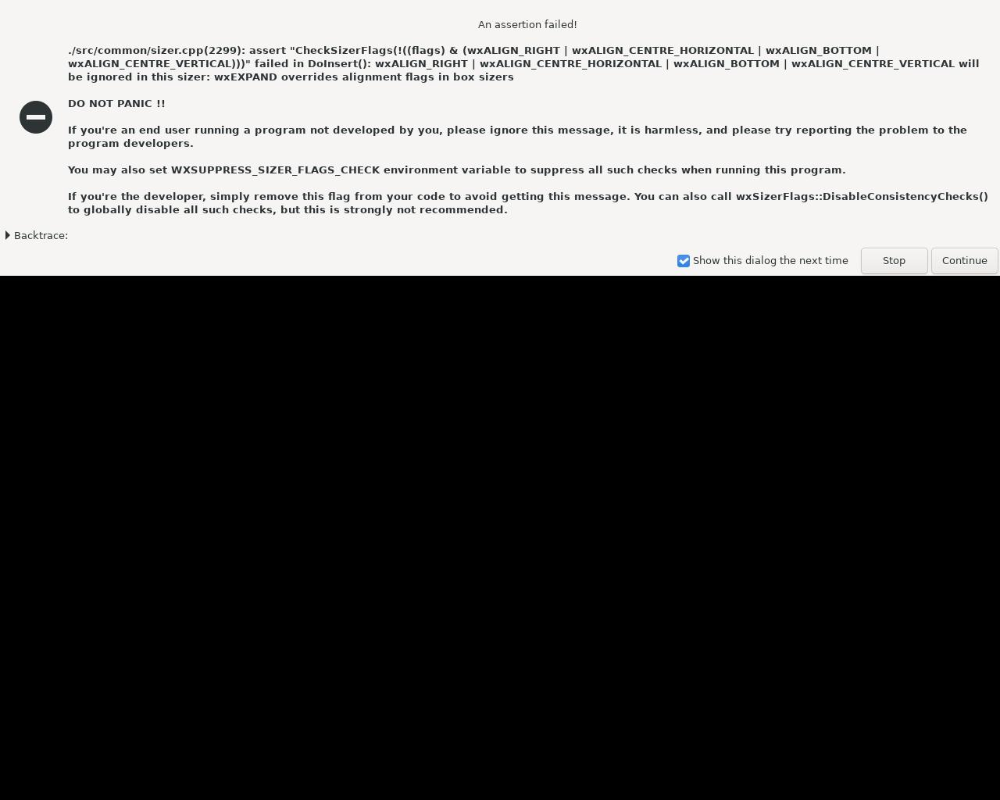 | N/A | N/A |
| [aeolus](./aeolus) | amd64  | ubuntu-noble | 0.10.4-1build3-20250327 | 失败 | N/A | N/A |
| [aerc](./aerc) | amd64  | ubuntu-noble | 0.17.0-1ubuntu0.24.04.2-20250327 | 失败 | N/A | N/A |
| [afterstep](./afterstep) | amd64  | ubuntu-noble | 2.2.12-17.1build3-20250327 | 失败 | N/A | N/A |
| [afterstep-data](./afterstep-data) | amd64  | ubuntu-noble | 2.2.12-17.1build3-20250327 | 失败 | N/A | N/A |
| [agenda.app](./agenda.app) | amd64  | ubuntu-noble | 0.46-3build3 |  | N/A | N/A |
| [aghermann](./aghermann) | amd64  | ubuntu-noble | 1.1.2-5build2 |  | N/A | N/A |
| [agordejo](./agordejo) | amd64  | ubuntu-noble | 0.4.2-0ubuntu1-20250327 | 失败 | N/A | N/A |
| [airstrike](./airstrike) | amd64  | ubuntu-noble | 0.99+1.0pre6a-11 |  | N/A | N/A |
| [aisleriot](./aisleriot) | amd64  | ubuntu-noble | 3.22.31-1build2 |  | N/A | N/A |
| [akira](./akira) | amd64  | ubuntu-noble | 0.0.16-2build2 |  | N/A | N/A |
| [akonadi-import-wizard](./akonadi-import-wizard) | amd64  | ubuntu-noble | 23.08.5-0ubuntu4 |  | N/A | N/A |
| [akonadiconsole](./akonadiconsole) | amd64  | ubuntu-noble | 23.08.5-0ubuntu5.2 |  | N/A | N/A |
| [akregator](./akregator) | amd64  | ubuntu-noble | 23.08.5-0ubuntu4.1 |  | N/A | N/A |
| [alacarte](./alacarte) | amd64  | ubuntu-noble | 3.52.0-1-20250327 | 失败 | N/A | N/A |
| [alacritty](./alacritty) | amd64  | deepin-v23 | 0.13.2-2 |  | [SHA256](./alacritty/SHA256SUMS) | N/A |
| [aladin](./aladin) | amd64  | ubuntu-noble | 12.060+dfsg-3 |  | N/A | N/A |
| [alarm-clock-applet](./alarm-clock-applet) | amd64  | ubuntu-noble | 0.4.1-5build2 |  | N/A | N/A |
| [alex4](./alex4) | amd64  | ubuntu-noble | 1.1-10ubuntu4-20250327 | 失败 | N/A | N/A |
| [algobox](./algobox) | amd64  | ubuntu-noble | 1.1.1+dfsg-1build2 |  | N/A | N/A |
| [alien-arena](./alien-arena) | amd64  | ubuntu-noble | 7.71.3+dfsg-3ubuntu1-20250327 | 失败 | N/A | N/A |
| [alienblaster](./alienblaster) | amd64  | ubuntu-noble | 1.1.0-11 |  | N/A | N/A |
| [aliki](./aliki) | amd64  | ubuntu-noble | 0.3.0-6build2 |   | N/A | N/A |
| [alkimia-bin](./alkimia-bin) | amd64  | ubuntu-noble | 8.1.2-2build2-20250327 | 失败 | N/A | N/A |
| [allure](./allure) | amd64  | ubuntu-noble | 0.11.0.0-1 |  | N/A | N/A |
| [almanah](./almanah) | amd64  | ubuntu-noble | 0.12.3-2build3 |  | N/A | N/A |
| [alsa-scarlett-gui](./alsa-scarlett-gui) | amd64  | ubuntu-noble | 0.4.0-1 |  | N/A | N/A |
| [alsa-tools-gui](./alsa-tools-gui) | amd64  | deepin-v23 | 1.2.11-1.1-20250327 | 失败 | N/A | N/A |
| [alsamixergui](./alsamixergui) | amd64  | ubuntu-noble | 0.9.0rc2-1-10.2build2 |  | N/A | N/A |
| [alsaplayer-common](./alsaplayer-common) | amd64  | ubuntu-noble | 0.99.81-2build6 |  | N/A | N/A |
| [altos](./altos) | amd64  | ubuntu-noble | 1.9.17-1ubuntu3 |    | N/A | N/A |
| [amberol](./amberol) | amd64  | ubuntu-noble | 0.10.3-3ubuntu1 |  | N/A | N/A |
| [amide](./amide) | amd64  | ubuntu-noble | 1.0.6-5build2 |  | N/A | N/A |
| [amoebax](./amoebax) | amd64  | ubuntu-noble | 0.2.1+dfsg-6 |  | N/A | N/A |
| [amphetamine](./amphetamine) | amd64  | ubuntu-noble | 0.8.10-21build1 |  | N/A | N/A |
| [ams](./ams) | amd64  | ubuntu-noble | 2.2.1-1build3-20250327 | 失败 | N/A | N/A |
| [amsynth](./amsynth) | amd64  | ubuntu-noble | 1.13.2-1build2 |  | N/A | N/A |
| [amule](./amule) | amd64  | ubuntu-noble | 2.3.3-3build5 |  | N/A | N/A |
| [amule-utils-gui](./amule-utils-gui) | amd64  | ubuntu-noble | 2.3.3-3build5 |    | N/A | N/A |
| [anarchism](./anarchism) | amd64  | ubuntu-noble | 15.3-3-20250327 | 失败 | N/A | N/A |
| [android-file-transfer](./android-file-transfer) | amd64  | ubuntu-noble | 4.3-1build3 |  | N/A | N/A |
| [angband-data](./angband-data) | amd64  | ubuntu-noble | 4.2.5+dfsg1-1-20250327 | 失败 | N/A | N/A |
| [angelfish](./angelfish) | amd64  | ubuntu-noble | 23.08.5-0ubuntu3-20250327 | 失败 | N/A | N/A |
| [angrydd](./angrydd) | amd64  | ubuntu-noble | 1.0.1-14 |  | N/A | N/A |
| [anki](./anki) | amd64  | ubuntu-noble | 2.1.15+dfsg-3ubuntu4.1 |  | N/A | N/A |
| [ansifilter-gui](./ansifilter-gui) | amd64  | ubuntu-noble | 2.18+dfsg1-2build2 |  | N/A | N/A |
| [antigravitaattori](./antigravitaattori) | amd64  | ubuntu-noble | 0.0.3-10build2-20250327 | 失败 | N/A | N/A |
| [antimicro](./antimicro) | amd64  | ubuntu-noble | 3.1.4-2 |  | N/A | N/A |
| [antimony](./antimony) | amd64  | ubuntu-noble | 0.9.3-2build9 |  | N/A | N/A |
| [anymeal](./anymeal) | amd64  | ubuntu-noble | 1.26-1build2 |  | N/A | N/A |
| [aobook](./aobook) | amd64  | ubuntu-noble | 1.0.3-3build2 |  | N/A | N/A |
| [aoflagger](./aoflagger) | amd64  | ubuntu-noble | 3.4.0-2build4 |   | N/A | N/A |
| [apitrace-gui](./apitrace-gui) | amd64  | ubuntu-noble | 11.1+repack-1.2build3 |  | N/A | N/A |
| [apostrophe](./apostrophe) | amd64  | ubuntu-noble | 2.6.3-4-20250327 | 失败 | N/A | N/A |
| [apper](./apper) | amd64  | ubuntu-noble | 1.0.0-5build2-20250327 | 失败 | N/A | N/A |
| [apport-gtk](./apport-gtk) | amd64  | ubuntu-noble | 2.28.1-0ubuntu3.5-20250327 | 失败 | N/A | N/A |
| [apport-kde](./apport-kde) | amd64  | ubuntu-noble | 2.28.1-0ubuntu3.5-20250327 | 失败 | N/A | N/A |
| [apt-offline-gui](./apt-offline-gui) | amd64  | ubuntu-noble | 1.8.5-1 |  | N/A | N/A |
| [apturl-common](./apturl-common) | amd64  | ubuntu-noble | 0.5.2ubuntu23-20250327 | 失败 | N/A | N/A |
| [apvlv](./apvlv) | amd64  | ubuntu-noble | 0.5.0+repack-2build3 |  | N/A | N/A |
| [aqemu](./aqemu) | amd64  | ubuntu-noble | 0.9.2-3ubuntu2 |  | N/A | N/A |
| [arandr](./arandr) | amd64  | ubuntu-noble | 0.1.11-1-20250327 | 失败 | N/A | N/A |
| [aranym](./aranym) | amd64  | ubuntu-noble | 1.1.0-2 |    | N/A | N/A |
| [aravis-tools](./aravis-tools) | amd64  | ubuntu-noble | 0.8.30-1build2-20250327 | 失败 | N/A | N/A |
| [arb](./arb) | amd64  | ubuntu-noble | 6.0.6-7build3-20250327 | 失败 | N/A | N/A |
| [arc-gui-clients](./arc-gui-clients) | amd64  | ubuntu-noble | 0.4.6-7build5 |     | N/A | N/A |
| [ardentryst](./ardentryst) | amd64  | ubuntu-noble | 1.71-10 |  | N/A | N/A |
| [ardour](./ardour) | amd64  | ubuntu-noble | 8.4.0+ds1-2ubuntu8 |  | N/A | N/A |
| [arduino](./arduino) | amd64  | ubuntu-noble | 1.8.19+dfsg1-2 |  | N/A | N/A |
| [ares](./ares) | amd64  | ubuntu-noble | 134+dfsg-1build2 |  | N/A | N/A |
| [ario](./ario) | amd64  | ubuntu-noble | 1.6-1.2build4 |  | N/A | N/A |
| [ark](./ark) | amd64  | ubuntu-noble | 23.08.5-0ubuntu5 |  | N/A | N/A |
| [armagetronad](./armagetronad) | amd64  | ubuntu-noble | 0.2.9.1.1-1build2 |  | N/A | N/A |
| [arqiver](./arqiver) | amd64  | ubuntu-noble | 0.9.0-1build2 |  | N/A | N/A |
| [artemis](./artemis) | amd64  | ubuntu-noble | 18.2.0+dfsg-3 |     | N/A | N/A |
| [artha](./artha) | amd64  | ubuntu-noble | 1.0.5-3build2 |  | N/A | N/A |
| [artikulate](./artikulate) | amd64  | ubuntu-noble | 23.08.5-0ubuntu3 |  | N/A | N/A |
| [asc](./asc) | amd64  | ubuntu-noble | 2.6.1.0-9build5 |  | N/A | N/A |
| [asciijump](./asciijump) | amd64  | ubuntu-noble | 1.0.2~beta-10-20250327 | 失败 | N/A | N/A |
| [ase](./ase) | amd64  | ubuntu-noble | 3.22.1-4 |  | N/A | N/A |
| [aseba](./aseba) | amd64  | ubuntu-noble | 1.6.99+dfsg-9build2 |        | N/A | N/A |
| [assaultcube](./assaultcube) | amd64  | ubuntu-noble | 1.3.0.2+dfsg-5 |  | N/A | N/A |
| [astromenace](./astromenace) | amd64  | ubuntu-noble | 1.3.2+repack-7 |  | N/A | N/A |
| [asunder](./asunder) | amd64  | ubuntu-noble | 3.0.1+ds-1build2 |  | N/A | N/A |
| [asylum](./asylum) | amd64  | ubuntu-noble | 0.3.2-3build1 |  | N/A | N/A |
| [atanks](./atanks) | amd64  | ubuntu-noble | 6.6~dfsg-1build2 |  | N/A | N/A |
| [atari800](./atari800) | amd64  | ubuntu-noble | 5.0.0-1build2 |  | N/A | N/A |
| [atomes](./atomes) | amd64  | ubuntu-noble | 1.1.12+repack-2ubuntu2 |  | N/A | N/A |
| [atomix](./atomix) | amd64  | ubuntu-noble | 44.0-3build3 |  | N/A | N/A |
| [atril](./atril) | amd64  | ubuntu-noble | 1.26.2-3build2 |  | N/A | N/A |
| [audacious](./audacious) | amd64  | ubuntu-noble | 4.3.1-2.1build2 |  | N/A | N/A |
| [audacity](./audacity) | amd64  | deepin-v23 | 3.4.2+dfsg-1deepin0 |  | [SHA256](./audacity/SHA256SUMS) | N/A |
| [audmes](./audmes) | amd64  | ubuntu-noble | 2024.02.18-1build2 |  | N/A | N/A |
| [aumix](./aumix) | amd64  | ubuntu-noble | 2.9.1-7.1-20250327 | 失败 | N/A | N/A |
| [auralquiz](./auralquiz) | amd64  | ubuntu-noble | 1.0.0-3build3 |  | N/A | N/A |
| [aurora-printer-a121](./aurora-printer-a121) | amd64  | deepin-v23 | 1.0.3-20250327 | 失败 | N/A | N/A |
| [ausweisapp](./ausweisapp) | amd64  | ubuntu-noble | 2.1.0-1build1 |  | N/A | N/A |
| [auto-multiple-choice](./auto-multiple-choice) | amd64  | ubuntu-noble | 1.6.0-3build4-20250327 | 失败 | N/A | N/A |
| [autokey-gtk](./autokey-gtk) | amd64  | ubuntu-noble | 0.95.10-2.1-20250327 | 失败 | N/A | N/A |
| [autokey-qt](./autokey-qt) | amd64  | ubuntu-noble | 0.95.10-2.1 |  | N/A | N/A |
| [autorenamer](./autorenamer) | amd64  | ubuntu-noble | 0.6-1-20250327 | 失败 | N/A | N/A |
| [avahi-discover](./avahi-discover) | amd64  | ubuntu-noble | 0.8-13ubuntu6-20250327 | 失败 | N/A | N/A |
| [avahi-ui-utils](./avahi-ui-utils) | amd64  | ubuntu-noble | 0.8-13ubuntu6 |   | N/A | N/A |
| [avogadro](./avogadro) | amd64  | ubuntu-noble | 1.99.0-1build2 |  | N/A | N/A |
| [awf-gtk3](./awf-gtk3) | amd64  | ubuntu-noble | 2.8.0-1build2 |  | N/A | N/A |
| [awf-gtk4](./awf-gtk4) | amd64  | ubuntu-noble | 2.8.0-1build2 |  | N/A | N/A |
| [ayatana-settings](./ayatana-settings) | amd64  | ubuntu-noble | 23.11.14-1-20250327 | 失败 | N/A | N/A |
| [ayatana-webmail](./ayatana-webmail) | amd64  | ubuntu-noble | 23.12.25+dfsg-1-20250327 | 失败 | N/A | N/A |
| [backintime-qt](./backintime-qt) | amd64  | ubuntu-noble | 1.4.3-1 |  | N/A | N/A |
| [bacula-console-qt](./bacula-console-qt) | amd64  | ubuntu-noble | 13.0.4-1build3 |  | N/A | N/A |
| [bacula-tray-monitor](./bacula-tray-monitor) | amd64  | ubuntu-noble | 13.0.4-1build3 |  | N/A | N/A |
| [ballerburg](./ballerburg) | amd64  | ubuntu-noble | 1.2.1-1 | 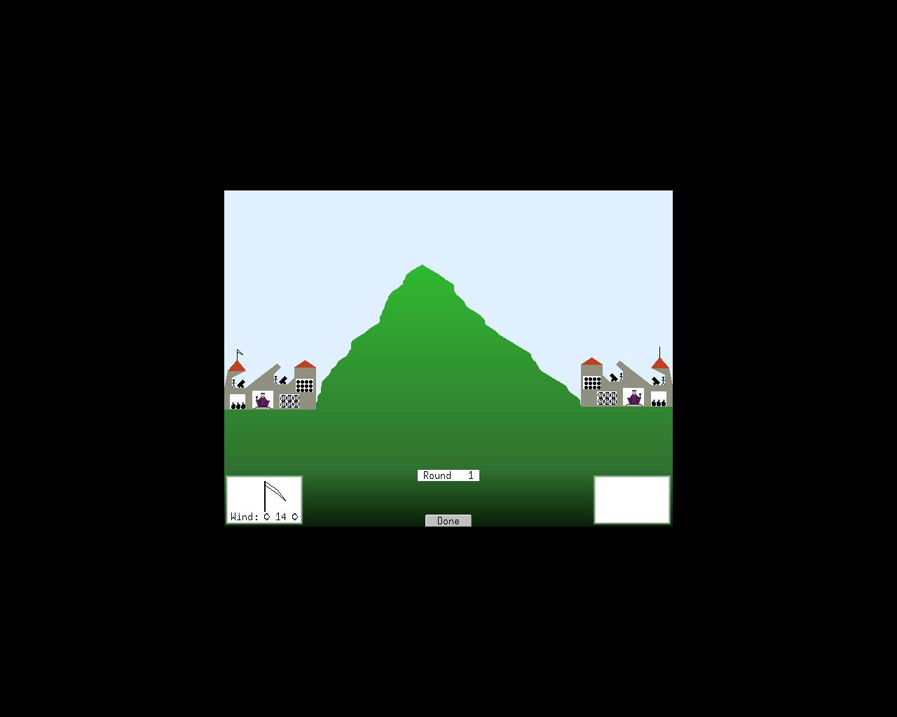 | N/A | N/A |
| [ballview](./ballview) | amd64  | ubuntu-noble | 1.5.0+git20180813.37fc53c-11build5 |  | N/A | N/A |
| [ballz](./ballz) | amd64  | ubuntu-noble | 1.0.4-1.1build2 |  | N/A | N/A |
| [balsa](./balsa) | amd64  | ubuntu-noble | 2.6.4-2build5-20250327 | 失败 | N/A | N/A |
| [bambam](./bambam) | amd64  | ubuntu-noble | 1.2.1+dfsg-1 |  | N/A | N/A |
| [bambootracker](./bambootracker) | amd64  | ubuntu-noble | 0.6.1-1build2-20250327 | 失败 | N/A | N/A |
| [baobab](./baobab) | amd64  | ubuntu-noble | 46.0-1build1 |  | N/A | N/A |
| [barrage](./barrage) | amd64  | ubuntu-noble | 1.0.5-1 |  | N/A | N/A |
| [barrier](./barrier) | amd64  | ubuntu-noble | 2.4.0+dfsg-4build3 |  | N/A | N/A |
| [basex](./basex) | amd64  | ubuntu-noble | 10.5-1-20250327 | 失败 | N/A | N/A |
| [basic256](./basic256) | amd64  | ubuntu-noble | 2.0.99.7-2build3 |  | N/A | N/A |
| [basilisk2](./basilisk2) | amd64  | ubuntu-noble | 0.9.20240401-1 |  | N/A | N/A |
| [basket](./basket) | amd64  | ubuntu-noble | 2.49-1build3 |  | N/A | N/A |
| [bastet](./bastet) | amd64  | ubuntu-noble | 0.43-7build1-20250327 | 失败 | N/A | N/A |
| [batmon.app](./batmon.app) | amd64  | ubuntu-noble | 0.9-2build5 |  | N/A | N/A |
| [battery-stats](./battery-stats) | amd64  | ubuntu-noble | 0.5.6-2.1 |  | N/A | N/A |
| [bb](./bb) | amd64  | deepin-v23 | 1.3rc1-13 | 失败 | [SHA256](./bb/SHA256SUMS) | N/A |
| [bbpager](./bbpager) | amd64  | ubuntu-noble | 0.4.7-10-20250327 | 失败 | N/A | N/A |
| [bcnc](./bcnc) | amd64  | ubuntu-noble | 0.9.14.318+ds-4 |  | N/A | N/A |
| [bdbvu](./bdbvu) | amd64  | ubuntu-noble | 0.1-3.1build2 |  | N/A | N/A |
| [beads](./beads) | amd64  | ubuntu-noble | 1.1.22-1build4 |  | N/A | N/A |
| [bear-factory](./bear-factory) | amd64  | ubuntu-noble | 0.6.0-8build5 |    | N/A | N/A |
| [beneath-a-steel-sky](./beneath-a-steel-sky) | amd64  | ubuntu-noble | 0.0372-8 |  | N/A | N/A |
| [berusky](./berusky) | amd64  | ubuntu-noble | 1.7.2-3build2 |  | N/A | N/A |
| [berusky2](./berusky2) | amd64  | ubuntu-noble | 0.12-4 |  | N/A | N/A |
| [bespokesynth](./bespokesynth) | amd64  | ubuntu-noble | 1.2.1+dfsg-4build4 |  | N/A | N/A |
| [betaradio](./betaradio) | amd64  | ubuntu-noble | 1.6-1build3 |  | N/A | N/A |
| [between](./between) | amd64  | ubuntu-noble | 6+dfsg1-4 |  | N/A | N/A |
| [bibledit](./bibledit) | amd64  | ubuntu-noble | 5.1.002-1build5 |  | N/A | N/A |
| [bibletime](./bibletime) | amd64  | ubuntu-noble | 3.0.3-3build2 |  | N/A | N/A |
| [bibshelf](./bibshelf) | amd64  | ubuntu-noble | 1.6.0-0ubuntu9 |  | N/A | N/A |
| [biglybt](./biglybt) | amd64  | ubuntu-noble | 3.4.0.0-1-20250327 | 失败 | N/A | N/A |
| [bijiben](./bijiben) | amd64  | ubuntu-noble | 40.1-6build4-20250327 | 失败 | N/A | N/A |
| [billard-gl](./billard-gl) | amd64  | ubuntu-noble | 1.75-17build2 |  | N/A | N/A |
| [biloba](./biloba) | amd64  | ubuntu-noble | 0.9.3-11 |  | N/A | N/A |
| [biniax2](./biniax2) | amd64  | ubuntu-noble | 1.30-7 |  | N/A | N/A |
| [bino](./bino) | amd64  | ubuntu-noble | 2.1-1build2-20250327 | 失败 | N/A | N/A |
| [biogenesis](./biogenesis) | amd64  | ubuntu-noble | 0.8-3.1 |  | N/A | N/A |
| [birdfont](./birdfont) | amd64  | ubuntu-noble | 2.33.1-3build3 |  | N/A | N/A |
| [bisheng-engine](./bisheng-engine) | amd64  | deepin-v23 | 2.0.14-1 | 失败 | [SHA256](./bisheng-engine/SHA256SUMS) | N/A |
| [bitsnpicas](./bitsnpicas) | amd64  | ubuntu-noble | 2.0+ds-2-20250327 | 失败 | N/A | N/A |
| [biz.zcjt.gaopaiyi](./biz.zcjt.gaopaiyi) | amd64  | deepin-v23 | 1.0.0-20250327 | 失败 | N/A | N/A |
| [biz.zcjt.scanner](./biz.zcjt.scanner) | amd64  | deepin-v23 | 1.0.2.0-20250327 | 失败 | N/A | N/A |
| [biz.zcjt.zc-a5930dn](./biz.zcjt.zc-a5930dn) | amd64  | deepin-v23 | 1.0.0-23166 |   | N/A | N/A |
| [biz.zcjt.zc-a5933dn](./biz.zcjt.zc-a5933dn) | amd64  | deepin-v23 | 1.0.0-23324 |   | N/A | N/A |
| [biz.zcjt.zhongchu-sane](./biz.zcjt.zhongchu-sane) | amd64  | deepin-v23 | 20240911-6.6.10.030-20250327 | 失败 | N/A | N/A |
| [bkchem](./bkchem) | amd64  | ubuntu-noble | 0.14.0~pre4+git20211228-3-20250327 | 失败 | N/A | N/A |
| [black-box](./black-box) | amd64  | ubuntu-noble | 1.4.8-4build1 |  | N/A | N/A |
| [blackbox-terminal](./blackbox-terminal) | amd64  | ubuntu-noble | 0.14.0-2build2 |  | N/A | N/A |
| [blastem](./blastem) | amd64  | ubuntu-noble | 0.6.3.4-1build1 | 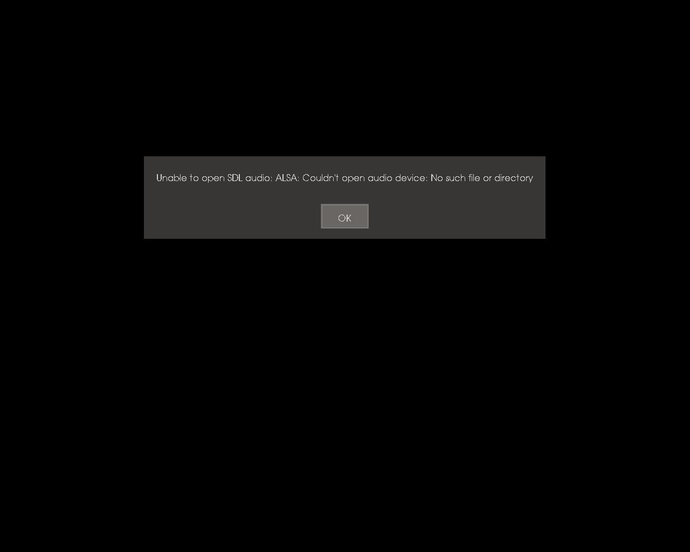 | N/A | N/A |
| [bleachbit](./bleachbit) | amd64  | ubuntu-noble | 4.6.0-3-20250327 | 失败 | N/A | N/A |
| [blender](./blender) | amd64  | ubuntu-noble | 4.0.2+dfsg-1ubuntu8 |  | N/A | N/A |
| [blinken](./blinken) | amd64  | ubuntu-noble | 23.08.5-0ubuntu4 |  | N/A | N/A |
| [blobandconquer](./blobandconquer) | amd64  | ubuntu-noble | 1.11-dfsg+20-2-20250327 | 失败 | N/A | N/A |
| [blobby](./blobby) | amd64  | ubuntu-noble | 1.1+ds-1ubuntu1 |  | N/A | N/A |
| [bloboats](./bloboats) | amd64  | ubuntu-noble | 1.0.2+dfsg-4 |  | N/A | N/A |
| [blobwars](./blobwars) | amd64  | ubuntu-noble | 2.00-4ubuntu1 |  | N/A | N/A |
| [blockattack](./blockattack) | amd64  | ubuntu-noble | 2.8.0-1build1 |  | N/A | N/A |
| [blockout2](./blockout2) | amd64  | ubuntu-noble | 2.5+dfsg1-1build3 |  | N/A | N/A |
| [blocks-of-the-undead](./blocks-of-the-undead) | amd64  | ubuntu-noble | 1.0-7build1 |  | N/A | N/A |
| [bluedevil](./bluedevil) | amd64  | ubuntu-noble | 5.27.11-0ubuntu2 |  | N/A | N/A |
| [bluefish](./bluefish) | amd64  | ubuntu-noble | 2.2.15-1 |  | N/A | N/A |
| [blueman](./blueman) | amd64  | deepin-v23 | 2.3.5-3deepin0+rb1-20250327 | 失败 | N/A | N/A |
| [blupimania](./blupimania) | amd64  | ubuntu-noble | 1.6.2-17-g5f6cf8b-1 |  | N/A | N/A |
| [boats](./boats) | amd64  | ubuntu-noble | 202008-1build2 |  | N/A | N/A |
| [boinc-manager](./boinc-manager) | amd64  | ubuntu-noble | 7.24.1+dfsg-4build1 |  | N/A | N/A |
| [bomber](./bomber) | amd64  | ubuntu-noble | 23.08.5-0ubuntu3 |  | N/A | N/A |
| [bomberclone](./bomberclone) | amd64  | ubuntu-noble | 0.11.9-7.1 |  | N/A | N/A |
| [bookletimposer](./bookletimposer) | amd64  | ubuntu-noble | 0.3.1-4ubuntu1-20250327 | 失败 | N/A | N/A |
| [bookworm](./bookworm) | amd64  | ubuntu-noble | 1.1.2+git20210715-4build3 |  | N/A | N/A |
| [boomaga](./boomaga) | amd64  | ubuntu-noble | 3.0.0+git13-g7f7ad47-1build4 |  | N/A | N/A |
| [bossa](./bossa) | amd64  | ubuntu-noble | 1.9.1-3ubuntu5 |  | N/A | N/A |
| [boswars](./boswars) | amd64  | ubuntu-noble | 2.8-2build2 |  | N/A | N/A |
| [bouncy](./bouncy) | amd64  | ubuntu-noble | 0.6.20071104-9 |  | N/A | N/A |
| [bovo](./bovo) | amd64  | ubuntu-noble | 23.08.5-0ubuntu3 |  | N/A | N/A |
| [bpython](./bpython) | amd64  | ubuntu-noble | 0.24-1 |  | N/A | N/A |
| [brainparty](./brainparty) | amd64  | ubuntu-noble | 0.61+dfsg-7 |  | N/A | N/A |
| [brasero](./brasero) | amd64  | ubuntu-noble | 3.12.3-2build4 |  | N/A | N/A |
| [brewtarget](./brewtarget) | amd64  | ubuntu-noble | 3.0.6-1build2 |  | N/A | N/A |
| [briquolo](./briquolo) | amd64  | ubuntu-noble | 0.5.7-11build2 |  | N/A | N/A |
| [brp-pacu](./brp-pacu) | amd64  | ubuntu-noble | 2.1.2+git20210421-1build2 |  | N/A | N/A |
| [brutalchess](./brutalchess) | amd64  | ubuntu-noble | 0.5.2+dfsg-8build1 |  | N/A | N/A |
| [bsdgames](./bsdgames) | amd64  | ubuntu-noble | 2.17-33 |           | N/A | N/A |
| [btanks](./btanks) | amd64  | ubuntu-noble | 0.9.8083-9build1 |  | N/A | N/A |
| [btop](./btop) | amd64  | deepin-v23 | 1.3.0-1 | 失败 | [SHA256](./btop/SHA256SUMS) | N/A |
| [budgie-arm-environment](./budgie-arm-environment) | amd64  | ubuntu-noble | 0.20.13-20250327 | 失败 | N/A | N/A |
| [budgie-control-center](./budgie-control-center) | amd64  | ubuntu-noble | 1.4.0-2build3-20250327 | 失败 | N/A | N/A |
| [budgie-core](./budgie-core) | amd64  | ubuntu-noble | 10.9.1-3ubuntu4-20250327 | 失败 | N/A | N/A |
| [budgie-desktop-environment](./budgie-desktop-environment) | amd64  | ubuntu-noble | 0.20.13-20250327 | 失败 | N/A | N/A |
| [budgie-desktop-view](./budgie-desktop-view) | amd64  | ubuntu-noble | 1.3-2build1-20250327 | 失败 | N/A | N/A |
| [budgie-hotcorners-applet](./budgie-hotcorners-applet) | amd64  | ubuntu-noble | 1.8.0-1build3 |  | N/A | N/A |
| [budgie-previews](./budgie-previews) | amd64  | ubuntu-noble | 1.8.0-1build3 |  | N/A | N/A |
| [budgie-quickchar](./budgie-quickchar) | amd64  | ubuntu-noble | 1.8.0-1build3-20250327 | 失败 | N/A | N/A |
| [budgie-wallstreet](./budgie-wallstreet) | amd64  | ubuntu-noble | 1.8.0-1build3 |  | N/A | N/A |
| [budgie-welcome](./budgie-welcome) | amd64  | ubuntu-noble | 0.6.1 |     | N/A | N/A |
| [budgie-window-shuffler](./budgie-window-shuffler) | amd64  | ubuntu-noble | 1.8.0-1build3 |  | N/A | N/A |
| [bugsquish](./bugsquish) | amd64  | ubuntu-noble | 0.0.6-10 |  | N/A | N/A |
| [bumprace](./bumprace) | amd64  | ubuntu-noble | 1.5.8-1 |  | N/A | N/A |
| [burgerspace](./burgerspace) | amd64  | ubuntu-noble | 1.9.5-1build1 |  | N/A | N/A |
| [bustle](./bustle) | amd64  | ubuntu-noble | 0.8.0-2build2 |  | N/A | N/A |
| [butt](./butt) | amd64  | ubuntu-noble | 0.1.37-2build4 |  | N/A | N/A |
| [buzztrax](./buzztrax) | amd64  | ubuntu-noble | 0.10.2-9build2 |  | N/A | N/A |
| [bzflag-client](./bzflag-client) | amd64  | ubuntu-noble | 2.4.26-1build3 |  | N/A | N/A |
| [c-evo-dh-gtk2](./c-evo-dh-gtk2) | amd64  | ubuntu-noble | 1.10-1build3 |   | N/A | N/A |
| [cadabra2](./cadabra2) | amd64  | ubuntu-noble | 2.4.5.4-0ubuntu1-20250327 | 失败 | N/A | N/A |
| [caffeine](./caffeine) | amd64  | ubuntu-noble | 2.9.12-1-20250327 | 失败 | N/A | N/A |
| [cairo-dock-core](./cairo-dock-core) | amd64  | ubuntu-noble | 3.4.1+git20201103.0836f5d1-1build3 |   | N/A | N/A |
| [caja](./caja) | amd64  | ubuntu-noble | 1.26.3-1build3-20250327 | 失败 | N/A | N/A |
| [caja-actions](./caja-actions) | amd64  | ubuntu-noble | 1.27.0-1build3 |  | N/A | N/A |
| [caja-dropbox](./caja-dropbox) | amd64  | ubuntu-noble | 1.26.0-4build2-20250327 | 失败 | N/A | N/A |
| [caja-eiciel](./caja-eiciel) | amd64  | ubuntu-noble | 1.20.1-3build2 |  | N/A | N/A |
| [caja-seahorse](./caja-seahorse) | amd64  | ubuntu-noble | 1.18.5-3-20250327 | 失败 | N/A | N/A |
| [calamares](./calamares) | amd64  | ubuntu-noble | 3.3.5-0ubuntu4-20250327 | 失败 | N/A | N/A |
| [calamares-settings-debian](./calamares-settings-debian) | amd64  | ubuntu-noble | 13.0.5-1-20250327 | 失败 | N/A | N/A |
| [calamares-settings-kubuntu](./calamares-settings-kubuntu) | amd64  | ubuntu-noble | 24.04.40-20250327 | 失败 | N/A | N/A |
| [calamares-settings-lubuntu](./calamares-settings-lubuntu) | amd64  | ubuntu-noble | 24.04.40-20250327 | 失败 | N/A | N/A |
| [calamares-settings-ubuntu-unity](./calamares-settings-ubuntu-unity) | amd64  | ubuntu-noble | 24.04.40-20250327 | 失败 | N/A | N/A |
| [calc-common](./calc-common) | amd64  | ubuntu-noble | 2.15.0.4-1build2-20250327 | 失败 | N/A | N/A |
| [calf-plugins](./calf-plugins) | amd64  | ubuntu-noble | 0.90.3-4build2-20250327 | 失败 | N/A | N/A |
| [calibre](./calibre) | amd64  | ubuntu-noble | 7.6.0+ds-1build1-20250327 | 失败 | N/A | N/A |
| [calindori](./calindori) | amd64  | ubuntu-noble | 23.08.5-0ubuntu4 |  | N/A | N/A |
| [calligra-data](./calligra-data) | amd64  | ubuntu-noble | 3.2.1+dfsg-8build4-20250327 | 失败 | N/A | N/A |
| [calligra-gemini](./calligra-gemini) | amd64  | ubuntu-noble | 3.2.1+dfsg-8build4 |  | N/A | N/A |
| [calligraplan](./calligraplan) | amd64  | ubuntu-noble | 3.3.0-2build2 |   | N/A | N/A |
| [calligrasheets](./calligrasheets) | amd64  | ubuntu-noble | 3.2.1+dfsg-8build4 |  | N/A | N/A |
| [calligrastage](./calligrastage) | amd64  | ubuntu-noble | 3.2.1+dfsg-8build4 |  | N/A | N/A |
| [calligrawords](./calligrawords) | amd64  | ubuntu-noble | 3.2.1+dfsg-8build4 |  | N/A | N/A |
| [camera.app](./camera.app) | amd64  | ubuntu-noble | 0.8.0-13build4 |  | N/A | N/A |
| [camitk-actionstatemachine](./camitk-actionstatemachine) | amd64  | ubuntu-noble | 5.2.0-1build7-20250327 | 失败 | N/A | N/A |
| [camitk-imp](./camitk-imp) | amd64  | ubuntu-noble | 5.2.0-1build7-20250327 | 失败 | N/A | N/A |
| [caneda](./caneda) | amd64  | ubuntu-noble | 0.3.1+gitg08e22168-1build2 |  | N/A | N/A |
| [cantata](./cantata) | amd64  | ubuntu-noble | 2.5.0.ds1-2build3 |  | N/A | N/A |
| [cantor](./cantor) | amd64  | ubuntu-noble | 23.08.5-0ubuntu4.2 |  | N/A | N/A |
| [carburetor](./carburetor) | amd64  | ubuntu-noble | 4.5.1-1-20250327 | 失败 | N/A | N/A |
| [cardpeek](./cardpeek) | amd64  | ubuntu-noble | 0.8.4-1.3build1 |  | N/A | N/A |
| [carla](./carla) | amd64  | ubuntu-noble | 2.5.8-0ubuntu5 | 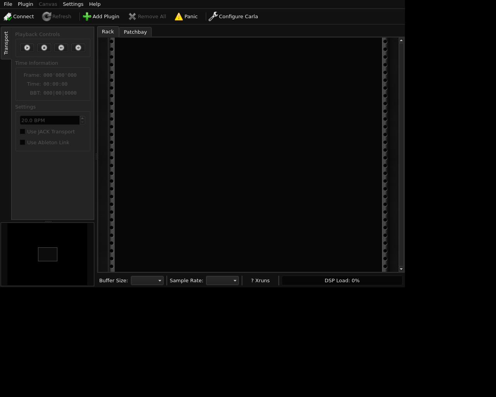 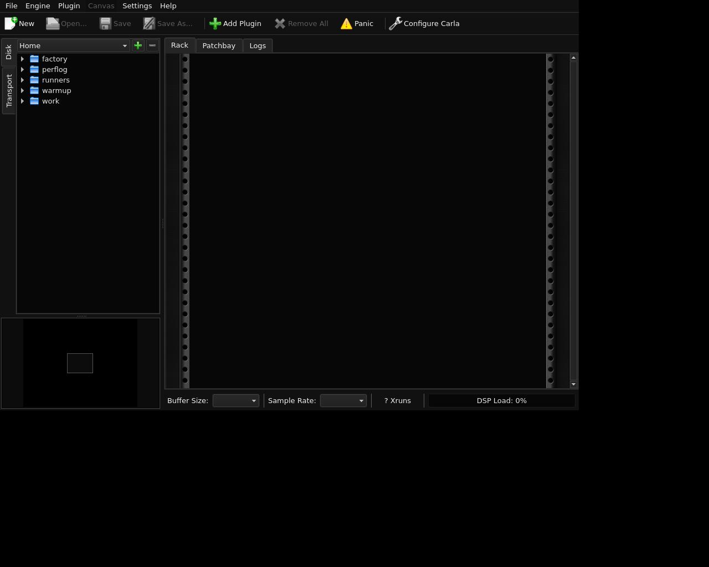 | N/A | N/A |
| [carmetal](./carmetal) | amd64  | ubuntu-noble | 4.3-2-20250327 | 失败 | N/A | N/A |
| [cataclysm-dda-sdl](./cataclysm-dda-sdl) | amd64  | deepin-v23 | 0.G-4deepin1 |  | [SHA256](./cataclysm-dda-sdl/SHA256SUMS) | N/A |
| [catfish](./catfish) | amd64  | ubuntu-noble | 4.16.4-2-20250327 | 失败 | N/A | N/A |
| [caveexpress](./caveexpress) | amd64  | ubuntu-noble | 2.5.2-2 |  | N/A | N/A |
| [cavepacker](./cavepacker) | amd64  | ubuntu-noble | 2.5.2-2 |  | N/A | N/A |
| [cb2bib](./cb2bib) | amd64  | ubuntu-noble | 2.0.1-2build2 |   | N/A | N/A |
| [cc.lotuscard.demo](./cc.lotuscard.demo) | amd64  | deepin-v23 | 1.0.0.0-20250327 | 失败 | N/A | N/A |
| [cdogs-sdl](./cdogs-sdl) | amd64  | ubuntu-noble | 2.0.0+dfsg-1 |  | N/A | N/A |
| [cecilia](./cecilia) | amd64  | ubuntu-noble | 5.4.1-2 |  | N/A | N/A |
| [ceferino](./ceferino) | amd64  | ubuntu-noble | 0.97.8+svn37-3 |  | N/A | N/A |
| [celluloid](./celluloid) | amd64  | ubuntu-noble | 0.26-1build2 |  | N/A | N/A |
| [cen64-qt](./cen64-qt) | amd64  | ubuntu-noble | 20200219-alpha-1build2 | 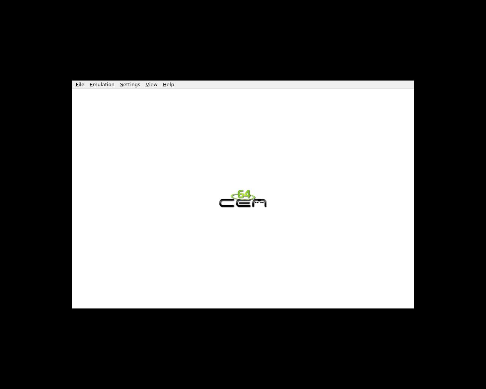 | N/A | N/A |
| [ceni](./ceni) | amd64  | ubuntu-noble | 2.33-4-20250327 | 失败 | N/A | N/A |
| [cenon.app](./cenon.app) | amd64  | ubuntu-noble | 4.0.6+ds1-2build5 |  | N/A | N/A |
| [cervisia](./cervisia) | amd64  | ubuntu-noble | 23.08.5-0ubuntu3 |  | N/A | N/A |
| [cf900](./cf900) | amd64  | deepin-v23 | 1.0 |   | [SHA256](./cf900/SHA256SUMS) | N/A |
| [cgoban](./cgoban) | amd64  | deepin-v23 | 1.9.14-19 | 失败 | [SHA256](./cgoban/SHA256SUMS) | N/A |
| [charmap.app](./charmap.app) | amd64  | ubuntu-noble | 0.3~rc1-4build3 |  | N/A | N/A |
| [charmtimetracker](./charmtimetracker) | amd64  | ubuntu-noble | 1.12.0-3build2 |  | N/A | N/A |
| [chatty](./chatty) | amd64  | ubuntu-noble | 0.8.2-1ubuntu2 |  | N/A | N/A |
| [cheese](./cheese) | amd64  | ubuntu-noble | 44.1-1build4 |  | N/A | N/A |
| [cheesecutter](./cheesecutter) | amd64  | ubuntu-noble | 2.9+git20211011-2-20250327 | 失败 | N/A | N/A |
| [chemtool](./chemtool) | amd64  | ubuntu-noble | 1.6.14-6build2 |  | N/A | N/A |
| [cherrytree](./cherrytree) | amd64  | ubuntu-noble | 1.1.2+dfsg-1 |  | N/A | N/A |
| [chessx](./chessx) | amd64  | ubuntu-noble | 1.4.6-2build3 |  | N/A | N/A |
| [chewing-editor](./chewing-editor) | amd64  | ubuntu-noble | 0.1.1-5build2 |  | N/A | N/A |
| [chiaki](./chiaki) | amd64  | ubuntu-noble | 2.2.0-1build3 |  | N/A | N/A |
| [chirp](./chirp) | amd64  | ubuntu-noble | 20240224-1ubuntu0.1 |  | N/A | N/A |
| [chocolate-doom](./chocolate-doom) | amd64  | ubuntu-noble | 3.0.1+really3.0.0+git1548-1build2 |    | N/A | N/A |
| [choqok](./choqok) | amd64  | ubuntu-noble | 1.7.0-2build2 |  | N/A | N/A |
| [chroma](./chroma) | amd64  | ubuntu-noble | 1.19-1ubuntu1 |  | N/A | N/A |
| [chromium](./chromium) | amd64  | deepin-v23 | 128.0.6613.84-1deepin1-20250327 | 失败 | N/A | N/A |
| [chromium-browser](./chromium-browser) | amd64  | ubuntu-noble | 1snap1-0ubuntu2-20250327 | 失败 | N/A | N/A |
| [chromium-bsu](./chromium-bsu) | amd64  | ubuntu-noble | 0.9.16.1-3 |  | N/A | N/A |
| [chromono](./chromono) | amd64  | ubuntu-noble | 1.1.1-1.1 |  | N/A | N/A |
| [cinnamon](./cinnamon) | amd64  | ubuntu-noble | 6.0.4-4-20250327 | 失败 | N/A | N/A |
| [cinnamon-control-center](./cinnamon-control-center) | amd64  | ubuntu-noble | 6.0.1-3-20250327 | 失败 | N/A | N/A |
| [cinnamon-screensaver](./cinnamon-screensaver) | amd64  | ubuntu-noble | 6.0.3-1build2-20250327 | 失败 | N/A | N/A |
| [cinnamon-settings-daemon](./cinnamon-settings-daemon) | amd64  | ubuntu-noble | 6.0.0-1build4-20250327 | 失败 | N/A | N/A |
| [circuslinux](./circuslinux) | amd64  | ubuntu-noble | 1.0.3-35 |  | N/A | N/A |
| [citizen-cx-02-printerdriver](./citizen-cx-02-printerdriver) | amd64  | deepin-v23 | 1.0.0-0 | 失败 | [SHA256](./citizen-cx-02-printerdriver/SHA256SUMS) | N/A |
| [citizen-cx-02s-printerdriver](./citizen-cx-02s-printerdriver) | amd64  | deepin-v23 | 1.0.0-0 | 失败 | [SHA256](./citizen-cx-02s-printerdriver/SHA256SUMS) | N/A |
| [citizen-cx-02w-printerdriver](./citizen-cx-02w-printerdriver) | amd64  | deepin-v23 | 1.0.0-0 | 失败 | [SHA256](./citizen-cx-02w-printerdriver/SHA256SUMS) | N/A |
| [citizen-cy-printerdriver](./citizen-cy-printerdriver) | amd64  | deepin-v23 | 1.0.0-0 | 失败 | [SHA256](./citizen-cy-printerdriver/SHA256SUMS) | N/A |
| [citizen-cz-01-printerdriver](./citizen-cz-01-printerdriver) | amd64  | deepin-v23 | 1.0.0-0 | 失败 | [SHA256](./citizen-cz-01-printerdriver/SHA256SUMS) | N/A |
| [ckb-next](./ckb-next) | amd64  | ubuntu-noble | 0.6.0+dfsg-0.2build2 |  | N/A | N/A |
| [clamtk](./clamtk) | amd64  | ubuntu-noble | 6.07-1.1-20250327 | 失败 | N/A | N/A |
| [clamz](./clamz) | amd64  | ubuntu-noble | 0.5-2.1build2-20250327 | 失败 | N/A | N/A |
| [clapper](./clapper) | amd64  | ubuntu-noble | 0.5.2-8build2-20250327 | 失败 | N/A | N/A |
| [classicmenu-indicator](./classicmenu-indicator) | amd64  | ubuntu-noble | 0.11-0ubuntu1-20250327 | 失败 | N/A | N/A |
| [classified-ads](./classified-ads) | amd64  | ubuntu-noble | 0.15-1build3 |  | N/A | N/A |
| [claws-mail](./claws-mail) | amd64  | ubuntu-noble | 4.2.0-2build7-20250327 | 失败 | N/A | N/A |
| [clawsker](./clawsker) | amd64  | ubuntu-noble | 1.3.8-1-20250327 | 失败 | N/A | N/A |
| [clementine](./clementine) | amd64  | ubuntu-noble | 1.4.0~rc1+git867-g9ef681b0e+dfsg-1ubuntu4 |  | N/A | N/A |
| [clipit](./clipit) | amd64  | ubuntu-noble | 1.4.5+git20210313-2 |  | N/A | N/A |
| [clips](./clips) | amd64  | ubuntu-noble | 6.30-4.1build1 |  | N/A | N/A |
| [cloudcompare](./cloudcompare) | amd64  | ubuntu-noble | 2.11.3-7.1build3 |   | N/A | N/A |
| [clustalx](./clustalx) | amd64  | ubuntu-noble | 2.1+lgpl-9build2 |  | N/A | N/A |
| [clusterssh](./clusterssh) | amd64  | ubuntu-noble | 4.16-4 |  | N/A | N/A |
| [cmake-qt-gui](./cmake-qt-gui) | amd64  | deepin-v23 | 3.30.5-1 |  | [SHA256](./cmake-qt-gui/SHA256SUMS) | N/A |
| [cmatrix](./cmatrix) | amd64  | ubuntu-noble | 2.0-6-20250327 | 失败 | N/A | N/A |
| [cmst](./cmst) | amd64  | ubuntu-noble | 2023.03.14-1build2 |  | N/A | N/A |
| [cn.com.hisign.hidscanner](./cn.com.hisign.hidscanner) | amd64  | deepin-v23 | 1.0.0-1-20250327 | 失败 | N/A | N/A |
| [cn.com.hisign.hsivlive](./cn.com.hisign.hsivlive) | amd64  | deepin-v23 | 3.10.8-20250327 | 失败 | N/A | N/A |
| [cn.com.hsic.demo](./cn.com.hsic.demo) | amd64  | deepin-v23 | 1.0.0-1-20250327 | 失败 | N/A | N/A |
| [cn.com.secuprint.smlmfp](./cn.com.secuprint.smlmfp) | amd64  | deepin-v23 | 1.0.3.0-20250327 | 失败 | N/A | N/A |
| [cn.com.signpro.hwtabletserv](./cn.com.signpro.hwtabletserv) | amd64  | deepin-v23 | 2.7+b69-20250327 | 失败 | N/A | N/A |
| [cn.com.signpro.sphttpserv](./cn.com.signpro.sphttpserv) | amd64  | deepin-v23 | 3.2+b83-20250327 | 失败 | N/A | N/A |
| [cn.com.tongzhi.crypt.http](./cn.com.tongzhi.crypt.http) | amd64  | deepin-v23 | 1.0.3.4406-1 | 失败 | [SHA256](./cn.com.tongzhi.crypt.http/SHA256SUMS) | N/A |
| [cn.dascom.dc8600-driver](./cn.dascom.dc8600-driver) | amd64  | deepin-v23 | 1.0.0-20250327 | 失败 | N/A | N/A |
| [cn.hengbao.hbd7600-driver](./cn.hengbao.hbd7600-driver) | amd64  | deepin-v23 | 1.0.8-20250327 | 失败 | N/A | N/A |
| [cn.huahom.pam.unlock](./cn.huahom.pam.unlock) | amd64  | deepin-v23 | 0.1.0 | 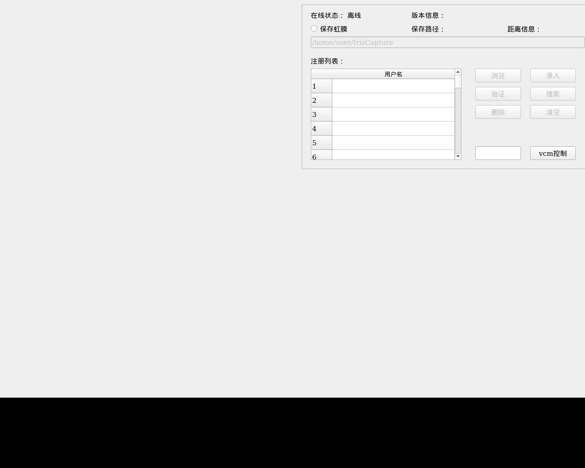 | [SHA256](./cn.huahom.pam.unlock/SHA256SUMS) | N/A |
| [cn.hzchancel.fifthfootprint](./cn.hzchancel.fifthfootprint) | amd64  | deepin-v23 | 0.0.1-20250327 | 失败 | N/A | N/A |
| [cn.hzchancel.fouthfootprint](./cn.hzchancel.fouthfootprint) | amd64  | deepin-v23 | 0.0.1-20250327 | 失败 | N/A | N/A |
| [cn.microdone.passguardservice](./cn.microdone.passguardservice) | amd64  | deepin-v23 | 1.0.0.0-20250327 | 失败 | N/A | N/A |
| [cn.microdone.passguardservice.bj](./cn.microdone.passguardservice.bj) | amd64  | deepin-v23 | 1.0.0.0-20250327 | 失败 | N/A | N/A |
| [cn.microdone.passguardservice.nb](./cn.microdone.passguardservice.nb) | amd64  | deepin-v23 | 1.0.0.7 |  | N/A | N/A |
| [cn.microdone.signmessenger.hz](./cn.microdone.signmessenger.hz) | amd64  | deepin-v23 | 1.0.0.0-20250327 | 失败 | N/A | N/A |
| [cn.microdone.signmessenger.nb](./cn.microdone.signmessenger.nb) | amd64  | deepin-v23 | 1.0.0.2 |  | N/A | N/A |
| [cn.naturalcard.eserver](./cn.naturalcard.eserver) | amd64  | deepin-v23 | 1.0.0.1-20250327 | 失败 | N/A | N/A |
| [cn.net.zonewin.smartscanner](./cn.net.zonewin.smartscanner) | amd64  | deepin-v23 | 1.0.11 |  | N/A | N/A |
| [cn.tianyi.eserver](./cn.tianyi.eserver) | amd64  | deepin-v23 | 1.0.0.1-20250327 | 失败 | N/A | N/A |
| [cndrvcups-utility](./cndrvcups-utility) | amd64  | deepin-v23 | 1.10-1deepin0 |  | [SHA256](./cndrvcups-utility/SHA256SUMS) | N/A |
| [cnrdrvcups-ufr2-uk](./cnrdrvcups-ufr2-uk) | amd64  | deepin-v23 | 5.10-1+rb1 |  | [SHA256](./cnrdrvcups-ufr2-uk/SHA256SUMS) | N/A |
| [cnrdrvcups-ufr2lt-uk](./cnrdrvcups-ufr2lt-uk) | amd64  | deepin-v23 | 5.00-1deepin0 |  | [SHA256](./cnrdrvcups-ufr2lt-uk/SHA256SUMS) | N/A |
| [coccinella](./coccinella) | amd64  | ubuntu-noble | 0.96.20-9 |  | N/A | N/A |
| [codeblocks-common](./codeblocks-common) | amd64  | ubuntu-noble | 20.03+svn13046-0.3build2-20250327 | 失败 | N/A | N/A |
| [codelite](./codelite) | amd64  | ubuntu-noble | 17.0.0+dfsg-2build2 |  | N/A | N/A |
| [codfis](./codfis) | amd64  | ubuntu-noble | 0.4.7-2build4 |  | N/A | N/A |
| [colmap](./colmap) | amd64  | ubuntu-noble | 3.9.1-2build2 |  | N/A | N/A |
| [colobot](./colobot) | amd64  | ubuntu-noble | 0.2.1-1build3 |  | N/A | N/A |
| [color-picker](./color-picker) | amd64  | ubuntu-noble | 1.0.3-2ubuntu3 |  | N/A | N/A |
| [colorcode](./colorcode) | amd64  | ubuntu-noble | 0.8.7-1build2 |  | N/A | N/A |
| [colord-kde](./colord-kde) | amd64  | ubuntu-noble | 23.08.5-0ubuntu4-20250327 | 失败 | N/A | N/A |
| [colorhug-client](./colorhug-client) | amd64  | ubuntu-noble | 0.2.8-3build4 |     | N/A | N/A |
| [colossal-cave-adventure](./colossal-cave-adventure) | amd64  | ubuntu-noble | 1.6-1 |  | N/A | N/A |
| [com-huashuoaf-finger](./com-huashuoaf-finger) | amd64  | deepin-v23 | 1.0.0.3 |  | [SHA256](./com-huashuoaf-finger/SHA256SUMS) | N/A |
| [com.arc-uds.smartscan](./com.arc-uds.smartscan) | amd64  | deepin-v23 | 3.1.0.1 |  | [SHA256](./com.arc-uds.smartscan/SHA256SUMS) | N/A |
| [com.avision.a4pq-series](./com.avision.a4pq-series) | amd64  | deepin-v23 | 1.0.0-23293 |   | [SHA256](./com.avision.a4pq-series/SHA256SUMS) | N/A |
| [com.avision.avision-sane](./com.avision.avision-sane) | amd64  | deepin-v23 | 20231120-8.6.10.020-20250327 | 失败 | N/A | N/A |
| [com.bhyf.bhpainter](./com.bhyf.bhpainter) | amd64  | deepin-v23 | 2020.12.01-1 |   | [SHA256](./com.bhyf.bhpainter/SHA256SUMS) | N/A |
| [com.binup.fingerprint](./com.binup.fingerprint) | amd64  | deepin-v23 | 1.0.0.1-20250327 | 失败 | N/A | N/A |
| [com.bjnja.njaep3kgmutil](./com.bjnja.njaep3kgmutil) | amd64  | deepin-v23 | 1.0.2-20250327 | 失败 | N/A | N/A |
| [com.btit.linuxaction](./com.btit.linuxaction) | amd64  | deepin-v23 | 3.1.10.24194-uosv20-20250327 | 失败 | N/A | N/A |
| [com.canon.ufr2](./com.canon.ufr2) | amd64  | deepin-v23 | 6.00-1.00 | 失败 | [SHA256](./com.canon.ufr2/SHA256SUMS) | N/A |
| [com.centerm.gwq](./com.centerm.gwq) | amd64  | deepin-v23 | 2021.1.29-1 |  | [SHA256](./com.centerm.gwq/SHA256SUMS) | N/A |
| [com.centerm.gwq.common](./com.centerm.gwq.common) | amd64  | deepin-v23 | 1.0.0.0-1-20250327 | 失败 | N/A | N/A |
| [com.colortrac](./com.colortrac) | amd64  | deepin-v23 | 1.0.7-20250327 | 失败 | N/A | N/A |
| [com.comet.comet-sane](./com.comet.comet-sane) | amd64  | deepin-v23 | 20240814-11.7.11.063-20250327 | 失败 | N/A | N/A |
| [com.contexscan](./com.contexscan) | amd64  | deepin-v23 | 1.0.7-20250327 | 失败 | N/A | N/A |
| [com.deepin.gomoku](./com.deepin.gomoku) | amd64  | deepin-v23 | 1.0.11 |  | [SHA256](./com.deepin.gomoku/SHA256SUMS) | N/A |
| [com.deepin.lianliankan](./com.deepin.lianliankan) | amd64  | deepin-v23 | 1.0.12 |  | [SHA256](./com.deepin.lianliankan/SHA256SUMS) | N/A |
| [com.deepin.microbox-scanner](./com.deepin.microbox-scanner) | amd64  | deepin-v23 | 1.2.1-20250327 | 失败 | N/A | N/A |
| [com.deli.camera](./com.deli.camera) | amd64  | deepin-v23 | 2.1.7.9-20250327 | 失败 | N/A | N/A |
| [com.deli.printer-c111](./com.deli.printer-c111) | amd64  | deepin-v23 | 1.0.038-20250327 | 失败 | N/A | N/A |
| [com.deli.printer-d11](./com.deli.printer-d11) | amd64  | deepin-v23 | 1.10-1 | 失败 | [SHA256](./com.deli.printer-d11/SHA256SUMS) | N/A |
| [com.deli.printer-d21](./com.deli.printer-d21) | amd64  | deepin-v23 | 1.10-1 | 失败 | [SHA256](./com.deli.printer-d21/SHA256SUMS) | N/A |
| [com.delichina.deliscan](./com.delichina.deliscan) | amd64  | deepin-v23 | 4.51.24520.23319 | 失败 | [SHA256](./com.delichina.deliscan/SHA256SUMS) | N/A |
| [com.elineprint.e-gm3001-an-3in1](./com.elineprint.e-gm3001-an-3in1) | amd64  | deepin-v23 | 1.0.0-20206 | 失败 | [SHA256](./com.elineprint.e-gm3001-an-3in1/SHA256SUMS) | N/A |
| [com.everfine.finger](./com.everfine.finger) | amd64  | deepin-v23 | 2021.11.5-1 |    | N/A | N/A |
| [com.everspry.escaps](./com.everspry.escaps) | amd64  | deepin-v23 | 24.7.8.8 |  | [SHA256](./com.everspry.escaps/SHA256SUMS) | N/A |
| [com.farshine.ygdevservice](./com.farshine.ygdevservice) | amd64  | deepin-v23 | 2.5.2-20250327 | 失败 | N/A | N/A |
| [com.fenglinkeji.scanner](./com.fenglinkeji.scanner) | amd64  | deepin-v23 | 0.0.1-1-20250327 | 失败 | N/A | N/A |
| [com.founder.linuxaction](./com.founder.linuxaction) | amd64  | deepin-v23 | 2.1.96.24365-uosv20 |  | N/A | N/A |
| [com.founderinternational.founder-sane](./com.founderinternational.founder-sane) | amd64  | deepin-v23 | 20240820-1.6.10.015-20250327 | 失败 | N/A | N/A |
| [com.ftsafe.epass3000gm-spabank](./com.ftsafe.epass3000gm-spabank) | amd64  | deepin-v23 | 1.2.4-1+b1-20250327 | 失败 | N/A | N/A |
| [com.ftsafe.epass3000gmg-hnxa](./com.ftsafe.epass3000gmg-hnxa) | amd64  | deepin-v23 | 1.0.1-1+b1 |  | N/A | N/A |
| [com.ftsafe.interpass3000-cib](./com.ftsafe.interpass3000-cib) | amd64  | deepin-v23 | 1.0.16.d1-1+b1-uos-20250327 | 失败 | N/A | N/A |
| [com.ftsafe.interpass3000-cmbc](./com.ftsafe.interpass3000-cmbc) | amd64  | deepin-v23 | 1.3.13.d0-1+b1 |  | N/A | N/A |
| [com.ftsafe.interpass3000-lfbk](./com.ftsafe.interpass3000-lfbk) | amd64  | deepin-v23 | 1.0.7-1+b1 |  | N/A | N/A |
| [com.ftsafe.interpass3000-nbbank](./com.ftsafe.interpass3000-nbbank) | amd64  | deepin-v23 | 1.0.9-20250327 | 失败 | N/A | N/A |
| [com.ftsafe.interpass3000-rzbank](./com.ftsafe.interpass3000-rzbank) | amd64  | deepin-v23 | 1.0.1-1+b1-20250327 | 失败 | N/A | N/A |
| [com.ftsafe.interpass3000-scb](./com.ftsafe.interpass3000-scb) | amd64  | deepin-v23 | 1.0.5-1+b1-20250327 | 失败 | N/A | N/A |
| [com.ftsafe.interpass3000-wfbank](./com.ftsafe.interpass3000-wfbank) | amd64  | deepin-v23 | 1.0.0.d1-1+b1-20250327 | 失败 | N/A | N/A |
| [com.ftsafe.interpass3000zjrc](./com.ftsafe.interpass3000zjrc) | amd64  | deepin-v23 | 1.2.21-1+b1 |  | N/A | N/A |
| [com.ftsafe.interpasscitic](./com.ftsafe.interpasscitic) | amd64  | deepin-v23 | 1.2.8-1+b1 |  | N/A | N/A |
| [com.fujitsu.fsane](./com.fujitsu.fsane) | amd64  | deepin-v23 | 2.0.1-2-20250327 | 失败 | N/A | N/A |
| [com.fytech.cfs300b](./com.fytech.cfs300b) | amd64  | deepin-v23 | 1.0.0 |  | [SHA256](./com.fytech.cfs300b/SHA256SUMS) | N/A |
| [com.fytech.pfs408](./com.fytech.pfs408) | amd64  | deepin-v23 | 2021.5.8 |  | [SHA256](./com.fytech.pfs408/SHA256SUMS) | N/A |
| [com.fytech.ps1300](./com.fytech.ps1300) | amd64  | deepin-v23 | 1.0.0 |  | [SHA256](./com.fytech.ps1300/SHA256SUMS) | N/A |
| [com.ggimage.ggimage-printer](./com.ggimage.ggimage-printer) | amd64  | deepin-v23 | 1.0.3-1+uos | 失败 | [SHA256](./com.ggimage.ggimage-printer/SHA256SUMS) | N/A |
| [com.gmrz.fido](./com.gmrz.fido) | amd64  | deepin-v23 | 1.0.3.2-20250327 | 失败 | N/A | N/A |
| [com.goke.gksecurity](./com.goke.gksecurity) | amd64  | deepin-v23 | 2.0.3-20250327 | 失败 | N/A | N/A |
| [com.greatwalltech.greatwall-sane](./com.greatwalltech.greatwall-sane) | amd64  | deepin-v23 | 20240918-7.6.10.051-20250327 | 失败 | N/A | N/A |
| [com.gwi.dpm760a-tool](./com.gwi.dpm760a-tool) | amd64  | deepin-v23 | 1.0.0 |  | [SHA256](./com.gwi.dpm760a-tool/SHA256SUMS) | N/A |
| [com.haitaichina.htukeytool20079](./com.haitaichina.htukeytool20079) | amd64  | deepin-v23 | 1.0.0.2404081-20250327 | 失败 | N/A | N/A |
| [com.hanguang.hgfchanguangprinter](./com.hanguang.hgfchanguangprinter) | amd64  | deepin-v23 | 1-1 | 失败 | [SHA256](./com.hanguang.hgfchanguangprinter/SHA256SUMS) | N/A |
| [com.hanguang.hgfcscanner](./com.hanguang.hgfcscanner) | amd64  | deepin-v23 | 1-1 | 失败 | [SHA256](./com.hanguang.hgfcscanner/SHA256SUMS) | N/A |
| [com.hanlongbj.omniscan](./com.hanlongbj.omniscan) | amd64  | deepin-v23 | 1 | 失败 | [SHA256](./com.hanlongbj.omniscan/SHA256SUMS) | N/A |
| [com.hanwang.linuxaction-sdk](./com.hanwang.linuxaction-sdk) | amd64  | deepin-v23 | 2.1.53.22043-uosv20 |  | N/A | N/A |
| [com.hsreader.demo](./com.hsreader.demo) | amd64  | deepin-v23 | 1.1.0-20250327 | 失败 | N/A | N/A |
| [com.huagaochina.huagoscan](./com.huagaochina.huagoscan) | amd64  | deepin-v23 | 2.2.3-1+rc4 |  | N/A | N/A |
| [com.huawei.cv81-series](./com.huawei.cv81-series) | amd64  | deepin-v23 | 2.0-88 |  | [SHA256](./com.huawei.cv81-series/SHA256SUMS) | N/A |
| [com.hw.signdriver](./com.hw.signdriver) | amd64  | deepin-v23 | 1.0.0-20250327 | 失败 | N/A | N/A |
| [com.hw99.hanvon-sane](./com.hw99.hanvon-sane) | amd64  | deepin-v23 | 20230206-9.6.10.053-20250327 | 失败 | N/A | N/A |
| [com.jetbrains.irisking](./com.jetbrains.irisking) | amd64  | deepin-v23 | 2021.01.20-1-20250327 | 失败 | N/A | N/A |
| [com.joyusing.gwq](./com.joyusing.gwq) | amd64  | deepin-v23 | 1.0.0-20250327 | 失败 | N/A | N/A |
| [com.joyusing.visualizer](./com.joyusing.visualizer) | amd64  | deepin-v23 | 1.0.0-20250327 | 失败 | N/A | N/A |
| [com.joyusing.w05](./com.joyusing.w05) | amd64  | deepin-v23 | 1.0.0-20250327 | 失败 | N/A | N/A |
| [com.joyusing.writingpad](./com.joyusing.writingpad) | amd64  | deepin-v23 | 1.0.0-20250327 | 失败 | N/A | N/A |
| [com.kinghun.kinghuncamera](./com.kinghun.kinghuncamera) | amd64  | deepin-v23 | 1.0.0-20250327 | 失败 | N/A | N/A |
| [com.lanxum-ga-series](./com.lanxum-ga-series) | amd64  | deepin-v23 | 1.0.1 | 失败 | [SHA256](./com.lanxum-ga-series/SHA256SUMS) | N/A |
| [com.lanxum.ga2630dn-psm-2in1](./com.lanxum.ga2630dn-psm-2in1) | amd64  | deepin-v23 | 1.0.0-20301 | 失败 | [SHA256](./com.lanxum.ga2630dn-psm-2in1/SHA256SUMS) | N/A |
| [com.lanxum.ga30-psm-2in1](./com.lanxum.ga30-psm-2in1) | amd64  | deepin-v23 | 1.0.0-21032 | 失败 | [SHA256](./com.lanxum.ga30-psm-2in1/SHA256SUMS) | N/A |
| [com.lanxum.ga7030dn-psm-2in1](./com.lanxum.ga7030dn-psm-2in1) | amd64  | deepin-v23 | 1.0.0-21034 | 失败 | [SHA256](./com.lanxum.ga7030dn-psm-2in1/SHA256SUMS) | N/A |
| [com.lanxum.gasd06.printerdriver](./com.lanxum.gasd06.printerdriver) | amd64  | deepin-v23 | 1.0.0-5+0-20250327 | 失败 | N/A | N/A |
| [com.lanxum.gd34xxdn](./com.lanxum.gd34xxdn) | amd64  | deepin-v23 | 3.3.0 |  | [SHA256](./com.lanxum.gd34xxdn/SHA256SUMS) | N/A |
| [com.lanxum.linuxaction](./com.lanxum.linuxaction) | amd64  | deepin-v23 | 2.1.91.24084-uosv20 |  | N/A | N/A |
| [com.lanxum.printdevicemanager](./com.lanxum.printdevicemanager) | amd64  | deepin-v23 | 2.0.0-2+0-20250327 | 失败 | N/A | N/A |
| [com.lanxum.rongtuscan](./com.lanxum.rongtuscan) | amd64  | deepin-v23 | 2.0.9 |  | N/A | N/A |
| [com.lanxum.sp1800-1-driver](./com.lanxum.sp1800-1-driver) | amd64  | deepin-v23 | 1.1.0-20250327 | 失败 | N/A | N/A |
| [com.lanxum.sp1800-1-tool](./com.lanxum.sp1800-1-tool) | amd64  | deepin-v23 | 1.1.0-20250327 | 失败 | N/A | N/A |
| [com.lenovo.lenovo-gpy](./com.lenovo.lenovo-gpy) | amd64  | deepin-v23 | 2.1.7.3-20250327 | 失败 | N/A | N/A |
| [com.microtek.scaner](./com.microtek.scaner) | amd64  | deepin-v23 | 1.0.0-9c-20250327 | 失败 | N/A | N/A |
| [com.mindeo.scannertext](./com.mindeo.scannertext) | amd64  | deepin-v23 | 1.2.2.4 |  | [SHA256](./com.mindeo.scannertext/SHA256SUMS) | N/A |
| [com.mt.cnlinux](./com.mt.cnlinux) | amd64  | deepin-v23 | 1.0.0.3 |  | [SHA256](./com.mt.cnlinux/SHA256SUMS) | N/A |
| [com.mt.cnsscard](./com.mt.cnsscard) | amd64  | deepin-v23 | 1.0.0.4 |  | [SHA256](./com.mt.cnsscard/SHA256SUMS) | N/A |
| [com.nantian.bpport](./com.nantian.bpport) | amd64  | deepin-v23 | 1.0.0.20210910 |  | N/A | N/A |
| [com.nantian.clientscreen](./com.nantian.clientscreen) | amd64  | deepin-v23 | 1.0.2.02261802-20250327 | 失败 | N/A | N/A |
| [com.nantian.mmjp](./com.nantian.mmjp) | amd64  | deepin-v23 | 1.0.0.20210312-20250327 | 失败 | N/A | N/A |
| [com.nbdeli.deli-sane](./com.nbdeli.deli-sane) | amd64  | deepin-v23 | 20240820-5.7.10.027-20250327 | 失败 | N/A | N/A |
| [com.ncmem.down2](./com.ncmem.down2) | amd64  | deepin-v23 | 2020.12.3-1 |  | [SHA256](./com.ncmem.down2/SHA256SUMS) | N/A |
| [com.ncmem.up6](./com.ncmem.up6) | amd64  | deepin-v23 | 2020.12.3-1 | 失败 | [SHA256](./com.ncmem.up6/SHA256SUMS) | N/A |
| [com.ncmem.wordpaster](./com.ncmem.wordpaster) | amd64  | deepin-v23 | 2020.12.3-1 | 失败 | [SHA256](./com.ncmem.wordpaster/SHA256SUMS) | N/A |
| [com.neutralchina.neuscan](./com.neutralchina.neuscan) | amd64  | deepin-v23 | 4.52.26520.24289 |  | N/A | N/A |
| [com.pantum.pantum](./com.pantum.pantum) | amd64  | deepin-v23 | 7.4.182-1+uos-20250327 | 失败 | N/A | N/A |
| [com.pantum.pantum-235-325-2165](./com.pantum.pantum-235-325-2165) | amd64  | deepin-v23 | 1.0.0ab02-1+uos |    | [SHA256](./com.pantum.pantum-235-325-2165/SHA256SUMS) | N/A |
| [com.pantum.pantum-scan-assistant](./com.pantum.pantum-scan-assistant) | amd64  | deepin-v23 | 3.0.1-20250327 | 失败 | N/A | N/A |
| [com.pantum.pantumprint](./com.pantum.pantumprint) | amd64  | deepin-v23 | 1.1.24-1+uos |  | [SHA256](./com.pantum.pantumprint/SHA256SUMS) | N/A |
| [com.plustek.linuxaction](./com.plustek.linuxaction) | amd64  | deepin-v23 | 3.0.3.22342-uosv20-20250327 | 失败 | N/A | N/A |
| [com.racertech.usbdisp](./com.racertech.usbdisp) | amd64  | deepin-v23 | 1.0.0-1-20250327 | 失败 | N/A | N/A |
| [com.ricoh.pfu.fsane](./com.ricoh.pfu.fsane) | amd64  | deepin-v23 | 4.0.1-1-20250327 | 失败 | N/A | N/A |
| [com.rightcolor](./com.rightcolor) | amd64  | deepin-v23 | 1.0.7-20250327 | 失败 | N/A | N/A |
| [com.scanner.hanguang](./com.scanner.hanguang) | amd64  | deepin-v23 | 1.0-1-20250327 | 失败 | N/A | N/A |
| [com.semxum.aisystem](./com.semxum.aisystem) | amd64  | deepin-v23 | 1.0.0-2+b1 | 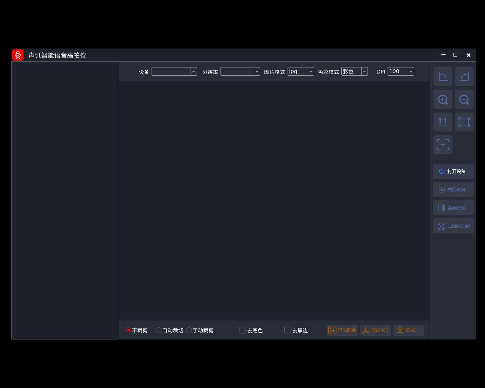 | [SHA256](./com.semxum.aisystem/SHA256SUMS) | N/A |
| [com.shensi.websocket](./com.shensi.websocket) | amd64  | deepin-v23 | 1.58 |  | N/A | N/A |
| [com.sogou.ime.ng.fcitx5.deepin](./com.sogou.ime.ng.fcitx5.deepin) | amd64  | deepin-v23 | 10.0.9.0.8-981 | 失败 | [SHA256](./com.sogou.ime.ng.fcitx5.deepin/SHA256SUMS) | N/A |
| [com.sunrise.demo](./com.sunrise.demo) | amd64  | deepin-v23 | 2.2.2-20250327 | 失败 | N/A | N/A |
| [com.sunrise.device](./com.sunrise.device) | amd64  | deepin-v23 | 2020.09.15-1-20250327 | 失败 | N/A | N/A |
| [com.sxylzinfo.sxsscardsv](./com.sxylzinfo.sxsscardsv) | amd64  | deepin-v23 | 3.5.15 |  | N/A | N/A |
| [com.szshenshu.aidemo](./com.szshenshu.aidemo) | amd64  | deepin-v23 | 2022.01.11-1 |  | [SHA256](./com.szshenshu.aidemo/SHA256SUMS) | N/A |
| [com.tdr.uosicbc](./com.tdr.uosicbc) | amd64  | deepin-v23 | 9.0.6-5-20250327 | 失败 | N/A | N/A |
| [com.tg.aqdl](./com.tg.aqdl) | amd64  | deepin-v23 | 4.1.0.1-20250327 | 失败 | N/A | N/A |
| [com.toec.oem3000dn](./com.toec.oem3000dn) | amd64  | deepin-v23 | 2.6-4 |  | N/A | N/A |
| [com.toec.toeca3oemseries](./com.toec.toeca3oemseries) | amd64  | deepin-v23 | 1.0 | 失败 | [SHA256](./com.toec.toeca3oemseries/SHA256SUMS) | N/A |
| [com.toec.toeca3series](./com.toec.toeca3series) | amd64  | deepin-v23 | 2.5-7.1 | 失败 | [SHA256](./com.toec.toeca3series/SHA256SUMS) | N/A |
| [com.toec.toeca4faxseries](./com.toec.toeca4faxseries) | amd64  | deepin-v23 | 2.6-4.1 | 失败 | [SHA256](./com.toec.toeca4faxseries/SHA256SUMS) | N/A |
| [com.toec.toeca4printer](./com.toec.toeca4printer) | amd64  | deepin-v23 | 1.0-18.2 | 失败 | [SHA256](./com.toec.toeca4printer/SHA256SUMS) | N/A |
| [com.toec.toeca4series](./com.toec.toeca4series) | amd64  | deepin-v23 | 2.7-3 | 失败 | [SHA256](./com.toec.toeca4series/SHA256SUMS) | N/A |
| [com.toec.toecmyseries](./com.toec.toecmyseries) | amd64  | deepin-v23 | 3.0.0.11 | 失败 | [SHA256](./com.toec.toecmyseries/SHA256SUMS) | N/A |
| [com.toec.toecrlseries](./com.toec.toecrlseries) | amd64  | deepin-v23 | 1.1-7 | 失败 | [SHA256](./com.toec.toecrlseries/SHA256SUMS) | N/A |
| [com.toec.toecrlwseries](./com.toec.toecrlwseries) | amd64  | deepin-v23 | 1.1-1 | 失败 | [SHA256](./com.toec.toecrlwseries/SHA256SUMS) | N/A |
| [com.toec.toecscanner](./com.toec.toecscanner) | amd64  | deepin-v23 | 2.6-4-20250327 | 失败 | N/A | N/A |
| [com.tr.gpyapp](./com.tr.gpyapp) | amd64  | deepin-v23 | 1.0.0.2 | 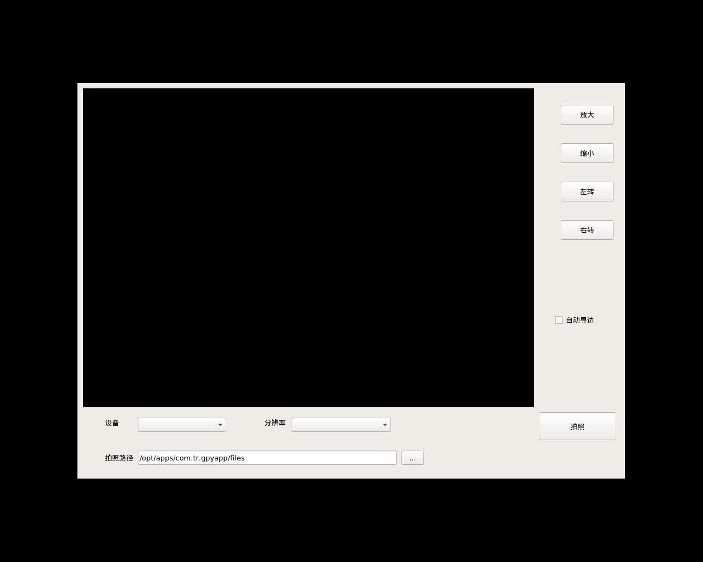 | [SHA256](./com.tr.gpyapp/SHA256SUMS) | N/A |
| [com.utel.uboxweb](./com.utel.uboxweb) | amd64  | deepin-v23 | 1.0.0.10-20250327 | 失败 | N/A | N/A |
| [com.wendouscanner](./com.wendouscanner) | amd64  | deepin-v23 | 1.1 | 失败 | [SHA256](./com.wendouscanner/SHA256SUMS) | N/A |
| [com.winmage.winmage-sane](./com.winmage.winmage-sane) | amd64  | deepin-v23 | 20240911-4.6.10.053-20250327 | 失败 | N/A | N/A |
| [com.winuim.wmr06](./com.winuim.wmr06) | amd64  | deepin-v23 | 1.0.0.4-1 |  | [SHA256](./com.winuim.wmr06/SHA256SUMS) | N/A |
| [com.wsd.gpy](./com.wsd.gpy) | amd64  | deepin-v23 | 1.0.26-20250327 | 失败 | N/A | N/A |
| [com.yjcloud.asr.agent](./com.yjcloud.asr.agent) | amd64  | deepin-v23 | 5.0.0 | 失败 | [SHA256](./com.yjcloud.asr.agent/SHA256SUMS) | N/A |
| [com.za.ld8800](./com.za.ld8800) | amd64  | deepin-v23 | 3.0.1.2 | 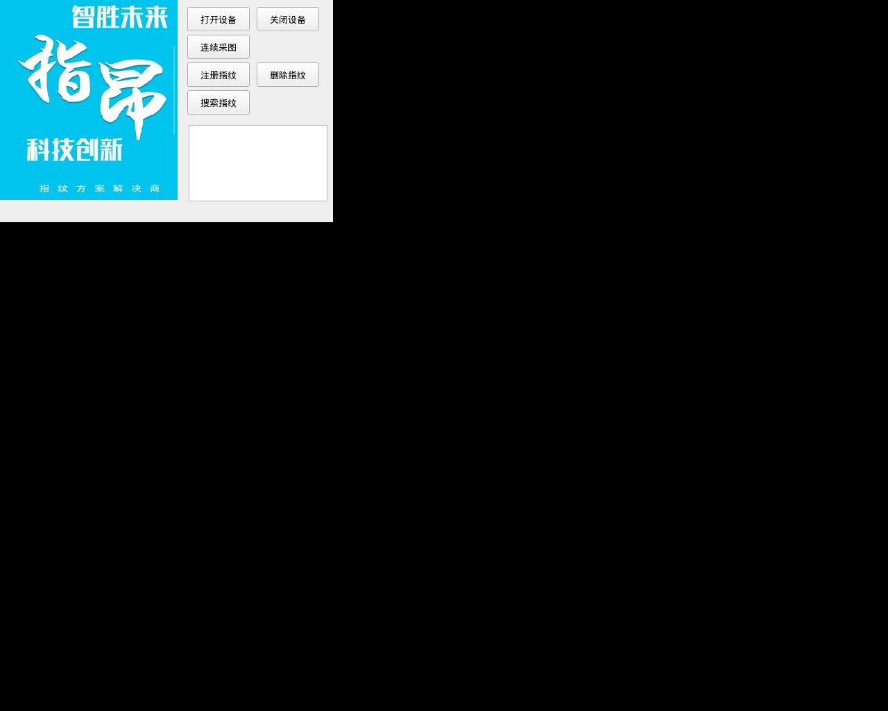 | [SHA256](./com.za.ld8800/SHA256SUMS) | N/A |
| [com.za.zaz301](./com.za.zaz301) | amd64  | deepin-v23 | 3.0.1.2 |  | [SHA256](./com.za.zaz301/SHA256SUMS) | N/A |
| [com.zebra.jaguardriver](./com.zebra.jaguardriver) | amd64  | deepin-v23 | 1.0.0.0 | 失败 | [SHA256](./com.zebra.jaguardriver/SHA256SUMS) | N/A |
| [com.zhiankeji.hs108](./com.zhiankeji.hs108) | amd64  | deepin-v23 | 1.0.1-1 | 失败 | [SHA256](./com.zhiankeji.hs108/SHA256SUMS) | N/A |
| [com.zhiankeji.hs110](./com.zhiankeji.hs110) | amd64  | deepin-v23 | 1.0.1-1 | 失败 | [SHA256](./com.zhiankeji.hs110/SHA256SUMS) | N/A |
| [com.ztsave.ztfinger](./com.ztsave.ztfinger) | amd64  | deepin-v23 | 1.0.0-1 |  | [SHA256](./com.ztsave.ztfinger/SHA256SUMS) | N/A |
| [compiz-boxmenu](./compiz-boxmenu) | amd64  | ubuntu-noble | 1.1.12-7build2-20250327 | 失败 | N/A | N/A |
| [compiz-core](./compiz-core) | amd64  | ubuntu-noble | 0.9.14.2+22.10.20220822-0ubuntu12-20250327 | 失败 | N/A | N/A |
| [compizconfig-settings-manager](./compizconfig-settings-manager) | amd64  | ubuntu-noble | 0.9.14.2+22.10.20220822-0ubuntu12-20250327 | 失败 | N/A | N/A |
| [comptext](./comptext) | amd64  | ubuntu-noble | 1.0.1-6build2 |  | N/A | N/A |
| [compton](./compton) | amd64  | ubuntu-noble | 1-3 |  | N/A | N/A |
| [compton-conf](./compton-conf) | amd64  | ubuntu-noble | 0.16.0-1ubuntu3 |  | N/A | N/A |
| [comptty](./comptty) | amd64  | ubuntu-noble | 1.0.1-5build2 |  | N/A | N/A |
| [confclerk](./confclerk) | amd64  | ubuntu-noble | 0.7.1-1build2 |  | N/A | N/A |
| [configure-debian](./configure-debian) | amd64  | ubuntu-noble | 1.0.3+nmu3-20250327 | 失败 | N/A | N/A |
| [confy](./confy) | amd64  | ubuntu-noble | 0.7.0-1-20250327 | 失败 | N/A | N/A |
| [congruity](./congruity) | amd64  | ubuntu-noble | 21-1 |  | N/A | N/A |
| [conky-all](./conky-all) | amd64  | deepin-v23 | 1.21.1-1-20250327 | 失败 | N/A | N/A |
| [conky-cli](./conky-cli) | amd64  | deepin-v23 | 1.21.1-1 | 失败 | [SHA256](./conky-cli/SHA256SUMS) | N/A |
| [conky-std](./conky-std) | amd64  | deepin-v23 | 1.21.1-1 | 失败 | [SHA256](./conky-std/SHA256SUMS) | N/A |
| [connectagram](./connectagram) | amd64  | ubuntu-noble | 1.3.5-2build1 |  | N/A | N/A |
| [connectome-workbench](./connectome-workbench) | amd64  | ubuntu-noble | 1.5.0-2build2 |  | N/A | N/A |
| [connman-gtk](./connman-gtk) | amd64  | ubuntu-noble | 1.1.1+git20180626.b72c6ab-3build2 |  | N/A | N/A |
| [content-hub](./content-hub) | amd64  | ubuntu-noble | 1.1.1-1build5-20250327 | 失败 | N/A | N/A |
| [content-hub-testability](./content-hub-testability) | amd64  | ubuntu-noble | 1.1.1-1build5 |    | N/A | N/A |
| [converseen](./converseen) | amd64  | ubuntu-noble | 0.12.1.0-1build2 |  | N/A | N/A |
| [convertall](./convertall) | amd64  | ubuntu-noble | 0.8.0-2 |  | N/A | N/A |
| [cool-retro-term](./cool-retro-term) | amd64  | ubuntu-noble | 1.2.0+ds2-2build2 |  | N/A | N/A |
| [copyq](./copyq) | amd64  | ubuntu-noble | 7.1.0-1build2 |  | N/A | N/A |
| [coqide](./coqide) | amd64  | ubuntu-noble | 8.18.0+dfsg-1build2 |  | N/A | N/A |
| [corectrl](./corectrl) | amd64  | ubuntu-noble | 1.3.11+ds-1build1-20250327 | 失败 | N/A | N/A |
| [corsix-th](./corsix-th) | amd64  | ubuntu-noble | 0.67-1 |  | N/A | N/A |
| [cppcheck-gui](./cppcheck-gui) | amd64  | ubuntu-noble | 2.13.0-2ubuntu3 |  | N/A | N/A |
| [cpu-x](./cpu-x) | amd64  | ubuntu-noble | 5.0.3-2build2 | 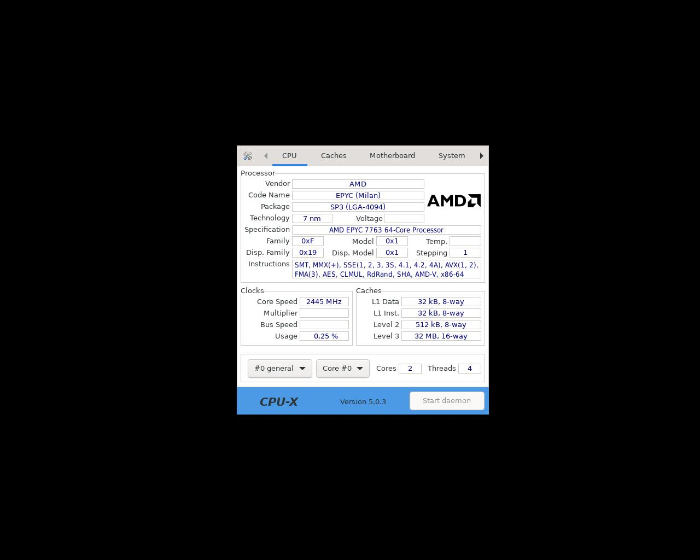 | N/A | N/A |
| [cpupower-gui](./cpupower-gui) | amd64  | ubuntu-noble | 0.7.2-2.1ubuntu2-20250327 | 失败 | N/A | N/A |
| [cqrlog](./cqrlog) | amd64  | ubuntu-noble | 2.5.2-3ubuntu2 |  | N/A | N/A |
| [crack-attack](./crack-attack) | amd64  | ubuntu-noble | 1.1.14-9.2build2 |  | N/A | N/A |
| [crawl](./crawl) | amd64  | ubuntu-noble | 0.28.0-1.1-20250327 | 失败 | N/A | N/A |
| [crawl-tiles](./crawl-tiles) | amd64  | ubuntu-noble | 0.28.0-1.1 |  | N/A | N/A |
| [cream](./cream) | amd64  | ubuntu-noble | 0.43-3.1-20250327 | 失败 | N/A | N/A |
| [crimson](./crimson) | amd64  | ubuntu-noble | 0.5.2-1.1build2 |  | N/A | N/A |
| [crispy-doom](./crispy-doom) | amd64  | ubuntu-noble | 6.0-2build2 |    | N/A | N/A |
| [criticalmass](./criticalmass) | amd64  | ubuntu-noble | 1.0.2-4build3-20250327 | 失败 | N/A | N/A |
| [critterding](./critterding) | amd64  | ubuntu-noble | 1.0-beta12.1-1.3build1 |  | N/A | N/A |
| [cronometer](./cronometer) | amd64  | ubuntu-noble | 0.9.9+dfsg1-1-20250327 | 失败 | N/A | N/A |
| [crossfire-client](./crossfire-client) | amd64  | ubuntu-noble | 1.75.0-2build4 |  | N/A | N/A |
| [crow-translate](./crow-translate) | amd64  | ubuntu-noble | 2.11.1+git20240108+ds-1build2 |  | N/A | N/A |
| [crrcsim](./crrcsim) | amd64  | ubuntu-noble | 0.9.13-3.2build2 |  | N/A | N/A |
| [crystal-facet-uml](./crystal-facet-uml) | amd64  | ubuntu-noble | 1.55.3-1build2 |  | N/A | N/A |
| [csoundqt](./csoundqt) | amd64  | ubuntu-noble | 1.1.1+dfsg0-1build2 |  | N/A | N/A |
| [ctsim](./ctsim) | amd64  | ubuntu-noble | 6.0.2-6build3 |  | N/A | N/A |
| [cube2-data](./cube2-data) | amd64  | ubuntu-noble | 1.3-1 |  | N/A | N/A |
| [cubicsdr](./cubicsdr) | amd64  | ubuntu-noble | 0.2.7+dfsg-2build3 |  | N/A | N/A |
| [cultivation](./cultivation) | amd64  | ubuntu-noble | 9+dfsg1-2build5 |  | N/A | N/A |
| [curtain](./curtain) | amd64  | ubuntu-noble | 0.3-1.1build3 |  | N/A | N/A |
| [cutecom](./cutecom) | amd64  | ubuntu-noble | 0.51.0-1build2 |  | N/A | N/A |
| [cutemaze](./cutemaze) | amd64  | ubuntu-noble | 1.3.2-1build2 |  | N/A | N/A |
| [cutesdr](./cutesdr) | amd64  | ubuntu-noble | 1.20-4build2 |  | N/A | N/A |
| [cuyo](./cuyo) | amd64  | ubuntu-noble | 2.1.0-1build1 |  | N/A | N/A |
| [cycle](./cycle) | amd64  | ubuntu-noble | 0.3.3-1-20250327 | 失败 | N/A | N/A |
| [cyclograph-gtk3](./cyclograph-gtk3) | amd64  | ubuntu-noble | 1.9.1-1.2-20250327 | 失败 | N/A | N/A |
| [cyclograph-qt5](./cyclograph-qt5) | amd64  | ubuntu-noble | 1.9.1-1.2-20250327 | 失败 | N/A | N/A |
| [cynthiune.app](./cynthiune.app) | amd64  | ubuntu-noble | 1.0.0-2build9 |  | N/A | N/A |
| [cytadela](./cytadela) | amd64  | ubuntu-noble | 1.1.0-4build1-20250327 | 失败 | N/A | N/A |
| [d-feet](./d-feet) | amd64  | deepin-v23 | 0.3.16-3 |  | [SHA256](./d-feet/SHA256SUMS) | N/A |
| [d-spy](./d-spy) | amd64  | ubuntu-noble | 1.10.0-1build1 |  | N/A | N/A |
| [d1x-rebirth](./d1x-rebirth) | amd64  | ubuntu-noble | 0.58.1-1.2-20250327 | 失败 | N/A | N/A |
| [d2x-rebirth](./d2x-rebirth) | amd64  | ubuntu-noble | 0.58.1-1.3-20250327 | 失败 | N/A | N/A |
| [daisy-player](./daisy-player) | amd64  | ubuntu-noble | 13.0-4build2-20250327 | 失败 | N/A | N/A |
| [dangen](./dangen) | amd64  | ubuntu-noble | 0.5-7 |  | N/A | N/A |
| [danmaq](./danmaq) | amd64  | ubuntu-noble | 0.2.3.2-2build2 |  | N/A | N/A |
| [darkradiant](./darkradiant) | amd64  | ubuntu-noble | 3.8.0-2build4 |  | N/A | N/A |
| [darktable](./darktable) | amd64  | ubuntu-noble | 4.6.1-2ubuntu1 |  | N/A | N/A |
| [darnwdl](./darnwdl) | amd64  | ubuntu-noble | 0.8-1build1 |  | N/A | N/A |
| [dasher](./dasher) | amd64  | ubuntu-noble | 5.0.0~beta~repack2-4build3 |  | N/A | N/A |
| [davegnukem](./davegnukem) | amd64  | ubuntu-noble | 1.0.3-4 |  | N/A | N/A |
| [davmail](./davmail) | amd64  | ubuntu-noble | 6.2.1.3496-1 |  | N/A | N/A |
| [dawg](./dawg) | amd64  | ubuntu-noble | 1.2-4-20250327 | 失败 | N/A | N/A |
| [dclock](./dclock) | amd64  | ubuntu-noble | 2.2.2-14build2 |  | N/A | N/A |
| [dconf-editor](./dconf-editor) | amd64  | ubuntu-noble | 45.0.1-1build2 |  | N/A | N/A |
| [ddcui](./ddcui) | amd64  | ubuntu-noble | 0.3.0-1build3 |  | N/A | N/A |
| [ddd](./ddd) | amd64  | ubuntu-noble | 3.3.12-5.4build2 |  | N/A | N/A |
| [dde-calendar](./dde-calendar) | amd64  | deepin-v23 | 5.14.7-20250327 | 失败 | N/A | N/A |
| [dde-control-center](./dde-control-center) | amd64  | deepin-v23 | 6.0.75+deepin0+rb1-20250327 | 失败 | N/A | N/A |
| [dde-cooperation](./dde-cooperation) | amd64  | deepin-v23 | 1.0.2-1 |  | [SHA256](./dde-cooperation/SHA256SUMS) | N/A |
| [dde-desktop](./dde-desktop) | amd64  | deepin-v23 | 6.5.10.4-20250327 | 失败 | N/A | N/A |
| [dde-device-formatter](./dde-device-formatter) | amd64  | deepin-v23 | 0.0.1.16-20250327 | 失败 | N/A | N/A |
| [dde-file-manager](./dde-file-manager) | amd64  | deepin-v23 | 6.5.10.4-20250327 | 失败 | N/A | N/A |
| [dde-introduction](./dde-introduction) | amd64  | deepin-v23 | 7.0.9 |  | [SHA256](./dde-introduction/SHA256SUMS) | N/A |
| [dde-printer](./dde-printer) | amd64  | deepin-v23 | 1.0.25-1+1060 |  | N/A | N/A |
| [dde-session-shell](./dde-session-shell) | amd64  | deepin-v23 | 6.0.23-20250327 | 失败 | N/A | N/A |
| [dde-store](./dde-store) | amd64  | ubuntu-noble | 1.2.5-1build2-20250327 | 失败 | N/A | N/A |
| [ddnet](./ddnet) | amd64  | ubuntu-noble | 16.4-1.2build5 |  | N/A | N/A |
| [ddrescueview](./ddrescueview) | amd64  | ubuntu-noble | 0.4.5-2 |  | N/A | N/A |
| [deb-gview](./deb-gview) | amd64  | ubuntu-noble | 0.3.7build2 |  | N/A | N/A |
| [debian-installer-launcher](./debian-installer-launcher) | amd64  | ubuntu-noble | 41 |  | N/A | N/A |
| [debian-reference-common](./debian-reference-common) | amd64  | ubuntu-noble | 2.122-20250327 | 失败 | N/A | N/A |
| [deepin-album](./deepin-album) | amd64  | deepin-v23 | 5.10.25 |  | [SHA256](./deepin-album/SHA256SUMS) | N/A |
| [deepin-app-store](./deepin-app-store) | amd64  | deepin-v23 | 8.0.7.0010 |  | [SHA256](./deepin-app-store/SHA256SUMS) | N/A |
| [deepin-boot-maker](./deepin-boot-maker) | amd64  | deepin-v23 | 5.7.10-20250327 | 失败 | N/A | N/A |
| [deepin-calculator](./deepin-calculator) | amd64  | deepin-v23 | 6.0.1 |  | [SHA256](./deepin-calculator/SHA256SUMS) | N/A |
| [deepin-camera](./deepin-camera) | amd64  | deepin-v23 | 6.5.5-20250327 | 失败 | N/A | N/A |
| [deepin-compatibility-mode](./deepin-compatibility-mode) | amd64  | deepin-v23 | 0.1.2 |  | N/A | N/A |
| [deepin-compressor](./deepin-compressor) | amd64  | deepin-v23 | 6.0.2 |  | [SHA256](./deepin-compressor/SHA256SUMS) | N/A |
| [deepin-data-transfer](./deepin-data-transfer) | amd64  | deepin-v23 | 1.0.2-1 |  | [SHA256](./deepin-data-transfer/SHA256SUMS) | N/A |
| [deepin-deb-installer](./deepin-deb-installer) | amd64  | deepin-v23 | 6.5.0-20250327 | 失败 | N/A | N/A |
| [deepin-devicemanager](./deepin-devicemanager) | amd64  | deepin-v23 | 6.0.28-20250327 | 失败 | N/A | N/A |
| [deepin-diskmanager](./deepin-diskmanager) | amd64  | deepin-v23 | 1.4.1 |  | [SHA256](./deepin-diskmanager/SHA256SUMS) | N/A |
| [deepin-distrobox-ubuntu](./deepin-distrobox-ubuntu) | amd64  | deepin-v23 | 0 |  | N/A | N/A |
| [deepin-draw](./deepin-draw) | amd64  | deepin-v23 | 7.0.4 |  | [SHA256](./deepin-draw/SHA256SUMS) | N/A |
| [deepin-editor](./deepin-editor) | amd64  | deepin-v23 | 6.5.7 |  | N/A | N/A |
| [deepin-feedback](./deepin-feedback) | amd64  | deepin-v23 | 6.0.0-20250327 | 失败 | N/A | N/A |
| [deepin-font-manager](./deepin-font-manager) | amd64  | deepin-v23 | 6.5.3-20250327 | 失败 | N/A | N/A |
| [deepin-home](./deepin-home) | amd64  | deepin-v23 | 1.6.3 |  | N/A | N/A |
| [deepin-image-viewer](./deepin-image-viewer) | amd64  | deepin-v23 | 5.9.20 |  | [SHA256](./deepin-image-viewer/SHA256SUMS) | N/A |
| [deepin-log-viewer](./deepin-log-viewer) | amd64  | deepin-v23 | 6.5.2 |  | [SHA256](./deepin-log-viewer/SHA256SUMS) | N/A |
| [deepin-mail](./deepin-mail) | amd64  | deepin-v23 | 6.4.10-20250327 | 失败 | N/A | N/A |
| [deepin-manual](./deepin-manual) | amd64  | deepin-v23 | 6.5.6.1-20250327 | 失败 | N/A | N/A |
| [deepin-movie](./deepin-movie) | amd64  | deepin-v23 | 6.0.13-1-20250327 | 失败 | N/A | N/A |
| [deepin-music](./deepin-music) | amd64  | deepin-v23 | 6.2.40-20250327 | 失败 | N/A | N/A |
| [deepin-ocr](./deepin-ocr) | amd64  | deepin-v23 | 1.1.2-20250327 | 失败 | N/A | N/A |
| [deepin-picker](./deepin-picker) | amd64  | deepin-v23 | 6.0.1-20250327 | 失败 | N/A | N/A |
| [deepin-reader](./deepin-reader) | amd64  | deepin-v23 | 6.5.2-20250327 | 失败 | N/A | N/A |
| [deepin-screen-recorder](./deepin-screen-recorder) | amd64  | deepin-v23 | 6.0.9+deepin0+rb1-20250327 | 失败 | N/A | N/A |
| [deepin-system-monitor](./deepin-system-monitor) | amd64  | deepin-v23 | 6.5.2 |  | [SHA256](./deepin-system-monitor/SHA256SUMS) | N/A |
| [deepin-system-upgrade](./deepin-system-upgrade) | amd64  | deepin-v23 | 6.0.3 |  | [SHA256](./deepin-system-upgrade/SHA256SUMS) | N/A |
| [deepin-terminal](./deepin-terminal) | amd64  | deepin-v23 | 6.0.16 |  | N/A | N/A |
| [deepin-unioncode](./deepin-unioncode) | amd64  | deepin-v23 | 1.4.8-1-20250327 | 失败 | N/A | N/A |
| [deepin-voice-note](./deepin-voice-note) | amd64  | deepin-v23 | 6.0.17-20250327 | 失败 | N/A | N/A |
| [deja-dup](./deja-dup) | amd64  | ubuntu-noble | 45.2-1build2 |  | N/A | N/A |
| [deli-printer-a111](./deli-printer-a111) | amd64  | deepin-v23 | 1.1.022-20250327 | 失败 | N/A | N/A |
| [dell-recovery](./dell-recovery) | amd64  | ubuntu-noble | 1.66-20250327 | 失败 | N/A | N/A |
| [deluge-gtk](./deluge-gtk) | amd64  | ubuntu-noble | 2.1.2~dev0+20240121-1-20250327 | 失败 | N/A | N/A |
| [denemo](./denemo) | amd64  | ubuntu-noble | 2.6.18-1build3-20250327 | 失败 | N/A | N/A |
| [desktopfolder](./desktopfolder) | amd64  | ubuntu-noble | 1.1.3-3build2 |  | N/A | N/A |
| [devede](./devede) | amd64  | ubuntu-noble | 4.17.0-1-20250327 | 失败 | N/A | N/A |
| [developers-reference](./developers-reference) | amd64  | ubuntu-noble | 13.4-20250327 | 失败 | N/A | N/A |
| [devhelp](./devhelp) | amd64  | ubuntu-noble | 43.0-4build3 |  | N/A | N/A |
| [dfcgen-gtk](./dfcgen-gtk) | amd64  | ubuntu-noble | 0.6-2build2 |  | N/A | N/A |
| [dgedit](./dgedit) | amd64  | ubuntu-noble | 0.10.0-2build3 |  | N/A | N/A |
| [dhelp](./dhelp) | amd64  | ubuntu-noble | 0.6.30-20250327 | 失败 | N/A | N/A |
| [dhewm3-d3xp](./dhewm3-d3xp) | amd64  | ubuntu-noble | 1.5.2+dfsg-1build2-20250327 | 失败 | N/A | N/A |
| [dhewm3-doom3](./dhewm3-doom3) | amd64  | ubuntu-noble | 1.5.2+dfsg-1build2-20250327 | 失败 | N/A | N/A |
| [dia](./dia) | amd64  | ubuntu-noble | 0.98+git20240130-1build4-20250327 | 失败 | N/A | N/A |
| [dialect](./dialect) | amd64  | ubuntu-noble | 2.1.1+~2.1.1-1-20250327 | 失败 | N/A | N/A |
| [dianara](./dianara) | amd64  | ubuntu-noble | 1.4.4-1build2 |  | N/A | N/A |
| [dictionaryreader.app](./dictionaryreader.app) | amd64  | ubuntu-noble | 0+20080616+dfsg-2.1build1 |  | N/A | N/A |
| [diffpdf](./diffpdf) | amd64  | ubuntu-noble | 2.1.3.1-2build3 |  | N/A | N/A |
| [diffuse](./diffuse) | amd64  | ubuntu-noble | 0.8.2-1ubuntu1.1-20250327 | 失败 | N/A | N/A |
| [digikam](./digikam) | amd64  | ubuntu-noble | 8.2.0-0ubuntu6.2 |  | N/A | N/A |
| [dillo](./dillo) | amd64  | ubuntu-noble | 3.0.5-7build5 |  | N/A | N/A |
| [din](./din) | amd64  | ubuntu-noble | 58.1+ds-1-20250327 | 失败 | N/A | N/A |
| [ding](./ding) | amd64  | ubuntu-noble | 1.9-7 |  | N/A | N/A |
| [dino-im](./dino-im) | amd64  | ubuntu-noble | 0.4.3-3 |  | N/A | N/A |
| [diodon](./diodon) | amd64  | ubuntu-noble | 1.13.0-1build2 |  | N/A | N/A |
| [direwolf](./direwolf) | amd64  | ubuntu-noble | 1.7+dfsg-2build2-20250327 | 失败 | N/A | N/A |
| [displaycal](./displaycal) | amd64  | ubuntu-noble | 3.9.11-2ubuntu0.24.04.1-20250327 | 失败 | N/A | N/A |
| [distccmon-gnome](./distccmon-gnome) | amd64  | deepin-v23 | 3.4+really3.4-4deepin1 |  | [SHA256](./distccmon-gnome/SHA256SUMS) | N/A |
| [djview4](./djview4) | amd64  | ubuntu-noble | 4.12-3build3 |  | N/A | N/A |
| [dkopp](./dkopp) | amd64  | ubuntu-noble | 6.5-2build2-20250327 | 失败 | N/A | N/A |
| [dlt-viewer](./dlt-viewer) | amd64  | ubuntu-noble | 2.25.0+dfsg-2build3-20250327 | 失败 | N/A | N/A |
| [dochelp](./dochelp) | amd64  | ubuntu-noble | 0.1.8-20250327 | 失败 | N/A | N/A |
| [dodgindiamond2](./dodgindiamond2) | amd64  | ubuntu-noble | 0.2.2-4 |  | N/A | N/A |
| [dolphin](./dolphin) | amd64  | ubuntu-noble | 23.08.5-0ubuntu4 |  | N/A | N/A |
| [domino-chain](./domino-chain) | amd64  | ubuntu-noble | 1.1-3build3-20250327 | 失败 | N/A | N/A |
| [doomsday](./doomsday) | amd64  | ubuntu-noble | 2.3.1+ds1-1build3 |  | N/A | N/A |
| [doomsday-server](./doomsday-server) | amd64  | ubuntu-noble | 2.3.1+ds1-1build3 |  | N/A | N/A |
| [dopewars](./dopewars) | amd64  | ubuntu-noble | 1.6.2-1build4-20250327 | 失败 | N/A | N/A |
| [dosbox](./dosbox) | amd64  | ubuntu-noble | 0.74-3-5build2 |  | N/A | N/A |
| [dosbox-x](./dosbox-x) | amd64  | ubuntu-noble | 2024.03.01+dfsg-1build2 |  | N/A | N/A |
| [dossizola](./dossizola) | amd64  | ubuntu-noble | 1.0-12 |  | N/A | N/A |
| [doublecmd-common](./doublecmd-common) | amd64  | ubuntu-noble | 1.1.11-1build1 |  | N/A | N/A |
| [dozzaqueux](./dozzaqueux) | amd64  | ubuntu-noble | 3.51-4 |  | N/A | N/A |
| [dpkg-www](./dpkg-www) | amd64  | ubuntu-noble | 2.65-20250327 | 失败 | N/A | N/A |
| [dragonplayer](./dragonplayer) | amd64  | ubuntu-noble | 23.08.5-0ubuntu3 |  | N/A | N/A |
| [drascula](./drascula) | amd64  | ubuntu-noble | 1.0+ds4-2 |  | N/A | N/A |
| [drascula-french](./drascula-french) | amd64  | ubuntu-noble | 1.0+ds4-2 |  | N/A | N/A |
| [drascula-german](./drascula-german) | amd64  | ubuntu-noble | 1.0+ds4-2 |  | N/A | N/A |
| [drascula-italian](./drascula-italian) | amd64  | ubuntu-noble | 1.0+ds4-2 |  | N/A | N/A |
| [drascula-spanish](./drascula-spanish) | amd64  | ubuntu-noble | 1.0+ds4-2 |  | N/A | N/A |
| [drawing](./drawing) | amd64  | ubuntu-noble | 1.0.2-1build1-20250327 | 失败 | N/A | N/A |
| [drawxtl](./drawxtl) | amd64  | ubuntu-noble | 5.5-6.1build2 |  | N/A | N/A |
| [dreamchess](./dreamchess) | amd64  | ubuntu-noble | 0.3.0-2 |  | N/A | N/A |
| [driftnet](./driftnet) | amd64  | ubuntu-noble | 1.5.0-0.2build3-20250327 | 失败 | N/A | N/A |
| [drkonqi](./drkonqi) | amd64  | ubuntu-noble | 5.27.11-0ubuntu3-20250327 | 失败 | N/A | N/A |
| [drumkv1](./drumkv1) | amd64  | ubuntu-noble | 0.9.34-1build3 |  | N/A | N/A |
| [drumstick-tools](./drumstick-tools) | amd64  | ubuntu-noble | 2.9.0-1.1build2 |    | N/A | N/A |
| [dsda-doom](./dsda-doom) | amd64  | ubuntu-noble | 0.27.5+dfsg-1build2 |  | N/A | N/A |
| [dspdfviewer](./dspdfviewer) | amd64  | ubuntu-noble | 1.15.1-1.1build5 |  | N/A | N/A |
| [dummyapp-wpsoffice](./dummyapp-wpsoffice) | amd64  | deepin-v23 | 1.0.2-20250327 | 失败 | N/A | N/A |
| [dupeguru](./dupeguru) | amd64  | ubuntu-noble | 4.3.1-4build1 |  | N/A | N/A |
| [dustracing2d](./dustracing2d) | amd64  | ubuntu-noble | 2.1.1-2build2 |   | N/A | N/A |
| [dvb-apps](./dvb-apps) | amd64  | ubuntu-noble | 1.1.1+rev1500-1.4build3-20250327 | 失败 | N/A | N/A |
| [dvbcut](./dvbcut) | amd64  | ubuntu-noble | 0.7.4-1build4 |  | N/A | N/A |
| [dvorak7min](./dvorak7min) | amd64  | ubuntu-noble | 1.6.1+repack-4-20250327 | 失败 | N/A | N/A |
| [dwarf-fortress](./dwarf-fortress) | amd64  | ubuntu-noble | 0.47.04+dfsg1-1build3 | 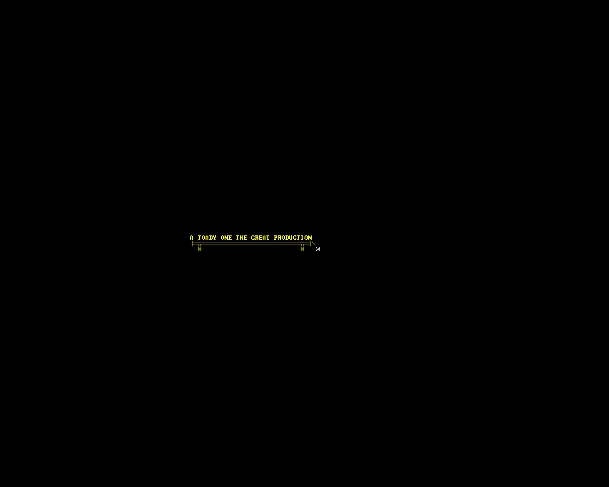 | N/A | N/A |
| [dwww](./dwww) | amd64  | ubuntu-noble | 1.16-20250327 | 失败 | N/A | N/A |
| [dx](./dx) | amd64  | ubuntu-noble | 4.4.4-15.1build2 |  | N/A | N/A |
| [dxf2gcode](./dxf2gcode) | amd64  | ubuntu-noble | 20191025-2 |  | N/A | N/A |
| [dyssol-gui](./dyssol-gui) | amd64  | ubuntu-noble | 1.1.1+ds1-2.1build4 |  | N/A | N/A |
| [eartag](./eartag) | amd64  | ubuntu-noble | 0.6.0-1-20250327 | 失败 | N/A | N/A |
| [easychem](./easychem) | amd64  | ubuntu-noble | 0.6-9build2 |  | N/A | N/A |
| [easyeffects](./easyeffects) | amd64  | deepin-v23 | 7.1.7-1-20250327 | 失败 | N/A | N/A |
| [easyssh](./easyssh) | amd64  | ubuntu-noble | 1.7.9-4build2 |  | N/A | N/A |
| [easytag](./easytag) | amd64  | ubuntu-noble | 2.4.3-5build3 |  | N/A | N/A |
| [ebook-speaker](./ebook-speaker) | amd64  | ubuntu-noble | 6.2.0-5build2-20250327 | 失败 | N/A | N/A |
| [ebook2cwgui](./ebook2cwgui) | amd64  | ubuntu-noble | 0.1.2-7build3 |  | N/A | N/A |
| [ebumeter](./ebumeter) | amd64  | ubuntu-noble | 0.5.1-1build2-20250327 | 失败 | N/A | N/A |
| [edb-debugger](./edb-debugger) | amd64  | deepin-v23 | 1.3.0-2.1deepin0 | 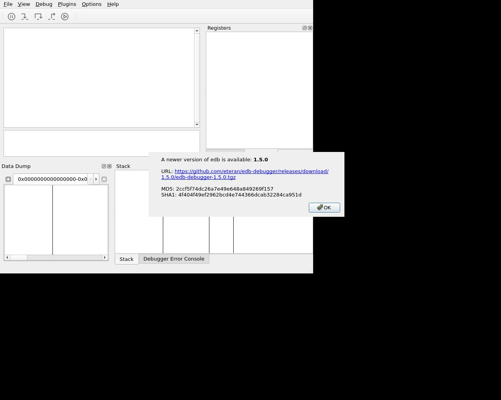 | [SHA256](./edb-debugger/SHA256SUMS) | N/A |
| [edenmath.app](./edenmath.app) | amd64  | ubuntu-noble | 1.1.1a-8build5 |  | N/A | N/A |
| [edfbrowser](./edfbrowser) | amd64  | ubuntu-noble | 2.06+dfsg-1build2 |  | N/A | N/A |
| [edgar](./edgar) | amd64  | ubuntu-noble | 1.37-1build2 |  | N/A | N/A |
| [edubuntu-docs](./edubuntu-docs) | amd64  | ubuntu-noble | 11.03.3 |  | N/A | N/A |
| [edubuntu-installer](./edubuntu-installer) | amd64  | ubuntu-noble | 0.6 |  | N/A | N/A |
| [edubuntu-menu](./edubuntu-menu) | amd64  | ubuntu-noble | 24.04.2.2-20250327 | 失败 | N/A | N/A |
| [eekboek-gui](./eekboek-gui) | amd64  | ubuntu-noble | 2.04-1build1 |  | N/A | N/A |
| [efte](./efte) | amd64  | ubuntu-noble | 1.1-4 |  | N/A | N/A |
| [eiciel](./eiciel) | amd64  | ubuntu-noble | 0.10.0-1build2 |  | N/A | N/A |
| [einstein](./einstein) | amd64  | ubuntu-noble | 2.0.dfsg.2-10build1 |  | N/A | N/A |
| [eiskaltdcpp-gtk](./eiskaltdcpp-gtk) | amd64  | ubuntu-noble | 2.4.2-1.1build6 |  | N/A | N/A |
| [eiskaltdcpp-qt](./eiskaltdcpp-qt) | amd64  | ubuntu-noble | 2.4.2-1.1build6 |  | N/A | N/A |
| [eiskaltdcpp-web](./eiskaltdcpp-web) | amd64  | ubuntu-noble | 1.0.1-2-20250327 | 失败 | N/A | N/A |
| [electric](./electric) | amd64  | ubuntu-noble | 9.07+dfsg-7-20250327 | 失败 | N/A | N/A |
| [elektroid](./elektroid) | amd64  | ubuntu-noble | 3.0.1-2build1 |  | N/A | N/A |
| [elisa](./elisa) | amd64  | ubuntu-noble | 23.08.5-0ubuntu3 |  | N/A | N/A |
| [elki](./elki) | amd64  | ubuntu-noble | 0.7.1-10.1-20250327 | 失败 | N/A | N/A |
| [emacs-common](./emacs-common) | amd64  | ubuntu-noble | 29.3+1-1ubuntu2-20250327 | 失败 | N/A | N/A |
| [emacs-gtk](./emacs-gtk) | amd64  | ubuntu-noble | 29.3+1-1ubuntu2 |  | N/A | N/A |
| [emacs-lucid](./emacs-lucid) | amd64  | ubuntu-noble | 29.3+1-1ubuntu2 |  | N/A | N/A |
| [emacs-pgtk](./emacs-pgtk) | amd64  | ubuntu-noble | 29.3+1-1ubuntu2 |  | N/A | N/A |
| [email-reminder](./email-reminder) | amd64  | ubuntu-noble | 0.8.3-1 |  | N/A | N/A |
| [emboss-explorer](./emboss-explorer) | amd64  | ubuntu-noble | 2.2.0-12-20250327 | 失败 | N/A | N/A |
| [emerald](./emerald) | amd64  | ubuntu-noble | 0.8.18-4.2build1 |  | N/A | N/A |
| [empire](./empire) | amd64  | ubuntu-noble | 1.16-2-20250327 | 失败 | N/A | N/A |
| [endeavour](./endeavour) | amd64  | ubuntu-noble | 43.0-1build3 |  | N/A | N/A |
| [endless-sky](./endless-sky) | amd64  | ubuntu-noble | 0.10.4-1build2 |  | N/A | N/A |
| [enemylines3](./enemylines3) | amd64  | ubuntu-noble | 1.25-1build3 |  | N/A | N/A |
| [enemylines7](./enemylines7) | amd64  | ubuntu-noble | 0.6-6 |  | N/A | N/A |
| [engauge-digitizer](./engauge-digitizer) | amd64  | ubuntu-noble | 12.1+ds.1-1build3 |  | N/A | N/A |
| [engrampa](./engrampa) | amd64  | ubuntu-noble | 1.26.2-4 |  | N/A | N/A |
| [enigma](./enigma) | amd64  | ubuntu-noble | 1.30+dfsg-1build2 |  | N/A | N/A |
| [enlightenment](./enlightenment) | amd64  | ubuntu-noble | 0.26.0-2build2 |    | N/A | N/A |
| [entagged](./entagged) | amd64  | ubuntu-noble | 0.35-6 |  | N/A | N/A |
| [entangle](./entangle) | amd64  | ubuntu-noble | 3.0-4build2-20250327 | 失败 | N/A | N/A |
| [eog](./eog) | amd64  | ubuntu-noble | 45.3-1ubuntu2-20250327 | 失败 | N/A | N/A |
| [eom](./eom) | amd64  | ubuntu-noble | 1.26.1-1build3-20250327 | 失败 | N/A | N/A |
| [ephoto](./ephoto) | amd64  | ubuntu-noble | 1.6.0-1build2 |  | N/A | N/A |
| [epiphany](./epiphany) | amd64  | ubuntu-noble | 0.7.0+0-7-20250327 | 失败 | N/A | N/A |
| [epiphany-browser](./epiphany-browser) | amd64  | ubuntu-noble | 46.0-2build1 |  | N/A | N/A |
| [epoptes](./epoptes) | amd64  | ubuntu-noble | 23.08-1-20250327 | 失败 | N/A | N/A |
| [epson-tdbridge-pp100api](./epson-tdbridge-pp100api) | amd64  | deepin-v23 | 2.5.2-20250327 | 失败 | N/A | N/A |
| [epsonscan2](./epsonscan2) | amd64  | deepin-v23 | 6.7.42.10-1 |  | [SHA256](./epsonscan2/SHA256SUMS) | N/A |
| [eqonomize](./eqonomize) | amd64  | ubuntu-noble | 1.5.6-1build2 |  | N/A | N/A |
| [eric](./eric) | amd64  | ubuntu-noble | 23.2+ds1-2ubuntu1 |   | N/A | N/A |
| [errands](./errands) | amd64  | ubuntu-noble | 45.1.9-2-20250327 | 失败 | N/A | N/A |
| [eskeysetuplog-admin](./eskeysetuplog-admin) | amd64  | deepin-v23 | 6.3.0.3 |  | N/A | N/A |
| [espeakedit](./espeakedit) | amd64  | ubuntu-noble | 1.48.15-2build3 |  | N/A | N/A |
| [etherape](./etherape) | amd64  | ubuntu-noble | 0.9.20-2build3 |  | N/A | N/A |
| [etm](./etm) | amd64  | ubuntu-noble | 3.2.39-1 |  | N/A | N/A |
| [etoys](./etoys) | amd64  | ubuntu-noble | 5.0.2408-1build1 |  | N/A | N/A |
| [ettercap-graphical](./ettercap-graphical) | amd64  | ubuntu-noble | 0.8.3.1-13build3-20250327 | 失败 | N/A | N/A |
| [etw](./etw) | amd64  | ubuntu-noble | 3.6+svn162-6build3 |  | N/A | N/A |
| [euler](./euler) | amd64  | ubuntu-noble | 1.61.0-12build2-20250327 | 失败 | N/A | N/A |
| [eureka](./eureka) | amd64  | ubuntu-noble | 1.27b-2build2 |  | N/A | N/A |
| [eviacam](./eviacam) | amd64  | ubuntu-noble | 2.1.4-2.1build2 |  | N/A | N/A |
| [evilwm](./evilwm) | amd64  | deepin-v23 | 1.4.2-1-20250327 | 失败 | N/A | N/A |
| [evince](./evince) | amd64  | ubuntu-noble | 46.3.1-0ubuntu1 |  | N/A | N/A |
| [evolution](./evolution) | amd64  | ubuntu-noble | 3.52.3-0ubuntu1 |  | N/A | N/A |
| [evolution-data-server](./evolution-data-server) | amd64  | ubuntu-noble | 3.52.3-0ubuntu1-20250327 | 失败 | N/A | N/A |
| [evolvotron](./evolvotron) | amd64  | ubuntu-noble | 0.8.1-1build3 |  | N/A | N/A |
| [exadrums](./exadrums) | amd64  | ubuntu-noble | 0.7.0-1build2 |  | N/A | N/A |
| [exaile](./exaile) | amd64  | ubuntu-noble | 4.1.3+dfsg-2ubuntu1-20250327 | 失败 | N/A | N/A |
| [excellent-bifurcation](./excellent-bifurcation) | amd64  | ubuntu-noble | 0.0.20071015-9build2 |  | N/A | N/A |
| [exfalso](./exfalso) | amd64  | deepin-v23 | 4.6.0-3 |  | [SHA256](./exfalso/SHA256SUMS) | N/A |
| [expeyes](./expeyes) | amd64  | ubuntu-noble | 5.3.1+repack-6build1 |  | N/A | N/A |
| [expeyes-doc-common](./expeyes-doc-common) | amd64  | ubuntu-noble | 4.3-3-20250327 | 失败 | N/A | N/A |
| [explosive-c4](./explosive-c4) | amd64  | ubuntu-noble | 1.2-3build2 |  | N/A | N/A |
| [extremetuxracer](./extremetuxracer) | amd64  | ubuntu-noble | 0.8.3-1build1 |  | [SHA256](./extremetuxracer/SHA256SUMS) | N/A |
| [exult](./exult) | amd64  | ubuntu-noble | 1.8-2build3 |  | N/A | N/A |
| [eyes17](./eyes17) | amd64  | ubuntu-noble | 5.3.1+repack-6build1 |  | N/A | N/A |
| [f3d](./f3d) | amd64  | ubuntu-noble | 2.2.1+dfsg-2build3 |  | N/A | N/A |
| [falkon](./falkon) | amd64  | ubuntu-noble | 24.01.75-1build3 |  | N/A | N/A |
| [fanwor](./fanwor) | amd64  | ubuntu-noble | 1.16-1build2 |  | N/A | N/A |
| [far2l](./far2l) | amd64  | ubuntu-noble | 2.6.0~beta+ds-1ubuntu0.3 |  | N/A | N/A |
| [fastqc](./fastqc) | amd64  | ubuntu-noble | 0.12.1+dfsg-3 |  | N/A | N/A |
| [faustworks](./faustworks) | amd64  | ubuntu-noble | 0.5~repack0-6build3 |  | N/A | N/A |
| [fbreader](./fbreader) | amd64  | ubuntu-noble | 0.99.4+dfsg-5.1build3 |  | N/A | N/A |
| [fbzx](./fbzx) | amd64  | ubuntu-noble | 4.8.0-2build2 |  | N/A | N/A |
| [fccexam](./fccexam) | amd64  | ubuntu-noble | 1.0.7-1.1 |  | N/A | N/A |
| [fceux](./fceux) | amd64  | ubuntu-noble | 2.6.5+dfsg1-2build3 |  | N/A | N/A |
| [fcitx-config-gtk](./fcitx-config-gtk) | amd64  | deepin-v23 | 0.4.10.32-2deepin-20250327 | 失败 | N/A | N/A |
| [fcitx-data](./fcitx-data) | amd64  | deepin-v23 | 4.2.9.32.38-deepin-20250327 | 失败 | N/A | N/A |
| [fcitx-ui-light](./fcitx-ui-light) | amd64  | ubuntu-noble | 0.1.3-5-20250327 | 失败 | N/A | N/A |
| [fcitx-ui-qimpanel](./fcitx-ui-qimpanel) | amd64  | ubuntu-noble | 2.1.3-2build4 |  | N/A | N/A |
| [fcitx5](./fcitx5) | amd64  | deepin-v23 | 5.1.11-2deepin2 |   | [SHA256](./fcitx5/SHA256SUMS) | N/A |
| [fcitx5-config-qt](./fcitx5-config-qt) | amd64  | ubuntu-noble | 5.1.4-1 |   | N/A | N/A |
| [fcitx5-frontend-qt5](./fcitx5-frontend-qt5) | amd64  | deepin-v23 | 5.1.8-2deepin1+rb1-20250327 | 失败 | N/A | N/A |
| [fcitx5-frontend-qt6](./fcitx5-frontend-qt6) | amd64  | deepin-v23 | 5.1.8-2deepin1+rb1-20250327 | 失败 | N/A | N/A |
| [feathernotes](./feathernotes) | amd64  | ubuntu-noble | 1.1.1-1build2 |  | N/A | N/A |
| [featherpad](./featherpad) | amd64  | ubuntu-noble | 1.4.1-0ubuntu4 |  | N/A | N/A |
| [feh](./feh) | amd64  | ubuntu-noble | 3.10.1-1ubuntu0.1-20250327 | 失败 | N/A | N/A |
| [felix-latin](./felix-latin) | amd64  | ubuntu-noble | 2.0-14build2 |  | N/A | N/A |
| [ferret](./ferret) | amd64  | ubuntu-noble | 0.7-3 |  | N/A | N/A |
| [ferret-vis](./ferret-vis) | amd64  | ubuntu-noble | 7.6.0-7ubuntu1 |  | N/A | N/A |
| [fet](./fet) | amd64  | ubuntu-noble | 6.8.5-1build2 |  | N/A | N/A |
| [ffado-mixer-qt4](./ffado-mixer-qt4) | amd64  | deepin-v23 | 2.4.9-1 |  | [SHA256](./ffado-mixer-qt4/SHA256SUMS) | N/A |
| [fgallery](./fgallery) | amd64  | ubuntu-noble | 1.9.1+ds-2-20250327 | 失败 | N/A | N/A |
| [fheroes2](./fheroes2) | amd64  | ubuntu-noble | 1.0.12+dfsg-1 |  | N/A | N/A |
| [file-roller](./file-roller) | amd64  | ubuntu-noble | 44.3-0ubuntu1 |  | N/A | N/A |
| [filelight](./filelight) | amd64  | ubuntu-noble | 23.08.5-0ubuntu3 |  | N/A | N/A |
| [filezilla](./filezilla) | amd64  | ubuntu-noble | 3.66.5-2build2 |  | N/A | N/A |
| [filius](./filius) | amd64  | ubuntu-noble | 2.5.1+ds-1-20250327 | 失败 | N/A | N/A |
| [filler](./filler) | amd64  | ubuntu-noble | 1.02-6.4 |  | N/A | N/A |
| [fillets-ng](./fillets-ng) | amd64  | ubuntu-noble | 1.0.1-4build2 |  | N/A | N/A |
| [firefox](./firefox) | amd64  | deepin-v23 | 131.0.3-1deepin1 |  | [SHA256](./firefox/SHA256SUMS) | N/A |
| [firefox-esr](./firefox-esr) | amd64  | deepin-v23 | 115.2.1esr-1 |  | [SHA256](./firefox-esr/SHA256SUMS) | N/A |
| [firetools](./firetools) | amd64  | ubuntu-noble | 0.9.72-1build2 |   | N/A | N/A |
| [firewall-config](./firewall-config) | amd64  | deepin-v23 | 2.1.2-1-20250327 | 失败 | N/A | N/A |
| [fish-common](./fish-common) | amd64  | deepin-v23 | 3.7.1-1 |  | N/A | N/A |
| [fityk](./fityk) | amd64  | ubuntu-noble | 1.3.2-3build3 |  | N/A | N/A |
| [five-or-more](./five-or-more) | amd64  | ubuntu-noble | 3.32.3-1build2 |  | N/A | N/A |
| [flamerobin](./flamerobin) | amd64  | ubuntu-noble | 0.9.10.ds.2-1build2 |  | N/A | N/A |
| [flameshot](./flameshot) | amd64  | deepin-v23 | 12.1.0-3 |  | [SHA256](./flameshot/SHA256SUMS) | N/A |
| [flamp](./flamp) | amd64  | ubuntu-noble | 2.2.09-1build2 |  | N/A | N/A |
| [flare-engine](./flare-engine) | amd64  | ubuntu-noble | 1.14-3 |  | N/A | N/A |
| [fldiff](./fldiff) | amd64  | ubuntu-noble | 1.1+0-6build3 |  | N/A | N/A |
| [fldigi](./fldigi) | amd64  | ubuntu-noble | 4.2.03-1build3 |   | N/A | N/A |
| [flent](./flent) | amd64  | ubuntu-noble | 2.1.1-2-20250327 | 失败 | N/A | N/A |
| [flight-of-the-amazon-queen](./flight-of-the-amazon-queen) | amd64  | ubuntu-noble | 1.0.0-9 |  | N/A | N/A |
| [flightgear](./flightgear) | amd64  | ubuntu-noble | 2020.3.18+dfsg-1.1 |   | N/A | N/A |
| [flmsg](./flmsg) | amd64  | ubuntu-noble | 4.0.23-1build2 |  | N/A | N/A |
| [flobopuyo](./flobopuyo) | amd64  | ubuntu-noble | 0.20-5.1 |  | N/A | N/A |
| [flowblade](./flowblade) | amd64  | ubuntu-noble | 2.12.0.2-1ubuntu1-20250327 | 失败 | N/A | N/A |
| [flpsed](./flpsed) | amd64  | ubuntu-noble | 0.7.3-9build2 |  | N/A | N/A |
| [flrig](./flrig) | amd64  | ubuntu-noble | 2.0.04-1build2 |  | N/A | N/A |
| [fltk1.1-games](./fltk1.1-games) | amd64  | deepin-v23 | 1.1.10-29 |    | [SHA256](./fltk1.1-games/SHA256SUMS) | N/A |
| [fltk1.3-games](./fltk1.3-games) | amd64  | ubuntu-noble | 1.3.8-6.1build2 |    | N/A | N/A |
| [fluid](./fluid) | amd64  | ubuntu-noble | 1.3.8-6.1build2 |  | N/A | N/A |
| [fluidsynth-dssi](./fluidsynth-dssi) | amd64  | ubuntu-noble | 1.0.0-9build1-20250327 | 失败 | N/A | N/A |
| [flwrap](./flwrap) | amd64  | ubuntu-noble | 1.3.6-1build2 |  | N/A | N/A |
| [fmit](./fmit) | amd64  | ubuntu-noble | 1.2.14-0.1build4 |  | N/A | N/A |
| [fnott](./fnott) | amd64  | ubuntu-noble | 1.4.1+ds-1build3-20250327 | 失败 | N/A | N/A |
| [focuswriter](./focuswriter) | amd64  | ubuntu-noble | 1.8.6-1build2 |  | N/A | N/A |
| [foliate](./foliate) | amd64  | ubuntu-noble | 4.~really3.1.1-1-20250327 | 失败 | N/A | N/A |
| [font-downloader](./font-downloader) | amd64  | ubuntu-noble | 10.0.0-3-20250327 | 失败 | N/A | N/A |
| [font-manager](./font-manager) | amd64  | ubuntu-noble | 0.8.8-4build2 |  | N/A | N/A |
| [font-viewer](./font-viewer) | amd64  | ubuntu-noble | 0.8.8-4build2 |  | N/A | N/A |
| [fontforge](./fontforge) | amd64  | deepin-v23 | 20230101~dfsg-3 |  | [SHA256](./fontforge/SHA256SUMS) | N/A |
| [fontmatrix](./fontmatrix) | amd64  | ubuntu-noble | 0.9.100+ds-1build2 |  | N/A | N/A |
| [foobillardplus](./foobillardplus) | amd64  | ubuntu-noble | 3.43~svn170+dfsg-7build2 |  | N/A | N/A |
| [fookb](./fookb) | amd64  | ubuntu-noble | 4.1-3 |  | N/A | N/A |
| [foot](./foot) | amd64  | ubuntu-noble | 1.16.2-2ubuntu0.1-20250327 | 失败 | N/A | N/A |
| [form](./form) | amd64  | ubuntu-noble | 4.3.0+git20230104+ds-1build2-20250327 | 失败 | N/A | N/A |
| [formiko](./formiko) | amd64  | ubuntu-noble | 1.4.3-2.1-20250327 | 失败 | N/A | N/A |
| [fotoxx](./fotoxx) | amd64  | ubuntu-noble | 20.08-2build5 |  | N/A | N/A |
| [founder-sane-backend](./founder-sane-backend) | amd64  | deepin-v23 | 20200526-1.4.5.011-20250327 | 失败 | N/A | N/A |
| [four-in-a-row](./four-in-a-row) | amd64  | deepin-v23 | 3.38.1-deepin1-20250327 | 失败 | N/A | N/A |
| [foxtrotgps](./foxtrotgps) | amd64  | ubuntu-noble | 1.2.2+bzr332-1build4 |  | N/A | N/A |
| [fqterm](./fqterm) | amd64  | ubuntu-noble | 0.9.10.1-4build3 |  | N/A | N/A |
| [fracplanet](./fracplanet) | amd64  | ubuntu-noble | 0.5.1-6build3 |  | N/A | N/A |
| [fractalnow](./fractalnow) | amd64  | ubuntu-noble | 0.8.2-5build2 |  | N/A | N/A |
| [fractgen](./fractgen) | amd64  | ubuntu-noble | 2.1.13-1build3 |  | N/A | N/A |
| [fraqtive](./fraqtive) | amd64  | ubuntu-noble | 0.4.8.1-1build3 |  | N/A | N/A |
| [free42-nologo](./free42-nologo) | amd64  | ubuntu-noble | 3.1.4+ds-1build2 |   | N/A | N/A |
| [freealchemist](./freealchemist) | amd64  | ubuntu-noble | 0.5-2 |  | N/A | N/A |
| [freeciv-client-extras](./freeciv-client-extras) | amd64  | ubuntu-noble | 3.1.0+ds-1build5 |  | N/A | N/A |
| [freeciv-client-gtk3](./freeciv-client-gtk3) | amd64  | ubuntu-noble | 3.1.0+ds-1build5 |  | N/A | N/A |
| [freeciv-client-qt](./freeciv-client-qt) | amd64  | ubuntu-noble | 3.1.0+ds-1build5 |  | N/A | N/A |
| [freeciv-client-sdl](./freeciv-client-sdl) | amd64  | ubuntu-noble | 3.1.0+ds-1build5 |  | N/A | N/A |
| [freeciv-ruleset-tools](./freeciv-ruleset-tools) | amd64  | ubuntu-noble | 3.1.0+ds-1build5 |  | N/A | N/A |
| [freeciv-server](./freeciv-server) | amd64  | ubuntu-noble | 3.1.0+ds-1build5 |  | N/A | N/A |
| [freecol](./freecol) | amd64  | ubuntu-noble | 1.1.0-1-20250327 | 失败 | N/A | N/A |
| [freedink-dfarc](./freedink-dfarc) | amd64  | ubuntu-noble | 3.14-5build3 |  | N/A | N/A |
| [freedink-engine](./freedink-engine) | amd64  | ubuntu-noble | 109.6-5 |   | N/A | N/A |
| [freedm](./freedm) | amd64  | ubuntu-noble | 0.13.0-1 |  | N/A | N/A |
| [freedoom](./freedoom) | amd64  | ubuntu-noble | 0.13.0-1 |   | N/A | N/A |
| [freedroid](./freedroid) | amd64  | ubuntu-noble | 1.0.2+cvs040112-7 |  | N/A | N/A |
| [freedroidrpg](./freedroidrpg) | amd64  | ubuntu-noble | 1.0-1build2 |  | N/A | N/A |
| [freedv](./freedv) | amd64  | ubuntu-noble | 1.8.11-1build4 |  | N/A | N/A |
| [freefilesync](./freefilesync) | amd64  | ubuntu-noble | 13.3-2build3 |   | N/A | N/A |
| [freegish](./freegish) | amd64  | ubuntu-noble | 1.53+git20170110+dfsg-2build2 |  | N/A | N/A |
| [freeorion](./freeorion) | amd64  | ubuntu-noble | 0.5+git20230820-4build5 |  | N/A | N/A |
| [freeplane](./freeplane) | amd64  | ubuntu-noble | 1.7.10-1-20250327 | 失败 | N/A | N/A |
| [freespace2-launcher-wxlauncher](./freespace2-launcher-wxlauncher) | amd64  | ubuntu-noble | 0.12.0~rc3+dfsg-1build2 |   | N/A | N/A |
| [freesweep](./freesweep) | amd64  | ubuntu-noble | 1.0.2-1-20250327 | 失败 | N/A | N/A |
| [freetuxtv](./freetuxtv) | amd64  | ubuntu-noble | 0.6.8~dfsg1-2build3 |  | N/A | N/A |
| [freewheeling](./freewheeling) | amd64  | ubuntu-noble | 0.6.6-1build3-20250327 | 失败 | N/A | N/A |
| [frescobaldi](./frescobaldi) | amd64  | ubuntu-noble | 3.3.0+ds1-2 |  | N/A | N/A |
| [fritzing](./fritzing) | amd64  | ubuntu-noble | 1.0.1-1build4 |  | N/A | N/A |
| [frogatto](./frogatto) | amd64  | ubuntu-noble | 1.3.1+dfsg-6build4 |  | N/A | N/A |
| [frogr](./frogr) | amd64  | ubuntu-noble | 1.8.1-1build3 |  | [SHA256](./frogr/SHA256SUMS) | N/A |
| [frozen-bubble](./frozen-bubble) | amd64  | ubuntu-noble | 2.212-12build5 |  | [SHA256](./frozen-bubble/SHA256SUMS) | N/A |
| [fs-uae](./fs-uae) | amd64  | ubuntu-noble | 3.1.66-2build2-20250327 | 失败 | [SHA256](./fs-uae/SHA256SUMS) | N/A |
| [fs-uae-arcade](./fs-uae-arcade) | amd64  | ubuntu-noble | 3.1.63-2-20250327 | 失败 | [SHA256](./fs-uae-arcade/SHA256SUMS) | N/A |
| [ft2-clone](./ft2-clone) | amd64  | ubuntu-noble | 1.72.1+ds-1build3 |  | [SHA256](./ft2-clone/SHA256SUMS) | N/A |
| [ftools-fv](./ftools-fv) | amd64  | ubuntu-noble | 5.5.2+dfsg-3-20250327 | 失败 | [SHA256](./ftools-fv/SHA256SUMS) | N/A |
| [ftp.app](./ftp.app) | amd64  | ubuntu-noble | 0.6-2build5 |  | [SHA256](./ftp.app/SHA256SUMS) | N/A |
| [funguloids](./funguloids) | amd64  | ubuntu-noble | 1.06-15build2-20250327 | 失败 | [SHA256](./funguloids/SHA256SUMS) | N/A |
| [funnyboat](./funnyboat) | amd64  | ubuntu-noble | 1.5-11-20250327 | 失败 | [SHA256](./funnyboat/SHA256SUMS) | N/A |
| [fuse-emulator-gtk](./fuse-emulator-gtk) | amd64  | ubuntu-noble | 1.6.0+dfsg1-2build3 |  | [SHA256](./fuse-emulator-gtk/SHA256SUMS) | N/A |
| [fuse-emulator-sdl](./fuse-emulator-sdl) | amd64  | ubuntu-noble | 1.6.0+dfsg1-2build3 |  | [SHA256](./fuse-emulator-sdl/SHA256SUMS) | N/A |
| [fusion-icon](./fusion-icon) | amd64  | ubuntu-noble | 0.2.4-8-20250327 | 失败 | N/A | N/A |
| [fwbuilder](./fwbuilder) | amd64  | ubuntu-noble | 5.3.7-5ubuntu0.24.04.1 |  | [SHA256](./fwbuilder/SHA256SUMS) | N/A |
| [gabedit](./gabedit) | amd64  | ubuntu-noble | 2.5.1+ds-1build3 |  | [SHA256](./gabedit/SHA256SUMS) | N/A |
| [gajim](./gajim) | amd64  | ubuntu-noble | 1.8.4-3-20250327 | 失败 | N/A | N/A |
| [galculator](./galculator) | amd64  | ubuntu-noble | 2.1.4-1.2build2 |  | [SHA256](./galculator/SHA256SUMS) | N/A |
| [galois](./galois) | amd64  | ubuntu-noble | 0.8-1build2 |  | [SHA256](./galois/SHA256SUMS) | N/A |
| [galternatives](./galternatives) | amd64  | ubuntu-noble | 1.0.9-20250327 | 失败 | N/A | N/A |
| [gamazons](./gamazons) | amd64  | ubuntu-noble | 0.83-12 |  | [SHA256](./gamazons/SHA256SUMS) | N/A |
| [gambas3-ide](./gambas3-ide) | amd64  | ubuntu-noble | 3.19.0-2ubuntu10 |  | [SHA256](./gambas3-ide/SHA256SUMS) | N/A |
| [game-data-packager-runtime](./game-data-packager-runtime) | amd64  | ubuntu-noble | 77ubuntu2-20250327 | 失败 | N/A | N/A |
| [gameconqueror](./gameconqueror) | amd64  | ubuntu-noble | 0.17-5build2-20250327 | 失败 | N/A | N/A |
| [gamgi](./gamgi) | amd64  | ubuntu-noble | 0.17.5-1build2 |  | [SHA256](./gamgi/SHA256SUMS) | N/A |
| [gamine](./gamine) | amd64  | ubuntu-noble | 1.6-1build3 |  | [SHA256](./gamine/SHA256SUMS) | N/A |
| [gammaray](./gammaray) | amd64  | deepin-v23 | 2.11.3-3-20250327 | 失败 | N/A | N/A |
| [gammastep](./gammastep) | amd64  | ubuntu-noble | 2.0.9-1build2-20250327 | 失败 | [SHA256](./gammastep/SHA256SUMS) | N/A |
| [ganyremote](./ganyremote) | amd64  | ubuntu-noble | 8.1.1-1-20250327 | 失败 | N/A | N/A |
| [garden-of-coloured-lights](./garden-of-coloured-lights) | amd64  | ubuntu-noble | 1.0.9-2build3 |  | [SHA256](./garden-of-coloured-lights/SHA256SUMS) | N/A |
| [gargoyle-free](./gargoyle-free) | amd64  | ubuntu-noble | 2023.1+dfsg-4build4 |  | [SHA256](./gargoyle-free/SHA256SUMS) | N/A |
| [garlic](./garlic) | amd64  | ubuntu-noble | 1.6-3 |  | [SHA256](./garlic/SHA256SUMS) | N/A |
| [gastman](./gastman) | amd64  | ubuntu-noble | 0.99+1.0rc1-0ubuntu12 |  | [SHA256](./gastman/SHA256SUMS) | N/A |
| [gaupol](./gaupol) | amd64  | ubuntu-noble | 1.11-2-20250327 | 失败 | N/A | N/A |
| [gausssum](./gausssum) | amd64  | ubuntu-noble | 3.0.2-2-20250327 | 失败 | [SHA256](./gausssum/SHA256SUMS) | N/A |
| [gav](./gav) | amd64  | ubuntu-noble | 0.9.0-3.2 |  | [SHA256](./gav/SHA256SUMS) | N/A |
| [gbatnav](./gbatnav) | amd64  | ubuntu-noble | 1.0.4cvs20051004-7 |   | [SHA256](./gbatnav/SHA256SUMS) | N/A |
| [gbemol](./gbemol) | amd64  | ubuntu-noble | 0.3.2-2ubuntu6 |  | [SHA256](./gbemol/SHA256SUMS) | N/A |
| [gbgoffice](./gbgoffice) | amd64  | ubuntu-noble | 1.4-12build2 |  | [SHA256](./gbgoffice/SHA256SUMS) | N/A |
| [gbonds](./gbonds) | amd64  | ubuntu-noble | 2.0.3-17build3 |  | [SHA256](./gbonds/SHA256SUMS) | N/A |
| [gbrainy](./gbrainy) | amd64  | ubuntu-noble | 2.4.6-2build1 |  | [SHA256](./gbrainy/SHA256SUMS) | N/A |
| [gbsplay](./gbsplay) | amd64  | ubuntu-noble | 0.0.96-1build3-20250327 | 失败 | [SHA256](./gbsplay/SHA256SUMS) | N/A |
| [gchempaint](./gchempaint) | amd64  | ubuntu-noble | 0.14.17-6.2build2 |  | [SHA256](./gchempaint/SHA256SUMS) | N/A |
| [gcin](./gcin) | amd64  | ubuntu-noble | 2.9.0+dfsg1-3build1 |  | [SHA256](./gcin/SHA256SUMS) | N/A |
| [gcolor3](./gcolor3) | amd64  | ubuntu-noble | 2.4.0-2build2 |  | [SHA256](./gcolor3/SHA256SUMS) | N/A |
| [gcompris-qt](./gcompris-qt) | amd64  | ubuntu-noble | 4.0-1build3 |  | [SHA256](./gcompris-qt/SHA256SUMS) | N/A |
| [gconjugue](./gconjugue) | amd64  | ubuntu-noble | 0.8.5-2build2 |  | [SHA256](./gconjugue/SHA256SUMS) | N/A |
| [gcr](./gcr) | amd64  | ubuntu-noble | 3.41.2-1build3-20250327 | 失败 | [SHA256](./gcr/SHA256SUMS) | N/A |
| [gcrystal](./gcrystal) | amd64  | ubuntu-noble | 0.14.17-6.2build2 |  | [SHA256](./gcrystal/SHA256SUMS) | N/A |
| [gcu-bin](./gcu-bin) | amd64  | ubuntu-noble | 0.14.17-6.2build2 |     | [SHA256](./gcu-bin/SHA256SUMS) | N/A |
| [gddccontrol](./gddccontrol) | amd64  | deepin-v23 | 1.0.3-1deepin1 |  | [SHA256](./gddccontrol/SHA256SUMS) | N/A |
| [gdebi](./gdebi) | amd64  | deepin-v23 | 0.9.5.7+nmu7-20250327 | 失败 | N/A | N/A |
| [gdigi](./gdigi) | amd64  | ubuntu-noble | 0.4.0+git20200615+1c2c89f-3build3-20250327 | 失败 | [SHA256](./gdigi/SHA256SUMS) | N/A |
| [gdis](./gdis) | amd64  | ubuntu-noble | 0.90-6build3 |  | [SHA256](./gdis/SHA256SUMS) | N/A |
| [gdm-settings](./gdm-settings) | amd64  | ubuntu-noble | 4.3-1-20250327 | 失败 | N/A | N/A |
| [gdm3](./gdm3) | amd64  | ubuntu-noble | 46.2-1ubuntu1~24.04.1-20250327 | 失败 | N/A | N/A |
| [gdmap](./gdmap) | amd64  | ubuntu-noble | 1.2.0-1build2 |  | [SHA256](./gdmap/SHA256SUMS) | N/A |
| [gdpc](./gdpc) | amd64  | ubuntu-noble | 2.2.5-16build2 |  | [SHA256](./gdpc/SHA256SUMS) | N/A |
| [geany](./geany) | amd64  | ubuntu-noble | 2.0-1build2 |  | [SHA256](./geany/SHA256SUMS) | N/A |
| [gearhead](./gearhead) | amd64  | ubuntu-noble | 1.310-3 |  | [SHA256](./gearhead/SHA256SUMS) | N/A |
| [gearhead-sdl](./gearhead-sdl) | amd64  | ubuntu-noble | 1.310-3-20250327 | 失败 | [SHA256](./gearhead-sdl/SHA256SUMS) | N/A |
| [gearhead2](./gearhead2) | amd64  | ubuntu-noble | 0.701-2 |  | [SHA256](./gearhead2/SHA256SUMS) | N/A |
| [gearhead2-sdl](./gearhead2-sdl) | amd64  | ubuntu-noble | 0.701-2-20250327 | 失败 | [SHA256](./gearhead2-sdl/SHA256SUMS) | N/A |
| [geary](./geary) | amd64  | ubuntu-noble | 44.1-2build2-20250327 | 失败 | [SHA256](./geary/SHA256SUMS) | N/A |
| [gedit](./gedit) | amd64  | ubuntu-noble | 46.2-2-20250327 | 失败 | N/A | N/A |
| [geeqie](./geeqie) | amd64  | ubuntu-noble | 2.2-2ubuntu0.1-20250327 | 失败 | [SHA256](./geeqie/SHA256SUMS) | v1.5.3-amd64-nevm |
| [geeqie-common](./geeqie-common) | amd64  | ubuntu-noble | 2.2-2ubuntu0.1-20250327 | 失败 | [SHA256](./geeqie-common/SHA256SUMS) | v1.5.3-amd64-nevm |
| [geg](./geg) | amd64  | ubuntu-noble | 2.0.9-4build2 |  | [SHA256](./geg/SHA256SUMS) | N/A |
| [geis-tools](./geis-tools) | amd64  | ubuntu-noble | 2.2.17+16.04.20160126-0ubuntu10-20250327 | 失败 | [SHA256](./geis-tools/SHA256SUMS) | N/A |
| [geki2](./geki2) | amd64  | ubuntu-noble | 2.0.3-10 |  | [SHA256](./geki2/SHA256SUMS) | N/A |
| [geki3](./geki3) | amd64  | ubuntu-noble | 1.0.3-10 |  | [SHA256](./geki3/SHA256SUMS) | N/A |
| [gelemental](./gelemental) | amd64  | ubuntu-noble | 2.0.2-1.1build2 |  | [SHA256](./gelemental/SHA256SUMS) | N/A |
| [gemdropx](./gemdropx) | amd64  | ubuntu-noble | 0.9-9 |  | [SHA256](./gemdropx/SHA256SUMS) | N/A |
| [gemrb](./gemrb) | amd64  | ubuntu-noble | 0.9.2+dfsg-1build3-20250327 | 失败 | [SHA256](./gemrb/SHA256SUMS) | N/A |
| [gemrb-baldurs-gate](./gemrb-baldurs-gate) | amd64  | ubuntu-noble | 0.9.2+dfsg-1build3-20250327 | 失败 | [SHA256](./gemrb-baldurs-gate/SHA256SUMS) | N/A |
| [gemrb-baldurs-gate-2](./gemrb-baldurs-gate-2) | amd64  | ubuntu-noble | 0.9.2+dfsg-1build3-20250327 | 失败 | [SHA256](./gemrb-baldurs-gate-2/SHA256SUMS) | N/A |
| [gemrb-icewind-dale](./gemrb-icewind-dale) | amd64  | ubuntu-noble | 0.9.2+dfsg-1build3-20250327 | 失败 | [SHA256](./gemrb-icewind-dale/SHA256SUMS) | N/A |
| [gemrb-icewind-dale-2](./gemrb-icewind-dale-2) | amd64  | ubuntu-noble | 0.9.2+dfsg-1build3-20250327 | 失败 | [SHA256](./gemrb-icewind-dale-2/SHA256SUMS) | N/A |
| [gemrb-planescape-torment](./gemrb-planescape-torment) | amd64  | ubuntu-noble | 0.9.2+dfsg-1build3-20250327 | 失败 | [SHA256](./gemrb-planescape-torment/SHA256SUMS) | N/A |
| [gentle](./gentle) | amd64  | ubuntu-noble | 1.9.5~alpha1+dfsg-1build2 |  | [SHA256](./gentle/SHA256SUMS) | N/A |
| [gentoo](./gentoo) | amd64  | ubuntu-noble | 0.20.7-3build2 |  | [SHA256](./gentoo/SHA256SUMS) | N/A |
| [geoclue-2-demo](./geoclue-2-demo) | amd64  | deepin-v23 | 2.7.1-2-20250327 | 失败 | N/A | N/A |
| [geoclue-2.0](./geoclue-2.0) | amd64  | deepin-v23 | 2.7.1-2-20250327 | 失败 | N/A | N/A |
| [geogebra](./geogebra) | amd64  | ubuntu-noble | 4.0.34.0+dfsg1-9 |  | [SHA256](./geogebra/SHA256SUMS) | N/A |
| [geomview](./geomview) | amd64  | ubuntu-noble | 1.9.5-4.1build2 |  | [SHA256](./geomview/SHA256SUMS) | N/A |
| [geonkick](./geonkick) | amd64  | ubuntu-noble | 2.10.2-0ubuntu4-20250327 | 失败 | [SHA256](./geonkick/SHA256SUMS) | N/A |
| [geophar](./geophar) | amd64  | ubuntu-noble | 18.09+dfsg1-2-20250327 | 失败 | [SHA256](./geophar/SHA256SUMS) | N/A |
| [geotranz](./geotranz) | amd64  | ubuntu-noble | 3.7-3ubuntu1 |  | [SHA256](./geotranz/SHA256SUMS) | N/A |
| [gerbera](./gerbera) | amd64  | ubuntu-noble | 2.0.0+dfsg-1build3-20250327 | 失败 | [SHA256](./gerbera/SHA256SUMS) | N/A |
| [gerbv](./gerbv) | amd64  | ubuntu-noble | 2.10.0-1build2 |  | [SHA256](./gerbv/SHA256SUMS) | N/A |
| [gfaim](./gfaim) | amd64  | ubuntu-noble | 0.30-0ubuntu6-20250327 | 失败 | [SHA256](./gfaim/SHA256SUMS) | N/A |
| [gfm](./gfm) | amd64  | ubuntu-noble | 1.09~git20220826.71eaa92-1build2 |  | [SHA256](./gfm/SHA256SUMS) | N/A |
| [gfpoken](./gfpoken) | amd64  | ubuntu-noble | 1-4build2 |  | [SHA256](./gfpoken/SHA256SUMS) | N/A |
| [gftp-gtk](./gftp-gtk) | amd64  | ubuntu-noble | 2.9.1~beta-2build2 |  | [SHA256](./gftp-gtk/SHA256SUMS) | N/A |
| [ggobi](./ggobi) | amd64  | ubuntu-noble | 2.1.11-2build3 |  | [SHA256](./ggobi/SHA256SUMS) | N/A |
| [ghex](./ghex) | amd64  | ubuntu-noble | 46.0-1build1 |  | [SHA256](./ghex/SHA256SUMS) | N/A |
| [ghextris](./ghextris) | amd64  | ubuntu-noble | 0.9.0-5-20250327 | 失败 | N/A | N/A |
| [ghostwriter](./ghostwriter) | amd64  | ubuntu-noble | 23.08.5+ds-0ubuntu3 |  | [SHA256](./ghostwriter/SHA256SUMS) | N/A |
| [giada](./giada) | amd64  | ubuntu-noble | 0.22.0-4build2 |  | [SHA256](./giada/SHA256SUMS) | N/A |
| [giara](./giara) | amd64  | ubuntu-noble | 1.1.0-0.1-20250327 | 失败 | N/A | N/A |
| [gigalomania](./gigalomania) | amd64  | ubuntu-noble | 1.0+ds1-1.1 |  | [SHA256](./gigalomania/SHA256SUMS) | N/A |
| [giggle](./giggle) | amd64  | ubuntu-noble | 0.7-6build2 |  | [SHA256](./giggle/SHA256SUMS) | N/A |
| [gigolo](./gigolo) | amd64  | ubuntu-noble | 0.5.3-1build2 |  | [SHA256](./gigolo/SHA256SUMS) | N/A |
| [gimagereader](./gimagereader) | amd64  | ubuntu-noble | 3.4.2-2build6-20250327 | 失败 | N/A | N/A |
| [gimagereader-qt5](./gimagereader-qt5) | amd64  | ubuntu-noble | 3.4.2-2build6-20250327 | 失败 | N/A | N/A |
| [gimp](./gimp) | amd64  | deepin-v23 | 2.10.38-1deepin2 |  | [SHA256](./gimp/SHA256SUMS) | N/A |
| [ginga](./ginga) | amd64  | ubuntu-noble | 5.0.0-1 |  | [SHA256](./ginga/SHA256SUMS) | N/A |
| [git-annex](./git-annex) | amd64  | ubuntu-noble | 10.20240129-1build1 |  | [SHA256](./git-annex/SHA256SUMS) | N/A |
| [git-cola](./git-cola) | amd64  | ubuntu-noble | 4.6.1-1 |   | [SHA256](./git-cola/SHA256SUMS) | N/A |
| [gitg](./gitg) | amd64  | ubuntu-noble | 44-1build2-20250327 | 失败 | N/A | N/A |
| [github-desktop](./github-desktop) | amd64  | shiftkey | -20250327 | 失败 | N/A | v1.5.3-amd64-nevm |
| [gitso](./gitso) | amd64  | ubuntu-noble | 0.6.2+svn158+dfsg-4 |  | [SHA256](./gitso/SHA256SUMS) | N/A |
| [gjacktransport](./gjacktransport) | amd64  | ubuntu-noble | 0.6.4-1build2 |   | [SHA256](./gjacktransport/SHA256SUMS) | N/A |
| [gjiten](./gjiten) | amd64  | ubuntu-noble | 3.1-2build2 |  | [SHA256](./gjiten/SHA256SUMS) | N/A |
| [gjots2](./gjots2) | amd64  | ubuntu-noble | 3.1.9-0ubuntu2-20250327 | 失败 | [SHA256](./gjots2/SHA256SUMS) | N/A |
| [gkamus](./gkamus) | amd64  | ubuntu-noble | 1.0-0ubuntu6 |  | [SHA256](./gkamus/SHA256SUMS) | N/A |
| [gkbd-capplet](./gkbd-capplet) | amd64  | ubuntu-noble | 3.28.1-1build3-20250327 | 失败 | [SHA256](./gkbd-capplet/SHA256SUMS) | N/A |
| [gkdebconf](./gkdebconf) | amd64  | ubuntu-noble | 2.1.1build2 |  | [SHA256](./gkdebconf/SHA256SUMS) | N/A |
| [gkrellm](./gkrellm) | amd64  | ubuntu-noble | 2.3.11-2build2 |  | [SHA256](./gkrellm/SHA256SUMS) | N/A |
| [gl-117](./gl-117) | amd64  | ubuntu-noble | 1.3.2-3.1build1 |  | [SHA256](./gl-117/SHA256SUMS) | N/A |
| [glabels](./glabels) | amd64  | ubuntu-noble | 3.4.1-4build3 |  | [SHA256](./glabels/SHA256SUMS) | N/A |
| [glade](./glade) | amd64  | ubuntu-noble | 3.40.0-5build2-20250327 | 失败 | N/A | N/A |
| [glassgui](./glassgui) | amd64  | ubuntu-noble | 2.0.1-2build5 |   | [SHA256](./glassgui/SHA256SUMS) | N/A |
| [glob2](./glob2) | amd64  | ubuntu-noble | 0.9.4.4-6build1 |  | [SHA256](./glob2/SHA256SUMS) | N/A |
| [glogg](./glogg) | amd64  | ubuntu-noble | 1.1.4-1.1ubuntu2 |  | [SHA256](./glogg/SHA256SUMS) | N/A |
| [glogic](./glogic) | amd64  | ubuntu-noble | 2.6-6-20250327 | 失败 | N/A | N/A |
| [glom](./glom) | amd64  | ubuntu-noble | 1.30.4-7build8-20250327 | 失败 | N/A | N/A |
| [glpeces](./glpeces) | amd64  | ubuntu-noble | 5.2-3build3-20250327 | 失败 | [SHA256](./glpeces/SHA256SUMS) | N/A |
| [gltron](./gltron) | amd64  | ubuntu-noble | 0.70final-12.4build2 |  | [SHA256](./gltron/SHA256SUMS) | N/A |
| [glueviz](./glueviz) | amd64  | ubuntu-noble | 1.17.1+dfsg-1-20250327 | 失败 | [SHA256](./glueviz/SHA256SUMS) | N/A |
| [gm-assistant](./gm-assistant) | amd64  | ubuntu-noble | 1.2.4-1build3 |  | [SHA256](./gm-assistant/SHA256SUMS) | N/A |
| [gmanedit](./gmanedit) | amd64  | ubuntu-noble | 0.4.2-8build3 |  | [SHA256](./gmanedit/SHA256SUMS) | N/A |
| [gmerlin](./gmerlin) | amd64  | ubuntu-noble | 2.0.0~svn6298~dfsg0-3.1build3 |     | [SHA256](./gmerlin/SHA256SUMS) | N/A |
| [gmidimonitor](./gmidimonitor) | amd64  | ubuntu-noble | 3.6+dfsg0-4build3-20250327 | 失败 | [SHA256](./gmidimonitor/SHA256SUMS) | N/A |
| [gmpc](./gmpc) | amd64  | ubuntu-noble | 11.8.16-21build1 |  | [SHA256](./gmpc/SHA256SUMS) | N/A |
| [gmrun](./gmrun) | amd64  | ubuntu-noble | 0.9.2-3build3 |  | [SHA256](./gmrun/SHA256SUMS) | N/A |
| [gmsh](./gmsh) | amd64  | ubuntu-noble | 4.12.1+ds1-1.1build2 |  | [SHA256](./gmsh/SHA256SUMS) | N/A |
| [gmtp](./gmtp) | amd64  | ubuntu-noble | 1.3.11-3.1build3 |  | [SHA256](./gmtp/SHA256SUMS) | N/A |
| [gmult](./gmult) | amd64  | ubuntu-noble | 11.0-1build2 |  | [SHA256](./gmult/SHA256SUMS) | N/A |
| [gniall](./gniall) | amd64  | ubuntu-noble | 0.7.1-9build2 |  | [SHA256](./gniall/SHA256SUMS) | N/A |
| [gnomad2](./gnomad2) | amd64  | ubuntu-noble | 2.9.6-8ubuntu1 |  | [SHA256](./gnomad2/SHA256SUMS) | N/A |
| [gnome-2048](./gnome-2048) | amd64  | ubuntu-noble | 3.38.2-3build2 |  | [SHA256](./gnome-2048/SHA256SUMS) | N/A |
| [gnome-activity-journal](./gnome-activity-journal) | amd64  | ubuntu-noble | 1.0.0-3ubuntu0.24.04.1-20250327 | 失败 | N/A | N/A |
| [gnome-authenticator](./gnome-authenticator) | amd64  | ubuntu-noble | 3.32.2+dfsg1-5-20250327 | 失败 | N/A | N/A |
| [gnome-bluetooth-sendto](./gnome-bluetooth-sendto) | amd64  | ubuntu-noble | 46.0-1ubuntu1-20250327 | 失败 | [SHA256](./gnome-bluetooth-sendto/SHA256SUMS) | N/A |
| [gnome-boxes](./gnome-boxes) | amd64  | ubuntu-noble | 46.0-1build1-20250327 | 失败 | N/A | N/A |
| [gnome-breakout](./gnome-breakout) | amd64  | ubuntu-noble | 0.5.3-8 |  | [SHA256](./gnome-breakout/SHA256SUMS) | N/A |
| [gnome-browser-connector](./gnome-browser-connector) | amd64  | ubuntu-noble | 42.1-4-20250327 | 失败 | N/A | N/A |
| [gnome-builder](./gnome-builder) | amd64  | ubuntu-noble | 46.2-0ubuntu1-20250327 | 失败 | N/A | N/A |
| [gnome-calculator](./gnome-calculator) | amd64  | ubuntu-noble | 46.1-1ubuntu1~24.04.1 |  | [SHA256](./gnome-calculator/SHA256SUMS) | N/A |
| [gnome-calendar](./gnome-calendar) | amd64  | ubuntu-noble | 46.1-0ubuntu2 |  | [SHA256](./gnome-calendar/SHA256SUMS) | N/A |
| [gnome-calls](./gnome-calls) | amd64  | ubuntu-noble | 46.0-1ubuntu1 |  | [SHA256](./gnome-calls/SHA256SUMS) | N/A |
| [gnome-characters](./gnome-characters) | amd64  | ubuntu-noble | 46.0-1build1-20250327 | 失败 | N/A | N/A |
| [gnome-chess](./gnome-chess) | amd64  | ubuntu-noble | 46.0-1build1 |  | [SHA256](./gnome-chess/SHA256SUMS) | N/A |
| [gnome-clocks](./gnome-clocks) | amd64  | ubuntu-noble | 46.0-1build1 |  | [SHA256](./gnome-clocks/SHA256SUMS) | N/A |
| [gnome-color-manager](./gnome-color-manager) | amd64  | ubuntu-noble | 3.36.0-2build2 |  | [SHA256](./gnome-color-manager/SHA256SUMS) | N/A |
| [gnome-commander](./gnome-commander) | amd64  | ubuntu-noble | 1.16.1-1build4 |  | [SHA256](./gnome-commander/SHA256SUMS) | N/A |
| [gnome-connections](./gnome-connections) | amd64  | ubuntu-noble | 46.0-2 |  | [SHA256](./gnome-connections/SHA256SUMS) | N/A |
| [gnome-console](./gnome-console) | amd64  | ubuntu-noble | 46.0-1build1 |  | [SHA256](./gnome-console/SHA256SUMS) | N/A |
| [gnome-contacts](./gnome-contacts) | amd64  | ubuntu-noble | 46.0-1build1 |  | [SHA256](./gnome-contacts/SHA256SUMS) | N/A |
| [gnome-control-center](./gnome-control-center) | amd64  | ubuntu-noble | 46.5-0ubuntu0.24.04.1-20250327 | 失败 | N/A | N/A |
| [gnome-dictionary](./gnome-dictionary) | amd64  | ubuntu-noble | 40.0-3build2-20250327 | 失败 | [SHA256](./gnome-dictionary/SHA256SUMS) | N/A |
| [gnome-disk-utility](./gnome-disk-utility) | amd64  | ubuntu-noble | 46.0-1ubuntu3 |  | [SHA256](./gnome-disk-utility/SHA256SUMS) | N/A |
| [gnome-dvb-client](./gnome-dvb-client) | amd64  | ubuntu-noble | 0.2.91~git20170110-5build3-20250327 | 失败 | N/A | N/A |
| [gnome-feeds](./gnome-feeds) | amd64  | ubuntu-noble | 2.2.0-3-20250327 | 失败 | N/A | N/A |
| [gnome-firmware](./gnome-firmware) | amd64  | ubuntu-noble | 46.0-1build1 |  | [SHA256](./gnome-firmware/SHA256SUMS) | N/A |
| [gnome-flashback](./gnome-flashback) | amd64  | ubuntu-noble | 3.52.1-2ubuntu1.1-20250327 | 失败 | N/A | N/A |
| [gnome-font-viewer](./gnome-font-viewer) | amd64  | ubuntu-noble | 46.0-1build1 |  | [SHA256](./gnome-font-viewer/SHA256SUMS) | N/A |
| [gnome-genius](./gnome-genius) | amd64  | ubuntu-noble | 1.0.27-1build4 |  | [SHA256](./gnome-genius/SHA256SUMS) | N/A |
| [gnome-initial-setup](./gnome-initial-setup) | amd64  | ubuntu-noble | 46.3-1ubuntu3~24.04.1-20250327 | 失败 | [SHA256](./gnome-initial-setup/SHA256SUMS) | N/A |
| [gnome-keysign](./gnome-keysign) | amd64  | ubuntu-noble | 1.3.0-3-20250327 | 失败 | N/A | N/A |
| [gnome-kiosk](./gnome-kiosk) | amd64  | ubuntu-noble | 46.0-1build2-20250327 | 失败 | N/A | N/A |
| [gnome-kiosk-script-session](./gnome-kiosk-script-session) | amd64  | ubuntu-noble | 46.0-1build2-20250327 | 失败 | N/A | N/A |
| [gnome-kiosk-search-appliance](./gnome-kiosk-search-appliance) | amd64  | ubuntu-noble | 46.0-1build2-20250327 | 失败 | N/A | N/A |
| [gnome-klotski](./gnome-klotski) | amd64  | ubuntu-noble | 3.38.2-1build3 |  | [SHA256](./gnome-klotski/SHA256SUMS) | N/A |
| [gnome-logs](./gnome-logs) | amd64  | ubuntu-noble | 45.0-1build1 |  | [SHA256](./gnome-logs/SHA256SUMS) | N/A |
| [gnome-mahjongg](./gnome-mahjongg) | amd64  | ubuntu-noble | 3.40.1-1 |  | [SHA256](./gnome-mahjongg/SHA256SUMS) | N/A |
| [gnome-maps](./gnome-maps) | amd64  | ubuntu-noble | 46.0-1build1-20250327 | 失败 | N/A | N/A |
| [gnome-mastermind](./gnome-mastermind) | amd64  | ubuntu-noble | 0.4.0-4build2 |  | [SHA256](./gnome-mastermind/SHA256SUMS) | N/A |
| [gnome-metronome](./gnome-metronome) | amd64  | ubuntu-noble | 1.3.0-2-20250327 | 失败 | [SHA256](./gnome-metronome/SHA256SUMS) | N/A |
| [gnome-mines](./gnome-mines) | amd64  | ubuntu-noble | 40.1-1build2 |  | [SHA256](./gnome-mines/SHA256SUMS) | N/A |
| [gnome-mousetrap](./gnome-mousetrap) | amd64  | ubuntu-noble | 3.17.3-9-20250327 | 失败 | N/A | N/A |
| [gnome-multi-writer](./gnome-multi-writer) | amd64  | ubuntu-noble | 3.32.1-2build3 |  | [SHA256](./gnome-multi-writer/SHA256SUMS) | N/A |
| [gnome-music](./gnome-music) | amd64  | ubuntu-noble | 46.0-1build1-20250327 | 失败 | N/A | N/A |
| [gnome-nettool](./gnome-nettool) | amd64  | ubuntu-noble | 42.0-1build2 |  | [SHA256](./gnome-nettool/SHA256SUMS) | N/A |
| [gnome-network-displays](./gnome-network-displays) | amd64  | ubuntu-noble | 0.92.1-2build2 |  | [SHA256](./gnome-network-displays/SHA256SUMS) | N/A |
| [gnome-nibbles](./gnome-nibbles) | amd64  | ubuntu-noble | 4.0.4-1 |  | [SHA256](./gnome-nibbles/SHA256SUMS) | N/A |
| [gnome-online-accounts](./gnome-online-accounts) | amd64  | ubuntu-noble | 3.50.4-0ubuntu2-20250327 | 失败 | [SHA256](./gnome-online-accounts/SHA256SUMS) | N/A |
| [gnome-online-accounts-gtk](./gnome-online-accounts-gtk) | amd64  | ubuntu-noble | 3.50.1-0ubuntu1 |  | [SHA256](./gnome-online-accounts-gtk/SHA256SUMS) | N/A |
| [gnome-package-updater](./gnome-package-updater) | amd64  | ubuntu-noble | 43.0-2build3-20250327 | 失败 | N/A | N/A |
| [gnome-packagekit](./gnome-packagekit) | amd64  | ubuntu-noble | 43.0-2build3-20250327 | 失败 | N/A | N/A |
| [gnome-paint](./gnome-paint) | amd64  | ubuntu-noble | 0.4.0-9ubuntu1 |  | [SHA256](./gnome-paint/SHA256SUMS) | N/A |
| [gnome-panel](./gnome-panel) | amd64  | ubuntu-noble | 3.52.0-1ubuntu2-20250327 | 失败 | [SHA256](./gnome-panel/SHA256SUMS) | N/A |
| [gnome-pass-search-provider](./gnome-pass-search-provider) | amd64  | ubuntu-noble | 1.3.0-1-20250327 | 失败 | N/A | N/A |
| [gnome-pie](./gnome-pie) | amd64  | ubuntu-noble | 0.7.3-2build2 |  | [SHA256](./gnome-pie/SHA256SUMS) | N/A |
| [gnome-power-manager](./gnome-power-manager) | amd64  | ubuntu-noble | 43.0-2build2-20250327 | 失败 | [SHA256](./gnome-power-manager/SHA256SUMS) | N/A |
| [gnome-remote-desktop](./gnome-remote-desktop) | amd64  | ubuntu-noble | 46.3-0ubuntu1-20250327 | 失败 | [SHA256](./gnome-remote-desktop/SHA256SUMS) | N/A |
| [gnome-robots](./gnome-robots) | amd64  | ubuntu-noble | 40.0-2build2 |  | [SHA256](./gnome-robots/SHA256SUMS) | N/A |
| [gnome-screensaver](./gnome-screensaver) | amd64  | ubuntu-noble | 3.6.1-13ubuntu4-20250327 | 失败 | [SHA256](./gnome-screensaver/SHA256SUMS) | N/A |
| [gnome-screensaver-flags](./gnome-screensaver-flags) | amd64  | ubuntu-noble | 0.1-1.1-20250327 | 失败 | [SHA256](./gnome-screensaver-flags/SHA256SUMS) | N/A |
| [gnome-screenshot](./gnome-screenshot) | amd64  | ubuntu-noble | 41.0-2build2 |  | [SHA256](./gnome-screenshot/SHA256SUMS) | N/A |
| [gnome-shell](./gnome-shell) | amd64  | ubuntu-noble | 46.0-0ubuntu6~24.04.8-20250327 | 失败 | N/A | N/A |
| [gnome-shell-extension-gsconnect](./gnome-shell-extension-gsconnect) | amd64  | ubuntu-noble | 57-1-20250327 | 失败 | N/A | N/A |
| [gnome-shell-extension-manager](./gnome-shell-extension-manager) | amd64  | ubuntu-noble | 0.5.0-1build1-20250327 | 失败 | N/A | N/A |
| [gnome-shell-extension-prefs](./gnome-shell-extension-prefs) | amd64  | ubuntu-noble | 46.0-0ubuntu6~24.04.8-20250327 | 失败 | N/A | N/A |
| [gnome-shell-pomodoro](./gnome-shell-pomodoro) | amd64  | ubuntu-noble | 0.25.1-1-20250327 | 失败 | N/A | N/A |
| [gnome-snapshot](./gnome-snapshot) | amd64  | ubuntu-noble | 46.2-1ubuntu2-20250327 | 失败 | [SHA256](./gnome-snapshot/SHA256SUMS) | N/A |
| [gnome-software](./gnome-software) | amd64  | ubuntu-noble | 46.0-1ubuntu2-20250327 | 失败 | N/A | N/A |
| [gnome-sound-recorder](./gnome-sound-recorder) | amd64  | ubuntu-noble | 43~beta-1-20250327 | 失败 | N/A | N/A |
| [gnome-split](./gnome-split) | amd64  | ubuntu-noble | 1.2-5-20250327 | 失败 | [SHA256](./gnome-split/SHA256SUMS) | N/A |
| [gnome-startup-applications](./gnome-startup-applications) | amd64  | ubuntu-noble | 46.0-1ubuntu4 |  | [SHA256](./gnome-startup-applications/SHA256SUMS) | N/A |
| [gnome-subtitles](./gnome-subtitles) | amd64  | ubuntu-noble | 1.8-1 |  | [SHA256](./gnome-subtitles/SHA256SUMS) | N/A |
| [gnome-sudoku](./gnome-sudoku) | amd64  | ubuntu-noble | 46.0-1build1 |  | [SHA256](./gnome-sudoku/SHA256SUMS) | N/A |
| [gnome-system-monitor](./gnome-system-monitor) | amd64  | ubuntu-noble | 46.0-1build1 |   | [SHA256](./gnome-system-monitor/SHA256SUMS) | N/A |
| [gnome-system-tools](./gnome-system-tools) | amd64  | ubuntu-noble | 3.0.0-9.1ubuntu4 |   | [SHA256](./gnome-system-tools/SHA256SUMS) | N/A |
| [gnome-taquin](./gnome-taquin) | amd64  | ubuntu-noble | 3.38.1-2build2 |  | [SHA256](./gnome-taquin/SHA256SUMS) | N/A |
| [gnome-terminal](./gnome-terminal) | amd64  | ubuntu-noble | 3.52.0-1ubuntu2-20250327 | 失败 | N/A | N/A |
| [gnome-tetravex](./gnome-tetravex) | amd64  | ubuntu-noble | 3.38.2-3build2 |  | [SHA256](./gnome-tetravex/SHA256SUMS) | N/A |
| [gnome-text-editor](./gnome-text-editor) | amd64  | ubuntu-noble | 46.3-0ubuntu2 |  | [SHA256](./gnome-text-editor/SHA256SUMS) | N/A |
| [gnome-tour](./gnome-tour) | amd64  | ubuntu-noble | 46.0-2 |  | [SHA256](./gnome-tour/SHA256SUMS) | N/A |
| [gnome-tweaks](./gnome-tweaks) | amd64  | ubuntu-noble | 46.0-2-20250327 | 失败 | N/A | N/A |
| [gnome-usage](./gnome-usage) | amd64  | ubuntu-noble | 46.0-1build1 |  | [SHA256](./gnome-usage/SHA256SUMS) | N/A |
| [gnome-user-share](./gnome-user-share) | amd64  | ubuntu-noble | 43.0-1build2-20250327 | 失败 | [SHA256](./gnome-user-share/SHA256SUMS) | N/A |
| [gnome-video-arcade](./gnome-video-arcade) | amd64  | ubuntu-noble | 0.8.8-5build3 |  | [SHA256](./gnome-video-arcade/SHA256SUMS) | N/A |
| [gnome-video-trimmer](./gnome-video-trimmer) | amd64  | ubuntu-noble | 0.8.2-2 |  | [SHA256](./gnome-video-trimmer/SHA256SUMS) | N/A |
| [gnome-weather](./gnome-weather) | amd64  | ubuntu-noble | 46.0-1-20250327 | 失败 | N/A | N/A |
| [gnomekiss](./gnomekiss) | amd64  | ubuntu-noble | 2.0-6.1build4 |  | [SHA256](./gnomekiss/SHA256SUMS) | N/A |
| [gnomint](./gnomint) | amd64  | ubuntu-noble | 1.3.0-4build2 |  | [SHA256](./gnomint/SHA256SUMS) | N/A |
| [gnote](./gnote) | amd64  | ubuntu-noble | 46.0-1 |  | [SHA256](./gnote/SHA256SUMS) | N/A |
| [gnubg](./gnubg) | amd64  | ubuntu-noble | 1.07.001-3build6 |  | [SHA256](./gnubg/SHA256SUMS) | N/A |
| [gnubiff](./gnubiff) | amd64  | ubuntu-noble | 2.2.17-5build3 |  | [SHA256](./gnubiff/SHA256SUMS) | N/A |
| [gnucash](./gnucash) | amd64  | ubuntu-noble | 5.5-1.2build1-20250327 | 失败 | N/A | N/A |
| [gnudatalanguage](./gnudatalanguage) | amd64  | ubuntu-noble | 1.0.4-1build6 |  | [SHA256](./gnudatalanguage/SHA256SUMS) | N/A |
| [gnugo](./gnugo) | amd64  | ubuntu-noble | 3.8-11build2 |  | [SHA256](./gnugo/SHA256SUMS) | N/A |
| [gnujump](./gnujump) | amd64  | ubuntu-noble | 1.0.8-3.1 |  | [SHA256](./gnujump/SHA256SUMS) | N/A |
| [gnumail.app](./gnumail.app) | amd64  | ubuntu-noble | 1.4.0-2 |  | [SHA256](./gnumail.app/SHA256SUMS) | N/A |
| [gnumed-client](./gnumed-client) | amd64  | ubuntu-noble | 1.8.18+dfsg-2-20250327 | 失败 | N/A | N/A |
| [gnumeric](./gnumeric) | amd64  | ubuntu-noble | 1.12.56-2build5 |  | [SHA256](./gnumeric/SHA256SUMS) | N/A |
| [gnunet](./gnunet) | amd64  | ubuntu-noble | 0.20.0-4.1build3-20250327 | 失败 | [SHA256](./gnunet/SHA256SUMS) | N/A |
| [gnunet-gtk](./gnunet-gtk) | amd64  | ubuntu-noble | 0.20.0-4 |  | [SHA256](./gnunet-gtk/SHA256SUMS) | N/A |
| [gnuradio](./gnuradio) | amd64  | ubuntu-noble | 3.10.9.2-1.1ubuntu2-20250327 | 失败 | N/A | N/A |
| [gnurobbo](./gnurobbo) | amd64  | ubuntu-noble | 0.68+dfsg-6 |  | [SHA256](./gnurobbo/SHA256SUMS) | N/A |
| [gnuserv](./gnuserv) | amd64  | ubuntu-noble | 3.12.8-12-20250327 | 失败 | [SHA256](./gnuserv/SHA256SUMS) | N/A |
| [gnusim8085](./gnusim8085) | amd64  | ubuntu-noble | 1.4.1-1build3 |  | [SHA256](./gnusim8085/SHA256SUMS) | N/A |
| [gnustep-dl2](./gnustep-dl2) | amd64  | ubuntu-noble | 0.12.0-16build2 |  | [SHA256](./gnustep-dl2/SHA256SUMS) | N/A |
| [gnustep-examples](./gnustep-examples) | amd64  | ubuntu-noble | 1.4.0-3build3 |   | [SHA256](./gnustep-examples/SHA256SUMS) | N/A |
| [go-for-it](./go-for-it) | amd64  | ubuntu-noble | 1.9.6-4build3 |  | [SHA256](./go-for-it/SHA256SUMS) | N/A |
| [goattracker](./goattracker) | amd64  | ubuntu-noble | 2.76+ds-3 |  | [SHA256](./goattracker/SHA256SUMS) | N/A |
| [goban-ss](./goban-ss) | amd64  | ubuntu-noble | 1.1-6 |                                  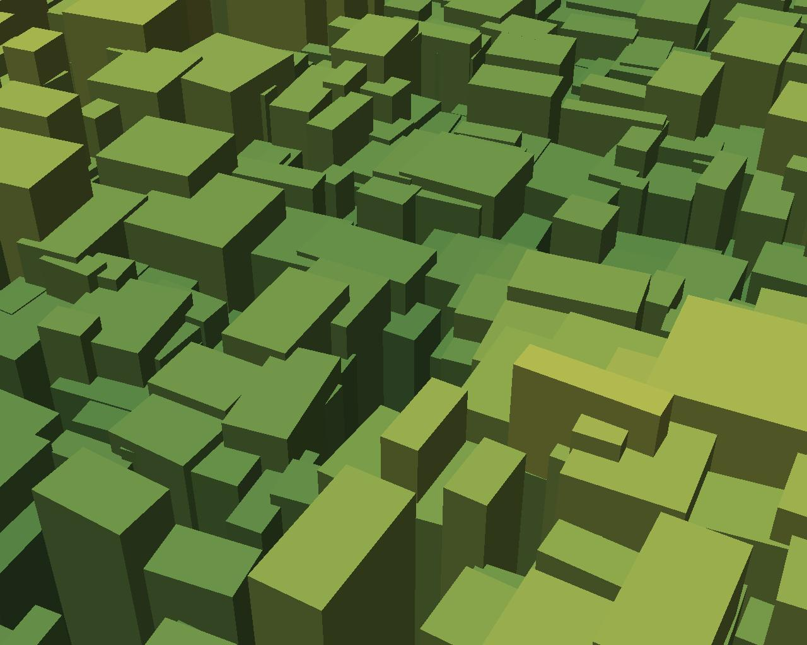                                                                                                                                                                                                                     | [SHA256](./goban-ss/SHA256SUMS) | N/A |
| [gobby](./gobby) | amd64  | ubuntu-noble | 0.6.0-2build2 |  | [SHA256](./gobby/SHA256SUMS) | N/A |
| [godot3](./godot3) | amd64  | ubuntu-noble | 3.5.2-stable-2build4 |  | [SHA256](./godot3/SHA256SUMS) | N/A |
| [goldencheetah](./goldencheetah) | amd64  | ubuntu-noble | 3.5-2ubuntu2 |  | [SHA256](./goldencheetah/SHA256SUMS) | N/A |
| [goldendict](./goldendict) | amd64  | ubuntu-noble | 1.5.0-1build4 |  | [SHA256](./goldendict/SHA256SUMS) | N/A |
| [goldendict-ng](./goldendict-ng) | amd64  | ubuntu-noble | 23.12.26-1build2 |  | [SHA256](./goldendict-ng/SHA256SUMS) | N/A |
| [goldendict-webengine](./goldendict-webengine) | amd64  | ubuntu-noble | 23.10.01-1build3 |  | [SHA256](./goldendict-webengine/SHA256SUMS) | N/A |
| [golly](./golly) | amd64  | ubuntu-noble | 3.3-1.1build3 |  | [SHA256](./golly/SHA256SUMS) | N/A |
| [gom](./gom) | amd64  | ubuntu-noble | 0.30.4-1-20250327 | 失败 | [SHA256](./gom/SHA256SUMS) | N/A |
| [gomoku.app](./gomoku.app) | amd64  | ubuntu-noble | 1.2.9-5build1 |  | [SHA256](./gomoku.app/SHA256SUMS) | N/A |
| [goobox](./goobox) | amd64  | ubuntu-noble | 3.6.0-11build2 |  | [SHA256](./goobox/SHA256SUMS) | N/A |
| [goodvibes](./goodvibes) | amd64  | ubuntu-noble | 0.7.9-1build2 |  | [SHA256](./goodvibes/SHA256SUMS) | N/A |
| [gopchop](./gopchop) | amd64  | ubuntu-noble | 1.1.8-7build4 |  | [SHA256](./gopchop/SHA256SUMS) | N/A |
| [gorm.app](./gorm.app) | amd64  | ubuntu-noble | 1.3.1-1build1 |  | [SHA256](./gorm.app/SHA256SUMS) | N/A |
| [gosa-desktop](./gosa-desktop) | amd64  | ubuntu-noble | 2.8~git20230203.10abe45+dfsg-11-20250327 | 失败 | N/A | N/A |
| [gourmand](./gourmand) | amd64  | ubuntu-noble | 1.1.0+really1.1.0~rc3-3-20250327 | 失败 | N/A | N/A |
| [goverlay](./goverlay) | amd64  | ubuntu-noble | 0.9.1-2 |  | [SHA256](./goverlay/SHA256SUMS) | N/A |
| [goxel](./goxel) | amd64  | ubuntu-noble | 0.11.0-1.1build3 |  | [SHA256](./goxel/SHA256SUMS) | N/A |
| [gpa](./gpa) | amd64  | ubuntu-noble | 0.10.0-6 |  | [SHA256](./gpa/SHA256SUMS) | N/A |
| [gpac](./gpac) | amd64  | ubuntu-noble | 2.2.1+dfsg1-3.1build2 |  | [SHA256](./gpac/SHA256SUMS) | N/A |
| [gparted](./gparted) | amd64  | deepin-v23 | 1.5.0-1deepin0-20250327 | 失败 | N/A | N/A |
| [gpaste-2](./gpaste-2) | amd64  | ubuntu-noble | 45-2ubuntu5 |  | [SHA256](./gpaste-2/SHA256SUMS) | N/A |
| [gperiodic](./gperiodic) | amd64  | ubuntu-noble | 3.0.3-1build2 |  | [SHA256](./gperiodic/SHA256SUMS) | N/A |
| [gpick](./gpick) | amd64  | ubuntu-noble | 0.2.6-1ubuntu2 |  | [SHA256](./gpick/SHA256SUMS) | N/A |
| [gpicview](./gpicview) | amd64  | deepin-v23 | 0.2.5-deepin1 |  | [SHA256](./gpicview/SHA256SUMS) | N/A |
| [gplanarity](./gplanarity) | amd64  | ubuntu-noble | 17906-7build3 |  | [SHA256](./gplanarity/SHA256SUMS) | N/A |
| [gpodder](./gpodder) | amd64  | ubuntu-noble | 3.11.3-2ubuntu1-20250327 | 失败 | N/A | N/A |
| [gpredict-doc](./gpredict-doc) | amd64  | ubuntu-noble | 2.3-115-g0f3beb6-3build3-20250327 | 失败 | [SHA256](./gpredict-doc/SHA256SUMS) | N/A |
| [gprename](./gprename) | amd64  | deepin-v23 | 20210415-1 |  | [SHA256](./gprename/SHA256SUMS) | N/A |
| [gprompter](./gprompter) | amd64  | deepin-v23 | 0.9.1-2.2-deepin1+rb1 |  | [SHA256](./gprompter/SHA256SUMS) | N/A |
| [gpsbabel-gui](./gpsbabel-gui) | amd64  | ubuntu-noble | 1.9.0+ds-2build3 |  | [SHA256](./gpsbabel-gui/SHA256SUMS) | N/A |
| [gpscorrelate-gui](./gpscorrelate-gui) | amd64  | ubuntu-noble | 2.0-4build2 |  | [SHA256](./gpscorrelate-gui/SHA256SUMS) | N/A |
| [gpsd-clients](./gpsd-clients) | amd64  | ubuntu-noble | 3.25-3ubuntu3.1-20250327 | 失败 | N/A | N/A |
| [gpsprune](./gpsprune) | amd64  | ubuntu-noble | 23.2-1 |  | [SHA256](./gpsprune/SHA256SUMS) | N/A |
| [gpxviewer](./gpxviewer) | amd64  | ubuntu-noble | 1.1.0-5-20250327 | 失败 | N/A | N/A |
| [gpy](./gpy) | amd64  | deepin-v23 | 1.0.2.20210607 |  | [SHA256](./gpy/SHA256SUMS) | N/A |
| [gqrx-sdr](./gqrx-sdr) | amd64  | ubuntu-noble | 2.17.4-2build3-20250327 | 失败 | N/A | N/A |
| [grace](./grace) | amd64  | ubuntu-noble | 5.1.25-14 |  | [SHA256](./grace/SHA256SUMS) | N/A |
| [gradebook](./gradebook) | amd64  | ubuntu-noble | 1.2-0ubuntu3 |  | [SHA256](./gradebook/SHA256SUMS) | N/A |
| [grads](./grads) | amd64  | ubuntu-noble | 2.2.1-6build2 |  | [SHA256](./grads/SHA256SUMS) | N/A |
| [grafx2](./grafx2) | amd64  | ubuntu-noble | 2.8+ds-3build3 |  | [SHA256](./grafx2/SHA256SUMS) | N/A |
| [graide](./graide) | amd64  | ubuntu-noble | 1.1.0+dfsg-4.1 |  | [SHA256](./graide/SHA256SUMS) | N/A |
| [gramps](./gramps) | amd64  | ubuntu-noble | 5.1.6+dfsg-1ubuntu1-20250327 | 失败 | N/A | N/A |
| [granatier](./granatier) | amd64  | ubuntu-noble | 23.08.5-0ubuntu3 |  | [SHA256](./granatier/SHA256SUMS) | N/A |
| [grandorgue](./grandorgue) | amd64  | ubuntu-noble | 3.13.1-1build2 |  | [SHA256](./grandorgue/SHA256SUMS) | N/A |
| [grandprinter-mfp](./grandprinter-mfp) | amd64  | deepin-v23 | 1.0.0-22041 |   | [SHA256](./grandprinter-mfp/SHA256SUMS) | N/A |
| [granite-7-demo](./granite-7-demo) | amd64  | ubuntu-noble | 7.4.0-1build3-20250327 | 失败 | [SHA256](./granite-7-demo/SHA256SUMS) | N/A |
| [granite-demo](./granite-demo) | amd64  | ubuntu-noble | 6.2.0-3build3-20250327 | 失败 | [SHA256](./granite-demo/SHA256SUMS) | N/A |
| [granule](./granule) | amd64  | ubuntu-noble | 1.4.0-7-10build3 |  | [SHA256](./granule/SHA256SUMS) | N/A |
| [grass-core](./grass-core) | amd64  | ubuntu-noble | 8.3.2-1ubuntu2-20250327 | 失败 | [SHA256](./grass-core/SHA256SUMS) | N/A |
| [gravitation](./gravitation) | amd64  | ubuntu-noble | 3+dfsg1-6 |  | [SHA256](./gravitation/SHA256SUMS) | N/A |
| [gravitywars](./gravitywars) | amd64  | ubuntu-noble | 1.102-35 |  | [SHA256](./gravitywars/SHA256SUMS) | N/A |
| [grdesktop](./grdesktop) | amd64  | ubuntu-noble | 0.23+d040330-7build3 |  | [SHA256](./grdesktop/SHA256SUMS) | N/A |
| [greed](./greed) | amd64  | ubuntu-noble | 4.2-1-20250327 | 失败 | [SHA256](./greed/SHA256SUMS) | N/A |
| [gretl-common](./gretl-common) | amd64  | ubuntu-noble | 2023c-2.1build3-20250327 | 失败 | [SHA256](./gretl-common/SHA256SUMS) | N/A |
| [gridlock.app](./gridlock.app) | amd64  | ubuntu-noble | 1.10-5build4-20250327 | 失败 | [SHA256](./gridlock.app/SHA256SUMS) | N/A |
| [grig](./grig) | amd64  | ubuntu-noble | 0.9.0-1build2 |  | [SHA256](./grig/SHA256SUMS) | N/A |
| [grimripper](./grimripper) | amd64  | ubuntu-noble | 3.0.2-3build2 |  | [SHA256](./grimripper/SHA256SUMS) | N/A |
| [gringotts](./gringotts) | amd64  | ubuntu-noble | 1.2.10-4build3 |  | [SHA256](./gringotts/SHA256SUMS) | N/A |
| [grisbi](./grisbi) | amd64  | ubuntu-noble | 3.0.3-1build3 |  | [SHA256](./grisbi/SHA256SUMS) | N/A |
| [gromit](./gromit) | amd64  | ubuntu-noble | 20041213-9build3-20250327 | 失败 | [SHA256](./gromit/SHA256SUMS) | N/A |
| [gromit-mpx](./gromit-mpx) | amd64  | ubuntu-noble | 1.5.1-1build2 |  | [SHA256](./gromit-mpx/SHA256SUMS) | N/A |
| [groovy](./groovy) | amd64  | ubuntu-noble | 2.4.21-10-20250327 | 失败 | [SHA256](./groovy/SHA256SUMS) | N/A |
| [grop](./grop) | amd64  | ubuntu-noble | 0.10-1.2build2 |  | [SHA256](./grop/SHA256SUMS) | N/A |
| [growl-for-linux](./growl-for-linux) | amd64  | ubuntu-noble | 0.8.5-9.1build3-20250327 | 失败 | [SHA256](./growl-for-linux/SHA256SUMS) | N/A |
| [grpn](./grpn) | amd64  | ubuntu-noble | 1.4.1-1.1build3 |  | [SHA256](./grpn/SHA256SUMS) | N/A |
| [grr.app](./grr.app) | amd64  | ubuntu-noble | 1.0-1build8-20250327 | 失败 | [SHA256](./grr.app/SHA256SUMS) | N/A |
| [grsync](./grsync) | amd64  | ubuntu-noble | 1.3.0-1build2 |  | [SHA256](./grsync/SHA256SUMS) | N/A |
| [grub-customizer](./grub-customizer) | amd64  | deepin-v23 | 5.2.3-1deepin0-20250327 | 失败 | N/A | N/A |
| [gscan2pdf](./gscan2pdf) | amd64  | ubuntu-noble | 2.13.2-1-20250327 | 失败 | N/A | N/A |
| [gsequencer](./gsequencer) | amd64  | ubuntu-noble | 6.5.2-1build3 |  | [SHA256](./gsequencer/SHA256SUMS) | N/A |
| [gshutdown](./gshutdown) | amd64  | ubuntu-noble | 0.2-0ubuntu14 |  | [SHA256](./gshutdown/SHA256SUMS) | N/A |
| [gsmartcontrol](./gsmartcontrol) | amd64  | ubuntu-noble | 1.1.4-1build2-20250327 | 失败 | [SHA256](./gsmartcontrol/SHA256SUMS) | N/A |
| [gtamsanalyzer.app](./gtamsanalyzer.app) | amd64  | ubuntu-noble | 0.42-8build1-20250327 | 失败 | [SHA256](./gtamsanalyzer.app/SHA256SUMS) | N/A |
| [gtans](./gtans) | amd64  | ubuntu-noble | 1.99.0-2.1build2 |  | [SHA256](./gtans/SHA256SUMS) | N/A |
| [gtetrinet](./gtetrinet) | amd64  | ubuntu-noble | 0.7.11+git20200916.46e7ade-2build4 |  | [SHA256](./gtetrinet/SHA256SUMS) | N/A |
| [gtg](./gtg) | amd64  | ubuntu-noble | 0.6-7-20250327 | 失败 | N/A | N/A |
| [gthumb](./gthumb) | amd64  | ubuntu-noble | 3.12.6-1 |  | [SHA256](./gthumb/SHA256SUMS) | N/A |
| [gtimelog](./gtimelog) | amd64  | ubuntu-noble | 0.12.0-1-20250327 | 失败 | N/A | N/A |
| [gtk-3-examples](./gtk-3-examples) | amd64  | ubuntu-noble | 3.24.41-4ubuntu1.2-20250327 | 失败 | [SHA256](./gtk-3-examples/SHA256SUMS) | N/A |
| [gtk-4-examples](./gtk-4-examples) | amd64  | ubuntu-noble | 4.14.2+ds-1ubuntu2 |     | [SHA256](./gtk-4-examples/SHA256SUMS) | N/A |
| [gtk-chtheme](./gtk-chtheme) | amd64  | ubuntu-noble | 0.3.1-6.1ubuntu1 |  | [SHA256](./gtk-chtheme/SHA256SUMS) | N/A |
| [gtk-vector-screenshot](./gtk-vector-screenshot) | amd64  | ubuntu-noble | 0.3.3-2build2 |  | [SHA256](./gtk-vector-screenshot/SHA256SUMS) | N/A |
| [gtkam](./gtkam) | amd64  | ubuntu-noble | 1.0-4build1 |  | [SHA256](./gtkam/SHA256SUMS) | N/A |
| [gtkatlantic](./gtkatlantic) | amd64  | ubuntu-noble | 0.6.3-2build2 |  | [SHA256](./gtkatlantic/SHA256SUMS) | N/A |
| [gtkballs](./gtkballs) | amd64  | ubuntu-noble | 3.1.5+git20210713.6e53b66-1build2 |  | [SHA256](./gtkballs/SHA256SUMS) | N/A |
| [gtkcrypto](./gtkcrypto) | amd64  | ubuntu-noble | 1.0.2-2build3 |  | [SHA256](./gtkcrypto/SHA256SUMS) | N/A |
| [gtkhash](./gtkhash) | amd64  | ubuntu-noble | 1.5-1build2 |  | [SHA256](./gtkhash/SHA256SUMS) | N/A |
| [gtkterm](./gtkterm) | amd64  | ubuntu-noble | 1.2.1-1ubuntu1 |  | [SHA256](./gtkterm/SHA256SUMS) | N/A |
| [gtkwave](./gtkwave) | amd64  | ubuntu-noble | 3.3.116-1build2 |  | [SHA256](./gtkwave/SHA256SUMS) | N/A |
| [gtranscribe](./gtranscribe) | amd64  | ubuntu-noble | 0.11-3-20250327 | 失败 | N/A | N/A |
| [gtranslator](./gtranslator) | amd64  | ubuntu-noble | 46.0-1build1 |  | [SHA256](./gtranslator/SHA256SUMS) | N/A |
| [guake](./guake) | amd64  | ubuntu-noble | 3.10-2-20250327 | 失败 | N/A | N/A |
| [guake-indicator](./guake-indicator) | amd64  | ubuntu-noble | 1.4.5-2build2-20250327 | 失败 | N/A | N/A |
| [gucharmap](./gucharmap) | amd64  | deepin-v23 | 15.1.5-1 |  | N/A | N/A |
| [gufw](./gufw) | amd64  | ubuntu-noble | 24.04.0-2-20250327 | 失败 | N/A | N/A |
| [guidedog](./guidedog) | amd64  | ubuntu-noble | 1.3.0-1build3 |  | [SHA256](./guidedog/SHA256SUMS) | N/A |
| [guitarix](./guitarix) | amd64  | ubuntu-noble | 0.46.0+dfsg-1 |  | [SHA256](./guitarix/SHA256SUMS) | N/A |
| [gummi](./gummi) | amd64  | ubuntu-noble | 0.8.3+really0.8.3-1build3-20250327 | 失败 | N/A | N/A |
| [gunroar](./gunroar) | amd64  | ubuntu-noble | 0.15.dfsg1-10 |  | [SHA256](./gunroar/SHA256SUMS) | N/A |
| [gupnp-tools](./gupnp-tools) | amd64  | ubuntu-noble | 0.12.1-1build2 |    | [SHA256](./gupnp-tools/SHA256SUMS) | N/A |
| [guvcview](./guvcview) | amd64  | ubuntu-noble | 2.0.8-2.1build3 |  | [SHA256](./guvcview/SHA256SUMS) | N/A |
| [guymager](./guymager) | amd64  | ubuntu-noble | 0.8.13-2build2-20250327 | 失败 | [SHA256](./guymager/SHA256SUMS) | N/A |
| [gv](./gv) | amd64  | ubuntu-noble | 3.7.4-2build2-20250327 | 失败 | [SHA256](./gv/SHA256SUMS) | N/A |
| [gvb](./gvb) | amd64  | ubuntu-noble | 1.4-1.1-20250327 | 失败 | N/A | N/A |
| [gvidm](./gvidm) | amd64  | ubuntu-noble | 0.8-15build3-20250327 | 失败 | [SHA256](./gvidm/SHA256SUMS) | N/A |
| [gwaei](./gwaei) | amd64  | ubuntu-noble | 3.6.2-9.2build1-20250327 | 失败 | [SHA256](./gwaei/SHA256SUMS) | N/A |
| [gwakeonlan](./gwakeonlan) | amd64  | ubuntu-noble | 0.8.5-3-20250327 | 失败 | N/A | N/A |
| [gwaterfall](./gwaterfall) | amd64  | ubuntu-noble | 0.1-5.1build3 |  | [SHA256](./gwaterfall/SHA256SUMS) | N/A |
| [gweled](./gweled) | amd64  | ubuntu-noble | 1.0~beta1-1 |  | [SHA256](./gweled/SHA256SUMS) | N/A |
| [gwenview](./gwenview) | amd64  | ubuntu-noble | 23.08.5-0ubuntu5 |  | [SHA256](./gwenview/SHA256SUMS) | N/A |
| [gworkspace.app](./gworkspace.app) | amd64  | ubuntu-noble | 1.0.0-1build2-20250327 | 失败 | [SHA256](./gworkspace.app/SHA256SUMS) | N/A |
| [gworldclock](./gworldclock) | amd64  | ubuntu-noble | 1.4.4-11build2 |  | [SHA256](./gworldclock/SHA256SUMS) | N/A |
| [gwyddion](./gwyddion) | amd64  | ubuntu-noble | 2.64-1.1build3 |  | [SHA256](./gwyddion/SHA256SUMS) | N/A |
| [gxkb](./gxkb) | amd64  | ubuntu-noble | 0.9.3-1build2-20250327 | 失败 | [SHA256](./gxkb/SHA256SUMS) | N/A |
| [gxtuner](./gxtuner) | amd64  | ubuntu-noble | 3.0-3build2-20250327 | 失败 | [SHA256](./gxtuner/SHA256SUMS) | N/A |
| [gyrus](./gyrus) | amd64  | ubuntu-noble | 0.4.2-1.1build2 |  | [SHA256](./gyrus/SHA256SUMS) | N/A |
| [hamexam](./hamexam) | amd64  | ubuntu-noble | 1.10.1-1-20250327 | 失败 | [SHA256](./hamexam/SHA256SUMS) | N/A |
| [hamster-time-tracker](./hamster-time-tracker) | amd64  | ubuntu-noble | 3.0.3-1ubuntu1-20250327 | 失败 | N/A | N/A |
| [handbrake](./handbrake) | amd64  | ubuntu-noble | 1.7.2+ds1-1build2 |  | [SHA256](./handbrake/SHA256SUMS) | N/A |
| [hannah](./hannah) | amd64  | ubuntu-noble | 2.0.1+ds1-0.3-20250327 | 失败 | [SHA256](./hannah/SHA256SUMS) | N/A |
| [hannah-foo2zjs](./hannah-foo2zjs) | amd64  | ubuntu-noble | 6build2 |  | [SHA256](./hannah-foo2zjs/SHA256SUMS) | N/A |
| [hardinfo](./hardinfo) | amd64  | ubuntu-noble | 0.5.1+git20180227-2.1build3 |  | [SHA256](./hardinfo/SHA256SUMS) | N/A |
| [haruna](./haruna) | amd64  | ubuntu-noble | 0.12.3-1build4 |  | [SHA256](./haruna/SHA256SUMS) | N/A |
| [hasciicam](./hasciicam) | amd64  | ubuntu-noble | 1.1.2-1ubuntu3-20250327 | 失败 | [SHA256](./hasciicam/SHA256SUMS) | N/A |
| [hashcheck](./hashcheck) | amd64  | ubuntu-noble | 1.0.0-2build2 |  | [SHA256](./hashcheck/SHA256SUMS) | N/A |
| [hatari](./hatari) | amd64  | ubuntu-noble | 2.4.1+dfsg-2build2-20250327 | 失败 | N/A | N/A |
| [hdate-applet](./hdate-applet) | amd64  | ubuntu-noble | 0.15.11-4build2 |  | [SHA256](./hdate-applet/SHA256SUMS) | N/A |
| [hdf-compass](./hdf-compass) | amd64  | ubuntu-noble | 0.7~b8-3 |  | [SHA256](./hdf-compass/SHA256SUMS) | N/A |
| [hdhomerun-config-gui](./hdhomerun-config-gui) | amd64  | ubuntu-noble | 20161117-0ubuntu8 |  | [SHA256](./hdhomerun-config-gui/SHA256SUMS) | N/A |
| [heaptrack-gui](./heaptrack-gui) | amd64  | ubuntu-noble | 1.5.0+dfsg1-2ubuntu3 |  | [SHA256](./heaptrack-gui/SHA256SUMS) | N/A |
| [hedgewars](./hedgewars) | amd64  | ubuntu-noble | 1.0.2-9build5 |  | [SHA256](./hedgewars/SHA256SUMS) | N/A |
| [helpman](./helpman) | amd64  | ubuntu-noble | 2.4-1-20250327 | 失败 | N/A | N/A |
| [helpviewer.app](./helpviewer.app) | amd64  | ubuntu-noble | 0.4-1build1-20250327 | 失败 | [SHA256](./helpviewer.app/SHA256SUMS) | N/A |
| [helvum](./helvum) | amd64  | ubuntu-noble | 0.5.1+20240328-1 |  | [SHA256](./helvum/SHA256SUMS) | N/A |
| [herculesstudio](./herculesstudio) | amd64  | ubuntu-noble | 1.5.0-6build2 |  | [SHA256](./herculesstudio/SHA256SUMS) | N/A |
| [heroes](./heroes) | amd64  | ubuntu-noble | 0.21-18 |  | [SHA256](./heroes/SHA256SUMS) | N/A |
| [hex-a-hop](./hex-a-hop) | amd64  | ubuntu-noble | 1.1.0+git20140926-2-20250327 | 失败 | [SHA256](./hex-a-hop/SHA256SUMS) | N/A |
| [hexalate](./hexalate) | amd64  | ubuntu-noble | 1.2.2-1build2 |  | [SHA256](./hexalate/SHA256SUMS) | N/A |
| [hexchat](./hexchat) | amd64  | ubuntu-noble | 2.16.2-1build2 |  | [SHA256](./hexchat/SHA256SUMS) | N/A |
| [hexter](./hexter) | amd64  | ubuntu-noble | 1.1.1-2build2-20250327 | 失败 | [SHA256](./hexter/SHA256SUMS) | N/A |
| [hijra-applet](./hijra-applet) | amd64  | ubuntu-noble | 1.0-4-20250327 | 失败 | N/A | N/A |
| [hime](./hime) | amd64  | ubuntu-noble | 0.9.11+dfsg-4build6 |  | [SHA256](./hime/SHA256SUMS) | N/A |
| [hitori](./hitori) | amd64  | ubuntu-noble | 44.0-2build2 |  | [SHA256](./hitori/SHA256SUMS) | N/A |
| [hivelytracker](./hivelytracker) | amd64  | ubuntu-noble | 1.9+git20221114+ds-2build2-20250327 | 失败 | [SHA256](./hivelytracker/SHA256SUMS) | N/A |
| [holotz-castle](./holotz-castle) | amd64  | ubuntu-noble | 1.3.14-12 |  | [SHA256](./holotz-castle/SHA256SUMS) | N/A |
| [homebank](./homebank) | amd64  | ubuntu-noble | 5.7.4-1build4 |  | [SHA256](./homebank/SHA256SUMS) | N/A |
| [horae](./horae) | amd64  | ubuntu-noble | 071~svn537+ds1-1-20250327 | 失败 | [SHA256](./horae/SHA256SUMS) | N/A |
| [horgand](./horgand) | amd64  | ubuntu-noble | 1.14-8build2-20250327 | 失败 | [SHA256](./horgand/SHA256SUMS) | N/A |
| [horizon-eda](./horizon-eda) | amd64  | ubuntu-noble | 2.5.0-1build4 |  | [SHA256](./horizon-eda/SHA256SUMS) | N/A |
| [hoteldruid](./hoteldruid) | amd64  | ubuntu-noble | 3.0.6-1-20250327 | 失败 | [SHA256](./hoteldruid/SHA256SUMS) | N/A |
| [hotspot](./hotspot) | amd64  | ubuntu-noble | 1.3.0-2ubuntu4 |  | [SHA256](./hotspot/SHA256SUMS) | N/A |
| [hplip-gui](./hplip-gui) | amd64  | ubuntu-noble | 3.23.12+dfsg0-0ubuntu5-20250327 | 失败 | N/A | v1.5.0-amd64-nevm |
| [hsqldb-utils](./hsqldb-utils) | amd64  | ubuntu-noble | 2.7.2-1-20250327 | 失败 | [SHA256](./hsqldb-utils/SHA256SUMS) | v1.5.0-amd64-nevm |
| [htmldoc](./htmldoc) | amd64  | ubuntu-noble | 1.9.17-1build3 |  | [SHA256](./htmldoc/SHA256SUMS) | v1.5.0-amd64-nevm |
| [htop](./htop) | amd64  | ubuntu-noble | 3.3.0-4build1-20250327 | 失败 | [SHA256](./htop/SHA256SUMS) | v1.5.0-amd64-nevm |
| [httraqt](./httraqt) | amd64  | ubuntu-noble | 1.4.11-1build2 |  | [SHA256](./httraqt/SHA256SUMS) | v1.5.0-amd64-nevm |
| [huawei-pixlab-series](./huawei-pixlab-series) | amd64  | deepin-v23 | 1.0-71 |  | N/A | N/A |
| [hud-tools](./hud-tools) | amd64  | ubuntu-noble | 14.10+17.10.20170619-0ubuntu6 |  | [SHA256](./hud-tools/SHA256SUMS) | v1.5.0-amd64-nevm |
| [hugin](./hugin) | amd64  | ubuntu-noble | 2023.0.0+dfsg-1build4 |    | [SHA256](./hugin/SHA256SUMS) | v1.5.0-amd64-nevm |
| [hv3](./hv3) | amd64  | ubuntu-noble | 3.0~fossil20110109-8-20250327 | 失败 | [SHA256](./hv3/SHA256SUMS) | v1.5.0-amd64-nevm |
| [hwloc](./hwloc) | amd64  | deepin-v23 | 2.11.0-2 | 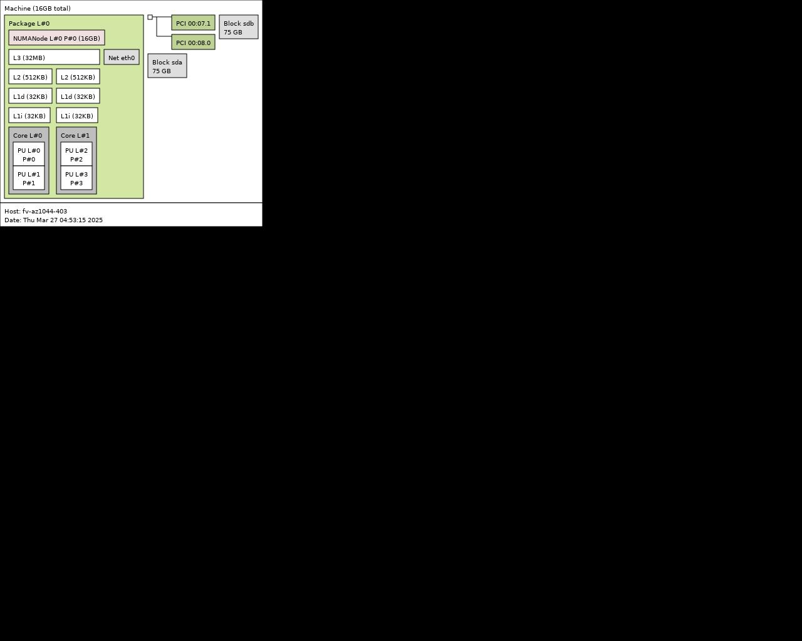 | N/A | N/A |
| [hydra-gtk](./hydra-gtk) | amd64  | ubuntu-noble | 9.5-1build3 |  | [SHA256](./hydra-gtk/SHA256SUMS) | v1.5.0-amd64-nevm |
| [hydrapaper](./hydrapaper) | amd64  | ubuntu-noble | 3.3.1-2-20250327 | 失败 | N/A | v1.5.0-amd64-nevm |
| [hydrogen](./hydrogen) | amd64  | ubuntu-noble | 1.2.0~beta1+dfsg-1build4 |  | [SHA256](./hydrogen/SHA256SUMS) | v1.5.0-amd64-nevm |
| [hyperrogue](./hyperrogue) | amd64  | ubuntu-noble | 12.1q-1 |  | [SHA256](./hyperrogue/SHA256SUMS) | v1.5.0-amd64-nevm |
| [i3-wm](./i3-wm) | amd64  | ubuntu-noble | 4.23-1build2-20250327 | 失败 | [SHA256](./i3-wm/SHA256SUMS) | v1.5.0-amd64-nevm |
| [iagno](./iagno) | amd64  | ubuntu-noble | 3.38.1-2build2 |  | [SHA256](./iagno/SHA256SUMS) | v1.5.0-amd64-nevm |
| [iannix](./iannix) | amd64  | ubuntu-noble | 0.9.20~dfsg1-1build3 |  | [SHA256](./iannix/SHA256SUMS) | v1.5.0-amd64-nevm |
| [ibus](./ibus) | amd64  | ubuntu-noble | 1.5.29-2-20250327 | 失败 | N/A | v1.5.0-amd64-nevm |
| [ibus-avro](./ibus-avro) | amd64  | ubuntu-noble | 1.2-6-20250327 | 失败 | N/A | v1.5.0-amd64-nevm |
| [ibus-braille](./ibus-braille) | amd64  | ubuntu-noble | 0.3-8-20250327 | 失败 | N/A | v1.5.0-amd64-nevm |
| [ibus-cangjie](./ibus-cangjie) | amd64  | deepin-v23 | 2.4-7 |   | N/A | N/A |
| [ibus-chewing](./ibus-chewing) | amd64  | ubuntu-noble | 2.0.0-1build2-20250327 | 失败 | N/A | v1.5.0-amd64-nevm |
| [ibus-hangul](./ibus-hangul) | amd64  | ubuntu-noble | 1.5.5-2build2-20250327 | 失败 | N/A | v1.5.0-amd64-nevm |
| [ibus-input-pad](./ibus-input-pad) | amd64  | ubuntu-noble | 1.4.99.20140916-3build2-20250327 | 失败 | N/A | v1.5.0-amd64-nevm |
| [ibus-kkc](./ibus-kkc) | amd64  | ubuntu-noble | 1.5.22-4build2-20250327 | 失败 | N/A | v1.5.0-amd64-nevm |
| [ibus-libpinyin](./ibus-libpinyin) | amd64  | ubuntu-noble | 1.15.7-1build2-20250327 | 失败 | N/A | v1.5.0-amd64-nevm |
| [ibus-libzhuyin](./ibus-libzhuyin) | amd64  | ubuntu-noble | 1.10.3-1build2-20250327 | 失败 | N/A | v1.5.0-amd64-nevm |
| [ibus-m17n](./ibus-m17n) | amd64  | ubuntu-noble | 1.4.28-1build2-20250327 | 失败 | N/A | v1.5.0-amd64-nevm |
| [ibus-pinyin](./ibus-pinyin) | amd64  | ubuntu-noble | 1.5.0-11build2-20250327 | 失败 | N/A | v1.5.0-amd64-nevm |
| [ibus-skk](./ibus-skk) | amd64  | ubuntu-noble | 1.4.3-3build2-20250327 | 失败 | N/A | v1.5.0-amd64-nevm |
| [ibus-table](./ibus-table) | amd64  | ubuntu-noble | 1.17.4-2-20250327 | 失败 | N/A | v1.5.0-amd64-nevm |
| [ibus-typing-booster](./ibus-typing-booster) | amd64  | ubuntu-noble | 2.25.4-1-20250327 | 失败 | N/A | v1.5.0-amd64-nevm |
| [ibus-unikey](./ibus-unikey) | amd64  | deepin-v23 | 0.7.0~beta1-1deepin0-20250327 | 失败 | [SHA256](./ibus-unikey/SHA256SUMS) | v1.5.0-amd64-nevm |
| [icebreaker](./icebreaker) | amd64  | ubuntu-noble | 2.2.0-1-20250327 | 失败 | [SHA256](./icebreaker/SHA256SUMS) | v1.5.0-amd64-nevm |
| [icecc-monitor](./icecc-monitor) | amd64  | ubuntu-noble | 3.3-2build2 |  | [SHA256](./icecc-monitor/SHA256SUMS) | v1.5.0-amd64-nevm |
| [icedtea-netx](./icedtea-netx) | amd64  | ubuntu-noble | 1.8.8-2ubuntu1 |  | [SHA256](./icedtea-netx/SHA256SUMS) | v1.5.0-amd64-nevm |
| [id-fingerprint-scanner](./id-fingerprint-scanner) | amd64  | deepin-v23 | 1.7 | 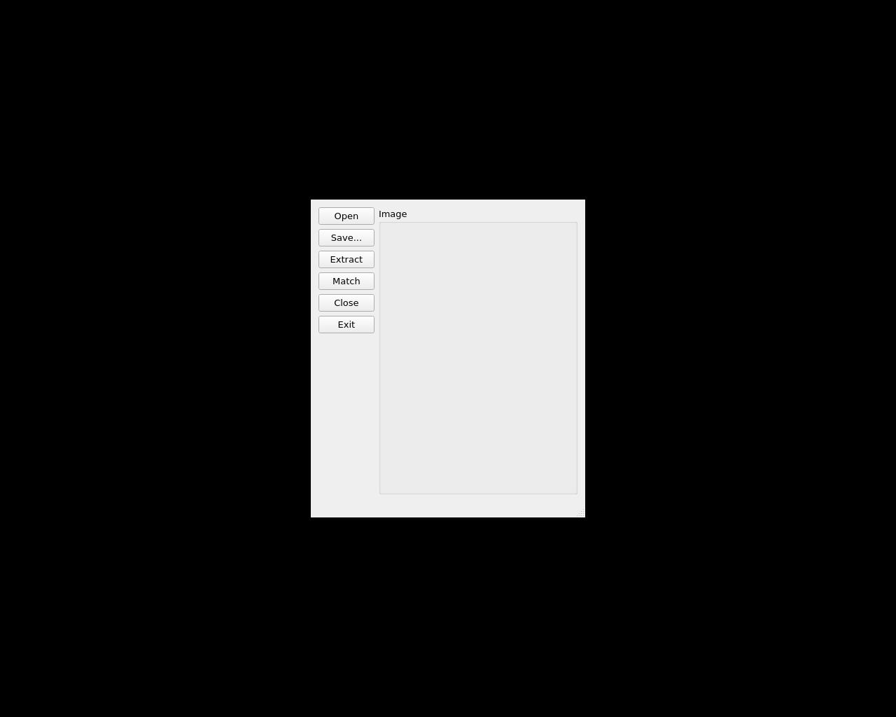 | [SHA256](./id-fingerprint-scanner/SHA256SUMS) | v1.5.0-amd64-nevm |
| [idle](./idle) | amd64  | ubuntu-noble | 3.12.3-0ubuntu2-20250327 | 失败 | [SHA256](./idle/SHA256SUMS) | v1.5.0-amd64-nevm |
| [idle-python2.7](./idle-python2.7) | amd64  | deepin-v23 | 2.7.18.1-1+deepin-20250327 | 失败 | N/A | v1.5.0-amd64-nevm |
| [idle-python3.11](./idle-python3.11) | amd64  | deepin-v23 | 3.11.8-1-20250327 | 失败 | [SHA256](./idle-python3.11/SHA256SUMS) | v1.5.0-amd64-nevm |
| [idle-python3.12](./idle-python3.12) | amd64  | deepin-v23 | 3.12.4-0deepin1-20250327 | 失败 | [SHA256](./idle-python3.12/SHA256SUMS) | v1.5.0-amd64-nevm |
| [iem-plugin-suite-standalone](./iem-plugin-suite-standalone) | amd64  | ubuntu-noble | 1.14.1-1build2 |                      | [SHA256](./iem-plugin-suite-standalone/SHA256SUMS) | v1.5.0-amd64-nevm |
| [igv](./igv) | amd64  | ubuntu-noble | 2.17.3+dfsg-1 |  | [SHA256](./igv/SHA256SUMS) | v1.5.0-amd64-nevm |
| [ii-esu](./ii-esu) | amd64  | ubuntu-noble | 1.0a.dfsg2-2 |  | [SHA256](./ii-esu/SHA256SUMS) | v1.5.0-amd64-nevm |
| [ikarus](./ikarus) | amd64  | ubuntu-noble | 0.0.3+bzr.2010.01.26+bap.1-1-20250327 | 失败 | [SHA256](./ikarus/SHA256SUMS) | v1.5.0-amd64-nevm |
| [im-config](./im-config) | amd64  | deepin-v23 | 0.57-2deepin2-20250327 | 失败 | [SHA256](./im-config/SHA256SUMS) | v1.5.0-amd64-nevm |
| [imagej](./imagej) | amd64  | ubuntu-noble | 1.54g-1-20250327 | 失败 | [SHA256](./imagej/SHA256SUMS) | v1.5.0-amd64-nevm |
| [imagemagick-6.q16](./imagemagick-6.q16) | amd64  | deepin-v23 | 6.9.13.12+dfsg1-1deepin1-20250327 | 失败 | [SHA256](./imagemagick-6.q16/SHA256SUMS) | v1.5.0-amd64-nevm |
| [imagemagick-6.q16hdri](./imagemagick-6.q16hdri) | amd64  | deepin-v23 | 6.9.13.12+dfsg1-1deepin1-20250327 | 失败 | [SHA256](./imagemagick-6.q16hdri/SHA256SUMS) | v1.5.0-amd64-nevm |
| [imagination](./imagination) | amd64  | ubuntu-noble | 3.6-2build3 |  | [SHA256](./imagination/SHA256SUMS) | v1.5.0-amd64-nevm |
| [imv](./imv) | amd64  | ubuntu-noble | 4.4.0-1build3-20250327 | 失败 | [SHA256](./imv/SHA256SUMS) | v1.5.0-amd64-nevm |
| [imview](./imview) | amd64  | ubuntu-noble | 1.1.9h-4build3 |  | [SHA256](./imview/SHA256SUMS) | v1.5.0-amd64-nevm |
| [indicator-china-weather](./indicator-china-weather) | amd64  | ubuntu-noble | 3.0.4.1-0ubuntu3-20250327 | 失败 | [SHA256](./indicator-china-weather/SHA256SUMS) | v1.5.0-amd64-nevm |
| [indicator-multiload](./indicator-multiload) | amd64  | ubuntu-noble | 0.4-0ubuntu7-20250327 | 失败 | [SHA256](./indicator-multiload/SHA256SUMS) | v1.5.0-amd64-nevm |
| [indicator-sensors](./indicator-sensors) | amd64  | ubuntu-noble | 1.4-1build2-20250327 | 失败 | N/A | v1.5.0-amd64-nevm |
| [info](./info) | amd64  | ubuntu-noble | 7.1-3build2-20250327 | 失败 | [SHA256](./info/SHA256SUMS) | v1.5.0-amd64-nevm |
| [inkscape](./inkscape) | amd64  | deepin-v23 | 1.2.2-4 |  | [SHA256](./inkscape/SHA256SUMS) | v1.5.0-amd64-nevm |
| [input-pad](./input-pad) | amd64  | ubuntu-noble | 1.0.99.20210817-2build2 |  | [SHA256](./input-pad/SHA256SUMS) | v1.5.0-amd64-nevm |
| [input-remapper-gtk](./input-remapper-gtk) | amd64  | ubuntu-noble | 2.0.1-1-20250327 | 失败 | N/A | v1.5.0-amd64-nevm |
| [instead](./instead) | amd64  | ubuntu-noble | 3.3.2-1.1build4 |  | [SHA256](./instead/SHA256SUMS) | v1.5.0-amd64-nevm |
| [iotas](./iotas) | amd64  | ubuntu-noble | 0.2.8+ds-1-20250327 | 失败 | N/A | v1.5.0-amd64-nevm |
| [ipqalc](./ipqalc) | amd64  | ubuntu-noble | 1.5.3+git20200816.523b207-3build2 |  | [SHA256](./ipqalc/SHA256SUMS) | v1.5.0-amd64-nevm |
| [iptux](./iptux) | amd64  | ubuntu-noble | 0.8.4-1build2 |  | [SHA256](./iptux/SHA256SUMS) | v1.5.0-amd64-nevm |
| [iraf](./iraf) | amd64  | ubuntu-noble | 2.17.1-5build3-20250327 | 失败 | [SHA256](./iraf/SHA256SUMS) | v1.5.0-amd64-nevm |
| [ironseed](./ironseed) | amd64  | ubuntu-noble | 0.3.6-5 |  | [SHA256](./ironseed/SHA256SUMS) | v1.5.0-amd64-nevm |
| [isag](./isag) | amd64  | deepin-v23 | 12.7.5-2-20250327 | 失败 | [SHA256](./isag/SHA256SUMS) | v1.5.0-amd64-nevm |
| [isenkram](./isenkram) | amd64  | ubuntu-noble | 0.57-20250327 | 失败 | N/A | v1.5.0-amd64-nevm |
| [itinerary](./itinerary) | amd64  | ubuntu-noble | 23.08.5-0ubuntu3-20250327 | 失败 | [SHA256](./itinerary/SHA256SUMS) | v1.5.0-amd64-nevm |
| [jaaa](./jaaa) | amd64  | ubuntu-noble | 0.9.2-1build2-20250327 | 失败 | [SHA256](./jaaa/SHA256SUMS) | v1.5.0-amd64-nevm |
| [jabref](./jabref) | amd64  | ubuntu-noble | 3.8.2+ds-17-20250327 | 失败 | [SHA256](./jabref/SHA256SUMS) | v1.5.0-amd64-nevm |
| [jack-keyboard](./jack-keyboard) | amd64  | ubuntu-noble | 2.7.2-1build2 |  | [SHA256](./jack-keyboard/SHA256SUMS) | v1.5.0-amd64-nevm |
| [jack-mixer](./jack-mixer) | amd64  | ubuntu-noble | 18-1build3-20250327 | 失败 | [SHA256](./jack-mixer/SHA256SUMS) | v1.5.0-amd64-nevm |
| [jacktrip-gui](./jacktrip-gui) | amd64  | ubuntu-noble | 2.2.2+ds-1build2 |  | [SHA256](./jacktrip-gui/SHA256SUMS) | v1.5.0-amd64-nevm |
| [jag](./jag) | amd64  | ubuntu-noble | 0.3.8-2build2-20250327 | 失败 | [SHA256](./jag/SHA256SUMS) | v1.5.0-amd64-nevm |
| [jalv](./jalv) | amd64  | ubuntu-noble | 1.6.8-1build3-20250327 | 失败 | N/A | v1.5.0-amd64-nevm |
| [jalview](./jalview) | amd64  | ubuntu-noble | 2.11.3.1+dfsg-1 |  | [SHA256](./jalview/SHA256SUMS) | v1.5.0-amd64-nevm |
| [jameica](./jameica) | amd64  | ubuntu-noble | 2.10.4+dfsg-1 | 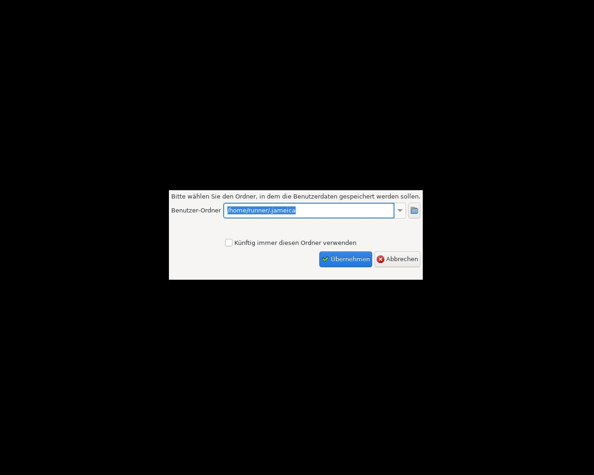 | [SHA256](./jameica/SHA256SUMS) | v1.5.0-amd64-nevm |
| [jami](./jami) | amd64  | ubuntu-noble | 20231201.0~ds2-1-20250327 | 失败 | [SHA256](./jami/SHA256SUMS) | v1.5.0-amd64-nevm |
| [jamin](./jamin) | amd64  | ubuntu-noble | 0.98.9~git20170111~199091~repack1-2build2-20250327 | 失败 | [SHA256](./jamin/SHA256SUMS) | v1.5.0-amd64-nevm |
| [jamulus](./jamulus) | amd64  | ubuntu-noble | 3.9.1+dfsg-1build2 |  | [SHA256](./jamulus/SHA256SUMS) | v1.5.0-amd64-nevm |
| [japa](./japa) | amd64  | ubuntu-noble | 0.9.4-1build2-20250327 | 失败 | [SHA256](./japa/SHA256SUMS) | v1.5.0-amd64-nevm |
| [jargoninformatique](./jargoninformatique) | amd64  | ubuntu-noble | 1.3.6-0ubuntu11 |  | [SHA256](./jargoninformatique/SHA256SUMS) | v1.5.0-amd64-nevm |
| [javamorph](./javamorph) | amd64  | ubuntu-noble | 0.0.20100201-4-20250327 | 失败 | [SHA256](./javamorph/SHA256SUMS) | v1.5.0-amd64-nevm |
| [jaxe](./jaxe) | amd64  | ubuntu-noble | 3.5-14 |  | [SHA256](./jaxe/SHA256SUMS) | v1.5.0-amd64-nevm |
| [jclic](./jclic) | amd64  | ubuntu-noble | 0.3.2.10-1.1-20250327 | 失败 | N/A | v1.5.0-amd64-nevm |
| [jdim](./jdim) | amd64  | ubuntu-noble | 0.10.1-1build2 |  | [SHA256](./jdim/SHA256SUMS) | v1.5.0-amd64-nevm |
| [jed](./jed) | amd64  | ubuntu-noble | 0.99.20~pre.180+dfsg-2-20250327 | 失败 | [SHA256](./jed/SHA256SUMS) | v1.5.0-amd64-nevm |
| [jedit](./jedit) | amd64  | ubuntu-noble | 5.5.0+dfsg-2-20250327 | 失败 | [SHA256](./jedit/SHA256SUMS) | v1.5.0-amd64-nevm |
| [jeex](./jeex) | amd64  | ubuntu-noble | 12.0.4-1.1build3 |  | [SHA256](./jeex/SHA256SUMS) | v1.5.0-amd64-nevm |
| [jemboss](./jemboss) | amd64  | ubuntu-noble | 6.6.0+dfsg-12ubuntu2-20250327 | 失败 | [SHA256](./jemboss/SHA256SUMS) | v1.5.0-amd64-nevm |
| [jester](./jester) | amd64  | ubuntu-noble | 1.0-15-20250327 | 失败 | [SHA256](./jester/SHA256SUMS) | v1.5.0-amd64-nevm |
| [jfractionlab](./jfractionlab) | amd64  | ubuntu-noble | 0.92-3 |  | [SHA256](./jfractionlab/SHA256SUMS) | v1.5.0-amd64-nevm |
| [jftp](./jftp) | amd64  | ubuntu-noble | 1.60+dfsg-4-20250327 | 失败 | [SHA256](./jftp/SHA256SUMS) | v1.5.0-amd64-nevm |
| [jgmenu](./jgmenu) | amd64  | ubuntu-noble | 4.4.1-2build1-20250327 | 失败 | N/A | v1.5.0-amd64-nevm |
| [jigzo](./jigzo) | amd64  | ubuntu-noble | 0.6.1-7.1build2 |  | [SHA256](./jigzo/SHA256SUMS) | v1.5.0-amd64-nevm |
| [jkmeter](./jkmeter) | amd64  | ubuntu-noble | 0.9.0-1build2-20250327 | 失败 | [SHA256](./jkmeter/SHA256SUMS) | v1.5.0-amd64-nevm |
| [jmeter](./jmeter) | amd64  | ubuntu-noble | 2.13-5-20250327 | 失败 | [SHA256](./jmeter/SHA256SUMS) | v1.5.0-amd64-nevm |
| [jmeters](./jmeters) | amd64  | ubuntu-noble | 0.4.5-1build2-20250327 | 失败 | [SHA256](./jmeters/SHA256SUMS) | v1.5.0-amd64-nevm |
| [jmol](./jmol) | amd64  | ubuntu-noble | 14.32.83+dfsg-3 |  | [SHA256](./jmol/SHA256SUMS) | v1.5.0-amd64-nevm |
| [jnoisemeter](./jnoisemeter) | amd64  | ubuntu-noble | 0.4.1-1build2-20250327 | 失败 | [SHA256](./jnoisemeter/SHA256SUMS) | v1.5.0-amd64-nevm |
| [joe](./joe) | amd64  | ubuntu-noble | 4.6-1.2-20250327 | 失败 | [SHA256](./joe/SHA256SUMS) | v1.5.0-amd64-nevm |
| [joe-jupp](./joe-jupp) | amd64  | ubuntu-noble | 3.1.41-1-20250327 | 失败 | [SHA256](./joe-jupp/SHA256SUMS) | v1.5.0-amd64-nevm |
| [josm](./josm) | amd64  | ubuntu-noble | 0.0.svn18969+dfsg-1 |  | [SHA256](./josm/SHA256SUMS) | v1.5.0-amd64-nevm |
| [josm-installer](./josm-installer) | amd64  | ubuntu-noble | 0.0.3+svn18889-20250327 | 失败 | [SHA256](./josm-installer/SHA256SUMS) | v1.5.0-amd64-nevm |
| [js8call](./js8call) | amd64  | ubuntu-noble | 2.2.0+ds-5build2 |  | [SHA256](./js8call/SHA256SUMS) | v1.5.0-amd64-nevm |
| [jstest-gtk](./jstest-gtk) | amd64  | ubuntu-noble | 0.1.1~git20180602-2build2 |  | [SHA256](./jstest-gtk/SHA256SUMS) | v1.5.0-amd64-nevm |
| [jtdx](./jtdx) | amd64  | ubuntu-noble | 2.2.159-2build2 |  | [SHA256](./jtdx/SHA256SUMS) | v1.5.0-amd64-nevm |
| [juce-tools](./juce-tools) | amd64  | ubuntu-noble | 7.0.5+ds-2 |  | [SHA256](./juce-tools/SHA256SUMS) | v1.5.0-amd64-nevm |
| [juffed](./juffed) | amd64  | ubuntu-noble | 0.10-89-g3690b60-8.1build3 |  | [SHA256](./juffed/SHA256SUMS) | v1.5.0-amd64-nevm |
| [jugglinglab](./jugglinglab) | amd64  | ubuntu-noble | 0.6.2+ds.1-2.1-20250327 | 失败 | [SHA256](./jugglinglab/SHA256SUMS) | v1.5.0-amd64-nevm |
| [juk](./juk) | amd64  | ubuntu-noble | 23.08.5-0ubuntu3 |  | [SHA256](./juk/SHA256SUMS) | v1.5.0-amd64-nevm |
| [jumpnbump](./jumpnbump) | amd64  | ubuntu-noble | 1.61-4-20250327 | 失败 | N/A | v1.5.0-amd64-nevm |
| [jupp](./jupp) | amd64  | ubuntu-noble | 3.1.41-1-20250327 | 失败 | [SHA256](./jupp/SHA256SUMS) | v1.5.0-amd64-nevm |
| [jupyter-notebook](./jupyter-notebook) | amd64  | ubuntu-noble | 6.4.12-2.2ubuntu1-20250327 | 失败 | [SHA256](./jupyter-notebook/SHA256SUMS) | v1.5.0-amd64-nevm |
| [jupyter-qtconsole](./jupyter-qtconsole) | amd64  | ubuntu-noble | 5.5.1-1 |  | [SHA256](./jupyter-qtconsole/SHA256SUMS) | v1.5.0-amd64-nevm |
| [jverein](./jverein) | amd64  | ubuntu-noble | 2.8.19+dfsg-1 |  | [SHA256](./jverein/SHA256SUMS) | v1.5.0-amd64-nevm |
| [jxplorer](./jxplorer) | amd64  | ubuntu-noble | 3.3.2+dfsg-7-20250327 | 失败 | [SHA256](./jxplorer/SHA256SUMS) | v1.5.0-amd64-nevm |
| [k3b](./k3b) | amd64  | ubuntu-noble | 23.08.5-0ubuntu5 |  | [SHA256](./k3b/SHA256SUMS) | v1.5.0-amd64-nevm |
| [k4dirstat](./k4dirstat) | amd64  | ubuntu-noble | 3.4.3-1build2 |  | [SHA256](./k4dirstat/SHA256SUMS) | v1.5.0-amd64-nevm |
| [kaccounts-integration](./kaccounts-integration) | amd64  | ubuntu-noble | 23.08.5-0ubuntu4-20250327 | 失败 | [SHA256](./kaccounts-integration/SHA256SUMS) | v1.5.0-amd64-nevm |
| [kaddressbook](./kaddressbook) | amd64  | ubuntu-noble | 23.08.5-0ubuntu3 |  | [SHA256](./kaddressbook/SHA256SUMS) | v1.5.0-amd64-nevm |
| [kaffeine](./kaffeine) | amd64  | ubuntu-noble | 2.0.18+git20230226.439cd0d-1build2 |  | [SHA256](./kaffeine/SHA256SUMS) | v1.5.0-amd64-nevm |
| [kaidan](./kaidan) | amd64  | ubuntu-noble | 0.9.1-3build2 |  | [SHA256](./kaidan/SHA256SUMS) | v1.5.0-amd64-nevm |
| [kajongg](./kajongg) | amd64  | ubuntu-noble | 23.08.5-0ubuntu1 |  | [SHA256](./kajongg/SHA256SUMS) | v1.5.0-amd64-nevm |
| [kalarm](./kalarm) | amd64  | ubuntu-noble | 23.08.5-0ubuntu3 |  | [SHA256](./kalarm/SHA256SUMS) | v1.5.0-amd64-nevm |
| [kalgebra](./kalgebra) | amd64  | ubuntu-noble | 23.08.5-0ubuntu4.2 |  | [SHA256](./kalgebra/SHA256SUMS) | v1.5.0-amd64-nevm |
| [kalgebramobile](./kalgebramobile) | amd64  | ubuntu-noble | 23.08.5-0ubuntu4.2 |  | [SHA256](./kalgebramobile/SHA256SUMS) | v1.5.0-amd64-nevm |
| [kalk](./kalk) | amd64  | ubuntu-noble | 23.08.5-0ubuntu3-20250327 | 失败 | [SHA256](./kalk/SHA256SUMS) | v1.5.0-amd64-nevm |
| [kalzium](./kalzium) | amd64  | ubuntu-noble | 23.08.5-0ubuntu4 |  | [SHA256](./kalzium/SHA256SUMS) | v1.5.0-amd64-nevm |
| [kamera](./kamera) | amd64  | ubuntu-noble | 23.08.5-0ubuntu4-20250327 | 失败 | [SHA256](./kamera/SHA256SUMS) | v1.5.0-amd64-nevm |
| [kamoso](./kamoso) | amd64  | ubuntu-noble | 23.08.5-0ubuntu4 |  | [SHA256](./kamoso/SHA256SUMS) | v1.5.0-amd64-nevm |
| [kanadic](./kanadic) | amd64  | ubuntu-noble | 6.5deb2-13ubuntu1-20250327 | 失败 | [SHA256](./kanadic/SHA256SUMS) | v1.5.0-amd64-nevm |
| [kanagram](./kanagram) | amd64  | ubuntu-noble | 23.08.5-0ubuntu4 |  | [SHA256](./kanagram/SHA256SUMS) | v1.5.0-amd64-nevm |
| [kanatest](./kanatest) | amd64  | ubuntu-noble | 0.4.10~git20200611.860e790-1build2 |  | [SHA256](./kanatest/SHA256SUMS) | v1.5.0-amd64-nevm |
| [kanyremote](./kanyremote) | amd64  | ubuntu-noble | 8.1.1-1 |  | [SHA256](./kanyremote/SHA256SUMS) | v1.5.0-amd64-nevm |
| [kapman](./kapman) | amd64  | ubuntu-noble | 23.08.5-0ubuntu3 |  | [SHA256](./kapman/SHA256SUMS) | v1.5.0-amd64-nevm |
| [kapptemplate](./kapptemplate) | amd64  | ubuntu-noble | 23.08.5-0ubuntu3 |  | [SHA256](./kapptemplate/SHA256SUMS) | v1.5.0-amd64-nevm |
| [karbon](./karbon) | amd64  | ubuntu-noble | 3.2.1+dfsg-8build4 |  | [SHA256](./karbon/SHA256SUMS) | v1.5.0-amd64-nevm |
| [kasts](./kasts) | amd64  | ubuntu-noble | 23.08.5-1ubuntu3 |  | [SHA256](./kasts/SHA256SUMS) | v1.5.0-amd64-nevm |
| [kasumi](./kasumi) | amd64  | ubuntu-noble | 2.5+debian1-1build2 |  | [SHA256](./kasumi/SHA256SUMS) | v1.5.0-amd64-nevm |
| [kate](./kate) | amd64  | ubuntu-noble | 23.08.5-0ubuntu3 |  | [SHA256](./kate/SHA256SUMS) | v1.5.0-amd64-nevm |
| [katomic](./katomic) | amd64  | ubuntu-noble | 23.08.5-0ubuntu3 |  | [SHA256](./katomic/SHA256SUMS) | v1.5.0-amd64-nevm |
| [kazam](./kazam) | amd64  | ubuntu-noble | 1.4.5-6-20250327 | 失败 | N/A | v1.5.0-amd64-nevm |
| [kbackup](./kbackup) | amd64  | ubuntu-noble | 23.08.5-0ubuntu4 |  | [SHA256](./kbackup/SHA256SUMS) | v1.5.0-amd64-nevm |
| [kball](./kball) | amd64  | ubuntu-noble | 0.0.20041216-11build2-20250327 | 失败 | [SHA256](./kball/SHA256SUMS) | v1.5.0-amd64-nevm |
| [kbibtex](./kbibtex) | amd64  | ubuntu-noble | 0.10.0-1build3 |  | [SHA256](./kbibtex/SHA256SUMS) | v1.5.0-amd64-nevm |
| [kblackbox](./kblackbox) | amd64  | ubuntu-noble | 23.08.5-0ubuntu3 |  | [SHA256](./kblackbox/SHA256SUMS) | v1.5.1-amd64-nevm |
| [kblocks](./kblocks) | amd64  | ubuntu-noble | 23.08.5-0ubuntu3 |  | [SHA256](./kblocks/SHA256SUMS) | v1.5.1-amd64-nevm |
| [kbounce](./kbounce) | amd64  | ubuntu-noble | 23.08.5-0ubuntu3 |  | [SHA256](./kbounce/SHA256SUMS) | v1.5.1-amd64-nevm |
| [kbreakout](./kbreakout) | amd64  | ubuntu-noble | 23.08.5-0ubuntu3 |  | [SHA256](./kbreakout/SHA256SUMS) | v1.5.1-amd64-nevm |
| [kbruch](./kbruch) | amd64  | ubuntu-noble | 23.08.5-0ubuntu4 |  | [SHA256](./kbruch/SHA256SUMS) | v1.5.1-amd64-nevm |
| [kcachegrind](./kcachegrind) | amd64  | ubuntu-noble | 23.08.5-0ubuntu3 |  | [SHA256](./kcachegrind/SHA256SUMS) | v1.5.1-amd64-nevm |
| [kcalc](./kcalc) | amd64  | ubuntu-noble | 23.08.5-0ubuntu4 |  | [SHA256](./kcalc/SHA256SUMS) | v1.5.1-amd64-nevm |
| [kcemu](./kcemu) | amd64  | ubuntu-noble | 0.5.2+dfsg-2 |  | [SHA256](./kcemu/SHA256SUMS) | v1.5.1-amd64-nevm |
| [kcharselect](./kcharselect) | amd64  | ubuntu-noble | 23.08.5-0ubuntu4 |  | [SHA256](./kcharselect/SHA256SUMS) | v1.5.1-amd64-nevm |
| [kcheckers](./kcheckers) | amd64  | ubuntu-noble | 0.8.1-6build2 |  | [SHA256](./kcheckers/SHA256SUMS) | v1.5.1-amd64-nevm |
| [kchmviewer](./kchmviewer) | amd64  | ubuntu-noble | 8.0-2build2 |  | [SHA256](./kchmviewer/SHA256SUMS) | v1.5.1-amd64-nevm |
| [kclock](./kclock) | amd64  | ubuntu-noble | 23.08.5-0ubuntu3-20250327 | 失败 | [SHA256](./kclock/SHA256SUMS) | v1.5.1-amd64-nevm |
| [kcollectd](./kcollectd) | amd64  | ubuntu-noble | 0.12.1-1build3 |  | [SHA256](./kcollectd/SHA256SUMS) | v1.5.1-amd64-nevm |
| [kcolorchooser](./kcolorchooser) | amd64  | ubuntu-noble | 23.08.5-0ubuntu4 |  | [SHA256](./kcolorchooser/SHA256SUMS) | v1.5.1-amd64-nevm |
| [kde-cli-tools](./kde-cli-tools) | amd64  | ubuntu-noble | 5.27.12-0ubuntu0.1-20250327 | 失败 | [SHA256](./kde-cli-tools/SHA256SUMS) | v1.5.1-amd64-nevm |
| [kde-config-cddb](./kde-config-cddb) | amd64  | ubuntu-noble | 23.08.5-0ubuntu3-20250327 | 失败 | [SHA256](./kde-config-cddb/SHA256SUMS) | v1.5.1-amd64-nevm |
| [kde-config-cron](./kde-config-cron) | amd64  | ubuntu-noble | 23.08.5-0ubuntu3-20250327 | 失败 | [SHA256](./kde-config-cron/SHA256SUMS) | v1.5.1-amd64-nevm |
| [kde-config-fcitx](./kde-config-fcitx) | amd64  | ubuntu-noble | 0.5.6+git20221120-1build3 |  | [SHA256](./kde-config-fcitx/SHA256SUMS) | v1.5.1-amd64-nevm |
| [kde-config-fcitx5](./kde-config-fcitx5) | amd64  | ubuntu-noble | 5.1.4-1 |  | [SHA256](./kde-config-fcitx5/SHA256SUMS) | v1.5.1-amd64-nevm |
| [kde-config-flatpak](./kde-config-flatpak) | amd64  | ubuntu-noble | 5.27.11-0ubuntu2-20250327 | 失败 | [SHA256](./kde-config-flatpak/SHA256SUMS) | v1.5.1-amd64-nevm |
| [kde-config-plymouth](./kde-config-plymouth) | amd64  | ubuntu-noble | 5.27.11-0ubuntu2-20250327 | 失败 | [SHA256](./kde-config-plymouth/SHA256SUMS) | v1.5.1-amd64-nevm |
| [kde-config-screenlocker](./kde-config-screenlocker) | amd64  | ubuntu-noble | 5.27.11-0ubuntu2-20250327 | 失败 | [SHA256](./kde-config-screenlocker/SHA256SUMS) | v1.5.1-amd64-nevm |
| [kde-config-sddm](./kde-config-sddm) | amd64  | ubuntu-noble | 5.27.11-0ubuntu2-20250327 | 失败 | [SHA256](./kde-config-sddm/SHA256SUMS) | v1.5.1-amd64-nevm |
| [kde-config-tablet](./kde-config-tablet) | amd64  | ubuntu-noble | 3.2.0-5build2 |  | [SHA256](./kde-config-tablet/SHA256SUMS) | v1.5.1-amd64-nevm |
| [kde-config-updates](./kde-config-updates) | amd64  | ubuntu-noble | 5.27.12-0ubuntu0.1-20250327 | 失败 | [SHA256](./kde-config-updates/SHA256SUMS) | v1.5.1-amd64-nevm |
| [kde-spectacle](./kde-spectacle) | amd64  | ubuntu-noble | 23.08.5-0ubuntu3 |  | [SHA256](./kde-spectacle/SHA256SUMS) | v1.5.1-amd64-nevm |
| [kde-style-breeze](./kde-style-breeze) | amd64  | ubuntu-noble | 5.27.12-0ubuntu0.1-20250327 | 失败 | [SHA256](./kde-style-breeze/SHA256SUMS) | v1.5.1-amd64-nevm |
| [kde-telepathy-contact-list](./kde-telepathy-contact-list) | amd64  | ubuntu-noble | 23.04.3-0ubuntu3 |  | [SHA256](./kde-telepathy-contact-list/SHA256SUMS) | v1.5.1-amd64-nevm |
| [kde-telepathy-text-ui](./kde-telepathy-text-ui) | amd64  | ubuntu-noble | 23.04.3-0ubuntu3 |  | [SHA256](./kde-telepathy-text-ui/SHA256SUMS) | v1.5.1-amd64-nevm |
| [kdebugsettings](./kdebugsettings) | amd64  | ubuntu-noble | 23.08.5-0ubuntu3 |  | [SHA256](./kdebugsettings/SHA256SUMS) | v1.5.1-amd64-nevm |
| [kdeconnect](./kdeconnect) | amd64  | ubuntu-noble | 23.08.5-0ubuntu5 |    | [SHA256](./kdeconnect/SHA256SUMS) | v1.5.1-amd64-nevm |
| [kded5](./kded5) | amd64  | ubuntu-noble | 5.115.0-0ubuntu5-20250327 | 失败 | [SHA256](./kded5/SHA256SUMS) | v1.5.1-amd64-nevm |
| [kdenlive](./kdenlive) | amd64  | ubuntu-noble | 23.08.5-0ubuntu4 |  | [SHA256](./kdenlive/SHA256SUMS) | v1.5.1-amd64-nevm |
| [kdepim-runtime](./kdepim-runtime) | amd64  | ubuntu-noble | 23.08.5-0ubuntu3-20250327 | 失败 | [SHA256](./kdepim-runtime/SHA256SUMS) | v1.5.1-amd64-nevm |
| [kdepim-themeeditors](./kdepim-themeeditors) | amd64  | ubuntu-noble | 23.08.5-0ubuntu4 |    | [SHA256](./kdepim-themeeditors/SHA256SUMS) | v1.5.1-amd64-nevm |
| [kdesvn](./kdesvn) | amd64  | ubuntu-noble | 2.1.0-3build2 |  | [SHA256](./kdesvn/SHA256SUMS) | v1.5.1-amd64-nevm |
| [kdevelop](./kdevelop) | amd64  | ubuntu-noble | 23.08.5-0ubuntu3 |   | [SHA256](./kdevelop/SHA256SUMS) | v1.5.1-amd64-nevm |
| [kdf](./kdf) | amd64  | ubuntu-noble | 23.08.5-0ubuntu3 |  | [SHA256](./kdf/SHA256SUMS) | v1.5.1-amd64-nevm |
| [kdialog](./kdialog) | amd64  | ubuntu-noble | 23.08.5-0ubuntu4-20250327 | 失败 | [SHA256](./kdialog/SHA256SUMS) | v1.5.1-amd64-nevm |
| [kdiamond](./kdiamond) | amd64  | ubuntu-noble | 23.08.5-0ubuntu3 |  | [SHA256](./kdiamond/SHA256SUMS) | v1.5.1-amd64-nevm |
| [kdiff3](./kdiff3) | amd64  | ubuntu-noble | 1.10.7-1build2 |  | [SHA256](./kdiff3/SHA256SUMS) | v1.5.1-amd64-nevm |
| [kdiskmark](./kdiskmark) | amd64  | ubuntu-noble | 3.1.3+ds-4build2-20250327 | 失败 | [SHA256](./kdiskmark/SHA256SUMS) | v1.5.1-amd64-nevm |
| [kdocker](./kdocker) | amd64  | ubuntu-noble | 5.4-1build2-20250327 | 失败 | [SHA256](./kdocker/SHA256SUMS) | v1.5.1-amd64-nevm |
| [kdrill](./kdrill) | amd64  | ubuntu-noble | 6.5deb2-13ubuntu1-20250327 | 失败 | [SHA256](./kdrill/SHA256SUMS) | v1.5.1-amd64-nevm |
| [keditbookmarks](./keditbookmarks) | amd64  | ubuntu-noble | 23.08.5-0ubuntu4-20250327 | 失败 | [SHA256](./keditbookmarks/SHA256SUMS) | v1.5.1-amd64-nevm |
| [keepass2](./keepass2) | amd64  | ubuntu-noble | 2.47+dfsg-2-20250327 | 失败 | [SHA256](./keepass2/SHA256SUMS) | v1.5.1-amd64-nevm |
| [keepassxc](./keepassxc) | amd64  | ubuntu-noble | 2.7.6+dfsg.1-1build3 |  | [SHA256](./keepassxc/SHA256SUMS) | v1.5.1-amd64-nevm |
| [kernelshark](./kernelshark) | amd64  | deepin-v23 | 2.9.3+really2.3.1-2-20250327 | 失败 | N/A | v1.5.1-amd64-nevm |
| [ketm](./ketm) | amd64  | ubuntu-noble | 0.0.6-25 |  | [SHA256](./ketm/SHA256SUMS) | v1.5.1-amd64-nevm |
| [keurocalc](./keurocalc) | amd64  | ubuntu-noble | 1.3.0-4build2 |  | [SHA256](./keurocalc/SHA256SUMS) | v1.5.1-amd64-nevm |
| [kexi](./kexi) | amd64  | ubuntu-noble | 3.2.0-3build5 |  | [SHA256](./kexi/SHA256SUMS) | v1.5.1-amd64-nevm |
| [keyman](./keyman) | amd64  | ubuntu-noble | 17.0.295-1-20250327 | 失败 | N/A | v1.5.1-amd64-nevm |
| [kfind](./kfind) | amd64  | ubuntu-noble | 23.08.5-0ubuntu3 |  | [SHA256](./kfind/SHA256SUMS) | v1.5.1-amd64-nevm |
| [kfloppy](./kfloppy) | amd64  | ubuntu-noble | 23.04.3-0ubuntu3 |  | [SHA256](./kfloppy/SHA256SUMS) | v1.5.1-amd64-nevm |
| [kfourinline](./kfourinline) | amd64  | ubuntu-noble | 23.08.5-0ubuntu3 |  | [SHA256](./kfourinline/SHA256SUMS) | v1.5.1-amd64-nevm |
| [kgames](./kgames) | amd64  | ubuntu-noble | 2.3-1build2-20250327 | 失败 | [SHA256](./kgames/SHA256SUMS) | v1.5.1-amd64-nevm |
| [kgeography](./kgeography) | amd64  | ubuntu-noble | 23.08.5-0ubuntu4 |  | [SHA256](./kgeography/SHA256SUMS) | v1.5.1-amd64-nevm |
| [kgeotag](./kgeotag) | amd64  | ubuntu-noble | 1.5.0-1ubuntu3.1 |  | [SHA256](./kgeotag/SHA256SUMS) | v1.5.1-amd64-nevm |
| [kget](./kget) | amd64  | ubuntu-noble | 23.08.5-0ubuntu3 |  | [SHA256](./kget/SHA256SUMS) | v1.5.1-amd64-nevm |
| [kgoldrunner](./kgoldrunner) | amd64  | ubuntu-noble | 23.08.5-0ubuntu3 |  | [SHA256](./kgoldrunner/SHA256SUMS) | v1.5.1-amd64-nevm |
| [kgpg](./kgpg) | amd64  | ubuntu-noble | 23.08.5-0ubuntu3 |  | [SHA256](./kgpg/SHA256SUMS) | v1.5.1-amd64-nevm |
| [khangman](./khangman) | amd64  | ubuntu-noble | 23.08.5-0ubuntu4 |  | [SHA256](./khangman/SHA256SUMS) | v1.5.1-amd64-nevm |
| [khelpcenter](./khelpcenter) | amd64  | ubuntu-noble | 23.08.5-0ubuntu4 |  | [SHA256](./khelpcenter/SHA256SUMS) | v1.5.1-amd64-nevm |
| [kicad](./kicad) | amd64  | kicad | 9.0.1-0~ubuntu24.04.1 |       | [SHA256](./kicad/SHA256SUMS) | v1.5.3-amd64-nevm |
| [kid3](./kid3) | amd64  | ubuntu-noble | 3.9.5-1build4 |  | [SHA256](./kid3/SHA256SUMS) | v1.5.1-amd64-nevm |
| [kid3-qt](./kid3-qt) | amd64  | ubuntu-noble | 3.9.5-1build4 |  | [SHA256](./kid3-qt/SHA256SUMS) | v1.5.1-amd64-nevm |
| [kig](./kig) | amd64  | ubuntu-noble | 23.08.5-0ubuntu5 |  | [SHA256](./kig/SHA256SUMS) | v1.5.1-amd64-nevm |
| [kigo](./kigo) | amd64  | ubuntu-noble | 23.08.5-0ubuntu3 |  | [SHA256](./kigo/SHA256SUMS) | v1.5.1-amd64-nevm |
| [kildclient](./kildclient) | amd64  | ubuntu-noble | 3.2.1-1build4-20250327 | 失败 | N/A | v1.5.1-amd64-nevm |
| [kile](./kile) | amd64  | ubuntu-noble | 2.9.93-2build3 |  | [SHA256](./kile/SHA256SUMS) | v1.5.1-amd64-nevm |
| [killbots](./killbots) | amd64  | ubuntu-noble | 23.08.5-0ubuntu3 |  | [SHA256](./killbots/SHA256SUMS) | v1.5.1-amd64-nevm |
| [kimagemapeditor](./kimagemapeditor) | amd64  | ubuntu-noble | 23.08.5-0ubuntu3 |  | [SHA256](./kimagemapeditor/SHA256SUMS) | v1.5.1-amd64-nevm |
| [kinfocenter](./kinfocenter) | amd64  | ubuntu-noble | 5.27.12-0ubuntu0.1-20250327 | 失败 | N/A | v1.5.1-amd64-nevm |
| [king](./king) | amd64  | ubuntu-noble | 2.24+dfsg2-2-20250327 | 失败 | [SHA256](./king/SHA256SUMS) | v1.5.1-amd64-nevm |
| [kio](./kio) | amd64  | ubuntu-noble | 5.115.0-0ubuntu6-20250327 | 失败 | [SHA256](./kio/SHA256SUMS) | v1.5.1-amd64-nevm |
| [kio-audiocd](./kio-audiocd) | amd64  | ubuntu-noble | 23.08.5-0ubuntu4-20250327 | 失败 | [SHA256](./kio-audiocd/SHA256SUMS) | v1.5.1-amd64-nevm |
| [kipi-plugins](./kipi-plugins) | amd64  | ubuntu-noble | 23.08.5-0ubuntu4-20250327 | 失败 | [SHA256](./kipi-plugins/SHA256SUMS) | v1.5.1-amd64-nevm |
| [kirigami-gallery](./kirigami-gallery) | amd64  | ubuntu-noble | 23.08.5-0ubuntu3 |  | [SHA256](./kirigami-gallery/SHA256SUMS) | v1.5.1-amd64-nevm |
| [kiriki](./kiriki) | amd64  | ubuntu-noble | 23.08.5-0ubuntu3 |  | [SHA256](./kiriki/SHA256SUMS) | v1.5.1-amd64-nevm |
| [kiten](./kiten) | amd64  | ubuntu-noble | 23.08.5-0ubuntu3 |  | [SHA256](./kiten/SHA256SUMS) | v1.5.1-amd64-nevm |
| [kitty](./kitty) | amd64  | deepin-v23 | 0.35.2-1 |  | [SHA256](./kitty/SHA256SUMS) | v1.5.1-amd64-nevm |
| [kiwix](./kiwix) | amd64  | ubuntu-noble | 2.3.1-2build2 |  | [SHA256](./kiwix/SHA256SUMS) | v1.5.1-amd64-nevm |
| [kjots](./kjots) | amd64  | ubuntu-noble | 5.1.1-0ubuntu5 |  | [SHA256](./kjots/SHA256SUMS) | v1.5.1-amd64-nevm |
| [kjumpingcube](./kjumpingcube) | amd64  | ubuntu-noble | 23.08.5-0ubuntu3 |  | [SHA256](./kjumpingcube/SHA256SUMS) | v1.5.1-amd64-nevm |
| [klatexformula](./klatexformula) | amd64  | ubuntu-noble | 4.1.0-1build3 |  | [SHA256](./klatexformula/SHA256SUMS) | v1.5.1-amd64-nevm |
| [klavaro](./klavaro) | amd64  | ubuntu-noble | 3.11-1build3 |  | [SHA256](./klavaro/SHA256SUMS) | v1.5.1-amd64-nevm |
| [klayout](./klayout) | amd64  | ubuntu-noble | 0.28.16-0ubuntu0.24.04.1 |  | [SHA256](./klayout/SHA256SUMS) | v1.5.1-amd64-nevm |
| [kleopatra](./kleopatra) | amd64  | ubuntu-noble | 23.08.5-0ubuntu3 |  | [SHA256](./kleopatra/SHA256SUMS) | v1.5.1-amd64-nevm |
| [klettres](./klettres) | amd64  | ubuntu-noble | 23.08.5-0ubuntu4 |  | [SHA256](./klettres/SHA256SUMS) | v1.5.1-amd64-nevm |
| [klickety](./klickety) | amd64  | ubuntu-noble | 23.08.5-0ubuntu3 |   | [SHA256](./klickety/SHA256SUMS) | v1.5.1-amd64-nevm |
| [klines](./klines) | amd64  | ubuntu-noble | 23.08.5-0ubuntu3 |  | [SHA256](./klines/SHA256SUMS) | v1.5.1-amd64-nevm |
| [klog](./klog) | amd64  | ubuntu-noble | 2.3.3-2build2 |  | [SHA256](./klog/SHA256SUMS) | v1.5.1-amd64-nevm |
| [kluppe](./kluppe) | amd64  | ubuntu-noble | 0.6.20-1.2build2 |  | [SHA256](./kluppe/SHA256SUMS) | v1.5.1-amd64-nevm |
| [klystrack](./klystrack) | amd64  | ubuntu-noble | 0.20171212-6 |  | [SHA256](./klystrack/SHA256SUMS) | v1.5.1-amd64-nevm |
| [kmag](./kmag) | amd64  | ubuntu-noble | 23.08.5-0ubuntu3 |  | [SHA256](./kmag/SHA256SUMS) | v1.5.1-amd64-nevm |
| [kmahjongg](./kmahjongg) | amd64  | ubuntu-noble | 23.08.5-0ubuntu4 |  | [SHA256](./kmahjongg/SHA256SUMS) | v1.5.1-amd64-nevm |
| [kmail](./kmail) | amd64  | ubuntu-noble | 23.08.5-0ubuntu5.1 |   | [SHA256](./kmail/SHA256SUMS) | v1.5.1-amd64-nevm |
| [kmenuedit](./kmenuedit) | amd64  | ubuntu-noble | 5.27.11-0ubuntu3 |  | [SHA256](./kmenuedit/SHA256SUMS) | v1.5.1-amd64-nevm |
| [kmetronome](./kmetronome) | amd64  | ubuntu-noble | 1.4.0-1build2 |  | [SHA256](./kmetronome/SHA256SUMS) | v1.5.1-amd64-nevm |
| [kmines](./kmines) | amd64  | ubuntu-noble | 23.08.5-0ubuntu4 |  | [SHA256](./kmines/SHA256SUMS) | v1.5.1-amd64-nevm |
| [kmix](./kmix) | amd64  | ubuntu-noble | 23.08.5-0ubuntu5 |  | [SHA256](./kmix/SHA256SUMS) | v1.5.1-amd64-nevm |
| [kmousetool](./kmousetool) | amd64  | ubuntu-noble | 23.08.5-0ubuntu3 |  | [SHA256](./kmousetool/SHA256SUMS) | v1.5.1-amd64-nevm |
| [kmouth](./kmouth) | amd64  | ubuntu-noble | 23.08.5-0ubuntu3 |  | [SHA256](./kmouth/SHA256SUMS) | v1.5.1-amd64-nevm |
| [kmplayer](./kmplayer) | amd64  | ubuntu-noble | 0.12.0b+de96d9e-1build2 |  | [SHA256](./kmplayer/SHA256SUMS) | v1.5.1-amd64-nevm |
| [kmplot](./kmplot) | amd64  | ubuntu-noble | 23.08.5-0ubuntu4 |  | [SHA256](./kmplot/SHA256SUMS) | v1.5.1-amd64-nevm |
| [kmymoney](./kmymoney) | amd64  | ubuntu-noble | 5.1.3-1build15 |  | [SHA256](./kmymoney/SHA256SUMS) | v1.5.1-amd64-nevm |
| [knavalbattle](./knavalbattle) | amd64  | ubuntu-noble | 23.08.5-0ubuntu3 |  | [SHA256](./knavalbattle/SHA256SUMS) | v1.5.1-amd64-nevm |
| [knetwalk](./knetwalk) | amd64  | ubuntu-noble | 23.08.5-0ubuntu4 |  | [SHA256](./knetwalk/SHA256SUMS) | v1.5.1-amd64-nevm |
| [knights](./knights) | amd64  | ubuntu-noble | 23.08.5-0ubuntu4 |  | [SHA256](./knights/SHA256SUMS) | v1.5.1-amd64-nevm |
| [knotes](./knotes) | amd64  | ubuntu-noble | 23.08.5-0ubuntu3-20250327 | 失败 | [SHA256](./knotes/SHA256SUMS) | v1.5.1-amd64-nevm |
| [knowthelist](./knowthelist) | amd64  | ubuntu-noble | 2.3.1-1build4 |  | [SHA256](./knowthelist/SHA256SUMS) | v1.5.1-amd64-nevm |
| [kobodeluxe](./kobodeluxe) | amd64  | ubuntu-noble | 0.5.1-10build1 |  | [SHA256](./kobodeluxe/SHA256SUMS) | v1.5.1-amd64-nevm |
| [kodi](./kodi) | amd64  | ubuntu-noble | 20.5+dfsg-1ubuntu1-20250327 | 失败 | [SHA256](./kodi/SHA256SUMS) | v1.5.1-amd64-nevm |
| [koko](./koko) | amd64  | ubuntu-noble | 23.08.5+ds.1-1ubuntu2 |  | [SHA256](./koko/SHA256SUMS) | v1.5.1-amd64-nevm |
| [kolf](./kolf) | amd64  | ubuntu-noble | 23.08.5-0ubuntu3 |  | [SHA256](./kolf/SHA256SUMS) | v1.5.1-amd64-nevm |
| [kollision](./kollision) | amd64  | ubuntu-noble | 23.08.5-0ubuntu3 |  | [SHA256](./kollision/SHA256SUMS) | v1.5.1-amd64-nevm |
| [kolourpaint](./kolourpaint) | amd64  | ubuntu-noble | 23.08.5-0ubuntu3 |  | [SHA256](./kolourpaint/SHA256SUMS) | v1.5.1-amd64-nevm |
| [kompare](./kompare) | amd64  | ubuntu-noble | 23.08.5-0ubuntu3 |  | [SHA256](./kompare/SHA256SUMS) | v1.5.1-amd64-nevm |
| [kongress](./kongress) | amd64  | ubuntu-noble | 23.08.5-0ubuntu3 |  | [SHA256](./kongress/SHA256SUMS) | v1.5.1-amd64-nevm |
| [konqueror](./konqueror) | amd64  | ubuntu-noble | 23.08.5-0ubuntu3.2 |  | [SHA256](./konqueror/SHA256SUMS) | v1.5.1-amd64-nevm |
| [konquest](./konquest) | amd64  | ubuntu-noble | 23.08.5-0ubuntu3 |  | [SHA256](./konquest/SHA256SUMS) | v1.5.1-amd64-nevm |
| [konsole](./konsole) | amd64  | ubuntu-noble | 23.08.5-0ubuntu4 |  | [SHA256](./konsole/SHA256SUMS) | v1.5.1-amd64-nevm |
| [konsolekalendar](./konsolekalendar) | amd64  | ubuntu-noble | 23.08.5-0ubuntu3-20250327 | 失败 | [SHA256](./konsolekalendar/SHA256SUMS) | v1.5.1-amd64-nevm |
| [kontact](./kontact) | amd64  | ubuntu-noble | 23.08.5-0ubuntu4.2 |  | [SHA256](./kontact/SHA256SUMS) | v1.5.1-amd64-nevm |
| [kontrast](./kontrast) | amd64  | ubuntu-noble | 23.08.5-0ubuntu4 |  | [SHA256](./kontrast/SHA256SUMS) | v1.5.1-amd64-nevm |
| [konversation](./konversation) | amd64  | ubuntu-noble | 23.08.5-0ubuntu4 |  | [SHA256](./konversation/SHA256SUMS) | v1.5.1-amd64-nevm |
| [kookbook](./kookbook) | amd64  | ubuntu-noble | 0.2.1-3build2 |   | [SHA256](./kookbook/SHA256SUMS) | v1.5.1-amd64-nevm |
| [kopete](./kopete) | amd64  | ubuntu-noble | 23.08.5-0ubuntu3 |  | [SHA256](./kopete/SHA256SUMS) | v1.5.1-amd64-nevm |
| [korganizer](./korganizer) | amd64  | ubuntu-noble | 23.08.5-0ubuntu3 |  | [SHA256](./korganizer/SHA256SUMS) | v1.5.1-amd64-nevm |
| [koules](./koules) | amd64  | ubuntu-noble | 1.4-28-20250327 | 失败 | [SHA256](./koules/SHA256SUMS) | v1.5.1-amd64-nevm |
| [kpat](./kpat) | amd64  | ubuntu-noble | 23.08.5-0ubuntu4 |  | [SHA256](./kpat/SHA256SUMS) | v1.5.1-amd64-nevm |
| [kphotoalbum](./kphotoalbum) | amd64  | ubuntu-noble | 5.12.0-1build2 |  | [SHA256](./kphotoalbum/SHA256SUMS) | v1.5.1-amd64-nevm |
| [kraft](./kraft) | amd64  | ubuntu-noble | 1.1-1ubuntu4 |  | [SHA256](./kraft/SHA256SUMS) | v1.5.1-amd64-nevm |
| [krank](./krank) | amd64  | ubuntu-noble | 0.7+dfsg2-4ubuntu0.24.04.1-20250327 | 失败 | [SHA256](./krank/SHA256SUMS) | v1.5.1-amd64-nevm |
| [kraptor](./kraptor) | amd64  | ubuntu-noble | 0.0.20040403+ds-3ubuntu1-20250327 | 失败 | [SHA256](./kraptor/SHA256SUMS) | v1.5.1-amd64-nevm |
| [krb5-auth-dialog](./krb5-auth-dialog) | amd64  | ubuntu-noble | 43.0-1build2-20250327 | 失败 | [SHA256](./krb5-auth-dialog/SHA256SUMS) | v1.5.1-amd64-nevm |
| [krdc](./krdc) | amd64  | ubuntu-noble | 23.08.5-0ubuntu4 |  | [SHA256](./krdc/SHA256SUMS) | v1.5.1-amd64-nevm |
| [krename](./krename) | amd64  | ubuntu-noble | 5.0.2-2fakesync1build2-20250327 | 失败 | [SHA256](./krename/SHA256SUMS) | v1.5.1-amd64-nevm |
| [kreversi](./kreversi) | amd64  | ubuntu-noble | 23.08.5-0ubuntu3 |  | [SHA256](./kreversi/SHA256SUMS) | v1.5.1-amd64-nevm |
| [krfb](./krfb) | amd64  | ubuntu-noble | 23.08.5-0ubuntu3 |  | [SHA256](./krfb/SHA256SUMS) | v1.5.1-amd64-nevm |
| [kristall](./kristall) | amd64  | ubuntu-noble | 0.4+dfsg-2build4 |  | [SHA256](./kristall/SHA256SUMS) | v1.5.1-amd64-nevm |
| [krita](./krita) | amd64  | ubuntu-noble | 5.2.2+dfsg-2build8 |  | [SHA256](./krita/SHA256SUMS) | v1.5.1-amd64-nevm |
| [kronometer](./kronometer) | amd64  | ubuntu-noble | 2.3.0-1build2 |  | [SHA256](./kronometer/SHA256SUMS) | v1.5.1-amd64-nevm |
| [krop](./krop) | amd64  | ubuntu-noble | 0.6.0-2ubuntu2 |  | [SHA256](./krop/SHA256SUMS) | v1.5.1-amd64-nevm |
| [kruler](./kruler) | amd64  | ubuntu-noble | 23.08.5-0ubuntu3 |  | [SHA256](./kruler/SHA256SUMS) | v1.5.1-amd64-nevm |
| [krusader](./krusader) | amd64  | ubuntu-noble | 2.8.1-0ubuntu3 |  | [SHA256](./krusader/SHA256SUMS) | v1.5.1-amd64-nevm |
| [kscreen](./kscreen) | amd64  | ubuntu-noble | 5.27.11-0ubuntu2-20250327 | 失败 | [SHA256](./kscreen/SHA256SUMS) | v1.5.1-amd64-nevm |
| [ksh93u+m](./ksh93u+m) | amd64  | ubuntu-noble | 1.0.8-1-20250327 | 失败 | [SHA256](./ksh93u+m/SHA256SUMS) | v1.5.2-amd64-nevm |
| [kshisen](./kshisen) | amd64  | ubuntu-noble | 23.08.5-0ubuntu3 |  | [SHA256](./kshisen/SHA256SUMS) | v1.5.1-amd64-nevm |
| [kshutdown](./kshutdown) | amd64  | ubuntu-noble | 5.2-2build2 |  | [SHA256](./kshutdown/SHA256SUMS) | v1.5.1-amd64-nevm |
| [ksirk](./ksirk) | amd64  | ubuntu-noble | 23.08.5-0ubuntu3 |   | [SHA256](./ksirk/SHA256SUMS) | v1.5.1-amd64-nevm |
| [ksnakeduel](./ksnakeduel) | amd64  | ubuntu-noble | 23.08.5-0ubuntu3 |  | [SHA256](./ksnakeduel/SHA256SUMS) | v1.5.1-amd64-nevm |
| [ksnip](./ksnip) | amd64  | ubuntu-noble | 1.10.1-1build2 |  | [SHA256](./ksnip/SHA256SUMS) | v1.5.1-amd64-nevm |
| [kspaceduel](./kspaceduel) | amd64  | ubuntu-noble | 23.08.5-0ubuntu3 |  | [SHA256](./kspaceduel/SHA256SUMS) | v1.5.1-amd64-nevm |
| [ksquares](./ksquares) | amd64  | ubuntu-noble | 23.08.5-0ubuntu3 |  | [SHA256](./ksquares/SHA256SUMS) | v1.5.1-amd64-nevm |
| [kst](./kst) | amd64  | ubuntu-noble | 2.0.8-5build4 |  | [SHA256](./kst/SHA256SUMS) | v1.5.1-amd64-nevm |
| [kstars](./kstars) | amd64  | ubuntu-noble | 3.6.2-2ubuntu5 |  | [SHA256](./kstars/SHA256SUMS) | v1.5.1-amd64-nevm |
| [ksudoku](./ksudoku) | amd64  | ubuntu-noble | 23.08.5-0ubuntu4 |  | [SHA256](./ksudoku/SHA256SUMS) | v1.5.1-amd64-nevm |
| [ksystemlog](./ksystemlog) | amd64  | ubuntu-noble | 23.08.5-0ubuntu4 |  | [SHA256](./ksystemlog/SHA256SUMS) | v1.5.1-amd64-nevm |
| [kteatime](./kteatime) | amd64  | ubuntu-noble | 23.08.5-0ubuntu3-20250327 | 失败 | [SHA256](./kteatime/SHA256SUMS) | v1.5.1-amd64-nevm |
| [ktechlab](./ktechlab) | amd64  | ubuntu-noble | 0.51.0-2build2 |  | [SHA256](./ktechlab/SHA256SUMS) | v1.5.1-amd64-nevm |
| [ktikz](./ktikz) | amd64  | ubuntu-noble | 0.13.2+ds1-1build3 |  | [SHA256](./ktikz/SHA256SUMS) | v1.5.1-amd64-nevm |
| [ktimer](./ktimer) | amd64  | ubuntu-noble | 23.08.5-0ubuntu3 |  | [SHA256](./ktimer/SHA256SUMS) | v1.5.1-amd64-nevm |
| [ktimetracker](./ktimetracker) | amd64  | ubuntu-noble | 5.0.1-3ubuntu3 |  | [SHA256](./ktimetracker/SHA256SUMS) | v1.5.1-amd64-nevm |
| [ktnef](./ktnef) | amd64  | ubuntu-noble | 23.08.5-0ubuntu5.1 |  | [SHA256](./ktnef/SHA256SUMS) | v1.5.1-amd64-nevm |
| [ktorrent](./ktorrent) | amd64  | ubuntu-noble | 23.08.5-0ubuntu3 |  | [SHA256](./ktorrent/SHA256SUMS) | v1.5.1-amd64-nevm |
| [ktouch](./ktouch) | amd64  | ubuntu-noble | 23.08.5-0ubuntu3 |  | [SHA256](./ktouch/SHA256SUMS) | v1.5.1-amd64-nevm |
| [ktrip](./ktrip) | amd64  | ubuntu-noble | 23.08.5-0ubuntu3 |  | [SHA256](./ktrip/SHA256SUMS) | v1.5.1-amd64-nevm |
| [ktservice-driver-kaer](./ktservice-driver-kaer) | amd64  | deepin-v23 | 1.0.28-20250327 | 失败 | N/A | v1.5.1-amd64-nevm |
| [ktuberling](./ktuberling) | amd64  | ubuntu-noble | 23.08.5-0ubuntu3 |  | [SHA256](./ktuberling/SHA256SUMS) | v1.5.1-amd64-nevm |
| [kturtle](./kturtle) | amd64  | ubuntu-noble | 23.08.5-0ubuntu4 |  | [SHA256](./kturtle/SHA256SUMS) | v1.5.1-amd64-nevm |
| [kubrick](./kubrick) | amd64  | ubuntu-noble | 23.08.5-0ubuntu3 |  | [SHA256](./kubrick/SHA256SUMS) | v1.5.1-amd64-nevm |
| [kuiviewer](./kuiviewer) | amd64  | ubuntu-noble | 23.08.5-0ubuntu3 |  | [SHA256](./kuiviewer/SHA256SUMS) | v1.5.1-amd64-nevm |
| [kupfer](./kupfer) | amd64  | ubuntu-noble | 326-2-20250327 | 失败 | N/A | v1.5.1-amd64-nevm |
| [kuserfeedback-bin](./kuserfeedback-bin) | amd64  | ubuntu-noble | 1.3.0-3build3 |  | [SHA256](./kuserfeedback-bin/SHA256SUMS) | v1.5.1-amd64-nevm |
| [kvirc](./kvirc) | amd64  | ubuntu-noble | 5.0.0+dfsg-6build13-20250327 | 失败 | N/A | v1.5.1-amd64-nevm |
| [kwalletmanager](./kwalletmanager) | amd64  | ubuntu-noble | 23.08.5-0ubuntu4 |  | [SHA256](./kwalletmanager/SHA256SUMS) | v1.5.1-amd64-nevm |
| [kwartz-client](./kwartz-client) | amd64  | ubuntu-noble | 3.0-5-20250327 | 失败 | N/A | v1.5.1-amd64-nevm |
| [kwave](./kwave) | amd64  | ubuntu-noble | 23.08.5-0ubuntu4 |  | [SHA256](./kwave/SHA256SUMS) | v1.5.1-amd64-nevm |
| [kwin-data](./kwin-data) | amd64  | ubuntu-noble | 5.27.11-0ubuntu3-20250327 | 失败 | [SHA256](./kwin-data/SHA256SUMS) | v1.5.1-amd64-nevm |
| [kwin-style-breeze](./kwin-style-breeze) | amd64  | ubuntu-noble | 5.27.12-0ubuntu0.1-20250327 | 失败 | [SHA256](./kwin-style-breeze/SHA256SUMS) | v1.5.1-amd64-nevm |
| [kwordquiz](./kwordquiz) | amd64  | ubuntu-noble | 23.08.5-0ubuntu4-20250327 | 失败 | [SHA256](./kwordquiz/SHA256SUMS) | v1.5.1-amd64-nevm |
| [kwrite](./kwrite) | amd64  | ubuntu-noble | 23.08.5-0ubuntu3 |  | [SHA256](./kwrite/SHA256SUMS) | v1.5.1-amd64-nevm |
| [kxstitch](./kxstitch) | amd64  | ubuntu-noble | 2.2.0-3build3 |  | [SHA256](./kxstitch/SHA256SUMS) | v1.5.1-amd64-nevm |
| [kylin-burner](./kylin-burner) | amd64  | ubuntu-noble | 3.0.10-1.2build4 |  | [SHA256](./kylin-burner/SHA256SUMS) | v1.5.1-amd64-nevm |
| [kylin-scanner](./kylin-scanner) | amd64  | ubuntu-noble | 1.0.0-1.1build6 |  | [SHA256](./kylin-scanner/SHA256SUMS) | v1.5.1-amd64-nevm |
| [kylin-video](./kylin-video) | amd64  | ubuntu-noble | 3.1.3-5build3-20250327 | 失败 | N/A | v1.5.1-amd64-nevm |
| [kyodialog](./kyodialog) | amd64  | deepin-v23 | 9.4-0-20250327 | 失败 | [SHA256](./kyodialog/SHA256SUMS) | v1.5.1-amd64-nevm |
| [l3afpad](./l3afpad) | amd64  | ubuntu-noble | 0.8.18.1.11-4build2 |  | [SHA256](./l3afpad/SHA256SUMS) | v1.5.1-amd64-nevm |
| [labelme](./labelme) | amd64  | ubuntu-noble | 5.4.1-1-20250327 | 失败 | [SHA256](./labelme/SHA256SUMS) | v1.5.1-amd64-nevm |
| [labplot](./labplot) | amd64  | ubuntu-noble | 2.10.1-2build3 |  | [SHA256](./labplot/SHA256SUMS) | v1.5.1-amd64-nevm |
| [laby](./laby) | amd64  | ubuntu-noble | 0.7.0-2build2 |  | [SHA256](./laby/SHA256SUMS) | v1.5.1-amd64-nevm |
| [language-selector-gnome](./language-selector-gnome) | amd64  | ubuntu-noble | 0.225-20250327 | 失败 | N/A | v1.5.1-amd64-nevm |
| [lanxum-ga2820dn](./lanxum-ga2820dn) | amd64  | deepin-v23 | 1.0-20250327 | 失败 | [SHA256](./lanxum-ga2820dn/SHA256SUMS) | v1.5.1-amd64-nevm |
| [lanxum-sane-backend](./lanxum-sane-backend) | amd64  | deepin-v23 | 20200707-2.6.8.020-20250327 | 失败 | N/A | v1.5.1-amd64-nevm |
| [lanxum-touchscreen](./lanxum-touchscreen) | amd64  | deepin-v23 | 1.0.2-2020.05.27-20250327 | 失败 | N/A | v1.5.1-amd64-nevm |
| [laptop-mode-tools](./laptop-mode-tools) | amd64  | ubuntu-noble | 1.74-1.3 |  | [SHA256](./laptop-mode-tools/SHA256SUMS) | v1.5.1-amd64-nevm |
| [late](./late) | amd64  | ubuntu-noble | 0.1.0-14 |  | [SHA256](./late/SHA256SUMS) | v1.5.1-amd64-nevm |
| [latexdraw](./latexdraw) | amd64  | ubuntu-noble | 3.3.8+ds1-2-20250327 | 失败 | [SHA256](./latexdraw/SHA256SUMS) | v1.5.1-amd64-nevm |
| [latexila-data](./latexila-data) | amd64  | ubuntu-noble | 3.22.0-1.1build3-20250327 | 失败 | [SHA256](./latexila-data/SHA256SUMS) | v1.5.1-amd64-nevm |
| [latte-dock](./latte-dock) | amd64  | ubuntu-noble | 0.10.9-1build2-20250327 | 失败 | N/A | v1.5.1-amd64-nevm |
| [lazarus-ide-3.0](./lazarus-ide-3.0) | amd64  | ubuntu-noble | 3.0+dfsg1-8build3 |  | [SHA256](./lazarus-ide-3.0/SHA256SUMS) | v1.5.1-amd64-nevm |
| [lazpaint-gtk2](./lazpaint-gtk2) | amd64  | ubuntu-noble | 7.2.2.1-1build2 |  | [SHA256](./lazpaint-gtk2/SHA256SUMS) | v1.5.1-amd64-nevm |
| [lazpaint-qt5](./lazpaint-qt5) | amd64  | ubuntu-noble | 7.2.2.1-1build2 |  | [SHA256](./lazpaint-qt5/SHA256SUMS) | v1.5.1-amd64-nevm |
| [lbreakouthd](./lbreakouthd) | amd64  | ubuntu-noble | 1.1.6-1 |  | [SHA256](./lbreakouthd/SHA256SUMS) | v1.5.1-amd64-nevm |
| [le](./le) | amd64  | ubuntu-noble | 1.16.8-0.1-20250327 | 失败 | [SHA256](./le/SHA256SUMS) | v1.5.1-amd64-nevm |
| [lebiniou](./lebiniou) | amd64  | ubuntu-noble | 3.66.0-2build4-20250327 | 失败 | [SHA256](./lebiniou/SHA256SUMS) | v1.5.1-amd64-nevm |
| [ledgerhelpers](./ledgerhelpers) | amd64  | ubuntu-noble | 0.3.10-2-20250327 | 失败 | N/A | v1.5.1-amd64-nevm |
| [lenovo-100-m1520-m1688-series](./lenovo-100-m1520-m1688-series) | amd64  | deepin-v23 | 1.0-43 |  | [SHA256](./lenovo-100-m1520-m1688-series/SHA256SUMS) | v1.5.1-amd64-nevm |
| [lenovo-image-g-series](./lenovo-image-g-series) | amd64  | deepin-v23 | 1.0-17-20250327 | 失败 | N/A | v1.5.1-amd64-nevm |
| [lenovo-image-lj23-series](./lenovo-image-lj23-series) | amd64  | deepin-v23 | 1.0-16deepin0-20250327 | 失败 | N/A | v1.5.1-amd64-nevm |
| [lenovo-printer-driver](./lenovo-printer-driver) | amd64  | deepin-v23 | 1.51-230329-20250327 | 失败 | N/A | v1.5.1-amd64-nevm |
| [lenovo-sane-backend](./lenovo-sane-backend) | amd64  | deepin-v23 | 0.1.0-21166 |  | [SHA256](./lenovo-sane-backend/SHA256SUMS) | v1.5.1-amd64-nevm |
| [lenovo-spx251-321-series](./lenovo-spx251-321-series) | amd64  | deepin-v23 | 1.5.7-2-20250327 | 失败 | N/A | v1.5.1-amd64-nevm |
| [leocad](./leocad) | amd64  | ubuntu-noble | 21.06-1build2 |  | [SHA256](./leocad/SHA256SUMS) | v1.5.1-amd64-nevm |
| [lepton-eda](./lepton-eda) | amd64  | ubuntu-noble | 1.9.18-2build2 |  | [SHA256](./lepton-eda/SHA256SUMS) | v1.5.1-amd64-nevm |
| [lftp](./lftp) | amd64  | ubuntu-noble | 4.9.2-2ubuntu1-20250327 | 失败 | [SHA256](./lftp/SHA256SUMS) | v1.5.1-amd64-nevm |
| [lgeneral](./lgeneral) | amd64  | ubuntu-noble | 1.4.4-2 |  | [SHA256](./lgeneral/SHA256SUMS) | v1.5.1-amd64-nevm |
| [libadwaita-1-examples](./libadwaita-1-examples) | amd64  | ubuntu-noble | 1.5.0-1ubuntu2-20250327 | 失败 | [SHA256](./libadwaita-1-examples/SHA256SUMS) | v1.5.1-amd64-nevm |
| [libcamitk-dev](./libcamitk-dev) | amd64  | ubuntu-noble | 5.2.0-1build7-20250327 | 失败 | N/A | v1.5.1-amd64-nevm |
| [libelementary-bin](./libelementary-bin) | amd64  | ubuntu-noble | 1.27.0-1.1build4 |    | [SHA256](./libelementary-bin/SHA256SUMS) | v1.5.1-amd64-nevm |
| [libfm-tools](./libfm-tools) | amd64  | ubuntu-noble | 1.3.2-4.1build3 |  | [SHA256](./libfm-tools/SHA256SUMS) | v1.5.1-amd64-nevm |
| [libglib2.0-tests](./libglib2.0-tests) | amd64  | deepin-v23 | 2.80.1-1deepin1-20250327 | 失败 | [SHA256](./libglib2.0-tests/SHA256SUMS) | v1.5.1-amd64-nevm |
| [libkf5guiaddons-bin](./libkf5guiaddons-bin) | amd64  | deepin-v23 | 5.103.0-1-20250327 | 失败 | [SHA256](./libkf5guiaddons-bin/SHA256SUMS) | v1.5.1-amd64-nevm |
| [libkf5guiaddons-data](./libkf5guiaddons-data) | amd64  | ubuntu-noble | 5.115.0-0ubuntu5-20250327 | 失败 | [SHA256](./libkf5guiaddons-data/SHA256SUMS) | v1.5.1-amd64-nevm |
| [libkf5newstuff-data](./libkf5newstuff-data) | amd64  | ubuntu-noble | 5.115.0-0ubuntu5-20250327 | 失败 | [SHA256](./libkf5newstuff-data/SHA256SUMS) | v1.5.1-amd64-nevm |
| [libkf5wallet-bin](./libkf5wallet-bin) | amd64  | ubuntu-noble | 5.115.0-0ubuntu3-20250327 | 失败 | [SHA256](./libkf5wallet-bin/SHA256SUMS) | v1.5.1-amd64-nevm |
| [libportal-tests](./libportal-tests) | amd64  | deepin-v23 | 0.4-2 |  | [SHA256](./libportal-tests/SHA256SUMS) | v1.5.1-amd64-nevm |
| [libportal-tests-gtk3](./libportal-tests-gtk3) | amd64  | ubuntu-noble | 0.7.1-5build5 |  | [SHA256](./libportal-tests-gtk3/SHA256SUMS) | v1.5.1-amd64-nevm |
| [libportal-tests-gtk4](./libportal-tests-gtk4) | amd64  | ubuntu-noble | 0.7.1-5build5-20250327 | 失败 | N/A | v1.5.1-amd64-nevm |
| [libqofono-examples](./libqofono-examples) | amd64  | ubuntu-noble | 0.122-2-20250327 | 失败 | [SHA256](./libqofono-examples/SHA256SUMS) | v1.5.1-amd64-nevm |
| [librecad](./librecad) | amd64  | ubuntu-noble | 2.2.0.2-1build3 |  | [SHA256](./librecad/SHA256SUMS) | v1.5.1-amd64-nevm |
| [libreoffice-base](./libreoffice-base) | amd64  | ubuntu-noble | 24.2.7-0ubuntu0.24.04.3 |  | [SHA256](./libreoffice-base/SHA256SUMS) | v1.5.1-amd64-nevm |
| [libreoffice-calc](./libreoffice-calc) | amd64  | ubuntu-noble | 24.2.7-0ubuntu0.24.04.3 |  | [SHA256](./libreoffice-calc/SHA256SUMS) | v1.5.1-amd64-nevm |
| [libreoffice-common](./libreoffice-common) | amd64  | ubuntu-noble | 24.2.7-0ubuntu0.24.04.3 |  | [SHA256](./libreoffice-common/SHA256SUMS) | v1.5.1-amd64-nevm |
| [libreoffice-draw](./libreoffice-draw) | amd64  | ubuntu-noble | 24.2.7-0ubuntu0.24.04.3 |  | [SHA256](./libreoffice-draw/SHA256SUMS) | v1.5.1-amd64-nevm |
| [libreoffice-impress](./libreoffice-impress) | amd64  | ubuntu-noble | 24.2.7-0ubuntu0.24.04.3 |  | [SHA256](./libreoffice-impress/SHA256SUMS) | v1.5.1-amd64-nevm |
| [libreoffice-math](./libreoffice-math) | amd64  | ubuntu-noble | 24.2.7-0ubuntu0.24.04.3 |  | [SHA256](./libreoffice-math/SHA256SUMS) | v1.5.1-amd64-nevm |
| [libreoffice-writer](./libreoffice-writer) | amd64  | ubuntu-noble | 24.2.7-0ubuntu0.24.04.3 |  | [SHA256](./libreoffice-writer/SHA256SUMS) | v1.5.1-amd64-nevm |
| [libts-bin](./libts-bin) | amd64  | ubuntu-noble | 1.22-1.1build1-20250327 | 失败 | [SHA256](./libts-bin/SHA256SUMS) | v1.5.1-amd64-nevm |
| [libu1db-qt5-examples](./libu1db-qt5-examples) | amd64  | ubuntu-noble | 0.1.7-1build2-20250327 | 失败 | [SHA256](./libu1db-qt5-examples/SHA256SUMS) | v1.5.1-amd64-nevm |
| [libwine](./libwine) | amd64  | ubuntu-noble | 9.0~repack-4build3-20250327 | 失败 | [SHA256](./libwine/SHA256SUMS) | v1.5.1-amd64-nevm |
| [libxfce4ui-utils](./libxfce4ui-utils) | amd64  | deepin-v23 | 4.18.6-1 |  | [SHA256](./libxfce4ui-utils/SHA256SUMS) | v1.5.1-amd64-nevm |
| [lierolibre](./lierolibre) | amd64  | ubuntu-noble | 0.5-3build4 |  | [SHA256](./lierolibre/SHA256SUMS) | v1.5.1-amd64-nevm |
| [lifeograph](./lifeograph) | amd64  | ubuntu-noble | 2.0.3-1build2 |  | [SHA256](./lifeograph/SHA256SUMS) | v1.5.1-amd64-nevm |
| [liferea](./liferea) | amd64  | ubuntu-noble | 1.15.4-1ubuntu2-20250327 | 失败 | N/A | v1.5.1-amd64-nevm |
| [light-locker-settings](./light-locker-settings) | amd64  | ubuntu-noble | 1.5.0-0ubuntu4-20250327 | 失败 | N/A | v1.5.1-amd64-nevm |
| [lightdm-gtk-greeter-settings](./lightdm-gtk-greeter-settings) | amd64  | ubuntu-noble | 1.2.3-0ubuntu1-20250327 | 失败 | N/A | v1.5.1-amd64-nevm |
| [lightdm-settings](./lightdm-settings) | amd64  | ubuntu-noble | 2.0.1-1-20250327 | 失败 | N/A | v1.5.1-amd64-nevm |
| [lightsoff](./lightsoff) | amd64  | ubuntu-noble | 46.0-1 |  | [SHA256](./lightsoff/SHA256SUMS) | v1.5.1-amd64-nevm |
| [lightyears](./lightyears) | amd64  | ubuntu-noble | 1.5.0-3 |  | [SHA256](./lightyears/SHA256SUMS) | v1.5.1-amd64-nevm |
| [lilyterm](./lilyterm) | amd64  | ubuntu-noble | 0.9.9.4+git20150208.f600c0-5build3 |  | [SHA256](./lilyterm/SHA256SUMS) | v1.5.1-amd64-nevm |
| [limesuite](./limesuite) | amd64  | ubuntu-noble | 23.11.0+dfsg-2build2 |  | [SHA256](./limesuite/SHA256SUMS) | v1.5.1-amd64-nevm |
| [lincity](./lincity) | amd64  | ubuntu-noble | 1.13.1-16build1-20250327 | 失败 | [SHA256](./lincity/SHA256SUMS) | v1.5.1-amd64-nevm |
| [lincity-ng](./lincity-ng) | amd64  | ubuntu-noble | 2.10.2-1 |  | [SHA256](./lincity-ng/SHA256SUMS) | v1.5.1-amd64-nevm |
| [linglong-installer](./linglong-installer) | amd64  | deepin-v23 | 1.6.3-1-20250327 | 失败 | [SHA256](./linglong-installer/SHA256SUMS) | v1.5.1-amd64-nevm |
| [lingot](./lingot) | amd64  | ubuntu-noble | 1.1.1-5build3 |  | [SHA256](./lingot/SHA256SUMS) | v1.5.1-amd64-nevm |
| [links2](./links2) | amd64  | ubuntu-noble | 2.29-1build6-20250327 | 失败 | [SHA256](./links2/SHA256SUMS) | v1.5.1-amd64-nevm |
| [linphone-desktop](./linphone-desktop) | amd64  | ubuntu-noble | 5.0.2-4build5 |  | [SHA256](./linphone-desktop/SHA256SUMS) | v1.5.1-amd64-nevm |
| [linssid](./linssid) | amd64  | ubuntu-noble | 3.6-8build4-20250327 | 失败 | [SHA256](./linssid/SHA256SUMS) | v1.5.1-amd64-nevm |
| [linux-show-player](./linux-show-player) | amd64  | ubuntu-noble | 0.5.3-1-20250327 | 失败 | N/A | v1.5.1-amd64-nevm |
| [linuxaudio-new-session-manager](./linuxaudio-new-session-manager) | amd64  | ubuntu-noble | 1.6.1-0ubuntu3 |  | [SHA256](./linuxaudio-new-session-manager/SHA256SUMS) | v1.5.1-amd64-nevm |
| [lios](./lios) | amd64  | ubuntu-noble | 2.7.2-7-20250327 | 失败 | N/A | v1.5.1-amd64-nevm |
| [liquidwar](./liquidwar) | amd64  | ubuntu-noble | 5.6.5-2build2-20250327 | 失败 | [SHA256](./liquidwar/SHA256SUMS) | v1.5.1-amd64-nevm |
| [literki](./literki) | amd64  | ubuntu-noble | 0.0.0+20100113.git1da40724-1.2ubuntu3-20250327 | 失败 | [SHA256](./literki/SHA256SUMS) | v1.5.1-amd64-nevm |
| [littlewizard](./littlewizard) | amd64  | ubuntu-noble | 1.2.2-4.1build2 |  | [SHA256](./littlewizard/SHA256SUMS) | v1.5.1-amd64-nevm |
| [live-clone](./live-clone) | amd64  | ubuntu-noble | 3.1-1-20250327 | 失败 | N/A | v1.5.1-amd64-nevm |
| [livi](./livi) | amd64  | ubuntu-noble | 0.1.0-1ubuntu1-20250327 | 失败 | [SHA256](./livi/SHA256SUMS) | v1.5.1-amd64-nevm |
| [lmarbles](./lmarbles) | amd64  | ubuntu-noble | 1.0.8-0.2 |  | [SHA256](./lmarbles/SHA256SUMS) | v1.5.1-amd64-nevm |
| [lmemory](./lmemory) | amd64  | ubuntu-noble | 0.6c-11build2 |  | [SHA256](./lmemory/SHA256SUMS) | v1.5.1-amd64-nevm |
| [lmms](./lmms) | amd64  | ubuntu-noble | 1.2.2+dfsg1-6build7 |  | [SHA256](./lmms/SHA256SUMS) | v1.5.1-amd64-nevm |
| [logisim](./logisim) | amd64  | ubuntu-noble | 2.7.1~dfsg-4-20250327 | 失败 | [SHA256](./logisim/SHA256SUMS) | v1.5.1-amd64-nevm |
| [lokalize](./lokalize) | amd64  | ubuntu-noble | 23.08.5-0ubuntu3 |  | [SHA256](./lokalize/SHA256SUMS) | v1.5.1-amd64-nevm |
| [lollypop](./lollypop) | amd64  | ubuntu-noble | 1.4.37-1-20250327 | 失败 | N/A | v1.5.1-amd64-nevm |
| [lomiri](./lomiri) | amd64  | ubuntu-noble | 0.2.1-10build1-20250327 | 失败 | N/A | v1.5.1-amd64-nevm |
| [lomiri-calculator-app](./lomiri-calculator-app) | amd64  | ubuntu-noble | 4.0.1-1-20250327 | 失败 | [SHA256](./lomiri-calculator-app/SHA256SUMS) | v1.5.1-amd64-nevm |
| [lomiri-clock-app](./lomiri-clock-app) | amd64  | ubuntu-noble | 4.0.3-1build3-20250327 | 失败 | [SHA256](./lomiri-clock-app/SHA256SUMS) | v1.5.1-amd64-nevm |
| [lomiri-docviewer-app](./lomiri-docviewer-app) | amd64  | ubuntu-noble | 3.0.4+dfsg-2build2 |  | [SHA256](./lomiri-docviewer-app/SHA256SUMS) | v1.5.1-amd64-nevm |
| [lomiri-filemanager-app](./lomiri-filemanager-app) | amd64  | ubuntu-noble | 1.0.4+dfsg-1ubuntu3 |  | [SHA256](./lomiri-filemanager-app/SHA256SUMS) | v1.5.1-amd64-nevm |
| [lomiri-gallery-app-common](./lomiri-gallery-app-common) | amd64  | ubuntu-noble | 3.0.2-1build2-20250327 | 失败 | [SHA256](./lomiri-gallery-app-common/SHA256SUMS) | v1.5.1-amd64-nevm |
| [lomiri-mediaplayer-app](./lomiri-mediaplayer-app) | amd64  | ubuntu-noble | 1.0.4+dfsg-1build2 |  | [SHA256](./lomiri-mediaplayer-app/SHA256SUMS) | v1.5.1-amd64-nevm |
| [lomiri-music-app](./lomiri-music-app) | amd64  | ubuntu-noble | 3.0.3-1-20250327 | 失败 | [SHA256](./lomiri-music-app/SHA256SUMS) | v1.5.1-amd64-nevm |
| [lomiri-system-settings](./lomiri-system-settings) | amd64  | ubuntu-noble | 1.1.0-2-20250327 | 失败 | N/A | v1.5.1-amd64-nevm |
| [lomiri-telephony-service](./lomiri-telephony-service) | amd64  | ubuntu-noble | 0.5.3-1build3-20250327 | 失败 | N/A | v1.5.1-amd64-nevm |
| [lomiri-terminal-app](./lomiri-terminal-app) | amd64  | ubuntu-noble | 2.0.2-2build2 |  | [SHA256](./lomiri-terminal-app/SHA256SUMS) | v1.5.1-amd64-nevm |
| [lomiri-tests](./lomiri-tests) | amd64  | ubuntu-noble | 0.2.1-10build1-20250327 | 失败 | N/A | v1.5.1-amd64-nevm |
| [lomiri-url-dispatcher-tools-gui](./lomiri-url-dispatcher-tools-gui) | amd64  | ubuntu-noble | 0.1.3-1build3-20250327 | 失败 | [SHA256](./lomiri-url-dispatcher-tools-gui/SHA256SUMS) | v1.5.1-amd64-nevm |
| [loook](./loook) | amd64  | ubuntu-noble | 0.9.0-1-20250327 | 失败 | [SHA256](./loook/SHA256SUMS) | v1.5.1-amd64-nevm |
| [loqui](./loqui) | amd64  | ubuntu-noble | 0.7.0-2ubuntu1 |  | [SHA256](./loqui/SHA256SUMS) | v1.5.1-amd64-nevm |
| [lordsawar](./lordsawar) | amd64  | ubuntu-noble | 0.3.2+frogknows-1build3 |  | [SHA256](./lordsawar/SHA256SUMS) | v1.5.1-amd64-nevm |
| [loupe](./loupe) | amd64  | ubuntu-noble | 46.2-0ubuntu1 |  | [SHA256](./loupe/SHA256SUMS) | v1.5.1-amd64-nevm |
| [love](./love) | amd64  | ubuntu-noble | 11.5-1build1-20250327 | 失败 | [SHA256](./love/SHA256SUMS) | v1.5.1-amd64-nevm |
| [lshw-gtk](./lshw-gtk) | amd64  | deepin-v23 | 02.19.git.2021.06.19.996aaad9c7-2deepin0-20250327 | 失败 | [SHA256](./lshw-gtk/SHA256SUMS) | v1.5.1-amd64-nevm |
| [lskat](./lskat) | amd64  | ubuntu-noble | 23.08.5-0ubuntu3 |  | [SHA256](./lskat/SHA256SUMS) | v1.5.1-amd64-nevm |
| [lsp-plugins-jack](./lsp-plugins-jack) | amd64  | ubuntu-noble | 1.2.14-1-20250327 | 失败 | [SHA256](./lsp-plugins-jack/SHA256SUMS) | v1.5.1-amd64-nevm |
| [ltris](./ltris) | amd64  | ubuntu-noble | 1.2.8-1 |  | [SHA256](./ltris/SHA256SUMS) | v1.5.1-amd64-nevm |
| [ltrsift](./ltrsift) | amd64  | ubuntu-noble | 1.0.2-9ubuntu2 |  | [SHA256](./ltrsift/SHA256SUMS) | v1.5.1-amd64-nevm |
| [luakit](./luakit) | amd64  | ubuntu-noble | 2.3.6-1build2 |  | [SHA256](./luakit/SHA256SUMS) | v1.5.1-amd64-nevm |
| [lubuntu-default-settings](./lubuntu-default-settings) | amd64  | ubuntu-noble | 24.04.11-20250327 | 失败 | N/A | v1.5.1-amd64-nevm |
| [lubuntu-update-notifier](./lubuntu-update-notifier) | amd64  | ubuntu-noble | 1.0.0build2-20250327 | 失败 | [SHA256](./lubuntu-update-notifier/SHA256SUMS) | v1.5.1-amd64-nevm |
| [luckybackup](./luckybackup) | amd64  | ubuntu-noble | 0.5.0-7build2 |  | [SHA256](./luckybackup/SHA256SUMS) | v1.5.1-amd64-nevm |
| [luckyluks](./luckyluks) | amd64  | ubuntu-noble | 2.1.0-3-20250327 | 失败 | [SHA256](./luckyluks/SHA256SUMS) | v1.5.1-amd64-nevm |
| [lugaru](./lugaru) | amd64  | ubuntu-noble | 1.2-6build2 |  | [SHA256](./lugaru/SHA256SUMS) | v1.5.1-amd64-nevm |
| [luminance-hdr](./luminance-hdr) | amd64  | ubuntu-noble | 2.6.1.1+dfsg-3build3 |  | [SHA256](./luminance-hdr/SHA256SUMS) | v1.5.1-amd64-nevm |
| [luola](./luola) | amd64  | ubuntu-noble | 1.3.2-14 |  | [SHA256](./luola/SHA256SUMS) | v1.5.1-amd64-nevm |
| [lure-of-the-temptress](./lure-of-the-temptress) | amd64  | ubuntu-noble | 1.1+ds3-1 |  | [SHA256](./lure-of-the-temptress/SHA256SUMS) | v1.5.1-amd64-nevm |
| [lusernet.app](./lusernet.app) | amd64  | ubuntu-noble | 0.4.3-1build5-20250327 | 失败 | [SHA256](./lusernet.app/SHA256SUMS) | v1.5.1-amd64-nevm |
| [lutris](./lutris) | amd64  | ubuntu-noble | 0.5.14-2-20250327 | 失败 | N/A | v1.5.1-amd64-nevm |
| [lxappearance](./lxappearance) | amd64  | deepin-v23 | 0.6.3-deepin1 |  | [SHA256](./lxappearance/SHA256SUMS) | v1.5.1-amd64-nevm |
| [lxhotkey-gtk](./lxhotkey-gtk) | amd64  | ubuntu-noble | 0.1.1-2build3 |  | [SHA256](./lxhotkey-gtk/SHA256SUMS) | v1.5.1-amd64-nevm |
| [lxi-tools](./lxi-tools) | amd64  | ubuntu-noble | 2.7-1build2 |  | [SHA256](./lxi-tools/SHA256SUMS) | v1.5.1-amd64-nevm |
| [lximage-qt](./lximage-qt) | amd64  | ubuntu-noble | 1.4.0-0ubuntu6-20250327 | 失败 | N/A | v1.5.1-amd64-nevm |
| [lxinput](./lxinput) | amd64  | deepin-v23 | 0.3.5-deepin1 |  | [SHA256](./lxinput/SHA256SUMS) | v1.5.1-amd64-nevm |
| [lxmusic](./lxmusic) | amd64  | ubuntu-noble | 0.4.7-2build2 |  | [SHA256](./lxmusic/SHA256SUMS) | v1.5.1-amd64-nevm |
| [lxpanel](./lxpanel) | amd64  | ubuntu-noble | 0.10.1-4build5-20250327 | 失败 | [SHA256](./lxpanel/SHA256SUMS) | v1.5.1-amd64-nevm |
| [lxqt-about](./lxqt-about) | amd64  | ubuntu-noble | 1.4.0-0ubuntu4-20250327 | 失败 | N/A | v1.5.1-amd64-nevm |
| [lxqt-admin](./lxqt-admin) | amd64  | ubuntu-noble | 1.4.0-0ubuntu4-20250327 | 失败 | N/A | v1.5.1-amd64-nevm |
| [lxqt-archiver](./lxqt-archiver) | amd64  | ubuntu-noble | 0.9.1-0ubuntu6-20250327 | 失败 | N/A | v1.5.1-amd64-nevm |
| [lxqt-branding-debian](./lxqt-branding-debian) | amd64  | ubuntu-noble | 0.14.0.4 |  | [SHA256](./lxqt-branding-debian/SHA256SUMS) | v1.5.1-amd64-nevm |
| [lxqt-config](./lxqt-config) | amd64  | ubuntu-noble | 1.4.0-0ubuntu4-20250327 | 失败 | N/A | v1.5.1-amd64-nevm |
| [lxqt-globalkeys](./lxqt-globalkeys) | amd64  | ubuntu-noble | 1.4.0-0ubuntu4-20250327 | 失败 | N/A | v1.5.1-amd64-nevm |
| [lxqt-notificationd](./lxqt-notificationd) | amd64  | ubuntu-noble | 1.4.0-0ubuntu4-20250327 | 失败 | N/A | v1.5.1-amd64-nevm |
| [lxqt-powermanagement](./lxqt-powermanagement) | amd64  | ubuntu-noble | 1.4.0-0ubuntu5-20250327 | 失败 | N/A | v1.5.1-amd64-nevm |
| [lxqt-session](./lxqt-session) | amd64  | ubuntu-noble | 1.4.0-0ubuntu6-20250327 | 失败 | N/A | v1.5.1-amd64-nevm |
| [lxrandr](./lxrandr) | amd64  | deepin-v23 | 0.3.2-deepin1 |  | [SHA256](./lxrandr/SHA256SUMS) | v1.5.1-amd64-nevm |
| [lxsession-default-apps](./lxsession-default-apps) | amd64  | deepin-v23 | 0.5.5-deepin1-20250327 | 失败 | N/A | v1.5.1-amd64-nevm |
| [lxsession-edit](./lxsession-edit) | amd64  | deepin-v23 | 0.5.5-deepin1 |  | [SHA256](./lxsession-edit/SHA256SUMS) | v1.5.1-amd64-nevm |
| [lxtask](./lxtask) | amd64  | ubuntu-noble | 0.1.10-2build2 |  | [SHA256](./lxtask/SHA256SUMS) | v1.5.1-amd64-nevm |
| [lxterminal](./lxterminal) | amd64  | ubuntu-noble | 0.4.0-2build2 |  | [SHA256](./lxterminal/SHA256SUMS) | v1.5.1-amd64-nevm |
| [lybniz](./lybniz) | amd64  | ubuntu-noble | 3.0.4-6-20250327 | 失败 | N/A | v1.5.1-amd64-nevm |
| [lynis](./lynis) | amd64  | ubuntu-noble | 3.0.9-1-20250327 | 失败 | [SHA256](./lynis/SHA256SUMS) | v1.5.1-amd64-nevm |
| [lynkeos.app](./lynkeos.app) | amd64  | ubuntu-noble | 3.7+dfsg-1build2-20250327 | 失败 | [SHA256](./lynkeos.app/SHA256SUMS) | v1.5.1-amd64-nevm |
| [lyricue](./lyricue) | amd64  | ubuntu-noble | 4.0.13.isreally.4.0.12-0ubuntu7-20250327 | 失败 | N/A | v1.5.1-amd64-nevm |
| [lyx](./lyx) | amd64  | ubuntu-noble | 2.4.0~RC3-1build4-20250327 | 失败 | N/A | v1.5.1-amd64-nevm |
| [madbomber](./madbomber) | amd64  | ubuntu-noble | 0.2.5-9 |  | [SHA256](./madbomber/SHA256SUMS) | v1.5.1-amd64-nevm |
| [maelstrom](./maelstrom) | amd64  | ubuntu-noble | 3.0.7-4 |  | [SHA256](./maelstrom/SHA256SUMS) | v1.5.1-amd64-nevm |
| [magnus](./magnus) | amd64  | ubuntu-noble | 1.0.3-4-20250327 | 失败 | N/A | v1.5.1-amd64-nevm |
| [mah-jong](./mah-jong) | amd64  | ubuntu-noble | 1.16-1build2 |  | [SHA256](./mah-jong/SHA256SUMS) | v1.5.1-amd64-nevm |
| [mailnag](./mailnag) | amd64  | ubuntu-noble | 2.2.0-2-20250327 | 失败 | N/A | v1.5.1-amd64-nevm |
| [malcontent-gui](./malcontent-gui) | amd64  | deepin-v23 | 0.11.1-3deepin1-20250327 | 失败 | N/A | v1.5.1-amd64-nevm |
| [maliit-keyboard](./maliit-keyboard) | amd64  | ubuntu-noble | 2.3.1-5build2-20250327 | 失败 | [SHA256](./maliit-keyboard/SHA256SUMS) | v1.5.1-amd64-nevm |
| [mame](./mame) | amd64  | ubuntu-noble | 0.264+dfsg.1-1-20250327 | 失败 | [SHA256](./mame/SHA256SUMS) | v1.5.1-amd64-nevm |
| [manaplus](./manaplus) | amd64  | ubuntu-noble | 2.1.3.17-7build3 |  | [SHA256](./manaplus/SHA256SUMS) | v1.5.1-amd64-nevm |
| [mancala](./mancala) | amd64  | ubuntu-noble | 1.0.3-1build2-20250327 | 失败 | [SHA256](./mancala/SHA256SUMS) | v1.5.1-amd64-nevm |
| [mandelbulber2](./mandelbulber2) | amd64  | ubuntu-noble | 2.20-2build4 |  | [SHA256](./mandelbulber2/SHA256SUMS) | v1.5.1-amd64-nevm |
| [mangler](./mangler) | amd64  | ubuntu-noble | 1.2.5-5.1build3-20250327 | 失败 | [SHA256](./mangler/SHA256SUMS) | v1.5.1-amd64-nevm |
| [mantis-xray](./mantis-xray) | amd64  | ubuntu-noble | 3.1.15-1 |  | [SHA256](./mantis-xray/SHA256SUMS) | v1.5.1-amd64-nevm |
| [manuskript](./manuskript) | amd64  | ubuntu-noble | 0.16.1-1 |  | [SHA256](./manuskript/SHA256SUMS) | v1.5.1-amd64-nevm |
| [mapivi](./mapivi) | amd64  | ubuntu-noble | 1.2+svn356-1-20250327 | 失败 | [SHA256](./mapivi/SHA256SUMS) | v1.5.1-amd64-nevm |
| [marble](./marble) | amd64  | ubuntu-noble | 23.08.5-0ubuntu3.2 |  | [SHA256](./marble/SHA256SUMS) | v1.5.1-amd64-nevm |
| [marble-data](./marble-data) | amd64  | ubuntu-noble | 23.08.5-0ubuntu3.2-20250327 | 失败 | [SHA256](./marble-data/SHA256SUMS) | v1.5.1-amd64-nevm |
| [marble-maps](./marble-maps) | amd64  | ubuntu-noble | 23.08.5-0ubuntu3.2 |  | [SHA256](./marble-maps/SHA256SUMS) | v1.5.1-amd64-nevm |
| [marble-qt](./marble-qt) | amd64  | ubuntu-noble | 23.08.5-0ubuntu3.2 |  | [SHA256](./marble-qt/SHA256SUMS) | v1.5.1-amd64-nevm |
| [marco](./marco) | amd64  | ubuntu-noble | 1.26.2-4build4-20250327 | 失败 | [SHA256](./marco/SHA256SUMS) | v1.5.1-amd64-nevm |
| [marsshooter](./marsshooter) | amd64  | ubuntu-noble | 0.7.6-7build1-20250327 | 失败 | [SHA256](./marsshooter/SHA256SUMS) | v1.5.1-amd64-nevm |
| [massif-visualizer](./massif-visualizer) | amd64  | ubuntu-noble | 0.7.0-4build2 |  | [SHA256](./massif-visualizer/SHA256SUMS) | v1.5.1-amd64-nevm |
| [massxpert2](./massxpert2) | amd64  | ubuntu-noble | 8.3.0-1build2 |  | [SHA256](./massxpert2/SHA256SUMS) | v1.5.1-amd64-nevm |
| [matanza](./matanza) | amd64  | ubuntu-noble | 0.13+ds2-1build2-20250327 | 失败 | [SHA256](./matanza/SHA256SUMS) | v1.5.1-amd64-nevm |
| [matchbox-keyboard](./matchbox-keyboard) | amd64  | ubuntu-noble | 0.2+git20160713-1build5-20250327 | 失败 | [SHA256](./matchbox-keyboard/SHA256SUMS) | v1.5.1-amd64-nevm |
| [matchbox-panel](./matchbox-panel) | amd64  | ubuntu-noble | 0.9.3+git20100816-1build2-20250327 | 失败 | [SHA256](./matchbox-panel/SHA256SUMS) | v1.5.1-amd64-nevm |
| [matchbox-panel-manager](./matchbox-panel-manager) | amd64  | ubuntu-noble | 0.1+git20041202-1build3-20250327 | 失败 | [SHA256](./matchbox-panel-manager/SHA256SUMS) | v1.5.1-amd64-nevm |
| [mate-calc](./mate-calc) | amd64  | ubuntu-noble | 1.26.0-1build2 |  | [SHA256](./mate-calc/SHA256SUMS) | v1.5.1-amd64-nevm |
| [mate-control-center](./mate-control-center) | amd64  | ubuntu-noble | 1.26.1-1.1build3-20250327 | 失败 | N/A | v1.5.1-amd64-nevm |
| [mate-desktop](./mate-desktop) | amd64  | ubuntu-noble | 1.26.2-1.1build3 |  | [SHA256](./mate-desktop/SHA256SUMS) | v1.5.1-amd64-nevm |
| [mate-hud](./mate-hud) | amd64  | ubuntu-noble | 22.10.3-2-20250327 | 失败 | N/A | v1.5.1-amd64-nevm |
| [mate-media](./mate-media) | amd64  | ubuntu-noble | 1.26.2-1build4 |  | [SHA256](./mate-media/SHA256SUMS) | v1.5.1-amd64-nevm |
| [mate-notification-daemon](./mate-notification-daemon) | amd64  | ubuntu-noble | 1.26.1-1build4-20250327 | 失败 | N/A | v1.5.1-amd64-nevm |
| [mate-panel](./mate-panel) | amd64  | ubuntu-noble | 1.27.1-2build3-20250327 | 失败 | N/A | v1.5.1-amd64-nevm |
| [mate-power-manager](./mate-power-manager) | amd64  | ubuntu-noble | 1.26.1-1build4-20250327 | 失败 | [SHA256](./mate-power-manager/SHA256SUMS) | v1.5.1-amd64-nevm |
| [mate-screensaver](./mate-screensaver) | amd64  | ubuntu-noble | 1.26.2-1build2 |       | [SHA256](./mate-screensaver/SHA256SUMS) | v1.5.1-amd64-nevm |
| [mate-session-manager](./mate-session-manager) | amd64  | ubuntu-noble | 1.26.1-2build2 |  | [SHA256](./mate-session-manager/SHA256SUMS) | v1.5.1-amd64-nevm |
| [mate-system-monitor](./mate-system-monitor) | amd64  | ubuntu-noble | 1.26.3-1build3 |  | [SHA256](./mate-system-monitor/SHA256SUMS) | v1.5.1-amd64-nevm |
| [mate-terminal](./mate-terminal) | amd64  | ubuntu-noble | 1.26.1-1build3 |  | [SHA256](./mate-terminal/SHA256SUMS) | v1.5.1-amd64-nevm |
| [mate-tweak](./mate-tweak) | amd64  | ubuntu-noble | 22.10.0-3-20250327 | 失败 | N/A | v1.5.1-amd64-nevm |
| [mate-user-admin](./mate-user-admin) | amd64  | ubuntu-noble | 1.7.0-1build3 |  | [SHA256](./mate-user-admin/SHA256SUMS) | v1.5.1-amd64-nevm |
| [mate-user-guide](./mate-user-guide) | amd64  | ubuntu-noble | 1.26.2-1 |  | [SHA256](./mate-user-guide/SHA256SUMS) | v1.5.1-amd64-nevm |
| [mate-user-share](./mate-user-share) | amd64  | ubuntu-noble | 1.26.0-1build3 |  | [SHA256](./mate-user-share/SHA256SUMS) | v1.5.1-amd64-nevm |
| [mate-utils](./mate-utils) | amd64  | ubuntu-noble | 1.26.1-1build4 |       | [SHA256](./mate-utils/SHA256SUMS) | v1.5.1-amd64-nevm |
| [matekbd-keyboard-display](./matekbd-keyboard-display) | amd64  | ubuntu-noble | 23.11.1-1build2-20250327 | 失败 | [SHA256](./matekbd-keyboard-display/SHA256SUMS) | v1.5.1-amd64-nevm |
| [mathgl](./mathgl) | amd64  | ubuntu-noble | 8.0.1-7.1build1 | 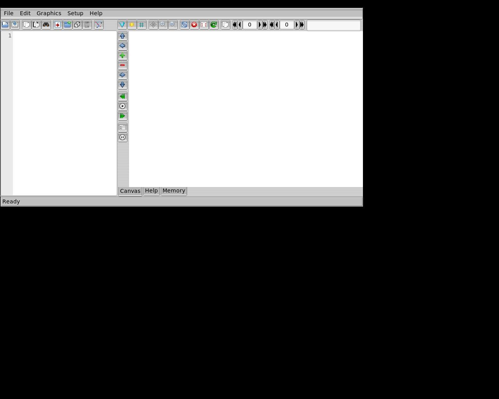 | [SHA256](./mathgl/SHA256SUMS) | v1.5.1-amd64-nevm |
| [mathomatic](./mathomatic) | amd64  | ubuntu-noble | 16.0.5-5-20250327 | 失败 | [SHA256](./mathomatic/SHA256SUMS) | v1.5.1-amd64-nevm |
| [matlab-support](./matlab-support) | amd64  | ubuntu-noble | 0.1-20250327 | 失败 | N/A | v1.5.1-amd64-nevm |
| [mauve-aligner](./mauve-aligner) | amd64  | ubuntu-noble | 2.4.0+4736-6-20250327 | 失败 | [SHA256](./mauve-aligner/SHA256SUMS) | v1.5.1-amd64-nevm |
| [mbox-importer](./mbox-importer) | amd64  | ubuntu-noble | 23.08.5-0ubuntu3 |  | [SHA256](./mbox-importer/SHA256SUMS) | v1.5.1-amd64-nevm |
| [mc](./mc) | amd64  | deepin-v23 | 4.8.31-1-20250327 | 失败 | [SHA256](./mc/SHA256SUMS) | v1.5.1-amd64-nevm |
| [mcomix](./mcomix) | amd64  | ubuntu-noble | 3.0.0-1-20250327 | 失败 | N/A | v1.5.1-amd64-nevm |
| [mcpdisp](./mcpdisp) | amd64  | ubuntu-noble | 0.1.2-0ubuntu4 |   | [SHA256](./mcpdisp/SHA256SUMS) | v1.5.1-amd64-nevm |
| [mcu8051ide](./mcu8051ide) | amd64  | ubuntu-noble | 1.4.9-2 |  | [SHA256](./mcu8051ide/SHA256SUMS) | v1.5.1-amd64-nevm |
| [mdfinder.app](./mdfinder.app) | amd64  | ubuntu-noble | 1.0.0-1build2-20250327 | 失败 | [SHA256](./mdfinder.app/SHA256SUMS) | v1.5.1-amd64-nevm |
| [medcon](./medcon) | amd64  | ubuntu-noble | 0.23.0-gtk3+dfsg-1.1build3-20250327 | 失败 | [SHA256](./medcon/SHA256SUMS) | v1.5.1-amd64-nevm |
| [mediaconch-gui](./mediaconch-gui) | amd64  | ubuntu-noble | 23.10-1build3 |  | [SHA256](./mediaconch-gui/SHA256SUMS) | v1.5.1-amd64-nevm |
| [mediainfo-gui](./mediainfo-gui) | amd64  | ubuntu-noble | 24.01.1-1build2 |  | [SHA256](./mediainfo-gui/SHA256SUMS) | v1.5.1-amd64-nevm |
| [mediathekview](./mediathekview) | amd64  | ubuntu-noble | 13.2.1+ds-1-20250327 | 失败 | [SHA256](./mediathekview/SHA256SUMS) | v1.5.1-amd64-nevm |
| [mednafen](./mednafen) | amd64  | ubuntu-noble | 1.29.0+dfsg-1build3-20250327 | 失败 | [SHA256](./mednafen/SHA256SUMS) | v1.5.1-amd64-nevm |
| [mednaffe](./mednaffe) | amd64  | ubuntu-noble | 0.9.2-1build2 |  | [SHA256](./mednaffe/SHA256SUMS) | v1.5.1-amd64-nevm |
| [megaglest-data](./megaglest-data) | amd64  | ubuntu-noble | 3.13.0-3-20250327 | 失败 | [SHA256](./megaglest-data/SHA256SUMS) | v1.5.1-amd64-nevm |
| [megan-ce](./megan-ce) | amd64  | ubuntu-noble | 6.21.1+dfsg-3 |  | [SHA256](./megan-ce/SHA256SUMS) | v1.5.1-amd64-nevm |
| [megapixels](./megapixels) | amd64  | ubuntu-noble | 1.8.1-1-20250327 | 失败 | [SHA256](./megapixels/SHA256SUMS) | v1.5.1-amd64-nevm |
| [meld](./meld) | amd64  | deepin-v23 | 3.22.2-1 |  | [SHA256](./meld/SHA256SUMS) | v1.5.1-amd64-nevm |
| [menulibre](./menulibre) | amd64  | ubuntu-noble | 2.4.0-0ubuntu1-20250327 | 失败 | N/A | v1.5.1-amd64-nevm |
| [meritous](./meritous) | amd64  | ubuntu-noble | 1.5-1.1 |  | [SHA256](./meritous/SHA256SUMS) | v1.5.1-amd64-nevm |
| [merkaartor](./merkaartor) | amd64  | ubuntu-noble | 0.19.0+ds-5 |  | [SHA256](./merkaartor/SHA256SUMS) | v1.5.1-amd64-nevm |
| [merkuro](./merkuro) | amd64  | ubuntu-noble | 23.08.5-0ubuntu3.1 |   | [SHA256](./merkuro/SHA256SUMS) | v1.5.1-amd64-nevm |
| [meshlab](./meshlab) | amd64  | ubuntu-noble | 2020.09+dfsg1-2build2 |  | [SHA256](./meshlab/SHA256SUMS) | v1.5.1-amd64-nevm |
| [mess-desktop-entries](./mess-desktop-entries) | amd64  | ubuntu-noble | 0.2-4.1-20250327 | 失败 | [SHA256](./mess-desktop-entries/SHA256SUMS) | v1.5.1-amd64-nevm |
| [metacity](./metacity) | amd64  | ubuntu-noble | 3.52.0-1build1-20250327 | 失败 | [SHA256](./metacity/SHA256SUMS) | v1.5.1-amd64-nevm |
| [metadata-cleaner](./metadata-cleaner) | amd64  | ubuntu-noble | 2.5.2+ds-1-20250327 | 失败 | N/A | v1.5.1-amd64-nevm |
| [meteo-qt](./meteo-qt) | amd64  | ubuntu-noble | 3.3-2.1-20250327 | 失败 | [SHA256](./meteo-qt/SHA256SUMS) | v1.5.1-amd64-nevm |
| [meterbridge](./meterbridge) | amd64  | ubuntu-noble | 0.9.2-14build1-20250327 | 失败 | [SHA256](./meterbridge/SHA256SUMS) | v1.5.1-amd64-nevm |
| [metview](./metview) | amd64  | ubuntu-noble | 5.21.2-1build3-20250327 | 失败 | [SHA256](./metview/SHA256SUMS) | v1.5.1-amd64-nevm |
| [mgba-qt](./mgba-qt) | amd64  | ubuntu-noble | 0.10.2+dfsg-1.1build3 |  | [SHA256](./mgba-qt/SHA256SUMS) | v1.5.1-amd64-nevm |
| [mhwaveedit](./mhwaveedit) | amd64  | ubuntu-noble | 1.4.24-1build2 |  | [SHA256](./mhwaveedit/SHA256SUMS) | v1.5.1-amd64-nevm |
| [mialmpick](./mialmpick) | amd64  | ubuntu-noble | 0.2.15-2build3 |  | [SHA256](./mialmpick/SHA256SUMS) | v1.5.1-amd64-nevm |
| [miceamaze](./miceamaze) | amd64  | ubuntu-noble | 4.2.1-3build1 |  | [SHA256](./miceamaze/SHA256SUMS) | v1.5.1-amd64-nevm |
| [micro](./micro) | amd64  | ubuntu-noble | 2.0.13-1-20250327 | 失败 | [SHA256](./micro/SHA256SUMS) | v1.5.1-amd64-nevm |
| [microhope](./microhope) | amd64  | ubuntu-noble | 5.3.1+repack-6build1 |  | [SHA256](./microhope/SHA256SUMS) | v1.5.1-amd64-nevm |
| [micropolis](./micropolis) | amd64  | ubuntu-noble | 0.0.20071228-10-20250327 | 失败 | [SHA256](./micropolis/SHA256SUMS) | v1.5.1-amd64-nevm |
| [mikutter](./mikutter) | amd64  | ubuntu-noble | 5.0.4+dfsg1-2-20250327 | 失败 | N/A | v1.5.1-amd64-nevm |
| [milkytracker](./milkytracker) | amd64  | ubuntu-noble | 1.04.00.20230830+dfsg-1build2 |  | [SHA256](./milkytracker/SHA256SUMS) | v1.5.1-amd64-nevm |
| [minder](./minder) | amd64  | ubuntu-noble | 1.16.2-1build2 |  | [SHA256](./minder/SHA256SUMS) | v1.5.1-amd64-nevm |
| [minetest](./minetest) | amd64  | ubuntu-noble | 5.6.1+dfsg+~1.9.0mt8+dfsg-4build3 |  | [SHA256](./minetest/SHA256SUMS) | v1.5.1-amd64-nevm |
| [minicom](./minicom) | amd64  | ubuntu-noble | 2.9-4-20250327 | 失败 | [SHA256](./minicom/SHA256SUMS) | v1.5.1-amd64-nevm |
| [minigalaxy](./minigalaxy) | amd64  | ubuntu-noble | 1.2.6-2-20250327 | 失败 | N/A | v1.5.1-amd64-nevm |
| [minitube](./minitube) | amd64  | ubuntu-noble | 3.9.3-2build2 |  | [SHA256](./minitube/SHA256SUMS) | v1.5.1-amd64-nevm |
| [minizinc-ide](./minizinc-ide) | amd64  | ubuntu-noble | 2.8.2-1build2 |  | [SHA256](./minizinc-ide/SHA256SUMS) | v1.5.1-amd64-nevm |
| [mintstick](./mintstick) | amd64  | ubuntu-noble | 1.6.0-1-20250327 | 失败 | N/A | v1.5.1-amd64-nevm |
| [minuet](./minuet) | amd64  | ubuntu-noble | 23.08.5-0ubuntu3-20250327 | 失败 | [SHA256](./minuet/SHA256SUMS) | v1.5.1-amd64-nevm |
| [mir-demos](./mir-demos) | amd64  | ubuntu-noble | 2.14.1-4.1ubuntu3-20250327 | 失败 | [SHA256](./mir-demos/SHA256SUMS) | v1.5.1-amd64-nevm |
| [mirage](./mirage) | amd64  | ubuntu-noble | 0.11.2-1build1-20250327 | 失败 | N/A | v1.5.1-amd64-nevm |
| [mirrormagic](./mirrormagic) | amd64  | ubuntu-noble | 3.3.0+dfsg1-1 |  | [SHA256](./mirrormagic/SHA256SUMS) | v1.5.1-amd64-nevm |
| [mit-scheme](./mit-scheme) | amd64  | ubuntu-noble | 12.1-3-20250327 | 失败 | [SHA256](./mit-scheme/SHA256SUMS) | v1.5.1-amd64-nevm |
| [mixxx](./mixxx) | amd64  | ubuntu-noble | 2.4.0+dfsg-2build4 |  | [SHA256](./mixxx/SHA256SUMS) | v1.5.1-amd64-nevm |
| [mkchromecast](./mkchromecast) | amd64  | ubuntu-noble | 0.3.9~git20200902+db2964a-2.1-20250327 | 失败 | N/A | v1.5.1-amd64-nevm |
| [mkvtoolnix-gui](./mkvtoolnix-gui) | amd64  | ubuntu-noble | 82.0-1build2-20250327 | 失败 | [SHA256](./mkvtoolnix-gui/SHA256SUMS) | v1.5.1-amd64-nevm |
| [mlterm-common](./mlterm-common) | amd64  | ubuntu-noble | 3.9.3-1build2 |  | [SHA256](./mlterm-common/SHA256SUMS) | v1.5.1-amd64-nevm |
| [mm3d](./mm3d) | amd64  | ubuntu-noble | 1.3.14-2build2 |  | [SHA256](./mm3d/SHA256SUMS) | v1.5.1-amd64-nevm |
| [mnemosyne](./mnemosyne) | amd64  | ubuntu-noble | 2.9+ds1-1 |  | [SHA256](./mnemosyne/SHA256SUMS) | v1.5.1-amd64-nevm |
| [mobile-atlas-creator](./mobile-atlas-creator) | amd64  | ubuntu-noble | 2.1.4+dfsg.1-2 |  | [SHA256](./mobile-atlas-creator/SHA256SUMS) | v1.5.1-amd64-nevm |
| [modem-manager-gui](./modem-manager-gui) | amd64  | ubuntu-noble | 0.0.20-6build3 |  | [SHA256](./modem-manager-gui/SHA256SUMS) | v1.5.1-amd64-nevm |
| [mokomaze](./mokomaze) | amd64  | ubuntu-noble | 0.7.1-1build4 |  | [SHA256](./mokomaze/SHA256SUMS) | v1.5.1-amd64-nevm |
| [monajat-applet](./monajat-applet) | amd64  | ubuntu-noble | 4.1-2-20250327 | 失败 | N/A | v1.5.1-amd64-nevm |
| [mono-tools-gui](./mono-tools-gui) | amd64  | deepin-v23 | 4.2-3.1 |  | [SHA256](./mono-tools-gui/SHA256SUMS) | v1.5.1-amd64-nevm |
| [monodoc-http](./monodoc-http) | amd64  | ubuntu-noble | 4.2-3.2-20250327 | 失败 | [SHA256](./monodoc-http/SHA256SUMS) | v1.5.1-amd64-nevm |
| [monsterz](./monsterz) | amd64  | ubuntu-noble | 0.7.1-12build1 |  | [SHA256](./monsterz/SHA256SUMS) | v1.5.1-amd64-nevm |
| [moon-lander](./moon-lander) | amd64  | ubuntu-noble | 1.0-9-20250327 | 失败 | [SHA256](./moon-lander/SHA256SUMS) | v1.5.1-amd64-nevm |
| [moonshot-ui](./moonshot-ui) | amd64  | ubuntu-noble | 1.1.0+libsecret~2ubuntu1 |  | [SHA256](./moonshot-ui/SHA256SUMS) | v1.5.1-amd64-nevm |
| [mopidy](./mopidy) | amd64  | ubuntu-noble | 3.4.2-1ubuntu0.1-20250327 | 失败 | N/A | v1.5.1-amd64-nevm |
| [moria](./moria) | amd64  | ubuntu-noble | 5.7.13-1-20250327 | 失败 | [SHA256](./moria/SHA256SUMS) | v1.5.1-amd64-nevm |
| [morph-browser](./morph-browser) | amd64  | ubuntu-noble | 1.1.0+dfsg-1build2-20250327 | 失败 | [SHA256](./morph-browser/SHA256SUMS) | v1.5.1-amd64-nevm |
| [morris](./morris) | amd64  | ubuntu-noble | 0.3-1build2 |  | [SHA256](./morris/SHA256SUMS) | v1.5.1-amd64-nevm |
| [moserial](./moserial) | amd64  | ubuntu-noble | 3.0.12-0ubuntu4 |  | [SHA256](./moserial/SHA256SUMS) | v1.5.1-amd64-nevm |
| [mousepad](./mousepad) | amd64  | ubuntu-noble | 0.6.1-1build2 |   | [SHA256](./mousepad/SHA256SUMS) | v1.5.1-amd64-nevm |
| [mousetrap](./mousetrap) | amd64  | ubuntu-noble | 1.0c-2build1 |  | [SHA256](./mousetrap/SHA256SUMS) | v1.5.1-amd64-nevm |
| [mozc-utils-gui](./mozc-utils-gui) | amd64  | deepin-v23 | 2.28.4715.102+dfsg-2.3deepin1 |  | [SHA256](./mozc-utils-gui/SHA256SUMS) | v1.5.1-amd64-nevm |
| [mozo](./mozo) | amd64  | ubuntu-noble | 1.26.2-1-20250327 | 失败 | N/A | v1.5.1-amd64-nevm |
| [mp3diags](./mp3diags) | amd64  | ubuntu-noble | 1.5.01-2build3 |  | [SHA256](./mp3diags/SHA256SUMS) | v1.5.1-amd64-nevm |
| [mp3splt-gtk](./mp3splt-gtk) | amd64  | ubuntu-noble | 0.9.2-3.2build5 |  | [SHA256](./mp3splt-gtk/SHA256SUMS) | v1.5.1-amd64-nevm |
| [mpdcon.app](./mpdcon.app) | amd64  | ubuntu-noble | 1.5.1-0.2build1-20250327 | 失败 | [SHA256](./mpdcon.app/SHA256SUMS) | v1.5.1-amd64-nevm |
| [mpdris2](./mpdris2) | amd64  | ubuntu-noble | 0.9.1-2-20250327 | 失败 | N/A | v1.5.1-amd64-nevm |
| [mplayer-gui](./mplayer-gui) | amd64  | ubuntu-noble | 1.5+svn38446-1build5-20250327 | 失败 | [SHA256](./mplayer-gui/SHA256SUMS) | v1.5.1-amd64-nevm |
| [mplinuxman](./mplinuxman) | amd64  | ubuntu-noble | 1.5-0ubuntu5 |  | [SHA256](./mplinuxman/SHA256SUMS) | v1.5.1-amd64-nevm |
| [mpv](./mpv) | amd64  | deepin-v23 | 0.38.0-1deepin1 |  | [SHA256](./mpv/SHA256SUMS) | v1.5.1-amd64-nevm |
| [mrboom](./mrboom) | amd64  | ubuntu-noble | 5.4+ds-1build2 |  | [SHA256](./mrboom/SHA256SUMS) | v1.5.1-amd64-nevm |
| [mricron](./mricron) | amd64  | ubuntu-noble | 1.2.20211006+dfsg-5 |  | [SHA256](./mricron/SHA256SUMS) | v1.5.1-amd64-nevm |
| [mrrescue](./mrrescue) | amd64  | ubuntu-noble | 1.02e-3 |  | [SHA256](./mrrescue/SHA256SUMS) | v1.5.1-amd64-nevm |
| [mrtrix3](./mrtrix3) | amd64  | ubuntu-noble | 3.0.4-1build2 |  | [SHA256](./mrtrix3/SHA256SUMS) | v1.5.1-amd64-nevm |
| [mtink](./mtink) | amd64  | ubuntu-noble | 1.0.16-15build2-20250327 | 失败 | [SHA256](./mtink/SHA256SUMS) | v1.5.1-amd64-nevm |
| [mtpaint](./mtpaint) | amd64  | ubuntu-noble | 3.50-0.1build3 |  | [SHA256](./mtpaint/SHA256SUMS) | v1.5.1-amd64-nevm |
| [mu-cade](./mu-cade) | amd64  | ubuntu-noble | 0.11.dfsg1-13build2 |  | [SHA256](./mu-cade/SHA256SUMS) | v1.5.1-amd64-nevm |
| [mudita24](./mudita24) | amd64  | ubuntu-noble | 1.0.3+svn13-7build3-20250327 | 失败 | [SHA256](./mudita24/SHA256SUMS) | v1.5.1-amd64-nevm |
| [muffin](./muffin) | amd64  | ubuntu-noble | 6.0.1-2build2-20250327 | 失败 | [SHA256](./muffin/SHA256SUMS) | v1.5.1-amd64-nevm |
| [mugshot](./mugshot) | amd64  | ubuntu-noble | 0.4.3-1-20250327 | 失败 | N/A | v1.5.1-amd64-nevm |
| [mumble](./mumble) | amd64  | ubuntu-noble | 1.5.517-1ubuntu2 |  | [SHA256](./mumble/SHA256SUMS) | v1.5.1-amd64-nevm |
| [munipack-gui](./munipack-gui) | amd64  | ubuntu-noble | 0.6.1-1build3 |  | [SHA256](./munipack-gui/SHA256SUMS) | v1.5.1-amd64-nevm |
| [mupdf](./mupdf) | amd64  | ubuntu-noble | 1.23.10+ds1-1build3-20250327 | 失败 | [SHA256](./mupdf/SHA256SUMS) | v1.5.1-amd64-nevm |
| [mupen64plus-qt](./mupen64plus-qt) | amd64  | ubuntu-noble | 1.15-1build2 | 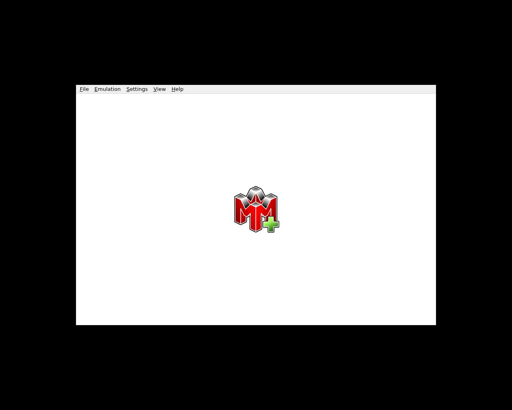 | [SHA256](./mupen64plus-qt/SHA256SUMS) | v1.5.1-amd64-nevm |
| [mupen64plus-ui-console](./mupen64plus-ui-console) | amd64  | ubuntu-noble | 2.5.9+26+g3ad5cbb-3-20250327 | 失败 | [SHA256](./mupen64plus-ui-console/SHA256SUMS) | v1.5.1-amd64-nevm |
| [muse](./muse) | amd64  | ubuntu-noble | 4.2.1-1build3 |  | [SHA256](./muse/SHA256SUMS) | v1.5.1-amd64-nevm |
| [musescore](./musescore) | amd64  | ubuntu-noble | 2.3.2+dfsg4-15build3 |  | [SHA256](./musescore/SHA256SUMS) | v1.5.1-amd64-nevm |
| [musescore3](./musescore3) | amd64  | ubuntu-noble | 3.2.3+dfsg2-16build5 |  | [SHA256](./musescore3/SHA256SUMS) | v1.5.1-amd64-nevm |
| [mustang-plug](./mustang-plug) | amd64  | ubuntu-noble | 1.2-3build3 |  | [SHA256](./mustang-plug/SHA256SUMS) | v1.5.1-amd64-nevm |
| [mutt](./mutt) | amd64  | deepin-v23 | 2.2.13-1-20250327 | 失败 | [SHA256](./mutt/SHA256SUMS) | v1.5.1-amd64-nevm |
| [mx44](./mx44) | amd64  | ubuntu-noble | 1.0-0ubuntu8-20250327 | 失败 | [SHA256](./mx44/SHA256SUMS) | v1.5.1-amd64-nevm |
| [mypaint](./mypaint) | amd64  | ubuntu-noble | 2.0.1-10build2-20250327 | 失败 | N/A | v1.5.1-amd64-nevm |
| [mystiq](./mystiq) | amd64  | ubuntu-noble | 20.03.23-3build2 |  | [SHA256](./mystiq/SHA256SUMS) | v1.5.1-amd64-nevm |
| [mythtv-backend](./mythtv-backend) | amd64  | ubuntu-noble | 34.0+fixes.20240210.e3e165a1-0ubuntu6-20250327 | 失败 | [SHA256](./mythtv-backend/SHA256SUMS) | v1.5.1-amd64-nevm |
| [mythtv-frontend](./mythtv-frontend) | amd64  | ubuntu-noble | 34.0+fixes.20240210.e3e165a1-0ubuntu6-20250327 | 失败 | [SHA256](./mythtv-frontend/SHA256SUMS) | v1.5.1-amd64-nevm |
| [naev](./naev) | amd64  | ubuntu-noble | 0.8.2-1build3 |  | [SHA256](./naev/SHA256SUMS) | v1.5.1-amd64-nevm |
| [nagstamon](./nagstamon) | amd64  | ubuntu-noble | 3.14.0+ds1-1-20250327 | 失败 | [SHA256](./nagstamon/SHA256SUMS) | v1.5.1-amd64-nevm |
| [natbraille](./natbraille) | amd64  | ubuntu-noble | 2.0rc3-15-20250327 | 失败 | [SHA256](./natbraille/SHA256SUMS) | v1.5.1-amd64-nevm |
| [nautic](./nautic) | amd64  | ubuntu-noble | 1.5-6build3 |  | [SHA256](./nautic/SHA256SUMS) | v1.5.1-amd64-nevm |
| [nautilus](./nautilus) | amd64  | ubuntu-noble | 46.2-0ubuntu0.3-20250327 | 失败 | N/A | v1.5.1-amd64-nevm |
| [nautilus-dropbox](./nautilus-dropbox) | amd64  | ubuntu-noble | 2019.02.14-1.2build2-20250327 | 失败 | N/A | v1.5.1-amd64-nevm |
| [nautilus-scripts-manager](./nautilus-scripts-manager) | amd64  | ubuntu-noble | 2.0-1.1-20250327 | 失败 | N/A | v1.5.1-amd64-nevm |
| [navit](./navit) | amd64  | ubuntu-noble | 0.5.6+dfsg.1-2build4 |  | [SHA256](./navit/SHA256SUMS) | v1.5.1-amd64-nevm |
| [nbsdgames](./nbsdgames) | amd64  | ubuntu-noble | 5-6-20250327 | 失败 | [SHA256](./nbsdgames/SHA256SUMS) | v1.5.1-amd64-nevm |
| [ncbi-cn3d](./ncbi-cn3d) | amd64  | ubuntu-noble | 3.0.20170106+dfsg2-2-20250327 | 失败 | [SHA256](./ncbi-cn3d/SHA256SUMS) | v1.5.1-amd64-nevm |
| [ncbi-tools-x11](./ncbi-tools-x11) | amd64  | ubuntu-noble | 6.1.20170106+dfsg2-2-20250327 | 失败 | [SHA256](./ncbi-tools-x11/SHA256SUMS) | v1.5.1-amd64-nevm |
| [ncl-ncarg](./ncl-ncarg) | amd64  | ubuntu-noble | 6.6.2.dfsg.1-5-20250327 | 失败 | N/A | v1.5.1-amd64-nevm |
| [ncmpc](./ncmpc) | amd64  | ubuntu-noble | 0.49-1build2-20250327 | 失败 | [SHA256](./ncmpc/SHA256SUMS) | v1.5.1-amd64-nevm |
| [ncmpcpp](./ncmpcpp) | amd64  | ubuntu-noble | 0.9.2-2build9-20250327 | 失败 | [SHA256](./ncmpcpp/SHA256SUMS) | v1.5.1-amd64-nevm |
| [nec2c](./nec2c) | amd64  | ubuntu-noble | 1.3.1-2-20250327 | 失败 | [SHA256](./nec2c/SHA256SUMS) | v1.5.1-amd64-nevm |
| [nedit](./nedit) | amd64  | ubuntu-noble | 5.7-5build2-20250327 | 失败 | [SHA256](./nedit/SHA256SUMS) | v1.5.1-amd64-nevm |
| [needrestart-session](./needrestart-session) | amd64  | ubuntu-noble | 0.3-12-20250327 | 失败 | N/A | v1.5.1-amd64-nevm |
| [nemo](./nemo) | amd64  | ubuntu-noble | 6.0.2-1ubuntu2-20250327 | 失败 | N/A | v1.5.1-amd64-nevm |
| [neobio](./neobio) | amd64  | ubuntu-noble | 0.0.20030929-6-20250327 | 失败 | [SHA256](./neobio/SHA256SUMS) | v1.5.1-amd64-nevm |
| [neochat](./neochat) | amd64  | ubuntu-noble | 23.08.5-0ubuntu4.1 |  | [SHA256](./neochat/SHA256SUMS) | v1.5.1-amd64-nevm |
| [neomutt](./neomutt) | amd64  | ubuntu-noble | 20231103+dfsg1-1build3-20250327 | 失败 | [SHA256](./neomutt/SHA256SUMS) | v1.5.1-amd64-nevm |
| [neovim-qt](./neovim-qt) | amd64  | ubuntu-noble | 0.2.18-1build2 |  | [SHA256](./neovim-qt/SHA256SUMS) | v1.5.1-amd64-nevm |
| [neovim-runtime](./neovim-runtime) | amd64  | ubuntu-noble | 0.9.5-6ubuntu2-20250327 | 失败 | [SHA256](./neovim-runtime/SHA256SUMS) | v1.5.1-amd64-nevm |
| [nestopia](./nestopia) | amd64  | ubuntu-noble | 1.52.0-1build2-20250327 | 失败 | N/A | v1.5.1-amd64-nevm |
| [net.hesan.gpy](./net.hesan.gpy) | amd64  | deepin-v23 | 1.0.26-20250327 | 失败 | [SHA256](./net.hesan.gpy/SHA256SUMS) | v1.5.1-amd64-nevm |
| [netgen](./netgen) | amd64  | ubuntu-noble | 6.2.2401+dfsg1-1.1build3-20250327 | 失败 | [SHA256](./netgen/SHA256SUMS) | v1.5.1-amd64-nevm |
| [nethack-console](./nethack-console) | amd64  | ubuntu-noble | 3.6.7-1build3-20250327 | 失败 | [SHA256](./nethack-console/SHA256SUMS) | v1.5.1-amd64-nevm |
| [nethack-qt](./nethack-qt) | amd64  | ubuntu-noble | 3.6.7-1build3-20250327 | 失败 | [SHA256](./nethack-qt/SHA256SUMS) | v1.5.1-amd64-nevm |
| [nethack-x11](./nethack-x11) | amd64  | ubuntu-noble | 3.6.7-1build3-20250327 | 失败 | [SHA256](./nethack-x11/SHA256SUMS) | v1.5.1-amd64-nevm |
| [netmate](./netmate) | amd64  | ubuntu-noble | 0.2.0-12build2 |  | [SHA256](./netmate/SHA256SUMS) | v1.5.1-amd64-nevm |
| [netpanzer](./netpanzer) | amd64  | ubuntu-noble | 0.8.7+ds-5 |  | [SHA256](./netpanzer/SHA256SUMS) | v1.5.1-amd64-nevm |
| [netrek-client-cow](./netrek-client-cow) | amd64  | ubuntu-noble | 3.3.2-1build2-20250327 | 失败 | [SHA256](./netrek-client-cow/SHA256SUMS) | v1.5.1-amd64-nevm |
| [netsurf-gtk](./netsurf-gtk) | amd64  | ubuntu-noble | 3.11-1build5 |  | [SHA256](./netsurf-gtk/SHA256SUMS) | v1.5.1-amd64-nevm |
| [nettoe](./nettoe) | amd64  | ubuntu-noble | 1.5.1-3-20250327 | 失败 | [SHA256](./nettoe/SHA256SUMS) | v1.5.1-amd64-nevm |
| [network-manager-gnome](./network-manager-gnome) | amd64  | deepin-v23 | 1.34.0-2-20250327 | 失败 | N/A | v1.5.1-amd64-nevm |
| [neurodebian-desktop](./neurodebian-desktop) | amd64  | ubuntu-noble | 0.42.1-20250327 | 失败 | [SHA256](./neurodebian-desktop/SHA256SUMS) | v1.5.1-amd64-nevm |
| [neverball](./neverball) | amd64  | ubuntu-noble | 1.6.0+git20180603-3build2 |  | [SHA256](./neverball/SHA256SUMS) | v1.5.1-amd64-nevm |
| [neverputt](./neverputt) | amd64  | ubuntu-noble | 1.6.0+git20180603-3build2 |  | [SHA256](./neverputt/SHA256SUMS) | v1.5.1-amd64-nevm |
| [nextcloud-desktop](./nextcloud-desktop) | amd64  | ubuntu-noble | 3.11.0-1.1build4 |  | [SHA256](./nextcloud-desktop/SHA256SUMS) | v1.5.1-amd64-nevm |
| [nexuiz](./nexuiz) | amd64  | ubuntu-noble | 2.5.2+dp-9 |  | [SHA256](./nexuiz/SHA256SUMS) | v1.5.1-amd64-nevm |
| [nfoview](./nfoview) | amd64  | ubuntu-noble | 1.99-1-20250327 | 失败 | N/A | v1.5.1-amd64-nevm |
| [ngraph-gtk](./ngraph-gtk) | amd64  | ubuntu-noble | 6.09.07-1build4 |  | [SHA256](./ngraph-gtk/SHA256SUMS) | v1.5.1-amd64-nevm |
| [nheko](./nheko) | amd64  | ubuntu-noble | 0.11.3+~0.9.2+~1.0.0+~0.3.0-1build4 |  | [SHA256](./nheko/SHA256SUMS) | v1.5.1-amd64-nevm |
| [nicotine](./nicotine) | amd64  | ubuntu-noble | 3.2.9-2-20250327 | 失败 | N/A | v1.5.1-amd64-nevm |
| [nikwi](./nikwi) | amd64  | ubuntu-noble | 0.0.20120213-6 |  | [SHA256](./nikwi/SHA256SUMS) | v1.5.1-amd64-nevm |
| [nip2](./nip2) | amd64  | ubuntu-noble | 8.9.1-1build3-20250327 | 失败 | N/A | v1.5.1-amd64-nevm |
| [nitrogen](./nitrogen) | amd64  | ubuntu-noble | 1.6.1-2build3 |  | [SHA256](./nitrogen/SHA256SUMS) | v1.5.1-amd64-nevm |
| [nitrokey-app](./nitrokey-app) | amd64  | ubuntu-noble | 1.4.2-1ubuntu2 |  | [SHA256](./nitrokey-app/SHA256SUMS) | v1.5.1-amd64-nevm |
| [nitrokey-authenticator](./nitrokey-authenticator) | amd64  | ubuntu-noble | 1.2.4-2build3 |  | [SHA256](./nitrokey-authenticator/SHA256SUMS) | v1.5.1-amd64-nevm |
| [nixnote2](./nixnote2) | amd64  | ubuntu-noble | 2.1.10+dfsg1-2build4 |  | [SHA256](./nixnote2/SHA256SUMS) | v1.5.1-amd64-nevm |
| [njam](./njam) | amd64  | ubuntu-noble | 1.25-12fakesync1 |  | [SHA256](./njam/SHA256SUMS) | v1.5.1-amd64-nevm |
| [njplot](./njplot) | amd64  | ubuntu-noble | 2.4-9build2-20250327 | 失败 | [SHA256](./njplot/SHA256SUMS) | v1.5.1-amd64-nevm |
| [nlkt](./nlkt) | amd64  | ubuntu-noble | 0.3.2.6-2.1build2 |  | [SHA256](./nlkt/SHA256SUMS) | v1.5.1-amd64-nevm |
| [nm-tray](./nm-tray) | amd64  | ubuntu-noble | 0.5.0-0ubuntu4-20250327 | 失败 | [SHA256](./nm-tray/SHA256SUMS) | v1.5.1-amd64-nevm |
| [nmapsi4](./nmapsi4) | amd64  | ubuntu-noble | 0.5~alpha2-4build2 |  | [SHA256](./nmapsi4/SHA256SUMS) | v1.5.1-amd64-nevm |
| [noblenote](./noblenote) | amd64  | ubuntu-noble | 1.2.0-1build4 |  | [SHA256](./noblenote/SHA256SUMS) | v1.5.1-amd64-nevm |
| [noiz2sa](./noiz2sa) | amd64  | ubuntu-noble | 0.51a-13 |  | [SHA256](./noiz2sa/SHA256SUMS) | v1.5.1-amd64-nevm |
| [nomacs](./nomacs) | amd64  | ubuntu-noble | 3.17.2282+dfsg-2build2 |  | [SHA256](./nomacs/SHA256SUMS) | v1.5.1-amd64-nevm |
| [notedeln](./notedeln) | amd64  | ubuntu-noble | 1.5.2-1build2 |  | [SHA256](./notedeln/SHA256SUMS) | v1.5.1-amd64-nevm |
| [notepadqq](./notepadqq) | amd64  | ubuntu-noble | 2.0.0~beta1-4build2 |  | [SHA256](./notepadqq/SHA256SUMS) | v1.5.1-amd64-nevm |
| [notification-daemon](./notification-daemon) | amd64  | deepin-v23 | 3.20.0-deepin1-20250327 | 失败 | [SHA256](./notification-daemon/SHA256SUMS) | v1.5.1-amd64-nevm |
| [notmuch](./notmuch) | amd64  | ubuntu-noble | 0.38.3-1ubuntu2-20250327 | 失败 | [SHA256](./notmuch/SHA256SUMS) | v1.5.1-amd64-nevm |
| [nsnake](./nsnake) | amd64  | ubuntu-noble | 3.0.1-2.1-20250327 | 失败 | [SHA256](./nsnake/SHA256SUMS) | v1.5.1-amd64-nevm |
| [nsxiv](./nsxiv) | amd64  | ubuntu-noble | 32-1build2-20250327 | 失败 | [SHA256](./nsxiv/SHA256SUMS) | v1.5.1-amd64-nevm |
| [nted](./nted) | amd64  | ubuntu-noble | 1.10.18-13build3 |  | [SHA256](./nted/SHA256SUMS) | v1.5.1-amd64-nevm |
| [numberstation](./numberstation) | amd64  | ubuntu-noble | 1.4.0-1-20250327 | 失败 | N/A | v1.5.1-amd64-nevm |
| [numptyphysics](./numptyphysics) | amd64  | ubuntu-noble | 0.3.10-0.2ubuntu3 |  | [SHA256](./numptyphysics/SHA256SUMS) | v1.5.1-amd64-nevm |
| [nuntius](./nuntius) | amd64  | ubuntu-noble | 0.2.0-5build3-20250327 | 失败 | [SHA256](./nuntius/SHA256SUMS) | v1.5.1-amd64-nevm |
| [nut-monitor](./nut-monitor) | amd64  | ubuntu-noble | 2.8.1-3.1ubuntu2 |  | [SHA256](./nut-monitor/SHA256SUMS) | v1.5.1-amd64-nevm |
| [nvidia-settings](./nvidia-settings) | amd64  | ubuntu-noble | 510.47.03-0ubuntu4-20250327 | 失败 | N/A | v1.5.1-amd64-nevm |
| [nvpy](./nvpy) | amd64  | ubuntu-noble | 2.0.0-2-20250327 | 失败 | [SHA256](./nvpy/SHA256SUMS) | v1.5.1-amd64-nevm |
| [nvtop](./nvtop) | amd64  | deepin-v23 | 3.0.2-1-20250327 | 失败 | [SHA256](./nvtop/SHA256SUMS) | v1.5.1-amd64-nevm |
| [obconf](./obconf) | amd64  | ubuntu-noble | 2.0.4+git20150213-3build1 |  | [SHA256](./obconf/SHA256SUMS) | v1.5.1-amd64-nevm |
| [obconf-qt](./obconf-qt) | amd64  | ubuntu-noble | 0.16.4-0ubuntu6 |  | [SHA256](./obconf-qt/SHA256SUMS) | v1.5.1-amd64-nevm |
| [obfuscate](./obfuscate) | amd64  | ubuntu-noble | 0.0.9-3 |  | [SHA256](./obfuscate/SHA256SUMS) | v1.5.1-amd64-nevm |
| [obs-studio](./obs-studio) | amd64  | obs-studio | 31.0.3 |  | [SHA256](./obs-studio/SHA256SUMS) | v1.5.2-amd64-nevm |
| [ocaml-interp](./ocaml-interp) | amd64  | ubuntu-noble | 4.14.1-1ubuntu1-20250327 | 失败 | [SHA256](./ocaml-interp/SHA256SUMS) | v1.5.1-amd64-nevm |
| [occt-draw](./occt-draw) | amd64  | ubuntu-noble | 7.6.3+dfsg1-7.1build1-20250327 | 失败 | [SHA256](./occt-draw/SHA256SUMS) | v1.5.1-amd64-nevm |
| [ocrfeeder](./ocrfeeder) | amd64  | ubuntu-noble | 0.8.5-1-20250327 | 失败 | N/A | v1.5.1-amd64-nevm |
| [octave](./octave) | amd64  | ubuntu-noble | 8.4.0-1build5 |  | [SHA256](./octave/SHA256SUMS) | v1.5.1-amd64-nevm |
| [odin](./odin) | amd64  | ubuntu-noble | 2.0.5-5build4 |   | [SHA256](./odin/SHA256SUMS) | v1.5.1-amd64-nevm |
| [oidc-agent-desktop](./oidc-agent-desktop) | amd64  | ubuntu-noble | 4.2.6-1.1build3-20250327 | 失败 | [SHA256](./oidc-agent-desktop/SHA256SUMS) | v1.5.1-amd64-nevm |
| [okteta](./okteta) | amd64  | ubuntu-noble | 0.26.15-1build3 |  | [SHA256](./okteta/SHA256SUMS) | v1.5.1-amd64-nevm |
| [okular](./okular) | amd64  | ubuntu-noble | 23.08.5-0ubuntu5 |  | [SHA256](./okular/SHA256SUMS) | v1.5.1-amd64-nevm |
| [okular-backend-odp](./okular-backend-odp) | amd64  | ubuntu-noble | 3.2.1+dfsg-8build4-20250327 | 失败 | [SHA256](./okular-backend-odp/SHA256SUMS) | v1.5.1-amd64-nevm |
| [okular-backend-odt](./okular-backend-odt) | amd64  | ubuntu-noble | 3.2.1+dfsg-8build4-20250327 | 失败 | [SHA256](./okular-backend-odt/SHA256SUMS) | v1.5.1-amd64-nevm |
| [okular-extra-backends](./okular-extra-backends) | amd64  | ubuntu-noble | 23.08.5-0ubuntu5-20250327 | 失败 | [SHA256](./okular-extra-backends/SHA256SUMS) | v1.5.1-amd64-nevm |
| [okular-mobile](./okular-mobile) | amd64  | ubuntu-noble | 23.08.5-0ubuntu5-20250327 | 失败 | [SHA256](./okular-mobile/SHA256SUMS) | v1.5.1-amd64-nevm |
| [omega-rpg](./omega-rpg) | amd64  | ubuntu-noble | 0.90-pa9-17-20250327 | 失败 | [SHA256](./omega-rpg/SHA256SUMS) | v1.5.1-amd64-nevm |
| [omegat](./omegat) | amd64  | ubuntu-noble | 3.6.0.10+dfsg-3 |  | [SHA256](./omegat/SHA256SUMS) | v1.5.1-amd64-nevm |
| [onboard](./onboard) | amd64  | deepin-v23 | 1.4.1.1-deepin7+rb1 |   | [SHA256](./onboard/SHA256SUMS) | v1.5.1-amd64-nevm |
| [onedriver](./onedriver) | amd64  | ubuntu-noble | 0.14.1-1build2 |  | [SHA256](./onedriver/SHA256SUMS) | v1.5.1-amd64-nevm |
| [oneisenough](./oneisenough) | amd64  | ubuntu-noble | 0.40-6 |  | [SHA256](./oneisenough/SHA256SUMS) | v1.5.1-amd64-nevm |
| [oneko](./oneko) | amd64  | ubuntu-noble | 1.2.sakura.6-15-20250327 | 失败 | [SHA256](./oneko/SHA256SUMS) | v1.5.1-amd64-nevm |
| [onioncircuits](./onioncircuits) | amd64  | ubuntu-noble | 0.8.1-1-20250327 | 失败 | N/A | v1.5.1-amd64-nevm |
| [onionshare](./onionshare) | amd64  | ubuntu-noble | 2.6-6ubuntu1 |  | [SHA256](./onionshare/SHA256SUMS) | v1.5.1-amd64-nevm |
| [open-adventure](./open-adventure) | amd64  | ubuntu-noble | 1.12-1-20250327 | 失败 | [SHA256](./open-adventure/SHA256SUMS) | v1.5.1-amd64-nevm |
| [open-invaders](./open-invaders) | amd64  | ubuntu-noble | 0.3-8build2-20250327 | 失败 | [SHA256](./open-invaders/SHA256SUMS) | v1.5.1-amd64-nevm |
| [openarena](./openarena) | amd64  | ubuntu-noble | 0.8.8+dfsg-7 |  | [SHA256](./openarena/SHA256SUMS) | v1.5.1-amd64-nevm |
| [openboard](./openboard) | amd64  | ubuntu-noble | 1.6.4+dfsg-1build8 |  | [SHA256](./openboard/SHA256SUMS) | v1.5.1-amd64-nevm |
| [openbox](./openbox) | amd64  | ubuntu-noble | 3.6.1-12build5-20250327 | 失败 | [SHA256](./openbox/SHA256SUMS) | v1.5.1-amd64-nevm |
| [openbox-lxde-session](./openbox-lxde-session) | amd64  | ubuntu-noble | 0.99.2-5-20250327 | 失败 | [SHA256](./openbox-lxde-session/SHA256SUMS) | v1.5.1-amd64-nevm |
| [opencfu](./opencfu) | amd64  | ubuntu-noble | 4.0.0+dfsg-2build2 |  | [SHA256](./opencfu/SHA256SUMS) | v1.5.1-amd64-nevm |
| [opencity](./opencity) | amd64  | ubuntu-noble | 0.0.6.5stable-5 |  | [SHA256](./opencity/SHA256SUMS) | v1.5.1-amd64-nevm |
| [openclonk](./openclonk) | amd64  | ubuntu-noble | 8.1-4build3-20250327 | 失败 | [SHA256](./openclonk/SHA256SUMS) | v1.5.1-amd64-nevm |
| [opencpn](./opencpn) | amd64  | ubuntu-noble | 5.8.4+dfsg-1build4 |  | [SHA256](./opencpn/SHA256SUMS) | v1.5.1-amd64-nevm |
| [opencubicplayer](./opencubicplayer) | amd64  | ubuntu-noble | 0.2.107+ds-1build3-20250327 | 失败 | [SHA256](./opencubicplayer/SHA256SUMS) | v1.5.1-amd64-nevm |
| [opendrop](./opendrop) | amd64  | ubuntu-noble | 3.3.1-6build2-20250327 | 失败 | N/A | v1.5.1-amd64-nevm |
| [openjazz](./openjazz) | amd64  | ubuntu-noble | 20231028-2-20250327 | 失败 | [SHA256](./openjazz/SHA256SUMS) | v1.5.1-amd64-nevm |
| [openjdk-11-jre](./openjdk-11-jre) | amd64  | ubuntu-noble | 11.0.26+4-1ubuntu1~24.04-20250327 | 失败 | [SHA256](./openjdk-11-jre/SHA256SUMS) | v1.5.1-amd64-nevm |
| [openjdk-17-jre](./openjdk-17-jre) | amd64  | ubuntu-noble | 17.0.14+7-1~24.04-20250327 | 失败 | [SHA256](./openjdk-17-jre/SHA256SUMS) | v1.5.1-amd64-nevm |
| [openjdk-21-jre](./openjdk-21-jre) | amd64  | ubuntu-noble | 21.0.6+7-1~24.04.1-20250327 | 失败 | [SHA256](./openjdk-21-jre/SHA256SUMS) | v1.5.1-amd64-nevm |
| [openjdk-8-jre](./openjdk-8-jre) | amd64  | ubuntu-noble | 8u442-b06~us1-0ubuntu1~24.04 |  | [SHA256](./openjdk-8-jre/SHA256SUMS) | v1.5.1-amd64-nevm |
| [openlp](./openlp) | amd64  | ubuntu-noble | 3.1.0~rc4-1-20250327 | 失败 | N/A | v1.5.1-amd64-nevm |
| [openmcdf](./openmcdf) | amd64  | ubuntu-noble | 1.5.4-3.1-20250327 | 失败 | [SHA256](./openmcdf/SHA256SUMS) | v1.5.1-amd64-nevm |
| [openmrac](./openmrac) | amd64  | ubuntu-noble | 1.2-2build2 |  | [SHA256](./openmrac/SHA256SUMS) | v1.5.1-amd64-nevm |
| [openmsx](./openmsx) | amd64  | ubuntu-noble | 19.1+dfsg-1ubuntu3 |  | [SHA256](./openmsx/SHA256SUMS) | v1.5.1-amd64-nevm |
| [openmsx-catapult](./openmsx-catapult) | amd64  | ubuntu-noble | 19.0-1build2 |  | [SHA256](./openmsx-catapult/SHA256SUMS) | v1.5.1-amd64-nevm |
| [openmsx-debugger](./openmsx-debugger) | amd64  | ubuntu-noble | 0.1~git20230804-1build2 |  | [SHA256](./openmsx-debugger/SHA256SUMS) | v1.5.1-amd64-nevm |
| [openmw-cs](./openmw-cs) | amd64  | ubuntu-noble | 0.48.0-1ubuntu5 |  | [SHA256](./openmw-cs/SHA256SUMS) | v1.5.1-amd64-nevm |
| [openmw-launcher](./openmw-launcher) | amd64  | ubuntu-noble | 0.48.0-1ubuntu5 |  | [SHA256](./openmw-launcher/SHA256SUMS) | v1.5.1-amd64-nevm |
| [openorienteering-mapper](./openorienteering-mapper) | amd64  | ubuntu-noble | 0.9.5-3.1build5 |  | [SHA256](./openorienteering-mapper/SHA256SUMS) | v1.5.1-amd64-nevm |
| [openpgp-applet](./openpgp-applet) | amd64  | ubuntu-noble | 1.1-3-20250327 | 失败 | N/A | v1.5.1-amd64-nevm |
| [openpref](./openpref) | amd64  | ubuntu-noble | 0.1.3-3build3 |  | [SHA256](./openpref/SHA256SUMS) | v1.5.1-amd64-nevm |
| [openrct2](./openrct2) | amd64  | ubuntu-noble | 0.4.10+ds-1ubuntu1 |  | [SHA256](./openrct2/SHA256SUMS) | v1.5.1-amd64-nevm |
| [openrefine](./openrefine) | amd64  | ubuntu-noble | 3.7.7-1-20250327 | 失败 | [SHA256](./openrefine/SHA256SUMS) | v1.5.1-amd64-nevm |
| [openrocket](./openrocket) | amd64  | ubuntu-noble | 15.03.6-20250327 | 失败 | [SHA256](./openrocket/SHA256SUMS) | v1.5.1-amd64-nevm |
| [opensc](./opensc) | amd64  | deepin-v23 | 0.25.1-1-20250327 | 失败 | [SHA256](./opensc/SHA256SUMS) | v1.5.1-amd64-nevm |
| [openscad](./openscad) | amd64  | ubuntu-noble | 2021.01-6build4 |  | [SHA256](./openscad/SHA256SUMS) | v1.5.1-amd64-nevm |
| [openshot-qt](./openshot-qt) | amd64  | ubuntu-noble | 3.1.1+dfsg1-1 |  | [SHA256](./openshot-qt/SHA256SUMS) | v1.5.1-amd64-nevm |
| [openssn](./openssn) | amd64  | ubuntu-noble | 1.4-4 |  | [SHA256](./openssn/SHA256SUMS) | v1.5.1-amd64-nevm |
| [openstereogram](./openstereogram) | amd64  | ubuntu-noble | 0.1+20080921-3-20250327 | 失败 | [SHA256](./openstereogram/SHA256SUMS) | v1.5.1-amd64-nevm |
| [openswitcher](./openswitcher) | amd64  | ubuntu-noble | 0.10.0-1build1-20250327 | 失败 | N/A | v1.5.1-amd64-nevm |
| [openttd](./openttd) | amd64  | ubuntu-noble | 13.4-1build3 |  | [SHA256](./openttd/SHA256SUMS) | v1.5.1-amd64-nevm |
| [opentyrian](./opentyrian) | amd64  | ubuntu-noble | 2.1.20221123-1-20250327 | 失败 | [SHA256](./opentyrian/SHA256SUMS) | v1.5.1-amd64-nevm |
| [openuniverse](./openuniverse) | amd64  | ubuntu-noble | 1.0beta3.1+dfsg-7.1build1-20250327 | 失败 | [SHA256](./openuniverse/SHA256SUMS) | v1.5.1-amd64-nevm |
| [openyahtzee](./openyahtzee) | amd64  | ubuntu-noble | 1.9.3-5build3 |  | [SHA256](./openyahtzee/SHA256SUMS) | v1.5.1-amd64-nevm |
| [ophcrack](./ophcrack) | amd64  | ubuntu-noble | 3.8.0-3build4 |  | [SHA256](./ophcrack/SHA256SUMS) | v1.5.1-amd64-nevm |
| [optgeo](./optgeo) | amd64  | ubuntu-noble | 2.25-4 |  | [SHA256](./optgeo/SHA256SUMS) | v1.5.1-amd64-nevm |
| [opticalraytracer](./opticalraytracer) | amd64  | ubuntu-noble | 9.6-4 |  | [SHA256](./opticalraytracer/SHA256SUMS) | v1.5.1-amd64-nevm |
| [orage](./orage) | amd64  | ubuntu-noble | 4.18.0-1build3 |   | [SHA256](./orage/SHA256SUMS) | v1.5.1-amd64-nevm |
| [orbital-eunuchs-sniper](./orbital-eunuchs-sniper) | amd64  | ubuntu-noble | 1.30+svn20070601-4.1-20250327 | 失败 | [SHA256](./orbital-eunuchs-sniper/SHA256SUMS) | v1.5.1-amd64-nevm |
| [org.deepin.browser](./org.deepin.browser) | amd64  | deepin-v23 | 6.5.2-1-20250327 | 失败 | N/A | v1.5.1-amd64-nevm |
| [org.deepin.downloader](./org.deepin.downloader) | amd64  | deepin-v23 | 5.3.77 |  | [SHA256](./org.deepin.downloader/SHA256SUMS) | v1.5.1-amd64-nevm |
| [org.szra.uosboscukey](./org.szra.uosboscukey) | amd64  | deepin-v23 | 3.28.2.4-b3-20250327 | 失败 | [SHA256](./org.szra.uosboscukey/SHA256SUMS) | v1.5.1-amd64-nevm |
| [org.szra.uoscibukey](./org.szra.uoscibukey) | amd64  | deepin-v23 | 3.30.2.4-b5-20250327 | 失败 | [SHA256](./org.szra.uoscibukey/SHA256SUMS) | v1.5.1-amd64-nevm |
| [org.szra.uoslzbukey](./org.szra.uoslzbukey) | amd64  | deepin-v23 | 3.33.2.4-b5-20250327 | 失败 | [SHA256](./org.szra.uoslzbukey/SHA256SUMS) | v1.5.1-amd64-nevm |
| [org.szra.uosxabukey](./org.szra.uosxabukey) | amd64  | deepin-v23 | 3.29.2.4-b5-20250327 | 失败 | [SHA256](./org.szra.uosxabukey/SHA256SUMS) | v1.5.1-amd64-nevm |
| [osdlyrics](./osdlyrics) | amd64  | ubuntu-noble | 0.5.15+dfsg-2build2-20250327 | 失败 | N/A | v1.5.1-amd64-nevm |
| [osmo](./osmo) | amd64  | ubuntu-noble | 0.4.4-2.1build2-20250327 | 失败 | N/A | v1.5.1-amd64-nevm |
| [osmose-emulator](./osmose-emulator) | amd64  | ubuntu-noble | 1.6-1build3-20250327 | 失败 | [SHA256](./osmose-emulator/SHA256SUMS) | v1.5.1-amd64-nevm |
| [othman](./othman) | amd64  | ubuntu-noble | 1.0.0-2-20250327 | 失败 | N/A | v1.5.1-amd64-nevm |
| [otpclient](./otpclient) | amd64  | ubuntu-noble | 3.2.1-2build4 |  | [SHA256](./otpclient/SHA256SUMS) | v1.5.1-amd64-nevm |
| [out-of-order](./out-of-order) | amd64  | ubuntu-noble | 1.0-3-20250327 | 失败 | [SHA256](./out-of-order/SHA256SUMS) | v1.5.1-amd64-nevm |
| [overgod](./overgod) | amd64  | ubuntu-noble | 1.0-6build2-20250327 | 失败 | [SHA256](./overgod/SHA256SUMS) | v1.5.1-amd64-nevm |
| [owncloud-client](./owncloud-client) | amd64  | ubuntu-noble | 5.2.1.13040+dfsg-2build1 |  | [SHA256](./owncloud-client/SHA256SUMS) | v1.5.1-amd64-nevm |
| [owncloud-client-cmd](./owncloud-client-cmd) | amd64  | ubuntu-noble | 5.2.1.13040+dfsg-2build1-20250327 | 失败 | [SHA256](./owncloud-client-cmd/SHA256SUMS) | v1.5.1-amd64-nevm |
| [package-update-indicator](./package-update-indicator) | amd64  | ubuntu-noble | 8-2build2-20250327 | 失败 | N/A | v1.5.1-amd64-nevm |
| [packagesearch](./packagesearch) | amd64  | ubuntu-noble | 2.8.1build3-20250327 | 失败 | N/A | v1.5.1-amd64-nevm |
| [packetsender](./packetsender) | amd64  | ubuntu-noble | 8.5.2-1build2-20250327 | 失败 | [SHA256](./packetsender/SHA256SUMS) | v1.5.1-amd64-nevm |
| [pacman](./pacman) | amd64  | ubuntu-noble | 10-19-20250327 | 失败 | [SHA256](./pacman/SHA256SUMS) | v1.5.1-amd64-nevm |
| [pacman4console](./pacman4console) | amd64  | ubuntu-noble | 1.3-1build3-20250327 | 失败 | [SHA256](./pacman4console/SHA256SUMS) | v1.5.1-amd64-nevm |
| [padthv1](./padthv1) | amd64  | ubuntu-noble | 0.9.34-1build3 |  | [SHA256](./padthv1/SHA256SUMS) | v1.5.1-amd64-nevm |
| [pageedit](./pageedit) | amd64  | ubuntu-noble | 2.0.0+dfsg-1build2 |  | [SHA256](./pageedit/SHA256SUMS) | v1.5.1-amd64-nevm |
| [paje.app](./paje.app) | amd64  | ubuntu-noble | 1.98-1.1build1-20250327 | 失败 | [SHA256](./paje.app/SHA256SUMS) | v1.5.1-amd64-nevm |
| [palapeli](./palapeli) | amd64  | ubuntu-noble | 23.08.5-0ubuntu3 |  | [SHA256](./palapeli/SHA256SUMS) | v1.5.1-amd64-nevm |
| [pampi](./pampi) | amd64  | ubuntu-noble | 1.1+dfsg1-9-20250327 | 失败 | [SHA256](./pampi/SHA256SUMS) | v1.5.1-amd64-nevm |
| [pan](./pan) | amd64  | ubuntu-noble | 0.155-1build2 |  | [SHA256](./pan/SHA256SUMS) | v1.5.1-amd64-nevm |
| [pangzero](./pangzero) | amd64  | ubuntu-noble | 1.4.1+git20121103-6 |  | [SHA256](./pangzero/SHA256SUMS) | v1.5.1-amd64-nevm |
| [paprefs](./paprefs) | amd64  | ubuntu-noble | 1.2-1fakesync1build2 |  | [SHA256](./paprefs/SHA256SUMS) | v1.5.1-amd64-nevm |
| [paraview](./paraview) | amd64  | ubuntu-noble | 5.11.2+dfsg-6build5 |   | [SHA256](./paraview/SHA256SUMS) | v1.5.1-amd64-nevm |
| [parcellite](./parcellite) | amd64  | ubuntu-noble | 1.2.1-8build2-20250327 | 失败 | [SHA256](./parcellite/SHA256SUMS) | v1.5.1-amd64-nevm |
| [parlatype](./parlatype) | amd64  | ubuntu-noble | 3.1-3.1build3 |  | [SHA256](./parlatype/SHA256SUMS) | v1.5.1-amd64-nevm |
| [parley](./parley) | amd64  | ubuntu-noble | 23.08.5-0ubuntu3 |  | [SHA256](./parley/SHA256SUMS) | v1.5.1-amd64-nevm |
| [parole](./parole) | amd64  | ubuntu-noble | 4.18.1-1build2 |  | [SHA256](./parole/SHA256SUMS) | v1.5.1-amd64-nevm |
| [parolottero](./parolottero) | amd64  | ubuntu-noble | 1.0-1.1build2 |  | [SHA256](./parolottero/SHA256SUMS) | v1.5.1-amd64-nevm |
| [parsec47](./parsec47) | amd64  | ubuntu-noble | 0.2.dfsg1-9build5 |  | [SHA256](./parsec47/SHA256SUMS) | v1.5.1-amd64-nevm |
| [partitionmanager](./partitionmanager) | amd64  | ubuntu-noble | 23.08.5-0ubuntu4 |  | [SHA256](./partitionmanager/SHA256SUMS) | v1.5.1-amd64-nevm |
| [pasaffe](./pasaffe) | amd64  | ubuntu-noble | 0.58-0ubuntu1-20250327 | 失败 | N/A | v1.5.1-amd64-nevm |
| [passage](./passage) | amd64  | ubuntu-noble | 4+dfsg1-3build1 |  | [SHA256](./passage/SHA256SUMS) | v1.5.1-amd64-nevm |
| [passes-gtk](./passes-gtk) | amd64  | ubuntu-noble | 0.9-1build1-20250327 | 失败 | N/A | v1.5.1-amd64-nevm |
| [password-gorilla](./password-gorilla) | amd64  | ubuntu-noble | 1.6.0~git20180203.228bbbb-1-20250327 | 失败 | [SHA256](./password-gorilla/SHA256SUMS) | v1.5.1-amd64-nevm |
| [passwordsafe](./passwordsafe) | amd64  | ubuntu-noble | 1.17.0+dfsg-1build2 |  | [SHA256](./passwordsafe/SHA256SUMS) | v1.5.1-amd64-nevm |
| [pasystray](./pasystray) | amd64  | ubuntu-noble | 0.8.2-1build2-20250327 | 失败 | [SHA256](./pasystray/SHA256SUMS) | v1.5.1-amd64-nevm |
| [patchance](./patchance) | amd64  | ubuntu-noble | 1.1.0-0ubuntu2-20250327 | 失败 | [SHA256](./patchance/SHA256SUMS) | v1.5.1-amd64-nevm |
| [pathogen](./pathogen) | amd64  | ubuntu-noble | 1.1.1-5build1 |  | [SHA256](./pathogen/SHA256SUMS) | v1.5.1-amd64-nevm |
| [pathological](./pathological) | amd64  | ubuntu-noble | 1.1.3-17-20250327 | 失败 | [SHA256](./pathological/SHA256SUMS) | v1.5.1-amd64-nevm |
| [pavucontrol](./pavucontrol) | amd64  | ubuntu-noble | 5.0-2build3 |  | [SHA256](./pavucontrol/SHA256SUMS) | v1.5.1-amd64-nevm |
| [pavucontrol-qt](./pavucontrol-qt) | amd64  | ubuntu-noble | 1.4.0-0ubuntu6 |  | [SHA256](./pavucontrol-qt/SHA256SUMS) | v1.5.2-amd64-nevm |
| [pavumeter](./pavumeter) | amd64  | ubuntu-noble | 0.9.3-4build5 |   | [SHA256](./pavumeter/SHA256SUMS) | v1.5.1-amd64-nevm |
| [pax-britannica](./pax-britannica) | amd64  | ubuntu-noble | 1.0.0-5build2-20250327 | 失败 | [SHA256](./pax-britannica/SHA256SUMS) | v1.5.1-amd64-nevm |
| [pcalendar](./pcalendar) | amd64  | ubuntu-noble | 3.4.1-5 |  | [SHA256](./pcalendar/SHA256SUMS) | v1.5.1-amd64-nevm |
| [pcmanfm](./pcmanfm) | amd64  | ubuntu-noble | 1.3.2-4build2 |   | [SHA256](./pcmanfm/SHA256SUMS) | v1.5.1-amd64-nevm |
| [pcmanfm-qt](./pcmanfm-qt) | amd64  | ubuntu-noble | 1.4.1-0ubuntu6-20250327 | 失败 | N/A | v1.5.1-amd64-nevm |
| [pcp-gui](./pcp-gui) | amd64  | deepin-v23 | 6.3.1-1 |  | [SHA256](./pcp-gui/SHA256SUMS) | v1.5.1-amd64-nevm |
| [pcsc-tools](./pcsc-tools) | amd64  | ubuntu-noble | 1.7.1-1-20250327 | 失败 | [SHA256](./pcsc-tools/SHA256SUMS) | v1.5.1-amd64-nevm |
| [pcsxr](./pcsxr) | amd64  | ubuntu-noble | 1.9.94-6 |  | [SHA256](./pcsxr/SHA256SUMS) | v1.5.1-amd64-nevm |
| [pdf-presenter-console](./pdf-presenter-console) | amd64  | ubuntu-noble | 4.6.0-3build3-20250327 | 失败 | [SHA256](./pdf-presenter-console/SHA256SUMS) | v1.5.1-amd64-nevm |
| [pdfarranger](./pdfarranger) | amd64  | ubuntu-noble | 1.10.1-1-20250327 | 失败 | N/A | v1.5.1-amd64-nevm |
| [pdfchain](./pdfchain) | amd64  | ubuntu-noble | 0.4.4.2-2build2 |  | [SHA256](./pdfchain/SHA256SUMS) | v1.5.1-amd64-nevm |
| [pdfsam](./pdfsam) | amd64  | ubuntu-noble | 4.3.4-1-20250327 | 失败 | [SHA256](./pdfsam/SHA256SUMS) | v1.5.1-amd64-nevm |
| [peek](./peek) | amd64  | ubuntu-noble | 1.5.1+git20230114-1build2 |  | [SHA256](./peek/SHA256SUMS) | v1.5.1-amd64-nevm |
| [peg-e](./peg-e) | amd64  | ubuntu-noble | 1.3.2-1build2 |  | [SHA256](./peg-e/SHA256SUMS) | v1.5.1-amd64-nevm |
| [peg-solitaire](./peg-solitaire) | amd64  | ubuntu-noble | 2.2-4build2-20250327 | 失败 | [SHA256](./peg-solitaire/SHA256SUMS) | v1.5.1-amd64-nevm |
| [pegsolitaire](./pegsolitaire) | amd64  | ubuntu-noble | 0.3-2build2 |  | [SHA256](./pegsolitaire/SHA256SUMS) | v1.5.1-amd64-nevm |
| [pekka-kana-2](./pekka-kana-2) | amd64  | ubuntu-noble | 1.2.7-1-20250327 | 失败 | [SHA256](./pekka-kana-2/SHA256SUMS) | v1.5.1-amd64-nevm |
| [pencil2d](./pencil2d) | amd64  | ubuntu-noble | 0.6.6-3build2 |  | [SHA256](./pencil2d/SHA256SUMS) | v1.5.1-amd64-nevm |
| [pente](./pente) | amd64  | ubuntu-noble | 2.2.5-11-20250327 | 失败 | [SHA256](./pente/SHA256SUMS) | v1.5.2-amd64-nevm |
| [pentobi](./pentobi) | amd64  | ubuntu-noble | 23.1-1build2 |  | [SHA256](./pentobi/SHA256SUMS) | v1.5.2-amd64-nevm |
| [peony](./peony) | amd64  | ubuntu-noble | 4.0.0.1-1-20250327 | 失败 | N/A | v1.5.2-amd64-nevm |
| [performous](./performous) | amd64  | ubuntu-noble | 1.3.0+ds-1build4 |  | [SHA256](./performous/SHA256SUMS) | v1.5.2-amd64-nevm |
| [perlprimer](./perlprimer) | amd64  | ubuntu-noble | 1.2.4-2-20250327 | 失败 | [SHA256](./perlprimer/SHA256SUMS) | v1.5.2-amd64-nevm |
| [persalys](./persalys) | amd64  | ubuntu-noble | 15.0+ds-3build5 |  | [SHA256](./persalys/SHA256SUMS) | v1.5.2-amd64-nevm |
| [persepolis](./persepolis) | amd64  | ubuntu-noble | 3.0.1-1.1 |  | [SHA256](./persepolis/SHA256SUMS) | v1.5.2-amd64-nevm |
| [peruse](./peruse) | amd64  | ubuntu-noble | 1.80+dfsg-2build11 |  | [SHA256](./peruse/SHA256SUMS) | v1.5.2-amd64-nevm |
| [petris](./petris) | amd64  | ubuntu-noble | 1.0.1-11-20250327 | 失败 | [SHA256](./petris/SHA256SUMS) | v1.5.2-amd64-nevm |
| [pfm](./pfm) | amd64  | ubuntu-noble | 2.0.8-3-20250327 | 失败 | [SHA256](./pfm/SHA256SUMS) | v1.5.2-amd64-nevm |
| [pgn2web](./pgn2web) | amd64  | ubuntu-noble | 0.4-3.1build3 |  | [SHA256](./pgn2web/SHA256SUMS) | v1.5.2-amd64-nevm |
| [phasex](./phasex) | amd64  | ubuntu-noble | 0.14.97-3build5 |  | [SHA256](./phasex/SHA256SUMS) | v1.5.2-amd64-nevm |
| [phlipple](./phlipple) | amd64  | ubuntu-noble | 0.8.5-5.1build1 |  | [SHA256](./phlipple/SHA256SUMS) | v1.5.2-amd64-nevm |
| [phoc](./phoc) | amd64  | ubuntu-noble | 0.38.0+ds-1-20250327 | 失败 | [SHA256](./phoc/SHA256SUMS) | v1.5.2-amd64-nevm |
| [phosh](./phosh) | amd64  | ubuntu-noble | 0.38.0-1-20250327 | 失败 | [SHA256](./phosh/SHA256SUMS) | v1.5.2-amd64-nevm |
| [phosh-antispam](./phosh-antispam) | amd64  | ubuntu-noble | 3.4-1build2 |  | [SHA256](./phosh-antispam/SHA256SUMS) | v1.5.2-amd64-nevm |
| [phosh-mobile-settings](./phosh-mobile-settings) | amd64  | ubuntu-noble | 0.38.0-1 |  | [SHA256](./phosh-mobile-settings/SHA256SUMS) | v1.5.2-amd64-nevm |
| [phosh-tour](./phosh-tour) | amd64  | ubuntu-noble | 0.38.0-1 |  | [SHA256](./phosh-tour/SHA256SUMS) | v1.5.2-amd64-nevm |
| [photocollage](./photocollage) | amd64  | ubuntu-noble | 1.4.5-0.2-20250327 | 失败 | N/A | v1.5.2-amd64-nevm |
| [photofilmstrip](./photofilmstrip) | amd64  | ubuntu-noble | 4.0.0-2-20250327 | 失败 | N/A | v1.5.2-amd64-nevm |
| [photoflare](./photoflare) | amd64  | ubuntu-noble | 1.6.13-1build2 |  | [SHA256](./photoflare/SHA256SUMS) | v1.5.2-amd64-nevm |
| [photoqt](./photoqt) | amd64  | ubuntu-noble | 4.4+ds-1-20250327 | 失败 | [SHA256](./photoqt/SHA256SUMS) | v1.5.2-amd64-nevm |
| [phototonic](./phototonic) | amd64  | ubuntu-noble | 2.1-3build2 |  | [SHA256](./phototonic/SHA256SUMS) | v1.5.2-amd64-nevm |
| [phpliteadmin](./phpliteadmin) | amd64  | ubuntu-noble | 1.9.8.2-2-20250327 | 失败 | [SHA256](./phpliteadmin/SHA256SUMS) | v1.5.2-amd64-nevm |
| [pianobooster](./pianobooster) | amd64  | ubuntu-noble | 1.0.0-3build2-20250327 | 失败 | [SHA256](./pianobooster/SHA256SUMS) | v1.5.2-amd64-nevm |
| [picard](./picard) | amd64  | ubuntu-noble | 2.11-1 |  | [SHA256](./picard/SHA256SUMS) | v1.5.2-amd64-nevm |
| [picmi](./picmi) | amd64  | ubuntu-noble | 23.08.5-0ubuntu3 |  | [SHA256](./picmi/SHA256SUMS) | v1.5.2-amd64-nevm |
| [picom](./picom) | amd64  | ubuntu-noble | 10.2-3build2-20250327 | 失败 | [SHA256](./picom/SHA256SUMS) | v1.5.2-amd64-nevm |
| [picom-conf](./picom-conf) | amd64  | ubuntu-noble | 0.17.0-1build3 |  | [SHA256](./picom-conf/SHA256SUMS) | v1.5.2-amd64-nevm |
| [picplanner](./picplanner) | amd64  | ubuntu-noble | 0.4.0-1build2 |  | [SHA256](./picplanner/SHA256SUMS) | v1.5.2-amd64-nevm |
| [pidgin](./pidgin) | amd64  | ubuntu-noble | 2.14.13-1ubuntu2-20250327 | 失败 | N/A | v1.5.2-amd64-nevm |
| [pikopixel.app](./pikopixel.app) | amd64  | ubuntu-noble | 1.0-b10b-1build1-20250327 | 失败 | [SHA256](./pikopixel.app/SHA256SUMS) | v1.5.2-amd64-nevm |
| [pim-data-exporter](./pim-data-exporter) | amd64  | ubuntu-noble | 23.08.5-0ubuntu3 |  | [SHA256](./pim-data-exporter/SHA256SUMS) | v1.5.2-amd64-nevm |
| [pim-sieve-editor](./pim-sieve-editor) | amd64  | ubuntu-noble | 23.08.5-0ubuntu3 |  | [SHA256](./pim-sieve-editor/SHA256SUMS) | v1.5.2-amd64-nevm |
| [pinball](./pinball) | amd64  | ubuntu-noble | 0.3.20230219-1 |  | [SHA256](./pinball/SHA256SUMS) | v1.5.2-amd64-nevm |
| [pineapple-pictures](./pineapple-pictures) | amd64  | ubuntu-noble | 0.7.3-1build2 |  | [SHA256](./pineapple-pictures/SHA256SUMS) | v1.5.2-amd64-nevm |
| [pingus](./pingus) | amd64  | ubuntu-noble | 0.7.6-6build2 |  | [SHA256](./pingus/SHA256SUMS) | v1.5.2-amd64-nevm |
| [pinhole](./pinhole) | amd64  | ubuntu-noble | 0.1.0+git20221220-1build2 |  | [SHA256](./pinhole/SHA256SUMS) | v1.5.2-amd64-nevm |
| [pink-pony](./pink-pony) | amd64  | ubuntu-noble | 1.4.1-3.1build3-20250327 | 失败 | [SHA256](./pink-pony/SHA256SUMS) | v1.5.2-amd64-nevm |
| [pinot](./pinot) | amd64  | ubuntu-noble | 1.21-1build3 |   | [SHA256](./pinot/SHA256SUMS) | v1.5.2-amd64-nevm |
| [pioneers](./pioneers) | amd64  | ubuntu-noble | 15.6-1build5 |    | [SHA256](./pioneers/SHA256SUMS) | v1.5.2-amd64-nevm |
| [pipenightdreams](./pipenightdreams) | amd64  | ubuntu-noble | 0.10.0-15 |  | [SHA256](./pipenightdreams/SHA256SUMS) | v1.5.2-amd64-nevm |
| [piper](./piper) | amd64  | ubuntu-noble | 0.7-1-20250327 | 失败 | N/A | v1.5.2-amd64-nevm |
| [piperka-client](./piperka-client) | amd64  | ubuntu-noble | 0.2.2-1build3 |  | [SHA256](./piperka-client/SHA256SUMS) | v1.5.2-amd64-nevm |
| [pipewalker](./pipewalker) | amd64  | ubuntu-noble | 1.0-1 |  | [SHA256](./pipewalker/SHA256SUMS) | v1.5.2-amd64-nevm |
| [pithos](./pithos) | amd64  | ubuntu-noble | 1.6.1-0.1-20250327 | 失败 | N/A | v1.5.2-amd64-nevm |
| [pitivi](./pitivi) | amd64  | ubuntu-noble | 2023.03-1build3-20250327 | 失败 | N/A | v1.5.2-amd64-nevm |
| [pixelize](./pixelize) | amd64  | ubuntu-noble | 2.0.0~git20220108.d1f9da9-1build2 |  | [SHA256](./pixelize/SHA256SUMS) | v1.5.2-amd64-nevm |
| [pixelmed-webstart-apps](./pixelmed-webstart-apps) | amd64  | ubuntu-noble | 20220618+dfsg-2-20250327 | 失败 | [SHA256](./pixelmed-webstart-apps/SHA256SUMS) | v1.5.2-amd64-nevm |
| [plakativ](./plakativ) | amd64  | ubuntu-noble | 0.5.2-1-20250327 | 失败 | [SHA256](./plakativ/SHA256SUMS) | v1.5.2-amd64-nevm |
| [planetblupi](./planetblupi) | amd64  | ubuntu-noble | 1.15.0-5 |  | [SHA256](./planetblupi/SHA256SUMS) | v1.5.2-amd64-nevm |
| [planets](./planets) | amd64  | ubuntu-noble | 0.1.13-22build1-20250327 | 失败 | [SHA256](./planets/SHA256SUMS) | v1.5.2-amd64-nevm |
| [plank](./plank) | amd64  | ubuntu-noble | 0.11.89-4ubuntu5 |  | [SHA256](./plank/SHA256SUMS) | v1.5.2-amd64-nevm |
| [planner-data](./planner-data) | amd64  | ubuntu-noble | 0.14.91-3build3-20250327 | 失败 | [SHA256](./planner-data/SHA256SUMS) | v1.5.2-amd64-nevm |
| [plasma-browser-integration](./plasma-browser-integration) | amd64  | ubuntu-noble | 5.27.11-0ubuntu2-20250327 | 失败 | [SHA256](./plasma-browser-integration/SHA256SUMS) | v1.5.2-amd64-nevm |
| [plasma-desktop](./plasma-desktop) | amd64  | ubuntu-noble | 5.27.12-0ubuntu0.1-20250327 | 失败 | N/A | v1.5.2-amd64-nevm |
| [plasma-dialer](./plasma-dialer) | amd64  | ubuntu-noble | 23.01.0-1build2-20250327 | 失败 | [SHA256](./plasma-dialer/SHA256SUMS) | v1.5.2-amd64-nevm |
| [plasma-discover](./plasma-discover) | amd64  | ubuntu-noble | 5.27.12-0ubuntu0.1-20250327 | 失败 | N/A | v1.5.2-amd64-nevm |
| [plasma-discover-backend-flatpak](./plasma-discover-backend-flatpak) | amd64  | ubuntu-noble | 5.27.12-0ubuntu0.1-20250327 | 失败 | N/A | v1.5.2-amd64-nevm |
| [plasma-discover-backend-snap](./plasma-discover-backend-snap) | amd64  | ubuntu-noble | 5.27.12-0ubuntu0.1-20250327 | 失败 | N/A | v1.5.2-amd64-nevm |
| [plasma-discover-notifier](./plasma-discover-notifier) | amd64  | ubuntu-noble | 5.27.12-0ubuntu0.1-20250327 | 失败 | N/A | v1.5.2-amd64-nevm |
| [plasma-firewall](./plasma-firewall) | amd64  | ubuntu-noble | 5.27.11-0ubuntu3-20250327 | 失败 | [SHA256](./plasma-firewall/SHA256SUMS) | v1.5.2-amd64-nevm |
| [plasma-mobile](./plasma-mobile) | amd64  | ubuntu-noble | 5.27.11-0ubuntu2-20250327 | 失败 | N/A | v1.5.2-amd64-nevm |
| [plasma-nm](./plasma-nm) | amd64  | ubuntu-noble | 5.27.11-0ubuntu2-20250327 | 失败 | [SHA256](./plasma-nm/SHA256SUMS) | v1.5.2-amd64-nevm |
| [plasma-pa](./plasma-pa) | amd64  | ubuntu-noble | 5.27.11-0ubuntu3-20250327 | 失败 | [SHA256](./plasma-pa/SHA256SUMS) | v1.5.2-amd64-nevm |
| [plasma-phonebook](./plasma-phonebook) | amd64  | ubuntu-noble | 23.01.0-1build2-20250327 | 失败 | [SHA256](./plasma-phonebook/SHA256SUMS) | v1.5.2-amd64-nevm |
| [plasma-remotecontrollers](./plasma-remotecontrollers) | amd64  | ubuntu-noble | 5.27.11-0ubuntu2-20250327 | 失败 | [SHA256](./plasma-remotecontrollers/SHA256SUMS) | v1.5.2-amd64-nevm |
| [plasma-sdk](./plasma-sdk) | amd64  | ubuntu-noble | 5.27.11.1-0ubuntu2 |     | [SHA256](./plasma-sdk/SHA256SUMS) | v1.5.2-amd64-nevm |
| [plasma-settings](./plasma-settings) | amd64  | ubuntu-noble | 23.01.0-1build3 |  | [SHA256](./plasma-settings/SHA256SUMS) | v1.5.2-amd64-nevm |
| [plasma-systemmonitor](./plasma-systemmonitor) | amd64  | ubuntu-noble | 5.27.11-0ubuntu2 |  | [SHA256](./plasma-systemmonitor/SHA256SUMS) | v1.5.2-amd64-nevm |
| [plasma-thunderbolt](./plasma-thunderbolt) | amd64  | ubuntu-noble | 5.27.11-0ubuntu3-20250327 | 失败 | [SHA256](./plasma-thunderbolt/SHA256SUMS) | v1.5.2-amd64-nevm |
| [plasma-welcome](./plasma-welcome) | amd64  | ubuntu-noble | 5.27.11-0ubuntu3.2 |  | [SHA256](./plasma-welcome/SHA256SUMS) | v1.5.2-amd64-nevm |
| [plasma-workspace](./plasma-workspace) | amd64  | ubuntu-noble | 5.27.12-0ubuntu0.1-20250327 | 失败 | N/A | v1.5.2-amd64-nevm |
| [plasmidomics](./plasmidomics) | amd64  | ubuntu-noble | 0.2.0-10-20250327 | 失败 | [SHA256](./plasmidomics/SHA256SUMS) | v1.5.2-amd64-nevm |
| [playonlinux](./playonlinux) | amd64  | ubuntu-noble | 4.3.4-3-20250327 | 失败 | N/A | v1.5.2-amd64-nevm |
| [plee-the-bear](./plee-the-bear) | amd64  | ubuntu-noble | 0.6.0-8build5 | 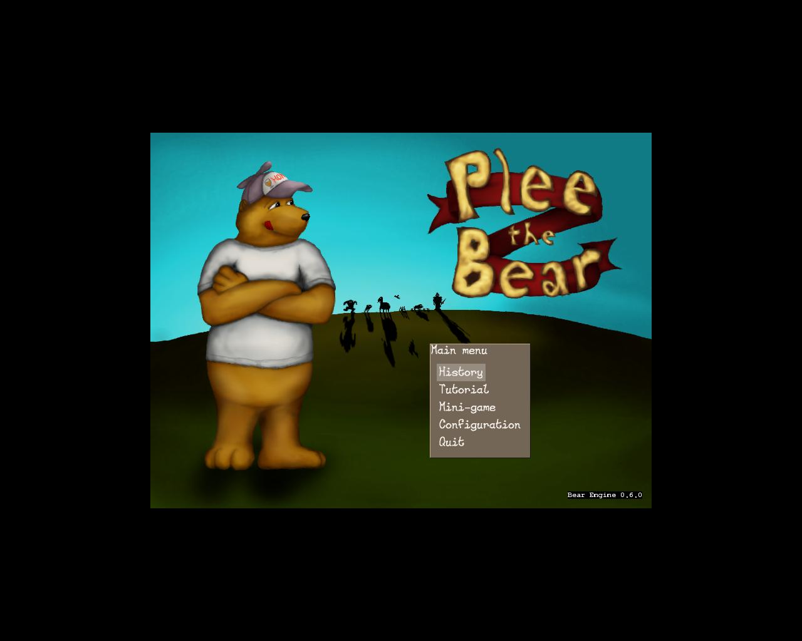 | [SHA256](./plee-the-bear/SHA256SUMS) | v1.5.2-amd64-nevm |
| [plm](./plm) | amd64  | ubuntu-noble | 2.9.2-1-20250327 | 失败 | [SHA256](./plm/SHA256SUMS) | v1.5.2-amd64-nevm |
| [plopfolio.app](./plopfolio.app) | amd64  | ubuntu-noble | 0.1.0-8build3-20250327 | 失败 | [SHA256](./plopfolio.app/SHA256SUMS) | v1.5.2-amd64-nevm |
| [plover](./plover) | amd64  | ubuntu-noble | 4.0.0~rc2-0.2 |  | [SHA256](./plover/SHA256SUMS) | v1.5.2-amd64-nevm |
| [pluma](./pluma) | amd64  | ubuntu-noble | 1.26.1-2build3-20250327 | 失败 | N/A | v1.5.2-amd64-nevm |
| [plume-creator](./plume-creator) | amd64  | ubuntu-noble | 0.66+dfsg1-3.2build3 |  | [SHA256](./plume-creator/SHA256SUMS) | v1.5.2-amd64-nevm |
| [pnmixer](./pnmixer) | amd64  | ubuntu-noble | 0.7.2-1build3-20250327 | 失败 | [SHA256](./pnmixer/SHA256SUMS) | v1.5.2-amd64-nevm |
| [poe.app](./poe.app) | amd64  | ubuntu-noble | 0.5.1-6build3-20250327 | 失败 | [SHA256](./poe.app/SHA256SUMS) | v1.5.2-amd64-nevm |
| [poedit](./poedit) | amd64  | ubuntu-noble | 3.4.2-1build3 |  | [SHA256](./poedit/SHA256SUMS) | v1.5.2-amd64-nevm |
| [poezio](./poezio) | amd64  | ubuntu-noble | 0.14-3build1-20250327 | 失败 | [SHA256](./poezio/SHA256SUMS) | v1.5.2-amd64-nevm |
| [pokemmo-installer](./pokemmo-installer) | amd64  | ubuntu-noble | 1.4.8-1 |  | [SHA256](./pokemmo-installer/SHA256SUMS) | v1.5.2-amd64-nevm |
| [pokerth](./pokerth) | amd64  | ubuntu-noble | 1.1.2-3build4 |  | [SHA256](./pokerth/SHA256SUMS) | v1.5.2-amd64-nevm |
| [polari](./polari) | amd64  | ubuntu-noble | 45.0-3build3-20250327 | 失败 | N/A | v1.5.2-amd64-nevm |
| [policycoreutils-gui](./policycoreutils-gui) | amd64  | ubuntu-noble | 3.5-1-20250327 | 失败 | N/A | v1.5.2-amd64-nevm |
| [polkit-kde-agent-1](./polkit-kde-agent-1) | amd64  | ubuntu-noble | 5.27.11-0ubuntu3-20250327 | 失败 | [SHA256](./polkit-kde-agent-1/SHA256SUMS) | v1.5.2-amd64-nevm |
| [polyphone](./polyphone) | amd64  | ubuntu-noble | 2.2.0.20210109+dfsg1-3build3 |  | [SHA256](./polyphone/SHA256SUMS) | v1.5.2-amd64-nevm |
| [pong2](./pong2) | amd64  | ubuntu-noble | 0.1.3-3 |  | [SHA256](./pong2/SHA256SUMS) | v1.5.2-amd64-nevm |
| [ponyprog](./ponyprog) | amd64  | ubuntu-noble | 3.1.3+ds-1build2 |  | [SHA256](./ponyprog/SHA256SUMS) | v1.5.2-amd64-nevm |
| [portfolio-filemanager](./portfolio-filemanager) | amd64  | ubuntu-noble | 1.0.1-1-20250327 | 失败 | N/A | v1.5.2-amd64-nevm |
| [posterazor](./posterazor) | amd64  | ubuntu-noble | 1.5.1-10build2 |  | [SHA256](./posterazor/SHA256SUMS) | v1.5.2-amd64-nevm |
| [powder](./powder) | amd64  | ubuntu-noble | 118+dfsg1-3 |  | [SHA256](./powder/SHA256SUMS) | v1.5.2-amd64-nevm |
| [powerdevil](./powerdevil) | amd64  | ubuntu-noble | 5.27.11-0ubuntu2-20250327 | 失败 | [SHA256](./powerdevil/SHA256SUMS) | v1.5.2-amd64-nevm |
| [powermanga](./powermanga) | amd64  | ubuntu-noble | 0.93.1-6build2 |  | [SHA256](./powermanga/SHA256SUMS) | v1.5.2-amd64-nevm |
| [powersupply-gtk](./powersupply-gtk) | amd64  | ubuntu-noble | 0.9.0-1-20250327 | 失败 | N/A | v1.5.2-amd64-nevm |
| [pq](./pq) | amd64  | ubuntu-noble | 6.2-0ubuntu4 | 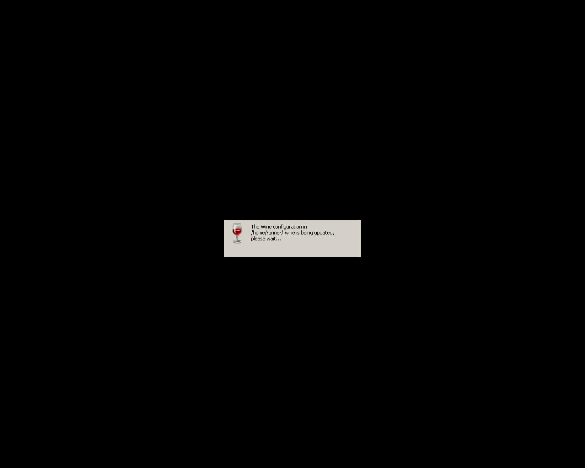 | [SHA256](./pq/SHA256SUMS) | v1.5.2-amd64-nevm |
| [pqiv](./pqiv) | amd64  | ubuntu-noble | 2.12-1build6-20250327 | 失败 | [SHA256](./pqiv/SHA256SUMS) | v1.5.2-amd64-nevm |
| [praat](./praat) | amd64  | ubuntu-noble | 6.4.06+dfsg-1build2 |  | [SHA256](./praat/SHA256SUMS) | v1.5.2-amd64-nevm |
| [pragha](./pragha) | amd64  | ubuntu-noble | 1.3.4-2build4 |  | [SHA256](./pragha/SHA256SUMS) | v1.5.2-amd64-nevm |
| [prerex](./prerex) | amd64  | deepin-v23 | 6.8.0-1-20250327 | 失败 | [SHA256](./prerex/SHA256SUMS) | v1.5.2-amd64-nevm |
| [preview.app](./preview.app) | amd64  | ubuntu-noble | 0.8.5-11build5-20250327 | 失败 | [SHA256](./preview.app/SHA256SUMS) | v1.5.2-amd64-nevm |
| [price.app](./price.app) | amd64  | ubuntu-noble | 1.3.0-5build2-20250327 | 失败 | [SHA256](./price.app/SHA256SUMS) | v1.5.2-amd64-nevm |
| [primrose](./primrose) | amd64  | ubuntu-noble | 6+dfsg1-4build1 |  | [SHA256](./primrose/SHA256SUMS) | v1.5.2-amd64-nevm |
| [print-manager](./print-manager) | amd64  | ubuntu-noble | 23.08.5-0ubuntu4-20250327 | 失败 | [SHA256](./print-manager/SHA256SUMS) | v1.5.2-amd64-nevm |
| [printer-driver-foo2zjs-common](./printer-driver-foo2zjs-common) | amd64  | ubuntu-noble | 20200505dfsg0-2ubuntu6-20250327 | 失败 | [SHA256](./printer-driver-foo2zjs-common/SHA256SUMS) | v1.5.2-amd64-nevm |
| [printer-driver-grandprinter-mfp-notcm](./printer-driver-grandprinter-mfp-notcm) | amd64  | deepin-v23 | 1.0.0-22312 |  | [SHA256](./printer-driver-grandprinter-mfp-notcm/SHA256SUMS) | v1.5.2-amd64-nevm |
| [printer-driver-lanxum-ga-series](./printer-driver-lanxum-ga-series) | amd64  | deepin-v23 | 1.0.0-24157 |  | [SHA256](./printer-driver-lanxum-ga-series/SHA256SUMS) | v1.5.2-amd64-nevm |
| [privacybrowser](./privacybrowser) | amd64  | ubuntu-noble | 0.5-1build2-20250327 | 失败 | [SHA256](./privacybrowser/SHA256SUMS) | v1.5.2-amd64-nevm |
| [process-viewer](./process-viewer) | amd64  | ubuntu-noble | 0.5.9-1 |  | [SHA256](./process-viewer/SHA256SUMS) | v1.5.2-amd64-nevm |
| [progvis](./progvis) | amd64  | ubuntu-noble | 0.6.20-1build3 |  | [SHA256](./progvis/SHA256SUMS) | v1.5.2-amd64-nevm |
| [project-x](./project-x) | amd64  | ubuntu-noble | 0.90.4dfsg-0ubuntu6 |  | [SHA256](./project-x/SHA256SUMS) | v1.5.2-amd64-nevm |
| [projectcenter.app](./projectcenter.app) | amd64  | ubuntu-noble | 0.7.0-1build1-20250327 | 失败 | [SHA256](./projectcenter.app/SHA256SUMS) | v1.5.2-amd64-nevm |
| [projecteur](./projecteur) | amd64  | ubuntu-noble | 0.10-2build2-20250327 | 失败 | [SHA256](./projecteur/SHA256SUMS) | v1.5.2-amd64-nevm |
| [projectl](./projectl) | amd64  | ubuntu-noble | 1.001.dfsg2-1 |  | [SHA256](./projectl/SHA256SUMS) | v1.5.2-amd64-nevm |
| [proofgeneral](./proofgeneral) | amd64  | ubuntu-noble | 4.5-1 |  | [SHA256](./proofgeneral/SHA256SUMS) | v1.5.2-amd64-nevm |
| [protontricks](./protontricks) | amd64  | ubuntu-noble | 1.10.5-1 |  | [SHA256](./protontricks/SHA256SUMS) | v1.5.2-amd64-nevm |
| [prusa-slicer](./prusa-slicer) | amd64  | ubuntu-noble | 2.7.2+dfsg-1build2 |   | [SHA256](./prusa-slicer/SHA256SUMS) | v1.5.2-amd64-nevm |
| [psensor](./psensor) | amd64  | ubuntu-noble | 1.1.5-1.4ubuntu2 |  | [SHA256](./psensor/SHA256SUMS) | v1.5.2-amd64-nevm |
| [psi](./psi) | amd64  | ubuntu-noble | 1.5+dfsg1-1.1build3 |  | [SHA256](./psi/SHA256SUMS) | v1.5.2-amd64-nevm |
| [psi-plus](./psi-plus) | amd64  | ubuntu-noble | 1.4.554-5build5 |  | [SHA256](./psi-plus/SHA256SUMS) | v1.5.2-amd64-nevm |
| [psi-plus-webkit](./psi-plus-webkit) | amd64  | ubuntu-noble | 1.4.554-5build5 |  | [SHA256](./psi-plus-webkit/SHA256SUMS) | v1.5.2-amd64-nevm |
| [psk31lx](./psk31lx) | amd64  | ubuntu-noble | 2.2-1build1-20250327 | 失败 | [SHA256](./psk31lx/SHA256SUMS) | v1.5.2-amd64-nevm |
| [pspp](./pspp) | amd64  | ubuntu-noble | 2.0.0-3build2 |  | [SHA256](./pspp/SHA256SUMS) | v1.5.2-amd64-nevm |
| [psychopy](./psychopy) | amd64  | ubuntu-noble | 2023.2.4+dfsg-3-20250327 | 失败 | [SHA256](./psychopy/SHA256SUMS) | v1.5.2-amd64-nevm |
| [pt2-clone](./pt2-clone) | amd64  | ubuntu-noble | 1.66.1+ds-1build2-20250327 | 失败 | [SHA256](./pt2-clone/SHA256SUMS) | v1.5.2-amd64-nevm |
| [ptask](./ptask) | amd64  | ubuntu-noble | 1.0.0-1.1build3 |  | [SHA256](./ptask/SHA256SUMS) | v1.5.2-amd64-nevm |
| [pterm](./pterm) | amd64  | deepin-v23 | 0.81-1 |  | [SHA256](./pterm/SHA256SUMS) | v1.5.2-amd64-nevm |
| [puddletag](./puddletag) | amd64  | ubuntu-noble | 2.2.0-3 |  | [SHA256](./puddletag/SHA256SUMS) | v1.5.2-amd64-nevm |
| [pulseeffects](./pulseeffects) | amd64  | ubuntu-noble | 4.8.7-2build3-20250327 | 失败 | N/A | v1.5.2-amd64-nevm |
| [pulseview](./pulseview) | amd64  | ubuntu-noble | 0.4.2-3build4 |  | [SHA256](./pulseview/SHA256SUMS) | v1.5.2-amd64-nevm |
| [pumpa](./pumpa) | amd64  | ubuntu-noble | 0.9.3-1build4 |  | [SHA256](./pumpa/SHA256SUMS) | v1.5.2-amd64-nevm |
| [puredata-gui](./puredata-gui) | amd64  | ubuntu-noble | 0.54.1+ds-4build3-20250327 | 失败 | [SHA256](./puredata-gui/SHA256SUMS) | v1.5.2-amd64-nevm |
| [pushover](./pushover) | amd64  | ubuntu-noble | 1.1-3build3-20250327 | 失败 | [SHA256](./pushover/SHA256SUMS) | v1.5.2-amd64-nevm |
| [putty](./putty) | amd64  | deepin-v23 | 0.81-1 |  | [SHA256](./putty/SHA256SUMS) | v1.5.2-amd64-nevm |
| [puzzle-jigsaw](./puzzle-jigsaw) | amd64  | ubuntu-noble | 1.0.2+git20201007.527c529+dfsg-4build2 |  | [SHA256](./puzzle-jigsaw/SHA256SUMS) | v1.5.2-amd64-nevm |
| [pyacidobasic](./pyacidobasic) | amd64  | ubuntu-noble | 3.0-1-20250327 | 失败 | [SHA256](./pyacidobasic/SHA256SUMS) | v1.5.2-amd64-nevm |
| [pybik](./pybik) | amd64  | ubuntu-noble | 3.0-6build2 |  | [SHA256](./pybik/SHA256SUMS) | v1.5.2-amd64-nevm |
| [pychess](./pychess) | amd64  | ubuntu-noble | 1.0.4-0.1-20250327 | 失败 | N/A | v1.5.2-amd64-nevm |
| [pycirkuit](./pycirkuit) | amd64  | ubuntu-noble | 0.5.1-3-20250327 | 失败 | [SHA256](./pycirkuit/SHA256SUMS) | v1.5.2-amd64-nevm |
| [pycode-browser](./pycode-browser) | amd64  | ubuntu-noble | 1.03-2-20250327 | 失败 | N/A | v1.5.2-amd64-nevm |
| [pyfai](./pyfai) | amd64  | ubuntu-noble | 2024.02-1build2 |    | [SHA256](./pyfai/SHA256SUMS) | v1.5.2-amd64-nevm |
| [pyhoca-gui](./pyhoca-gui) | amd64  | ubuntu-noble | 0.6.1.1-1-20250327 | 失败 | N/A | v1.5.2-amd64-nevm |
| [pymca](./pymca) | amd64  | ubuntu-noble | 5.9.2+dfsg-2build1 |       | [SHA256](./pymca/SHA256SUMS) | v1.5.2-amd64-nevm |
| [pymol](./pymol) | amd64  | ubuntu-noble | 2.5.0+dfsg-1build6-20250327 | 失败 | [SHA256](./pymol/SHA256SUMS) | v1.5.2-amd64-nevm |
| [pympress](./pympress) | amd64  | ubuntu-noble | 1.8.4-1ubuntu1-20250327 | 失败 | N/A | v1.5.2-amd64-nevm |
| [pyqso](./pyqso) | amd64  | ubuntu-noble | 1.1.0-5-20250327 | 失败 | N/A | v1.5.2-amd64-nevm |
| [pyracerz](./pyracerz) | amd64  | ubuntu-noble | 0.2+dfsg-2 |  | [SHA256](./pyracerz/SHA256SUMS) | v1.5.2-amd64-nevm |
| [pysatellites](./pysatellites) | amd64  | ubuntu-noble | 2.7-2-20250327 | 失败 | N/A | v1.5.2-amd64-nevm |
| [pyscanfcs](./pyscanfcs) | amd64  | ubuntu-noble | 0.3.6+ds-4build2 |  | [SHA256](./pyscanfcs/SHA256SUMS) | v1.5.2-amd64-nevm |
| [pysiogame](./pysiogame) | amd64  | ubuntu-noble | 4.20.01-1 |  | [SHA256](./pysiogame/SHA256SUMS) | v1.5.2-amd64-nevm |
| [pysolfc](./pysolfc) | amd64  | ubuntu-noble | 2.6.4-3-20250327 | 失败 | [SHA256](./pysolfc/SHA256SUMS) | v1.5.2-amd64-nevm |
| [pyspread](./pyspread) | amd64  | ubuntu-noble | 2.2.3-1 |  | [SHA256](./pyspread/SHA256SUMS) | v1.5.2-amd64-nevm |
| [python2.7](./python2.7) | amd64  | deepin-v23 | 2.7.18.1-1+deepin-20250327 | 失败 | [SHA256](./python2.7/SHA256SUMS) | v1.5.2-amd64-nevm |
| [python3-dogtail](./python3-dogtail) | amd64  | ubuntu-noble | 0.9.11-12-20250327 | 失败 | N/A | v1.5.2-amd64-nevm |
| [python3-guidata](./python3-guidata) | amd64  | ubuntu-noble | 3.0.4+dfsg1-1 |  | [SHA256](./python3-guidata/SHA256SUMS) | v1.5.2-amd64-nevm |
| [python3-guiqwt](./python3-guiqwt) | amd64  | ubuntu-noble | 4.4.4-1build1 |  | [SHA256](./python3-guiqwt/SHA256SUMS) | v1.5.2-amd64-nevm |
| [python3-mecavideo](./python3-mecavideo) | amd64  | ubuntu-noble | 8.0~rc10-2 |  | [SHA256](./python3-mecavideo/SHA256SUMS) | v1.5.2-amd64-nevm |
| [python3-napari](./python3-napari) | amd64  | ubuntu-noble | 0.5.0~a1-5-20250327 | 失败 | [SHA256](./python3-napari/SHA256SUMS) | v1.5.2-amd64-nevm |
| [python3-navarp](./python3-navarp) | amd64  | ubuntu-noble | 1.6.0-2 |  | [SHA256](./python3-navarp/SHA256SUMS) | v1.5.2-amd64-nevm |
| [python3-opensnitch-ui](./python3-opensnitch-ui) | amd64  | ubuntu-noble | 1.5.8.1-1ubuntu0.24.04.2-20250327 | 失败 | [SHA256](./python3-opensnitch-ui/SHA256SUMS) | v1.5.2-amd64-nevm |
| [python3-orange-spectroscopy](./python3-orange-spectroscopy) | amd64  | ubuntu-noble | 0.6.10-4-20250327 | 失败 | [SHA256](./python3-orange-spectroscopy/SHA256SUMS) | v1.5.2-amd64-nevm |
| [python3-orange3](./python3-orange3) | amd64  | ubuntu-noble | 3.35.0+ds1-5build2-20250327 | 失败 | [SHA256](./python3-orange3/SHA256SUMS) | v1.5.2-amd64-nevm |
| [python3-pyo](./python3-pyo) | amd64  | ubuntu-noble | 1.0.5-5build2-20250327 | 失败 | [SHA256](./python3-pyo/SHA256SUMS) | v1.5.2-amd64-nevm |
| [python3-refnx](./python3-refnx) | amd64  | ubuntu-noble | 0.1.38-1build2-20250327 | 失败 | [SHA256](./python3-refnx/SHA256SUMS) | v1.5.2-amd64-nevm |
| [python3-ufo-tofu](./python3-ufo-tofu) | amd64  | ubuntu-noble | 0.12.0-3-20250327 | 失败 | N/A | v1.5.2-amd64-nevm |
| [python3-whiteboard](./python3-whiteboard) | amd64  | ubuntu-noble | 1.0+git20211001-2-20250327 | 失败 | [SHA256](./python3-whiteboard/SHA256SUMS) | v1.5.2-amd64-nevm |
| [python3-windowmocker](./python3-windowmocker) | amd64  | ubuntu-noble | 1.4+14.04.20140220.1-0ubuntu3-20250327 | 失败 | [SHA256](./python3-windowmocker/SHA256SUMS) | v1.5.2-amd64-nevm |
| [python3-xrt](./python3-xrt) | amd64  | ubuntu-noble | 1.6.0+ds1-1-20250327 | 失败 | [SHA256](./python3-xrt/SHA256SUMS) | v1.5.2-amd64-nevm |
| [python3.11](./python3.11) | amd64  | deepin-v23 | 3.11.8-1-20250327 | 失败 | [SHA256](./python3.11/SHA256SUMS) | v1.5.2-amd64-nevm |
| [python3.12](./python3.12) | amd64  | deepin-v23 | 3.12.4-0deepin1-20250327 | 失败 | [SHA256](./python3.12/SHA256SUMS) | v1.5.2-amd64-nevm |
| [pytrainer](./pytrainer) | amd64  | ubuntu-noble | 2.2.1-4-20250327 | 失败 | N/A | v1.5.2-amd64-nevm |
| [pyzo](./pyzo) | amd64  | ubuntu-noble | 4.12.3-1 |  | [SHA256](./pyzo/SHA256SUMS) | v1.5.2-amd64-nevm |
| [q4wine](./q4wine) | amd64  | ubuntu-noble | 1.3.13-1build2 |  | [SHA256](./q4wine/SHA256SUMS) | v1.5.2-amd64-nevm |
| [qabc](./qabc) | amd64  | ubuntu-noble | 1.10-1build2 |  | [SHA256](./qabc/SHA256SUMS) | v1.5.2-amd64-nevm |
| [qabcs](./qabcs) | amd64  | ubuntu-noble | 1.0.2-6build2 |  | [SHA256](./qabcs/SHA256SUMS) | v1.5.2-amd64-nevm |
| [qalculate-gtk](./qalculate-gtk) | amd64  | ubuntu-noble | 4.9.0-1build3 |  | [SHA256](./qalculate-gtk/SHA256SUMS) | v1.5.2-amd64-nevm |
| [qapt-deb-installer](./qapt-deb-installer) | amd64  | deepin-v23 | 3.0.5.2-deepin3-20250327 | 失败 | [SHA256](./qapt-deb-installer/SHA256SUMS) | v1.5.2-amd64-nevm |
| [qasconfig](./qasconfig) | amd64  | ubuntu-noble | 1.4.0-1build3 |  | [SHA256](./qasconfig/SHA256SUMS) | v1.5.2-amd64-nevm |
| [qashctl](./qashctl) | amd64  | ubuntu-noble | 1.4.0-1build3 |  | [SHA256](./qashctl/SHA256SUMS) | v1.5.2-amd64-nevm |
| [qasmixer](./qasmixer) | amd64  | ubuntu-noble | 1.4.0-1build3 |  | [SHA256](./qasmixer/SHA256SUMS) | v1.5.2-amd64-nevm |
| [qbittorrent](./qbittorrent) | amd64  | ubuntu-noble | 4.6.3-1build2 |  | [SHA256](./qbittorrent/SHA256SUMS) | v1.5.2-amd64-nevm |
| [qbrew](./qbrew) | amd64  | ubuntu-noble | 0.4.1-8build3 |  | [SHA256](./qbrew/SHA256SUMS) | v1.5.2-amd64-nevm |
| [qcalcfilehash](./qcalcfilehash) | amd64  | ubuntu-noble | 1.1.1-1build3 |  | [SHA256](./qcalcfilehash/SHA256SUMS) | v1.5.2-amd64-nevm |
| [qcomicbook](./qcomicbook) | amd64  | ubuntu-noble | 0.9.1-3build3 |  | [SHA256](./qcomicbook/SHA256SUMS) | v1.5.2-amd64-nevm |
| [qdacco](./qdacco) | amd64  | ubuntu-noble | 1.1.2-1build2 |  | [SHA256](./qdacco/SHA256SUMS) | v1.5.2-amd64-nevm |
| [qdirstat](./qdirstat) | amd64  | ubuntu-noble | 1.9-1build2 |  | [SHA256](./qdirstat/SHA256SUMS) | v1.5.2-amd64-nevm |
| [qdmr](./qdmr) | amd64  | ubuntu-noble | 0.11.2-1build3 |  | [SHA256](./qdmr/SHA256SUMS) | v1.5.2-amd64-nevm |
| [qelectrotech](./qelectrotech) | amd64  | ubuntu-noble | 0.9-2build2 |  | [SHA256](./qelectrotech/SHA256SUMS) | v1.5.2-amd64-nevm |
| [qemu-system-data](./qemu-system-data) | amd64  | ubuntu-noble | 8.2.2+ds-0ubuntu1.6-20250327 | 失败 | [SHA256](./qemu-system-data/SHA256SUMS) | v1.5.2-amd64-nevm |
| [qfitsview](./qfitsview) | amd64  | ubuntu-noble | 4.1+dfsg-2build3 |  | [SHA256](./qfitsview/SHA256SUMS) | v1.5.2-amd64-nevm |
| [qflipper](./qflipper) | amd64  | ubuntu-noble | 1.3.3-1build2 |  | [SHA256](./qflipper/SHA256SUMS) | v1.5.2-amd64-nevm |
| [qgis](./qgis) | amd64  | ubuntu-noble | 3.34.4+dfsg-4build2 |  | [SHA256](./qgis/SHA256SUMS) | v1.5.2-amd64-nevm |
| [qgit](./qgit) | amd64  | ubuntu-noble | 2.10-2build2 |  | [SHA256](./qgit/SHA256SUMS) | v1.5.2-amd64-nevm |
| [qgo](./qgo) | amd64  | ubuntu-noble | 2.1~git-20180413-1build3 |  | [SHA256](./qgo/SHA256SUMS) | v1.5.2-amd64-nevm |
| [qhimdtransfer](./qhimdtransfer) | amd64  | ubuntu-noble | 0.9.16-2build4 |  | [SHA256](./qhimdtransfer/SHA256SUMS) | v1.5.2-amd64-nevm |
| [qimgv](./qimgv) | amd64  | ubuntu-noble | 1.0.2+git20240112-1build2 |  | [SHA256](./qimgv/SHA256SUMS) | v1.5.2-amd64-nevm |
| [qiv](./qiv) | amd64  | ubuntu-noble | 2.3.3-1.1build2-20250327 | 失败 | [SHA256](./qiv/SHA256SUMS) | v1.5.2-amd64-nevm |
| [qjackctl](./qjackctl) | amd64  | ubuntu-noble | 0.9.13-1build3 |  | [SHA256](./qjackctl/SHA256SUMS) | v1.5.2-amd64-nevm |
| [qjackrcd](./qjackrcd) | amd64  | ubuntu-noble | 1.2.0-2build3-20250327 | 失败 | [SHA256](./qjackrcd/SHA256SUMS) | v1.5.2-amd64-nevm |
| [qjoypad](./qjoypad) | amd64  | ubuntu-noble | 4.3.1-3build2-20250327 | 失败 | [SHA256](./qjoypad/SHA256SUMS) | v1.5.2-amd64-nevm |
| [qlcplus](./qlcplus) | amd64  | ubuntu-noble | 4.12.7-1build4 |   | [SHA256](./qlcplus/SHA256SUMS) | v1.5.2-amd64-nevm |
| [qlipper](./qlipper) | amd64  | deepin-v23 | 5.1.2-deepin1-20250327 | 失败 | [SHA256](./qlipper/SHA256SUMS) | v1.5.2-amd64-nevm |
| [qmapshack](./qmapshack) | amd64  | ubuntu-noble | 1.17.1-1build2 |   | [SHA256](./qmapshack/SHA256SUMS) | v1.5.2-amd64-nevm |
| [qmidiarp](./qmidiarp) | amd64  | ubuntu-noble | 0.7.0+ds-1build4 |  | [SHA256](./qmidiarp/SHA256SUMS) | v1.5.2-amd64-nevm |
| [qmidictl](./qmidictl) | amd64  | ubuntu-noble | 0.9.10-1build3 |  | [SHA256](./qmidictl/SHA256SUMS) | v1.5.2-amd64-nevm |
| [qmidinet](./qmidinet) | amd64  | ubuntu-noble | 0.9.12-1build3-20250327 | 失败 | [SHA256](./qmidinet/SHA256SUMS) | v1.5.2-amd64-nevm |
| [qmidiroute](./qmidiroute) | amd64  | ubuntu-noble | 0.4.0-2build4-20250327 | 失败 | [SHA256](./qmidiroute/SHA256SUMS) | v1.5.2-amd64-nevm |
| [qml-module-qtmir](./qml-module-qtmir) | amd64  | ubuntu-noble | 0.8.0~git20240131.2f99df3-1build5-20250327 | 失败 | [SHA256](./qml-module-qtmir/SHA256SUMS) | v1.5.2-amd64-nevm |
| [qmlkonsole](./qmlkonsole) | amd64  | ubuntu-noble | 23.08.5-0ubuntu3-20250327 | 失败 | [SHA256](./qmlkonsole/SHA256SUMS) | v1.5.2-amd64-nevm |
| [qmmp](./qmmp) | amd64  | ubuntu-noble | 1.6.2-1build6 |  | [SHA256](./qmmp/SHA256SUMS) | v1.5.2-amd64-nevm |
| [qnapi](./qnapi) | amd64  | ubuntu-noble | 0.2.3-2build2 |  | [SHA256](./qnapi/SHA256SUMS) | v1.5.2-amd64-nevm |
| [qnetstatview](./qnetstatview) | amd64  | ubuntu-noble | 1.5.8-2build2 |  | [SHA256](./qnetstatview/SHA256SUMS) | v1.5.2-amd64-nevm |
| [qosmic](./qosmic) | amd64  | ubuntu-noble | 1.6.0+v20240202-1build2 |  | [SHA256](./qosmic/SHA256SUMS) | v1.5.2-amd64-nevm |
| [qpdfview](./qpdfview) | amd64  | ubuntu-noble | 0.5.0+ds-4build4 |  | [SHA256](./qpdfview/SHA256SUMS) | v1.5.2-amd64-nevm |
| [qprogram-starter](./qprogram-starter) | amd64  | ubuntu-noble | 1.7.4-1build3 |  | [SHA256](./qprogram-starter/SHA256SUMS) | v1.5.2-amd64-nevm |
| [qprompt](./qprompt) | amd64  | ubuntu-noble | 1.1.6-0ubuntu5-20250327 | 失败 | [SHA256](./qprompt/SHA256SUMS) | v1.5.2-amd64-nevm |
| [qps](./qps) | amd64  | ubuntu-noble | 2.8.0-0ubuntu4-20250327 | 失败 | N/A | v1.5.2-amd64-nevm |
| [qpwgraph](./qpwgraph) | amd64  | ubuntu-noble | 0.6.1-1build3 |  | [SHA256](./qpwgraph/SHA256SUMS) | v1.5.2-amd64-nevm |
| [qpxtool](./qpxtool) | amd64  | ubuntu-noble | 0.8.1-2.1build2 |  | [SHA256](./qpxtool/SHA256SUMS) | v1.5.2-amd64-nevm |
| [qrazercfg](./qrazercfg) | amd64  | ubuntu-noble | 0.42+ds-4-20250327 | 失败 | [SHA256](./qrazercfg/SHA256SUMS) | v1.5.2-amd64-nevm |
| [qreator](./qreator) | amd64  | ubuntu-noble | 16.06.1-7.1-20250327 | 失败 | N/A | v1.5.2-amd64-nevm |
| [qrq](./qrq) | amd64  | ubuntu-noble | 0.3.5-2-20250327 | 失败 | [SHA256](./qrq/SHA256SUMS) | v1.5.2-amd64-nevm |
| [qsampler](./qsampler) | amd64  | ubuntu-noble | 0.9.12-1build2 |  | [SHA256](./qsampler/SHA256SUMS) | v1.5.2-amd64-nevm |
| [qshutdown](./qshutdown) | amd64  | ubuntu-noble | 1.7.4-1build3 |  | [SHA256](./qshutdown/SHA256SUMS) | v1.5.2-amd64-nevm |
| [qspeakers](./qspeakers) | amd64  | ubuntu-noble | 1.6.9-1build2 |  | [SHA256](./qspeakers/SHA256SUMS) | v1.5.2-amd64-nevm |
| [qsstv](./qsstv) | amd64  | ubuntu-noble | 9.5.8-3build3 |  | [SHA256](./qsstv/SHA256SUMS) | v1.5.2-amd64-nevm |
| [qstardict](./qstardict) | amd64  | ubuntu-noble | 1.4.1-1build4 |  | [SHA256](./qstardict/SHA256SUMS) | v1.5.2-amd64-nevm |
| [qstopmotion](./qstopmotion) | amd64  | ubuntu-noble | 2.5.2-1build2 |  | [SHA256](./qstopmotion/SHA256SUMS) | v1.5.2-amd64-nevm |
| [qsynth](./qsynth) | amd64  | ubuntu-noble | 0.9.13-1build3 |  | [SHA256](./qsynth/SHA256SUMS) | v1.5.2-amd64-nevm |
| [qt5-assistant](./qt5-assistant) | amd64  | ubuntu-noble | 5.15.13-1 |  | [SHA256](./qt5-assistant/SHA256SUMS) | v1.5.2-amd64-nevm |
| [qt5-style-kvantum](./qt5-style-kvantum) | amd64  | ubuntu-noble | 1.0.10-1build3 |  | [SHA256](./qt5-style-kvantum/SHA256SUMS) | v1.5.2-amd64-nevm |
| [qt5ct](./qt5ct) | amd64  | ubuntu-noble | 1.5-1build11 |  | [SHA256](./qt5ct/SHA256SUMS) | v1.5.2-amd64-nevm |
| [qt6ct](./qt6ct) | amd64  | ubuntu-noble | 0.9-2build2 |  | [SHA256](./qt6ct/SHA256SUMS) | v1.5.2-amd64-nevm |
| [qtads](./qtads) | amd64  | ubuntu-noble | 3.4.0+dfsg-1build3-20250327 | 失败 | [SHA256](./qtads/SHA256SUMS) | v1.5.2-amd64-nevm |
| [qtcreator](./qtcreator) | amd64  | deepin-v23 | 15.0.0~beta2-2 |  | [SHA256](./qtcreator/SHA256SUMS) | v1.5.2-amd64-nevm |
| [qtel](./qtel) | amd64  | ubuntu-noble | 19.09.2-1.1build3 |  | [SHA256](./qtel/SHA256SUMS) | v1.5.2-amd64-nevm |
| [qterm](./qterm) | amd64  | ubuntu-noble | 0.7.4-2build4 |  | [SHA256](./qterm/SHA256SUMS) | v1.5.2-amd64-nevm |
| [qterminal](./qterminal) | amd64  | ubuntu-noble | 1.4.0-0ubuntu5 |   | [SHA256](./qterminal/SHA256SUMS) | v1.5.2-amd64-nevm |
| [qtgain](./qtgain) | amd64  | ubuntu-noble | 1.0.0-0ubuntu3 |  | [SHA256](./qtgain/SHA256SUMS) | v1.5.2-amd64-nevm |
| [qthid-fcd-controller](./qthid-fcd-controller) | amd64  | ubuntu-noble | 4.1-6build2 |   | [SHA256](./qthid-fcd-controller/SHA256SUMS) | v1.5.2-amd64-nevm |
| [qtikz](./qtikz) | amd64  | ubuntu-noble | 0.13.2+ds1-1build3 |  | [SHA256](./qtikz/SHA256SUMS) | v1.5.2-amd64-nevm |
| [qtmir-tests](./qtmir-tests) | amd64  | ubuntu-noble | 0.8.0~git20240131.2f99df3-1build5 |  | [SHA256](./qtmir-tests/SHA256SUMS) | v1.5.2-amd64-nevm |
| [qtop](./qtop) | amd64  | ubuntu-noble | 2.3.4-3build2 |  | [SHA256](./qtop/SHA256SUMS) | v1.5.2-amd64-nevm |
| [qtox](./qtox) | amd64  | ubuntu-noble | 1.17.6-0.1build5 |  | [SHA256](./qtox/SHA256SUMS) | v1.5.2-amd64-nevm |
| [qtpass](./qtpass) | amd64  | ubuntu-noble | 1.4.0-1build3 |  | [SHA256](./qtpass/SHA256SUMS) | v1.5.2-amd64-nevm |
| [qtqr](./qtqr) | amd64  | ubuntu-noble | 2.1~bzr52-1 |  | [SHA256](./qtqr/SHA256SUMS) | v1.5.2-amd64-nevm |
| [qtractor](./qtractor) | amd64  | ubuntu-noble | 0.9.39-1build3 |  | [SHA256](./qtractor/SHA256SUMS) | v1.5.2-amd64-nevm |
| [qtscrob](./qtscrob) | amd64  | ubuntu-noble | 0.11+git-5build3 |  | [SHA256](./qtscrob/SHA256SUMS) | v1.5.2-amd64-nevm |
| [qttinysa](./qttinysa) | amd64  | ubuntu-noble | 0.10.1-1 |  | [SHA256](./qttinysa/SHA256SUMS) | v1.5.2-amd64-nevm |
| [qttools5-dev-tools](./qttools5-dev-tools) | amd64  | ubuntu-noble | 5.15.13-1 |   | [SHA256](./qttools5-dev-tools/SHA256SUMS) | v1.5.2-amd64-nevm |
| [quadrapassel](./quadrapassel) | amd64  | ubuntu-noble | 40.2-1build2 |  | [SHA256](./quadrapassel/SHA256SUMS) | v1.5.2-amd64-nevm |
| [quake](./quake) | amd64  | ubuntu-noble | 77ubuntu2-20250327 | 失败 | N/A | v1.5.2-amd64-nevm |
| [quake2](./quake2) | amd64  | ubuntu-noble | 77ubuntu2-20250327 | 失败 | N/A | v1.5.2-amd64-nevm |
| [quake3](./quake3) | amd64  | ubuntu-noble | 77ubuntu2-20250327 | 失败 | N/A | v1.5.2-amd64-nevm |
| [quassel](./quassel) | amd64  | ubuntu-noble | 0.14.0-2ubuntu3 |  | [SHA256](./quassel/SHA256SUMS) | v1.5.2-amd64-nevm |
| [quassel-client](./quassel-client) | amd64  | ubuntu-noble | 0.14.0-2ubuntu3 |  | [SHA256](./quassel-client/SHA256SUMS) | v1.5.2-amd64-nevm |
| [quaternion](./quaternion) | amd64  | ubuntu-noble | 0.0.95.1-1ubuntu3 |  | [SHA256](./quaternion/SHA256SUMS) | v1.5.2-amd64-nevm |
| [quickcal](./quickcal) | amd64  | ubuntu-noble | 2.4-1-20250327 | 失败 | N/A | v1.5.2-amd64-nevm |
| [quickroute-gps](./quickroute-gps) | amd64  | ubuntu-noble | 2.4-15-20250327 | 失败 | [SHA256](./quickroute-gps/SHA256SUMS) | v1.5.2-amd64-nevm |
| [quisk](./quisk) | amd64  | ubuntu-noble | 4.2.30-1 |  | [SHA256](./quisk/SHA256SUMS) | v1.5.2-amd64-nevm |
| [quitcount](./quitcount) | amd64  | ubuntu-noble | 3.1.4-3build2 |  | [SHA256](./quitcount/SHA256SUMS) | v1.5.2-amd64-nevm |
| [quiterss](./quiterss) | amd64  | ubuntu-noble | 0.19.4+dfsg-1build2 |  | [SHA256](./quiterss/SHA256SUMS) | v1.5.2-amd64-nevm |
| [quodlibet](./quodlibet) | amd64  | deepin-v23 | 4.6.0-3 |  | [SHA256](./quodlibet/SHA256SUMS) | v1.5.2-amd64-nevm |
| [qutebrowser](./qutebrowser) | amd64  | ubuntu-noble | 2.5.4-2ubuntu1 |  | [SHA256](./qutebrowser/SHA256SUMS) | v1.5.2-amd64-nevm |
| [qutemol](./qutemol) | amd64  | ubuntu-noble | 0.4.1~cvs20081111-15build2 |  | [SHA256](./qutemol/SHA256SUMS) | v1.5.2-amd64-nevm |
| [qv4l2](./qv4l2) | amd64  | ubuntu-noble | 1.26.1-4build3 |  | [SHA256](./qv4l2/SHA256SUMS) | v1.5.2-amd64-nevm |
| [qvge](./qvge) | amd64  | ubuntu-noble | 0.6.3-4build2 |  | [SHA256](./qvge/SHA256SUMS) | v1.5.2-amd64-nevm |
| [qviaggiatreno](./qviaggiatreno) | amd64  | ubuntu-noble | 2013.7.3-12build2 |  | [SHA256](./qviaggiatreno/SHA256SUMS) | v1.5.2-amd64-nevm |
| [qvidcap](./qvidcap) | amd64  | ubuntu-noble | 1.26.1-4build3-20250327 | 失败 | [SHA256](./qvidcap/SHA256SUMS) | v1.5.2-amd64-nevm |
| [qweborf](./qweborf) | amd64  | ubuntu-noble | 1.0-1ubuntu0.1 |  | [SHA256](./qweborf/SHA256SUMS) | v1.5.2-amd64-nevm |
| [qwinff](./qwinff) | amd64  | ubuntu-noble | 0.2.1+git20201215-2build3 |  | [SHA256](./qwinff/SHA256SUMS) | v1.5.2-amd64-nevm |
| [qwo](./qwo) | amd64  | ubuntu-noble | 0.5-4build2-20250327 | 失败 | [SHA256](./qwo/SHA256SUMS) | v1.5.2-amd64-nevm |
| [qxgedit](./qxgedit) | amd64  | ubuntu-noble | 0.9.12-1build2 |  | [SHA256](./qxgedit/SHA256SUMS) | v1.5.2-amd64-nevm |
| [qxw](./qxw) | amd64  | ubuntu-noble | 20200708-2build2 |  | [SHA256](./qxw/SHA256SUMS) | v1.5.2-amd64-nevm |
| [r-base-core](./r-base-core) | amd64  | deepin-v23 | 4.4.1-3-20250327 | 失败 | [SHA256](./r-base-core/SHA256SUMS) | v1.5.2-amd64-nevm |
| [r-cran-rcmdr](./r-cran-rcmdr) | amd64  | ubuntu-noble | 2.9-2-1-20250327 | 失败 | [SHA256](./r-cran-rcmdr/SHA256SUMS) | v1.5.2-amd64-nevm |
| [racket](./racket) | amd64  | ubuntu-noble | 8.10+dfsg1-2ubuntu1 |  | [SHA256](./racket/SHA256SUMS) | v1.5.2-amd64-nevm |
| [railway-gtk](./railway-gtk) | amd64  | ubuntu-noble | 2.4.0-3 |  | [SHA256](./railway-gtk/SHA256SUMS) | v1.5.2-amd64-nevm |
| [raincat](./raincat) | amd64  | ubuntu-noble | 1.2.1-1-20250327 | 失败 | [SHA256](./raincat/SHA256SUMS) | v1.5.2-amd64-nevm |
| [rakarrack](./rakarrack) | amd64  | ubuntu-noble | 0.6.1-8ubuntu1 |  | [SHA256](./rakarrack/SHA256SUMS) | v1.5.2-amd64-nevm |
| [ranger](./ranger) | amd64  | ubuntu-noble | 1.9.3-5ubuntu0.24.04.1-20250327 | 失败 | [SHA256](./ranger/SHA256SUMS) | v1.5.2-amd64-nevm |
| [rapid-photo-downloader](./rapid-photo-downloader) | amd64  | ubuntu-noble | 0.9.36-0ubuntu3-20250327 | 失败 | N/A | v1.5.2-amd64-nevm |
| [rasmol](./rasmol) | amd64  | ubuntu-noble | 2.7.6.0-3build3 |  | [SHA256](./rasmol/SHA256SUMS) | v1.5.2-amd64-nevm |
| [rasterview](./rasterview) | amd64  | ubuntu-noble | 1.8-1build2 |  | [SHA256](./rasterview/SHA256SUMS) | v1.5.2-amd64-nevm |
| [rawtherapee](./rawtherapee) | amd64  | ubuntu-noble | 5.10-1build4 |  | [SHA256](./rawtherapee/SHA256SUMS) | v1.5.2-amd64-nevm |
| [raysession](./raysession) | amd64  | ubuntu-noble | 0.14.3-0ubuntu2 |  | [SHA256](./raysession/SHA256SUMS) | v1.5.2-amd64-nevm |
| [rclone-browser](./rclone-browser) | amd64  | ubuntu-noble | 1.8.0-4build2 |  | [SHA256](./rclone-browser/SHA256SUMS) | v1.5.2-amd64-nevm |
| [reader-ty19-all](./reader-ty19-all) | amd64  | deepin-v23 | 1.0.0-20250327 | 失败 | [SHA256](./reader-ty19-all/SHA256SUMS) | v1.5.2-amd64-nevm |
| [recollgui](./recollgui) | amd64  | ubuntu-noble | 1.36.1-1build2 |  | [SHA256](./recollgui/SHA256SUMS) | v1.5.2-amd64-nevm |
| [redeclipse](./redeclipse) | amd64  | ubuntu-noble | 1.6.0-1build1 |  | [SHA256](./redeclipse/SHA256SUMS) | v1.5.2-amd64-nevm |
| [rednotebook](./rednotebook) | amd64  | ubuntu-noble | 2.32+ds-2-20250327 | 失败 | N/A | v1.5.2-amd64-nevm |
| [redshift](./redshift) | amd64  | ubuntu-noble | 1.12-4.2ubuntu4-20250327 | 失败 | [SHA256](./redshift/SHA256SUMS) | v1.5.2-amd64-nevm |
| [redshift-gtk](./redshift-gtk) | amd64  | ubuntu-noble | 1.12-4.2ubuntu4-20250327 | 失败 | N/A | v1.5.2-amd64-nevm |
| [redshift-qt](./redshift-qt) | amd64  | ubuntu-noble | 0.6-3build3 |  | [SHA256](./redshift-qt/SHA256SUMS) | v1.5.2-amd64-nevm |
| [regexxer](./regexxer) | amd64  | ubuntu-noble | 0.10-6build2 |  | [SHA256](./regexxer/SHA256SUMS) | v1.5.2-amd64-nevm |
| [relational](./relational) | amd64  | ubuntu-noble | 3.1-1 |  | [SHA256](./relational/SHA256SUMS) | v1.5.2-amd64-nevm |
| [reminiscence](./reminiscence) | amd64  | ubuntu-noble | 0.2.1-2build2-20250327 | 失败 | [SHA256](./reminiscence/SHA256SUMS) | v1.5.2-amd64-nevm |
| [remmina](./remmina) | amd64  | ubuntu-noble | 1.4.35+dfsg-0ubuntu5 |  | [SHA256](./remmina/SHA256SUMS) | v1.5.2-amd64-nevm |
| [renpy](./renpy) | amd64  | ubuntu-noble | 8.1.3+dfsg-1build2-20250327 | 失败 | [SHA256](./renpy/SHA256SUMS) | v1.5.2-amd64-nevm |
| [renpy-demo](./renpy-demo) | amd64  | ubuntu-noble | 8.1.3+dfsg-1build2-20250327 | 失败 | [SHA256](./renpy-demo/SHA256SUMS) | v1.5.2-amd64-nevm |
| [renpy-thequestion](./renpy-thequestion) | amd64  | ubuntu-noble | 8.1.3+dfsg-1build2-20250327 | 失败 | [SHA256](./renpy-thequestion/SHA256SUMS) | v1.5.2-amd64-nevm |
| [repetier-host](./repetier-host) | amd64  | ubuntu-noble | 0.85+dfsg-5-20250327 | 失败 | [SHA256](./repetier-host/SHA256SUMS) | v1.5.2-amd64-nevm |
| [reportbug-gtk](./reportbug-gtk) | amd64  | ubuntu-noble | 13.0.1ubuntu1-20250327 | 失败 | N/A | v1.5.2-amd64-nevm |
| [retext](./retext) | amd64  | ubuntu-noble | 8.0.2-1 |  | [SHA256](./retext/SHA256SUMS) | v1.5.2-amd64-nevm |
| [retroarch](./retroarch) | amd64  | ubuntu-noble | 1.18.0+dfsg-1 |  | [SHA256](./retroarch/SHA256SUMS) | v1.5.2-amd64-nevm |
| [revelation](./revelation) | amd64  | ubuntu-noble | 0.5.5-1-20250327 | 失败 | N/A | v1.5.2-amd64-nevm |
| [revolt](./revolt) | amd64  | ubuntu-noble | 0.0+git20211216.7f6f762-2-20250327 | 失败 | N/A | v1.5.2-amd64-nevm |
| [rfdump](./rfdump) | amd64  | ubuntu-noble | 1.6-9.1build2 |  | [SHA256](./rfdump/SHA256SUMS) | v1.5.2-amd64-nevm |
| [rgbpaint](./rgbpaint) | amd64  | ubuntu-noble | 0.8.7-6.1build3 |  | [SHA256](./rgbpaint/SHA256SUMS) | v1.5.2-amd64-nevm |
| [rhinote](./rhinote) | amd64  | ubuntu-noble | 0.7.4-5-20250327 | 失败 | [SHA256](./rhinote/SHA256SUMS) | v1.5.2-amd64-nevm |
| [rhythmbox](./rhythmbox) | amd64  | ubuntu-noble | 3.4.7-2ubuntu6 |  | [SHA256](./rhythmbox/SHA256SUMS) | v1.5.2-amd64-nevm |
| [ri-li](./ri-li) | amd64  | ubuntu-noble | 3.1.4-1build2 |  | [SHA256](./ri-li/SHA256SUMS) | v1.5.2-amd64-nevm |
| [ricochet](./ricochet) | amd64  | ubuntu-noble | 0.10-20250327 | 失败 | [SHA256](./ricochet/SHA256SUMS) | v1.5.2-amd64-nevm |
| [ricochet-im](./ricochet-im) | amd64  | ubuntu-noble | 1.1.4-3build8 |  | [SHA256](./ricochet-im/SHA256SUMS) | v1.5.2-amd64-nevm |
| [ripoff](./ripoff) | amd64  | ubuntu-noble | 0.8.3-0ubuntu20 |  | [SHA256](./ripoff/SHA256SUMS) | v1.5.2-amd64-nevm |
| [ripperx](./ripperx) | amd64  | ubuntu-noble | 2.8.0-3build2 |  | [SHA256](./ripperx/SHA256SUMS) | v1.5.2-amd64-nevm |
| [riseup-vpn](./riseup-vpn) | amd64  | ubuntu-noble | 0.21.11+ds1-5ubuntu2.2 |  | [SHA256](./riseup-vpn/SHA256SUMS) | v1.5.2-amd64-nevm |
| [ristretto](./ristretto) | amd64  | ubuntu-noble | 0.13.1-1build2 |  | [SHA256](./ristretto/SHA256SUMS) | v1.5.2-amd64-nevm |
| [rkward](./rkward) | amd64  | ubuntu-noble | 0.7.5-2build2 |  | [SHA256](./rkward/SHA256SUMS) | v1.5.2-amd64-nevm |
| [rlvm](./rlvm) | amd64  | ubuntu-noble | 0.14-5.2build3 |  | [SHA256](./rlvm/SHA256SUMS) | v1.5.2-amd64-nevm |
| [rmlint-gui](./rmlint-gui) | amd64  | ubuntu-noble | 2.9.0-2.3-20250327 | 失败 | N/A | v1.5.2-amd64-nevm |
| [robocode](./robocode) | amd64  | ubuntu-noble | 1.9.3.9-3-20250327 | 失败 | [SHA256](./robocode/SHA256SUMS) | v1.5.2-amd64-nevm |
| [robocut](./robocut) | amd64  | ubuntu-noble | 1.0.11-1build3 |  | [SHA256](./robocut/SHA256SUMS) | v1.5.2-amd64-nevm |
| [robotfindskitten](./robotfindskitten) | amd64  | ubuntu-noble | 2.8284271.702-1-20250327 | 失败 | [SHA256](./robotfindskitten/SHA256SUMS) | v1.5.2-amd64-nevm |
| [rockdodger](./rockdodger) | amd64  | ubuntu-noble | 1.1.4-2 |  | [SHA256](./rockdodger/SHA256SUMS) | v1.5.2-amd64-nevm |
| [rockhopper](./rockhopper) | amd64  | ubuntu-noble | 2.0.3+dfsg2-4-20250327 | 失败 | [SHA256](./rockhopper/SHA256SUMS) | v1.5.2-amd64-nevm |
| [rocksndiamonds](./rocksndiamonds) | amd64  | ubuntu-noble | 4.3.8.1+dfsg-1 |  | [SHA256](./rocksndiamonds/SHA256SUMS) | v1.5.2-amd64-nevm |
| [rocs](./rocs) | amd64  | ubuntu-noble | 23.08.5-0ubuntu4 |  | [SHA256](./rocs/SHA256SUMS) | v1.5.2-amd64-nevm |
| [rofi](./rofi) | amd64  | ubuntu-noble | 1.7.5-0.1build2 |   | [SHA256](./rofi/SHA256SUMS) | v1.5.2-amd64-nevm |
| [rosegarden](./rosegarden) | amd64  | ubuntu-noble | 22.12.1-2build3 |  | [SHA256](./rosegarden/SHA256SUMS) | v1.5.2-amd64-nevm |
| [rott](./rott) | amd64  | ubuntu-noble | 20230810-1-20250327 | 失败 | [SHA256](./rott/SHA256SUMS) | v1.5.2-amd64-nevm |
| [rpi-imager](./rpi-imager) | amd64  | ubuntu-noble | 1.8.5+noembed-0ubuntu5 |  | [SHA256](./rpi-imager/SHA256SUMS) | v1.5.2-amd64-nevm |
| [rrootage](./rrootage) | amd64  | ubuntu-noble | 0.23a-13 |  | [SHA256](./rrootage/SHA256SUMS) | v1.5.2-amd64-nevm |
| [rsibreak](./rsibreak) | amd64  | ubuntu-noble | 0.12.15-1build2 |  | [SHA256](./rsibreak/SHA256SUMS) | v1.5.2-amd64-nevm |
| [rss-glx](./rss-glx) | amd64  | ubuntu-noble | 0.9.1-6.5build2-20250327 | 失败 | [SHA256](./rss-glx/SHA256SUMS) | v1.5.2-amd64-nevm |
| [rssguard](./rssguard) | amd64  | ubuntu-noble | 4.0.4+dfsg-1.1build2 |  | [SHA256](./rssguard/SHA256SUMS) | v1.5.2-amd64-nevm |
| [rtcw](./rtcw) | amd64  | ubuntu-noble | 1.51.c+dfsg1-7build2-20250327 | 失败 | N/A | v1.5.2-amd64-nevm |
| [runescape](./runescape) | amd64  | ubuntu-noble | 0.8-2 |  | [SHA256](./runescape/SHA256SUMS) | v1.5.2-amd64-nevm |
| [rxvt-unicode](./rxvt-unicode) | amd64  | ubuntu-noble | 9.31-3build2 |  | [SHA256](./rxvt-unicode/SHA256SUMS) | v1.5.2-amd64-nevm |
| [rygel](./rygel) | amd64  | ubuntu-noble | 0.42.5-1ubuntu3-20250327 | 失败 | [SHA256](./rygel/SHA256SUMS) | v1.5.2-amd64-nevm |
| [rygel-preferences](./rygel-preferences) | amd64  | ubuntu-noble | 0.42.5-1ubuntu3 |  | [SHA256](./rygel-preferences/SHA256SUMS) | v1.5.2-amd64-nevm |
| [sabnzbdplus](./sabnzbdplus) | amd64  | ubuntu-noble | 4.2.2+dfsg-3-20250327 | 失败 | [SHA256](./sabnzbdplus/SHA256SUMS) | v1.5.2-amd64-nevm |
| [sachesi](./sachesi) | amd64  | ubuntu-noble | 2.0.4+ds-7build3 |  | [SHA256](./sachesi/SHA256SUMS) | v1.5.2-amd64-nevm |
| [safeeyes](./safeeyes) | amd64  | ubuntu-noble | 2.1.5-0.1ubuntu0.1-20250327 | 失败 | N/A | v1.5.2-amd64-nevm |
| [saga](./saga) | amd64  | ubuntu-noble | 9.3.1+dfsg-3build3 |  | [SHA256](./saga/SHA256SUMS) | v1.5.2-amd64-nevm |
| [sagcad](./sagcad) | amd64  | ubuntu-noble | 0.9.14-0ubuntu6 |  | [SHA256](./sagcad/SHA256SUMS) | v1.5.2-amd64-nevm |
| [sailcut](./sailcut) | amd64  | ubuntu-noble | 1.4.1-2.1build2 |  | [SHA256](./sailcut/SHA256SUMS) | v1.5.2-amd64-nevm |
| [sakura](./sakura) | amd64  | deepin-v23 | 3.8.8-1 |  | [SHA256](./sakura/SHA256SUMS) | v1.5.2-amd64-nevm |
| [saldo](./saldo) | amd64  | ubuntu-noble | 0.7.0-2-20250327 | 失败 | N/A | v1.5.2-amd64-nevm |
| [samplv1](./samplv1) | amd64  | ubuntu-noble | 0.9.34-1build3 |  | [SHA256](./samplv1/SHA256SUMS) | v1.5.2-amd64-nevm |
| [sane-start](./sane-start) | amd64  | deepin-v23 | 1.1.2-20250327 | 失败 | [SHA256](./sane-start/SHA256SUMS) | v1.5.2-amd64-nevm |
| [saods9](./saods9) | amd64  | ubuntu-noble | 8.5+repack-1build2-20250327 | 失败 | [SHA256](./saods9/SHA256SUMS) | v1.5.2-amd64-nevm |
| [sasm](./sasm) | amd64  | ubuntu-noble | 3.14.0+ds-1build2 |  | [SHA256](./sasm/SHA256SUMS) | v1.5.2-amd64-nevm |
| [sasview](./sasview) | amd64  | ubuntu-noble | 5.0.6-2-20250327 | 失败 | [SHA256](./sasview/SHA256SUMS) | v1.5.2-amd64-nevm |
| [satellite-gtk](./satellite-gtk) | amd64  | ubuntu-noble | 0.4.2-1-20250327 | 失败 | N/A | v1.5.2-amd64-nevm |
| [sauerbraten](./sauerbraten) | amd64  | ubuntu-noble | 0.0.20201227-1 |  | [SHA256](./sauerbraten/SHA256SUMS) | v1.5.2-amd64-nevm |
| [savi](./savi) | amd64  | ubuntu-noble | 1.6.0-1-20250327 | 失败 | [SHA256](./savi/SHA256SUMS) | v1.5.2-amd64-nevm |
| [sawfish](./sawfish) | amd64  | ubuntu-noble | 1.11.90-1.2build3-20250327 | 失败 | [SHA256](./sawfish/SHA256SUMS) | v1.5.2-amd64-nevm |
| [sayonara](./sayonara) | amd64  | ubuntu-noble | 1.8.0-beta1-1build3-20250327 | 失败 | N/A | v1.5.2-amd64-nevm |
| [scanner-driver-avision-withtool](./scanner-driver-avision-withtool) | amd64  | deepin-v23 | 0.1.0-23177-20250327 | 失败 | [SHA256](./scanner-driver-avision-withtool/SHA256SUMS) | v1.5.2-amd64-nevm |
| [scanner-driver-founder](./scanner-driver-founder) | amd64  | deepin-v23 | 0.1.0-24228-20250327 | 失败 | [SHA256](./scanner-driver-founder/SHA256SUMS) | v1.5.2-amd64-nevm |
| [scanner-driver-microtek](./scanner-driver-microtek) | amd64  | deepin-v23 | 2.1.2.0-20250327 | 失败 | N/A | v1.5.2-amd64-nevm |
| [scanner-driver-zcjt](./scanner-driver-zcjt) | amd64  | deepin-v23 | 2.1.0.3-20250327 | 失败 | N/A | v1.5.2-amd64-nevm |
| [scanux-base](./scanux-base) | amd64  | deepin-v23 | 3.0.15.14 |  | [SHA256](./scanux-base/SHA256SUMS) | v1.5.2-amd64-nevm |
| [schism](./schism) | amd64  | ubuntu-noble | 20240129-1-20250327 | 失败 | [SHA256](./schism/SHA256SUMS) | v1.5.2-amd64-nevm |
| [scid](./scid) | amd64  | ubuntu-noble | 4.7.4+dfsg1-2-20250327 | 失败 | [SHA256](./scid/SHA256SUMS) | v1.5.2-amd64-nevm |
| [scilab](./scilab) | amd64  | ubuntu-noble | 2024.0.0+dfsg-5build3-20250327 | 失败 | [SHA256](./scilab/SHA256SUMS) | v1.5.2-amd64-nevm |
| [scilab-cli](./scilab-cli) | amd64  | ubuntu-noble | 2024.0.0+dfsg-5build3-20250327 | 失败 | [SHA256](./scilab-cli/SHA256SUMS) | v1.5.2-amd64-nevm |
| [scim](./scim) | amd64  | deepin-v23 | 1.4.18-2-deepin1+rb1 |  | [SHA256](./scim/SHA256SUMS) | v1.5.2-amd64-nevm |
| [scite](./scite) | amd64  | ubuntu-noble | 5.4.1-1build2 |  | [SHA256](./scite/SHA256SUMS) | v1.5.2-amd64-nevm |
| [scoary](./scoary) | amd64  | ubuntu-noble | 1.6.16-6-20250327 | 失败 | [SHA256](./scoary/SHA256SUMS) | v1.5.2-amd64-nevm |
| [scolasync](./scolasync) | amd64  | ubuntu-noble | 5.5-1-20250327 | 失败 | [SHA256](./scolasync/SHA256SUMS) | v1.5.2-amd64-nevm |
| [scorched3d](./scorched3d) | amd64  | ubuntu-noble | 44+dfsg-8build3 |  | [SHA256](./scorched3d/SHA256SUMS) | v1.5.2-amd64-nevm |
| [scram-gui](./scram-gui) | amd64  | ubuntu-noble | 0.16.2-3build4 |  | [SHA256](./scram-gui/SHA256SUMS) | v1.5.2-amd64-nevm |
| [scratch](./scratch) | amd64  | ubuntu-noble | 1.4.0.6~dfsg1-6.1 |  | [SHA256](./scratch/SHA256SUMS) | v1.5.2-amd64-nevm |
| [scrcpy](./scrcpy) | amd64  | ubuntu-noble | 1.25-1ubuntu1-20250327 | 失败 | [SHA256](./scrcpy/SHA256SUMS) | v1.5.2-amd64-nevm |
| [screengrab](./screengrab) | amd64  | ubuntu-noble | 2.7.0-0ubuntu4-20250327 | 失败 | N/A | v1.5.2-amd64-nevm |
| [screenkey](./screenkey) | amd64  | ubuntu-noble | 1.5-3-20250327 | 失败 | N/A | v1.5.2-amd64-nevm |
| [screenruler](./screenruler) | amd64  | ubuntu-noble | 1.2.1-1-20250327 | 失败 | N/A | v1.5.2-amd64-nevm |
| [scribus](./scribus) | amd64  | ubuntu-noble | 1.6.1-0ubuntu7 |  | [SHA256](./scribus/SHA256SUMS) | v1.5.2-amd64-nevm |
| [scummvm](./scummvm) | amd64  | ubuntu-noble | 2.8.0+dfsg-1build5 |  | [SHA256](./scummvm/SHA256SUMS) | v1.5.2-amd64-nevm |
| [sddm-conf](./sddm-conf) | amd64  | ubuntu-noble | 0.2.0-0ubuntu7 |  | [SHA256](./sddm-conf/SHA256SUMS) | v1.5.2-amd64-nevm |
| [sdl-ball](./sdl-ball) | amd64  | ubuntu-noble | 1.04+dfsg-1 |  | [SHA256](./sdl-ball/SHA256SUMS) | v1.5.2-amd64-nevm |
| [seafile-gui](./seafile-gui) | amd64  | ubuntu-noble | 9.0.4+ds1-1ubuntu2 |  | [SHA256](./seafile-gui/SHA256SUMS) | v1.5.2-amd64-nevm |
| [seahorse](./seahorse) | amd64  | ubuntu-noble | 43.0-3build2 |  | [SHA256](./seahorse/SHA256SUMS) | v1.5.2-amd64-nevm |
| [seahorse-adventures](./seahorse-adventures) | amd64  | ubuntu-noble | 1.4-1 |  | [SHA256](./seahorse-adventures/SHA256SUMS) | v1.5.2-amd64-nevm |
| [searchandrescue](./searchandrescue) | amd64  | ubuntu-noble | 1.5.0-2.1-20250327 | 失败 | [SHA256](./searchandrescue/SHA256SUMS) | v1.5.2-amd64-nevm |
| [searchmonkey](./searchmonkey) | amd64  | ubuntu-noble | 0.8.3-1.2 |  | [SHA256](./searchmonkey/SHA256SUMS) | v1.5.2-amd64-nevm |
| [seascope](./seascope) | amd64  | ubuntu-noble | 0.9+8a669e0e-3 |  | [SHA256](./seascope/SHA256SUMS) | v1.5.2-amd64-nevm |
| [seaview](./seaview) | amd64  | ubuntu-noble | 5.0.5-2build2 |  | [SHA256](./seaview/SHA256SUMS) | v1.5.2-amd64-nevm |
| [secpanel](./secpanel) | amd64  | ubuntu-noble | 0.6.1-3-20250327 | 失败 | [SHA256](./secpanel/SHA256SUMS) | v1.5.2-amd64-nevm |
| [secrets](./secrets) | amd64  | ubuntu-noble | 9.3-1-20250327 | 失败 | N/A | v1.5.2-amd64-nevm |
| [seergdb](./seergdb) | amd64  | ubuntu-noble | 2.3+git20240117+ds-1build2 |  | [SHA256](./seergdb/SHA256SUMS) | v1.5.2-amd64-nevm |
| [selektor](./selektor) | amd64  | ubuntu-noble | 3.13.73-1-20250327 | 失败 | [SHA256](./selektor/SHA256SUMS) | v1.5.2-amd64-nevm |
| [sense-emu-tools](./sense-emu-tools) | amd64  | ubuntu-noble | 1.2-0ubuntu1-20250327 | 失败 | N/A | v1.5.2-amd64-nevm |
| [sequeler](./sequeler) | amd64  | ubuntu-noble | 0.8.2-1build2 |  | [SHA256](./sequeler/SHA256SUMS) | v1.5.2-amd64-nevm |
| [ser-player](./ser-player) | amd64  | ubuntu-noble | 1.7.3-2build3 |  | [SHA256](./ser-player/SHA256SUMS) | v1.5.2-amd64-nevm |
| [session-shortcuts](./session-shortcuts) | amd64  | ubuntu-noble | 1.4-20250327 | 失败 | [SHA256](./session-shortcuts/SHA256SUMS) | v1.5.2-amd64-nevm |
| [setbfree](./setbfree) | amd64  | ubuntu-noble | 0.8.12+ds-2build2-20250327 | 失败 | [SHA256](./setbfree/SHA256SUMS) | v1.5.2-amd64-nevm |
| [setzer](./setzer) | amd64  | ubuntu-noble | 62-1-20250327 | 失败 | N/A | v1.5.2-amd64-nevm |
| [sfxr-qt](./sfxr-qt) | amd64  | ubuntu-noble | 1.5.0+ds-3build2-20250327 | 失败 | [SHA256](./sfxr-qt/SHA256SUMS) | v1.5.2-amd64-nevm |
| [sgt-launcher](./sgt-launcher) | amd64  | ubuntu-noble | 0.2.8-0ubuntu1.1-20250327 | 失败 | N/A | v1.5.2-amd64-nevm |
| [sgt-puzzles](./sgt-puzzles) | amd64  | ubuntu-noble | 20230410.71cf891-2build2 |                                         | [SHA256](./sgt-puzzles/SHA256SUMS) | v1.5.2-amd64-nevm |
| [shelxle](./shelxle) | amd64  | ubuntu-noble | 1.0.1552-1build2 |  | [SHA256](./shelxle/SHA256SUMS) | v1.5.2-amd64-nevm |
| [shotcut](./shotcut) | amd64  | ubuntu-noble | 24.02.29+ds-1build1 |  | [SHA256](./shotcut/SHA256SUMS) | v1.5.2-amd64-nevm |
| [shotwell](./shotwell) | amd64  | ubuntu-noble | 0.32.6-1ubuntu3 |  | [SHA256](./shotwell/SHA256SUMS) | v1.5.2-amd64-nevm |
| [showfoto](./showfoto) | amd64  | ubuntu-noble | 8.2.0-0ubuntu6.2 |  | [SHA256](./showfoto/SHA256SUMS) | v1.5.2-amd64-nevm |
| [shutter](./shutter) | amd64  | ubuntu-noble | 0.99.2-4-20250327 | 失败 | N/A | v1.5.2-amd64-nevm |
| [sigil](./sigil) | amd64  | ubuntu-noble | 2.0.1+dfsg1-1build4 |  | [SHA256](./sigil/SHA256SUMS) | v1.5.2-amd64-nevm |
| [signon-ui-x11](./signon-ui-x11) | amd64  | ubuntu-noble | 0.17+18.04.20171027+really20160406-0ubuntu7-20250327 | 失败 | [SHA256](./signon-ui-x11/SHA256SUMS) | v1.5.2-amd64-nevm |
| [sigrok-cli](./sigrok-cli) | amd64  | ubuntu-noble | 0.7.2-1build2-20250327 | 失败 | [SHA256](./sigrok-cli/SHA256SUMS) | v1.5.2-amd64-nevm |
| [sigviewer](./sigviewer) | amd64  | ubuntu-noble | 0.6.4-3build2 |  | [SHA256](./sigviewer/SHA256SUMS) | v1.5.2-amd64-nevm |
| [silverjuke](./silverjuke) | amd64  | ubuntu-noble | 18.2.1-4.1build2 |  | [SHA256](./silverjuke/SHA256SUMS) | v1.5.2-amd64-nevm |
| [silx](./silx) | amd64  | ubuntu-noble | 2.0.1+dfsg-3 |  | [SHA256](./silx/SHA256SUMS) | v1.5.2-amd64-nevm |
| [simple-image-filter](./simple-image-filter) | amd64  | ubuntu-noble | 1.1.2-1build2 |  | [SHA256](./simple-image-filter/SHA256SUMS) | v1.5.2-amd64-nevm |
| [simple-image-reducer](./simple-image-reducer) | amd64  | ubuntu-noble | 1.0.2+git20191008-2-20250327 | 失败 | N/A | v1.5.2-amd64-nevm |
| [simple-scan](./simple-scan) | amd64  | ubuntu-noble | 46.0-0ubuntu2 |  | [SHA256](./simple-scan/SHA256SUMS) | v1.5.2-amd64-nevm |
| [simplescreenrecorder](./simplescreenrecorder) | amd64  | ubuntu-noble | 0.4.4-3build4 |  | [SHA256](./simplescreenrecorder/SHA256SUMS) | v1.5.2-amd64-nevm |
| [simulide](./simulide) | amd64  | ubuntu-noble | 1.1.0.1912+dfsg-4build2 | 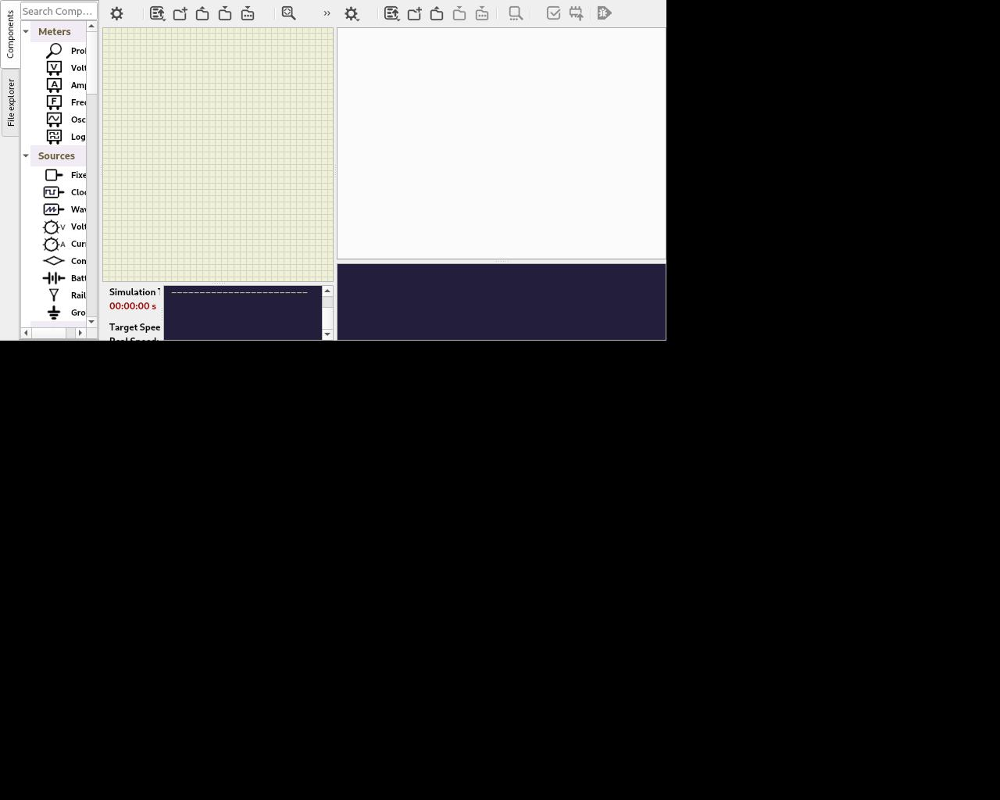 | [SHA256](./simulide/SHA256SUMS) | v1.5.2-amd64-nevm |
| [simutrans](./simutrans) | amd64  | ubuntu-noble | 123.0.1-3build2 |  | [SHA256](./simutrans/SHA256SUMS) | v1.5.2-amd64-nevm |
| [singularity](./singularity) | amd64  | ubuntu-noble | 1.0.0-1 |  | [SHA256](./singularity/SHA256SUMS) | v1.5.2-amd64-nevm |
| [sioyek](./sioyek) | amd64  | ubuntu-noble | 2.0.0+dfsg-4build2 |  | [SHA256](./sioyek/SHA256SUMS) | v1.5.2-amd64-nevm |
| [sirikali](./sirikali) | amd64  | ubuntu-noble | 1.5.1-1build2 |  | [SHA256](./sirikali/SHA256SUMS) | v1.5.2-amd64-nevm |
| [siril](./siril) | amd64  | ubuntu-noble | 1.2.1-1build3 |  | [SHA256](./siril/SHA256SUMS) | v1.5.2-amd64-nevm |
| [skanlite](./skanlite) | amd64  | ubuntu-noble | 23.08.5-0ubuntu4 |  | [SHA256](./skanlite/SHA256SUMS) | v1.5.2-amd64-nevm |
| [skanpage](./skanpage) | amd64  | ubuntu-noble | 23.08.5-0ubuntu4-20250327 | 失败 | [SHA256](./skanpage/SHA256SUMS) | v1.5.2-amd64-nevm |
| [skrooge](./skrooge) | amd64  | ubuntu-noble | 2.31.0-1build5 |  | [SHA256](./skrooge/SHA256SUMS) | v1.5.2-amd64-nevm |
| [skycat](./skycat) | amd64  | ubuntu-noble | 3.1.2+starlink1~b+dfsg-7build3-20250327 | 失败 | [SHA256](./skycat/SHA256SUMS) | v1.5.2-amd64-nevm |
| [slashem-sdl](./slashem-sdl) | amd64  | ubuntu-noble | 0.0.7E7F3-11build3 |  | [SHA256](./slashem-sdl/SHA256SUMS) | v1.5.2-amd64-nevm |
| [slashem-x11](./slashem-x11) | amd64  | ubuntu-noble | 0.0.7E7F3-11build3-20250327 | 失败 | [SHA256](./slashem-x11/SHA256SUMS) | v1.5.2-amd64-nevm |
| [slashtime](./slashtime) | amd64  | ubuntu-noble | 0.5.13-3-20250327 | 失败 | [SHA256](./slashtime/SHA256SUMS) | v1.5.2-amd64-nevm |
| [slbackup-php](./slbackup-php) | amd64  | ubuntu-noble | 0.4.5-5-20250327 | 失败 | [SHA256](./slbackup-php/SHA256SUMS) | v1.5.2-amd64-nevm |
| [slic3r](./slic3r) | amd64  | ubuntu-noble | 1.3.0+dfsg1-5build6 |  | [SHA256](./slic3r/SHA256SUMS) | v1.5.2-amd64-nevm |
| [slimevolley](./slimevolley) | amd64  | ubuntu-noble | 2.4.2+dfsg-3 |  | [SHA256](./slimevolley/SHA256SUMS) | v1.5.2-amd64-nevm |
| [sludge-engine](./sludge-engine) | amd64  | ubuntu-noble | 2.2.2-5build5-20250327 | 失败 | [SHA256](./sludge-engine/SHA256SUMS) | v1.5.2-amd64-nevm |
| [sm](./sm) | amd64  | ubuntu-noble | 0.26-3build2 |  | [SHA256](./sm/SHA256SUMS) | v1.5.2-amd64-nevm |
| [smb4k](./smb4k) | amd64  | ubuntu-noble | 3.2.5-1build2 |  | [SHA256](./smb4k/SHA256SUMS) | v1.5.2-amd64-nevm |
| [smplayer](./smplayer) | amd64  | ubuntu-noble | 23.12.0+ds0-1build2 |  | [SHA256](./smplayer/SHA256SUMS) | v1.5.2-amd64-nevm |
| [smtube](./smtube) | amd64  | ubuntu-noble | 21.7.0-1build2 |  | [SHA256](./smtube/SHA256SUMS) | v1.5.2-amd64-nevm |
| [snake4](./snake4) | amd64  | ubuntu-noble | 1.0.14-1.1build2-20250327 | 失败 | [SHA256](./snake4/SHA256SUMS) | v1.5.2-amd64-nevm |
| [snapd](./snapd) | amd64  | ubuntu-noble | 2.67.1+24.04-20250327 | 失败 | N/A | v1.5.2-amd64-nevm |
| [snapper-gui](./snapper-gui) | amd64  | ubuntu-noble | 0git.960a94834f-6-20250327 | 失败 | N/A | v1.5.2-amd64-nevm |
| [snd-gui-jack](./snd-gui-jack) | amd64  | ubuntu-noble | 24.1-1build2-20250327 | 失败 | [SHA256](./snd-gui-jack/SHA256SUMS) | v1.5.2-amd64-nevm |
| [snd-gui-pulse](./snd-gui-pulse) | amd64  | ubuntu-noble | 24.1-1build2-20250327 | 失败 | [SHA256](./snd-gui-pulse/SHA256SUMS) | v1.5.2-amd64-nevm |
| [snd-nox](./snd-nox) | amd64  | ubuntu-noble | 24.1-1build2-20250327 | 失败 | [SHA256](./snd-nox/SHA256SUMS) | v1.5.2-amd64-nevm |
| [snek](./snek) | amd64  | ubuntu-noble | 1.9-3build2-20250327 | 失败 | [SHA256](./snek/SHA256SUMS) | v1.5.2-amd64-nevm |
| [snek-bin](./snek-bin) | amd64  | ubuntu-noble | 1.9-3build2-20250327 | 失败 | [SHA256](./snek-bin/SHA256SUMS) | v1.5.2-amd64-nevm |
| [socnetv](./socnetv) | amd64  | ubuntu-noble | 2.8-1build2 |  | [SHA256](./socnetv/SHA256SUMS) | v1.5.2-amd64-nevm |
| [software-properties-gtk](./software-properties-gtk) | amd64  | ubuntu-noble | 0.99.49.1-20250327 | 失败 | N/A | v1.5.2-amd64-nevm |
| [software-properties-kde](./software-properties-kde) | amd64  | deepin-v23 | 0.96.20.2-2.1-20250327 | 失败 | N/A | v1.5.2-amd64-nevm |
| [software-properties-qt](./software-properties-qt) | amd64  | ubuntu-noble | 0.99.49.1-20250327 | 失败 | N/A | v1.5.2-amd64-nevm |
| [solaar](./solaar) | amd64  | ubuntu-noble | 1.1.11+dfsg-2-20250327 | 失败 | N/A | v1.5.2-amd64-nevm |
| [solarwolf](./solarwolf) | amd64  | ubuntu-noble | 1.5+dfsg1-6 |  | [SHA256](./solarwolf/SHA256SUMS) | v1.5.2-amd64-nevm |
| [solfege](./solfege) | amd64  | ubuntu-noble | 3.23.4-12-20250327 | 失败 | N/A | v1.5.2-amd64-nevm |
| [solvespace](./solvespace) | amd64  | ubuntu-noble | 3.1+ds1-3.1build2 |  | [SHA256](./solvespace/SHA256SUMS) | v1.5.2-amd64-nevm |
| [sonata](./sonata) | amd64  | ubuntu-noble | 1.7.0-2-20250327 | 失败 | N/A | v1.5.2-amd64-nevm |
| [songwrite](./songwrite) | amd64  | ubuntu-noble | 3-0.2-1 |  | [SHA256](./songwrite/SHA256SUMS) | v1.5.2-amd64-nevm |
| [sonic-pi](./sonic-pi) | amd64  | ubuntu-noble | 3.2.2~repack-8ubuntu3 |  | [SHA256](./sonic-pi/SHA256SUMS) | v1.5.2-amd64-nevm |
| [sonic-visualiser](./sonic-visualiser) | amd64  | ubuntu-noble | 4.5.2-2build3 |  | [SHA256](./sonic-visualiser/SHA256SUMS) | v1.5.2-amd64-nevm |
| [sooperlooper](./sooperlooper) | amd64  | ubuntu-noble | 1.7.8~dfsg0-2build3 |  | [SHA256](./sooperlooper/SHA256SUMS) | v1.5.2-amd64-nevm |
| [sopwith](./sopwith) | amd64  | ubuntu-noble | 2.5.0-1 |  | [SHA256](./sopwith/SHA256SUMS) | v1.5.2-amd64-nevm |
| [sound-juicer](./sound-juicer) | amd64  | ubuntu-noble | 3.40.0-1build3 |  | [SHA256](./sound-juicer/SHA256SUMS) | v1.5.2-amd64-nevm |
| [soundconverter](./soundconverter) | amd64  | ubuntu-noble | 4.0.4-1-20250327 | 失败 | N/A | v1.5.2-amd64-nevm |
| [soundkonverter](./soundkonverter) | amd64  | ubuntu-noble | 3.0.1-3build2-20250327 | 失败 | [SHA256](./soundkonverter/SHA256SUMS) | v1.5.2-amd64-nevm |
| [spacearyarya](./spacearyarya) | amd64  | ubuntu-noble | 1.0.2-8-20250327 | 失败 | [SHA256](./spacearyarya/SHA256SUMS) | v1.5.2-amd64-nevm |
| [spacebar](./spacebar) | amd64  | ubuntu-noble | 23.01.0-1build4 |  | [SHA256](./spacebar/SHA256SUMS) | v1.5.2-amd64-nevm |
| [spacefm](./spacefm) | amd64  | ubuntu-noble | 1.0.6-7build3 |   | [SHA256](./spacefm/SHA256SUMS) | v1.5.2-amd64-nevm |
| [spatialite-gui](./spatialite-gui) | amd64  | ubuntu-noble | 2.1.0~beta1-2build5 |  | [SHA256](./spatialite-gui/SHA256SUMS) | v1.5.2-amd64-nevm |
| [speedcrunch](./speedcrunch) | amd64  | ubuntu-noble | 0.12.0-6build2 |  | [SHA256](./speedcrunch/SHA256SUMS) | v1.5.2-amd64-nevm |
| [spek](./spek) | amd64  | ubuntu-noble | 0.8.5+dfsg-3build3 |  | [SHA256](./spek/SHA256SUMS) | v1.5.2-amd64-nevm |
| [spim](./spim) | amd64  | ubuntu-noble | 8.0+dfsg-7-20250327 | 失败 | [SHA256](./spim/SHA256SUMS) | v1.5.2-amd64-nevm |
| [spotlighter](./spotlighter) | amd64  | ubuntu-noble | 0.3-1.1ubuntu1 |  | [SHA256](./spotlighter/SHA256SUMS) | v1.5.2-amd64-nevm |
| [spout](./spout) | amd64  | ubuntu-noble | 1.4-5 |  | [SHA256](./spout/SHA256SUMS) | v1.5.2-amd64-nevm |
| [spring](./spring) | amd64  | ubuntu-noble | 106.0+dfsg-3build3-20250327 | 失败 | [SHA256](./spring/SHA256SUMS) | v1.5.2-amd64-nevm |
| [springlobby](./springlobby) | amd64  | ubuntu-noble | 0.274-1build4 | 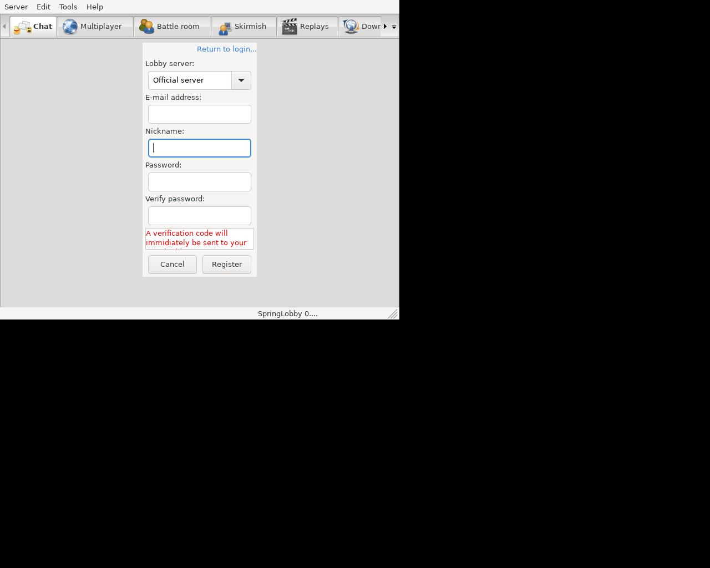 | [SHA256](./springlobby/SHA256SUMS) | v1.5.2-amd64-nevm |
| [spview](./spview) | amd64  | ubuntu-noble | 2.0.2-1-20250327 | 失败 | [SHA256](./spview/SHA256SUMS) | v1.5.2-amd64-nevm |
| [spyder](./spyder) | amd64  | ubuntu-noble | 5.5.1+ds-1 |  | [SHA256](./spyder/SHA256SUMS) | v1.5.2-amd64-nevm |
| [sqlitebrowser](./sqlitebrowser) | amd64  | ubuntu-noble | 3.12.2-3build2 |  | [SHA256](./sqlitebrowser/SHA256SUMS) | v1.5.2-amd64-nevm |
| [squeak-vm](./squeak-vm) | amd64  | ubuntu-noble | 4.10.2.2614+20120917~dfsg-2 |  | [SHA256](./squeak-vm/SHA256SUMS) | v1.5.2-amd64-nevm |
| [srain](./srain) | amd64  | ubuntu-noble | 1.5.1-1build2 |  | [SHA256](./srain/SHA256SUMS) | v1.5.2-amd64-nevm |
| [ssvnc](./ssvnc) | amd64  | ubuntu-noble | 1.0.29-6ubuntu3-20250327 | 失败 | [SHA256](./ssvnc/SHA256SUMS) | v1.5.2-amd64-nevm |
| [stacer](./stacer) | amd64  | ubuntu-noble | 1.1.0+ds-2build3 |  | [SHA256](./stacer/SHA256SUMS) | v1.5.2-amd64-nevm |
| [staden](./staden) | amd64  | ubuntu-noble | 2.0.0+b11-5-20250327 | 失败 | N/A | v1.5.2-amd64-nevm |
| [stardict-gtk](./stardict-gtk) | amd64  | ubuntu-noble | 3.0.7+git20220909+dfsg-4build4 |  | [SHA256](./stardict-gtk/SHA256SUMS) | v1.5.2-amd64-nevm |
| [starfighter](./starfighter) | amd64  | ubuntu-noble | 2.4-1 |  | [SHA256](./starfighter/SHA256SUMS) | v1.5.2-amd64-nevm |
| [starshine-scantool](./starshine-scantool) | amd64  | deepin-v23 | 6.7.66.0-1 |  | [SHA256](./starshine-scantool/SHA256SUMS) | v1.5.2-amd64-nevm |
| [starvoyager](./starvoyager) | amd64  | ubuntu-noble | 0.4.4-10 |  | [SHA256](./starvoyager/SHA256SUMS) | v1.5.2-amd64-nevm |
| [stax](./stax) | amd64  | ubuntu-noble | 1.37-2build2-20250327 | 失败 | [SHA256](./stax/SHA256SUMS) | v1.5.2-amd64-nevm |
| [steam-installer](./steam-installer) | amd64  | ubuntu-noble | 1.0.0.79~ds-2-20250327 | 失败 | N/A | v1.5.2-amd64-nevm |
| [stegosuite](./stegosuite) | amd64  | ubuntu-noble | 0.9.0-1 |  | [SHA256](./stegosuite/SHA256SUMS) | v1.5.2-amd64-nevm |
| [stella](./stella) | amd64  | ubuntu-noble | 6.7.1+dfsg-1build2 |  | [SHA256](./stella/SHA256SUMS) | v1.5.2-amd64-nevm |
| [stellarium](./stellarium) | amd64  | ubuntu-noble | 23.4-2build3 |  | [SHA256](./stellarium/SHA256SUMS) | v1.5.2-amd64-nevm |
| [step](./step) | amd64  | ubuntu-noble | 23.08.5-0ubuntu4 |  | [SHA256](./step/SHA256SUMS) | v1.5.2-amd64-nevm |
| [stlink-gui](./stlink-gui) | amd64  | ubuntu-noble | 1.8.0-1build2 |  | [SHA256](./stlink-gui/SHA256SUMS) | v1.5.2-amd64-nevm |
| [stoken](./stoken) | amd64  | ubuntu-noble | 0.92-1.1build2 |   | [SHA256](./stoken/SHA256SUMS) | v1.5.2-amd64-nevm |
| [stopmotion](./stopmotion) | amd64  | ubuntu-noble | 0.8.6-2build2 |  | [SHA256](./stopmotion/SHA256SUMS) | v1.5.2-amd64-nevm |
| [stopwatch](./stopwatch) | amd64  | ubuntu-noble | 3.5-9-20250327 | 失败 | [SHA256](./stopwatch/SHA256SUMS) | v1.5.2-amd64-nevm |
| [stormbaancoureur](./stormbaancoureur) | amd64  | ubuntu-noble | 2.1.6-3.1build2-20250327 | 失败 | [SHA256](./stormbaancoureur/SHA256SUMS) | v1.5.2-amd64-nevm |
| [strawberry](./strawberry) | amd64  | ubuntu-noble | 1.0.23-1build3 |  | [SHA256](./strawberry/SHA256SUMS) | v1.5.2-amd64-nevm |
| [streamdeck-ui](./streamdeck-ui) | amd64  | ubuntu-noble | 1.1.2-2-20250327 | 失败 | [SHA256](./streamdeck-ui/SHA256SUMS) | v1.5.2-amd64-nevm |
| [streamtuner2](./streamtuner2) | amd64  | ubuntu-noble | 2.2.2+dfsg-2ubuntu1-20250327 | 失败 | N/A | v1.5.2-amd64-nevm |
| [stretchplayer](./stretchplayer) | amd64  | ubuntu-noble | 0.503-4build3-20250327 | 失败 | [SHA256](./stretchplayer/SHA256SUMS) | v1.5.2-amd64-nevm |
| [structure-synth](./structure-synth) | amd64  | ubuntu-noble | 1.5.0-7build2 |  | [SHA256](./structure-synth/SHA256SUMS) | v1.5.2-amd64-nevm |
| [stterm](./stterm) | amd64  | ubuntu-noble | 0.9-1 |  | [SHA256](./stterm/SHA256SUMS) | v1.5.2-amd64-nevm |
| [studio-controls](./studio-controls) | amd64  | ubuntu-noble | 2.3.9-0ubuntu4-20250327 | 失败 | N/A | v1.5.2-amd64-nevm |
| [subdownloader](./subdownloader) | amd64  | ubuntu-noble | 2.1.0-5 |  | [SHA256](./subdownloader/SHA256SUMS) | v1.5.2-amd64-nevm |
| [sublime-music](./sublime-music) | amd64  | ubuntu-noble | 0.12.0-1-20250327 | 失败 | N/A | v1.5.2-amd64-nevm |
| [subtitlecomposer](./subtitlecomposer) | amd64  | ubuntu-noble | 0.8.0-1build6 |  | [SHA256](./subtitlecomposer/SHA256SUMS) | v1.5.2-amd64-nevm |
| [subtitleeditor](./subtitleeditor) | amd64  | ubuntu-noble | 0.54.0-6build2 |  | [SHA256](./subtitleeditor/SHA256SUMS) | v1.5.2-amd64-nevm |
| [sudoku](./sudoku) | amd64  | ubuntu-noble | 1.0.5-2.1-20250327 | 失败 | [SHA256](./sudoku/SHA256SUMS) | v1.5.2-amd64-nevm |
| [sudoku-solver](./sudoku-solver) | amd64  | ubuntu-noble | 1.0.1-4build2 |  | [SHA256](./sudoku-solver/SHA256SUMS) | v1.5.2-amd64-nevm |
| [sugar-browse-activity](./sugar-browse-activity) | amd64  | ubuntu-noble | 208-1-20250327 | 失败 | N/A | v1.5.2-amd64-nevm |
| [sugar-calculate-activity](./sugar-calculate-activity) | amd64  | ubuntu-noble | 47-1-20250327 | 失败 | N/A | v1.5.2-amd64-nevm |
| [sugar-chat-activity](./sugar-chat-activity) | amd64  | ubuntu-noble | 86-3-20250327 | 失败 | N/A | v1.5.2-amd64-nevm |
| [sugar-etoys-activity](./sugar-etoys-activity) | amd64  | ubuntu-noble | 116-10-20250327 | 失败 | [SHA256](./sugar-etoys-activity/SHA256SUMS) | v1.5.2-amd64-nevm |
| [sugar-imageviewer-activity](./sugar-imageviewer-activity) | amd64  | ubuntu-noble | 65-2-20250327 | 失败 | N/A | v1.5.2-amd64-nevm |
| [sugar-jukebox-activity](./sugar-jukebox-activity) | amd64  | ubuntu-noble | 36-2-20250327 | 失败 | N/A | v1.5.2-amd64-nevm |
| [sugar-log-activity](./sugar-log-activity) | amd64  | ubuntu-noble | 42-2-20250327 | 失败 | N/A | v1.5.2-amd64-nevm |
| [sugar-memorize-activity](./sugar-memorize-activity) | amd64  | ubuntu-noble | 59-1-20250327 | 失败 | N/A | v1.5.2-amd64-nevm |
| [sugar-pippy-activity](./sugar-pippy-activity) | amd64  | ubuntu-noble | 76-1-20250327 | 失败 | N/A | v1.5.2-amd64-nevm |
| [sugar-read-activity](./sugar-read-activity) | amd64  | ubuntu-noble | 123-2-20250327 | 失败 | N/A | v1.5.2-amd64-nevm |
| [sugar-terminal-activity](./sugar-terminal-activity) | amd64  | ubuntu-noble | 47-2-20250327 | 失败 | N/A | v1.5.2-amd64-nevm |
| [sugar-write-activity](./sugar-write-activity) | amd64  | ubuntu-noble | 101-2-20250327 | 失败 | N/A | v1.5.2-amd64-nevm |
| [sumo](./sumo) | amd64  | ubuntu-noble | 1.18.0+dfsg-3build5-20250327 | 失败 | [SHA256](./sumo/SHA256SUMS) | v1.5.2-amd64-nevm |
| [sunclock](./sunclock) | amd64  | ubuntu-noble | 3.57-13build2-20250327 | 失败 | [SHA256](./sunclock/SHA256SUMS) | v1.5.2-amd64-nevm |
| [sunflow](./sunflow) | amd64  | ubuntu-noble | 0.07.2.svn396+dfsg-18 |  | [SHA256](./sunflow/SHA256SUMS) | v1.5.2-amd64-nevm |
| [supercollider-emacs](./supercollider-emacs) | amd64  | ubuntu-noble | 3.13.0+repack-1ubuntu3 |  | [SHA256](./supercollider-emacs/SHA256SUMS) | v1.5.2-amd64-nevm |
| [supercollider-ide](./supercollider-ide) | amd64  | ubuntu-noble | 3.13.0+repack-1ubuntu3 |  | [SHA256](./supercollider-ide/SHA256SUMS) | v1.5.2-amd64-nevm |
| [supercollider-vim](./supercollider-vim) | amd64  | ubuntu-noble | 3.13.0+repack-1ubuntu3-20250327 | 失败 | [SHA256](./supercollider-vim/SHA256SUMS) | v1.5.2-amd64-nevm |
| [supertransball2](./supertransball2) | amd64  | ubuntu-noble | 1.5-11-20250327 | 失败 | [SHA256](./supertransball2/SHA256SUMS) | v1.5.2-amd64-nevm |
| [supertux](./supertux) | amd64  | ubuntu-noble | 0.6.3-2build4 |  | [SHA256](./supertux/SHA256SUMS) | v1.5.2-amd64-nevm |
| [supertuxkart](./supertuxkart) | amd64  | ubuntu-noble | 1.4+dfsg-3ubuntu1 |  | [SHA256](./supertuxkart/SHA256SUMS) | v1.5.2-amd64-nevm |
| [survex-aven](./survex-aven) | amd64  | ubuntu-noble | 1.4.4-1build3 |  | [SHA256](./survex-aven/SHA256SUMS) | v1.5.2-amd64-nevm |
| [swami](./swami) | amd64  | ubuntu-noble | 2.2.2-2.1build2 |  | [SHA256](./swami/SHA256SUMS) | v1.5.2-amd64-nevm |
| [swayimg](./swayimg) | amd64  | ubuntu-noble | 2.1-1build2-20250327 | 失败 | [SHA256](./swayimg/SHA256SUMS) | v1.5.2-amd64-nevm |
| [sweeper](./sweeper) | amd64  | ubuntu-noble | 23.08.5-0ubuntu3 |  | [SHA256](./sweeper/SHA256SUMS) | v1.5.2-amd64-nevm |
| [sweethome3d](./sweethome3d) | amd64  | ubuntu-noble | 7.2+dfsg-1-20250327 | 失败 | [SHA256](./sweethome3d/SHA256SUMS) | v1.5.2-amd64-nevm |
| [sweethome3d-furniture-editor](./sweethome3d-furniture-editor) | amd64  | ubuntu-noble | 1.30-1-20250327 | 失败 | [SHA256](./sweethome3d-furniture-editor/SHA256SUMS) | v1.5.2-amd64-nevm |
| [sweethome3d-textures-editor](./sweethome3d-textures-editor) | amd64  | ubuntu-noble | 1.8-1-20250327 | 失败 | [SHA256](./sweethome3d-textures-editor/SHA256SUMS) | v1.5.2-amd64-nevm |
| [swell-foop](./swell-foop) | amd64  | ubuntu-noble | 46.0-1 |  | [SHA256](./swell-foop/SHA256SUMS) | v1.5.2-amd64-nevm |
| [sxiv](./sxiv) | amd64  | ubuntu-noble | 26-1build2-20250327 | 失败 | [SHA256](./sxiv/SHA256SUMS) | v1.5.2-amd64-nevm |
| [sxmo-utils](./sxmo-utils) | amd64  | ubuntu-noble | 1.12.0-7-20250327 | 失败 | [SHA256](./sxmo-utils/SHA256SUMS) | v1.5.2-amd64-nevm |
| [sxsscardserver](./sxsscardserver) | amd64  | deepin-v23 | 3.5.15-20250327 | 失败 | [SHA256](./sxsscardserver/SHA256SUMS) | v1.5.2-amd64-nevm |
| [sylph-searcher](./sylph-searcher) | amd64  | ubuntu-noble | 1.2.0-15build2 |  | [SHA256](./sylph-searcher/SHA256SUMS) | v1.5.2-amd64-nevm |
| [sylpheed](./sylpheed) | amd64  | ubuntu-noble | 3.8.0~beta1-1ubuntu5 |  | [SHA256](./sylpheed/SHA256SUMS) | v1.5.2-amd64-nevm |
| [synapse](./synapse) | amd64  | ubuntu-noble | 0.2.99.4-4build2 |  | [SHA256](./synapse/SHA256SUMS) | v1.5.2-amd64-nevm |
| [synaptic](./synaptic) | amd64  | ubuntu-noble | 0.91.3build4-20250327 | 失败 | [SHA256](./synaptic/SHA256SUMS) | v1.5.2-amd64-nevm |
| [sync-ui](./sync-ui) | amd64  | ubuntu-noble | 2.0.0-3ubuntu2 |  | [SHA256](./sync-ui/SHA256SUMS) | v1.5.2-amd64-nevm |
| [syncmaildir-applet](./syncmaildir-applet) | amd64  | ubuntu-noble | 1.3.0-2build2-20250327 | 失败 | [SHA256](./syncmaildir-applet/SHA256SUMS) | v1.5.2-amd64-nevm |
| [syncplay](./syncplay) | amd64  | ubuntu-noble | 1.7.0+repack1-2ubuntu0.1-20250327 | 失败 | [SHA256](./syncplay/SHA256SUMS) | v1.5.2-amd64-nevm |
| [syncplay-server](./syncplay-server) | amd64  | ubuntu-noble | 1.7.0+repack1-2ubuntu0.1-20250327 | 失败 | [SHA256](./syncplay-server/SHA256SUMS) | v1.5.2-amd64-nevm |
| [syncthing](./syncthing) | amd64  | ubuntu-noble | 1.27.2~ds4-1ubuntu0.24.04.2-20250327 | 失败 | [SHA256](./syncthing/SHA256SUMS) | v1.5.2-amd64-nevm |
| [syncthing-gtk](./syncthing-gtk) | amd64  | ubuntu-noble | 0.9.4.4+ds+git20221205+12a9702d29ab-3-20250327 | 失败 | N/A | v1.5.2-amd64-nevm |
| [syncthingtray](./syncthingtray) | amd64  | ubuntu-noble | 1.4.12-1build2 |  | [SHA256](./syncthingtray/SHA256SUMS) | v1.5.2-amd64-nevm |
| [synfigstudio](./synfigstudio) | amd64  | ubuntu-noble | 1.5.1-1build2 |  | [SHA256](./synfigstudio/SHA256SUMS) | v1.5.2-amd64-nevm |
| [synthv1](./synthv1) | amd64  | ubuntu-noble | 0.9.34-1build3 |  | [SHA256](./synthv1/SHA256SUMS) | v1.5.2-amd64-nevm |
| [sysprof](./sysprof) | amd64  | ubuntu-noble | 46.0-1build1 |  | [SHA256](./sysprof/SHA256SUMS) | v1.5.2-amd64-nevm |
| [system-config-printer](./system-config-printer) | amd64  | ubuntu-noble | 1.5.18-1ubuntu9-20250327 | 失败 | N/A | v1.5.2-amd64-nevm |
| [systempreferences.app](./systempreferences.app) | amd64  | ubuntu-noble | 1.2.0-2build8-20250327 | 失败 | [SHA256](./systempreferences.app/SHA256SUMS) | v1.5.2-amd64-nevm |
| [systemsettings](./systemsettings) | amd64  | ubuntu-noble | 5.27.11-0ubuntu2 |   | [SHA256](./systemsettings/SHA256SUMS) | v1.5.2-amd64-nevm |
| [taffybar](./taffybar) | amd64  | ubuntu-noble | 4.0.1-1build5-20250327 | 失败 | [SHA256](./taffybar/SHA256SUMS) | v1.5.2-amd64-nevm |
| [tagua](./tagua) | amd64  | ubuntu-noble | 1.0~alpha2-16-g618c6a0-3build3-20250327 | 失败 | [SHA256](./tagua/SHA256SUMS) | v1.5.2-amd64-nevm |
| [tali](./tali) | amd64  | ubuntu-noble | 40.9-1build2 |  | [SHA256](./tali/SHA256SUMS) | v1.5.2-amd64-nevm |
| [talksoup.app](./talksoup.app) | amd64  | ubuntu-noble | 1.1-1-20250327 | 失败 | [SHA256](./talksoup.app/SHA256SUMS) | v1.5.2-amd64-nevm |
| [tanglet](./tanglet) | amd64  | ubuntu-noble | 1.6.5-1ubuntu3 |  | [SHA256](./tanglet/SHA256SUMS) | v1.5.2-amd64-nevm |
| [tatan](./tatan) | amd64  | ubuntu-noble | 1.0.dfsg2-1 |  | [SHA256](./tatan/SHA256SUMS) | v1.5.2-amd64-nevm |
| [tea](./tea) | amd64  | ubuntu-noble | 62.0.2-1build3 |  | [SHA256](./tea/SHA256SUMS) | v1.5.2-amd64-nevm |
| [tecla](./tecla) | amd64  | ubuntu-noble | 46.0-1build1-20250327 | 失败 | [SHA256](./tecla/SHA256SUMS) | v1.5.2-amd64-nevm |
| [tecnoballz](./tecnoballz) | amd64  | ubuntu-noble | 0.93.1-10 |  | [SHA256](./tecnoballz/SHA256SUMS) | v1.5.2-amd64-nevm |
| [teeworlds](./teeworlds) | amd64  | ubuntu-noble | 0.7.5-2 |  | [SHA256](./teeworlds/SHA256SUMS) | v1.5.2-amd64-nevm |
| [teg](./teg) | amd64  | ubuntu-noble | 0.12.0-2build2-20250327 | 失败 | [SHA256](./teg/SHA256SUMS) | v1.5.2-amd64-nevm |
| [telegnome](./telegnome) | amd64  | ubuntu-noble | 0.3.6-5build2 |  | [SHA256](./telegnome/SHA256SUMS) | v1.5.2-amd64-nevm |
| [tellico](./tellico) | amd64  | ubuntu-noble | 3.5.3-1ubuntu5 |  | [SHA256](./tellico/SHA256SUMS) | v1.5.2-amd64-nevm |
| [tenace](./tenace) | amd64  | ubuntu-noble | 0.17-1build2 |  | [SHA256](./tenace/SHA256SUMS) | v1.5.2-amd64-nevm |
| [tenmado](./tenmado) | amd64  | ubuntu-noble | 0.10-5 |  | [SHA256](./tenmado/SHA256SUMS) | v1.5.2-amd64-nevm |
| [tennix](./tennix) | amd64  | ubuntu-noble | 1.3.4-0.1build2 |  | [SHA256](./tennix/SHA256SUMS) | v1.5.2-amd64-nevm |
| [terminal.app](./terminal.app) | amd64  | ubuntu-noble | 0.9.9-3build3-20250327 | 失败 | [SHA256](./terminal.app/SHA256SUMS) | v1.5.2-amd64-nevm |
| [terminator](./terminator) | amd64  | ubuntu-noble | 2.1.3-1-20250327 | 失败 | N/A | v1.5.2-amd64-nevm |
| [terminatorx](./terminatorx) | amd64  | ubuntu-noble | 4.2.0-1build2 |  | [SHA256](./terminatorx/SHA256SUMS) | v1.5.2-amd64-nevm |
| [terminology](./terminology) | amd64  | ubuntu-noble | 1.13.0-2build2 |  | [SHA256](./terminology/SHA256SUMS) | v1.5.2-amd64-nevm |
| [terminus](./terminus) | amd64  | ubuntu-noble | 2.3.1-1ubuntu4-20250327 | 失败 | N/A | v1.5.2-amd64-nevm |
| [termit](./termit) | amd64  | ubuntu-noble | 3.1-3build2 |  | [SHA256](./termit/SHA256SUMS) | v1.5.2-amd64-nevm |
| [terraintool](./terraintool) | amd64  | ubuntu-noble | 1.16-3-20250327 | 失败 | [SHA256](./terraintool/SHA256SUMS) | v1.5.2-amd64-nevm |
| [tetraproc](./tetraproc) | amd64  | ubuntu-noble | 0.9.2-1build2-20250327 | 失败 | [SHA256](./tetraproc/SHA256SUMS) | v1.5.2-amd64-nevm |
| [tetzle](./tetzle) | amd64  | ubuntu-noble | 2.2.3-1ubuntu3 |  | [SHA256](./tetzle/SHA256SUMS) | v1.5.2-amd64-nevm |
| [texlive-base](./texlive-base) | amd64  | deepin-v23 | 2024.20241115-1deepin1-20250327 | 失败 | [SHA256](./texlive-base/SHA256SUMS) | v1.5.2-amd64-nevm |
| [texmaker](./texmaker) | amd64  | ubuntu-noble | 5.1.3+dfsg-1build8 |  | [SHA256](./texmaker/SHA256SUMS) | v1.5.2-amd64-nevm |
| [texstudio](./texstudio) | amd64  | ubuntu-noble | 4.7.2+ds-2build3 |  | [SHA256](./texstudio/SHA256SUMS) | v1.5.2-amd64-nevm |
| [textedit.app](./textedit.app) | amd64  | ubuntu-noble | 5.0-3-20250327 | 失败 | [SHA256](./textedit.app/SHA256SUMS) | v1.5.2-amd64-nevm |
| [texworks](./texworks) | amd64  | ubuntu-noble | 0.6.8-3build4 |  | [SHA256](./texworks/SHA256SUMS) | v1.5.2-amd64-nevm |
| [tf5](./tf5) | amd64  | ubuntu-noble | 5.0beta8-12build2-20250327 | 失败 | [SHA256](./tf5/SHA256SUMS) | v1.5.2-amd64-nevm |
| [tgif](./tgif) | amd64  | ubuntu-noble | 4.2.5-1.3build4-20250327 | 失败 | [SHA256](./tgif/SHA256SUMS) | v1.5.2-amd64-nevm |
| [thawab](./thawab) | amd64  | ubuntu-noble | 4.1-2ubuntu1-20250327 | 失败 | N/A | v1.5.2-amd64-nevm |
| [therion](./therion) | amd64  | ubuntu-noble | 6.2.0-1build3-20250327 | 失败 | [SHA256](./therion/SHA256SUMS) | v1.5.2-amd64-nevm |
| [therion-viewer](./therion-viewer) | amd64  | ubuntu-noble | 6.2.0-1build3 |  | [SHA256](./therion-viewer/SHA256SUMS) | v1.5.2-amd64-nevm |
| [thonny](./thonny) | amd64  | ubuntu-noble | 4.0.1-1-20250327 | 失败 | [SHA256](./thonny/SHA256SUMS) | v1.5.2-amd64-nevm |
| [threadscope](./threadscope) | amd64  | ubuntu-noble | 0.2.14.1-1ubuntu2 | 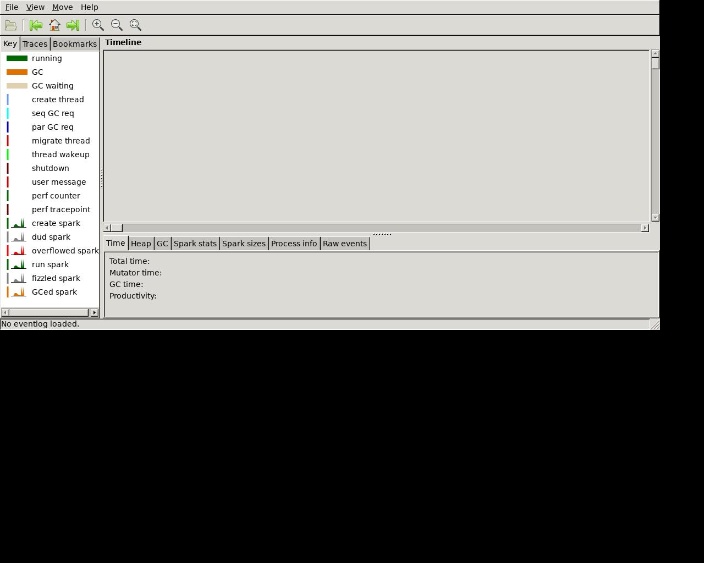 | [SHA256](./threadscope/SHA256SUMS) | v1.5.2-amd64-nevm |
| [thunar](./thunar) | amd64  | ubuntu-noble | 4.18.8-1build3 |   | [SHA256](./thunar/SHA256SUMS) | v1.5.2-amd64-nevm |
| [thunar-volman](./thunar-volman) | amd64  | ubuntu-noble | 4.18.0-1build2 |  | [SHA256](./thunar-volman/SHA256SUMS) | v1.5.2-amd64-nevm |
| [thunderbird](./thunderbird) | amd64  | deepin-v23 | 128.3.0esr-1deepin2 |  | [SHA256](./thunderbird/SHA256SUMS) | v1.5.2-amd64-nevm |
| [tiatracker](./tiatracker) | amd64  | ubuntu-noble | 1.3-3build2 |  | [SHA256](./tiatracker/SHA256SUMS) | v1.5.2-amd64-nevm |
| [ticketbooth](./ticketbooth) | amd64  | ubuntu-noble | 1.0.3.1-2-20250327 | 失败 | N/A | v1.5.2-amd64-nevm |
| [tickr](./tickr) | amd64  | ubuntu-noble | 0.7.1-1build2 |  | [SHA256](./tickr/SHA256SUMS) | v1.5.2-amd64-nevm |
| [tiger](./tiger) | amd64  | ubuntu-noble | 3.2.4~rc1-3.2-20250327 | 失败 | [SHA256](./tiger/SHA256SUMS) | v1.5.2-amd64-nevm |
| [tigervnc-viewer](./tigervnc-viewer) | amd64  | ubuntu-noble | 1.13.1+dfsg-2build2 |  | [SHA256](./tigervnc-viewer/SHA256SUMS) | v1.5.2-amd64-nevm |
| [tikzit](./tikzit) | amd64  | ubuntu-noble | 2.1.6-4build3 |  | [SHA256](./tikzit/SHA256SUMS) | v1.5.2-amd64-nevm |
| [tilda](./tilda) | amd64  | ubuntu-noble | 2.0.0-1build2 |   | [SHA256](./tilda/SHA256SUMS) | v1.5.2-amd64-nevm |
| [tiled](./tiled) | amd64  | ubuntu-noble | 1.8.2-1build2 |  | [SHA256](./tiled/SHA256SUMS) | v1.5.2-amd64-nevm |
| [tilem](./tilem) | amd64  | ubuntu-noble | 2.0-5build3 |  | [SHA256](./tilem/SHA256SUMS) | v1.5.2-amd64-nevm |
| [tilix](./tilix) | amd64  | ubuntu-noble | 1.9.6-2build1-20250327 | 失败 | N/A | v1.5.2-amd64-nevm |
| [tilp2](./tilp2) | amd64  | ubuntu-noble | 1.19~git20231112.5a2ea63-1build2 |  | [SHA256](./tilp2/SHA256SUMS) | v1.5.2-amd64-nevm |
| [timekpr-next](./timekpr-next) | amd64  | ubuntu-noble | 0.5.4-1ubuntu3.1-20250327 | 失败 | N/A | v1.5.2-amd64-nevm |
| [timemachine](./timemachine) | amd64  | ubuntu-noble | 0.3.3-3build2-20250327 | 失败 | [SHA256](./timemachine/SHA256SUMS) | v1.5.2-amd64-nevm |
| [timemon.app](./timemon.app) | amd64  | ubuntu-noble | 4.2-2build5-20250327 | 失败 | [SHA256](./timemon.app/SHA256SUMS) | v1.5.2-amd64-nevm |
| [timeshift](./timeshift) | amd64  | ubuntu-noble | 24.01.1-1build2-20250327 | 失败 | N/A | v1.5.2-amd64-nevm |
| [timidity](./timidity) | amd64  | deepin-v23 | 2.14.0-deepin1-20250327 | 失败 | [SHA256](./timidity/SHA256SUMS) | v1.5.2-amd64-nevm |
| [tint](./tint) | amd64  | ubuntu-noble | 0.07-20250327 | 失败 | [SHA256](./tint/SHA256SUMS) | v1.5.2-amd64-nevm |
| [tint2](./tint2) | amd64  | ubuntu-noble | 17.0.1-1.1build2 |  | [SHA256](./tint2/SHA256SUMS) | v1.5.2-amd64-nevm |
| [tintin++](./tintin++) | amd64  | ubuntu-noble | 2.02.20-1build2-20250327 | 失败 | [SHA256](./tintin++/SHA256SUMS) | v1.5.2-amd64-nevm |
| [tipp10](./tipp10) | amd64  | ubuntu-noble | 3.3.0-2build2 | 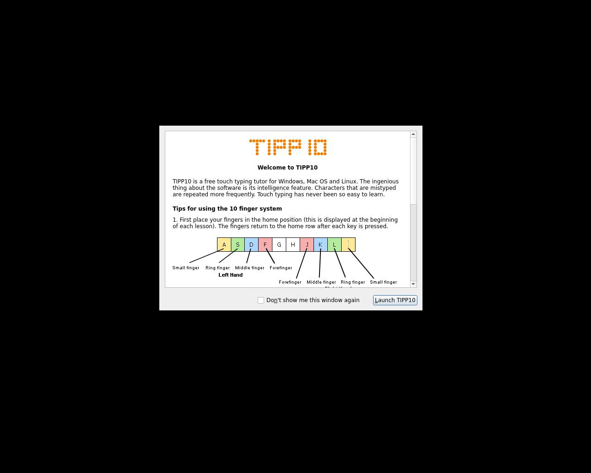 | [SHA256](./tipp10/SHA256SUMS) | v1.5.2-amd64-nevm |
| [titanion](./titanion) | amd64  | ubuntu-noble | 0.3.dfsg1-8 |  | [SHA256](./titanion/SHA256SUMS) | v1.5.2-amd64-nevm |
| [tkabber](./tkabber) | amd64  | ubuntu-noble | 1.1.2+20191012-1-20250327 | 失败 | [SHA256](./tkabber/SHA256SUMS) | v1.5.2-amd64-nevm |
| [tkcon](./tkcon) | amd64  | ubuntu-noble | 2.7.11-1-20250327 | 失败 | [SHA256](./tkcon/SHA256SUMS) | v1.5.2-amd64-nevm |
| [tkcvs](./tkcvs) | amd64  | ubuntu-noble | 8.2.3-1.2-20250327 | 失败 | [SHA256](./tkcvs/SHA256SUMS) | v1.5.2-amd64-nevm |
| [tkgate](./tkgate) | amd64  | ubuntu-noble | 2.1+repack-6build2-20250327 | 失败 | [SHA256](./tkgate/SHA256SUMS) | v1.5.2-amd64-nevm |
| [tkinfo](./tkinfo) | amd64  | ubuntu-noble | 2.11-4-20250327 | 失败 | [SHA256](./tkinfo/SHA256SUMS) | v1.5.2-amd64-nevm |
| [tkremind](./tkremind) | amd64  | ubuntu-noble | 04.03.01-1build1-20250327 | 失败 | [SHA256](./tkremind/SHA256SUMS) | v1.5.2-amd64-nevm |
| [toec-mpseries](./toec-mpseries) | amd64  | deepin-v23 | 2.1-7 |  | [SHA256](./toec-mpseries/SHA256SUMS) | v1.5.2-amd64-nevm |
| [tokodon](./tokodon) | amd64  | ubuntu-noble | 23.08.5-0ubuntu4-20250327 | 失败 | [SHA256](./tokodon/SHA256SUMS) | v1.5.2-amd64-nevm |
| [tomatoes](./tomatoes) | amd64  | ubuntu-noble | 1.55-10 |  | [SHA256](./tomatoes/SHA256SUMS) | v1.5.2-amd64-nevm |
| [tomboy-ng](./tomboy-ng) | amd64  | ubuntu-noble | 0.39-1build2 |  | [SHA256](./tomboy-ng/SHA256SUMS) | v1.5.2-amd64-nevm |
| [topcat](./topcat) | amd64  | ubuntu-noble | 4.9-1 |  | [SHA256](./topcat/SHA256SUMS) | v1.5.2-amd64-nevm |
| [topp](./topp) | amd64  | ubuntu-noble | 2.6.0+cleaned1-4build4 |   | [SHA256](./topp/SHA256SUMS) | v1.5.2-amd64-nevm |
| [topparser](./topparser) | amd64  | ubuntu-noble | 1.3-3-20250327 | 失败 | [SHA256](./topparser/SHA256SUMS) | v1.5.2-amd64-nevm |
| [toppler](./toppler) | amd64  | ubuntu-noble | 1.3-2 |  | [SHA256](./toppler/SHA256SUMS) | v1.5.2-amd64-nevm |
| [torbrowser-launcher](./torbrowser-launcher) | amd64  | ubuntu-noble | 0.3.7-1ubuntu1 | 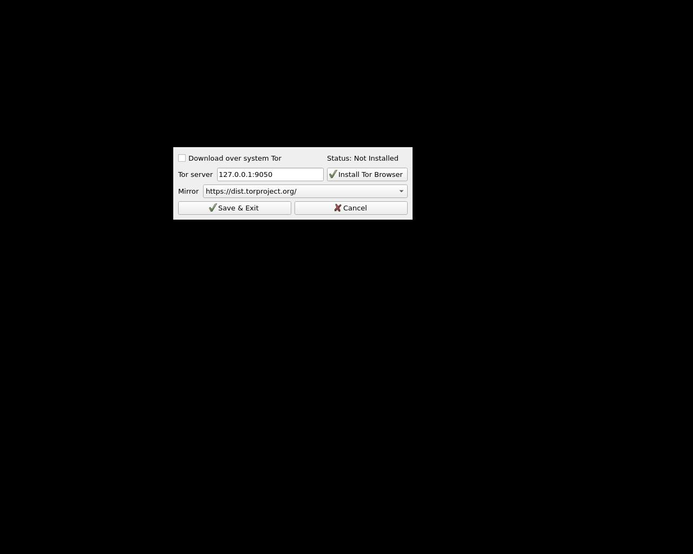 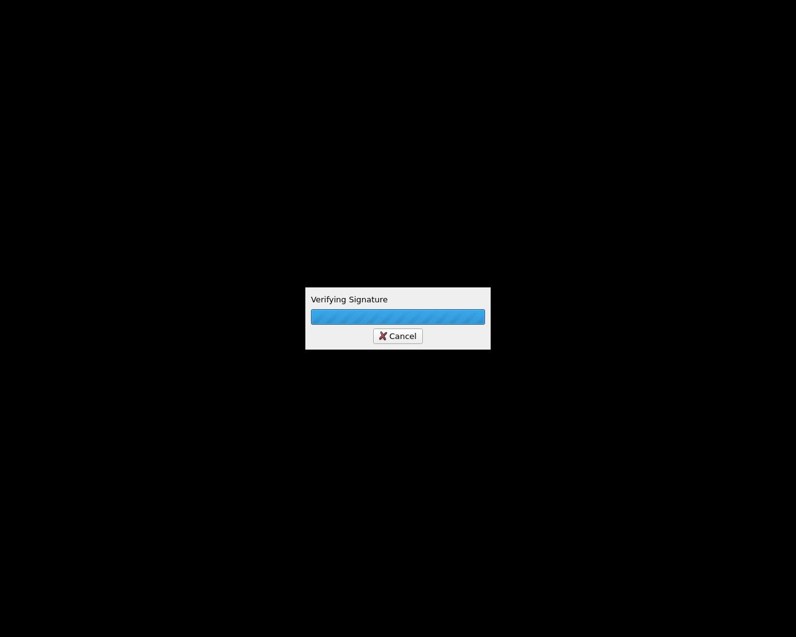 | [SHA256](./torbrowser-launcher/SHA256SUMS) | v1.5.2-amd64-nevm |
| [torcs](./torcs) | amd64  | ubuntu-noble | 1.3.7+dfsg-5build3-20250327 | 失败 | [SHA256](./torcs/SHA256SUMS) | v1.5.2-amd64-nevm |
| [tortoisehg](./tortoisehg) | amd64  | ubuntu-noble | 6.6.3-1 |  | [SHA256](./tortoisehg/SHA256SUMS) | v1.5.2-amd64-nevm |
| [torus-trooper](./torus-trooper) | amd64  | ubuntu-noble | 0.22.dfsg1-13 |  | [SHA256](./torus-trooper/SHA256SUMS) | v1.5.2-amd64-nevm |
| [totem](./totem) | amd64  | ubuntu-noble | 43.0-2ubuntu4 |  | [SHA256](./totem/SHA256SUMS) | v1.5.2-amd64-nevm |
| [toxic](./toxic) | amd64  | ubuntu-noble | 0.11.1-3build3-20250327 | 失败 | [SHA256](./toxic/SHA256SUMS) | v1.5.2-amd64-nevm |
| [trabucco](./trabucco) | amd64  | ubuntu-noble | 1.5-1build2-20250327 | 失败 | [SHA256](./trabucco/SHA256SUMS) | v1.5.2-amd64-nevm |
| [traceshark](./traceshark) | amd64  | ubuntu-noble | 0.9.14~beta-1build2 |  | [SHA256](./traceshark/SHA256SUMS) | v1.5.2-amd64-nevm |
| [trackballs](./trackballs) | amd64  | ubuntu-noble | 1.3.4-1-20250327 | 失败 | [SHA256](./trackballs/SHA256SUMS) | v1.5.2-amd64-nevm |
| [trader](./trader) | amd64  | ubuntu-noble | 7.18-1-20250327 | 失败 | [SHA256](./trader/SHA256SUMS) | v1.5.2-amd64-nevm |
| [transcend](./transcend) | amd64  | ubuntu-noble | 0.3.dfsg2-4-20250327 | 失败 | [SHA256](./transcend/SHA256SUMS) | v1.5.2-amd64-nevm |
| [transcriber](./transcriber) | amd64  | ubuntu-noble | 1.5.1.1-10build1-20250327 | 失败 | [SHA256](./transcriber/SHA256SUMS) | v1.5.2-amd64-nevm |
| [transgui](./transgui) | amd64  | ubuntu-noble | 5.18.0+dfsg-3.1 |  | [SHA256](./transgui/SHA256SUMS) | v1.5.2-amd64-nevm |
| [transmission-gtk](./transmission-gtk) | amd64  | ubuntu-noble | 4.0.5-1build5 |  | [SHA256](./transmission-gtk/SHA256SUMS) | v1.5.2-amd64-nevm |
| [transmission-qt](./transmission-qt) | amd64  | ubuntu-noble | 4.0.5-1build5 |  | [SHA256](./transmission-qt/SHA256SUMS) | v1.5.2-amd64-nevm |
| [transmission-remote-gtk](./transmission-remote-gtk) | amd64  | ubuntu-noble | 1.5.1-1build3 |  | [SHA256](./transmission-remote-gtk/SHA256SUMS) | v1.5.2-amd64-nevm |
| [traverso](./traverso) | amd64  | ubuntu-noble | 0.49.6-1build5 |  | [SHA256](./traverso/SHA256SUMS) | v1.5.2-amd64-nevm |
| [treeline](./treeline) | amd64  | ubuntu-noble | 3.1.5-1 |  | [SHA256](./treeline/SHA256SUMS) | v1.5.2-amd64-nevm |
| [treesheets](./treesheets) | amd64  | ubuntu-noble | 1.0.2-1.1build2 |  | [SHA256](./treesheets/SHA256SUMS) | v1.5.2-amd64-nevm |
| [treeviewx](./treeviewx) | amd64  | ubuntu-noble | 0.5.1+git20100823.7e4d0e9-4build3 |  | [SHA256](./treeviewx/SHA256SUMS) | v1.5.2-amd64-nevm |
| [tremotesf](./tremotesf) | amd64  | ubuntu-noble | 2.6.0-1build2 |  | [SHA256](./tremotesf/SHA256SUMS) | v1.5.2-amd64-nevm |
| [trigger-rally](./trigger-rally) | amd64  | ubuntu-noble | 0.6.6.1-3ubuntu1-20250327 | 失败 | [SHA256](./trigger-rally/SHA256SUMS) | v1.5.2-amd64-nevm |
| [trimage](./trimage) | amd64  | ubuntu-noble | 1.0.6-2 |  | [SHA256](./trimage/SHA256SUMS) | v1.5.2-amd64-nevm |
| [triplane](./triplane) | amd64  | ubuntu-noble | 1.0.8-3 |  | [SHA256](./triplane/SHA256SUMS) | v1.5.2-amd64-nevm |
| [triplea](./triplea) | amd64  | ubuntu-noble | 1.9.0.0.7062-2-20250327 | 失败 | [SHA256](./triplea/SHA256SUMS) | v1.5.2-amd64-nevm |
| [trophy](./trophy) | amd64  | ubuntu-noble | 2.0.4-1build1-20250327 | 失败 | [SHA256](./trophy/SHA256SUMS) | v1.5.2-amd64-nevm |
| [trustedqsl](./trustedqsl) | amd64  | ubuntu-noble | 2.7.2-1build3 |   | [SHA256](./trustedqsl/SHA256SUMS) | v1.5.2-amd64-nevm |
| [tryton-client](./tryton-client) | amd64  | ubuntu-noble | 6.0.34-1-20250327 | 失败 | N/A | v1.5.2-amd64-nevm |
| [tuba](./tuba) | amd64  | ubuntu-noble | 0.6.3-1build2 |  | [SHA256](./tuba/SHA256SUMS) | v1.5.2-amd64-nevm |
| [tucnak](./tucnak) | amd64  | ubuntu-noble | 4.55-1build3 |  | [SHA256](./tucnak/SHA256SUMS) | v1.5.2-amd64-nevm |
| [tumiki-fighters](./tumiki-fighters) | amd64  | ubuntu-noble | 0.2.dfsg1-10 |  | [SHA256](./tumiki-fighters/SHA256SUMS) | v1.5.2-amd64-nevm |
| [tuna](./tuna) | amd64  | ubuntu-noble | 0.15-1-20250327 | 失败 | [SHA256](./tuna/SHA256SUMS) | v1.5.2-amd64-nevm |
| [tuned-gtk](./tuned-gtk) | amd64  | ubuntu-noble | 2.21.0-1ubuntu2-20250327 | 失败 | N/A | v1.5.2-amd64-nevm |
| [tunnelx](./tunnelx) | amd64  | ubuntu-noble | 20190701-1-20250327 | 失败 | [SHA256](./tunnelx/SHA256SUMS) | v1.5.2-amd64-nevm |
| [tutka](./tutka) | amd64  | ubuntu-noble | 1.1.3-2.1build4 |  | [SHA256](./tutka/SHA256SUMS) | v1.5.2-amd64-nevm |
| [tuxfootball](./tuxfootball) | amd64  | ubuntu-noble | 0.3.1-7build1 |  | [SHA256](./tuxfootball/SHA256SUMS) | v1.5.2-amd64-nevm |
| [tuxguitar](./tuxguitar) | amd64  | ubuntu-noble | 1.5.6+dfsg1-8build3 |  | [SHA256](./tuxguitar/SHA256SUMS) | v1.5.2-amd64-nevm |
| [tuxmath](./tuxmath) | amd64  | ubuntu-noble | 2.0.3-9build2 |  | [SHA256](./tuxmath/SHA256SUMS) | v1.5.2-amd64-nevm |
| [tuxpaint](./tuxpaint) | amd64  | ubuntu-noble | 0.9.28-sdl2-1build2 |  | [SHA256](./tuxpaint/SHA256SUMS) | v1.5.2-amd64-nevm |
| [tuxpaint-config](./tuxpaint-config) | amd64  | ubuntu-noble | 0.17rc1-1build3 |  | [SHA256](./tuxpaint-config/SHA256SUMS) | v1.5.2-amd64-nevm |
| [tuxpuck](./tuxpuck) | amd64  | ubuntu-noble | 0.8.2-12build2 |  | [SHA256](./tuxpuck/SHA256SUMS) | v1.5.2-amd64-nevm |
| [tuxtype](./tuxtype) | amd64  | ubuntu-noble | 1.8.3-5.1build3 |  | [SHA256](./tuxtype/SHA256SUMS) | v1.5.2-amd64-nevm |
| [tvtime](./tvtime) | amd64  | ubuntu-noble | 1.0.11-8build2-20250327 | 失败 | [SHA256](./tvtime/SHA256SUMS) | v1.5.2-amd64-nevm |
| [twclock](./twclock) | amd64  | ubuntu-noble | 3.5-1build2-20250327 | 失败 | [SHA256](./twclock/SHA256SUMS) | v1.5.2-amd64-nevm |
| [twinkle](./twinkle) | amd64  | ubuntu-noble | 1.10.2+dfsg-2build3 |  | [SHA256](./twinkle/SHA256SUMS) | v1.5.2-amd64-nevm |
| [twinvoicerecalc](./twinvoicerecalc) | amd64  | ubuntu-noble | 0.0.20170711-1.1 |   | [SHA256](./twinvoicerecalc/SHA256SUMS) | v1.5.2-amd64-nevm |
| [tworld](./tworld) | amd64  | ubuntu-noble | 1.3.2-4 |  | [SHA256](./tworld/SHA256SUMS) | v1.5.2-amd64-nevm |
| [twpsk](./twpsk) | amd64  | ubuntu-noble | 4.3-1build3-20250327 | 失败 | [SHA256](./twpsk/SHA256SUMS) | v1.5.2-amd64-nevm |
| [typecatcher](./typecatcher) | amd64  | ubuntu-noble | 0.4-0.1-20250327 | 失败 | N/A | v1.5.2-amd64-nevm |
| [ubiquity-frontend-gtk](./ubiquity-frontend-gtk) | amd64  | ubuntu-noble | 24.04.5-20250327 | 失败 | N/A | v1.5.2-amd64-nevm |
| [ubiquity-frontend-kde](./ubiquity-frontend-kde) | amd64  | ubuntu-noble | 24.04.5-20250327 | 失败 | N/A | v1.5.2-amd64-nevm |
| [ubuntu-kylin-software-center](./ubuntu-kylin-software-center) | amd64  | ubuntu-noble | 3.3.4-20250327 | 失败 | N/A | v1.5.2-amd64-nevm |
| [ubuntu-mate-default-settings](./ubuntu-mate-default-settings) | amd64  | ubuntu-noble | 24.04.4-20250327 | 失败 | N/A | v1.5.2-amd64-nevm |
| [ubuntu-mate-guide](./ubuntu-mate-guide) | amd64  | ubuntu-noble | 22.04.0-0ubuntu1 |  | [SHA256](./ubuntu-mate-guide/SHA256SUMS) | v1.5.2-amd64-nevm |
| [ubuntu-settings](./ubuntu-settings) | amd64  | ubuntu-noble | 24.04.5-20250327 | 失败 | [SHA256](./ubuntu-settings/SHA256SUMS) | v1.5.2-amd64-nevm |
| [ubuntucinnamon-environment](./ubuntucinnamon-environment) | amd64  | ubuntu-noble | 24.04.3-20250327 | 失败 | N/A | v1.5.2-amd64-nevm |
| [ubuntustudio-installer](./ubuntustudio-installer) | amd64  | ubuntu-noble | 1.18.4 |   | [SHA256](./ubuntustudio-installer/SHA256SUMS) | v1.5.2-amd64-nevm |
| [ubuntustudio-live-settings](./ubuntustudio-live-settings) | amd64  | ubuntu-noble | 24.04.26.7-20250327 | 失败 | N/A | v1.5.2-amd64-nevm |
| [ubuntustudio-menu](./ubuntustudio-menu) | amd64  | ubuntu-noble | 0.86.1-20250327 | 失败 | N/A | v1.5.2-amd64-nevm |
| [ubuntustudio-menu-add](./ubuntustudio-menu-add) | amd64  | ubuntu-noble | 0.2-20250327 | 失败 | N/A | v1.5.2-amd64-nevm |
| [ucblogo](./ucblogo) | amd64  | ubuntu-noble | 6.2.4-1build2 |  | [SHA256](./ucblogo/SHA256SUMS) | v1.5.2-amd64-nevm |
| [ucrpf1host](./ucrpf1host) | amd64  | ubuntu-noble | 0.0.20181108-1.1 |  | [SHA256](./ucrpf1host/SHA256SUMS) | v1.5.2-amd64-nevm |
| [udav](./udav) | amd64  | ubuntu-noble | 8.0.1-7.1build1 |  | [SHA256](./udav/SHA256SUMS) | v1.5.2-amd64-nevm |
| [uefitool](./uefitool) | amd64  | ubuntu-noble | 0.28.0+A66-1build2 |  | [SHA256](./uefitool/SHA256SUMS) | v1.5.2-amd64-nevm |
| [ufoai](./ufoai) | amd64  | ubuntu-noble | 2.5-7build3 |  | [SHA256](./ufoai/SHA256SUMS) | v1.5.2-amd64-nevm |
| [ugene](./ugene) | amd64  | ubuntu-noble | 49.1+dfsg-2build2-20250327 | 失败 | N/A | v1.5.2-amd64-nevm |
| [uget](./uget) | amd64  | ubuntu-noble | 2.2.3-2build4 |  | [SHA256](./uget/SHA256SUMS) | v1.5.2-amd64-nevm |
| [uhexen2](./uhexen2) | amd64  | ubuntu-noble | 1.5.9+git20230520.3380711+dfsg-1-20250327 | 失败 | [SHA256](./uhexen2/SHA256SUMS) | v1.5.2-amd64-nevm |
| [uim-gtk2.0](./uim-gtk2.0) | amd64  | deepin-v23 | 1.8.8-9.5 |  | [SHA256](./uim-gtk2.0/SHA256SUMS) | v1.5.2-amd64-nevm |
| [uima-utils](./uima-utils) | amd64  | deepin-v23 | 2.10.2-4-20250327 | 失败 | [SHA256](./uima-utils/SHA256SUMS) | v1.5.2-amd64-nevm |
| [ukopp](./ukopp) | amd64  | ubuntu-noble | 4.9-3build2 |  | [SHA256](./ukopp/SHA256SUMS) | v1.5.2-amd64-nevm |
| [ukui-biometric-manager](./ukui-biometric-manager) | amd64  | ubuntu-noble | 1.0.3.1-1build3 |  | [SHA256](./ukui-biometric-manager/SHA256SUMS) | v1.5.2-amd64-nevm |
| [ukui-control-center](./ukui-control-center) | amd64  | ubuntu-noble | 3.22.1.28-1-20250327 | 失败 | N/A | v1.5.2-amd64-nevm |
| [ukui-notebook](./ukui-notebook) | amd64  | ubuntu-noble | 3.1.1-1build2 |  | [SHA256](./ukui-notebook/SHA256SUMS) | v1.5.2-amd64-nevm |
| [ukui-session-manager](./ukui-session-manager) | amd64  | ubuntu-noble | 4.0.0.1-1ubuntu2-20250327 | 失败 | N/A | v1.5.2-amd64-nevm |
| [ukui-system-monitor](./ukui-system-monitor) | amd64  | ubuntu-noble | 1.0.4-1build3-20250327 | 失败 | N/A | v1.5.2-amd64-nevm |
| [ukwm](./ukwm) | amd64  | ubuntu-noble | 1.2.2-1-20250327 | 失败 | N/A | v1.5.2-amd64-nevm |
| [ulcc](./ulcc) | amd64  | ubuntu-noble | 1.0.2-3build3 |  | [SHA256](./ulcc/SHA256SUMS) | v1.5.2-amd64-nevm |
| [umbrello](./umbrello) | amd64  | ubuntu-noble | 23.08.5-0ubuntu3 |  | [SHA256](./umbrello/SHA256SUMS) | v1.5.2-amd64-nevm |
| [umps3](./umps3) | amd64  | ubuntu-noble | 3.0.5-1build3 |  | [SHA256](./umps3/SHA256SUMS) | v1.5.2-amd64-nevm |
| [unicode-screensaver](./unicode-screensaver) | amd64  | ubuntu-noble | 0.5.2-4build2-20250327 | 失败 | [SHA256](./unicode-screensaver/SHA256SUMS) | v1.5.2-amd64-nevm |
| [unihedron-device-manager](./unihedron-device-manager) | amd64  | ubuntu-noble | 1.0.0.337-1build2 | 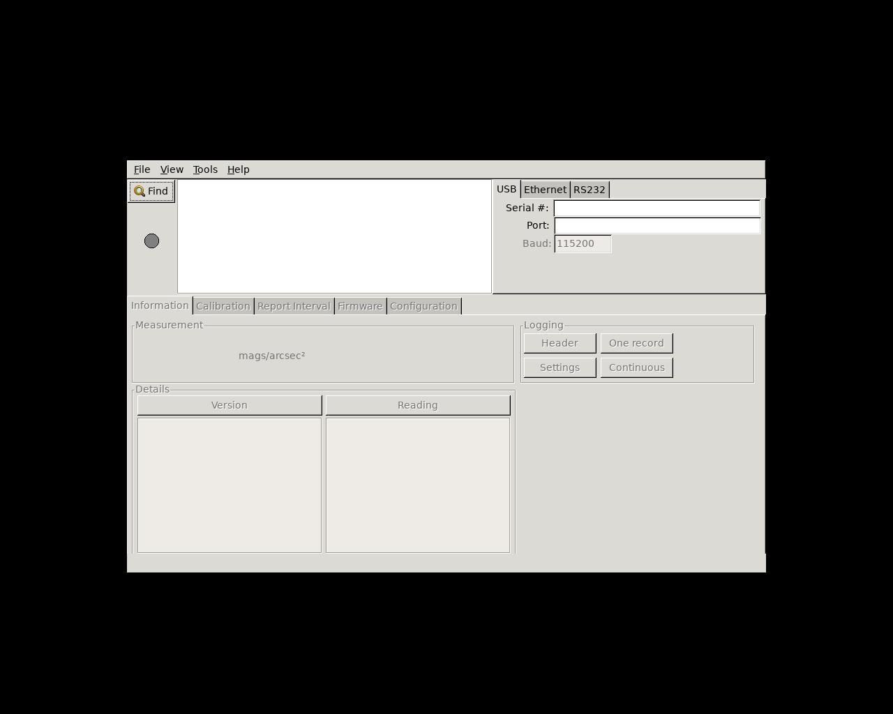 | [SHA256](./unihedron-device-manager/SHA256SUMS) | v1.5.2-amd64-nevm |
| [unison-2.53-gtk](./unison-2.53-gtk) | amd64  | ubuntu-noble | 2.53.3-2build2 |  | [SHA256](./unison-2.53-gtk/SHA256SUMS) | v1.5.2-amd64-nevm |
| [units-master](./units-master) | amd64  | ubuntu-noble | 4.2.1-1 |  | [SHA256](./units-master/SHA256SUMS) | v1.5.2-amd64-nevm |
| [unity-control-center](./unity-control-center) | amd64  | ubuntu-noble | 15.04.0+23.04.20230220-0ubuntu8-20250327 | 失败 | N/A | v1.5.2-amd64-nevm |
| [unity-lens-photos](./unity-lens-photos) | amd64  | ubuntu-noble | 1.0+17.10.20170605-0ubuntu9-20250327 | 失败 | N/A | v1.5.2-amd64-nevm |
| [unity-tweak-tool](./unity-tweak-tool) | amd64  | ubuntu-noble | 0.0.7+-0ubuntu11-20250327 | 失败 | N/A | v1.5.2-amd64-nevm |
| [unknown-horizons](./unknown-horizons) | amd64  | ubuntu-noble | 2019.1-7-20250327 | 失败 | [SHA256](./unknown-horizons/SHA256SUMS) | v1.5.2-amd64-nevm |
| [uos-ai](./uos-ai) | amd64  | deepin-v23 | 2.6.300-1-20250327 | 失败 | N/A | v1.5.3-amd64-nevm |
| [update-manager](./update-manager) | amd64  | ubuntu-noble | 24.04.9-20250327 | 失败 | N/A | v1.5.2-amd64-nevm |
| [uqm](./uqm) | amd64  | ubuntu-noble | 0.8.0+dfsg-2build2-20250327 | 失败 | [SHA256](./uqm/SHA256SUMS) | v1.5.2-amd64-nevm |
| [usb-creator-gtk](./usb-creator-gtk) | amd64  | ubuntu-noble | 0.3.17-20250327 | 失败 | N/A | v1.5.2-amd64-nevm |
| [usb-creator-kde](./usb-creator-kde) | amd64  | ubuntu-noble | 0.3.17-20250327 | 失败 | N/A | v1.5.2-amd64-nevm |
| [usbview](./usbview) | amd64  | ubuntu-noble | 3.1-1build2 |  | [SHA256](./usbview/SHA256SUMS) | v1.5.2-amd64-nevm |
| [usermode](./usermode) | amd64  | ubuntu-noble | 1.114-3build2 |    | [SHA256](./usermode/SHA256SUMS) | v1.5.2-amd64-nevm |
| [utox](./utox) | amd64  | ubuntu-noble | 0.18.1-1build4 |  | [SHA256](./utox/SHA256SUMS) | v1.5.2-amd64-nevm |
| [v-sim](./v-sim) | amd64  | ubuntu-noble | 3.7.2-9build3 |  | [SHA256](./v-sim/SHA256SUMS) | v1.5.2-amd64-nevm |
| [vagalume](./vagalume) | amd64  | ubuntu-noble | 0.8.6-3build4 |  | [SHA256](./vagalume/SHA256SUMS) | v1.5.2-amd64-nevm |
| [val-and-rick](./val-and-rick) | amd64  | ubuntu-noble | 0.1a.dfsg1-7 |  | [SHA256](./val-and-rick/SHA256SUMS) | v1.5.2-amd64-nevm |
| [vala-panel](./vala-panel) | amd64  | ubuntu-noble | 0.5.0-2build3 |  | [SHA256](./vala-panel/SHA256SUMS) | v1.5.2-amd64-nevm |
| [valentina](./valentina) | amd64  | ubuntu-noble | 0.7.52~dfsg-1build2 |  | [SHA256](./valentina/SHA256SUMS) | v1.5.2-amd64-nevm |
| [vanilla-gnome-default-settings](./vanilla-gnome-default-settings) | amd64  | ubuntu-noble | 23.04.0-20250327 | 失败 | N/A | v1.5.2-amd64-nevm |
| [variety](./variety) | amd64  | ubuntu-noble | 0.8.12-1-20250327 | 失败 | N/A | v1.5.2-amd64-nevm |
| [vcmi](./vcmi) | amd64  | ubuntu-noble | 1.4.1+dfsg-1build3 |  | [SHA256](./vcmi/SHA256SUMS) | v1.5.2-amd64-nevm |
| [vectoroids](./vectoroids) | amd64  | ubuntu-noble | 1.1.0-16 |  | [SHA256](./vectoroids/SHA256SUMS) | v1.5.2-amd64-nevm |
| [verbiste-gtk](./verbiste-gtk) | amd64  | ubuntu-noble | 0.1.48-1build3 |  | [SHA256](./verbiste-gtk/SHA256SUMS) | v1.5.2-amd64-nevm |
| [veroroute](./veroroute) | amd64  | ubuntu-noble | 2.38-1build2 |  | [SHA256](./veroroute/SHA256SUMS) | v1.5.2-amd64-nevm |
| [veusz](./veusz) | amd64  | ubuntu-noble | 3.6.2-1.1 |  | [SHA256](./veusz/SHA256SUMS) | v1.5.2-amd64-nevm |
| [veyon-configurator](./veyon-configurator) | amd64  | ubuntu-noble | 4.7.5+repack1-1ubuntu5 |  | [SHA256](./veyon-configurator/SHA256SUMS) | v1.5.2-amd64-nevm |
| [veyon-master](./veyon-master) | amd64  | ubuntu-noble | 4.7.5+repack1-1ubuntu5 |  | [SHA256](./veyon-master/SHA256SUMS) | v1.5.2-amd64-nevm |
| [viagee](./viagee) | amd64  | ubuntu-noble | 3.7.2-1ubuntu1-20250327 | 失败 | N/A | v1.5.2-amd64-nevm |
| [vice](./vice) | amd64  | ubuntu-noble | 3.7.1+dfsg1-2build3-20250327 | 失败 | [SHA256](./vice/SHA256SUMS) | v1.5.2-amd64-nevm |
| [video-downloader](./video-downloader) | amd64  | ubuntu-noble | 0.12.10-2-20250327 | 失败 | N/A | v1.5.2-amd64-nevm |
| [view3dscene](./view3dscene) | amd64  | ubuntu-noble | 4.2.0-4build2 |  | [SHA256](./view3dscene/SHA256SUMS) | v1.5.2-amd64-nevm |
| [viewnior](./viewnior) | amd64  | ubuntu-noble | 1.8-3build2 |  | [SHA256](./viewnior/SHA256SUMS) | v1.5.2-amd64-nevm |
| [vifm](./vifm) | amd64  | ubuntu-noble | 0.12-1build2-20250327 | 失败 | [SHA256](./vifm/SHA256SUMS) | v1.5.2-amd64-nevm |
| [viking](./viking) | amd64  | ubuntu-noble | 1.10-2build5 |  | [SHA256](./viking/SHA256SUMS) | v1.5.2-amd64-nevm |
| [vim-common](./vim-common) | amd64  | deepin-v23 | 9.1.0777-1deepin1-20250327 | 失败 | [SHA256](./vim-common/SHA256SUMS) | v1.5.2-amd64-nevm |
| [vim-gui-common](./vim-gui-common) | amd64  | deepin-v23 | 9.1.0777-1deepin1 |  | [SHA256](./vim-gui-common/SHA256SUMS) | v1.5.2-amd64-nevm |
| [vinagre](./vinagre) | amd64  | ubuntu-noble | 3.22.0-8ubuntu5 |  | [SHA256](./vinagre/SHA256SUMS) | v1.5.2-amd64-nevm |
| [vino](./vino) | amd64  | ubuntu-noble | 3.22.0-6ubuntu5-20250327 | 失败 | [SHA256](./vino/SHA256SUMS) | v1.5.2-amd64-nevm |
| [virt-manager](./virt-manager) | amd64  | ubuntu-noble | 4.1.0-3ubuntu0.1-20250327 | 失败 | N/A | v1.5.2-amd64-nevm |
| [virt-viewer](./virt-viewer) | amd64  | ubuntu-noble | 11.0-3build2 |  | [SHA256](./virt-viewer/SHA256SUMS) | v1.5.2-amd64-nevm |
| [virtualbox-qt](./virtualbox-qt) | amd64  | deepin-v23 | 7.0.20-dfsg-1 | 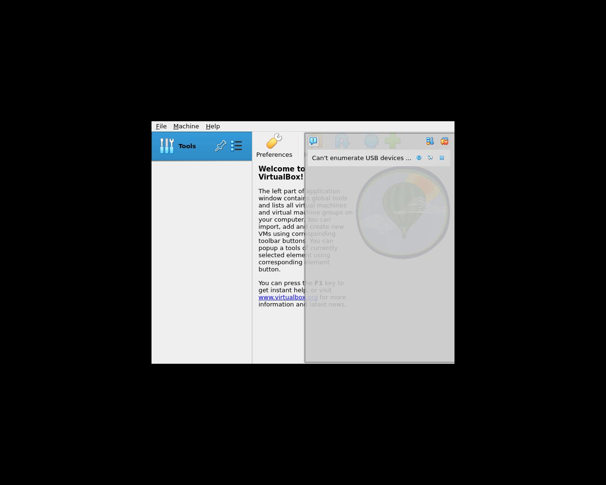 | [SHA256](./virtualbox-qt/SHA256SUMS) | v1.5.2-amd64-nevm |
| [virtualjaguar](./virtualjaguar) | amd64  | ubuntu-noble | 2.1.3-2build6 |  | [SHA256](./virtualjaguar/SHA256SUMS) | v1.5.2-amd64-nevm |
| [viruskiller](./viruskiller) | amd64  | ubuntu-noble | 1.03-1+dfsg1-2build1 |  | [SHA256](./viruskiller/SHA256SUMS) | v1.5.2-amd64-nevm |
| [visidata](./visidata) | amd64  | ubuntu-noble | 3.0.2-1-20250327 | 失败 | [SHA256](./visidata/SHA256SUMS) | v1.5.2-amd64-nevm |
| [visolate](./visolate) | amd64  | ubuntu-noble | 2.1.6~svn8+dfsg1-1.1build1-20250327 | 失败 | [SHA256](./visolate/SHA256SUMS) | v1.5.2-amd64-nevm |
| [visualvm](./visualvm) | amd64  | ubuntu-noble | 2.1.8-1 |  | [SHA256](./visualvm/SHA256SUMS) | v1.5.2-amd64-nevm |
| [vitables](./vitables) | amd64  | ubuntu-noble | 3.0.2-4-20250327 | 失败 | [SHA256](./vitables/SHA256SUMS) | v1.5.2-amd64-nevm |
| [vite](./vite) | amd64  | ubuntu-noble | 1.2+svn+git4.c6c0ce7-8build2 |  | [SHA256](./vite/SHA256SUMS) | v1.5.2-amd64-nevm |
| [vitetris](./vitetris) | amd64  | ubuntu-noble | 0.59.1-2-20250327 | 失败 | [SHA256](./vitetris/SHA256SUMS) | v1.5.2-amd64-nevm |
| [vkeybd](./vkeybd) | amd64  | ubuntu-noble | 0.1.18d-4build3-20250327 | 失败 | [SHA256](./vkeybd/SHA256SUMS) | v1.5.2-amd64-nevm |
| [vlc](./vlc) | amd64  | deepin-v23 | 3.0.21-2 |  | [SHA256](./vlc/SHA256SUMS) | v1.5.2-amd64-nevm |
| [vlc-plugin-bittorrent](./vlc-plugin-bittorrent) | amd64  | ubuntu-noble | 2.15-1build3-20250327 | 失败 | [SHA256](./vlc-plugin-bittorrent/SHA256SUMS) | v1.5.2-amd64-nevm |
| [vmg](./vmg) | amd64  | ubuntu-noble | 3.7.1-8build2 |  | [SHA256](./vmg/SHA256SUMS) | v1.5.2-amd64-nevm |
| [vmpk](./vmpk) | amd64  | ubuntu-noble | 0.9.0-1build2 |  | [SHA256](./vmpk/SHA256SUMS) | v1.5.2-amd64-nevm |
| [voctomix-gui](./voctomix-gui) | amd64  | ubuntu-noble | 1.3-6-20250327 | 失败 | N/A | v1.5.2-amd64-nevm |
| [vodovod](./vodovod) | amd64  | ubuntu-noble | 1.10-5 |  | [SHA256](./vodovod/SHA256SUMS) | v1.5.2-amd64-nevm |
| [vokoscreen-ng](./vokoscreen-ng) | amd64  | ubuntu-noble | 3.7.0-1build3 |  | [SHA256](./vokoscreen-ng/SHA256SUMS) | v1.5.2-amd64-nevm |
| [volumecontrol.app](./volumecontrol.app) | amd64  | ubuntu-noble | 0.8-1build6-20250327 | 失败 | [SHA256](./volumecontrol.app/SHA256SUMS) | v1.5.2-amd64-nevm |
| [vonsh](./vonsh) | amd64  | ubuntu-noble | 1.0+ds-0.1-20250327 | 失败 | [SHA256](./vonsh/SHA256SUMS) | v1.5.2-amd64-nevm |
| [vor](./vor) | amd64  | ubuntu-noble | 0.5.8-1 |  | [SHA256](./vor/SHA256SUMS) | v1.5.2-amd64-nevm |
| [vorta](./vorta) | amd64  | ubuntu-noble | 0.8.12-2 |  | [SHA256](./vorta/SHA256SUMS) | v1.5.2-amd64-nevm |
| [vprerex](./vprerex) | amd64  | deepin-v23 | 6.5.1-deepin1+rb1 |  | [SHA256](./vprerex/SHA256SUMS) | v1.5.2-amd64-nevm |
| [vvmplayer](./vvmplayer) | amd64  | ubuntu-noble | 2.5-1build1 |  | [SHA256](./vvmplayer/SHA256SUMS) | v1.5.2-amd64-nevm |
| [vym](./vym) | amd64  | ubuntu-noble | 2.6.11-3build3 |  | [SHA256](./vym/SHA256SUMS) | v1.5.2-amd64-nevm |
| [wadc](./wadc) | amd64  | ubuntu-noble | 3.1-1-20250327 | 失败 | [SHA256](./wadc/SHA256SUMS) | v1.5.2-amd64-nevm |
| [wallch](./wallch) | amd64  | ubuntu-noble | 4.0-0ubuntu12-20250327 | 失败 | [SHA256](./wallch/SHA256SUMS) | v1.5.2-amd64-nevm |
| [warmux](./warmux) | amd64  | ubuntu-noble | 11.04.1+repack2-4build4 |  | [SHA256](./warmux/SHA256SUMS) | v1.5.2-amd64-nevm |
| [warzone2100](./warzone2100) | amd64  | ubuntu-noble | 4.4.2-1build3 |  | [SHA256](./warzone2100/SHA256SUMS) | v1.5.2-amd64-nevm |
| [wavbreaker](./wavbreaker) | amd64  | ubuntu-noble | 0.16-3build3 |  | [SHA256](./wavbreaker/SHA256SUMS) | v1.5.2-amd64-nevm |
| [wavesurfer](./wavesurfer) | amd64  | ubuntu-noble | 1.8.8p5-1.1ubuntu1-20250327 | 失败 | [SHA256](./wavesurfer/SHA256SUMS) | v1.5.2-amd64-nevm |
| [wdisplays](./wdisplays) | amd64  | ubuntu-noble | 1.1.1-1build2 |  | [SHA256](./wdisplays/SHA256SUMS) | v1.5.2-amd64-nevm |
| [webcamoid](./webcamoid) | amd64  | ubuntu-noble | 9.1.1-1build6 |  | [SHA256](./webcamoid/SHA256SUMS) | v1.5.2-amd64-nevm |
| [webhttrack](./webhttrack) | amd64  | ubuntu-noble | 3.49.5-1build2-20250327 | 失败 | [SHA256](./webhttrack/SHA256SUMS) | v1.5.2-amd64-nevm |
| [webissues](./webissues) | amd64  | ubuntu-noble | 1.1.5-10build2 |  | [SHA256](./webissues/SHA256SUMS) | v1.5.2-amd64-nevm |
| [webscanserver](./webscanserver) | amd64  | deepin-v23 | 20240822.3.0.1933-20250327 | 失败 | [SHA256](./webscanserver/SHA256SUMS) | v1.5.2-amd64-nevm |
| [weka](./weka) | amd64  | ubuntu-noble | 3.6.14-4-20250327 | 失败 | [SHA256](./weka/SHA256SUMS) | v1.5.2-amd64-nevm |
| [welle.io](./welle.io) | amd64  | ubuntu-noble | 2.4+ds-2build5 |  | [SHA256](./welle.io/SHA256SUMS) | v1.5.2-amd64-nevm |
| [wesnoth-1.16-core](./wesnoth-1.16-core) | amd64  | ubuntu-noble | 1.16.11-1build3-20250327 | 失败 | [SHA256](./wesnoth-1.16-core/SHA256SUMS) | v1.5.2-amd64-nevm |
| [wfview](./wfview) | amd64  | ubuntu-noble | 1.64-2build2 |  | [SHA256](./wfview/SHA256SUMS) | v1.5.2-amd64-nevm |
| [whichwayisup](./whichwayisup) | amd64  | ubuntu-noble | 0.7.9-10-20250327 | 失败 | [SHA256](./whichwayisup/SHA256SUMS) | v1.5.2-amd64-nevm |
| [whowatch](./whowatch) | amd64  | ubuntu-noble | 1.8.6-1-20250327 | 失败 | [SHA256](./whowatch/SHA256SUMS) | v1.5.2-amd64-nevm |
| [widelands](./widelands) | amd64  | ubuntu-noble | 1.1-4build4-20250327 | 失败 | [SHA256](./widelands/SHA256SUMS) | v1.5.2-amd64-nevm |
| [wifi-qr](./wifi-qr) | amd64  | ubuntu-noble | 0.3-1-20250327 | 失败 | [SHA256](./wifi-qr/SHA256SUMS) | v1.5.2-amd64-nevm |
| [wike](./wike) | amd64  | ubuntu-noble | 2.1.0-1-20250327 | 失败 | N/A | v1.5.2-amd64-nevm |
| [winetricks](./winetricks) | amd64  | ubuntu-noble | 20240105-2-20250327 | 失败 | [SHA256](./winetricks/SHA256SUMS) | v1.5.2-amd64-nevm |
| [winff](./winff) | amd64  | ubuntu-noble | 1.6.3+dfsg-2build1 |  | [SHA256](./winff/SHA256SUMS) | v1.5.2-amd64-nevm |
| [wing](./wing) | amd64  | ubuntu-noble | 0.7-32build2-20250327 | 失败 | [SHA256](./wing/SHA256SUMS) | v1.5.2-amd64-nevm |
| [wings3d](./wings3d) | amd64  | ubuntu-noble | 2.3-1 |  | [SHA256](./wings3d/SHA256SUMS) | v1.5.2-amd64-nevm |
| [winmage-sane-backend](./winmage-sane-backend) | amd64  | deepin-v23 | 20200522-1.5.7.015-20250327 | 失败 | N/A | v1.5.2-amd64-nevm |
| [winmage-sane-backend-dual](./winmage-sane-backend-dual) | amd64  | deepin-v23 | 20240911-4.6.10.053 |  | [SHA256](./winmage-sane-backend-dual/SHA256SUMS) | v1.5.2-amd64-nevm |
| [wiredpanda](./wiredpanda) | amd64  | ubuntu-noble | 4.1.12-1build2 |  | [SHA256](./wiredpanda/SHA256SUMS) | v1.5.2-amd64-nevm |
| [wireshark](./wireshark) | amd64  | deepin-v23 | 4.4.0-1 |  | [SHA256](./wireshark/SHA256SUMS) | v1.5.2-amd64-nevm |
| [wizznic](./wizznic) | amd64  | ubuntu-noble | 0.9.9+dfsg-1-20250327 | 失败 | [SHA256](./wizznic/SHA256SUMS) | v1.5.2-amd64-nevm |
| [wmaker-common](./wmaker-common) | amd64  | ubuntu-noble | 0.96.0-2build3-20250327 | 失败 | [SHA256](./wmaker-common/SHA256SUMS) | v1.5.2-amd64-nevm |
| [wmauda](./wmauda) | amd64  | ubuntu-noble | 0.9-4build2 |  | [SHA256](./wmauda/SHA256SUMS) | v1.5.2-amd64-nevm |
| [wmbutton](./wmbutton) | amd64  | ubuntu-noble | 0.7.1-2-20250327 | 失败 | [SHA256](./wmbutton/SHA256SUMS) | v1.5.2-amd64-nevm |
| [wmcalc](./wmcalc) | amd64  | ubuntu-noble | 0.7-2-20250327 | 失败 | [SHA256](./wmcalc/SHA256SUMS) | v1.5.2-amd64-nevm |
| [wmdrawer](./wmdrawer) | amd64  | ubuntu-noble | 0.10.5-6.1build2-20250327 | 失败 | [SHA256](./wmdrawer/SHA256SUMS) | v1.5.2-amd64-nevm |
| [wmforecast](./wmforecast) | amd64  | ubuntu-noble | 1.9.0-1build2-20250327 | 失败 | [SHA256](./wmforecast/SHA256SUMS) | v1.5.2-amd64-nevm |
| [wmgtemp](./wmgtemp) | amd64  | ubuntu-noble | 1.2-3-20250327 | 失败 | [SHA256](./wmgtemp/SHA256SUMS) | v1.5.2-amd64-nevm |
| [wmgui](./wmgui) | amd64  | deepin-v23 | 0.6.91-4deepin1 |  | [SHA256](./wmgui/SHA256SUMS) | v1.5.2-amd64-nevm |
| [wmhdplop](./wmhdplop) | amd64  | ubuntu-noble | 0.9.12-1.1build2-20250327 | 失败 | [SHA256](./wmhdplop/SHA256SUMS) | v1.5.2-amd64-nevm |
| [wmifs](./wmifs) | amd64  | ubuntu-noble | 1.9-2-20250327 | 失败 | [SHA256](./wmifs/SHA256SUMS) | v1.5.2-amd64-nevm |
| [wmitime](./wmitime) | amd64  | ubuntu-noble | 0.5-3-20250327 | 失败 | [SHA256](./wmitime/SHA256SUMS) | v1.5.2-amd64-nevm |
| [wmix](./wmix) | amd64  | ubuntu-noble | 3.5-2build2-20250327 | 失败 | [SHA256](./wmix/SHA256SUMS) | v1.5.2-amd64-nevm |
| [wmmisc](./wmmisc) | amd64  | ubuntu-noble | 1.2-2-20250327 | 失败 | [SHA256](./wmmisc/SHA256SUMS) | v1.5.2-amd64-nevm |
| [wmmixer](./wmmixer) | amd64  | ubuntu-noble | 1.9-2-20250327 | 失败 | [SHA256](./wmmixer/SHA256SUMS) | v1.5.2-amd64-nevm |
| [wmmon](./wmmon) | amd64  | ubuntu-noble | 1.4-2-20250327 | 失败 | [SHA256](./wmmon/SHA256SUMS) | v1.5.2-amd64-nevm |
| [wmmoonclock](./wmmoonclock) | amd64  | ubuntu-noble | 1.30-2-20250327 | 失败 | [SHA256](./wmmoonclock/SHA256SUMS) | v1.5.2-amd64-nevm |
| [wmnut](./wmnut) | amd64  | ubuntu-noble | 0.69-1build2-20250327 | 失败 | [SHA256](./wmnut/SHA256SUMS) | v1.5.2-amd64-nevm |
| [wmshutdown](./wmshutdown) | amd64  | ubuntu-noble | 1.6-2build2 |  | [SHA256](./wmshutdown/SHA256SUMS) | v1.5.2-amd64-nevm |
| [wmsysmon](./wmsysmon) | amd64  | ubuntu-noble | 0.8.1-1-20250327 | 失败 | [SHA256](./wmsysmon/SHA256SUMS) | v1.5.2-amd64-nevm |
| [wmusic](./wmusic) | amd64  | ubuntu-noble | 2.1.1-1build2-20250327 | 失败 | [SHA256](./wmusic/SHA256SUMS) | v1.5.2-amd64-nevm |
| [wmweather](./wmweather) | amd64  | ubuntu-noble | 2.4.7-3build2-20250327 | 失败 | [SHA256](./wmweather/SHA256SUMS) | v1.5.2-amd64-nevm |
| [wolf4sdl](./wolf4sdl) | amd64  | ubuntu-noble | 20230117-1-20250327 | 失败 | [SHA256](./wolf4sdl/SHA256SUMS) | v1.5.2-amd64-nevm |
| [woof-doom](./woof-doom) | amd64  | ubuntu-noble | 14.1.0+dfsg-1build1 |   | [SHA256](./woof-doom/SHA256SUMS) | v1.5.2-amd64-nevm |
| [wordgrinder-x11](./wordgrinder-x11) | amd64  | ubuntu-noble | 0.8-1build2-20250327 | 失败 | [SHA256](./wordgrinder-x11/SHA256SUMS) | v1.5.2-amd64-nevm |
| [wordnet-gui](./wordnet-gui) | amd64  | ubuntu-noble | 3.0-37-20250327 | 失败 | [SHA256](./wordnet-gui/SHA256SUMS) | v1.5.2-amd64-nevm |
| [wordwarvi](./wordwarvi) | amd64  | ubuntu-noble | 1.0.4-2build3 |  | [SHA256](./wordwarvi/SHA256SUMS) | v1.5.2-amd64-nevm |
| [worker](./worker) | amd64  | ubuntu-noble | 4.12.1-1build2-20250327 | 失败 | [SHA256](./worker/SHA256SUMS) | v1.5.2-amd64-nevm |
| [workrave](./workrave) | amd64  | ubuntu-noble | 1.10.52-2ubuntu1 |  | [SHA256](./workrave/SHA256SUMS) | v1.5.2-amd64-nevm |
| [wpagui](./wpagui) | amd64  | deepin-v23 | 2.10-deepin1 |  | [SHA256](./wpagui/SHA256SUMS) | v1.5.2-amd64-nevm |
| [wrapperfactory.app](./wrapperfactory.app) | amd64  | ubuntu-noble | 0.1.0-5build5-20250327 | 失败 | [SHA256](./wrapperfactory.app/SHA256SUMS) | v1.5.2-amd64-nevm |
| [wsjtx](./wsjtx) | amd64  | ubuntu-noble | 2.7.0~rc3+repack-1build2-20250327 | 失败 | [SHA256](./wsjtx/SHA256SUMS) | v1.5.2-amd64-nevm |
| [wxglade](./wxglade) | amd64  | ubuntu-noble | 1.0.5+repack-2-20250327 | 失败 | [SHA256](./wxglade/SHA256SUMS) | v1.5.2-amd64-nevm |
| [wxhexeditor](./wxhexeditor) | amd64  | ubuntu-noble | 0.24+repack-2build3 |  | [SHA256](./wxhexeditor/SHA256SUMS) | v1.5.2-amd64-nevm |
| [wxmaxima](./wxmaxima) | amd64  | ubuntu-noble | 24.02.1-1build2 |  | [SHA256](./wxmaxima/SHA256SUMS) | v1.5.2-amd64-nevm |
| [x-tile](./x-tile) | amd64  | ubuntu-noble | 3.3+git20220708.9ec59c9-1-20250327 | 失败 | N/A | v1.5.2-amd64-nevm |
| [x11vnc](./x11vnc) | amd64  | ubuntu-noble | 0.9.16-10-20250327 | 失败 | [SHA256](./x11vnc/SHA256SUMS) | v1.5.2-amd64-nevm |
| [x2goclient](./x2goclient) | amd64  | ubuntu-noble | 4.1.2.3-1build3 |  | [SHA256](./x2goclient/SHA256SUMS) | v1.5.2-amd64-nevm |
| [x2godesktopsharing](./x2godesktopsharing) | amd64  | ubuntu-noble | 3.2.0.0-2build3-20250327 | 失败 | [SHA256](./x2godesktopsharing/SHA256SUMS) | v1.5.2-amd64-nevm |
| [x2goserver-fmbindings](./x2goserver-fmbindings) | amd64  | ubuntu-noble | 4.1.0.6-1.1build1-20250327 | 失败 | [SHA256](./x2goserver-fmbindings/SHA256SUMS) | v1.5.2-amd64-nevm |
| [x2gothinclient-minidesktop](./x2gothinclient-minidesktop) | amd64  | ubuntu-noble | 1.5.0.1-10build2-20250327 | 失败 | N/A | v1.5.2-amd64-nevm |
| [x3270](./x3270) | amd64  | ubuntu-noble | 4.1ga10-1.1build2-20250327 | 失败 | [SHA256](./x3270/SHA256SUMS) | v1.5.2-amd64-nevm |
| [xabacus](./xabacus) | amd64  | ubuntu-noble | 8.5.1-1build2-20250327 | 失败 | [SHA256](./xabacus/SHA256SUMS) | v1.5.2-amd64-nevm |
| [xaos](./xaos) | amd64  | ubuntu-noble | 4.3.2-1build2 |  | [SHA256](./xaos/SHA256SUMS) | v1.5.2-amd64-nevm |
| [xarchiver](./xarchiver) | amd64  | ubuntu-noble | 0.5.4.22-1build2 |  | [SHA256](./xarchiver/SHA256SUMS) | v1.5.2-amd64-nevm |
| [xastir](./xastir) | amd64  | ubuntu-noble | 2.2.0-1build4-20250327 | 失败 | [SHA256](./xastir/SHA256SUMS) | v1.5.2-amd64-nevm |
| [xball](./xball) | amd64  | ubuntu-noble | 3.0.1+dfsg-1build2-20250327 | 失败 | [SHA256](./xball/SHA256SUMS) | v1.5.2-amd64-nevm |
| [xbill](./xbill) | amd64  | ubuntu-noble | 2.1-9ubuntu1-20250327 | 失败 | [SHA256](./xbill/SHA256SUMS) | v1.5.2-amd64-nevm |
| [xboard](./xboard) | amd64  | ubuntu-noble | 4.9.1-2build3 |  | [SHA256](./xboard/SHA256SUMS) | v1.5.2-amd64-nevm |
| [xbomb](./xbomb) | amd64  | ubuntu-noble | 2.2b-1build3-20250327 | 失败 | [SHA256](./xbomb/SHA256SUMS) | v1.5.2-amd64-nevm |
| [xca](./xca) | amd64  | ubuntu-noble | 2.5.0-1ubuntu2 |  | [SHA256](./xca/SHA256SUMS) | v1.5.2-amd64-nevm |
| [xcas](./xcas) | amd64  | ubuntu-noble | 1.9.0.93+dfsg2-2 |  | [SHA256](./xcas/SHA256SUMS) | v1.5.2-amd64-nevm |
| [xcfa](./xcfa) | amd64  | ubuntu-noble | 5.0.2-2build3 |  | [SHA256](./xcfa/SHA256SUMS) | v1.5.2-amd64-nevm |
| [xchm](./xchm) | amd64  | ubuntu-noble | 1.36-1build2 |  | [SHA256](./xchm/SHA256SUMS) | v1.5.2-amd64-nevm |
| [xcrysden](./xcrysden) | amd64  | ubuntu-noble | 1.6.2-4-20250327 | 失败 | [SHA256](./xcrysden/SHA256SUMS) | v1.5.2-amd64-nevm |
| [xcwcp](./xcwcp) | amd64  | ubuntu-noble | 3.6.0-6.1build2-20250327 | 失败 | [SHA256](./xcwcp/SHA256SUMS) | v1.5.2-amd64-nevm |
| [xdaliclock](./xdaliclock) | amd64  | ubuntu-noble | 2.48-1build2 |  | [SHA256](./xdaliclock/SHA256SUMS) | v1.5.2-amd64-nevm |
| [xdemineur](./xdemineur) | amd64  | ubuntu-noble | 2.1.1-21-20250327 | 失败 | [SHA256](./xdemineur/SHA256SUMS) | v1.5.2-amd64-nevm |
| [xdesktopwaves](./xdesktopwaves) | amd64  | ubuntu-noble | 1.3-4.1-20250327 | 失败 | [SHA256](./xdesktopwaves/SHA256SUMS) | v1.5.2-amd64-nevm |
| [xdg-desktop-portal-gnome](./xdg-desktop-portal-gnome) | amd64  | ubuntu-noble | 46.2-0ubuntu1-20250327 | 失败 | [SHA256](./xdg-desktop-portal-gnome/SHA256SUMS) | v1.5.2-amd64-nevm |
| [xdg-desktop-portal-gtk](./xdg-desktop-portal-gtk) | amd64  | ubuntu-noble | 1.15.1-1build2-20250327 | 失败 | [SHA256](./xdg-desktop-portal-gtk/SHA256SUMS) | v1.5.2-amd64-nevm |
| [xdg-desktop-portal-kde](./xdg-desktop-portal-kde) | amd64  | ubuntu-noble | 5.27.11-0ubuntu3-20250327 | 失败 | [SHA256](./xdg-desktop-portal-kde/SHA256SUMS) | v1.5.2-amd64-nevm |
| [xdg-desktop-portal-lxqt](./xdg-desktop-portal-lxqt) | amd64  | ubuntu-noble | 0.5.0-0ubuntu6-20250327 | 失败 | N/A | v1.5.2-amd64-nevm |
| [xdg-desktop-portal-xapp](./xdg-desktop-portal-xapp) | amd64  | ubuntu-noble | 1.0.4-1build2-20250327 | 失败 | N/A | v1.5.2-amd64-nevm |
| [xdiagnose](./xdiagnose) | amd64  | ubuntu-noble | 3.8.12~24.04.1-20250327 | 失败 | N/A | v1.5.2-amd64-nevm |
| [xdot](./xdot) | amd64  | ubuntu-noble | 1.3-1-20250327 | 失败 | N/A | v1.5.2-amd64-nevm |
| [xdrawchem](./xdrawchem) | amd64  | ubuntu-noble | 1.11.0-4build2 |  | [SHA256](./xdrawchem/SHA256SUMS) | v1.5.2-amd64-nevm |
| [xdx](./xdx) | amd64  | ubuntu-noble | 2.91-2build2 |  | [SHA256](./xdx/SHA256SUMS) | v1.5.2-amd64-nevm |
| [xfburn](./xfburn) | amd64  | ubuntu-noble | 0.7.0-1build2 |  | [SHA256](./xfburn/SHA256SUMS) | v1.5.2-amd64-nevm |
| [xfce4-appfinder](./xfce4-appfinder) | amd64  | ubuntu-noble | 4.18.0-1build2 |   | [SHA256](./xfce4-appfinder/SHA256SUMS) | v1.5.2-amd64-nevm |
| [xfce4-clipman](./xfce4-clipman) | amd64  | ubuntu-noble | 1.6.5-1build2 |  | [SHA256](./xfce4-clipman/SHA256SUMS) | v1.5.2-amd64-nevm |
| [xfce4-dict](./xfce4-dict) | amd64  | ubuntu-noble | 0.8.6-1build2 |  | [SHA256](./xfce4-dict/SHA256SUMS) | v1.5.2-amd64-nevm |
| [xfce4-notes](./xfce4-notes) | amd64  | ubuntu-noble | 1.10.0-1build2 |  | [SHA256](./xfce4-notes/SHA256SUMS) | v1.5.2-amd64-nevm |
| [xfce4-notifyd](./xfce4-notifyd) | amd64  | ubuntu-noble | 0.9.4-1 |  | [SHA256](./xfce4-notifyd/SHA256SUMS) | v1.5.2-amd64-nevm |
| [xfce4-panel](./xfce4-panel) | amd64  | ubuntu-noble | 4.18.4-1ubuntu0.1 |  | [SHA256](./xfce4-panel/SHA256SUMS) | v1.5.2-amd64-nevm |
| [xfce4-panel-profiles](./xfce4-panel-profiles) | amd64  | ubuntu-noble | 1.0.14-1-20250327 | 失败 | N/A | v1.5.2-amd64-nevm |
| [xfce4-power-manager](./xfce4-power-manager) | amd64  | ubuntu-noble | 4.18.3-2build3 |  | [SHA256](./xfce4-power-manager/SHA256SUMS) | v1.5.2-amd64-nevm |
| [xfce4-screensaver](./xfce4-screensaver) | amd64  | ubuntu-noble | 4.18.3-1build1 |     | [SHA256](./xfce4-screensaver/SHA256SUMS) | v1.5.2-amd64-nevm |
| [xfce4-screenshooter](./xfce4-screenshooter) | amd64  | ubuntu-noble | 1.10.5-1build1 |  | [SHA256](./xfce4-screenshooter/SHA256SUMS) | v1.5.2-amd64-nevm |
| [xfce4-sensors-plugin](./xfce4-sensors-plugin) | amd64  | ubuntu-noble | 1.4.4-1build2 |  | [SHA256](./xfce4-sensors-plugin/SHA256SUMS) | v1.5.2-amd64-nevm |
| [xfce4-session](./xfce4-session) | amd64  | ubuntu-noble | 4.18.3-1build2 |   | [SHA256](./xfce4-session/SHA256SUMS) | v1.5.2-amd64-nevm |
| [xfce4-settings](./xfce4-settings) | amd64  | ubuntu-noble | 4.18.4-0ubuntu3 |          | [SHA256](./xfce4-settings/SHA256SUMS) | v1.5.2-amd64-nevm |
| [xfce4-taskmanager](./xfce4-taskmanager) | amd64  | ubuntu-noble | 1.5.7-1build1 |  | [SHA256](./xfce4-taskmanager/SHA256SUMS) | v1.5.2-amd64-nevm |
| [xfce4-terminal](./xfce4-terminal) | amd64  | ubuntu-noble | 1.1.3-1build1 |   | [SHA256](./xfce4-terminal/SHA256SUMS) | v1.5.2-amd64-nevm |
| [xfdashboard](./xfdashboard) | amd64  | ubuntu-noble | 1.0.0-0ubuntu3 |   | [SHA256](./xfdashboard/SHA256SUMS) | v1.5.2-amd64-nevm |
| [xfdesktop4](./xfdesktop4) | amd64  | ubuntu-noble | 4.18.1-1build3 |  | [SHA256](./xfdesktop4/SHA256SUMS) | v1.5.2-amd64-nevm |
| [xfe](./xfe) | amd64  | ubuntu-noble | 1.45-2-20250327 | 失败 | [SHA256](./xfe/SHA256SUMS) | v1.5.2-amd64-nevm |
| [xfig](./xfig) | amd64  | ubuntu-noble | 3.2.9-2build3-20250327 | 失败 | [SHA256](./xfig/SHA256SUMS) | v1.5.2-amd64-nevm |
| [xfwm4](./xfwm4) | amd64  | ubuntu-noble | 4.18.0-1build3 |  | [SHA256](./xfwm4/SHA256SUMS) | v1.5.2-amd64-nevm |
| [xgalaga++](./xgalaga++) | amd64  | ubuntu-noble | 0.9-2build1-20250327 | 失败 | [SHA256](./xgalaga++/SHA256SUMS) | v1.5.2-amd64-nevm |
| [xgalaga](./xgalaga) | amd64  | ubuntu-noble | 2.1.1.0-6-20250327 | 失败 | [SHA256](./xgalaga/SHA256SUMS) | v1.5.2-amd64-nevm |
| [xhtml2ps](./xhtml2ps) | amd64  | deepin-v23 | 1.0b7-6-20250327 | 失败 | [SHA256](./xhtml2ps/SHA256SUMS) | v1.5.2-amd64-nevm |
| [xine-ui](./xine-ui) | amd64  | ubuntu-noble | 0.99.14+hg20240403-1-20250327 | 失败 | [SHA256](./xine-ui/SHA256SUMS) | v1.5.2-amd64-nevm |
| [xineliboutput-fbfe](./xineliboutput-fbfe) | amd64  | ubuntu-noble | 2.2.0+git20211212-2.2build1-20250327 | 失败 | [SHA256](./xineliboutput-fbfe/SHA256SUMS) | v1.5.2-amd64-nevm |
| [xineliboutput-sxfe](./xineliboutput-sxfe) | amd64  | ubuntu-noble | 2.2.0+git20211212-2.2build1-20250327 | 失败 | [SHA256](./xineliboutput-sxfe/SHA256SUMS) | v1.5.2-amd64-nevm |
| [xineliboutput-wlfe](./xineliboutput-wlfe) | amd64  | ubuntu-noble | 2.2.0+git20211212-2.2build1-20250327 | 失败 | [SHA256](./xineliboutput-wlfe/SHA256SUMS) | v1.5.2-amd64-nevm |
| [xinput-calibrator](./xinput-calibrator) | amd64  | ubuntu-noble | 0.7.5+git20140201-1build2-20250327 | 失败 | [SHA256](./xinput-calibrator/SHA256SUMS) | v1.5.2-amd64-nevm |
| [xiphos](./xiphos) | amd64  | ubuntu-noble | 4.2.1+dfsg1-8build3 |  | [SHA256](./xiphos/SHA256SUMS) | v1.5.2-amd64-nevm |
| [xiterm+thai](./xiterm+thai) | amd64  | ubuntu-noble | 1.10-2build1-20250327 | 失败 | [SHA256](./xiterm+thai/SHA256SUMS) | v1.5.2-amd64-nevm |
| [xjadeo](./xjadeo) | amd64  | ubuntu-noble | 0.8.12-1build4-20250327 | 失败 | [SHA256](./xjadeo/SHA256SUMS) | v1.5.2-amd64-nevm |
| [xjed](./xjed) | amd64  | ubuntu-noble | 0.99.20~pre.180+dfsg-2-20250327 | 失败 | [SHA256](./xjed/SHA256SUMS) | v1.5.2-amd64-nevm |
| [xjump](./xjump) | amd64  | ubuntu-noble | 2.7.5-6.2build3-20250327 | 失败 | [SHA256](./xjump/SHA256SUMS) | v1.5.2-amd64-nevm |
| [xkeycaps](./xkeycaps) | amd64  | ubuntu-noble | 2.47-7build3-20250327 | 失败 | [SHA256](./xkeycaps/SHA256SUMS) | v1.5.2-amd64-nevm |
| [xlog](./xlog) | amd64  | ubuntu-noble | 2.0.24-3build2 |  | [SHA256](./xlog/SHA256SUMS) | v1.5.2-amd64-nevm |
| [xmabacus](./xmabacus) | amd64  | ubuntu-noble | 8.5.1-1build2-20250327 | 失败 | [SHA256](./xmabacus/SHA256SUMS) | v1.5.2-amd64-nevm |
| [xmahjongg](./xmahjongg) | amd64  | ubuntu-noble | 3.7-5-20250327 | 失败 | [SHA256](./xmahjongg/SHA256SUMS) | v1.5.2-amd64-nevm |
| [xmakemol](./xmakemol) | amd64  | ubuntu-noble | 5.16-10build3-20250327 | 失败 | [SHA256](./xmakemol/SHA256SUMS) | v1.5.2-amd64-nevm |
| [xmakemol-gl](./xmakemol-gl) | amd64  | ubuntu-noble | 5.16-10build3-20250327 | 失败 | [SHA256](./xmakemol-gl/SHA256SUMS) | v1.5.2-amd64-nevm |
| [xmaxima](./xmaxima) | amd64  | ubuntu-noble | 5.46.0-11build3-20250327 | 失败 | [SHA256](./xmaxima/SHA256SUMS) | v1.5.2-amd64-nevm |
| [xmlcopyeditor](./xmlcopyeditor) | amd64  | ubuntu-noble | 1.3.0.0-1.1build3 |  | [SHA256](./xmlcopyeditor/SHA256SUMS) | v1.5.2-amd64-nevm |
| [xmonad](./xmonad) | amd64  | ubuntu-noble | 0.17.2-1ubuntu2-20250327 | 失败 | [SHA256](./xmonad/SHA256SUMS) | v1.5.2-amd64-nevm |
| [xmotd](./xmotd) | amd64  | ubuntu-noble | 1.17.3b-11build2-20250327 | 失败 | [SHA256](./xmotd/SHA256SUMS) | v1.5.2-amd64-nevm |
| [xmoto](./xmoto) | amd64  | ubuntu-noble | 0.6.2+repack-2build3 |  | [SHA256](./xmoto/SHA256SUMS) | v1.5.2-amd64-nevm |
| [xmountains](./xmountains) | amd64  | ubuntu-noble | 2.10-2-20250327 | 失败 | [SHA256](./xmountains/SHA256SUMS) | v1.5.2-amd64-nevm |
| [xmpsolve](./xmpsolve) | amd64  | ubuntu-noble | 3.2.1-10.1build4 |  | [SHA256](./xmpsolve/SHA256SUMS) | v1.5.2-amd64-nevm |
| [xmpuzzles](./xmpuzzles) | amd64  | ubuntu-noble | 7.7.1-1.2build2-20250327 | 失败 | [SHA256](./xmpuzzles/SHA256SUMS) | v1.5.2-amd64-nevm |
| [xnec2c](./xnec2c) | amd64  | ubuntu-noble | 4.4.12-2build2 |  | [SHA256](./xnec2c/SHA256SUMS) | v1.5.2-amd64-nevm |
| [xonix](./xonix) | amd64  | ubuntu-noble | 1.4-35build2-20250327 | 失败 | [SHA256](./xonix/SHA256SUMS) | v1.5.2-amd64-nevm |
| [xoscope](./xoscope) | amd64  | ubuntu-noble | 2.3-1build3 |  | [SHA256](./xoscope/SHA256SUMS) | v1.5.2-amd64-nevm |
| [xosview](./xosview) | amd64  | ubuntu-noble | 1.24-1-20250327 | 失败 | [SHA256](./xosview/SHA256SUMS) | v1.5.2-amd64-nevm |
| [xournal](./xournal) | amd64  | ubuntu-noble | 0.4.8.2016-7build4 |  | [SHA256](./xournal/SHA256SUMS) | v1.5.2-amd64-nevm |
| [xournalpp](./xournalpp) | amd64  | ubuntu-noble | 1.2.2-2build3 |  | [SHA256](./xournalpp/SHA256SUMS) | v1.5.2-amd64-nevm |
| [xpad](./xpad) | amd64  | ubuntu-noble | 5.8.0-1build2 |  | [SHA256](./xpad/SHA256SUMS) | v1.5.2-amd64-nevm |
| [xpaint](./xpaint) | amd64  | ubuntu-noble | 2.9.1.4-4.1build2-20250327 | 失败 | [SHA256](./xpaint/SHA256SUMS) | v1.5.2-amd64-nevm |
| [xpdf](./xpdf) | amd64  | ubuntu-noble | 3.04+git20240202-1build3-20250327 | 失败 | [SHA256](./xpdf/SHA256SUMS) | v1.5.2-amd64-nevm |
| [xpenguins](./xpenguins) | amd64  | ubuntu-noble | 3.2.1-2 |  | [SHA256](./xpenguins/SHA256SUMS) | v1.5.2-amd64-nevm |
| [xperia-flashtool](./xperia-flashtool) | amd64  | ubuntu-noble | 0.9.34+ds-1-20250327 | 失败 | [SHA256](./xperia-flashtool/SHA256SUMS) | v1.5.2-amd64-nevm |
| [xpra](./xpra) | amd64  | ubuntu-noble | 3.1.5+dfsg1-0.2ubuntu1-20250327 | 失败 | N/A | v1.5.2-amd64-nevm |
| [xpuzzles](./xpuzzles) | amd64  | ubuntu-noble | 7.7.1-1.2build2-20250327 | 失败 | [SHA256](./xpuzzles/SHA256SUMS) | v1.5.2-amd64-nevm |
| [xqf](./xqf) | amd64  | ubuntu-noble | 1.0.6-5build2 |  | [SHA256](./xqf/SHA256SUMS) | v1.5.2-amd64-nevm |
| [xrdesktop](./xrdesktop) | amd64  | ubuntu-noble | 0.15.1-5.1build3-20250327 | 失败 | [SHA256](./xrdesktop/SHA256SUMS) | v1.5.2-amd64-nevm |
| [xsane](./xsane) | amd64  | deepin-v23 | 0.999-12.1 |  | [SHA256](./xsane/SHA256SUMS) | v1.5.2-amd64-nevm |
| [xscavenger](./xscavenger) | amd64  | ubuntu-noble | 1.4.5-6-20250327 | 失败 | [SHA256](./xscavenger/SHA256SUMS) | v1.5.2-amd64-nevm |
| [xscreensaver](./xscreensaver) | amd64  | ubuntu-noble | 6.08+dfsg1-1ubuntu3 | 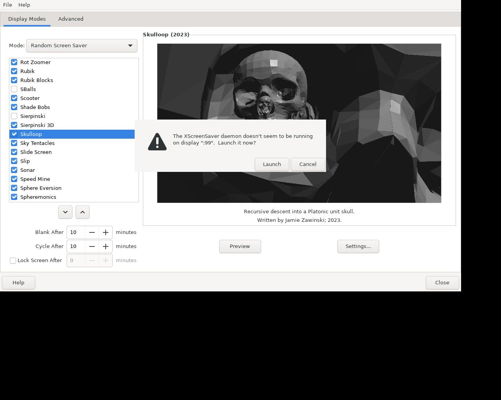 | [SHA256](./xscreensaver/SHA256SUMS) | v1.5.2-amd64-nevm |
| [xscreensaver-data](./xscreensaver-data) | amd64  | ubuntu-noble | 6.08+dfsg1-1ubuntu3-20250327 | 失败 | [SHA256](./xscreensaver-data/SHA256SUMS) | v1.5.2-amd64-nevm |
| [xscreensaver-data-extra](./xscreensaver-data-extra) | amd64  | ubuntu-noble | 6.08+dfsg1-1ubuntu3-20250327 | 失败 | [SHA256](./xscreensaver-data-extra/SHA256SUMS) | v1.5.2-amd64-nevm |
| [xscreensaver-gl](./xscreensaver-gl) | amd64  | ubuntu-noble | 6.08+dfsg1-1ubuntu3-20250327 | 失败 | [SHA256](./xscreensaver-gl/SHA256SUMS) | v1.5.2-amd64-nevm |
| [xscreensaver-gl-extra](./xscreensaver-gl-extra) | amd64  | ubuntu-noble | 6.08+dfsg1-1ubuntu3-20250327 | 失败 | [SHA256](./xscreensaver-gl-extra/SHA256SUMS) | v1.5.2-amd64-nevm |
| [xscreensaver-screensaver-bsod](./xscreensaver-screensaver-bsod) | amd64  | ubuntu-noble | 6.08+dfsg1-1ubuntu3-20250327 | 失败 | [SHA256](./xscreensaver-screensaver-bsod/SHA256SUMS) | v1.5.2-amd64-nevm |
| [xscreensaver-screensaver-webcollage](./xscreensaver-screensaver-webcollage) | amd64  | ubuntu-noble | 6.08+dfsg1-1ubuntu3-20250327 | 失败 | N/A | v1.5.2-amd64-nevm |
| [xsddiagram](./xsddiagram) | amd64  | ubuntu-noble | 1.0-2-20250327 | 失败 | [SHA256](./xsddiagram/SHA256SUMS) | v1.5.2-amd64-nevm |
| [xsensors](./xsensors) | amd64  | ubuntu-noble | 0.80-1build2-20250327 | 失败 | [SHA256](./xsensors/SHA256SUMS) | v1.5.2-amd64-nevm |
| [xshisen](./xshisen) | amd64  | ubuntu-noble | 1.51-8-20250327 | 失败 | [SHA256](./xshisen/SHA256SUMS) | v1.5.2-amd64-nevm |
| [xshogi](./xshogi) | amd64  | ubuntu-noble | 1.4.2-2ubuntu1-20250327 | 失败 | [SHA256](./xshogi/SHA256SUMS) | v1.5.2-amd64-nevm |
| [xskat](./xskat) | amd64  | ubuntu-noble | 4.0-8-20250327 | 失败 | [SHA256](./xskat/SHA256SUMS) | v1.5.2-amd64-nevm |
| [xsnow](./xsnow) | amd64  | ubuntu-noble | 3.7.8-1build2 |  | [SHA256](./xsnow/SHA256SUMS) | v1.5.2-amd64-nevm |
| [xsok](./xsok) | amd64  | ubuntu-noble | 1.02-19build2-20250327 | 失败 | [SHA256](./xsok/SHA256SUMS) | v1.5.2-amd64-nevm |
| [xsol](./xsol) | amd64  | ubuntu-noble | 0.31-15build2-20250327 | 失败 | [SHA256](./xsol/SHA256SUMS) | v1.5.2-amd64-nevm |
| [xsoldier](./xsoldier) | amd64  | ubuntu-noble | 1.8-6 |  | [SHA256](./xsoldier/SHA256SUMS) | v1.5.2-amd64-nevm |
| [xtel](./xtel) | amd64  | ubuntu-noble | 3.3.0-26build2-20250327 | 失败 | [SHA256](./xtel/SHA256SUMS) | v1.5.2-amd64-nevm |
| [xterm](./xterm) | amd64  | ubuntu-noble | 390-1ubuntu3 |   | [SHA256](./xterm/SHA256SUMS) | v1.5.2-amd64-nevm |
| [xtrkcad](./xtrkcad) | amd64  | ubuntu-noble | 5.2.0Beta2.1-2 |  | [SHA256](./xtrkcad/SHA256SUMS) | v1.5.2-amd64-nevm |
| [xubuntu-default-settings](./xubuntu-default-settings) | amd64  | ubuntu-noble | 24.04.4-20250327 | 失败 | [SHA256](./xubuntu-default-settings/SHA256SUMS) | v1.5.2-amd64-nevm |
| [xubuntu-live-settings](./xubuntu-live-settings) | amd64  | ubuntu-noble | 24.04.4-20250327 | 失败 | [SHA256](./xubuntu-live-settings/SHA256SUMS) | v1.5.2-amd64-nevm |
| [xvattr](./xvattr) | amd64  | ubuntu-noble | 1.3-0.6ubuntu4 |  | [SHA256](./xvattr/SHA256SUMS) | v1.5.2-amd64-nevm |
| [xvile](./xvile) | amd64  | ubuntu-noble | 9.8z-1build2-20250327 | 失败 | [SHA256](./xvile/SHA256SUMS) | v1.5.2-amd64-nevm |
| [xvkbd](./xvkbd) | amd64  | ubuntu-noble | 4.1-2build2-20250327 | 失败 | [SHA256](./xvkbd/SHA256SUMS) | v1.5.2-amd64-nevm |
| [xwayland](./xwayland) | amd64  | deepin-v23 | 24.1.4-0deepin-20250327 | 失败 | [SHA256](./xwayland/SHA256SUMS) | v1.5.2-amd64-nevm |
| [xwelltris](./xwelltris) | amd64  | ubuntu-noble | 1.0.1-18 |  | [SHA256](./xwelltris/SHA256SUMS) | v1.5.2-amd64-nevm |
| [xye](./xye) | amd64  | ubuntu-noble | 0.12.2+dfsg-12 |  | [SHA256](./xye/SHA256SUMS) | v1.5.2-amd64-nevm |
| [xygrib](./xygrib) | amd64  | ubuntu-noble | 1.2.6.1-3build3 |  | [SHA256](./xygrib/SHA256SUMS) | v1.5.2-amd64-nevm |
| [xyscan](./xyscan) | amd64  | ubuntu-noble | 4.64-2build3 |  | [SHA256](./xyscan/SHA256SUMS) | v1.5.2-amd64-nevm |
| [xzgv](./xzgv) | amd64  | ubuntu-noble | 0.9.2-2build3 |  | [SHA256](./xzgv/SHA256SUMS) | v1.5.2-amd64-nevm |
| [xzoom](./xzoom) | amd64  | ubuntu-noble | 0.3-27-20250327 | 失败 | [SHA256](./xzoom/SHA256SUMS) | v1.5.2-amd64-nevm |
| [yabause-qt](./yabause-qt) | amd64  | ubuntu-noble | 0.9.15-3build2 |  | [SHA256](./yabause-qt/SHA256SUMS) | v1.5.2-amd64-nevm |
| [yad](./yad) | amd64  | ubuntu-noble | 0.40.0-1build3 |  | [SHA256](./yad/SHA256SUMS) | v1.5.2-amd64-nevm |
| [yagf](./yagf) | amd64  | ubuntu-noble | 0.9.5+repack1-1build2-20250327 | 失败 | N/A | v1.5.2-amd64-nevm |
| [yagv](./yagv) | amd64  | ubuntu-noble | 0.4~20171211.r234ef16+dfsg-2-20250327 | 失败 | [SHA256](./yagv/SHA256SUMS) | v1.5.2-amd64-nevm |
| [yakuake](./yakuake) | amd64  | ubuntu-noble | 23.08.5-0ubuntu3-20250327 | 失败 | [SHA256](./yakuake/SHA256SUMS) | v1.5.2-amd64-nevm |
| [yambar](./yambar) | amd64  | ubuntu-noble | 1.10.0-1build2-20250327 | 失败 | [SHA256](./yambar/SHA256SUMS) | v1.5.2-amd64-nevm |
| [yapet](./yapet) | amd64  | ubuntu-noble | 2.6-1ubuntu2-20250327 | 失败 | [SHA256](./yapet/SHA256SUMS) | v1.5.2-amd64-nevm |
| [yasw](./yasw) | amd64  | ubuntu-noble | 0.6-2build3 |  | [SHA256](./yasw/SHA256SUMS) | v1.5.2-amd64-nevm |
| [ydpdict](./ydpdict) | amd64  | ubuntu-noble | 1.0.5-1-20250327 | 失败 | [SHA256](./ydpdict/SHA256SUMS) | v1.5.2-amd64-nevm |
| [yelp](./yelp) | amd64  | ubuntu-noble | 42.2-1build2 |  | [SHA256](./yelp/SHA256SUMS) | v1.5.2-amd64-nevm |
| [yi](./yi) | amd64  | ubuntu-noble | 0.19.0-2-20250327 | 失败 | [SHA256](./yi/SHA256SUMS) | v1.5.2-amd64-nevm |
| [ymuse](./ymuse) | amd64  | ubuntu-noble | 0.22-1ubuntu0.24.04.2 |  | [SHA256](./ymuse/SHA256SUMS) | v1.5.2-amd64-nevm |
| [yokadi](./yokadi) | amd64  | ubuntu-noble | 1.2.0-4-20250327 | 失败 | [SHA256](./yokadi/SHA256SUMS) | v1.5.2-amd64-nevm |
| [yorick-cubeview](./yorick-cubeview) | amd64  | ubuntu-noble | 2.2-2.2-20250327 | 失败 | [SHA256](./yorick-cubeview/SHA256SUMS) | v1.5.2-amd64-nevm |
| [yorick-gyoto](./yorick-gyoto) | amd64  | ubuntu-noble | 2.0.2-1.1build3-20250327 | 失败 | N/A | v1.5.2-amd64-nevm |
| [yoshimi](./yoshimi) | amd64  | ubuntu-noble | 2.3.2-1build3 |  | [SHA256](./yoshimi/SHA256SUMS) | v1.5.2-amd64-nevm |
| [youker-assistant](./youker-assistant) | amd64  | ubuntu-noble | 3.0.2.1-0ubuntu5 |  | [SHA256](./youker-assistant/SHA256SUMS) | v1.5.2-amd64-nevm |
| [youtubedl-gui](./youtubedl-gui) | amd64  | ubuntu-noble | 3.0-2build2 |  | [SHA256](./youtubedl-gui/SHA256SUMS) | v1.5.2-amd64-nevm |
| [yubikey-manager-qt](./yubikey-manager-qt) | amd64  | ubuntu-noble | 1.2.5-1build2 |  | [SHA256](./yubikey-manager-qt/SHA256SUMS) | v1.5.2-amd64-nevm |
| [yubioath-desktop](./yubioath-desktop) | amd64  | ubuntu-noble | 5.1.0-3build2 |  | [SHA256](./yubioath-desktop/SHA256SUMS) | v1.5.2-amd64-nevm |
| [yudit](./yudit) | amd64  | ubuntu-noble | 3.1.0-1-20250327 | 失败 | [SHA256](./yudit/SHA256SUMS) | v1.5.2-amd64-nevm |
| [yuview](./yuview) | amd64  | ubuntu-noble | 2.13-1build2 |  | [SHA256](./yuview/SHA256SUMS) | v1.5.2-amd64-nevm |
| [z88](./z88) | amd64  | ubuntu-noble | 13.0.0+dfsg2-6build2 |  | [SHA256](./z88/SHA256SUMS) | v1.5.2-amd64-nevm |
| [zangband](./zangband) | amd64  | ubuntu-noble | 2.7.5pre1-14build2-20250327 | 失败 | [SHA256](./zangband/SHA256SUMS) | v1.5.2-amd64-nevm |
| [zanshin](./zanshin) | amd64  | ubuntu-noble | 23.08.5-0ubuntu3-20250327 | 失败 | [SHA256](./zanshin/SHA256SUMS) | v1.5.2-amd64-nevm |
| [zathura](./zathura) | amd64  | ubuntu-noble | 0.5.4-1build2 |  | [SHA256](./zathura/SHA256SUMS) | v1.5.2-amd64-nevm |
| [zathura-cb](./zathura-cb) | amd64  | ubuntu-noble | 0.1.10-1build4-20250327 | 失败 | [SHA256](./zathura-cb/SHA256SUMS) | v1.5.2-amd64-nevm |
| [zathura-djvu](./zathura-djvu) | amd64  | ubuntu-noble | 0.2.9-1build4-20250327 | 失败 | [SHA256](./zathura-djvu/SHA256SUMS) | v1.5.2-amd64-nevm |
| [zathura-pdf-poppler](./zathura-pdf-poppler) | amd64  | ubuntu-noble | 0.3.2-1build3-20250327 | 失败 | [SHA256](./zathura-pdf-poppler/SHA256SUMS) | v1.5.2-amd64-nevm |
| [zathura-ps](./zathura-ps) | amd64  | ubuntu-noble | 0.2.7-2build4-20250327 | 失败 | [SHA256](./zathura-ps/SHA256SUMS) | v1.5.2-amd64-nevm |
| [zaz](./zaz) | amd64  | deepin-v23 | 1.0.1-1deepin0 |  | [SHA256](./zaz/SHA256SUMS) | v1.5.2-amd64-nevm |
| [zbd-utils](./zbd-utils) | amd64  | ubuntu-noble | 2.0.4-1.1build1-20250327 | 失败 | [SHA256](./zbd-utils/SHA256SUMS) | v1.5.2-amd64-nevm |
| [zeal](./zeal) | amd64  | ubuntu-noble | 0.7.0-3build2 |  | [SHA256](./zeal/SHA256SUMS) | v1.5.2-amd64-nevm |
| [zegrapher](./zegrapher) | amd64  | ubuntu-noble | 3.1.1-4build2 |  | [SHA256](./zegrapher/SHA256SUMS) | v1.5.2-amd64-nevm |
| [zenity](./zenity) | amd64  | deepin-v23 | 4.0.2-1-20250327 | 失败 | [SHA256](./zenity/SHA256SUMS) | v1.5.2-amd64-nevm |
| [zenmap](./zenmap) | amd64  | ubuntu-noble | 7.94+git20230807.3be01efb1+dfsg-3build2-20250327 | 失败 | N/A | v1.5.2-amd64-nevm |
| [zim](./zim) | amd64  | ubuntu-noble | 0.75.2-1-20250327 | 失败 | N/A | v1.5.2-amd64-nevm |
| [zint-qt](./zint-qt) | amd64  | ubuntu-noble | 2.13.0-1build3 |  | [SHA256](./zint-qt/SHA256SUMS) | v1.5.2-amd64-nevm |
| [zipper.app](./zipper.app) | amd64  | ubuntu-noble | 1.5-3build4-20250327 | 失败 | [SHA256](./zipper.app/SHA256SUMS) | v1.5.2-amd64-nevm |
| [zita-at1](./zita-at1) | amd64  | ubuntu-noble | 0.6.2-2build3-20250327 | 失败 | [SHA256](./zita-at1/SHA256SUMS) | v1.5.2-amd64-nevm |
| [zita-bls1](./zita-bls1) | amd64  | ubuntu-noble | 0.3.3-3build2-20250327 | 失败 | [SHA256](./zita-bls1/SHA256SUMS) | v1.5.2-amd64-nevm |
| [zita-dc1](./zita-dc1) | amd64  | ubuntu-noble | 0.3.3-2build2-20250327 | 失败 | [SHA256](./zita-dc1/SHA256SUMS) | v1.5.2-amd64-nevm |
| [zita-dpl1](./zita-dpl1) | amd64  | ubuntu-noble | 0.3.3-1build2-20250327 | 失败 | [SHA256](./zita-dpl1/SHA256SUMS) | v1.5.2-amd64-nevm |
| [zita-mu1](./zita-mu1) | amd64  | ubuntu-noble | 0.3.3-2build3-20250327 | 失败 | [SHA256](./zita-mu1/SHA256SUMS) | v1.5.2-amd64-nevm |
| [zita-rev1](./zita-rev1) | amd64  | ubuntu-noble | 0.2.2-2build3-20250327 | 失败 | [SHA256](./zita-rev1/SHA256SUMS) | v1.5.2-amd64-nevm |
| [zulucrypt-gui](./zulucrypt-gui) | amd64  | ubuntu-noble | 6.2.0-1ubuntu3 |  | [SHA256](./zulucrypt-gui/SHA256SUMS) | v1.5.2-amd64-nevm |
| [zulumount-gui](./zulumount-gui) | amd64  | ubuntu-noble | 6.2.0-1ubuntu3 |  | [SHA256](./zulumount-gui/SHA256SUMS) | v1.5.2-amd64-nevm |
| [zutty](./zutty) | amd64  | ubuntu-noble | 0.14.8.20231210+dfsg1-1-20250327 | 失败 | [SHA256](./zutty/SHA256SUMS) | v1.5.2-amd64-nevm |
| [zynaddsubfx](./zynaddsubfx) | amd64  | ubuntu-noble | 3.0.6-6build3 |    | [SHA256](./zynaddsubfx/SHA256SUMS) | v1.5.2-amd64-nevm |
