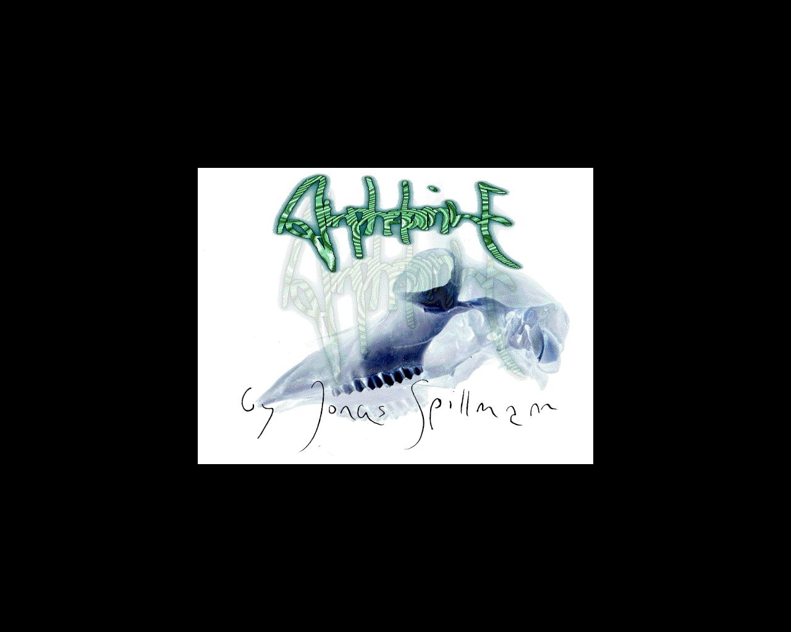
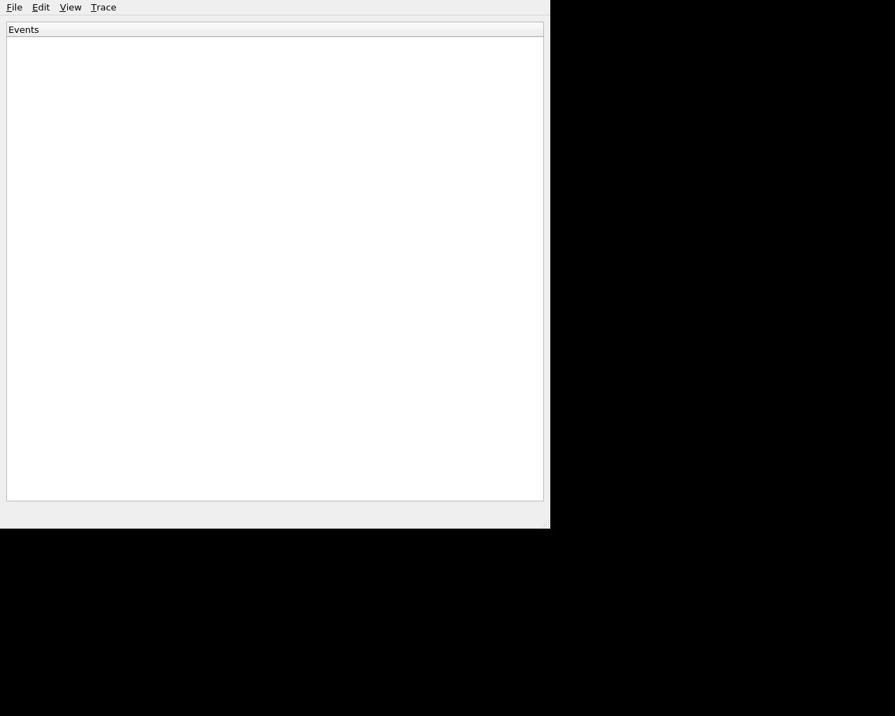
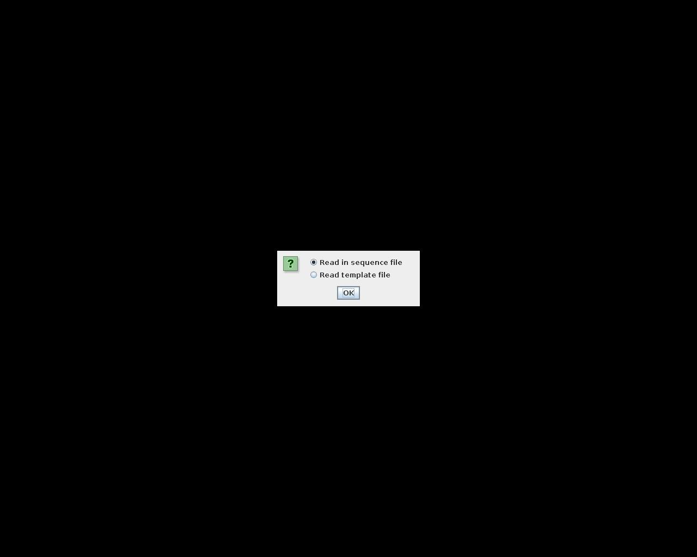
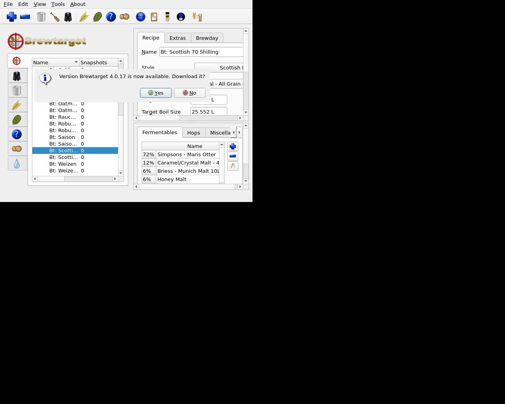
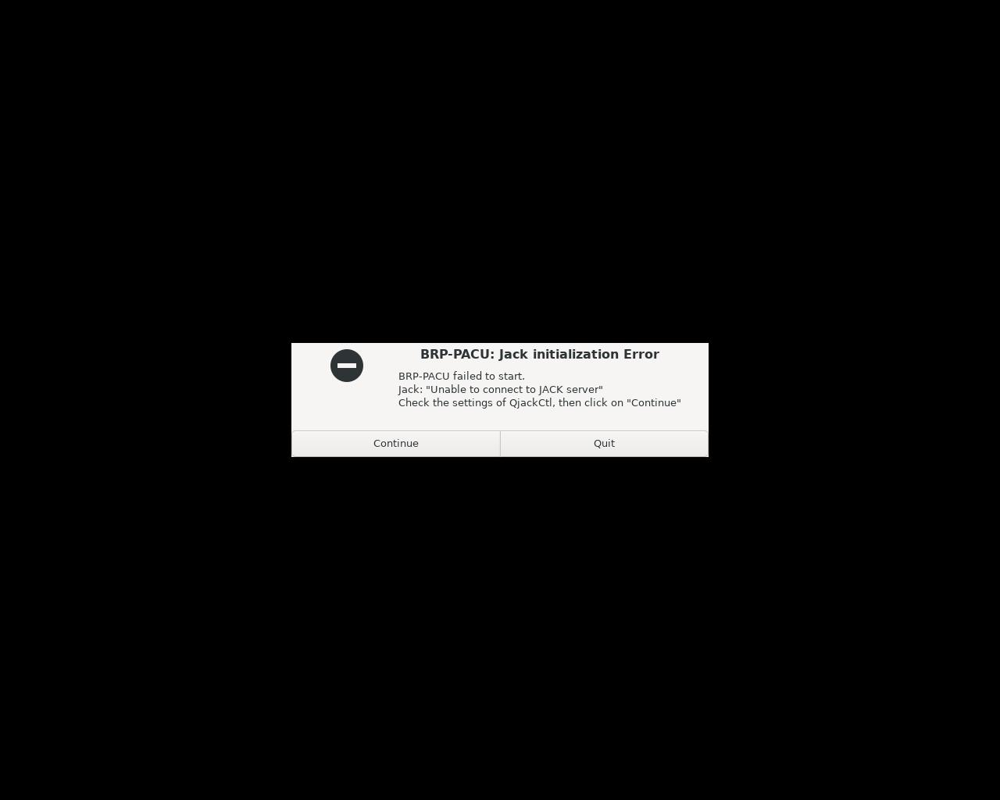
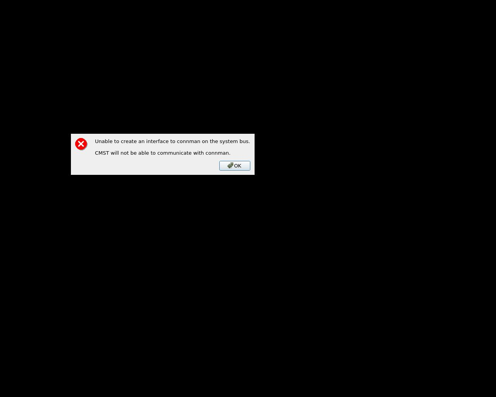

# arm64 - 构建统计
| 索引数  | 构建数 | 成功数 | 失败数  | 完成度  |
|--------|--------|-------|---------| -------|
|3099|490|176 |314 | 5.68%|
## 详细结果
| 包名   | 架构 | 版本    | 测试结果 | SHA256SUM |
|-------|------|---------|---------|-----------|
| [0install](./0install) | arm64 | 2.18-2ubuntu2-07be3ef | 失败 | N/A |
| [2048](./2048) | arm64 | 0.20221023.1237-1 | 失败 | [SHA256SUM](build/arm64/2048/SHA256SUMS) |
| [2048-qt](./2048-qt) | arm64 | 0.1.6-2build4 |  | [SHA256SUM](build/arm64/2048-qt/SHA256SUMS) |
| [3dchess](./3dchess) | arm64 | 0.8.1-21ubuntu1 |  | [SHA256SUM](build/arm64/3dchess/SHA256SUMS) |
| [3depict](./3depict) | arm64 | 0.0.23-2build3 |  | [SHA256SUM](build/arm64/3depict/SHA256SUMS) |
| [4pane](./4pane) | arm64 | 8.0-1build4 |  | [SHA256SUM](build/arm64/4pane/SHA256SUMS) |
| [7kaa](./7kaa) | arm64 | 2.15.6+ds-1build2 |  | [SHA256SUM](build/arm64/7kaa/SHA256SUMS) |
| [a2d](./a2d) | arm64 | 2.0.3-2-07be3ef | 失败 | N/A |
| [a7xpg](./a7xpg) | arm64 | 0.11.dfsg1-11 |  | [SHA256SUM](build/arm64/a7xpg/SHA256SUMS) |
| [abe](./abe) | arm64 | 1.1+dfsg-5 |  | [SHA256SUM](build/arm64/abe/SHA256SUMS) |
| [abiword](./abiword) | arm64 | 3.0.5~dfsg-3.2build4 |  | [SHA256SUM](build/arm64/abiword/SHA256SUMS) |
| [accerciser](./accerciser) | arm64 | 3.42.0-1ubuntu0.1-07be3ef | 失败 | N/A |
| [accountwizard](./accountwizard) | arm64 | 23.08.5-0ubuntu3-07be3ef | 失败 | N/A |
| [ace-of-penguins](./ace-of-penguins) | arm64 | 1.5~rc2-5ubuntu4 |             | [SHA256SUM](build/arm64/ace-of-penguins/SHA256SUMS) |
| [acetoneiso](./acetoneiso) | arm64 | 2.4-4build2 |  | [SHA256SUM](build/arm64/acetoneiso/SHA256SUMS) |
| [achilles](./achilles) | arm64 | 2-12build2 |  | [SHA256SUM](build/arm64/achilles/SHA256SUMS) |
| [aclock.app](./aclock.app) | arm64 | 0.4.0-2build5 |  | [SHA256SUM](build/arm64/aclock.app/SHA256SUMS) |
| [aconnectgui](./aconnectgui) | arm64 | 0.9.0rc2-1-10.3build2 |  | [SHA256SUM](build/arm64/aconnectgui/SHA256SUMS) |
| [actiona](./actiona) | arm64 | 3.10.1-1build6 |  | [SHA256SUM](build/arm64/actiona/SHA256SUMS) |
| [activity-aware-firefox](./activity-aware-firefox) | arm64 | 0.4.2-1-07be3ef | 失败 | N/A |
| [activity-log-manager](./activity-log-manager) | arm64 | 0.9.7-0ubuntu31-07be3ef | 失败 | N/A |
| [add64](./add64) | arm64 | 3.9.3-0ubuntu3 |  | [SHA256SUM](build/arm64/add64/SHA256SUMS) |
| [addressmanager.app](./addressmanager.app) | arm64 | 0.4.8-3build6 |  | [SHA256SUM](build/arm64/addressmanager.app/SHA256SUMS) |
| [adonthell-data](./adonthell-data) | arm64 | 0.3.8-1 | 失败 | [SHA256SUM](build/arm64/adonthell-data/SHA256SUMS) |
| [adun.app](./adun.app) | arm64 | 0.81-14build4 |  | [SHA256SUM](build/arm64/adun.app/SHA256SUMS) |
| [aegisub](./aegisub) | arm64 | 3.2.2+dfsg-7.1build2 | 失败 | [SHA256SUM](build/arm64/aegisub/SHA256SUMS) |
| [aeolus](./aeolus) | arm64 | 0.10.4-1build3 | 失败 | [SHA256SUM](build/arm64/aeolus/SHA256SUMS) |
| [aerc](./aerc) | arm64 | 0.17.0-1ubuntu0.24.04.2 | 失败 | [SHA256SUM](build/arm64/aerc/SHA256SUMS) |
| [afterstep](./afterstep) | arm64 | 2.2.12-17.1build3-07be3ef | 失败 | N/A |
| [afterstep-data](./afterstep-data) | arm64 | 2.2.12-17.1build3-07be3ef | 失败 | N/A |
| [agenda.app](./agenda.app) | arm64 | 0.46-3build3 |  | [SHA256SUM](build/arm64/agenda.app/SHA256SUMS) |
| [aghermann](./aghermann) | arm64 | 1.1.2-5build2 |  | [SHA256SUM](build/arm64/aghermann/SHA256SUMS) |
| [agordejo](./agordejo) | arm64 | 0.4.2-0ubuntu1 | 失败 | [SHA256SUM](build/arm64/agordejo/SHA256SUMS) |
| [airstrike](./airstrike) | arm64 | 0.99+1.0pre6a-11 |  | [SHA256SUM](build/arm64/airstrike/SHA256SUMS) |
| [aisleriot](./aisleriot) | arm64 | 3.22.31-1build2-07be3ef | 失败 | N/A |
| [akira](./akira) | arm64 | 0.0.16-2build2 |  | [SHA256SUM](build/arm64/akira/SHA256SUMS) |
| [akonadi-import-wizard](./akonadi-import-wizard) | arm64 | 23.08.5-0ubuntu4-07be3ef | 失败 | N/A |
| [akonadiconsole](./akonadiconsole) | arm64 | 23.08.5-0ubuntu5.2-07be3ef | 失败 | N/A |
| [akregator](./akregator) | arm64 | 23.08.5-0ubuntu4.1-07be3ef | 失败 | N/A |
| [alacarte](./alacarte) | arm64 | 3.52.0-1-07be3ef | 失败 | N/A |
| [alacritty](./alacritty) | arm64 | 0.13.2-2 |  | [SHA256SUM](build/arm64/alacritty/SHA256SUMS) |
| [aladin](./aladin) | arm64 | 12.060+dfsg-3-07be3ef | 失败 | N/A |
| [alarm-clock-applet](./alarm-clock-applet) | arm64 | 0.4.1-5build2 |  | [SHA256SUM](build/arm64/alarm-clock-applet/SHA256SUMS) |
| [alex4](./alex4) | arm64 | 1.1-10ubuntu4 | 失败 | [SHA256SUM](build/arm64/alex4/SHA256SUMS) |
| [algobox](./algobox) | arm64 | 1.1.1+dfsg-1build2-07be3ef | 失败 | N/A |
| [alien-arena](./alien-arena) | arm64 | 7.71.3+dfsg-3ubuntu1 | 失败 | [SHA256SUM](build/arm64/alien-arena/SHA256SUMS) |
| [alienblaster](./alienblaster) | arm64 | 1.1.0-11 |  | [SHA256SUM](build/arm64/alienblaster/SHA256SUMS) |
| [aliki](./aliki) | arm64 | 0.3.0-6build2 |   | [SHA256SUM](build/arm64/aliki/SHA256SUMS) |
| [alkimia-bin](./alkimia-bin) | arm64 | 8.1.2-2build2-07be3ef | 失败 | N/A |
| [allure](./allure) | arm64 | 0.11.0.0-1 |  | [SHA256SUM](build/arm64/allure/SHA256SUMS) |
| [almanah](./almanah) | arm64 | 0.12.3-2build3-af50a04 | 失败 | N/A |
| [alsa-scarlett-gui](./alsa-scarlett-gui) | arm64 | 0.4.0-1 |  | [SHA256SUM](build/arm64/alsa-scarlett-gui/SHA256SUMS) |
| [alsa-tools-gui](./alsa-tools-gui) | arm64 | 1.2.11-1.1-07be3ef | 失败 | N/A |
| [alsamixergui](./alsamixergui) | arm64 | 0.9.0rc2-1-10.2build2 |  | [SHA256SUM](build/arm64/alsamixergui/SHA256SUMS) |
| [alsaplayer-common](./alsaplayer-common) | arm64 | 0.99.81-2build6 |  | [SHA256SUM](build/arm64/alsaplayer-common/SHA256SUMS) |
| [altos](./altos) | arm64 | 1.9.17-1ubuntu3 |    | [SHA256SUM](build/arm64/altos/SHA256SUMS) |
| [amberol](./amberol) | arm64 | 0.10.3-3ubuntu1 |  | [SHA256SUM](build/arm64/amberol/SHA256SUMS) |
| [amide](./amide) | arm64 | 1.0.6-5build2 |  | [SHA256SUM](build/arm64/amide/SHA256SUMS) |
| [amoebax](./amoebax) | arm64 | 0.2.1+dfsg-6 |  | [SHA256SUM](build/arm64/amoebax/SHA256SUMS) |
| [amphetamine](./amphetamine) | arm64 | 0.8.10-21build1 |  | [SHA256SUM](build/arm64/amphetamine/SHA256SUMS) |
| [ams](./ams) | arm64 | 2.2.1-1build3 | 失败 | [SHA256SUM](build/arm64/ams/SHA256SUMS) |
| [amsynth](./amsynth) | arm64 | 1.13.2-1build2 |  | [SHA256SUM](build/arm64/amsynth/SHA256SUMS) |
| [amule](./amule) | arm64 | 2.3.3-3build5 |  | [SHA256SUM](build/arm64/amule/SHA256SUMS) |
| [amule-utils-gui](./amule-utils-gui) | arm64 | 2.3.3-3build5 |    | [SHA256SUM](build/arm64/amule-utils-gui/SHA256SUMS) |
| [anarchism](./anarchism) | arm64 | 15.3-3 | 失败 | [SHA256SUM](build/arm64/anarchism/SHA256SUMS) |
| [android-file-transfer](./android-file-transfer) | arm64 | 4.3-1build3 |  | [SHA256SUM](build/arm64/android-file-transfer/SHA256SUMS) |
| [angband-data](./angband-data) | arm64 | 4.2.5+dfsg1-1 | 失败 | [SHA256SUM](build/arm64/angband-data/SHA256SUMS) |
| [angelfish](./angelfish) | arm64 | 23.08.5-0ubuntu3-07be3ef | 失败 | N/A |
| [angrydd](./angrydd) | arm64 | 1.0.1-14 |  | [SHA256SUM](build/arm64/angrydd/SHA256SUMS) |
| [anki](./anki) | arm64 | 2.1.15+dfsg-3ubuntu4.1-07be3ef | 失败 | N/A |
| [ansifilter-gui](./ansifilter-gui) | arm64 | 2.18+dfsg1-2build2 |  | [SHA256SUM](build/arm64/ansifilter-gui/SHA256SUMS) |
| [antigravitaattori](./antigravitaattori) | arm64 | 0.0.3-10build2 | 失败 | [SHA256SUM](build/arm64/antigravitaattori/SHA256SUMS) |
| [antimicro](./antimicro) | arm64 | 3.1.4-2 |  | [SHA256SUM](build/arm64/antimicro/SHA256SUMS) |
| [antimony](./antimony) | arm64 | 0.9.3-2build9 |  | [SHA256SUM](build/arm64/antimony/SHA256SUMS) |
| [anymeal](./anymeal) | arm64 | 1.26-1build2 |  | [SHA256SUM](build/arm64/anymeal/SHA256SUMS) |
| [aobook](./aobook) | arm64 | 1.0.3-3build2 |  | [SHA256SUM](build/arm64/aobook/SHA256SUMS) |
| [aoflagger](./aoflagger) | arm64 | 3.4.0-2build4 |   | [SHA256SUM](build/arm64/aoflagger/SHA256SUMS) |
| [apitrace-gui](./apitrace-gui) | arm64 | 11.1+repack-1.2build3 |  | [SHA256SUM](build/arm64/apitrace-gui/SHA256SUMS) |
| [apostrophe](./apostrophe) | arm64 | 2.6.3-4-07be3ef | 失败 | N/A |
| [apper](./apper) | arm64 | 1.0.0-5build2-07be3ef | 失败 | N/A |
| [apport-gtk](./apport-gtk) | arm64 | 2.28.1-0ubuntu3.5-07be3ef | 失败 | N/A |
| [apport-kde](./apport-kde) | arm64 | 2.28.1-0ubuntu3.5-07be3ef | 失败 | N/A |
| [apt-offline-gui](./apt-offline-gui) | arm64 | 1.8.5-1 |  | [SHA256SUM](build/arm64/apt-offline-gui/SHA256SUMS) |
| [apturl-common](./apturl-common) | arm64 | 0.5.2ubuntu23 | 失败 | [SHA256SUM](build/arm64/apturl-common/SHA256SUMS) |
| [apvlv](./apvlv) | arm64 | 0.5.0+repack-2build3 |  | [SHA256SUM](build/arm64/apvlv/SHA256SUMS) |
| [aqemu](./aqemu) | arm64 | 0.9.2-3ubuntu2 |  | [SHA256SUM](build/arm64/aqemu/SHA256SUMS) |
| [arandr](./arandr) | arm64 | 0.1.11-1-07be3ef | 失败 | N/A |
| [aranym](./aranym) | arm64 | 1.1.0-2-07be3ef | 失败 | N/A |
| [aravis-tools](./aravis-tools) | arm64 | 0.8.30-1build2 | 失败 | [SHA256SUM](build/arm64/aravis-tools/SHA256SUMS) |
| [arb](./arb) | arm64 | 6.0.6-7build3-07be3ef | 失败 | N/A |
| [arc-gui-clients](./arc-gui-clients) | arm64 | 0.4.6-7build5-07be3ef | 失败 | N/A |
| [ardentryst](./ardentryst) | arm64 | 1.71-10 |  | [SHA256SUM](build/arm64/ardentryst/SHA256SUMS) |
| [ardour](./ardour) | arm64 | 8.4.0+ds1-2ubuntu8 |  | [SHA256SUM](build/arm64/ardour/SHA256SUMS) |
| [arduino](./arduino) | arm64 | 1.8.19+dfsg1-2-07be3ef | 失败 | N/A |
| [ares](./ares) | arm64 | 134+dfsg-1build2 |  | [SHA256SUM](build/arm64/ares/SHA256SUMS) |
| [ario](./ario) | arm64 | 1.6-1.2build4 |  | [SHA256SUM](build/arm64/ario/SHA256SUMS) |
| [ark](./ark) | arm64 | 23.08.5-0ubuntu5-07be3ef | 失败 | N/A |
| [armagetronad](./armagetronad) | arm64 | 0.2.9.1.1-1build2 |  | [SHA256SUM](build/arm64/armagetronad/SHA256SUMS) |
| [arqiver](./arqiver) | arm64 | 0.9.0-1build2 |  | [SHA256SUM](build/arm64/arqiver/SHA256SUMS) |
| [artemis](./artemis) | arm64 | 18.2.0+dfsg-3 |     | [SHA256SUM](build/arm64/artemis/SHA256SUMS) |
| [artha](./artha) | arm64 | 1.0.5-3build2 |  | [SHA256SUM](build/arm64/artha/SHA256SUMS) |
| [artikulate](./artikulate) | arm64 | 23.08.5-0ubuntu3-07be3ef | 失败 | N/A |
| [asc](./asc) | arm64 | 2.6.1.0-9build5 |  | [SHA256SUM](build/arm64/asc/SHA256SUMS) |
| [asciijump](./asciijump) | arm64 | 1.0.2~beta-10-07be3ef | 失败 | N/A |
| [ase](./ase) | arm64 | 3.22.1-4 |  | [SHA256SUM](build/arm64/ase/SHA256SUMS) |
| [aseba](./aseba) | arm64 | 1.6.99+dfsg-9build2 |        | [SHA256SUM](build/arm64/aseba/SHA256SUMS) |
| [assaultcube](./assaultcube) | arm64 | 1.3.0.2+dfsg-5-07be3ef | 失败 | N/A |
| [astromenace](./astromenace) | arm64 | 1.3.2+repack-7-07be3ef | 失败 | N/A |
| [asunder](./asunder) | arm64 | 3.0.1+ds-1build2 |  | [SHA256SUM](build/arm64/asunder/SHA256SUMS) |
| [asylum](./asylum) | arm64 | 0.3.2-3build1-07be3ef | 失败 | N/A |
| [atanks](./atanks) | arm64 | 6.6~dfsg-1build2 |  | [SHA256SUM](build/arm64/atanks/SHA256SUMS) |
| [atari800](./atari800) | arm64 | 5.0.0-1build2 |  | [SHA256SUM](build/arm64/atari800/SHA256SUMS) |
| [atomes](./atomes) | arm64 | 1.1.12+repack-2ubuntu2 |  | [SHA256SUM](build/arm64/atomes/SHA256SUMS) |
| [atomix](./atomix) | arm64 | 44.0-3build3 |  | [SHA256SUM](build/arm64/atomix/SHA256SUMS) |
| [atril](./atril) | arm64 | 1.26.2-3build2-07be3ef | 失败 | N/A |
| [audacious](./audacious) | arm64 | 4.3.1-2.1build2 |  | [SHA256SUM](build/arm64/audacious/SHA256SUMS) |
| [audacity](./audacity) | arm64 | 3.4.2+dfsg-1deepin0 |  | [SHA256SUM](build/arm64/audacity/SHA256SUMS) |
| [audmes](./audmes) | arm64 | 2024.02.18-1build2 |  | [SHA256SUM](build/arm64/audmes/SHA256SUMS) |
| [aumix](./aumix) | arm64 | 2.9.1-7.1 | 失败 | [SHA256SUM](build/arm64/aumix/SHA256SUMS) |
| [auralquiz](./auralquiz) | arm64 | 1.0.0-3build3 |  | [SHA256SUM](build/arm64/auralquiz/SHA256SUMS) |
| [ausweisapp](./ausweisapp) | arm64 | 2.1.0-1build1 |  | [SHA256SUM](build/arm64/ausweisapp/SHA256SUMS) |
| [auto-multiple-choice](./auto-multiple-choice) | arm64 | 1.6.0-3build4-07be3ef | 失败 | N/A |
| [autokey-gtk](./autokey-gtk) | arm64 | 0.95.10-2.1-07be3ef | 失败 | N/A |
| [autokey-qt](./autokey-qt) | arm64 | 0.95.10-2.1 |  | [SHA256SUM](build/arm64/autokey-qt/SHA256SUMS) |
| [autorenamer](./autorenamer) | arm64 | 0.6-1-07be3ef | 失败 | N/A |
| [avahi-discover](./avahi-discover) | arm64 | 0.8-13ubuntu6-07be3ef | 失败 | N/A |
| [avahi-ui-utils](./avahi-ui-utils) | arm64 | 0.8-13ubuntu6-07be3ef | 失败 | N/A |
| [avogadro](./avogadro) | arm64 | 1.99.0-1build2 |  | [SHA256SUM](build/arm64/avogadro/SHA256SUMS) |
| [awf-gtk3](./awf-gtk3) | arm64 | 2.8.0-1build2 |  | [SHA256SUM](build/arm64/awf-gtk3/SHA256SUMS) |
| [awf-gtk4](./awf-gtk4) | arm64 | 2.8.0-1build2 |  | [SHA256SUM](build/arm64/awf-gtk4/SHA256SUMS) |
| [ayatana-settings](./ayatana-settings) | arm64 | 23.11.14-1-07be3ef | 失败 | N/A |
| [ayatana-webmail](./ayatana-webmail) | arm64 | 23.12.25+dfsg-1-07be3ef | 失败 | N/A |
| [backintime-qt](./backintime-qt) | arm64 | 1.4.3-1-07be3ef | 失败 | N/A |
| [bacula-console-qt](./bacula-console-qt) | arm64 | 13.0.4-1build3-07be3ef | 失败 | N/A |
| [bacula-tray-monitor](./bacula-tray-monitor) | arm64 | 13.0.4-1build3-07be3ef | 失败 | N/A |
| [ballerburg](./ballerburg) | arm64 | 1.2.1-1 |  | [SHA256SUM](build/arm64/ballerburg/SHA256SUMS) |
| [ballview](./ballview) | arm64 | 1.5.0+git20180813.37fc53c-11build5-07be3ef | 失败 | N/A |
| [ballz](./ballz) | arm64 | 1.0.4-1.1build2 |  | [SHA256SUM](build/arm64/ballz/SHA256SUMS) |
| [balsa](./balsa) | arm64 | 2.6.4-2build5-07be3ef | 失败 | N/A |
| [bambam](./bambam) | arm64 | 1.2.1+dfsg-1 |  | [SHA256SUM](build/arm64/bambam/SHA256SUMS) |
| [bambootracker](./bambootracker) | arm64 | 0.6.1-1build2 | 失败 | [SHA256SUM](build/arm64/bambootracker/SHA256SUMS) |
| [baobab](./baobab) | arm64 | 46.0-1build1-07be3ef | 失败 | N/A |
| [barrage](./barrage) | arm64 | 1.0.5-1 |  | [SHA256SUM](build/arm64/barrage/SHA256SUMS) |
| [barrier](./barrier) | arm64 | 2.4.0+dfsg-4build3-07be3ef | 失败 | N/A |
| [basex](./basex) | arm64 | 10.5-1 | 失败 | [SHA256SUM](build/arm64/basex/SHA256SUMS) |
| [basic256](./basic256) | arm64 | 2.0.99.7-2build3 |  | [SHA256SUM](build/arm64/basic256/SHA256SUMS) |
| [basilisk2](./basilisk2) | arm64 | 0.9.20240401-1 |  | [SHA256SUM](build/arm64/basilisk2/SHA256SUMS) |
| [basket](./basket) | arm64 | 2.49-1build3-07be3ef | 失败 | N/A |
| [bastet](./bastet) | arm64 | 0.43-7build1-07be3ef | 失败 | N/A |
| [batmon.app](./batmon.app) | arm64 | 0.9-2build5 |  | [SHA256SUM](build/arm64/batmon.app/SHA256SUMS) |
| [battery-stats](./battery-stats) | arm64 | 0.5.6-2.1-07be3ef | 失败 | N/A |
| [bb](./bb) | arm64 | 1.3rc1-13 | 失败 | [SHA256SUM](build/arm64/bb/SHA256SUMS) |
| [bbpager](./bbpager) | arm64 | 0.4.7-10 | 失败 | [SHA256SUM](build/arm64/bbpager/SHA256SUMS) |
| [bcnc](./bcnc) | arm64 | 0.9.14.318+ds-4 |  | [SHA256SUM](build/arm64/bcnc/SHA256SUMS) |
| [bdbvu](./bdbvu) | arm64 | 0.1-3.1build2 |  | [SHA256SUM](build/arm64/bdbvu/SHA256SUMS) |
| [beads](./beads) | arm64 | 1.1.22-1build4 |  | [SHA256SUM](build/arm64/beads/SHA256SUMS) |
| [bear-factory](./bear-factory) | arm64 | 0.6.0-8build5 |    | [SHA256SUM](build/arm64/bear-factory/SHA256SUMS) |
| [beneath-a-steel-sky](./beneath-a-steel-sky) | arm64 | 0.0372-8 |  | [SHA256SUM](build/arm64/beneath-a-steel-sky/SHA256SUMS) |
| [berusky](./berusky) | arm64 | 1.7.2-3build2 |  | [SHA256SUM](build/arm64/berusky/SHA256SUMS) |
| [berusky2](./berusky2) | arm64 | 0.12-4 |  | [SHA256SUM](build/arm64/berusky2/SHA256SUMS) |
| [bespokesynth](./bespokesynth) | arm64 | 1.2.1+dfsg-4build4 |  | [SHA256SUM](build/arm64/bespokesynth/SHA256SUMS) |
| [betaradio](./betaradio) | arm64 | 1.6-1build3 |  | [SHA256SUM](build/arm64/betaradio/SHA256SUMS) |
| [between](./between) | arm64 | 6+dfsg1-4 |  | [SHA256SUM](build/arm64/between/SHA256SUMS) |
| [bibledit](./bibledit) | arm64 | 5.1.002-1build5 |  | [SHA256SUM](build/arm64/bibledit/SHA256SUMS) |
| [bibletime](./bibletime) | arm64 | 3.0.3-3build2 |  | [SHA256SUM](build/arm64/bibletime/SHA256SUMS) |
| [bibshelf](./bibshelf) | arm64 | 1.6.0-0ubuntu9 |  | [SHA256SUM](build/arm64/bibshelf/SHA256SUMS) |
| [biglybt](./biglybt) | arm64 | 3.4.0.0-1 | 失败 | [SHA256SUM](build/arm64/biglybt/SHA256SUMS) |
| [bijiben](./bijiben) | arm64 | 40.1-6build4-07be3ef | 失败 | N/A |
| [billard-gl](./billard-gl) | arm64 | 1.75-17build2 |  | [SHA256SUM](build/arm64/billard-gl/SHA256SUMS) |
| [biloba](./biloba) | arm64 | 0.9.3-11 |  | [SHA256SUM](build/arm64/biloba/SHA256SUMS) |
| [biniax2](./biniax2) | arm64 | 1.30-7 |  | [SHA256SUM](build/arm64/biniax2/SHA256SUMS) |
| [bino](./bino) | arm64 | 2.1-1build2 | 失败 | [SHA256SUM](build/arm64/bino/SHA256SUMS) |
| [biogenesis](./biogenesis) | arm64 | 0.8-3.1 |  | [SHA256SUM](build/arm64/biogenesis/SHA256SUMS) |
| [birdfont](./birdfont) | arm64 | 2.33.1-3build3 |  | [SHA256SUM](build/arm64/birdfont/SHA256SUMS) |
| [bisheng-engine](./bisheng-engine) | arm64 | 2.0.13-1-07be3ef | 失败 | N/A |
| [bitsnpicas](./bitsnpicas) | arm64 | 2.0+ds-2 | 失败 | [SHA256SUM](build/arm64/bitsnpicas/SHA256SUMS) |
| [biz.zcjt.gaopaiyi](./biz.zcjt.gaopaiyi) | arm64 | 1.0.0-07be3ef | 失败 | N/A |
| [biz.zcjt.scanner](./biz.zcjt.scanner) | arm64 | 1.0.2.0-07be3ef | 失败 | N/A |
| [biz.zcjt.zc-a5930dn](./biz.zcjt.zc-a5930dn) | arm64 | 1.0.0-23166-07be3ef | 失败 | N/A |
| [biz.zcjt.zc-a5933dn](./biz.zcjt.zc-a5933dn) | arm64 | 1.0.0-23324-07be3ef | 失败 | N/A |
| [biz.zcjt.zhongchu-sane](./biz.zcjt.zhongchu-sane) | arm64 | 20240911-6.6.10.030-07be3ef | 失败 | N/A |
| [bkchem](./bkchem) | arm64 | 0.14.0~pre4+git20211228-3 | 失败 | [SHA256SUM](build/arm64/bkchem/SHA256SUMS) |
| [black-box](./black-box) | arm64 | 1.4.8-4build1 |  | [SHA256SUM](build/arm64/black-box/SHA256SUMS) |
| [blackbox-terminal](./blackbox-terminal) | arm64 | 0.14.0-2build2 |  | [SHA256SUM](build/arm64/blackbox-terminal/SHA256SUMS) |
| [bleachbit](./bleachbit) | arm64 | 4.6.0-3-07be3ef | 失败 | N/A |
| [blender](./blender) | arm64 | 4.0.2+dfsg-1ubuntu8 |  | [SHA256SUM](build/arm64/blender/SHA256SUMS) |
| [blinken](./blinken) | arm64 | 23.08.5-0ubuntu4-07be3ef | 失败 | N/A |
| [blobandconquer](./blobandconquer) | arm64 | 1.11-dfsg+20-2 | 失败 | [SHA256SUM](build/arm64/blobandconquer/SHA256SUMS) |
| [blobby](./blobby) | arm64 | 1.1+ds-1ubuntu1 |  | [SHA256SUM](build/arm64/blobby/SHA256SUMS) |
| [bloboats](./bloboats) | arm64 | 1.0.2+dfsg-4 |  | [SHA256SUM](build/arm64/bloboats/SHA256SUMS) |
| [blobwars](./blobwars) | arm64 | 2.00-4ubuntu1 |  | [SHA256SUM](build/arm64/blobwars/SHA256SUMS) |
| [blockattack](./blockattack) | arm64 | 2.8.0-1build1 |  | [SHA256SUM](build/arm64/blockattack/SHA256SUMS) |
| [blockout2](./blockout2) | arm64 | 2.5+dfsg1-1build3 |  | [SHA256SUM](build/arm64/blockout2/SHA256SUMS) |
| [blocks-of-the-undead](./blocks-of-the-undead) | arm64 | 1.0-7build1 |  | [SHA256SUM](build/arm64/blocks-of-the-undead/SHA256SUMS) |
| [bluedevil](./bluedevil) | arm64 | 5.27.11-0ubuntu2-07be3ef | 失败 | N/A |
| [bluefish](./bluefish) | arm64 | 2.2.15-1-07be3ef | 失败 | N/A |
| [blueman](./blueman) | arm64 | 2.3.5-3deepin0+rb1-07be3ef | 失败 | N/A |
| [blupimania](./blupimania) | arm64 | 1.6.2-17-g5f6cf8b-1 |  | [SHA256SUM](build/arm64/blupimania/SHA256SUMS) |
| [boats](./boats) | arm64 | 202008-1build2 |  | [SHA256SUM](build/arm64/boats/SHA256SUMS) |
| [boinc-manager](./boinc-manager) | arm64 | 7.24.1+dfsg-4build1-07be3ef | 失败 | N/A |
| [bomber](./bomber) | arm64 | 23.08.5-0ubuntu3-07be3ef | 失败 | N/A |
| [bomberclone](./bomberclone) | arm64 | 0.11.9-7.1 |  | [SHA256SUM](build/arm64/bomberclone/SHA256SUMS) |
| [bookletimposer](./bookletimposer) | arm64 | 0.3.1-4ubuntu1-07be3ef | 失败 | N/A |
| [bookworm](./bookworm) | arm64 | 1.1.2+git20210715-4build3 |  | [SHA256SUM](build/arm64/bookworm/SHA256SUMS) |
| [boomaga](./boomaga) | arm64 | 3.0.0+git13-g7f7ad47-1build4 |  | [SHA256SUM](build/arm64/boomaga/SHA256SUMS) |
| [bossa](./bossa) | arm64 | 1.9.1-3ubuntu5 |  | [SHA256SUM](build/arm64/bossa/SHA256SUMS) |
| [boswars](./boswars) | arm64 | 2.8-2build2 |  | [SHA256SUM](build/arm64/boswars/SHA256SUMS) |
| [bouncy](./bouncy) | arm64 | 0.6.20071104-9 |  | [SHA256SUM](build/arm64/bouncy/SHA256SUMS) |
| [bovo](./bovo) | arm64 | 23.08.5-0ubuntu3-07be3ef | 失败 | N/A |
| [bpython](./bpython) | arm64 | 0.24-1 |  | [SHA256SUM](build/arm64/bpython/SHA256SUMS) |
| [brainparty](./brainparty) | arm64 | 0.61+dfsg-7-07be3ef | 失败 | N/A |
| [brasero](./brasero) | arm64 | 3.12.3-2build4-07be3ef | 失败 | N/A |
| [brewtarget](./brewtarget) | arm64 | 3.0.6-1build2 |  | [SHA256SUM](build/arm64/brewtarget/SHA256SUMS) |
| [briquolo](./briquolo) | arm64 | 0.5.7-11build2 |  | [SHA256SUM](build/arm64/briquolo/SHA256SUMS) |
| [brp-pacu](./brp-pacu) | arm64 | 2.1.2+git20210421-1build2 |  | N/A |
| [brutalchess](./brutalchess) | arm64 | 0.5.2+dfsg-8build1 |  | [SHA256SUM](build/arm64/brutalchess/SHA256SUMS) |
| [bsdgames](./bsdgames) | arm64 | 2.17-33-07be3ef | 失败 | N/A |
| [btanks](./btanks) | arm64 | 0.9.8083-9build1 |  | [SHA256SUM](build/arm64/btanks/SHA256SUMS) |
| [btop](./btop) | arm64 | 1.3.0-1-07be3ef | 失败 | N/A |
| [budgie-arm-environment](./budgie-arm-environment) | arm64 | 0.20.13-07be3ef | 失败 | N/A |
| [budgie-control-center](./budgie-control-center) | arm64 | 1.4.0-2build3-07be3ef | 失败 | N/A |
| [budgie-core](./budgie-core) | arm64 | 10.9.1-3ubuntu4-07be3ef | 失败 | N/A |
| [budgie-desktop-environment](./budgie-desktop-environment) | arm64 | 0.20.13-07be3ef | 失败 | N/A |
| [budgie-desktop-view](./budgie-desktop-view) | arm64 | 1.3-2build1-07be3ef | 失败 | N/A |
| [budgie-hotcorners-applet](./budgie-hotcorners-applet) | arm64 | 1.8.0-1build3-07be3ef | 失败 | N/A |
| [budgie-previews](./budgie-previews) | arm64 | 1.8.0-1build3 |  | [SHA256SUM](build/arm64/budgie-previews/SHA256SUMS) |
| [budgie-quickchar](./budgie-quickchar) | arm64 | 1.8.0-1build3-07be3ef | 失败 | N/A |
| [budgie-wallstreet](./budgie-wallstreet) | arm64 | 1.8.0-1build3 |  | [SHA256SUM](build/arm64/budgie-wallstreet/SHA256SUMS) |
| [budgie-welcome](./budgie-welcome) | arm64 | 0.6.1-07be3ef | 失败 | N/A |
| [budgie-window-shuffler](./budgie-window-shuffler) | arm64 | 1.8.0-1build3 |  | [SHA256SUM](build/arm64/budgie-window-shuffler/SHA256SUMS) |
| [bugsquish](./bugsquish) | arm64 | 0.0.6-10 |  | [SHA256SUM](build/arm64/bugsquish/SHA256SUMS) |
| [bumprace](./bumprace) | arm64 | 1.5.8-1 |  | [SHA256SUM](build/arm64/bumprace/SHA256SUMS) |
| [burgerspace](./burgerspace) | arm64 | 1.9.5-1build1 |  | [SHA256SUM](build/arm64/burgerspace/SHA256SUMS) |
| [bustle](./bustle) | arm64 | 0.8.0-2build2 |  | [SHA256SUM](build/arm64/bustle/SHA256SUMS) |
| [butt](./butt) | arm64 | 0.1.37-2build4 |  | [SHA256SUM](build/arm64/butt/SHA256SUMS) |
| [buzztrax](./buzztrax) | arm64 | 0.10.2-9build2 |  | [SHA256SUM](build/arm64/buzztrax/SHA256SUMS) |
| [bzflag-client](./bzflag-client) | arm64 | 2.4.26-1build3 |  | [SHA256SUM](build/arm64/bzflag-client/SHA256SUMS) |
| [c-evo-dh-gtk2](./c-evo-dh-gtk2) | arm64 | 1.10-1build3 |   | [SHA256SUM](build/arm64/c-evo-dh-gtk2/SHA256SUMS) |
| [cadabra2](./cadabra2) | arm64 | 2.4.5.4-0ubuntu1-07be3ef | 失败 | N/A |
| [caffeine](./caffeine) | arm64 | 2.9.12-1-07be3ef | 失败 | N/A |
| [cairo-dock-core](./cairo-dock-core) | arm64 | 3.4.1+git20201103.0836f5d1-1build3 |   | [SHA256SUM](build/arm64/cairo-dock-core/SHA256SUMS) |
| [caja](./caja) | arm64 | 1.26.3-1build3-07be3ef | 失败 | N/A |
| [caja-actions](./caja-actions) | arm64 | 1.27.0-1build3 |  | [SHA256SUM](build/arm64/caja-actions/SHA256SUMS) |
| [caja-eiciel](./caja-eiciel) | arm64 | 1.20.1-3build2-07be3ef | 失败 | N/A |
| [caja-seahorse](./caja-seahorse) | arm64 | 1.18.5-3-07be3ef | 失败 | N/A |
| [calamares](./calamares) | arm64 | 3.3.5-0ubuntu4-07be3ef | 失败 | N/A |
| [calamares-settings-debian](./calamares-settings-debian) | arm64 | 13.0.5-1-07be3ef | 失败 | N/A |
| [calamares-settings-kubuntu](./calamares-settings-kubuntu) | arm64 | 24.04.40-07be3ef | 失败 | N/A |
| [calamares-settings-lubuntu](./calamares-settings-lubuntu) | arm64 | 24.04.40-07be3ef | 失败 | N/A |
| [calamares-settings-ubuntu-unity](./calamares-settings-ubuntu-unity) | arm64 | 24.04.40-07be3ef | 失败 | N/A |
| [calc-common](./calc-common) | arm64 | 2.15.0.4-1build2-07be3ef | 失败 | N/A |
| [calf-plugins](./calf-plugins) | arm64 | 0.90.3-4build2-07be3ef | 失败 | N/A |
| [calibre](./calibre) | arm64 | 7.6.0+ds-1build1-07be3ef | 失败 | N/A |
| [calindori](./calindori) | arm64 | 23.08.5-0ubuntu4-07be3ef | 失败 | N/A |
| [calligra-data](./calligra-data) | arm64 | 3.2.1+dfsg-8build4-07be3ef | 失败 | N/A |
| [calligra-gemini](./calligra-gemini) | arm64 | 3.2.1+dfsg-8build4-07be3ef | 失败 | N/A |
| [calligraplan](./calligraplan) | arm64 | 3.3.0-2build2-07be3ef | 失败 | N/A |
| [calligrasheets](./calligrasheets) | arm64 | 3.2.1+dfsg-8build4-07be3ef | 失败 | N/A |
| [calligrastage](./calligrastage) | arm64 | 3.2.1+dfsg-8build4-07be3ef | 失败 | N/A |
| [calligrawords](./calligrawords) | arm64 | 3.2.1+dfsg-8build4-07be3ef | 失败 | N/A |
| [camera.app](./camera.app) | arm64 | 0.8.0-13build4 |  | [SHA256SUM](build/arm64/camera.app/SHA256SUMS) |
| [caneda](./caneda) | arm64 | 0.3.1+gitg08e22168-1build2 |  | [SHA256SUM](build/arm64/caneda/SHA256SUMS) |
| [cantata](./cantata) | arm64 | 2.5.0.ds1-2build3 |  | [SHA256SUM](build/arm64/cantata/SHA256SUMS) |
| [cantor](./cantor) | arm64 | 23.08.5-0ubuntu4.2-07be3ef | 失败 | N/A |
| [carburetor](./carburetor) | arm64 | 4.5.1-1-07be3ef | 失败 | N/A |
| [cardpeek](./cardpeek) | arm64 | 0.8.4-1.3build1 |  | [SHA256SUM](build/arm64/cardpeek/SHA256SUMS) |
| [carmetal](./carmetal) | arm64 | 4.3-2-07be3ef | 失败 | N/A |
| [cataclysm-dda-sdl](./cataclysm-dda-sdl) | arm64 | 0.G-4deepin1 |  | [SHA256SUM](build/arm64/cataclysm-dda-sdl/SHA256SUMS) |
| [catfish](./catfish) | arm64 | 4.16.4-2-07be3ef | 失败 | N/A |
| [caveexpress](./caveexpress) | arm64 | 2.5.2-2 |  | [SHA256SUM](build/arm64/caveexpress/SHA256SUMS) |
| [cavepacker](./cavepacker) | arm64 | 2.5.2-2 |  | [SHA256SUM](build/arm64/cavepacker/SHA256SUMS) |
| [cb2bib](./cb2bib) | arm64 | 2.0.1-2build2-07be3ef | 失败 | N/A |
| [cc.lotuscard.demo](./cc.lotuscard.demo) | arm64 | 1.0.0.0-07be3ef | 失败 | N/A |
| [cdogs-sdl](./cdogs-sdl) | arm64 | 2.0.0+dfsg-1 |  | [SHA256SUM](build/arm64/cdogs-sdl/SHA256SUMS) |
| [cecilia](./cecilia) | arm64 | 5.4.1-2 |  | [SHA256SUM](build/arm64/cecilia/SHA256SUMS) |
| [ceferino](./ceferino) | arm64 | 0.97.8+svn37-3 |  | [SHA256SUM](build/arm64/ceferino/SHA256SUMS) |
| [celluloid](./celluloid) | arm64 | 0.26-1build2 |  | [SHA256SUM](build/arm64/celluloid/SHA256SUMS) |
| [ceni](./ceni) | arm64 | 2.33-4-07be3ef | 失败 | N/A |
| [cenon.app](./cenon.app) | arm64 | 4.0.6+ds1-2build5 |  | [SHA256SUM](build/arm64/cenon.app/SHA256SUMS) |
| [cervisia](./cervisia) | arm64 | 23.08.5-0ubuntu3-07be3ef | 失败 | N/A |
| [cf900](./cf900) | arm64 | 1.0-07be3ef | 失败 | N/A |
| [cgoban](./cgoban) | arm64 | 1.9.14-19-07be3ef | 失败 | N/A |
| [charmap.app](./charmap.app) | arm64 | 0.3~rc1-4build3 |  | [SHA256SUM](build/arm64/charmap.app/SHA256SUMS) |
| [charmtimetracker](./charmtimetracker) | arm64 | 1.12.0-3build2-07be3ef | 失败 | N/A |
| [chatty](./chatty) | arm64 | 0.8.2-1ubuntu2-07be3ef | 失败 | N/A |
| [cheese](./cheese) | arm64 | 44.1-1build4-07be3ef | 失败 | N/A |
| [cheesecutter](./cheesecutter) | arm64 | 2.9+git20211011-2-07be3ef | 失败 | N/A |
| [chemtool](./chemtool) | arm64 | 1.6.14-6build2 |  | [SHA256SUM](build/arm64/chemtool/SHA256SUMS) |
| [cherrytree](./cherrytree) | arm64 | 1.1.2+dfsg-1 |  | [SHA256SUM](build/arm64/cherrytree/SHA256SUMS) |
| [chessx](./chessx) | arm64 | 1.4.6-2build3 |  | [SHA256SUM](build/arm64/chessx/SHA256SUMS) |
| [chewing-editor](./chewing-editor) | arm64 | 0.1.1-5build2 |  | [SHA256SUM](build/arm64/chewing-editor/SHA256SUMS) |
| [chiaki](./chiaki) | arm64 | 2.2.0-1build3 |  | [SHA256SUM](build/arm64/chiaki/SHA256SUMS) |
| [chirp](./chirp) | arm64 | 20240224-1ubuntu0.1 |  | [SHA256SUM](build/arm64/chirp/SHA256SUMS) |
| [chocolate-doom](./chocolate-doom) | arm64 | 3.0.1+really3.0.0+git1548-1build2 |    | [SHA256SUM](build/arm64/chocolate-doom/SHA256SUMS) |
| [choqok](./choqok) | arm64 | 1.7.0-2build2-07be3ef | 失败 | N/A |
| [chroma](./chroma) | arm64 | 1.19-1ubuntu1 |  | [SHA256SUM](build/arm64/chroma/SHA256SUMS) |
| [chromium](./chromium) | arm64 | 128.0.6613.84-1deepin1-07be3ef | 失败 | N/A |
| [chromium-browser](./chromium-browser) | arm64 | 1snap1-0ubuntu2-07be3ef | 失败 | N/A |
| [chromium-bsu](./chromium-bsu) | arm64 | 0.9.16.1-3 |  | [SHA256SUM](build/arm64/chromium-bsu/SHA256SUMS) |
| [chromono](./chromono) | arm64 | 1.1.1-1.1-07be3ef | 失败 | N/A |
| [cinnamon](./cinnamon) | arm64 | 6.0.4-4-07be3ef | 失败 | N/A |
| [cinnamon-control-center](./cinnamon-control-center) | arm64 | 6.0.1-3-07be3ef | 失败 | N/A |
| [cinnamon-screensaver](./cinnamon-screensaver) | arm64 | 6.0.3-1build2-07be3ef | 失败 | N/A |
| [cinnamon-settings-daemon](./cinnamon-settings-daemon) | arm64 | 6.0.0-1build4-07be3ef | 失败 | N/A |
| [circuslinux](./circuslinux) | arm64 | 1.0.3-35-07be3ef | 失败 | N/A |
| [ckb-next](./ckb-next) | arm64 | 0.6.0+dfsg-0.2build2 |  | [SHA256SUM](build/arm64/ckb-next/SHA256SUMS) |
| [clamtk](./clamtk) | arm64 | 6.07-1.1-07be3ef | 失败 | N/A |
| [clamz](./clamz) | arm64 | 0.5-2.1build2-07be3ef | 失败 | N/A |
| [clapper](./clapper) | arm64 | 0.5.2-8build2-07be3ef | 失败 | N/A |
| [classicmenu-indicator](./classicmenu-indicator) | arm64 | 0.11-0ubuntu1-07be3ef | 失败 | N/A |
| [classified-ads](./classified-ads) | arm64 | 0.15-1build3 |  | [SHA256SUM](build/arm64/classified-ads/SHA256SUMS) |
| [claws-mail](./claws-mail) | arm64 | 4.2.0-2build7-07be3ef | 失败 | N/A |
| [clawsker](./clawsker) | arm64 | 1.3.8-1-07be3ef | 失败 | N/A |
| [clementine](./clementine) | arm64 | 1.4.0~rc1+git867-g9ef681b0e+dfsg-1ubuntu4 |  | [SHA256SUM](build/arm64/clementine/SHA256SUMS) |
| [clipit](./clipit) | arm64 | 1.4.5+git20210313-2 |  | [SHA256SUM](build/arm64/clipit/SHA256SUMS) |
| [clips](./clips) | arm64 | 6.30-4.1build1 |  | [SHA256SUM](build/arm64/clips/SHA256SUMS) |
| [cloudcompare](./cloudcompare) | arm64 | 2.11.3-7.1build3 |   | [SHA256SUM](build/arm64/cloudcompare/SHA256SUMS) |
| [clustalx](./clustalx) | arm64 | 2.1+lgpl-9build2 |  | [SHA256SUM](build/arm64/clustalx/SHA256SUMS) |
| [clusterssh](./clusterssh) | arm64 | 4.16-4-07be3ef | 失败 | N/A |
| [cmake-qt-gui](./cmake-qt-gui) | arm64 | 3.30.5-1 |  | N/A |
| [cmatrix](./cmatrix) | arm64 | 2.0-6-07be3ef | 失败 | N/A |
| [cmst](./cmst) | arm64 | 2023.03.14-1build2 |  | [SHA256SUM](build/arm64/cmst/SHA256SUMS) |
| [cn.com.hisign.hidscanner](./cn.com.hisign.hidscanner) | arm64 | 1.0.0-1-07be3ef | 失败 | N/A |
| [cn.com.hisign.hsivlive](./cn.com.hisign.hsivlive) | arm64 | 3.10.8-07be3ef | 失败 | N/A |
| [cn.com.hsic.demo](./cn.com.hsic.demo) | arm64 | 1.0.0-1-07be3ef | 失败 | N/A |
| [cn.com.secuprint.smlmfp](./cn.com.secuprint.smlmfp) | arm64 | 1.0.3.0-07be3ef | 失败 | N/A |
| [cn.com.signpro.hwtabletserv](./cn.com.signpro.hwtabletserv) | arm64 | 2.7+b69-07be3ef | 失败 | N/A |
| [cn.com.signpro.sphttpserv](./cn.com.signpro.sphttpserv) | arm64 | 3.2+b83-07be3ef | 失败 | N/A |
| [cn.dascom.dc8600-driver](./cn.dascom.dc8600-driver) | arm64 | 1.0.0-07be3ef | 失败 | N/A |
| [cn.hengbao.hbd7600-driver](./cn.hengbao.hbd7600-driver) | arm64 | 1.0.8-07be3ef | 失败 | N/A |
| [cn.huahom.pam.unlock](./cn.huahom.pam.unlock) | arm64 | 0.1.0-07be3ef | 失败 | N/A |
| [cn.microdone.passguardservice](./cn.microdone.passguardservice) | arm64 | 1.0.0.0-07be3ef | 失败 | N/A |
| [cn.microdone.passguardservice.bj](./cn.microdone.passguardservice.bj) | arm64 | 1.0.0.0-07be3ef | 失败 | N/A |
| [cn.microdone.passguardservice.nb](./cn.microdone.passguardservice.nb) | arm64 | 1.0.0.7-07be3ef | 失败 | N/A |
| [cn.microdone.signmessenger.hz](./cn.microdone.signmessenger.hz) | arm64 | 1.0.0.0-07be3ef | 失败 | N/A |
| [cn.microdone.signmessenger.nb](./cn.microdone.signmessenger.nb) | arm64 | 1.0.0.2-07be3ef | 失败 | N/A |
| [cn.naturalcard.eserver](./cn.naturalcard.eserver) | arm64 | 1.0.0.1-07be3ef | 失败 | N/A |
| [cn.net.zonewin.smartscanner](./cn.net.zonewin.smartscanner) | arm64 | 1.0.11 |  | [SHA256SUM](build/arm64/cn.net.zonewin.smartscanner/SHA256SUMS) |
| [cn.tianyi.eserver](./cn.tianyi.eserver) | arm64 | 1.0.0.1-07be3ef | 失败 | N/A |
| [cnrdrvcups-ufr2lt-uk](./cnrdrvcups-ufr2lt-uk) | arm64 | 5.02-1-07be3ef | 失败 | N/A |
| [coccinella](./coccinella) | arm64 | 0.96.20-9 |  | [SHA256SUM](build/arm64/coccinella/SHA256SUMS) |
| [codeblocks-common](./codeblocks-common) | arm64 | 20.03+svn13046-0.3build2-07be3ef | 失败 | N/A |
| [codelite](./codelite) | arm64 | 17.0.0+dfsg-2build2-07be3ef | 失败 | N/A |
| [codfis](./codfis) | arm64 | 0.4.7-2build4 |  | [SHA256SUM](build/arm64/codfis/SHA256SUMS) |
| [colmap](./colmap) | arm64 | 3.9.1-2build2 |  | [SHA256SUM](build/arm64/colmap/SHA256SUMS) |
| [colobot](./colobot) | arm64 | 0.2.1-1build3 |  | [SHA256SUM](build/arm64/colobot/SHA256SUMS) |
| [color-picker](./color-picker) | arm64 | 1.0.3-2ubuntu3-07be3ef | 失败 | N/A |
| [colorcode](./colorcode) | arm64 | 0.8.7-1build2 |  | [SHA256SUM](build/arm64/colorcode/SHA256SUMS) |
| [colord-kde](./colord-kde) | arm64 | 23.08.5-0ubuntu4-07be3ef | 失败 | N/A |
| [colorhug-client](./colorhug-client) | arm64 | 0.2.8-3build4-07be3ef | 失败 | N/A |
| [colossal-cave-adventure](./colossal-cave-adventure) | arm64 | 1.6-1 |  | [SHA256SUM](build/arm64/colossal-cave-adventure/SHA256SUMS) |
| [com.arc-uds.smartscan](./com.arc-uds.smartscan) | arm64 | 3.1.0.1-07be3ef | 失败 | N/A |
| [com.avision.a4pq-series](./com.avision.a4pq-series) | arm64 | 1.0.0-23293-07be3ef | 失败 | N/A |
| [com.avision.avision-sane](./com.avision.avision-sane) | arm64 | 20231120-8.6.10.020-07be3ef | 失败 | N/A |
| [com.bjnja.njaep3kgmutil](./com.bjnja.njaep3kgmutil) | arm64 | 1.0.2-07be3ef | 失败 | N/A |
| [com.btit.linuxaction](./com.btit.linuxaction) | arm64 | 3.1.10.24193-uosv20-07be3ef | 失败 | N/A |
| [com.canon.ufr2](./com.canon.ufr2) | arm64 | 6.00-1.00-07be3ef | 失败 | N/A |
| [com.centerm.gwq](./com.centerm.gwq) | arm64 | 2021.3.26-1-07be3ef | 失败 | N/A |
| [com.centerm.gwq.common](./com.centerm.gwq.common) | arm64 | 1.0.0.0-1-07be3ef | 失败 | N/A |
| [com.colortrac](./com.colortrac) | arm64 | 1.0.7-07be3ef | 失败 | N/A |
| [com.comet.comet-sane](./com.comet.comet-sane) | arm64 | 20240814-11.7.11.063-07be3ef | 失败 | N/A |
| [com.contexscan](./com.contexscan) | arm64 | 1.0.7-07be3ef | 失败 | N/A |
| [com.deepin.gomoku](./com.deepin.gomoku) | arm64 | 1.0.11 |  | N/A |
| [com.deepin.lianliankan](./com.deepin.lianliankan) | arm64 | 1.0.12 |  | N/A |
| [com.deepin.microbox-scanner](./com.deepin.microbox-scanner) | arm64 | 1.2.2-07be3ef | 失败 | N/A |
| [com.deli.camera](./com.deli.camera) | arm64 | 2.1.7.9-07be3ef | 失败 | N/A |
| [com.deli.printer-c111](./com.deli.printer-c111) | arm64 | 1.0.038-07be3ef | 失败 | N/A |
| [com.deli.printer-d11](./com.deli.printer-d11) | arm64 | 1.10-1-07be3ef | 失败 | N/A |
| [com.deli.printer-d21](./com.deli.printer-d21) | arm64 | 1.10-1-07be3ef | 失败 | N/A |
| [com.delichina.deliscan](./com.delichina.deliscan) | arm64 | 4.51.24220.23319-07be3ef | 失败 | N/A |
| [com.elineprint.e-gm3001-an-3in1](./com.elineprint.e-gm3001-an-3in1) | arm64 | 1.0.0-20206-07be3ef | 失败 | N/A |
| [com.farshine.ygdevservice](./com.farshine.ygdevservice) | arm64 | 2.5.2-07be3ef | 失败 | N/A |
| [com.founder.linuxaction](./com.founder.linuxaction) | arm64 | 2.1.96.24335-uosv20-07be3ef | 失败 | N/A |
| [com.founderinternational.founder-sane](./com.founderinternational.founder-sane) | arm64 | 20240820-1.6.10.015-07be3ef | 失败 | N/A |
| [com.ftsafe.epass3000gm-spabank](./com.ftsafe.epass3000gm-spabank) | arm64 | 1.2.4-1+b1-07be3ef | 失败 | N/A |
| [com.ftsafe.epass3000gmg-hnxa](./com.ftsafe.epass3000gmg-hnxa) | arm64 | 1.0.1-1+b1-07be3ef | 失败 | N/A |
| [com.ftsafe.interpass3000-cib](./com.ftsafe.interpass3000-cib) | arm64 | 1.0.16.d1-1+b1-uos-07be3ef | 失败 | N/A |
| [com.ftsafe.interpass3000-cmbc](./com.ftsafe.interpass3000-cmbc) | arm64 | 1.3.13.d0-1+b1-07be3ef | 失败 | N/A |
| [com.ftsafe.interpass3000-lfbk](./com.ftsafe.interpass3000-lfbk) | arm64 | 1.0.7-1+b1-07be3ef | 失败 | N/A |
| [com.ftsafe.interpass3000-nbbank](./com.ftsafe.interpass3000-nbbank) | arm64 | 1.0.9-07be3ef | 失败 | N/A |
| [com.ftsafe.interpass3000-rzbank](./com.ftsafe.interpass3000-rzbank) | arm64 | 1.0.1-1+b1-07be3ef | 失败 | N/A |
| [com.ftsafe.interpass3000-scb](./com.ftsafe.interpass3000-scb) | arm64 | 1.0.5-1+b1-07be3ef | 失败 | N/A |
| [com.ftsafe.interpass3000-wfbank](./com.ftsafe.interpass3000-wfbank) | arm64 | 1.0.0.d1-1+b1-07be3ef | 失败 | N/A |
| [com.ftsafe.interpass3000zjrc](./com.ftsafe.interpass3000zjrc) | arm64 | 1.2.21-1+b1-07be3ef | 失败 | N/A |
| [com.ftsafe.interpasscitic](./com.ftsafe.interpasscitic) | arm64 | 1.2.8-1+b1-07be3ef | 失败 | N/A |
| [com.fujitsu.fsane](./com.fujitsu.fsane) | arm64 | 2.0.1-3-07be3ef | 失败 | N/A |
| [com.fytech.cfs300b](./com.fytech.cfs300b) | arm64 | 1.0.0-07be3ef | 失败 | N/A |
| [com.fytech.pfs408](./com.fytech.pfs408) | arm64 | 2021.5.28-07be3ef | 失败 | N/A |
| [com.fytech.ps1300](./com.fytech.ps1300) | arm64 | 1.0.0-07be3ef | 失败 | N/A |
| [com.ggimage.ggimage-printer](./com.ggimage.ggimage-printer) | arm64 | 1.0.3-1+uos |  | N/A |
| [com.gmrz.fido](./com.gmrz.fido) | arm64 | 1.0.3.2-07be3ef | 失败 | N/A |
| [com.goke.gksecurity](./com.goke.gksecurity) | arm64 | 2.0.3-07be3ef | 失败 | N/A |
| [com.greatwalltech.greatwall-sane](./com.greatwalltech.greatwall-sane) | arm64 | 20240918-7.6.10.051-07be3ef | 失败 | N/A |
| [com.gwi.dpm760a-tool](./com.gwi.dpm760a-tool) | arm64 | 1.0.0-07be3ef | 失败 | N/A |
| [com.haitaichina.htukeytool20079](./com.haitaichina.htukeytool20079) | arm64 | 1.0.0.2404081-07be3ef | 失败 | N/A |
| [com.hanguang.hgfchanguangprinter](./com.hanguang.hgfchanguangprinter) | arm64 | 1-1-af50a04 | 失败 | [SHA256SUM](build/arm64/com.hanguang.hgfchanguangprinter/SHA256SUMS) |
| [com.hanguang.hgfcscanner](./com.hanguang.hgfcscanner) | arm64 | 1-1-af50a04 | 失败 | [SHA256SUM](build/arm64/com.hanguang.hgfcscanner/SHA256SUMS) |
| [com.hanwang.linuxaction-sdk](./com.hanwang.linuxaction-sdk) | arm64 | 2.1.53.22043-uosv20-af50a04 | 失败 | N/A |
| [com.hsreader.demo](./com.hsreader.demo) | arm64 | 1.1.0-af50a04 | 失败 | N/A |
| [com.huagaochina.huagoscan](./com.huagaochina.huagoscan) | arm64 | 2.2.3-1+rc4-af50a04 | 失败 | N/A |
| [com.huawei.cv81-series](./com.huawei.cv81-series) | arm64 | 2.0-88-af50a04 | 失败 | N/A |
| [com.hw.signdriver](./com.hw.signdriver) | arm64 | 1.0.0-af50a04 | 失败 | N/A |
| [com.hw99.hanvon-sane](./com.hw99.hanvon-sane) | arm64 | 20230206-9.6.10.053-af50a04 | 失败 | N/A |
| [com.joyusing.gwq](./com.joyusing.gwq) | arm64 | 1.0.0-af50a04 | 失败 | N/A |
| [com.joyusing.visualizer](./com.joyusing.visualizer) | arm64 | 1.0.0-af50a04 | 失败 | N/A |
| [com.joyusing.w05](./com.joyusing.w05) | arm64 | 1.0.0-af50a04 | 失败 | N/A |
| [com.kinghun.kinghuncamera](./com.kinghun.kinghuncamera) | arm64 | 1.0.0-af50a04 | 失败 | N/A |
| [com.lanxum-ga-series](./com.lanxum-ga-series) | arm64 | 1.0.1-af50a04 | 失败 | N/A |
| [com.lanxum.ga2630dn-psm-2in1](./com.lanxum.ga2630dn-psm-2in1) | arm64 | 1.0.0-20301-af50a04 | 失败 | N/A |
| [com.lanxum.ga30-psm-2in1](./com.lanxum.ga30-psm-2in1) | arm64 | 1.0.0-21032-af50a04 | 失败 | N/A |
| [com.lanxum.ga7030dn-psm-2in1](./com.lanxum.ga7030dn-psm-2in1) | arm64 | 1.0.0-21034-af50a04 | 失败 | [SHA256SUM](build/arm64/com.lanxum.ga7030dn-psm-2in1/SHA256SUMS) |
| [com.lanxum.gasd06.printerdriver](./com.lanxum.gasd06.printerdriver) | arm64 | 1.0.0-5+0-af50a04 | 失败 | N/A |
| [com.lanxum.gd34xxdn](./com.lanxum.gd34xxdn) | arm64 | 3.3.0-af50a04 | 失败 | N/A |
| [com.lanxum.linuxaction](./com.lanxum.linuxaction) | arm64 | 2.1.91.24084-uosv20-af50a04 | 失败 | N/A |
| [com.lanxum.printdevicemanager](./com.lanxum.printdevicemanager) | arm64 | 2.0.0-1+0-af50a04 | 失败 | N/A |
| [com.lanxum.rongtuscan](./com.lanxum.rongtuscan) | arm64 | 2.0.9-af50a04 | 失败 | N/A |
| [com.lanxum.sp1800-1-driver](./com.lanxum.sp1800-1-driver) | arm64 | 1.1.0-af50a04 | 失败 | N/A |
| [com.lanxum.sp1800-1-tool](./com.lanxum.sp1800-1-tool) | arm64 | 1.1.0-af50a04 | 失败 | N/A |
| [com.lenovo.lenovo-gpy](./com.lenovo.lenovo-gpy) | arm64 | 2.1.7.3-af50a04 | 失败 | N/A |
| [com.microtek.scaner](./com.microtek.scaner) | arm64 | 1.0.0-9c-af50a04 | 失败 | N/A |
| [com.mindeo.scannertext](./com.mindeo.scannertext) | arm64 | 1.2.2.4-af50a04 | 失败 | N/A |
| [com.mt.cnlinux](./com.mt.cnlinux) | arm64 | 1.0.0.3-af50a04 | 失败 | N/A |
| [com.mt.cnsscard](./com.mt.cnsscard) | arm64 | 1.0.0.4-af50a04 | 失败 | N/A |
| [com.nantian.bpport](./com.nantian.bpport) | arm64 | 1.0.0.20210910-af50a04 | 失败 | N/A |
| [com.nantian.clientscreen](./com.nantian.clientscreen) | arm64 | 1.0.2.02261802-af50a04 | 失败 | N/A |
| [com.nantian.mmjp](./com.nantian.mmjp) | arm64 | 1.0.0.20210312-af50a04 | 失败 | N/A |
| [com.nbdeli.deli-sane](./com.nbdeli.deli-sane) | arm64 | 20240820-5.7.10.027-af50a04 | 失败 | N/A |
| [com.ncmem.down2](./com.ncmem.down2) | arm64 | 2020.12.3-1-af50a04 | 失败 | N/A |
| [com.ncmem.up6](./com.ncmem.up6) | arm64 | 2020.12.3-1-af50a04 | 失败 | N/A |
| [com.ncmem.wordpaster](./com.ncmem.wordpaster) | arm64 | 2020.12.3-1-af50a04 | 失败 | N/A |
| [com.neutralchina.neuscan](./com.neutralchina.neuscan) | arm64 | 4.52.26220.24289-af50a04 | 失败 | N/A |
| [com.pantum.pantum](./com.pantum.pantum) | arm64 | 7.4.182-1+uos-af50a04 | 失败 | N/A |
| [com.pantum.pantum-scan-assistant](./com.pantum.pantum-scan-assistant) | arm64 | 3.0.1-af50a04 | 失败 | N/A |
| [com.plustek.linuxaction](./com.plustek.linuxaction) | arm64 | 3.0.6.22502-uosv20-af50a04 | 失败 | N/A |
| [com.ricoh.pfu.fsane](./com.ricoh.pfu.fsane) | arm64 | 4.0.1-1-af50a04 | 失败 | N/A |
| [com.rightcolor](./com.rightcolor) | arm64 | 1.0.7-af50a04 | 失败 | N/A |
| [com.scanner.hanguang](./com.scanner.hanguang) | arm64 | 1.0-6-af50a04 | 失败 | N/A |
| [com.sogou.ime.ng.fcitx5.deepin](./com.sogou.ime.ng.fcitx5.deepin) | arm64 | 10.0.9.0.8-981-af50a04 | 失败 | N/A |
| [com.sunrise.device](./com.sunrise.device) | arm64 | 2020.09.15-1-af50a04 | 失败 | N/A |
| [com.sxylzinfo.sxsscardsv](./com.sxylzinfo.sxsscardsv) | arm64 | 3.5.15-af50a04 | 失败 | N/A |
| [com.szshenshu.aidemo](./com.szshenshu.aidemo) | arm64 | 2022.01.15-1-af50a04 | 失败 | N/A |
| [com.tdr.uosicbc](./com.tdr.uosicbc) | arm64 | 9.0.6-5-af50a04 | 失败 | N/A |
| [com.tg.aqdl](./com.tg.aqdl) | arm64 | 5.1.0.4-af50a04 | 失败 | N/A |
| [com.toec.oem3000dn](./com.toec.oem3000dn) | arm64 | 2.6-4-af50a04 | 失败 | N/A |
| [com.toec.toeca3oemseries](./com.toec.toeca3oemseries) | arm64 | 1.0-af50a04 | 失败 | [SHA256SUM](build/arm64/com.toec.toeca3oemseries/SHA256SUMS) |
| [com.toec.toeca4faxseries](./com.toec.toeca4faxseries) | arm64 | 2.6-4.1-af50a04 | 失败 | N/A |
| [com.toec.toeca4printer](./com.toec.toeca4printer) | arm64 | 1.0-18.2-af50a04 | 失败 | N/A |
| [com.toec.toeca4series](./com.toec.toeca4series) | arm64 | 2.7-3-af50a04 | 失败 | [SHA256SUM](build/arm64/com.toec.toeca4series/SHA256SUMS) |
| [com.toec.toecmyseries](./com.toec.toecmyseries) | arm64 | 3.0.0.11-af50a04 | 失败 | [SHA256SUM](build/arm64/com.toec.toecmyseries/SHA256SUMS) |
| [com.toec.toecrlseries](./com.toec.toecrlseries) | arm64 | 1.1-7-af50a04 | 失败 | [SHA256SUM](build/arm64/com.toec.toecrlseries/SHA256SUMS) |
| [com.toec.toecrlwseries](./com.toec.toecrlwseries) | arm64 | 1.1-1-af50a04 | 失败 | [SHA256SUM](build/arm64/com.toec.toecrlwseries/SHA256SUMS) |
| [com.toec.toecscanner](./com.toec.toecscanner) | arm64 | 2.6-4-af50a04 | 失败 | N/A |
| [com.tr.gpyapp](./com.tr.gpyapp) | arm64 | 1.0.0.4-af50a04 | 失败 | N/A |
| [com.utel.uboxweb](./com.utel.uboxweb) | arm64 | 1.0.0.10-af50a04 | 失败 | N/A |
| [com.wendouscanner](./com.wendouscanner) | arm64 | 1.0-af50a04 | 失败 | N/A |
| [com.winmage.winmage-sane](./com.winmage.winmage-sane) | arm64 | 20240911-4.6.10.053-af50a04 | 失败 | N/A |
| [com.wsd.gpy](./com.wsd.gpy) | arm64 | 1.0.26-af50a04 | 失败 | N/A |
| [com.yjcloud.asr.agent](./com.yjcloud.asr.agent) | arm64 | 5.0.0-af50a04 | 失败 | N/A |
| [com.zebra.jaguardriver](./com.zebra.jaguardriver) | arm64 | 1.0.0.0-af50a04 | 失败 | [SHA256SUM](build/arm64/com.zebra.jaguardriver/SHA256SUMS) |
| [com.ztsave.ztfinger](./com.ztsave.ztfinger) | arm64 | 1.0.0-1-af50a04 | 失败 | N/A |
| [compiz-boxmenu](./compiz-boxmenu) | arm64 | 1.1.12-7build2-af50a04 | 失败 | N/A |
| [compiz-core](./compiz-core) | arm64 | 0.9.14.2+22.10.20220822-0ubuntu12-af50a04 | 失败 | [SHA256SUM](build/arm64/compiz-core/SHA256SUMS) |
| [compizconfig-settings-manager](./compizconfig-settings-manager) | arm64 | 0.9.14.2+22.10.20220822-0ubuntu12-af50a04 | 失败 | N/A |
| [configure-debian](./configure-debian) | arm64 | 1.0.3+nmu3-af50a04 | 失败 | [SHA256SUM](build/arm64/configure-debian/SHA256SUMS) |
| [confy](./confy) | arm64 | 0.7.0-1-af50a04 | 失败 | N/A |
| [congruity](./congruity) | arm64 | 21-1-af50a04 | 失败 | N/A |
| [conky-cli](./conky-cli) | arm64 | 1.21.1-1-af50a04 | 失败 | [SHA256SUM](build/arm64/conky-cli/SHA256SUMS) |
| [conky-std](./conky-std) | arm64 | 1.21.1-1-af50a04 | 失败 | [SHA256SUM](build/arm64/conky-std/SHA256SUMS) |
| [content-hub](./content-hub) | arm64 | 1.1.1-1build5-af50a04 | 失败 | N/A |
| [content-hub-testability](./content-hub-testability) | arm64 | 1.1.1-1build5-af50a04 | 失败 | N/A |
| [coqide](./coqide) | arm64 | 8.18.0+dfsg-1build2-af50a04 | 失败 | N/A |
| [corectrl](./corectrl) | arm64 | 1.3.11+ds-1build1-af50a04 | 失败 | [SHA256SUM](build/arm64/corectrl/SHA256SUMS) |
| [cpupower-gui](./cpupower-gui) | arm64 | 0.7.2-2.1ubuntu2-af50a04 | 失败 | N/A |
| [cqrlog](./cqrlog) | arm64 | 2.5.2-3ubuntu2-af50a04 | 失败 | N/A |
| [crawl](./crawl) | arm64 | 0.28.0-1.1-af50a04 | 失败 | [SHA256SUM](build/arm64/crawl/SHA256SUMS) |
| [cream](./cream) | arm64 | 0.43-3.1-af50a04 | 失败 | [SHA256SUM](build/arm64/cream/SHA256SUMS) |
| [criticalmass](./criticalmass) | arm64 | 1.0.2-4build3-af50a04 | 失败 | [SHA256SUM](build/arm64/criticalmass/SHA256SUMS) |
| [cronometer](./cronometer) | arm64 | 0.9.9+dfsg1-1-af50a04 | 失败 | [SHA256SUM](build/arm64/cronometer/SHA256SUMS) |
| [cycle](./cycle) | arm64 | 0.3.3-1-af50a04 | 失败 | [SHA256SUM](build/arm64/cycle/SHA256SUMS) |
| [cyclograph-gtk3](./cyclograph-gtk3) | arm64 | 1.9.1-1.2-af50a04 | 失败 | N/A |
| [cyclograph-qt5](./cyclograph-qt5) | arm64 | 1.9.1-1.2-af50a04 | 失败 | N/A |
| [cytadela](./cytadela) | arm64 | 1.1.0-4build1-af50a04 | 失败 | [SHA256SUM](build/arm64/cytadela/SHA256SUMS) |
| [d1x-rebirth](./d1x-rebirth) | arm64 | 0.58.1-1.2-af50a04 | 失败 | [SHA256SUM](build/arm64/d1x-rebirth/SHA256SUMS) |
| [d2x-rebirth](./d2x-rebirth) | arm64 | 0.58.1-1.3-af50a04 | 失败 | [SHA256SUM](build/arm64/d2x-rebirth/SHA256SUMS) |
| [daisy-player](./daisy-player) | arm64 | 13.0-4build2-af50a04 | 失败 | N/A |
| [darktable](./darktable) | arm64 | 4.6.1-2ubuntu1-af50a04 | 失败 | N/A |
| [davmail](./davmail) | arm64 | 6.2.1.3496-1-af50a04 | 失败 | N/A |
| [dawg](./dawg) | arm64 | 1.2-4-af50a04 | 失败 | [SHA256SUM](build/arm64/dawg/SHA256SUMS) |
| [dde-calendar](./dde-calendar) | arm64 | 5.14.7-af50a04 | 失败 | N/A |
| [dde-control-center](./dde-control-center) | arm64 | 6.0.75+deepin0+rb1-af50a04 | 失败 | [SHA256SUM](build/arm64/dde-control-center/SHA256SUMS) |
