# amd64 - 构建统计
| 索引数  | 构建数 | 成功数 | 失败数  | 成功率  | 完成度  |
|--------|--------|-------|---------| -------|-----|
|3160|1072|606 |466 | 56.53%| 19.18%|
## 仓库统计
| 仓库  | 索引数 |构建数| 成功数 | 失败数  | 成功率  | 完成度  |
|--------|------|-----|-------|---------| -------|-----|
|ubuntu-noble|2779|786|508 |278 | 64.63%| 18.28%|
|deepin-v23|380|285|97 |188 | 34.04%| 25.53%|
|obs-studio|1|1|1 |0 | 100.00%| 100.00%|
## 详细结果
| 包名   | 架构 |仓库| 版本    | 测试结果 | SHA256 |
|-------|------|-----|----|---------|-----------|
| [0install](./0install) | amd64  | ubuntu-noble | 2.18-2ubuntu2 |  | N/A |
| [2048](./2048) | amd64  | ubuntu-noble | 0.20221023.1237-1-20250327 | 失败 | N/A |
| [2048-qt](./2048-qt) | amd64  | ubuntu-noble | 0.1.6-2build4 |  | N/A |
| [3dchess](./3dchess) | amd64  | ubuntu-noble | 0.8.1-21ubuntu1 |  | N/A |
| [3depict](./3depict) | amd64  | ubuntu-noble | 0.0.23-2build3 |  | N/A |
| [4pane](./4pane) | amd64  | ubuntu-noble | 8.0-1build4 |  | N/A |
| [7kaa](./7kaa) | amd64  | ubuntu-noble | 2.15.6+ds-1build2 |  | N/A |
| [a2d](./a2d) | amd64  | ubuntu-noble | 2.0.3-2-20250327 | 失败 | N/A |
| [a7xpg](./a7xpg) | amd64  | ubuntu-noble | 0.11.dfsg1-11 | 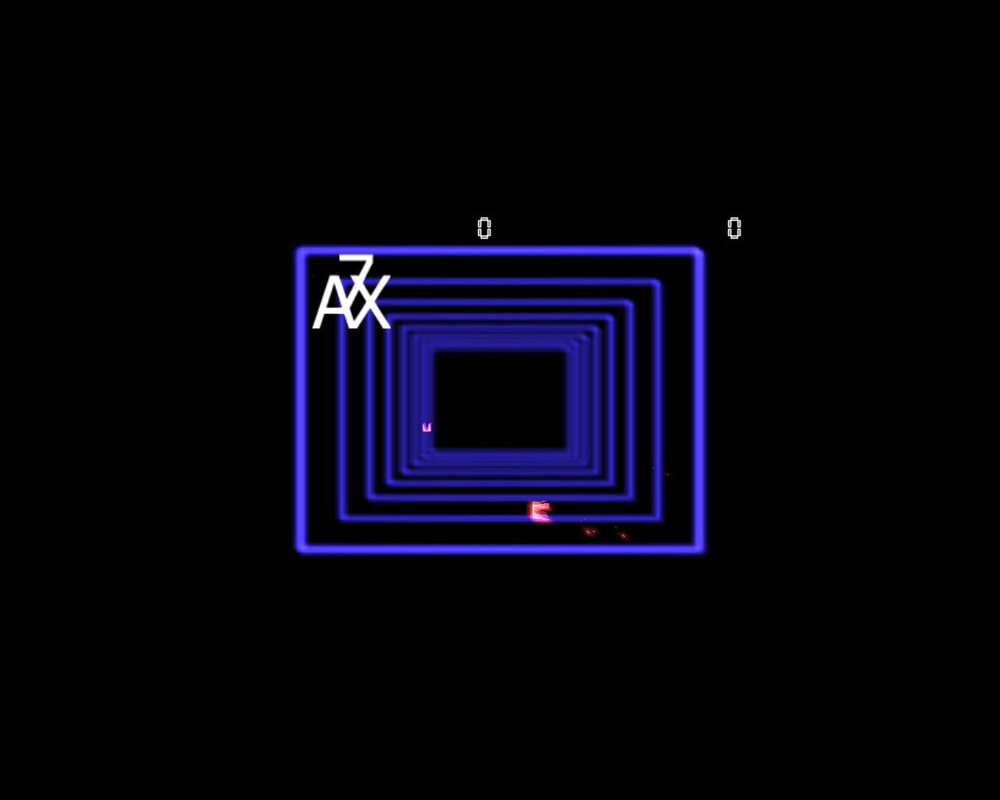 | N/A |
| [abe](./abe) | amd64  | ubuntu-noble | 1.1+dfsg-5 |  | N/A |
| [abiword](./abiword) | amd64  | ubuntu-noble | 3.0.5~dfsg-3.2build4 |  | N/A |
| [accerciser](./accerciser) | amd64  | ubuntu-noble | 3.42.0-1ubuntu0.1-20250327 | 失败 | N/A |
| [accountwizard](./accountwizard) | amd64  | ubuntu-noble | 23.08.5-0ubuntu3-20250327 | 失败 | N/A |
| [ace-of-penguins](./ace-of-penguins) | amd64  | ubuntu-noble | 1.5~rc2-5ubuntu4 |  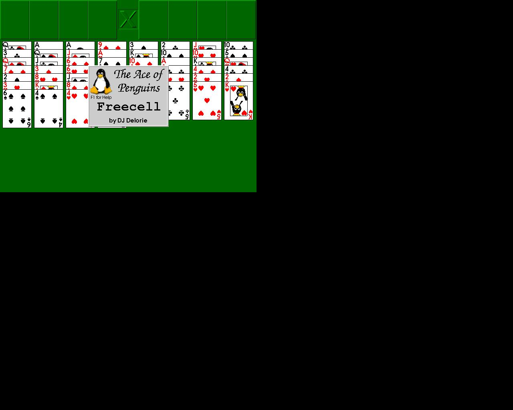       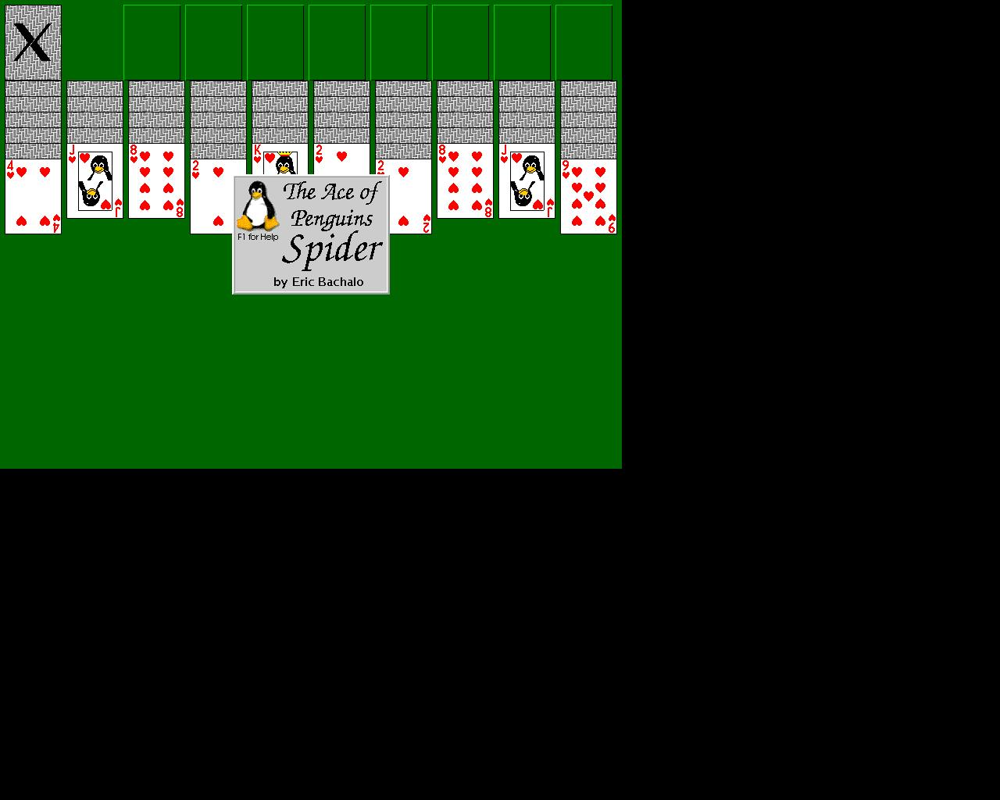  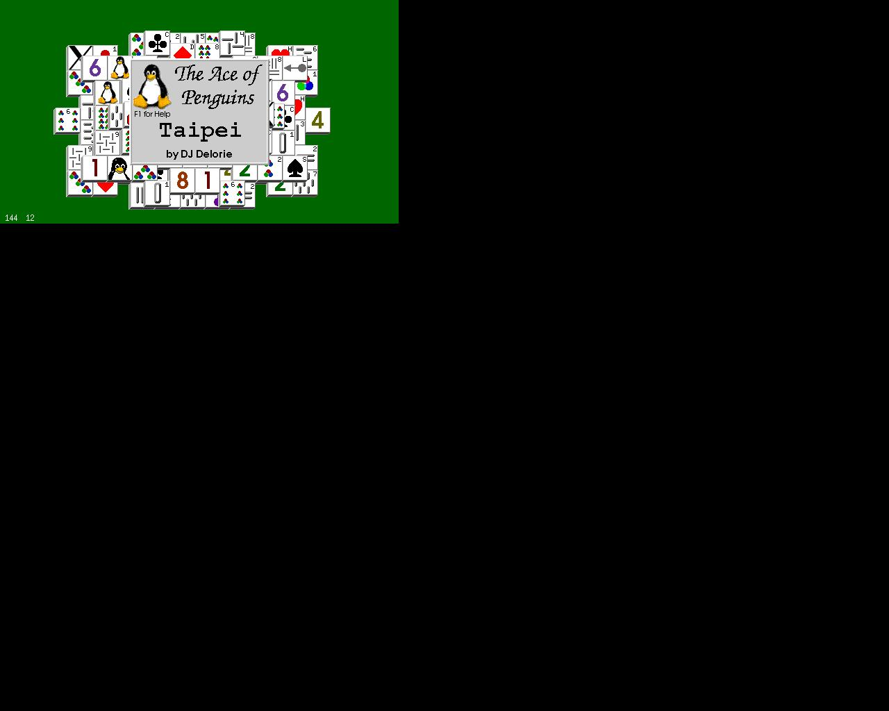 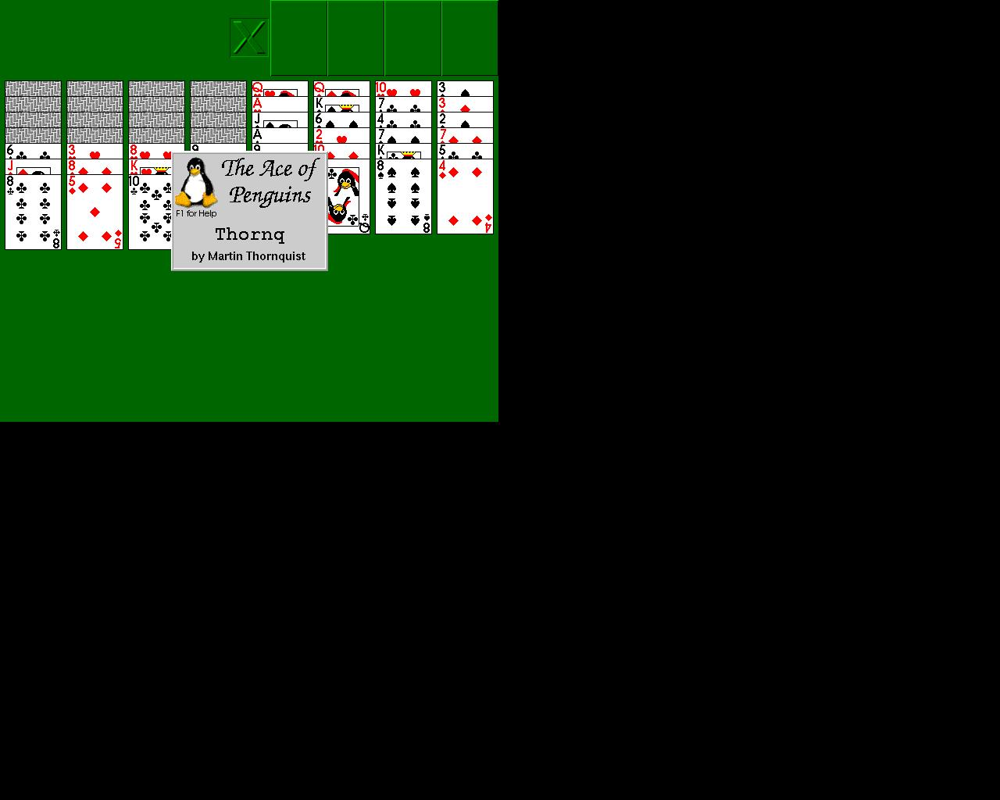 | N/A |
| [acetoneiso](./acetoneiso) | amd64  | ubuntu-noble | 2.4-4build2 |  | N/A |
| [achilles](./achilles) | amd64  | ubuntu-noble | 2-12build2 |  | N/A |
| [aclock.app](./aclock.app) | amd64  | ubuntu-noble | 0.4.0-2build5 |  | N/A |
| [aconnectgui](./aconnectgui) | amd64  | ubuntu-noble | 0.9.0rc2-1-10.3build2 |  | N/A |
| [actiona](./actiona) | amd64  | ubuntu-noble | 3.10.1-1build6 |  | N/A |
| [activity-aware-firefox](./activity-aware-firefox) | amd64  | ubuntu-noble | 0.4.2-1-20250327 | 失败 | N/A |
| [activity-log-manager](./activity-log-manager) | amd64  | ubuntu-noble | 0.9.7-0ubuntu31 | 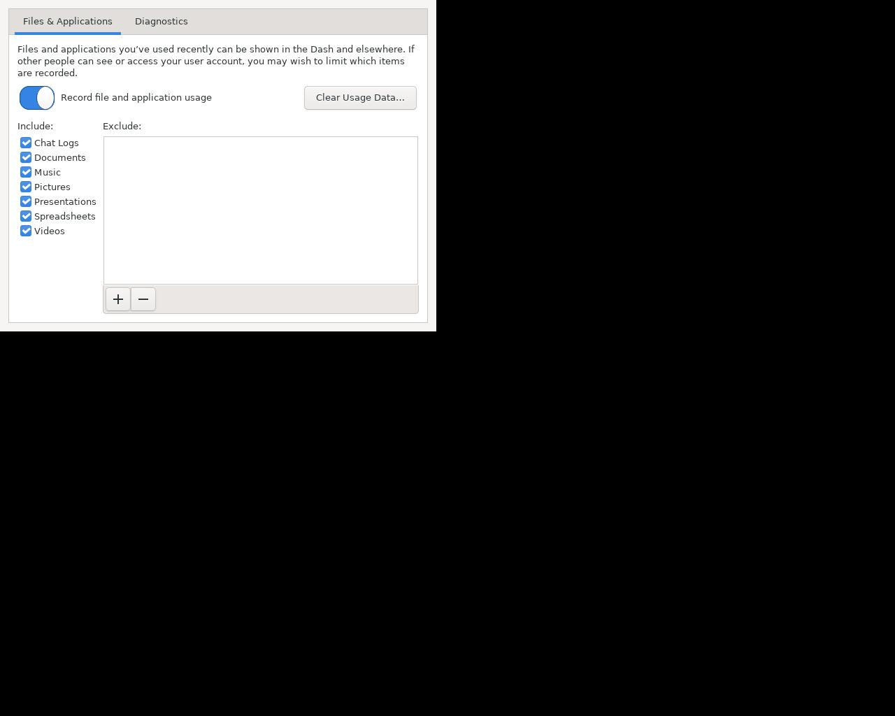 | N/A |
| [add64](./add64) | amd64  | ubuntu-noble | 3.9.3-0ubuntu3 |  | N/A |
| [addressmanager.app](./addressmanager.app) | amd64  | ubuntu-noble | 0.4.8-3build6 | 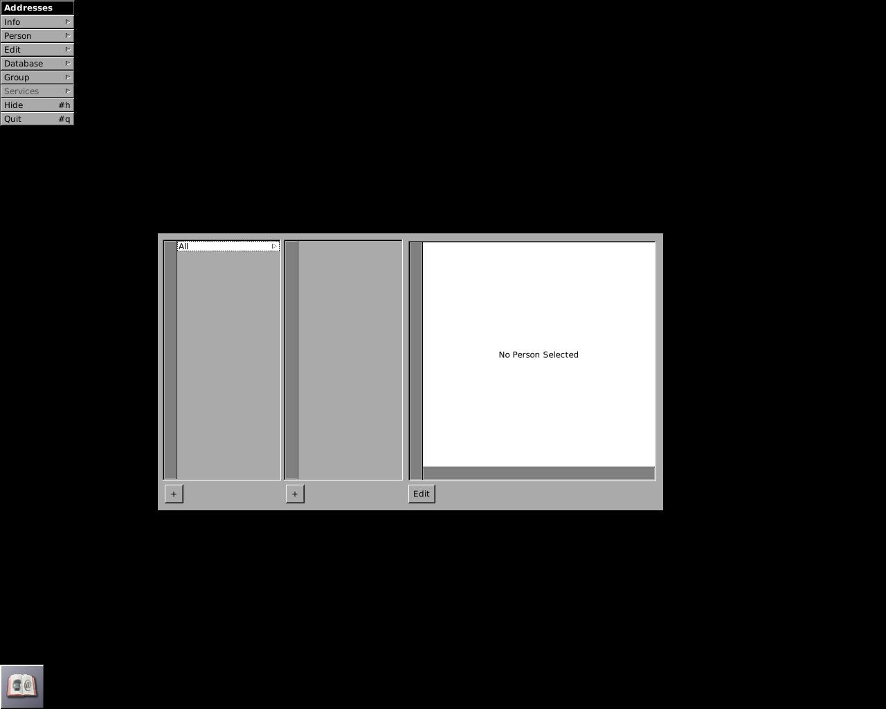 | N/A |
| [adonthell-data](./adonthell-data) | amd64  | ubuntu-noble | 0.3.8-1 |  | N/A |
| [adun.app](./adun.app) | amd64  | ubuntu-noble | 0.81-14build4 |  | N/A |
| [aegisub](./aegisub) | amd64  | ubuntu-noble | 3.2.2+dfsg-7.1build2 |  | N/A |
| [aeolus](./aeolus) | amd64  | ubuntu-noble | 0.10.4-1build3-20250327 | 失败 | N/A |
| [aerc](./aerc) | amd64  | ubuntu-noble | 0.17.0-1ubuntu0.24.04.2-20250327 | 失败 | N/A |
| [afterstep](./afterstep) | amd64  | ubuntu-noble | 2.2.12-17.1build3-20250327 | 失败 | N/A |
| [afterstep-data](./afterstep-data) | amd64  | ubuntu-noble | 2.2.12-17.1build3-20250327 | 失败 | N/A |
| [agenda.app](./agenda.app) | amd64  | ubuntu-noble | 0.46-3build3 |  | N/A |
| [aghermann](./aghermann) | amd64  | ubuntu-noble | 1.1.2-5build2 |  | N/A |
| [agordejo](./agordejo) | amd64  | ubuntu-noble | 0.4.2-0ubuntu1-20250327 | 失败 | N/A |
| [airstrike](./airstrike) | amd64  | ubuntu-noble | 0.99+1.0pre6a-11 |  | N/A |
| [aisleriot](./aisleriot) | amd64  | ubuntu-noble | 3.22.31-1build2 |  | N/A |
| [akira](./akira) | amd64  | ubuntu-noble | 0.0.16-2build2 |  | N/A |
| [akonadi-import-wizard](./akonadi-import-wizard) | amd64  | ubuntu-noble | 23.08.5-0ubuntu4 |  | N/A |
| [akonadiconsole](./akonadiconsole) | amd64  | ubuntu-noble | 23.08.5-0ubuntu5.2 |  | N/A |
| [akregator](./akregator) | amd64  | ubuntu-noble | 23.08.5-0ubuntu4.1 |  | N/A |
| [alacarte](./alacarte) | amd64  | ubuntu-noble | 3.52.0-1-20250327 | 失败 | N/A |
| [alacritty](./alacritty) | amd64  | deepin-v23 | 0.13.2-2 |  | [SHA256](./alacritty/SHA256SUMS) |
| [aladin](./aladin) | amd64  | ubuntu-noble | 12.060+dfsg-3 |  | N/A |
| [alarm-clock-applet](./alarm-clock-applet) | amd64  | ubuntu-noble | 0.4.1-5build2 |  | N/A |
| [alex4](./alex4) | amd64  | ubuntu-noble | 1.1-10ubuntu4-20250327 | 失败 | N/A |
| [algobox](./algobox) | amd64  | ubuntu-noble | 1.1.1+dfsg-1build2 |  | N/A |
| [alien-arena](./alien-arena) | amd64  | ubuntu-noble | 7.71.3+dfsg-3ubuntu1-20250327 | 失败 | N/A |
| [alienblaster](./alienblaster) | amd64  | ubuntu-noble | 1.1.0-11 |  | N/A |
| [aliki](./aliki) | amd64  | ubuntu-noble | 0.3.0-6build2 |   | N/A |
| [alkimia-bin](./alkimia-bin) | amd64  | ubuntu-noble | 8.1.2-2build2-20250327 | 失败 | N/A |
| [allure](./allure) | amd64  | ubuntu-noble | 0.11.0.0-1 |  | N/A |
| [almanah](./almanah) | amd64  | ubuntu-noble | 0.12.3-2build3 |  | N/A |
| [alsa-scarlett-gui](./alsa-scarlett-gui) | amd64  | ubuntu-noble | 0.4.0-1 |  | N/A |
| [alsa-tools-gui](./alsa-tools-gui) | amd64  | deepin-v23 | 1.2.11-1.1-20250327 | 失败 | N/A |
| [alsamixergui](./alsamixergui) | amd64  | ubuntu-noble | 0.9.0rc2-1-10.2build2 | 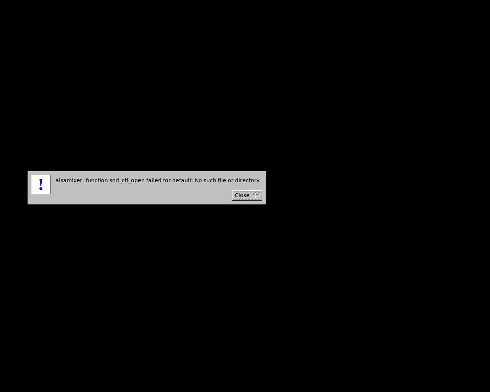 | N/A |
| [alsaplayer-common](./alsaplayer-common) | amd64  | ubuntu-noble | 0.99.81-2build6 |  | N/A |
| [altos](./altos) | amd64  | ubuntu-noble | 1.9.17-1ubuntu3 |    | N/A |
| [amberol](./amberol) | amd64  | ubuntu-noble | 0.10.3-3ubuntu1 |  | N/A |
| [amide](./amide) | amd64  | ubuntu-noble | 1.0.6-5build2 | 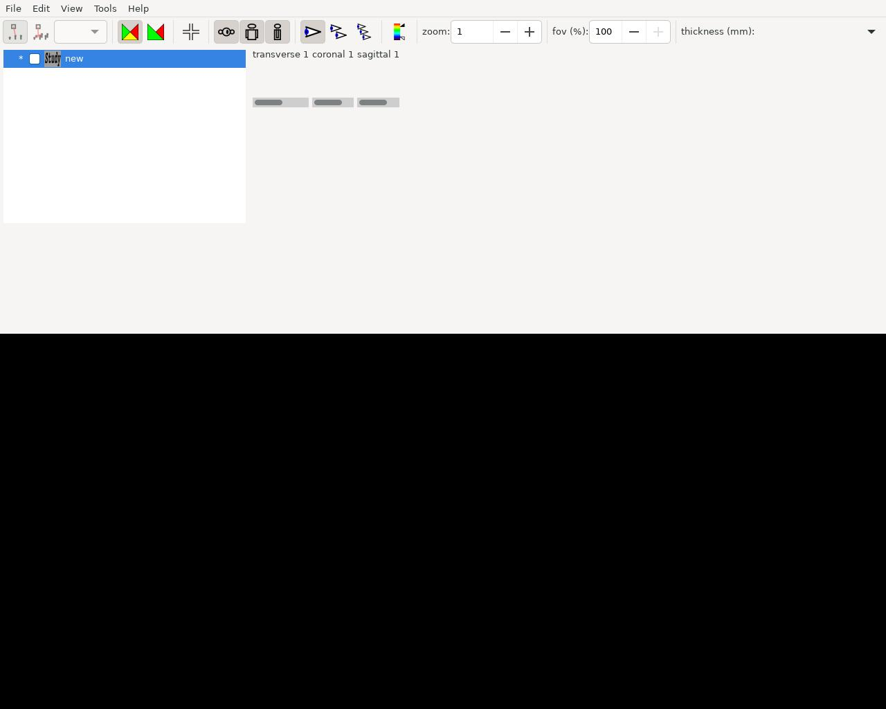 | N/A |
| [amoebax](./amoebax) | amd64  | ubuntu-noble | 0.2.1+dfsg-6 |  | N/A |
| [amphetamine](./amphetamine) | amd64  | ubuntu-noble | 0.8.10-21build1 |  | N/A |
| [ams](./ams) | amd64  | ubuntu-noble | 2.2.1-1build3-20250327 | 失败 | N/A |
| [amsynth](./amsynth) | amd64  | ubuntu-noble | 1.13.2-1build2 |  | N/A |
| [amule](./amule) | amd64  | ubuntu-noble | 2.3.3-3build5 |  | N/A |
| [amule-utils-gui](./amule-utils-gui) | amd64  | ubuntu-noble | 2.3.3-3build5 |   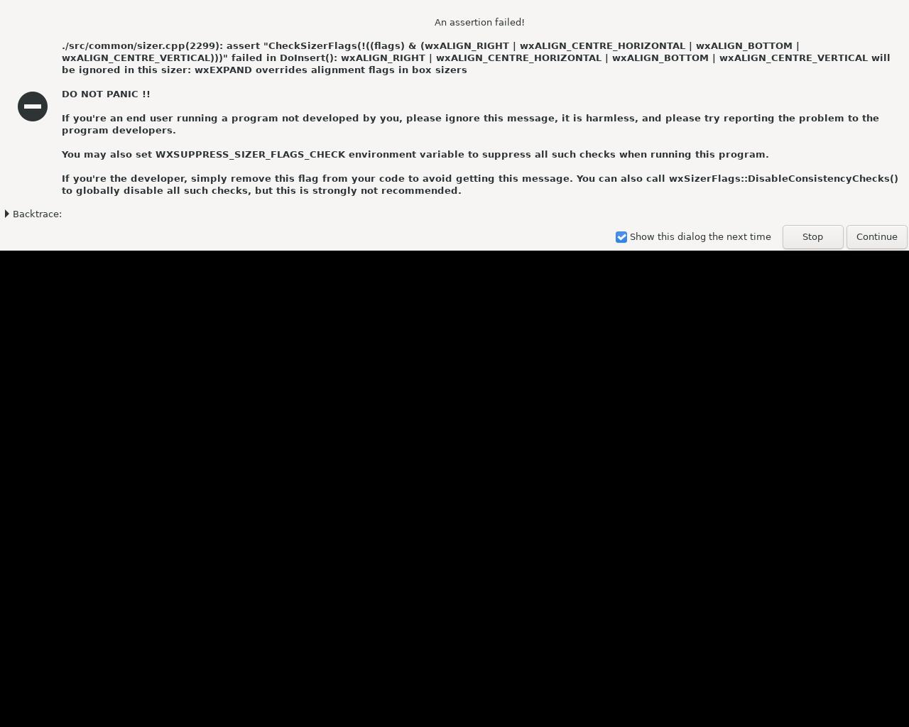 | N/A |
| [anarchism](./anarchism) | amd64  | ubuntu-noble | 15.3-3-20250327 | 失败 | N/A |
| [android-file-transfer](./android-file-transfer) | amd64  | ubuntu-noble | 4.3-1build3 |  | N/A |
| [angband-data](./angband-data) | amd64  | ubuntu-noble | 4.2.5+dfsg1-1-20250327 | 失败 | N/A |
| [angelfish](./angelfish) | amd64  | ubuntu-noble | 23.08.5-0ubuntu3-20250327 | 失败 | N/A |
| [angrydd](./angrydd) | amd64  | ubuntu-noble | 1.0.1-14 |  | N/A |
| [anki](./anki) | amd64  | ubuntu-noble | 2.1.15+dfsg-3ubuntu4.1 |  | N/A |
| [ansifilter-gui](./ansifilter-gui) | amd64  | ubuntu-noble | 2.18+dfsg1-2build2 |  | N/A |
| [antigravitaattori](./antigravitaattori) | amd64  | ubuntu-noble | 0.0.3-10build2-20250327 | 失败 | N/A |
| [antimicro](./antimicro) | amd64  | ubuntu-noble | 3.1.4-2 |  | N/A |
| [antimony](./antimony) | amd64  | ubuntu-noble | 0.9.3-2build9 | 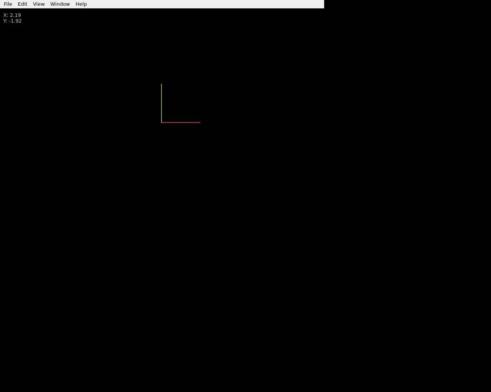 | N/A |
| [anymeal](./anymeal) | amd64  | ubuntu-noble | 1.26-1build2 |  | N/A |
| [aobook](./aobook) | amd64  | ubuntu-noble | 1.0.3-3build2 |  | N/A |
| [aoflagger](./aoflagger) | amd64  | ubuntu-noble | 3.4.0-2build4 |   | N/A |
| [apitrace-gui](./apitrace-gui) | amd64  | ubuntu-noble | 11.1+repack-1.2build3 |  | N/A |
| [apostrophe](./apostrophe) | amd64  | ubuntu-noble | 2.6.3-4-20250327 | 失败 | N/A |
| [apper](./apper) | amd64  | ubuntu-noble | 1.0.0-5build2-20250327 | 失败 | N/A |
| [apport-gtk](./apport-gtk) | amd64  | ubuntu-noble | 2.28.1-0ubuntu3.5-20250327 | 失败 | N/A |
| [apport-kde](./apport-kde) | amd64  | ubuntu-noble | 2.28.1-0ubuntu3.5-20250327 | 失败 | N/A |
| [apt-offline-gui](./apt-offline-gui) | amd64  | ubuntu-noble | 1.8.5-1 |  | N/A |
| [apturl-common](./apturl-common) | amd64  | ubuntu-noble | 0.5.2ubuntu23-20250327 | 失败 | N/A |
| [apvlv](./apvlv) | amd64  | ubuntu-noble | 0.5.0+repack-2build3 | 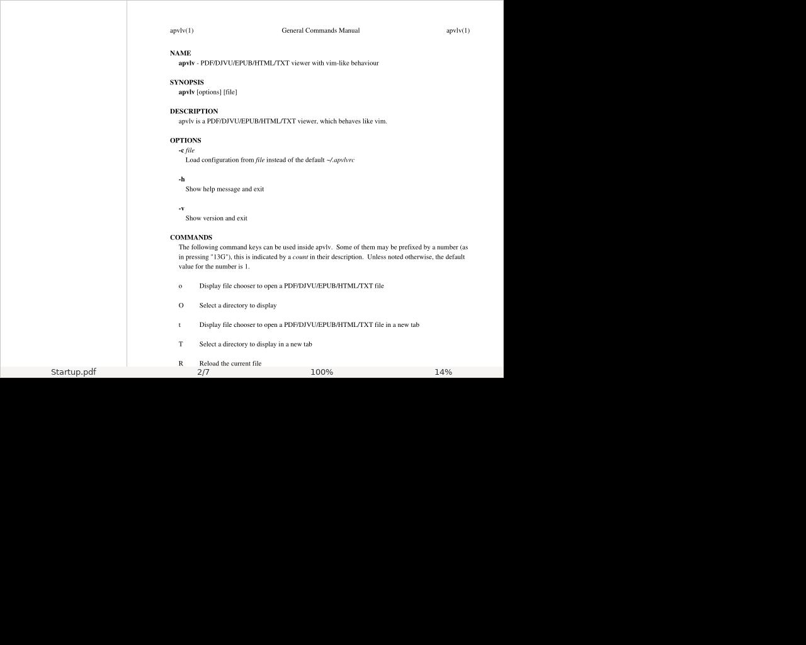 | N/A |
| [aqemu](./aqemu) | amd64  | ubuntu-noble | 0.9.2-3ubuntu2 |  | N/A |
| [arandr](./arandr) | amd64  | ubuntu-noble | 0.1.11-1-20250327 | 失败 | N/A |
| [aranym](./aranym) | amd64  | ubuntu-noble | 1.1.0-2 |    | N/A |
| [aravis-tools](./aravis-tools) | amd64  | ubuntu-noble | 0.8.30-1build2-20250327 | 失败 | N/A |
| [arb](./arb) | amd64  | ubuntu-noble | 6.0.6-7build3-20250327 | 失败 | N/A |
| [arc-gui-clients](./arc-gui-clients) | amd64  | ubuntu-noble | 0.4.6-7build5 |     | N/A |
| [ardentryst](./ardentryst) | amd64  | ubuntu-noble | 1.71-10 | 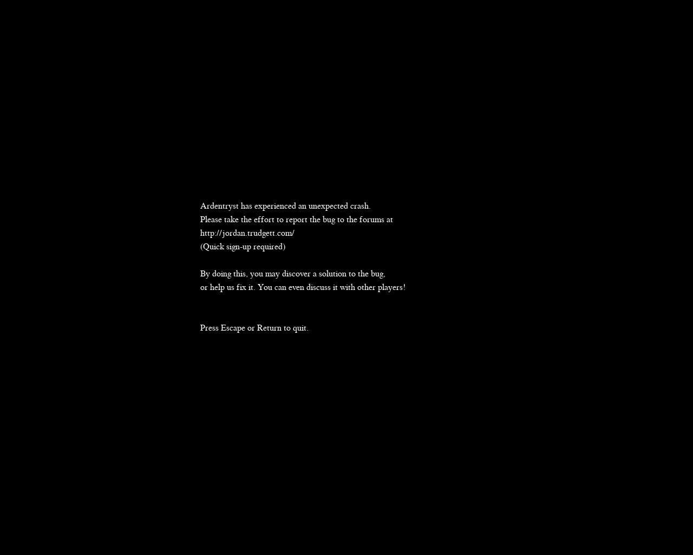 | N/A |
| [ardour](./ardour) | amd64  | ubuntu-noble | 8.4.0+ds1-2ubuntu8 |  | N/A |
| [arduino](./arduino) | amd64  | ubuntu-noble | 1.8.19+dfsg1-2 |  | N/A |
| [ares](./ares) | amd64  | ubuntu-noble | 134+dfsg-1build2 |  | N/A |
| [ario](./ario) | amd64  | ubuntu-noble | 1.6-1.2build4 |  | N/A |
| [ark](./ark) | amd64  | ubuntu-noble | 23.08.5-0ubuntu5 |  | N/A |
| [armagetronad](./armagetronad) | amd64  | ubuntu-noble | 0.2.9.1.1-1build2 | 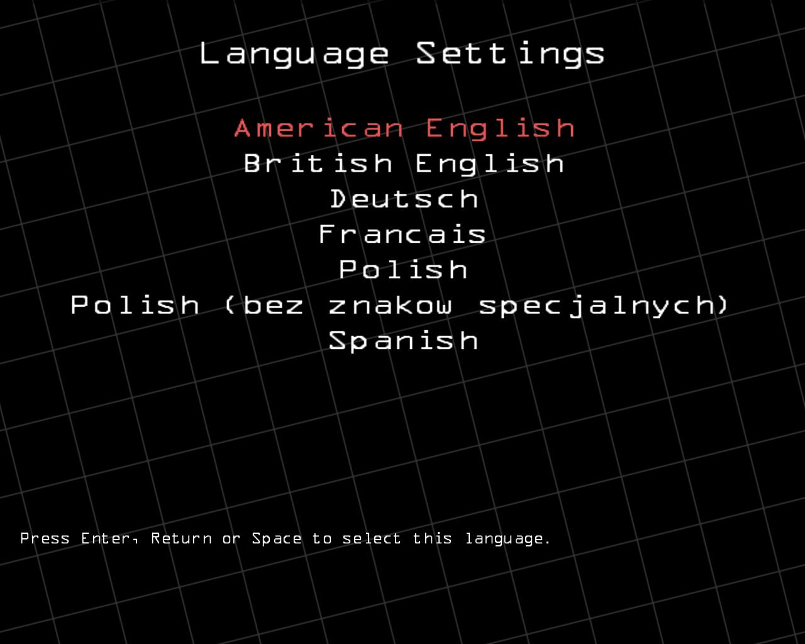 | N/A |
| [arqiver](./arqiver) | amd64  | ubuntu-noble | 0.9.0-1build2 |  | N/A |
| [artemis](./artemis) | amd64  | ubuntu-noble | 18.2.0+dfsg-3 |     | N/A |
| [artha](./artha) | amd64  | ubuntu-noble | 1.0.5-3build2 | 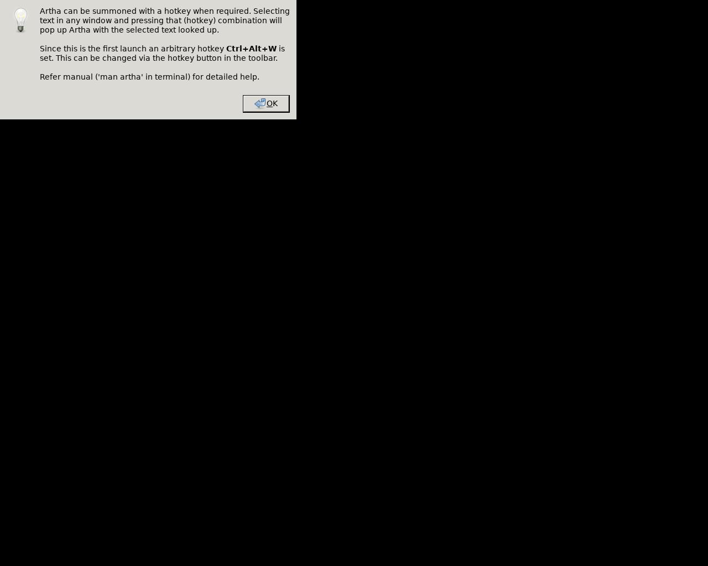 | N/A |
| [artikulate](./artikulate) | amd64  | ubuntu-noble | 23.08.5-0ubuntu3 |  | N/A |
| [asc](./asc) | amd64  | ubuntu-noble | 2.6.1.0-9build5 |  | N/A |
| [asciijump](./asciijump) | amd64  | ubuntu-noble | 1.0.2~beta-10-20250327 | 失败 | N/A |
| [ase](./ase) | amd64  | ubuntu-noble | 3.22.1-4 |  | N/A |
| [aseba](./aseba) | amd64  | ubuntu-noble | 1.6.99+dfsg-9build2 |  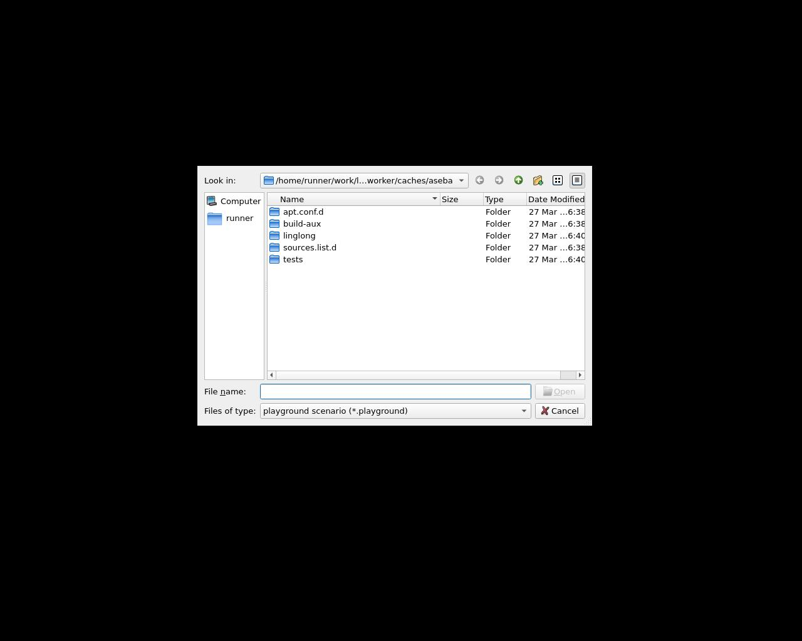  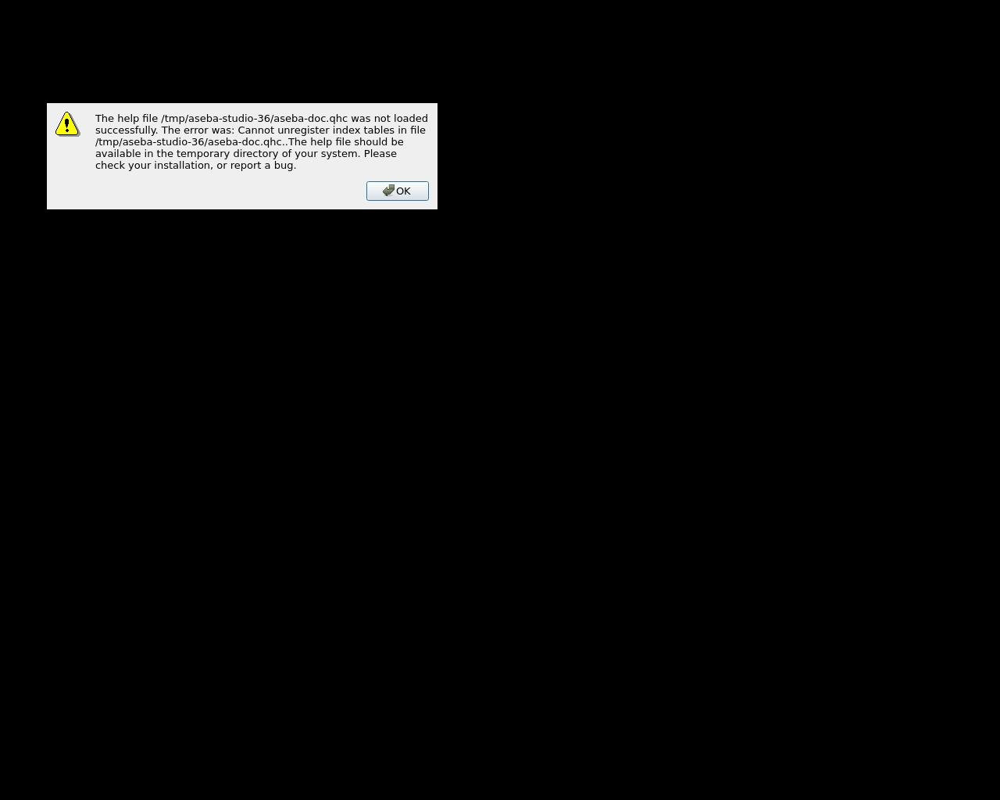    | N/A |
| [assaultcube](./assaultcube) | amd64  | ubuntu-noble | 1.3.0.2+dfsg-5 |  | N/A |
| [astromenace](./astromenace) | amd64  | ubuntu-noble | 1.3.2+repack-7 |  | N/A |
| [asunder](./asunder) | amd64  | ubuntu-noble | 3.0.1+ds-1build2 |  | N/A |
| [asylum](./asylum) | amd64  | ubuntu-noble | 0.3.2-3build1 |  | N/A |
| [atanks](./atanks) | amd64  | ubuntu-noble | 6.6~dfsg-1build2 |  | N/A |
| [atari800](./atari800) | amd64  | ubuntu-noble | 5.0.0-1build2 |  | N/A |
| [atomes](./atomes) | amd64  | ubuntu-noble | 1.1.12+repack-2ubuntu2 |  | N/A |
| [atomix](./atomix) | amd64  | ubuntu-noble | 44.0-3build3 |  | N/A |
| [atril](./atril) | amd64  | ubuntu-noble | 1.26.2-3build2 |  | N/A |
| [audacious](./audacious) | amd64  | ubuntu-noble | 4.3.1-2.1build2 | 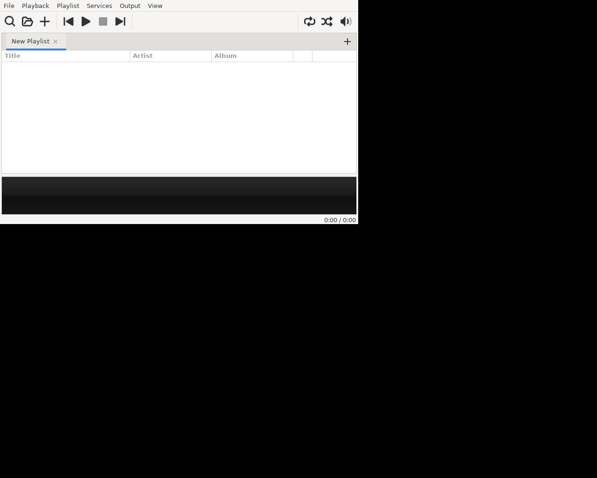 | N/A |
| [audacity](./audacity) | amd64  | deepin-v23 | 3.4.2+dfsg-1deepin0 |  | [SHA256](./audacity/SHA256SUMS) |
| [audmes](./audmes) | amd64  | ubuntu-noble | 2024.02.18-1build2 |  | N/A |
| [aumix](./aumix) | amd64  | ubuntu-noble | 2.9.1-7.1-20250327 | 失败 | N/A |
| [auralquiz](./auralquiz) | amd64  | ubuntu-noble | 1.0.0-3build3 |  | N/A |
| [aurora-printer-a121](./aurora-printer-a121) | amd64  | deepin-v23 | 1.0.3-20250327 | 失败 | N/A |
| [ausweisapp](./ausweisapp) | amd64  | ubuntu-noble | 2.1.0-1build1 | 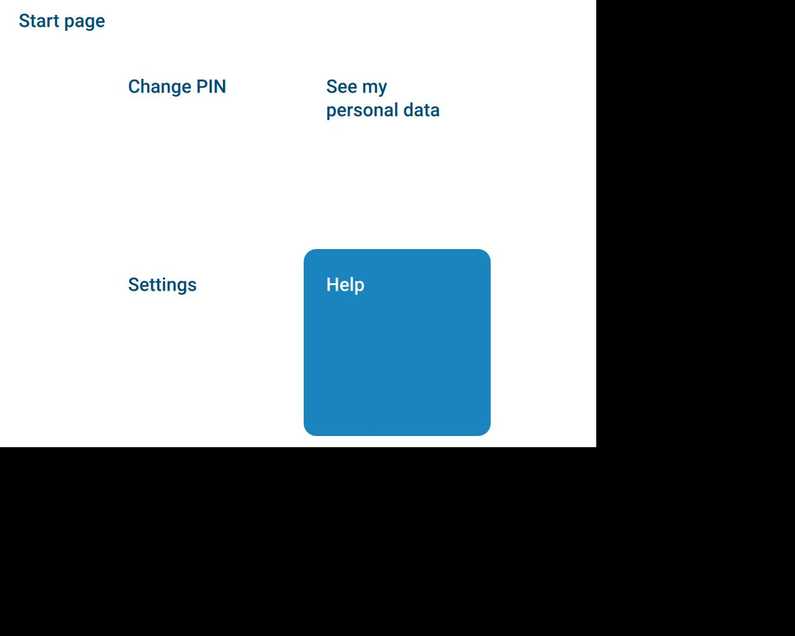 | N/A |
| [auto-multiple-choice](./auto-multiple-choice) | amd64  | ubuntu-noble | 1.6.0-3build4-20250327 | 失败 | N/A |
| [autokey-gtk](./autokey-gtk) | amd64  | ubuntu-noble | 0.95.10-2.1-20250327 | 失败 | N/A |
| [autokey-qt](./autokey-qt) | amd64  | ubuntu-noble | 0.95.10-2.1 | 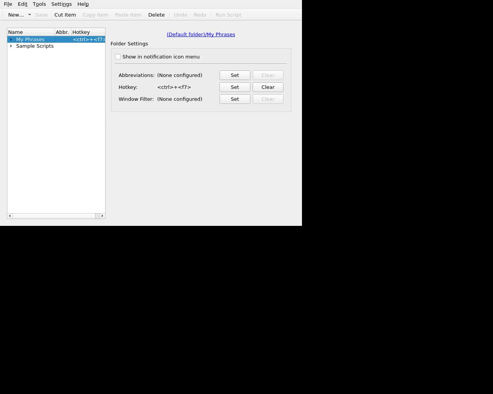 | N/A |
| [autorenamer](./autorenamer) | amd64  | ubuntu-noble | 0.6-1-20250327 | 失败 | N/A |
| [avahi-discover](./avahi-discover) | amd64  | ubuntu-noble | 0.8-13ubuntu6-20250327 | 失败 | N/A |
| [avahi-ui-utils](./avahi-ui-utils) | amd64  | ubuntu-noble | 0.8-13ubuntu6 | 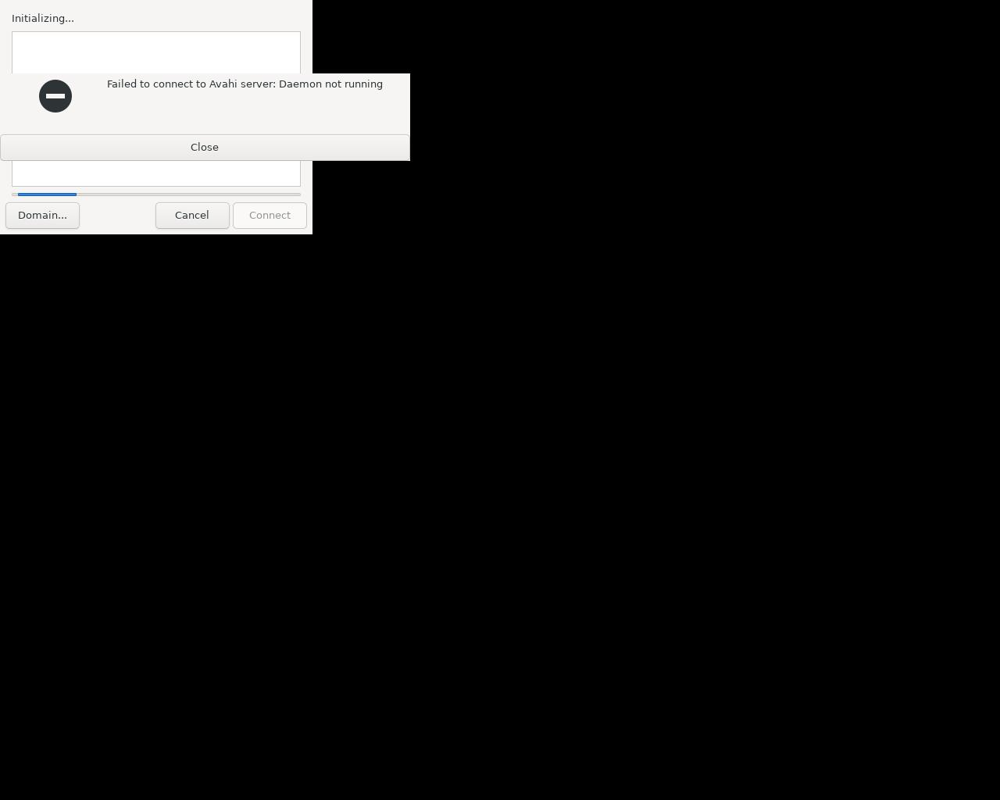  | N/A |
| [avogadro](./avogadro) | amd64  | ubuntu-noble | 1.99.0-1build2 |  | N/A |
| [awf-gtk3](./awf-gtk3) | amd64  | ubuntu-noble | 2.8.0-1build2 |  | N/A |
| [awf-gtk4](./awf-gtk4) | amd64  | ubuntu-noble | 2.8.0-1build2 |  | N/A |
| [ayatana-settings](./ayatana-settings) | amd64  | ubuntu-noble | 23.11.14-1-20250327 | 失败 | N/A |
| [ayatana-webmail](./ayatana-webmail) | amd64  | ubuntu-noble | 23.12.25+dfsg-1-20250327 | 失败 | N/A |
| [backintime-qt](./backintime-qt) | amd64  | ubuntu-noble | 1.4.3-1 |  | N/A |
| [bacula-console-qt](./bacula-console-qt) | amd64  | ubuntu-noble | 13.0.4-1build3 | 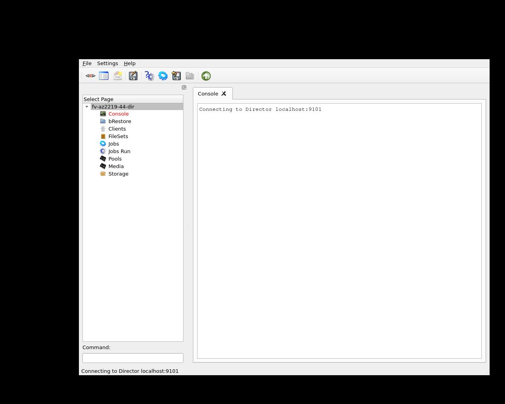 | N/A |
| [bacula-tray-monitor](./bacula-tray-monitor) | amd64  | ubuntu-noble | 13.0.4-1build3 |  | N/A |
| [ballerburg](./ballerburg) | amd64  | ubuntu-noble | 1.2.1-1 |  | N/A |
| [ballview](./ballview) | amd64  | ubuntu-noble | 1.5.0+git20180813.37fc53c-11build5 |  | N/A |
| [ballz](./ballz) | amd64  | ubuntu-noble | 1.0.4-1.1build2 |  | N/A |
| [balsa](./balsa) | amd64  | ubuntu-noble | 2.6.4-2build5-20250327 | 失败 | N/A |
| [bambam](./bambam) | amd64  | ubuntu-noble | 1.2.1+dfsg-1 |  | N/A |
| [bambootracker](./bambootracker) | amd64  | ubuntu-noble | 0.6.1-1build2-20250327 | 失败 | N/A |
| [baobab](./baobab) | amd64  | ubuntu-noble | 46.0-1build1 |  | N/A |
| [barrage](./barrage) | amd64  | ubuntu-noble | 1.0.5-1 |  | N/A |
| [barrier](./barrier) | amd64  | ubuntu-noble | 2.4.0+dfsg-4build3 |  | N/A |
| [basex](./basex) | amd64  | ubuntu-noble | 10.5-1-20250327 | 失败 | N/A |
| [basic256](./basic256) | amd64  | ubuntu-noble | 2.0.99.7-2build3 |  | N/A |
| [basilisk2](./basilisk2) | amd64  | ubuntu-noble | 0.9.20240401-1 |  | N/A |
| [basket](./basket) | amd64  | ubuntu-noble | 2.49-1build3 |  | N/A |
| [bastet](./bastet) | amd64  | ubuntu-noble | 0.43-7build1-20250327 | 失败 | N/A |
| [batmon.app](./batmon.app) | amd64  | ubuntu-noble | 0.9-2build5 | 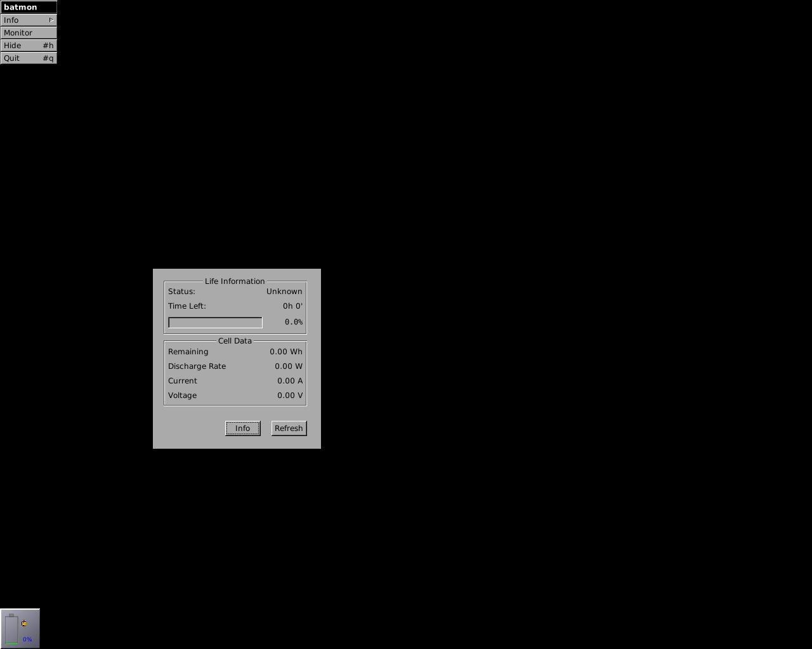 | N/A |
| [battery-stats](./battery-stats) | amd64  | ubuntu-noble | 0.5.6-2.1 |  | N/A |
| [bb](./bb) | amd64  | deepin-v23 | 1.3rc1-13 | 失败 | [SHA256](./bb/SHA256SUMS) |
| [bbpager](./bbpager) | amd64  | ubuntu-noble | 0.4.7-10-20250327 | 失败 | N/A |
| [bcnc](./bcnc) | amd64  | ubuntu-noble | 0.9.14.318+ds-4 |  | N/A |
| [bdbvu](./bdbvu) | amd64  | ubuntu-noble | 0.1-3.1build2 |  | N/A |
| [beads](./beads) | amd64  | ubuntu-noble | 1.1.22-1build4 |  | N/A |
| [bear-factory](./bear-factory) | amd64  | ubuntu-noble | 0.6.0-8build5 |    | N/A |
| [beneath-a-steel-sky](./beneath-a-steel-sky) | amd64  | ubuntu-noble | 0.0372-8 |  | N/A |
| [berusky](./berusky) | amd64  | ubuntu-noble | 1.7.2-3build2 |  | N/A |
| [berusky2](./berusky2) | amd64  | ubuntu-noble | 0.12-4 |  | N/A |
| [bespokesynth](./bespokesynth) | amd64  | ubuntu-noble | 1.2.1+dfsg-4build4 |  | N/A |
| [betaradio](./betaradio) | amd64  | ubuntu-noble | 1.6-1build3 |  | N/A |
| [between](./between) | amd64  | ubuntu-noble | 6+dfsg1-4 |  | N/A |
| [bibledit](./bibledit) | amd64  | ubuntu-noble | 5.1.002-1build5 |  | N/A |
| [bibletime](./bibletime) | amd64  | ubuntu-noble | 3.0.3-3build2 | 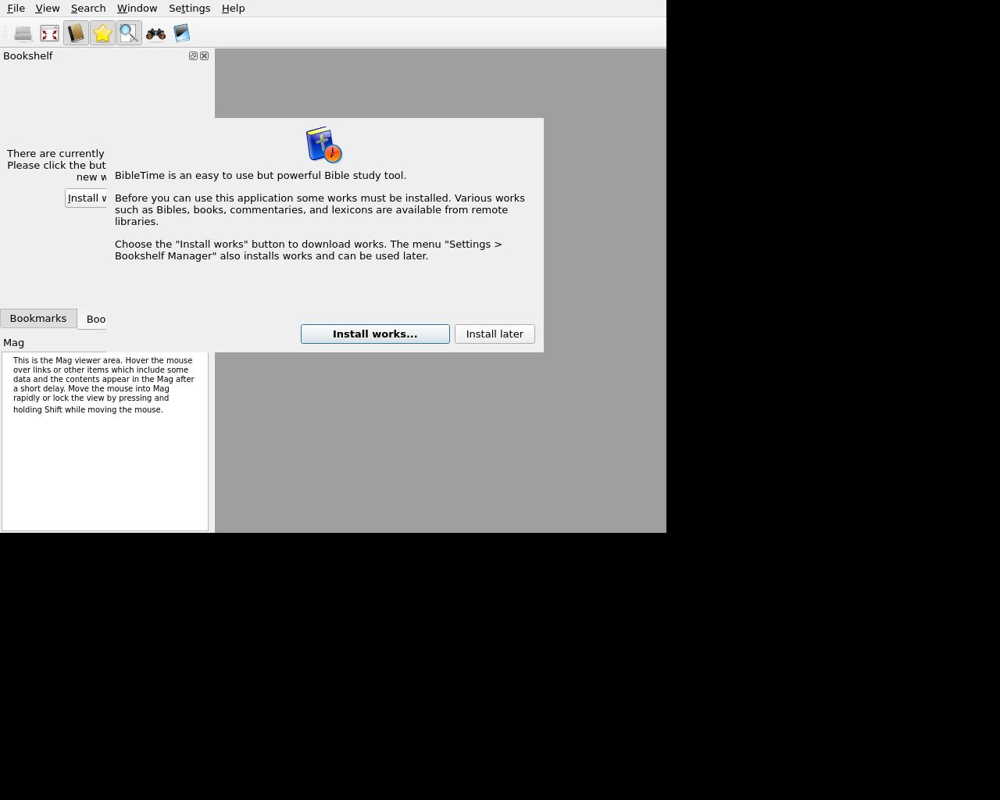 | N/A |
| [bibshelf](./bibshelf) | amd64  | ubuntu-noble | 1.6.0-0ubuntu9 |  | N/A |
| [biglybt](./biglybt) | amd64  | ubuntu-noble | 3.4.0.0-1-20250327 | 失败 | N/A |
| [bijiben](./bijiben) | amd64  | ubuntu-noble | 40.1-6build4-20250327 | 失败 | N/A |
| [billard-gl](./billard-gl) | amd64  | ubuntu-noble | 1.75-17build2 |  | N/A |
| [biloba](./biloba) | amd64  | ubuntu-noble | 0.9.3-11 |  | N/A |
| [biniax2](./biniax2) | amd64  | ubuntu-noble | 1.30-7 |  | N/A |
| [bino](./bino) | amd64  | ubuntu-noble | 2.1-1build2-20250327 | 失败 | N/A |
| [biogenesis](./biogenesis) | amd64  | ubuntu-noble | 0.8-3.1 |  | N/A |
| [birdfont](./birdfont) | amd64  | ubuntu-noble | 2.33.1-3build3 |  | N/A |
| [bisheng-engine](./bisheng-engine) | amd64  | deepin-v23 | 2.0.14-1 | 失败 | [SHA256](./bisheng-engine/SHA256SUMS) |
| [bitsnpicas](./bitsnpicas) | amd64  | ubuntu-noble | 2.0+ds-2-20250327 | 失败 | N/A |
| [biz.zcjt.gaopaiyi](./biz.zcjt.gaopaiyi) | amd64  | deepin-v23 | 1.0.0-20250327 | 失败 | N/A |
| [biz.zcjt.scanner](./biz.zcjt.scanner) | amd64  | deepin-v23 | 1.0.2.0-20250327 | 失败 | N/A |
| [biz.zcjt.zc-a5930dn](./biz.zcjt.zc-a5930dn) | amd64  | deepin-v23 | 1.0.0-23166 |   | N/A |
| [biz.zcjt.zc-a5933dn](./biz.zcjt.zc-a5933dn) | amd64  | deepin-v23 | 1.0.0-23324 |   | N/A |
| [biz.zcjt.zhongchu-sane](./biz.zcjt.zhongchu-sane) | amd64  | deepin-v23 | 20240911-6.6.10.030-20250327 | 失败 | N/A |
| [bkchem](./bkchem) | amd64  | ubuntu-noble | 0.14.0~pre4+git20211228-3-20250327 | 失败 | N/A |
| [black-box](./black-box) | amd64  | ubuntu-noble | 1.4.8-4build1 |  | N/A |
| [blackbox-terminal](./blackbox-terminal) | amd64  | ubuntu-noble | 0.14.0-2build2 |  | N/A |
| [blastem](./blastem) | amd64  | ubuntu-noble | 0.6.3.4-1build1 | 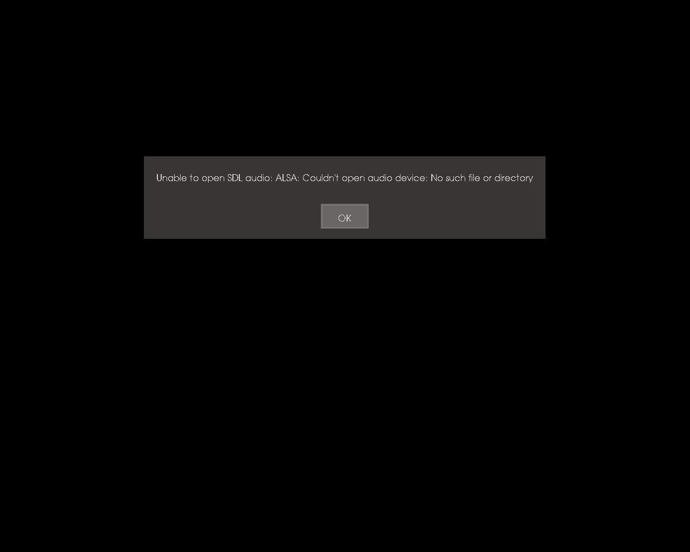 | N/A |
| [bleachbit](./bleachbit) | amd64  | ubuntu-noble | 4.6.0-3-20250327 | 失败 | N/A |
| [blender](./blender) | amd64  | ubuntu-noble | 4.0.2+dfsg-1ubuntu8 |  | N/A |
| [blinken](./blinken) | amd64  | ubuntu-noble | 23.08.5-0ubuntu4 |  | N/A |
| [blobandconquer](./blobandconquer) | amd64  | ubuntu-noble | 1.11-dfsg+20-2-20250327 | 失败 | N/A |
| [blobby](./blobby) | amd64  | ubuntu-noble | 1.1+ds-1ubuntu1 |  | N/A |
| [bloboats](./bloboats) | amd64  | ubuntu-noble | 1.0.2+dfsg-4 |  | N/A |
| [blobwars](./blobwars) | amd64  | ubuntu-noble | 2.00-4ubuntu1 |  | N/A |
| [blockattack](./blockattack) | amd64  | ubuntu-noble | 2.8.0-1build1 |  | N/A |
| [blockout2](./blockout2) | amd64  | ubuntu-noble | 2.5+dfsg1-1build3 |  | N/A |
| [blocks-of-the-undead](./blocks-of-the-undead) | amd64  | ubuntu-noble | 1.0-7build1 |  | N/A |
| [bluedevil](./bluedevil) | amd64  | ubuntu-noble | 5.27.11-0ubuntu2 |  | N/A |
| [bluefish](./bluefish) | amd64  | ubuntu-noble | 2.2.15-1 |  | N/A |
| [blueman](./blueman) | amd64  | deepin-v23 | 2.3.5-3deepin0+rb1-20250327 | 失败 | N/A |
| [blupimania](./blupimania) | amd64  | ubuntu-noble | 1.6.2-17-g5f6cf8b-1 |  | N/A |
| [boats](./boats) | amd64  | ubuntu-noble | 202008-1build2 | 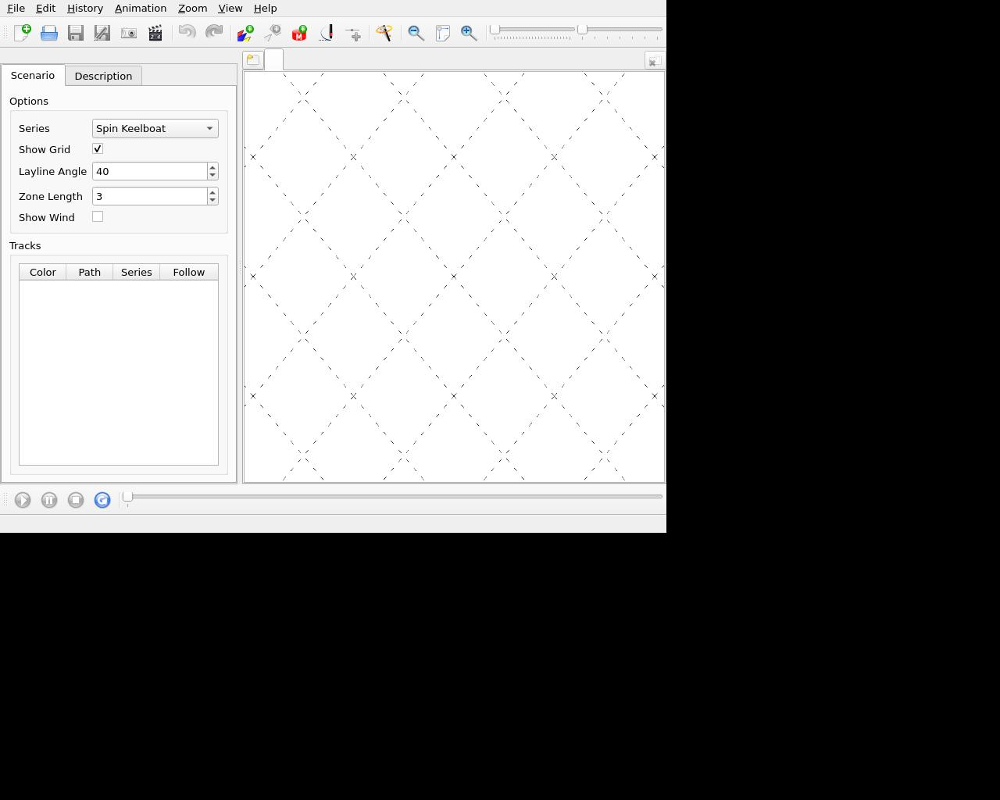 | N/A |
| [boinc-manager](./boinc-manager) | amd64  | ubuntu-noble | 7.24.1+dfsg-4build1 |  | N/A |
| [bomber](./bomber) | amd64  | ubuntu-noble | 23.08.5-0ubuntu3 |  | N/A |
| [bomberclone](./bomberclone) | amd64  | ubuntu-noble | 0.11.9-7.1 | 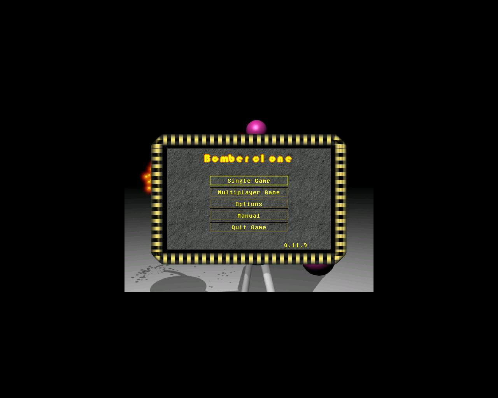 | N/A |
| [bookletimposer](./bookletimposer) | amd64  | ubuntu-noble | 0.3.1-4ubuntu1-20250327 | 失败 | N/A |
| [bookworm](./bookworm) | amd64  | ubuntu-noble | 1.1.2+git20210715-4build3 |  | N/A |
| [boomaga](./boomaga) | amd64  | ubuntu-noble | 3.0.0+git13-g7f7ad47-1build4 | 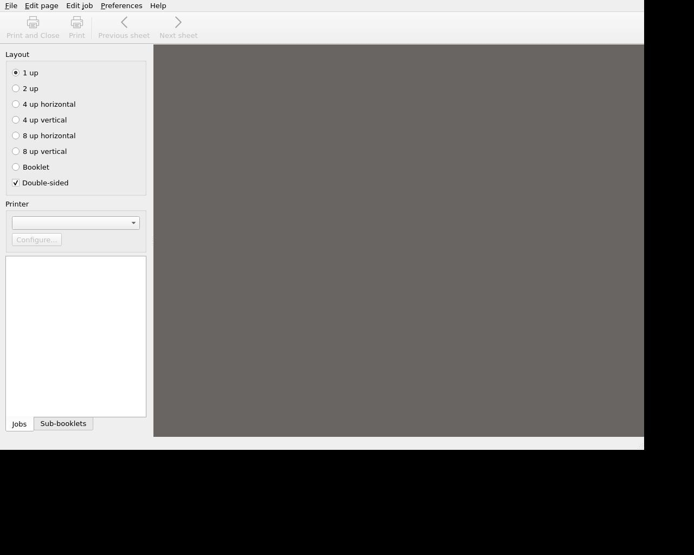 | N/A |
| [bossa](./bossa) | amd64  | ubuntu-noble | 1.9.1-3ubuntu5 |  | N/A |
| [boswars](./boswars) | amd64  | ubuntu-noble | 2.8-2build2 |  | N/A |
| [bouncy](./bouncy) | amd64  | ubuntu-noble | 0.6.20071104-9 |  | N/A |
| [bovo](./bovo) | amd64  | ubuntu-noble | 23.08.5-0ubuntu3 |  | N/A |
| [bpython](./bpython) | amd64  | ubuntu-noble | 0.24-1 |  | N/A |
| [brainparty](./brainparty) | amd64  | ubuntu-noble | 0.61+dfsg-7 |  | N/A |
| [brasero](./brasero) | amd64  | ubuntu-noble | 3.12.3-2build4 |  | N/A |
| [brewtarget](./brewtarget) | amd64  | ubuntu-noble | 3.0.6-1build2 |  | N/A |
| [briquolo](./briquolo) | amd64  | ubuntu-noble | 0.5.7-11build2 |  | N/A |
| [brp-pacu](./brp-pacu) | amd64  | ubuntu-noble | 2.1.2+git20210421-1build2 |  | N/A |
| [brutalchess](./brutalchess) | amd64  | ubuntu-noble | 0.5.2+dfsg-8build1 |  | N/A |
| [bsdgames](./bsdgames) | amd64  | ubuntu-noble | 2.17-33 |           | N/A |
| [btanks](./btanks) | amd64  | ubuntu-noble | 0.9.8083-9build1 |  | N/A |
| [btop](./btop) | amd64  | deepin-v23 | 1.3.0-1 | 失败 | [SHA256](./btop/SHA256SUMS) |
| [budgie-arm-environment](./budgie-arm-environment) | amd64  | ubuntu-noble | 0.20.13-20250327 | 失败 | N/A |
| [budgie-control-center](./budgie-control-center) | amd64  | ubuntu-noble | 1.4.0-2build3-20250327 | 失败 | N/A |
| [budgie-core](./budgie-core) | amd64  | ubuntu-noble | 10.9.1-3ubuntu4-20250327 | 失败 | N/A |
| [budgie-desktop-environment](./budgie-desktop-environment) | amd64  | ubuntu-noble | 0.20.13-20250327 | 失败 | N/A |
| [budgie-desktop-view](./budgie-desktop-view) | amd64  | ubuntu-noble | 1.3-2build1-20250327 | 失败 | N/A |
| [budgie-hotcorners-applet](./budgie-hotcorners-applet) | amd64  | ubuntu-noble | 1.8.0-1build3 |  | N/A |
| [budgie-previews](./budgie-previews) | amd64  | ubuntu-noble | 1.8.0-1build3 | 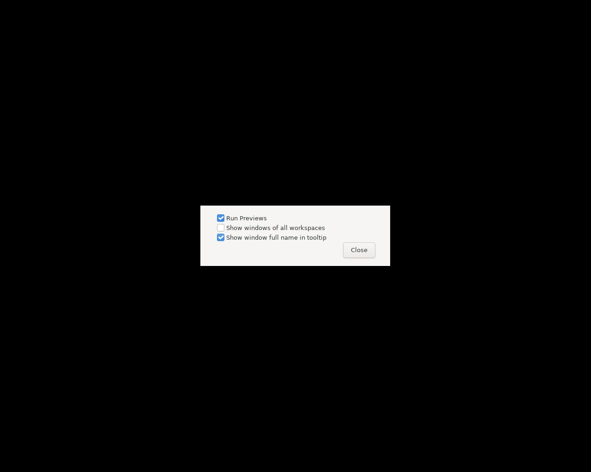 | N/A |
| [budgie-quickchar](./budgie-quickchar) | amd64  | ubuntu-noble | 1.8.0-1build3-20250327 | 失败 | N/A |
| [budgie-wallstreet](./budgie-wallstreet) | amd64  | ubuntu-noble | 1.8.0-1build3 |  | N/A |
| [budgie-welcome](./budgie-welcome) | amd64  | ubuntu-noble | 0.6.1 |     | N/A |
| [budgie-window-shuffler](./budgie-window-shuffler) | amd64  | ubuntu-noble | 1.8.0-1build3 |  | N/A |
| [bugsquish](./bugsquish) | amd64  | ubuntu-noble | 0.0.6-10 |  | N/A |
| [bumprace](./bumprace) | amd64  | ubuntu-noble | 1.5.8-1 | 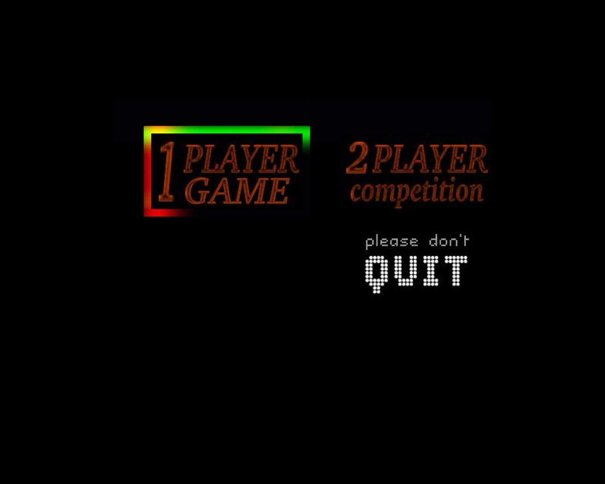 | N/A |
| [burgerspace](./burgerspace) | amd64  | ubuntu-noble | 1.9.5-1build1 |  | N/A |
| [bustle](./bustle) | amd64  | ubuntu-noble | 0.8.0-2build2 |  | N/A |
| [butt](./butt) | amd64  | ubuntu-noble | 0.1.37-2build4 |  | N/A |
| [buzztrax](./buzztrax) | amd64  | ubuntu-noble | 0.10.2-9build2 |  | N/A |
| [bzflag-client](./bzflag-client) | amd64  | ubuntu-noble | 2.4.26-1build3 |  | N/A |
| [c-evo-dh-gtk2](./c-evo-dh-gtk2) | amd64  | ubuntu-noble | 1.10-1build3 |   | N/A |
| [cadabra2](./cadabra2) | amd64  | ubuntu-noble | 2.4.5.4-0ubuntu1-20250327 | 失败 | N/A |
| [caffeine](./caffeine) | amd64  | ubuntu-noble | 2.9.12-1-20250327 | 失败 | N/A |
| [cairo-dock-core](./cairo-dock-core) | amd64  | ubuntu-noble | 3.4.1+git20201103.0836f5d1-1build3 |   | N/A |
| [caja](./caja) | amd64  | ubuntu-noble | 1.26.3-1build3-20250327 | 失败 | N/A |
| [caja-actions](./caja-actions) | amd64  | ubuntu-noble | 1.27.0-1build3 |  | N/A |
| [caja-dropbox](./caja-dropbox) | amd64  | ubuntu-noble | 1.26.0-4build2-20250327 | 失败 | N/A |
| [caja-eiciel](./caja-eiciel) | amd64  | ubuntu-noble | 1.20.1-3build2 |  | N/A |
| [caja-seahorse](./caja-seahorse) | amd64  | ubuntu-noble | 1.18.5-3-20250327 | 失败 | N/A |
| [calamares](./calamares) | amd64  | ubuntu-noble | 3.3.5-0ubuntu4-20250327 | 失败 | N/A |
| [calamares-settings-debian](./calamares-settings-debian) | amd64  | ubuntu-noble | 13.0.5-1-20250327 | 失败 | N/A |
| [calamares-settings-kubuntu](./calamares-settings-kubuntu) | amd64  | ubuntu-noble | 24.04.40-20250327 | 失败 | N/A |
| [calamares-settings-lubuntu](./calamares-settings-lubuntu) | amd64  | ubuntu-noble | 24.04.40-20250327 | 失败 | N/A |
| [calamares-settings-ubuntu-unity](./calamares-settings-ubuntu-unity) | amd64  | ubuntu-noble | 24.04.40-20250327 | 失败 | N/A |
| [calc-common](./calc-common) | amd64  | ubuntu-noble | 2.15.0.4-1build2-20250327 | 失败 | N/A |
| [calf-plugins](./calf-plugins) | amd64  | ubuntu-noble | 0.90.3-4build2-20250327 | 失败 | N/A |
| [calibre](./calibre) | amd64  | ubuntu-noble | 7.6.0+ds-1build1-20250327 | 失败 | N/A |
| [calindori](./calindori) | amd64  | ubuntu-noble | 23.08.5-0ubuntu4 |  | N/A |
| [calligra-data](./calligra-data) | amd64  | ubuntu-noble | 3.2.1+dfsg-8build4-20250327 | 失败 | N/A |
| [calligra-gemini](./calligra-gemini) | amd64  | ubuntu-noble | 3.2.1+dfsg-8build4 |  | N/A |
| [calligraplan](./calligraplan) | amd64  | ubuntu-noble | 3.3.0-2build2 | 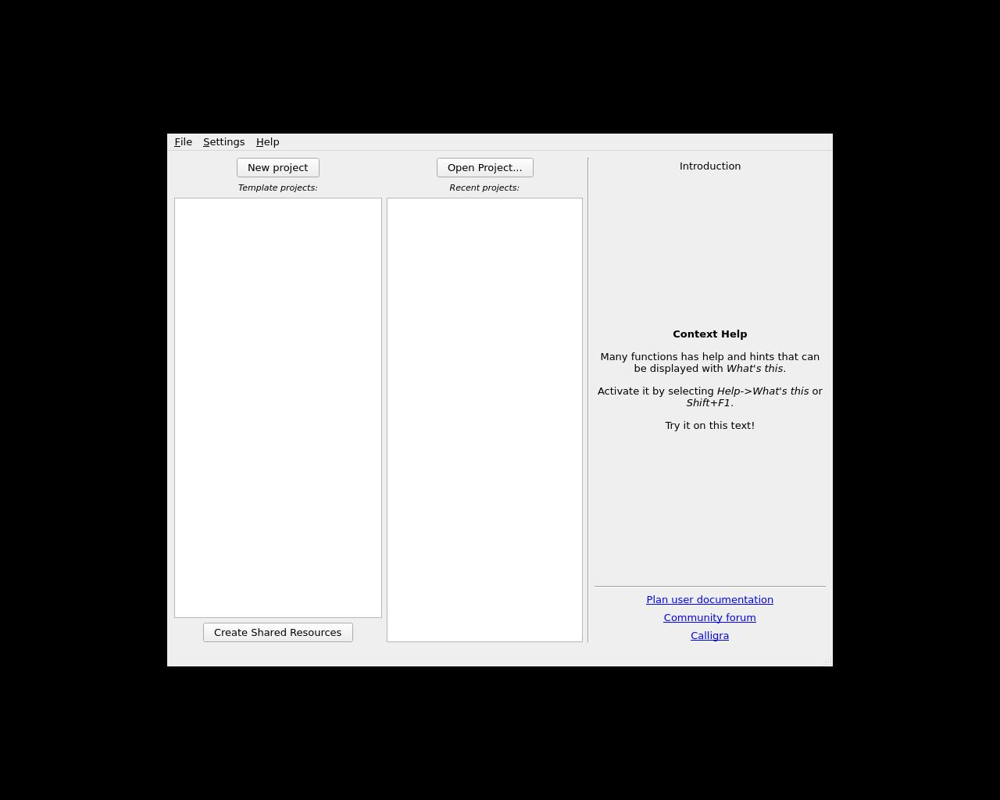  | N/A |
| [calligrasheets](./calligrasheets) | amd64  | ubuntu-noble | 3.2.1+dfsg-8build4 | 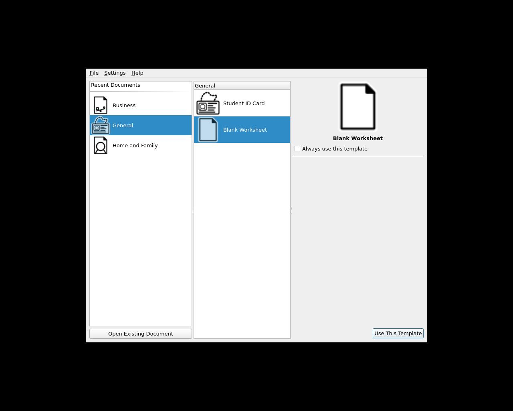 | N/A |
| [calligrastage](./calligrastage) | amd64  | ubuntu-noble | 3.2.1+dfsg-8build4 |  | N/A |
| [calligrawords](./calligrawords) | amd64  | ubuntu-noble | 3.2.1+dfsg-8build4 |  | N/A |
| [camera.app](./camera.app) | amd64  | ubuntu-noble | 0.8.0-13build4 |  | N/A |
| [camitk-actionstatemachine](./camitk-actionstatemachine) | amd64  | ubuntu-noble | 5.2.0-1build7-20250327 | 失败 | N/A |
| [camitk-imp](./camitk-imp) | amd64  | ubuntu-noble | 5.2.0-1build7-20250327 | 失败 | N/A |
| [caneda](./caneda) | amd64  | ubuntu-noble | 0.3.1+gitg08e22168-1build2 | 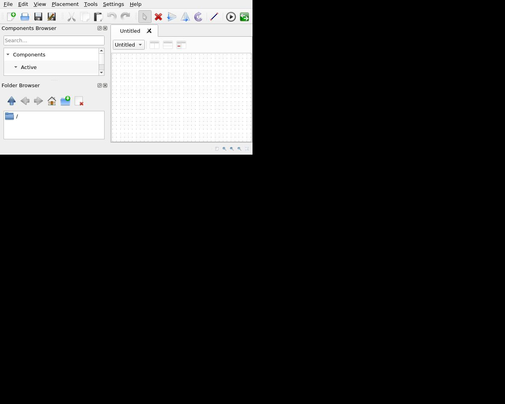 | N/A |
| [cantata](./cantata) | amd64  | ubuntu-noble | 2.5.0.ds1-2build3 |  | N/A |
| [cantor](./cantor) | amd64  | ubuntu-noble | 23.08.5-0ubuntu4.2 |  | N/A |
| [carburetor](./carburetor) | amd64  | ubuntu-noble | 4.5.1-1-20250327 | 失败 | N/A |
| [cardpeek](./cardpeek) | amd64  | ubuntu-noble | 0.8.4-1.3build1 | 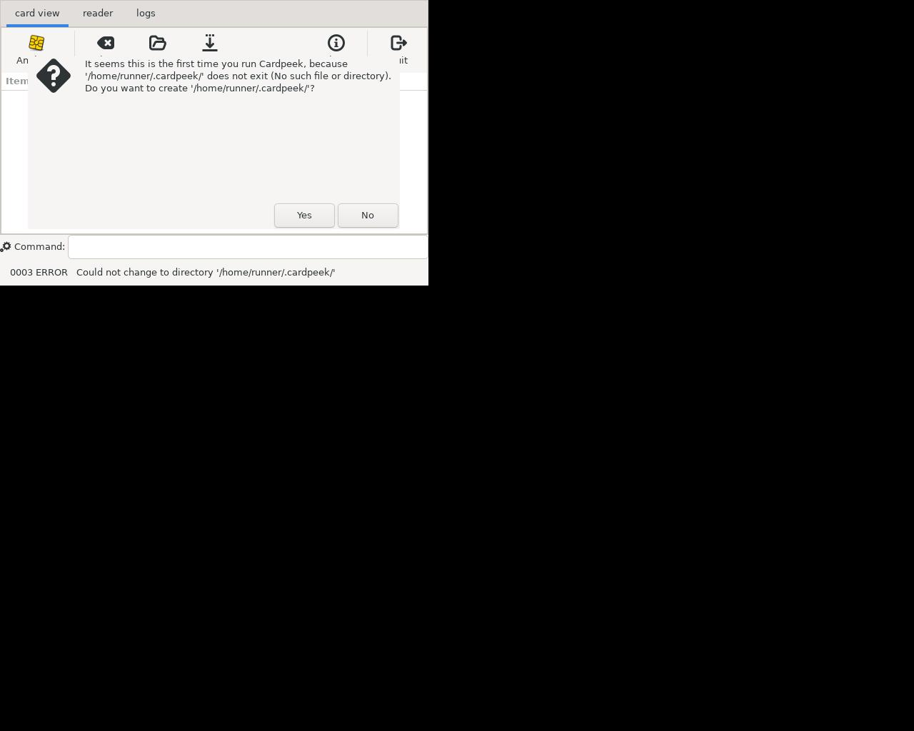 | N/A |
| [carla](./carla) | amd64  | ubuntu-noble | 2.5.8-0ubuntu5 |   | N/A |
| [carmetal](./carmetal) | amd64  | ubuntu-noble | 4.3-2-20250327 | 失败 | N/A |
| [cataclysm-dda-sdl](./cataclysm-dda-sdl) | amd64  | deepin-v23 | 0.G-4deepin1 | 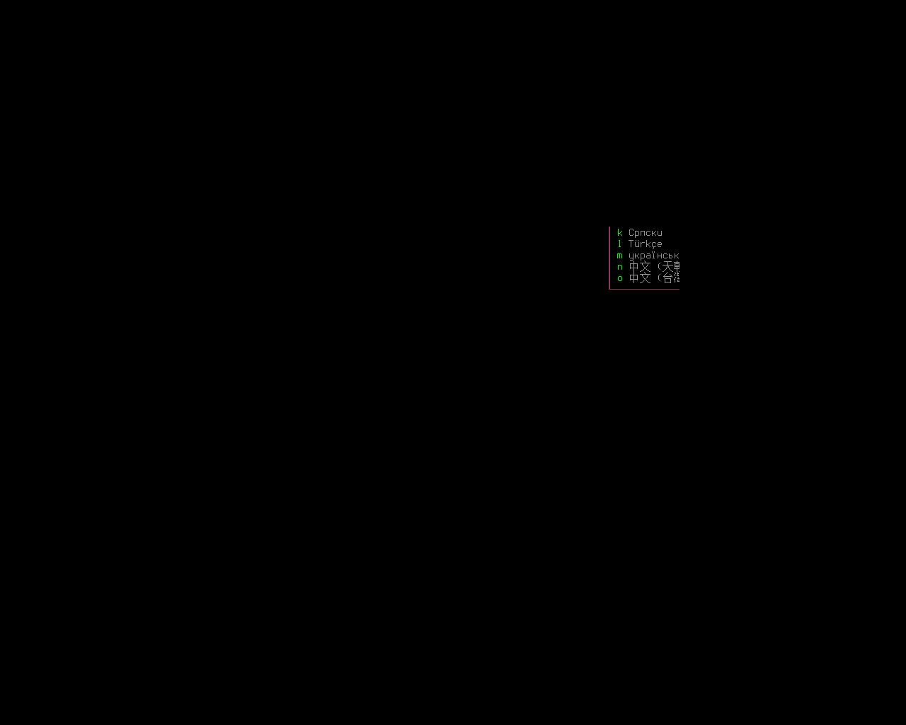 | [SHA256](./cataclysm-dda-sdl/SHA256SUMS) |
| [catfish](./catfish) | amd64  | ubuntu-noble | 4.16.4-2-20250327 | 失败 | N/A |
| [caveexpress](./caveexpress) | amd64  | ubuntu-noble | 2.5.2-2 |  | N/A |
| [cavepacker](./cavepacker) | amd64  | ubuntu-noble | 2.5.2-2 | 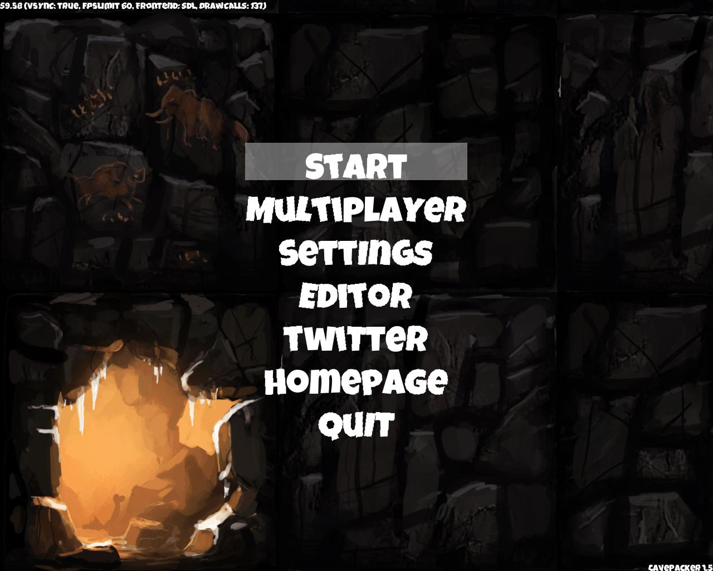 | N/A |
| [cb2bib](./cb2bib) | amd64  | ubuntu-noble | 2.0.1-2build2 |   | N/A |
| [cc.lotuscard.demo](./cc.lotuscard.demo) | amd64  | deepin-v23 | 1.0.0.0-20250327 | 失败 | N/A |
| [cdogs-sdl](./cdogs-sdl) | amd64  | ubuntu-noble | 2.0.0+dfsg-1 |  | N/A |
| [cecilia](./cecilia) | amd64  | ubuntu-noble | 5.4.1-2 |  | N/A |
| [ceferino](./ceferino) | amd64  | ubuntu-noble | 0.97.8+svn37-3 |  | N/A |
| [celluloid](./celluloid) | amd64  | ubuntu-noble | 0.26-1build2 |  | N/A |
| [cen64-qt](./cen64-qt) | amd64  | ubuntu-noble | 20200219-alpha-1build2 |  | N/A |
| [ceni](./ceni) | amd64  | ubuntu-noble | 2.33-4-20250327 | 失败 | N/A |
| [cenon.app](./cenon.app) | amd64  | ubuntu-noble | 4.0.6+ds1-2build5 |  | N/A |
| [cervisia](./cervisia) | amd64  | ubuntu-noble | 23.08.5-0ubuntu3 | 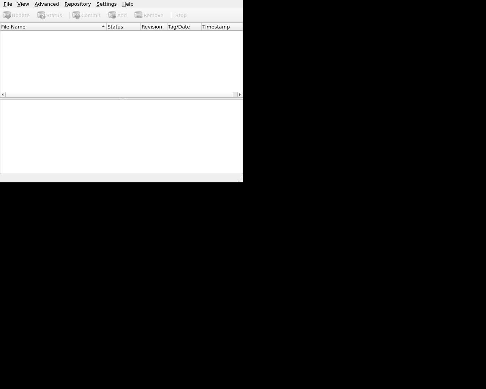 | N/A |
| [cf900](./cf900) | amd64  | deepin-v23 | 1.0 | 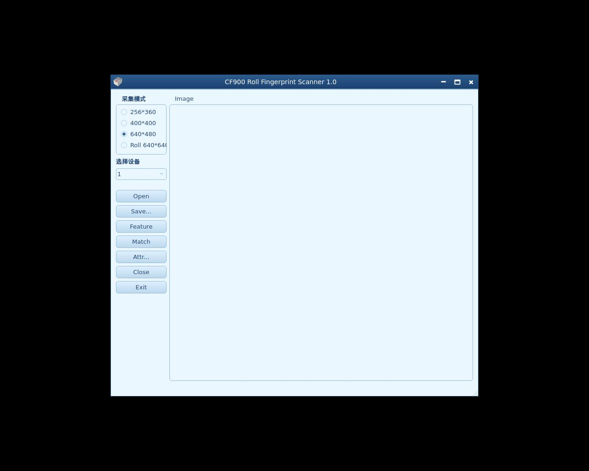  | [SHA256](./cf900/SHA256SUMS) |
| [cgoban](./cgoban) | amd64  | deepin-v23 | 1.9.14-19 | 失败 | [SHA256](./cgoban/SHA256SUMS) |
| [charmap.app](./charmap.app) | amd64  | ubuntu-noble | 0.3~rc1-4build3 |  | N/A |
| [charmtimetracker](./charmtimetracker) | amd64  | ubuntu-noble | 1.12.0-3build2 |  | N/A |
| [chatty](./chatty) | amd64  | ubuntu-noble | 0.8.2-1ubuntu2 |  | N/A |
| [cheese](./cheese) | amd64  | ubuntu-noble | 44.1-1build4 |  | N/A |
| [cheesecutter](./cheesecutter) | amd64  | ubuntu-noble | 2.9+git20211011-2-20250327 | 失败 | N/A |
| [chemtool](./chemtool) | amd64  | ubuntu-noble | 1.6.14-6build2 |  | N/A |
| [cherrytree](./cherrytree) | amd64  | ubuntu-noble | 1.1.2+dfsg-1 | 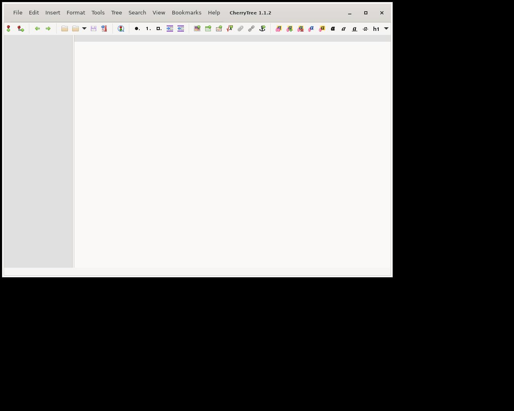 | N/A |
| [chessx](./chessx) | amd64  | ubuntu-noble | 1.4.6-2build3 |  | N/A |
| [chewing-editor](./chewing-editor) | amd64  | ubuntu-noble | 0.1.1-5build2 |  | N/A |
| [chiaki](./chiaki) | amd64  | ubuntu-noble | 2.2.0-1build3 | 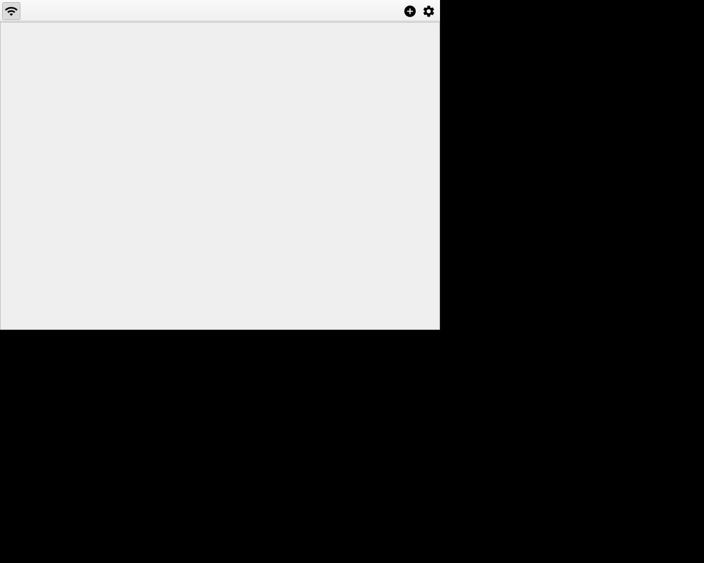 | N/A |
| [chirp](./chirp) | amd64  | ubuntu-noble | 20240224-1ubuntu0.1 |  | N/A |
| [chocolate-doom](./chocolate-doom) | amd64  | ubuntu-noble | 3.0.1+really3.0.0+git1548-1build2 |    | N/A |
| [choqok](./choqok) | amd64  | ubuntu-noble | 1.7.0-2build2 |  | N/A |
| [chroma](./chroma) | amd64  | ubuntu-noble | 1.19-1ubuntu1 |  | N/A |
| [chromium](./chromium) | amd64  | deepin-v23 | 128.0.6613.84-1deepin1-20250327 | 失败 | N/A |
| [chromium-browser](./chromium-browser) | amd64  | ubuntu-noble | 1snap1-0ubuntu2-20250327 | 失败 | N/A |
| [chromium-bsu](./chromium-bsu) | amd64  | ubuntu-noble | 0.9.16.1-3 |  | N/A |
| [chromono](./chromono) | amd64  | ubuntu-noble | 1.1.1-1.1 |  | N/A |
| [cinnamon](./cinnamon) | amd64  | ubuntu-noble | 6.0.4-4-20250327 | 失败 | N/A |
| [cinnamon-control-center](./cinnamon-control-center) | amd64  | ubuntu-noble | 6.0.1-3-20250327 | 失败 | N/A |
| [cinnamon-screensaver](./cinnamon-screensaver) | amd64  | ubuntu-noble | 6.0.3-1build2-20250327 | 失败 | N/A |
| [cinnamon-settings-daemon](./cinnamon-settings-daemon) | amd64  | ubuntu-noble | 6.0.0-1build4-20250327 | 失败 | N/A |
| [circuslinux](./circuslinux) | amd64  | ubuntu-noble | 1.0.3-35 | 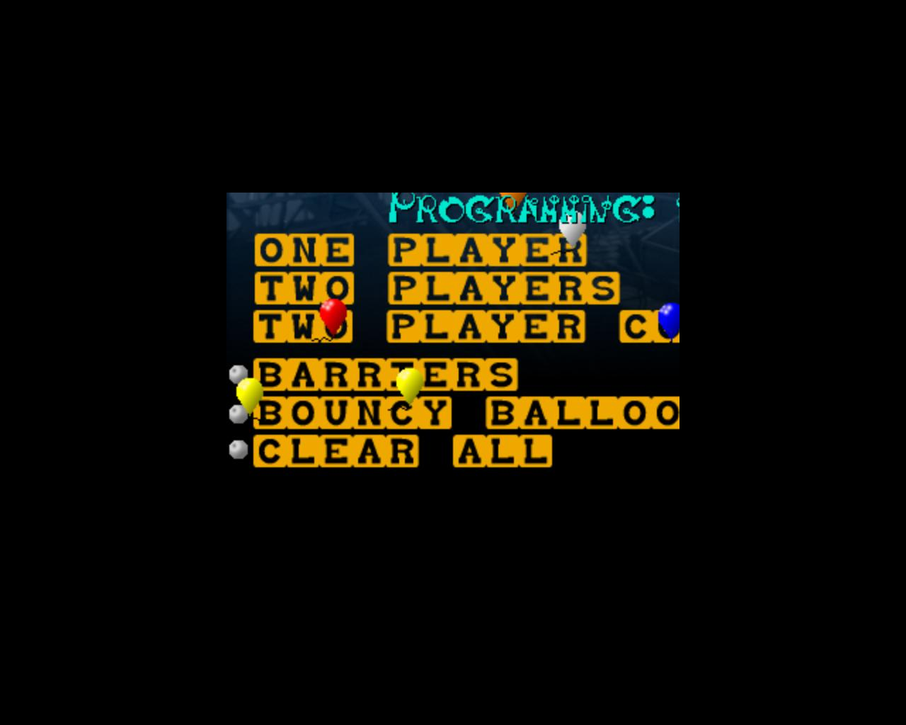 | N/A |
| [citizen-cx-02-printerdriver](./citizen-cx-02-printerdriver) | amd64  | deepin-v23 | 1.0.0-0 | 失败 | [SHA256](./citizen-cx-02-printerdriver/SHA256SUMS) |
| [citizen-cx-02s-printerdriver](./citizen-cx-02s-printerdriver) | amd64  | deepin-v23 | 1.0.0-0 | 失败 | [SHA256](./citizen-cx-02s-printerdriver/SHA256SUMS) |
| [citizen-cx-02w-printerdriver](./citizen-cx-02w-printerdriver) | amd64  | deepin-v23 | 1.0.0-0 | 失败 | [SHA256](./citizen-cx-02w-printerdriver/SHA256SUMS) |
| [citizen-cy-printerdriver](./citizen-cy-printerdriver) | amd64  | deepin-v23 | 1.0.0-0 | 失败 | [SHA256](./citizen-cy-printerdriver/SHA256SUMS) |
| [citizen-cz-01-printerdriver](./citizen-cz-01-printerdriver) | amd64  | deepin-v23 | 1.0.0-0 | 失败 | [SHA256](./citizen-cz-01-printerdriver/SHA256SUMS) |
| [ckb-next](./ckb-next) | amd64  | ubuntu-noble | 0.6.0+dfsg-0.2build2 |  | N/A |
| [clamtk](./clamtk) | amd64  | ubuntu-noble | 6.07-1.1-20250327 | 失败 | N/A |
| [clamz](./clamz) | amd64  | ubuntu-noble | 0.5-2.1build2-20250327 | 失败 | N/A |
| [clapper](./clapper) | amd64  | ubuntu-noble | 0.5.2-8build2-20250327 | 失败 | N/A |
| [classicmenu-indicator](./classicmenu-indicator) | amd64  | ubuntu-noble | 0.11-0ubuntu1-20250327 | 失败 | N/A |
| [classified-ads](./classified-ads) | amd64  | ubuntu-noble | 0.15-1build3 |  | N/A |
| [claws-mail](./claws-mail) | amd64  | ubuntu-noble | 4.2.0-2build7-20250327 | 失败 | N/A |
| [clawsker](./clawsker) | amd64  | ubuntu-noble | 1.3.8-1-20250327 | 失败 | N/A |
| [clementine](./clementine) | amd64  | ubuntu-noble | 1.4.0~rc1+git867-g9ef681b0e+dfsg-1ubuntu4 |  | N/A |
| [clipit](./clipit) | amd64  | ubuntu-noble | 1.4.5+git20210313-2 |  | N/A |
| [clips](./clips) | amd64  | ubuntu-noble | 6.30-4.1build1 |  | N/A |
| [cloudcompare](./cloudcompare) | amd64  | ubuntu-noble | 2.11.3-7.1build3 | 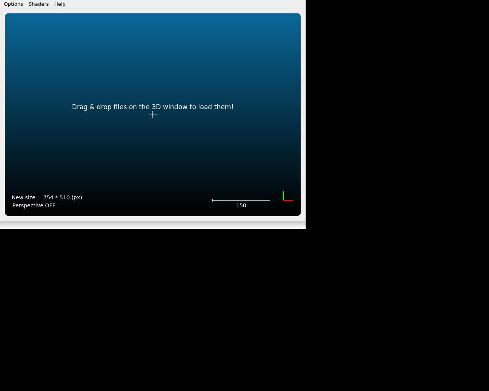  | N/A |
| [clustalx](./clustalx) | amd64  | ubuntu-noble | 2.1+lgpl-9build2 |  | N/A |
| [clusterssh](./clusterssh) | amd64  | ubuntu-noble | 4.16-4 |  | N/A |
| [cmake-qt-gui](./cmake-qt-gui) | amd64  | deepin-v23 | 3.30.5-1 |  | [SHA256](./cmake-qt-gui/SHA256SUMS) |
| [cmatrix](./cmatrix) | amd64  | ubuntu-noble | 2.0-6-20250327 | 失败 | N/A |
| [cmst](./cmst) | amd64  | ubuntu-noble | 2023.03.14-1build2 |  | N/A |
| [cn.com.hisign.hidscanner](./cn.com.hisign.hidscanner) | amd64  | deepin-v23 | 1.0.0-1-20250327 | 失败 | N/A |
| [cn.com.hisign.hsivlive](./cn.com.hisign.hsivlive) | amd64  | deepin-v23 | 3.10.8-20250327 | 失败 | N/A |
| [cn.com.hsic.demo](./cn.com.hsic.demo) | amd64  | deepin-v23 | 1.0.0-1-20250327 | 失败 | N/A |
| [cn.com.secuprint.smlmfp](./cn.com.secuprint.smlmfp) | amd64  | deepin-v23 | 1.0.3.0-20250327 | 失败 | N/A |
| [cn.com.signpro.hwtabletserv](./cn.com.signpro.hwtabletserv) | amd64  | deepin-v23 | 2.7+b69-20250327 | 失败 | N/A |
| [cn.com.signpro.sphttpserv](./cn.com.signpro.sphttpserv) | amd64  | deepin-v23 | 3.2+b83-20250327 | 失败 | N/A |
| [cn.com.tongzhi.crypt.http](./cn.com.tongzhi.crypt.http) | amd64  | deepin-v23 | 1.0.3.4406-1 | 失败 | [SHA256](./cn.com.tongzhi.crypt.http/SHA256SUMS) |
| [cn.dascom.dc8600-driver](./cn.dascom.dc8600-driver) | amd64  | deepin-v23 | 1.0.0-20250327 | 失败 | N/A |
| [cn.hengbao.hbd7600-driver](./cn.hengbao.hbd7600-driver) | amd64  | deepin-v23 | 1.0.8-20250327 | 失败 | N/A |
| [cn.huahom.pam.unlock](./cn.huahom.pam.unlock) | amd64  | deepin-v23 | 0.1.0 | 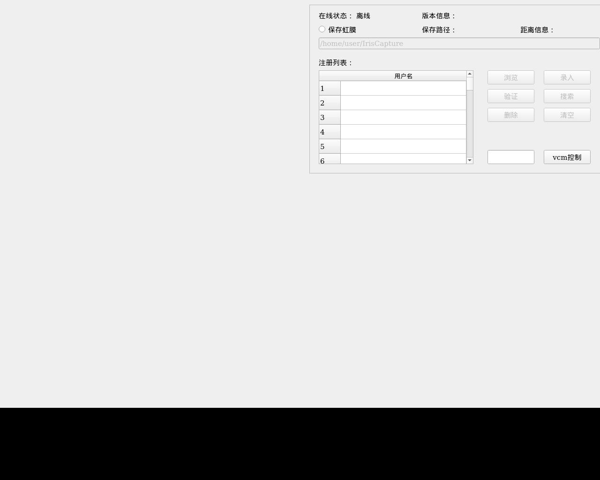 | [SHA256](./cn.huahom.pam.unlock/SHA256SUMS) |
| [cn.hzchancel.fifthfootprint](./cn.hzchancel.fifthfootprint) | amd64  | deepin-v23 | 0.0.1-20250327 | 失败 | N/A |
| [cn.hzchancel.fouthfootprint](./cn.hzchancel.fouthfootprint) | amd64  | deepin-v23 | 0.0.1-20250327 | 失败 | N/A |
| [cn.microdone.passguardservice](./cn.microdone.passguardservice) | amd64  | deepin-v23 | 1.0.0.0-20250327 | 失败 | N/A |
| [cn.microdone.passguardservice.bj](./cn.microdone.passguardservice.bj) | amd64  | deepin-v23 | 1.0.0.0-20250327 | 失败 | N/A |
| [cn.microdone.passguardservice.nb](./cn.microdone.passguardservice.nb) | amd64  | deepin-v23 | 1.0.0.7 |  | N/A |
| [cn.microdone.signmessenger.hz](./cn.microdone.signmessenger.hz) | amd64  | deepin-v23 | 1.0.0.0-20250327 | 失败 | N/A |
| [cn.microdone.signmessenger.nb](./cn.microdone.signmessenger.nb) | amd64  | deepin-v23 | 1.0.0.2 |  | N/A |
| [cn.naturalcard.eserver](./cn.naturalcard.eserver) | amd64  | deepin-v23 | 1.0.0.1-20250327 | 失败 | N/A |
| [cn.net.zonewin.smartscanner](./cn.net.zonewin.smartscanner) | amd64  | deepin-v23 | 1.0.11 |  | N/A |
| [cn.tianyi.eserver](./cn.tianyi.eserver) | amd64  | deepin-v23 | 1.0.0.1-20250327 | 失败 | N/A |
| [cndrvcups-utility](./cndrvcups-utility) | amd64  | deepin-v23 | 1.10-1deepin0 | 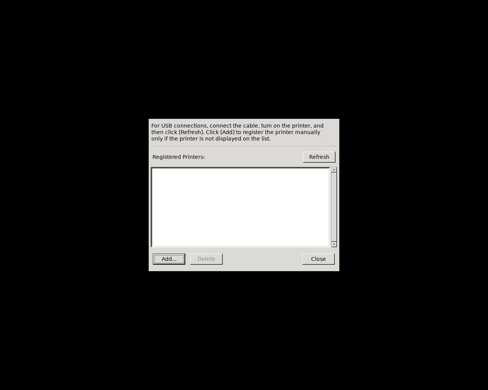 | [SHA256](./cndrvcups-utility/SHA256SUMS) |
| [cnrdrvcups-ufr2-uk](./cnrdrvcups-ufr2-uk) | amd64  | deepin-v23 | 5.10-1+rb1 |  | [SHA256](./cnrdrvcups-ufr2-uk/SHA256SUMS) |
| [cnrdrvcups-ufr2lt-uk](./cnrdrvcups-ufr2lt-uk) | amd64  | deepin-v23 | 5.00-1deepin0 |  | [SHA256](./cnrdrvcups-ufr2lt-uk/SHA256SUMS) |
| [coccinella](./coccinella) | amd64  | ubuntu-noble | 0.96.20-9 |  | N/A |
| [codeblocks-common](./codeblocks-common) | amd64  | ubuntu-noble | 20.03+svn13046-0.3build2-20250327 | 失败 | N/A |
| [codelite](./codelite) | amd64  | ubuntu-noble | 17.0.0+dfsg-2build2 | 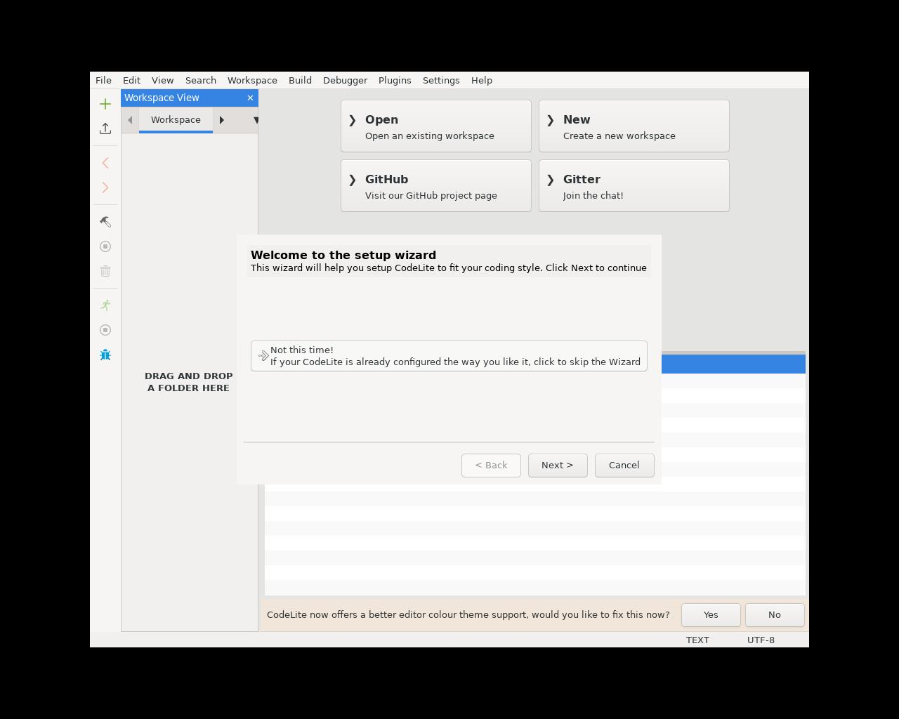 | N/A |
| [codfis](./codfis) | amd64  | ubuntu-noble | 0.4.7-2build4 |  | N/A |
| [colmap](./colmap) | amd64  | ubuntu-noble | 3.9.1-2build2 |  | N/A |
| [colobot](./colobot) | amd64  | ubuntu-noble | 0.2.1-1build3 | 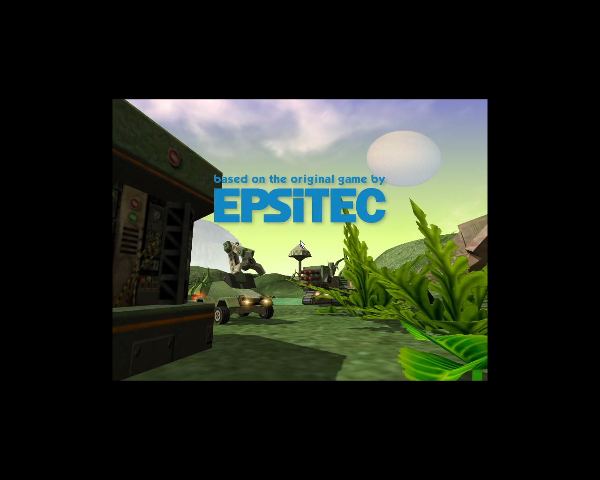 | N/A |
| [color-picker](./color-picker) | amd64  | ubuntu-noble | 1.0.3-2ubuntu3 |  | N/A |
| [colorcode](./colorcode) | amd64  | ubuntu-noble | 0.8.7-1build2 | 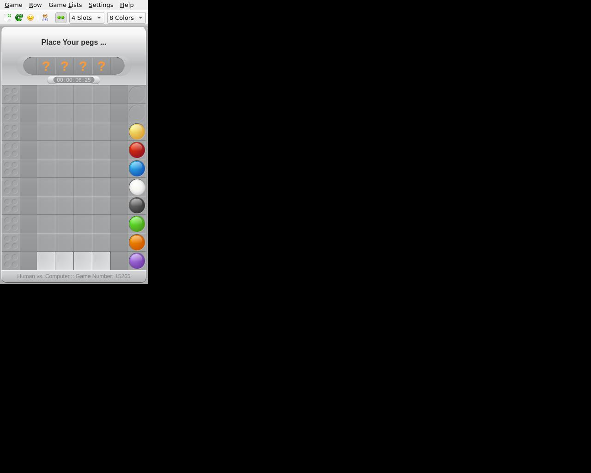 | N/A |
| [colord-kde](./colord-kde) | amd64  | ubuntu-noble | 23.08.5-0ubuntu4-20250327 | 失败 | N/A |
| [colorhug-client](./colorhug-client) | amd64  | ubuntu-noble | 0.2.8-3build4 | 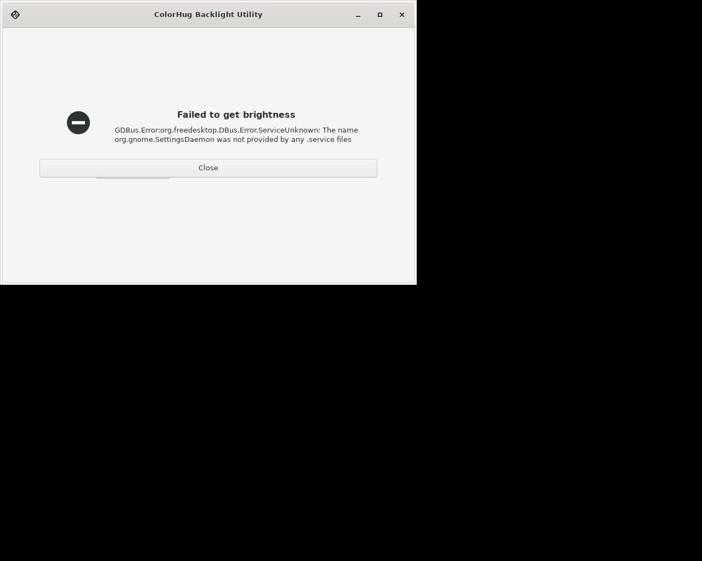  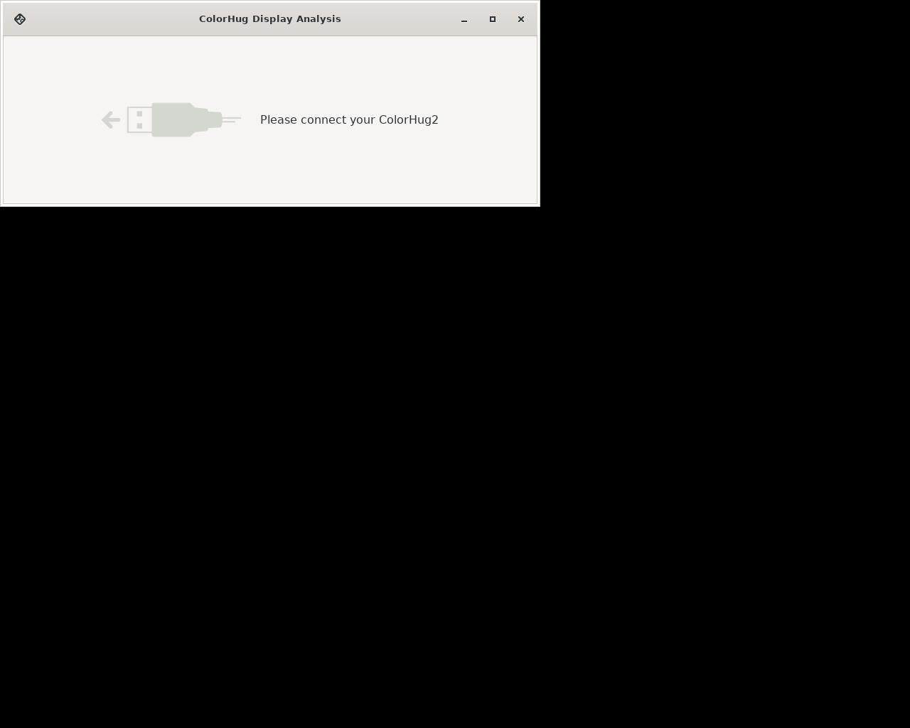 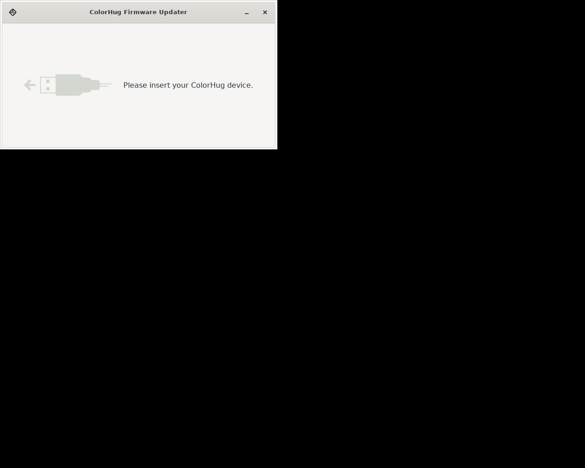 | N/A |
| [colossal-cave-adventure](./colossal-cave-adventure) | amd64  | ubuntu-noble | 1.6-1 |  | N/A |
| [com-huashuoaf-finger](./com-huashuoaf-finger) | amd64  | deepin-v23 | 1.0.0.3 |  | [SHA256](./com-huashuoaf-finger/SHA256SUMS) |
| [com.arc-uds.smartscan](./com.arc-uds.smartscan) | amd64  | deepin-v23 | 3.1.0.1 |  | [SHA256](./com.arc-uds.smartscan/SHA256SUMS) |
| [com.avision.a4pq-series](./com.avision.a4pq-series) | amd64  | deepin-v23 | 1.0.0-23293 |   | [SHA256](./com.avision.a4pq-series/SHA256SUMS) |
| [com.avision.avision-sane](./com.avision.avision-sane) | amd64  | deepin-v23 | 20231120-8.6.10.020-20250327 | 失败 | N/A |
| [com.bhyf.bhpainter](./com.bhyf.bhpainter) | amd64  | deepin-v23 | 2020.12.01-1 |   | [SHA256](./com.bhyf.bhpainter/SHA256SUMS) |
| [com.binup.fingerprint](./com.binup.fingerprint) | amd64  | deepin-v23 | 1.0.0.1-20250327 | 失败 | N/A |
| [com.bjnja.njaep3kgmutil](./com.bjnja.njaep3kgmutil) | amd64  | deepin-v23 | 1.0.2-20250327 | 失败 | N/A |
| [com.btit.linuxaction](./com.btit.linuxaction) | amd64  | deepin-v23 | 3.1.10.24194-uosv20-20250327 | 失败 | N/A |
| [com.canon.ufr2](./com.canon.ufr2) | amd64  | deepin-v23 | 6.00-1.00 | 失败 | [SHA256](./com.canon.ufr2/SHA256SUMS) |
| [com.centerm.gwq](./com.centerm.gwq) | amd64  | deepin-v23 | 2021.1.29-1 |  | [SHA256](./com.centerm.gwq/SHA256SUMS) |
| [com.centerm.gwq.common](./com.centerm.gwq.common) | amd64  | deepin-v23 | 1.0.0.0-1-20250327 | 失败 | N/A |
| [com.colortrac](./com.colortrac) | amd64  | deepin-v23 | 1.0.7-20250327 | 失败 | N/A |
| [com.comet.comet-sane](./com.comet.comet-sane) | amd64  | deepin-v23 | 20240814-11.7.11.063-20250327 | 失败 | N/A |
| [com.contexscan](./com.contexscan) | amd64  | deepin-v23 | 1.0.7-20250327 | 失败 | N/A |
| [com.deepin.gomoku](./com.deepin.gomoku) | amd64  | deepin-v23 | 1.0.11 |  | [SHA256](./com.deepin.gomoku/SHA256SUMS) |
| [com.deepin.lianliankan](./com.deepin.lianliankan) | amd64  | deepin-v23 | 1.0.12 |  | [SHA256](./com.deepin.lianliankan/SHA256SUMS) |
| [com.deepin.microbox-scanner](./com.deepin.microbox-scanner) | amd64  | deepin-v23 | 1.2.1-20250327 | 失败 | N/A |
| [com.deli.camera](./com.deli.camera) | amd64  | deepin-v23 | 2.1.7.9-20250327 | 失败 | N/A |
| [com.deli.printer-c111](./com.deli.printer-c111) | amd64  | deepin-v23 | 1.0.038-20250327 | 失败 | N/A |
| [com.deli.printer-d11](./com.deli.printer-d11) | amd64  | deepin-v23 | 1.10-1 | 失败 | [SHA256](./com.deli.printer-d11/SHA256SUMS) |
| [com.deli.printer-d21](./com.deli.printer-d21) | amd64  | deepin-v23 | 1.10-1 | 失败 | [SHA256](./com.deli.printer-d21/SHA256SUMS) |
| [com.delichina.deliscan](./com.delichina.deliscan) | amd64  | deepin-v23 | 4.51.24520.23319 | 失败 | [SHA256](./com.delichina.deliscan/SHA256SUMS) |
| [com.elineprint.e-gm3001-an-3in1](./com.elineprint.e-gm3001-an-3in1) | amd64  | deepin-v23 | 1.0.0-20206 | 失败 | [SHA256](./com.elineprint.e-gm3001-an-3in1/SHA256SUMS) |
| [com.everfine.finger](./com.everfine.finger) | amd64  | deepin-v23 | 2021.11.5-1 |    | N/A |
| [com.everspry.escaps](./com.everspry.escaps) | amd64  | deepin-v23 | 24.7.8.8 |  | [SHA256](./com.everspry.escaps/SHA256SUMS) |
| [com.farshine.ygdevservice](./com.farshine.ygdevservice) | amd64  | deepin-v23 | 2.5.2-20250327 | 失败 | N/A |
| [com.fenglinkeji.scanner](./com.fenglinkeji.scanner) | amd64  | deepin-v23 | 0.0.1-1-20250327 | 失败 | N/A |
| [com.founder.linuxaction](./com.founder.linuxaction) | amd64  | deepin-v23 | 2.1.96.24365-uosv20 |  | N/A |
| [com.founderinternational.founder-sane](./com.founderinternational.founder-sane) | amd64  | deepin-v23 | 20240820-1.6.10.015-20250327 | 失败 | N/A |
| [com.ftsafe.epass3000gm-spabank](./com.ftsafe.epass3000gm-spabank) | amd64  | deepin-v23 | 1.2.4-1+b1-20250327 | 失败 | N/A |
| [com.ftsafe.epass3000gmg-hnxa](./com.ftsafe.epass3000gmg-hnxa) | amd64  | deepin-v23 | 1.0.1-1+b1 | 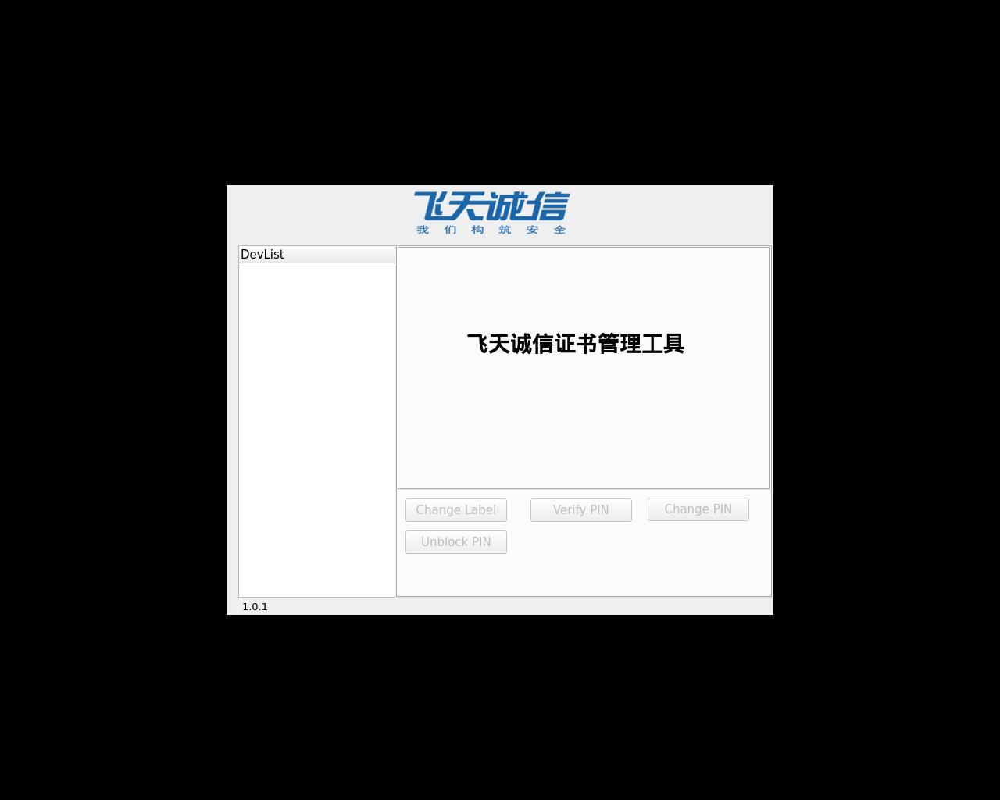 | N/A |
| [com.ftsafe.interpass3000-cib](./com.ftsafe.interpass3000-cib) | amd64  | deepin-v23 | 1.0.16.d1-1+b1-uos-20250327 | 失败 | N/A |
| [com.ftsafe.interpass3000-cmbc](./com.ftsafe.interpass3000-cmbc) | amd64  | deepin-v23 | 1.3.13.d0-1+b1 |  | N/A |
| [com.ftsafe.interpass3000-lfbk](./com.ftsafe.interpass3000-lfbk) | amd64  | deepin-v23 | 1.0.7-1+b1 | 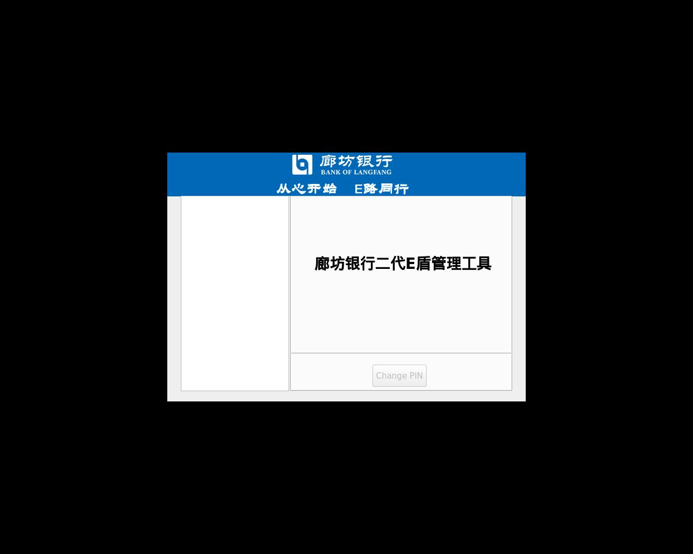 | N/A |
| [com.ftsafe.interpass3000-nbbank](./com.ftsafe.interpass3000-nbbank) | amd64  | deepin-v23 | 1.0.9-20250327 | 失败 | N/A |
| [com.ftsafe.interpass3000-rzbank](./com.ftsafe.interpass3000-rzbank) | amd64  | deepin-v23 | 1.0.1-1+b1-20250327 | 失败 | N/A |
| [com.ftsafe.interpass3000-scb](./com.ftsafe.interpass3000-scb) | amd64  | deepin-v23 | 1.0.5-1+b1-20250327 | 失败 | N/A |
| [com.ftsafe.interpass3000-wfbank](./com.ftsafe.interpass3000-wfbank) | amd64  | deepin-v23 | 1.0.0.d1-1+b1-20250327 | 失败 | N/A |
| [com.ftsafe.interpass3000zjrc](./com.ftsafe.interpass3000zjrc) | amd64  | deepin-v23 | 1.2.21-1+b1 |  | N/A |
| [com.ftsafe.interpasscitic](./com.ftsafe.interpasscitic) | amd64  | deepin-v23 | 1.2.8-1+b1 | 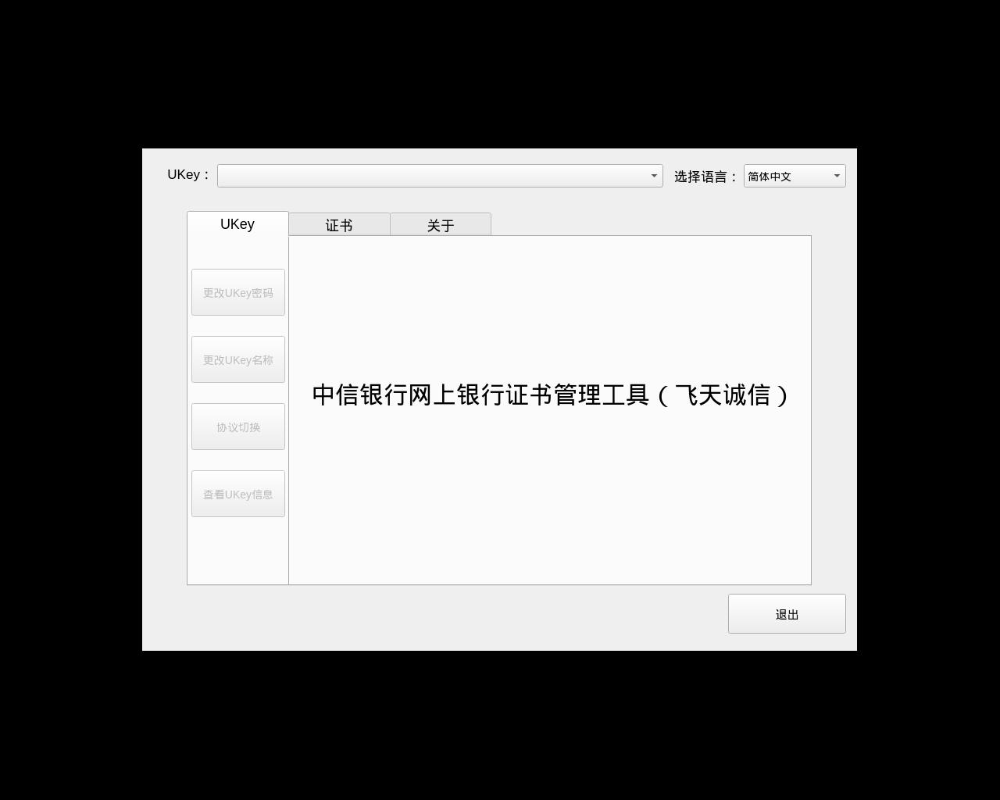 | N/A |
| [com.fujitsu.fsane](./com.fujitsu.fsane) | amd64  | deepin-v23 | 2.0.1-2-20250327 | 失败 | N/A |
| [com.fytech.cfs300b](./com.fytech.cfs300b) | amd64  | deepin-v23 | 1.0.0 |  | [SHA256](./com.fytech.cfs300b/SHA256SUMS) |
| [com.fytech.pfs408](./com.fytech.pfs408) | amd64  | deepin-v23 | 2021.5.8 |  | [SHA256](./com.fytech.pfs408/SHA256SUMS) |
| [com.fytech.ps1300](./com.fytech.ps1300) | amd64  | deepin-v23 | 1.0.0 |  | [SHA256](./com.fytech.ps1300/SHA256SUMS) |
| [com.ggimage.ggimage-printer](./com.ggimage.ggimage-printer) | amd64  | deepin-v23 | 1.0.3-1+uos | 失败 | [SHA256](./com.ggimage.ggimage-printer/SHA256SUMS) |
| [com.gmrz.fido](./com.gmrz.fido) | amd64  | deepin-v23 | 1.0.3.2-20250327 | 失败 | N/A |
| [com.goke.gksecurity](./com.goke.gksecurity) | amd64  | deepin-v23 | 2.0.3-20250327 | 失败 | N/A |
| [com.greatwalltech.greatwall-sane](./com.greatwalltech.greatwall-sane) | amd64  | deepin-v23 | 20240918-7.6.10.051-20250327 | 失败 | N/A |
| [com.gwi.dpm760a-tool](./com.gwi.dpm760a-tool) | amd64  | deepin-v23 | 1.0.0 |  | [SHA256](./com.gwi.dpm760a-tool/SHA256SUMS) |
| [com.haitaichina.htukeytool20079](./com.haitaichina.htukeytool20079) | amd64  | deepin-v23 | 1.0.0.2404081-20250327 | 失败 | N/A |
| [com.hanguang.hgfchanguangprinter](./com.hanguang.hgfchanguangprinter) | amd64  | deepin-v23 | 1-1 | 失败 | [SHA256](./com.hanguang.hgfchanguangprinter/SHA256SUMS) |
| [com.hanguang.hgfcscanner](./com.hanguang.hgfcscanner) | amd64  | deepin-v23 | 1-1 | 失败 | [SHA256](./com.hanguang.hgfcscanner/SHA256SUMS) |
| [com.hanlongbj.omniscan](./com.hanlongbj.omniscan) | amd64  | deepin-v23 | 1 | 失败 | [SHA256](./com.hanlongbj.omniscan/SHA256SUMS) |
| [com.hanwang.linuxaction-sdk](./com.hanwang.linuxaction-sdk) | amd64  | deepin-v23 | 2.1.53.22043-uosv20 |  | N/A |
| [com.hsreader.demo](./com.hsreader.demo) | amd64  | deepin-v23 | 1.1.0-20250327 | 失败 | N/A |
| [com.huagaochina.huagoscan](./com.huagaochina.huagoscan) | amd64  | deepin-v23 | 2.2.3-1+rc4 | 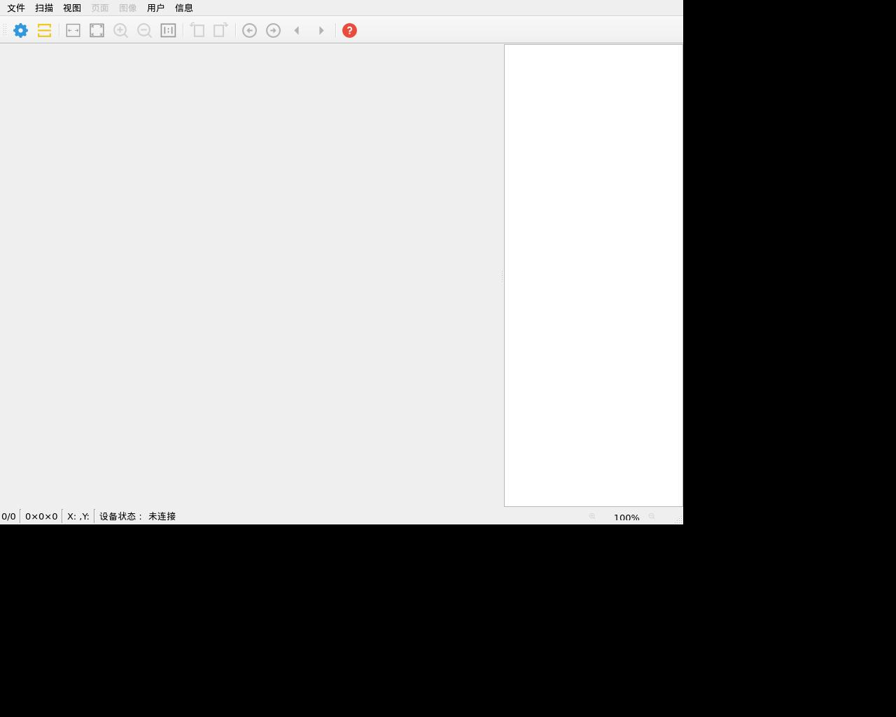 | N/A |
| [com.huawei.cv81-series](./com.huawei.cv81-series) | amd64  | deepin-v23 | 2.0-88 |  | [SHA256](./com.huawei.cv81-series/SHA256SUMS) |
| [com.hw.signdriver](./com.hw.signdriver) | amd64  | deepin-v23 | 1.0.0-20250327 | 失败 | N/A |
| [com.hw99.hanvon-sane](./com.hw99.hanvon-sane) | amd64  | deepin-v23 | 20230206-9.6.10.053-20250327 | 失败 | N/A |
| [com.jetbrains.irisking](./com.jetbrains.irisking) | amd64  | deepin-v23 | 2021.01.20-1-20250327 | 失败 | N/A |
| [com.joyusing.gwq](./com.joyusing.gwq) | amd64  | deepin-v23 | 1.0.0-20250327 | 失败 | N/A |
| [com.joyusing.visualizer](./com.joyusing.visualizer) | amd64  | deepin-v23 | 1.0.0-20250327 | 失败 | N/A |
| [com.joyusing.w05](./com.joyusing.w05) | amd64  | deepin-v23 | 1.0.0-20250327 | 失败 | N/A |
| [com.joyusing.writingpad](./com.joyusing.writingpad) | amd64  | deepin-v23 | 1.0.0-20250327 | 失败 | N/A |
| [com.kinghun.kinghuncamera](./com.kinghun.kinghuncamera) | amd64  | deepin-v23 | 1.0.0-20250327 | 失败 | N/A |
| [com.lanxum-ga-series](./com.lanxum-ga-series) | amd64  | deepin-v23 | 1.0.1 | 失败 | [SHA256](./com.lanxum-ga-series/SHA256SUMS) |
| [com.lanxum.ga2630dn-psm-2in1](./com.lanxum.ga2630dn-psm-2in1) | amd64  | deepin-v23 | 1.0.0-20301 | 失败 | [SHA256](./com.lanxum.ga2630dn-psm-2in1/SHA256SUMS) |
| [com.lanxum.ga30-psm-2in1](./com.lanxum.ga30-psm-2in1) | amd64  | deepin-v23 | 1.0.0-21032 | 失败 | [SHA256](./com.lanxum.ga30-psm-2in1/SHA256SUMS) |
| [com.lanxum.ga7030dn-psm-2in1](./com.lanxum.ga7030dn-psm-2in1) | amd64  | deepin-v23 | 1.0.0-21034 | 失败 | [SHA256](./com.lanxum.ga7030dn-psm-2in1/SHA256SUMS) |
| [com.lanxum.gasd06.printerdriver](./com.lanxum.gasd06.printerdriver) | amd64  | deepin-v23 | 1.0.0-5+0-20250327 | 失败 | N/A |
| [com.lanxum.gd34xxdn](./com.lanxum.gd34xxdn) | amd64  | deepin-v23 | 3.3.0 |  | [SHA256](./com.lanxum.gd34xxdn/SHA256SUMS) |
| [com.lanxum.linuxaction](./com.lanxum.linuxaction) | amd64  | deepin-v23 | 2.1.91.24084-uosv20 |  | N/A |
| [com.lanxum.printdevicemanager](./com.lanxum.printdevicemanager) | amd64  | deepin-v23 | 2.0.0-2+0-20250327 | 失败 | N/A |
| [com.lanxum.rongtuscan](./com.lanxum.rongtuscan) | amd64  | deepin-v23 | 2.0.9 |  | N/A |
| [com.lanxum.sp1800-1-driver](./com.lanxum.sp1800-1-driver) | amd64  | deepin-v23 | 1.1.0-20250327 | 失败 | N/A |
| [com.lanxum.sp1800-1-tool](./com.lanxum.sp1800-1-tool) | amd64  | deepin-v23 | 1.1.0-20250327 | 失败 | N/A |
| [com.lenovo.lenovo-gpy](./com.lenovo.lenovo-gpy) | amd64  | deepin-v23 | 2.1.7.3-20250327 | 失败 | N/A |
| [com.microtek.scaner](./com.microtek.scaner) | amd64  | deepin-v23 | 1.0.0-9c-20250327 | 失败 | N/A |
| [com.mindeo.scannertext](./com.mindeo.scannertext) | amd64  | deepin-v23 | 1.2.2.4 |  | [SHA256](./com.mindeo.scannertext/SHA256SUMS) |
| [com.mt.cnlinux](./com.mt.cnlinux) | amd64  | deepin-v23 | 1.0.0.3 |  | [SHA256](./com.mt.cnlinux/SHA256SUMS) |
| [com.mt.cnsscard](./com.mt.cnsscard) | amd64  | deepin-v23 | 1.0.0.4 |  | [SHA256](./com.mt.cnsscard/SHA256SUMS) |
| [com.nantian.bpport](./com.nantian.bpport) | amd64  | deepin-v23 | 1.0.0.20210910 |  | N/A |
| [com.nantian.clientscreen](./com.nantian.clientscreen) | amd64  | deepin-v23 | 1.0.2.02261802-20250327 | 失败 | N/A |
| [com.nantian.mmjp](./com.nantian.mmjp) | amd64  | deepin-v23 | 1.0.0.20210312-20250327 | 失败 | N/A |
| [com.nbdeli.deli-sane](./com.nbdeli.deli-sane) | amd64  | deepin-v23 | 20240820-5.7.10.027-20250327 | 失败 | N/A |
| [com.ncmem.down2](./com.ncmem.down2) | amd64  | deepin-v23 | 2020.12.3-1 |  | [SHA256](./com.ncmem.down2/SHA256SUMS) |
| [com.ncmem.up6](./com.ncmem.up6) | amd64  | deepin-v23 | 2020.12.3-1 | 失败 | [SHA256](./com.ncmem.up6/SHA256SUMS) |
| [com.ncmem.wordpaster](./com.ncmem.wordpaster) | amd64  | deepin-v23 | 2020.12.3-1 | 失败 | [SHA256](./com.ncmem.wordpaster/SHA256SUMS) |
| [com.neutralchina.neuscan](./com.neutralchina.neuscan) | amd64  | deepin-v23 | 4.52.26520.24289 | 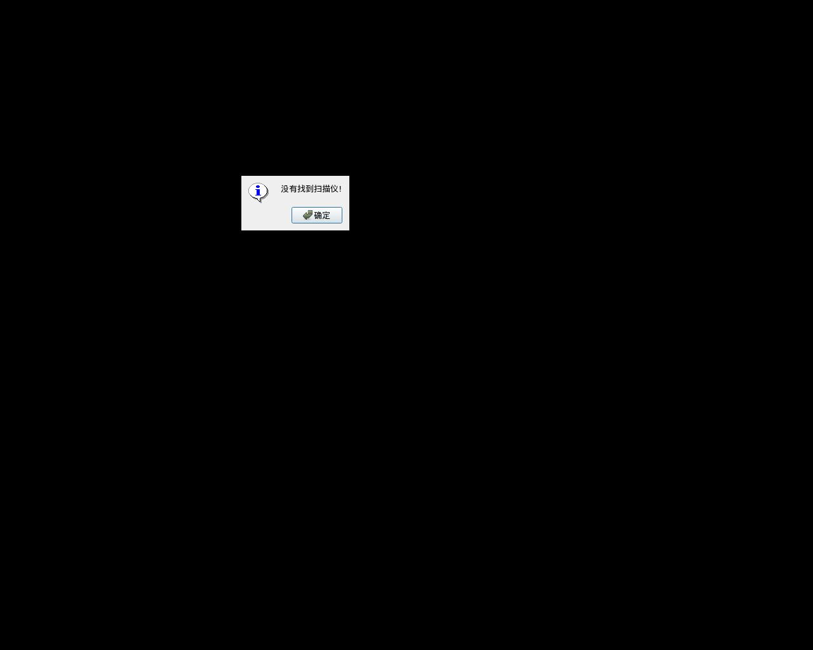 | N/A |
| [com.pantum.pantum](./com.pantum.pantum) | amd64  | deepin-v23 | 7.4.182-1+uos-20250327 | 失败 | N/A |
| [com.pantum.pantum-235-325-2165](./com.pantum.pantum-235-325-2165) | amd64  | deepin-v23 | 1.0.0ab02-1+uos |   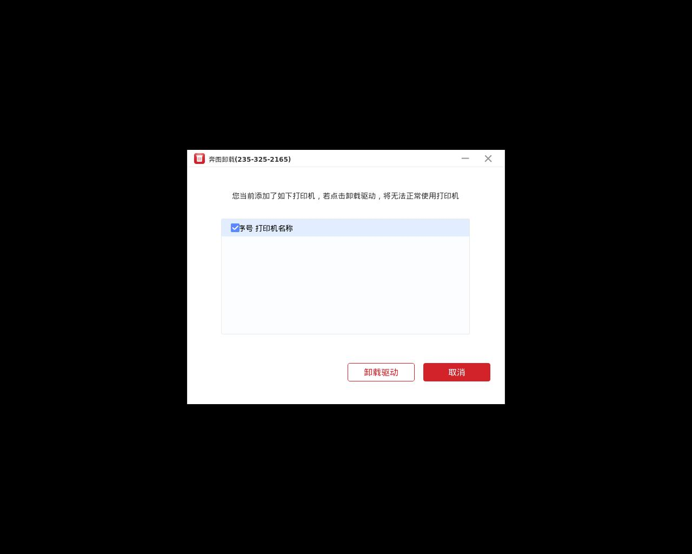 | [SHA256](./com.pantum.pantum-235-325-2165/SHA256SUMS) |
| [com.pantum.pantum-scan-assistant](./com.pantum.pantum-scan-assistant) | amd64  | deepin-v23 | 3.0.1-20250327 | 失败 | N/A |
| [com.pantum.pantumprint](./com.pantum.pantumprint) | amd64  | deepin-v23 | 1.1.24-1+uos |  | [SHA256](./com.pantum.pantumprint/SHA256SUMS) |
| [com.plustek.linuxaction](./com.plustek.linuxaction) | amd64  | deepin-v23 | 3.0.3.22342-uosv20-20250327 | 失败 | N/A |
| [com.racertech.usbdisp](./com.racertech.usbdisp) | amd64  | deepin-v23 | 1.0.0-1-20250327 | 失败 | N/A |
| [com.ricoh.pfu.fsane](./com.ricoh.pfu.fsane) | amd64  | deepin-v23 | 4.0.1-1-20250327 | 失败 | N/A |
| [com.rightcolor](./com.rightcolor) | amd64  | deepin-v23 | 1.0.7-20250327 | 失败 | N/A |
| [com.scanner.hanguang](./com.scanner.hanguang) | amd64  | deepin-v23 | 1.0-1-20250327 | 失败 | N/A |
| [com.semxum.aisystem](./com.semxum.aisystem) | amd64  | deepin-v23 | 1.0.0-2+b1 |  | [SHA256](./com.semxum.aisystem/SHA256SUMS) |
| [com.shensi.websocket](./com.shensi.websocket) | amd64  | deepin-v23 | 1.58 |  | N/A |
| [com.sogou.ime.ng.fcitx5.deepin](./com.sogou.ime.ng.fcitx5.deepin) | amd64  | deepin-v23 | 10.0.9.0.8-981 | 失败 | [SHA256](./com.sogou.ime.ng.fcitx5.deepin/SHA256SUMS) |
| [com.sunrise.demo](./com.sunrise.demo) | amd64  | deepin-v23 | 2.2.2-20250327 | 失败 | N/A |
| [com.sunrise.device](./com.sunrise.device) | amd64  | deepin-v23 | 2020.09.15-1-20250327 | 失败 | N/A |
| [com.sxylzinfo.sxsscardsv](./com.sxylzinfo.sxsscardsv) | amd64  | deepin-v23 | 3.5.15 |  | N/A |
| [com.szshenshu.aidemo](./com.szshenshu.aidemo) | amd64  | deepin-v23 | 2022.01.11-1 |  | [SHA256](./com.szshenshu.aidemo/SHA256SUMS) |
| [com.tdr.uosicbc](./com.tdr.uosicbc) | amd64  | deepin-v23 | 9.0.6-5-20250327 | 失败 | N/A |
| [com.tg.aqdl](./com.tg.aqdl) | amd64  | deepin-v23 | 4.1.0.1-20250327 | 失败 | N/A |
| [com.toec.oem3000dn](./com.toec.oem3000dn) | amd64  | deepin-v23 | 2.6-4 | 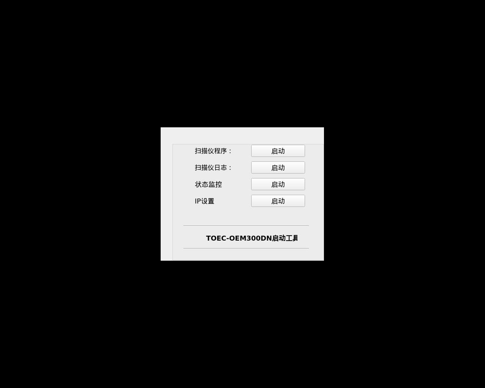 | N/A |
| [com.toec.toeca3oemseries](./com.toec.toeca3oemseries) | amd64  | deepin-v23 | 1.0 | 失败 | [SHA256](./com.toec.toeca3oemseries/SHA256SUMS) |
| [com.toec.toeca3series](./com.toec.toeca3series) | amd64  | deepin-v23 | 2.5-7.1 | 失败 | [SHA256](./com.toec.toeca3series/SHA256SUMS) |
| [com.toec.toeca4faxseries](./com.toec.toeca4faxseries) | amd64  | deepin-v23 | 2.6-4.1 | 失败 | [SHA256](./com.toec.toeca4faxseries/SHA256SUMS) |
| [com.toec.toeca4printer](./com.toec.toeca4printer) | amd64  | deepin-v23 | 1.0-18.2 | 失败 | [SHA256](./com.toec.toeca4printer/SHA256SUMS) |
| [com.toec.toeca4series](./com.toec.toeca4series) | amd64  | deepin-v23 | 2.7-3 | 失败 | [SHA256](./com.toec.toeca4series/SHA256SUMS) |
| [com.toec.toecmyseries](./com.toec.toecmyseries) | amd64  | deepin-v23 | 3.0.0.11 | 失败 | [SHA256](./com.toec.toecmyseries/SHA256SUMS) |
| [com.toec.toecrlseries](./com.toec.toecrlseries) | amd64  | deepin-v23 | 1.1-7 | 失败 | [SHA256](./com.toec.toecrlseries/SHA256SUMS) |
| [com.toec.toecrlwseries](./com.toec.toecrlwseries) | amd64  | deepin-v23 | 1.1-1 | 失败 | [SHA256](./com.toec.toecrlwseries/SHA256SUMS) |
| [com.toec.toecscanner](./com.toec.toecscanner) | amd64  | deepin-v23 | 2.6-4-20250327 | 失败 | N/A |
| [com.tr.gpyapp](./com.tr.gpyapp) | amd64  | deepin-v23 | 1.0.0.2 | 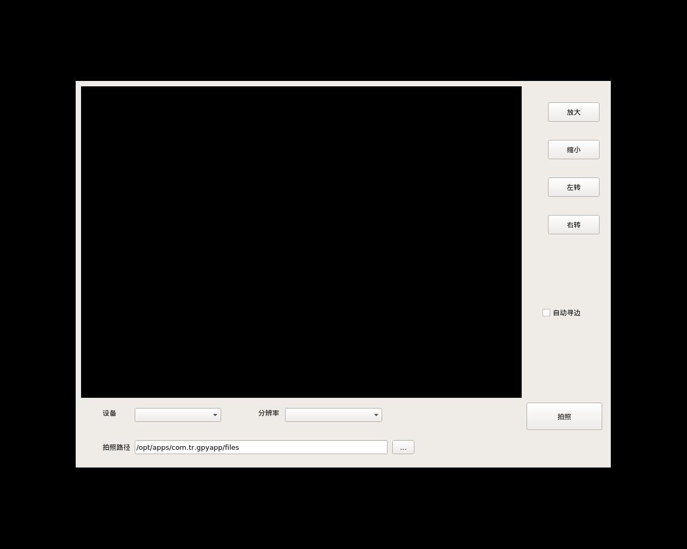 | [SHA256](./com.tr.gpyapp/SHA256SUMS) |
| [com.utel.uboxweb](./com.utel.uboxweb) | amd64  | deepin-v23 | 1.0.0.10-20250327 | 失败 | N/A |
| [com.wendouscanner](./com.wendouscanner) | amd64  | deepin-v23 | 1.1 | 失败 | [SHA256](./com.wendouscanner/SHA256SUMS) |
| [com.winmage.winmage-sane](./com.winmage.winmage-sane) | amd64  | deepin-v23 | 20240911-4.6.10.053-20250327 | 失败 | N/A |
| [com.winuim.wmr06](./com.winuim.wmr06) | amd64  | deepin-v23 | 1.0.0.4-1 |  | [SHA256](./com.winuim.wmr06/SHA256SUMS) |
| [com.wsd.gpy](./com.wsd.gpy) | amd64  | deepin-v23 | 1.0.26-20250327 | 失败 | N/A |
| [com.yjcloud.asr.agent](./com.yjcloud.asr.agent) | amd64  | deepin-v23 | 5.0.0 | 失败 | [SHA256](./com.yjcloud.asr.agent/SHA256SUMS) |
| [com.za.ld8800](./com.za.ld8800) | amd64  | deepin-v23 | 3.0.1.2 |  | [SHA256](./com.za.ld8800/SHA256SUMS) |
| [com.za.zaz301](./com.za.zaz301) | amd64  | deepin-v23 | 3.0.1.2 |  | [SHA256](./com.za.zaz301/SHA256SUMS) |
| [com.zebra.jaguardriver](./com.zebra.jaguardriver) | amd64  | deepin-v23 | 1.0.0.0 | 失败 | [SHA256](./com.zebra.jaguardriver/SHA256SUMS) |
| [com.zhiankeji.hs108](./com.zhiankeji.hs108) | amd64  | deepin-v23 | 1.0.1-1 | 失败 | [SHA256](./com.zhiankeji.hs108/SHA256SUMS) |
| [com.zhiankeji.hs110](./com.zhiankeji.hs110) | amd64  | deepin-v23 | 1.0.1-1 | 失败 | [SHA256](./com.zhiankeji.hs110/SHA256SUMS) |
| [com.ztsave.ztfinger](./com.ztsave.ztfinger) | amd64  | deepin-v23 | 1.0.0-1 |  | [SHA256](./com.ztsave.ztfinger/SHA256SUMS) |
| [compiz-boxmenu](./compiz-boxmenu) | amd64  | ubuntu-noble | 1.1.12-7build2-20250327 | 失败 | N/A |
| [compiz-core](./compiz-core) | amd64  | ubuntu-noble | 0.9.14.2+22.10.20220822-0ubuntu12-20250327 | 失败 | N/A |
| [compizconfig-settings-manager](./compizconfig-settings-manager) | amd64  | ubuntu-noble | 0.9.14.2+22.10.20220822-0ubuntu12-20250327 | 失败 | N/A |
| [comptext](./comptext) | amd64  | ubuntu-noble | 1.0.1-6build2 |  | N/A |
| [compton](./compton) | amd64  | ubuntu-noble | 1-3 |  | N/A |
| [compton-conf](./compton-conf) | amd64  | ubuntu-noble | 0.16.0-1ubuntu3 |  | N/A |
| [comptty](./comptty) | amd64  | ubuntu-noble | 1.0.1-5build2 |  | N/A |
| [confclerk](./confclerk) | amd64  | ubuntu-noble | 0.7.1-1build2 | 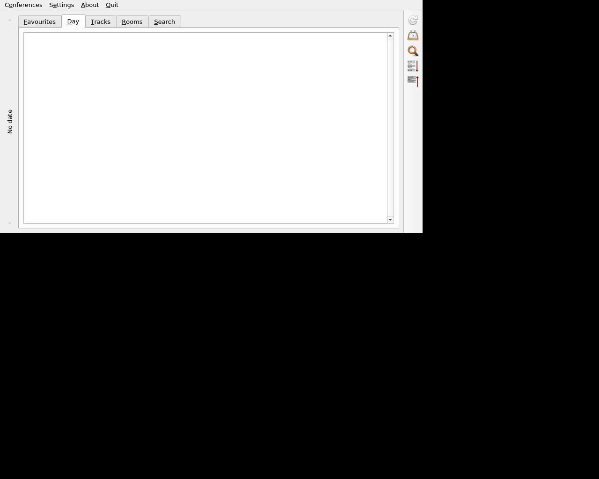 | N/A |
| [configure-debian](./configure-debian) | amd64  | ubuntu-noble | 1.0.3+nmu3-20250327 | 失败 | N/A |
| [confy](./confy) | amd64  | ubuntu-noble | 0.7.0-1-20250327 | 失败 | N/A |
| [congruity](./congruity) | amd64  | ubuntu-noble | 21-1 |  | N/A |
| [conky-all](./conky-all) | amd64  | deepin-v23 | 1.21.1-1-20250327 | 失败 | N/A |
| [conky-cli](./conky-cli) | amd64  | deepin-v23 | 1.21.1-1 | 失败 | [SHA256](./conky-cli/SHA256SUMS) |
| [conky-std](./conky-std) | amd64  | deepin-v23 | 1.21.1-1 | 失败 | [SHA256](./conky-std/SHA256SUMS) |
| [connectagram](./connectagram) | amd64  | ubuntu-noble | 1.3.5-2build1 |  | N/A |
| [connectome-workbench](./connectome-workbench) | amd64  | ubuntu-noble | 1.5.0-2build2 |  | N/A |
| [connman-gtk](./connman-gtk) | amd64  | ubuntu-noble | 1.1.1+git20180626.b72c6ab-3build2 |  | N/A |
| [content-hub](./content-hub) | amd64  | ubuntu-noble | 1.1.1-1build5-20250327 | 失败 | N/A |
| [content-hub-testability](./content-hub-testability) | amd64  | ubuntu-noble | 1.1.1-1build5 |    | N/A |
| [converseen](./converseen) | amd64  | ubuntu-noble | 0.12.1.0-1build2 |  | N/A |
| [convertall](./convertall) | amd64  | ubuntu-noble | 0.8.0-2 |  | N/A |
| [cool-retro-term](./cool-retro-term) | amd64  | ubuntu-noble | 1.2.0+ds2-2build2 |  | N/A |
| [copyq](./copyq) | amd64  | ubuntu-noble | 7.1.0-1build2 |  | N/A |
| [coqide](./coqide) | amd64  | ubuntu-noble | 8.18.0+dfsg-1build2 | 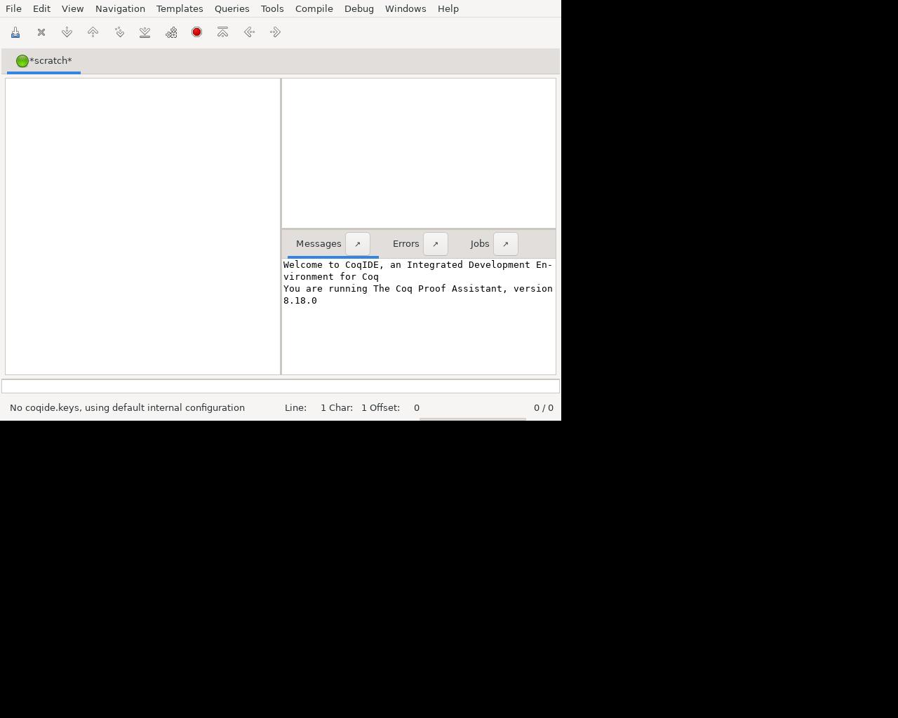 | N/A |
| [corectrl](./corectrl) | amd64  | ubuntu-noble | 1.3.11+ds-1build1-20250327 | 失败 | N/A |
| [corsix-th](./corsix-th) | amd64  | ubuntu-noble | 0.67-1 |  | N/A |
| [cppcheck-gui](./cppcheck-gui) | amd64  | ubuntu-noble | 2.13.0-2ubuntu3 | 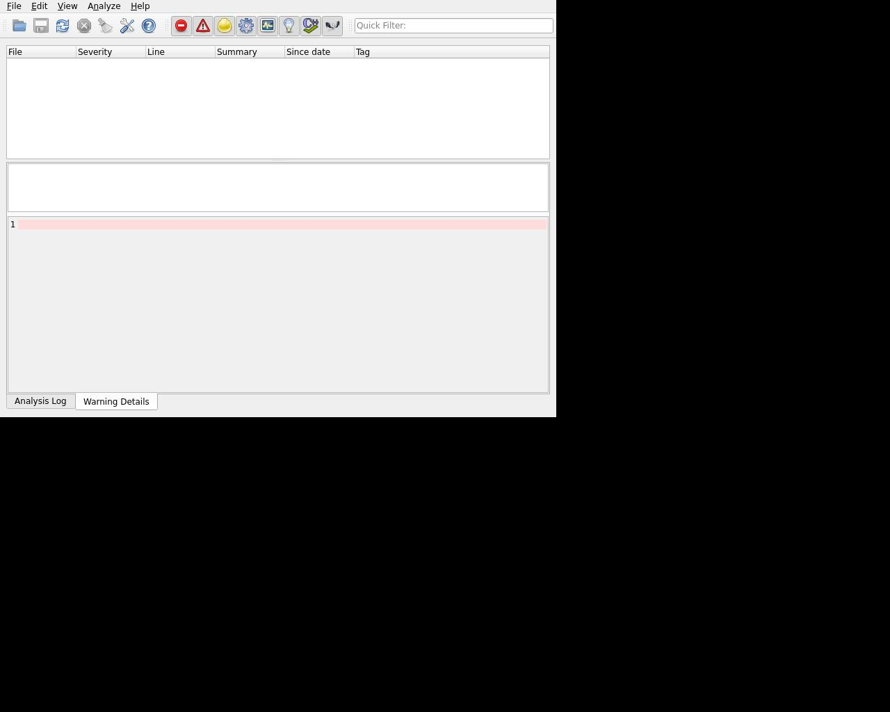 | N/A |
| [cpu-x](./cpu-x) | amd64  | ubuntu-noble | 5.0.3-2build2 | 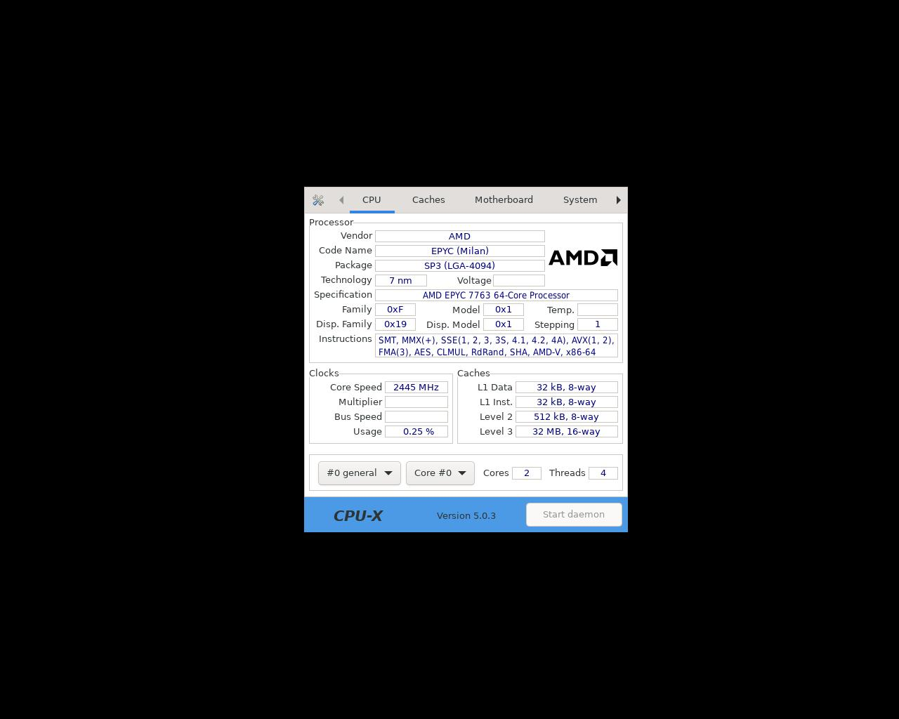 | N/A |
| [cpupower-gui](./cpupower-gui) | amd64  | ubuntu-noble | 0.7.2-2.1ubuntu2-20250327 | 失败 | N/A |
| [cqrlog](./cqrlog) | amd64  | ubuntu-noble | 2.5.2-3ubuntu2 |  | N/A |
| [crack-attack](./crack-attack) | amd64  | ubuntu-noble | 1.1.14-9.2build2 |  | N/A |
| [crawl](./crawl) | amd64  | ubuntu-noble | 0.28.0-1.1-20250327 | 失败 | N/A |
| [crawl-tiles](./crawl-tiles) | amd64  | ubuntu-noble | 0.28.0-1.1 |  | N/A |
| [cream](./cream) | amd64  | ubuntu-noble | 0.43-3.1-20250327 | 失败 | N/A |
| [crimson](./crimson) | amd64  | ubuntu-noble | 0.5.2-1.1build2 |  | N/A |
| [crispy-doom](./crispy-doom) | amd64  | ubuntu-noble | 6.0-2build2 |    | N/A |
| [criticalmass](./criticalmass) | amd64  | ubuntu-noble | 1.0.2-4build3-20250327 | 失败 | N/A |
| [critterding](./critterding) | amd64  | ubuntu-noble | 1.0-beta12.1-1.3build1 |  | N/A |
| [cronometer](./cronometer) | amd64  | ubuntu-noble | 0.9.9+dfsg1-1-20250327 | 失败 | N/A |
| [crossfire-client](./crossfire-client) | amd64  | ubuntu-noble | 1.75.0-2build4 |  | N/A |
| [crow-translate](./crow-translate) | amd64  | ubuntu-noble | 2.11.1+git20240108+ds-1build2 |  | N/A |
| [crrcsim](./crrcsim) | amd64  | ubuntu-noble | 0.9.13-3.2build2 | 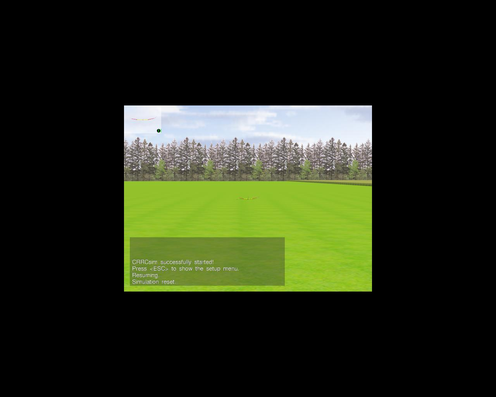 | N/A |
| [crystal-facet-uml](./crystal-facet-uml) | amd64  | ubuntu-noble | 1.55.3-1build2 |  | N/A |
| [csoundqt](./csoundqt) | amd64  | ubuntu-noble | 1.1.1+dfsg0-1build2 |  | N/A |
| [ctsim](./ctsim) | amd64  | ubuntu-noble | 6.0.2-6build3 |  | N/A |
| [cube2-data](./cube2-data) | amd64  | ubuntu-noble | 1.3-1 |  | N/A |
| [cubicsdr](./cubicsdr) | amd64  | ubuntu-noble | 0.2.7+dfsg-2build3 | 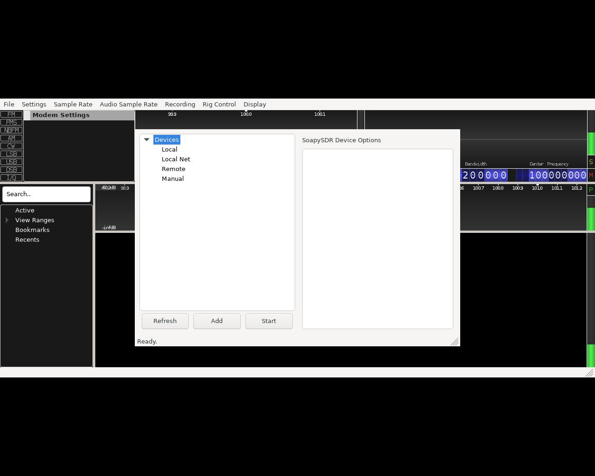 | N/A |
| [cultivation](./cultivation) | amd64  | ubuntu-noble | 9+dfsg1-2build5 |  | N/A |
| [curtain](./curtain) | amd64  | ubuntu-noble | 0.3-1.1build3 |  | N/A |
| [cutecom](./cutecom) | amd64  | ubuntu-noble | 0.51.0-1build2 |  | N/A |
| [cutemaze](./cutemaze) | amd64  | ubuntu-noble | 1.3.2-1build2 |  | N/A |
| [cutesdr](./cutesdr) | amd64  | ubuntu-noble | 1.20-4build2 | 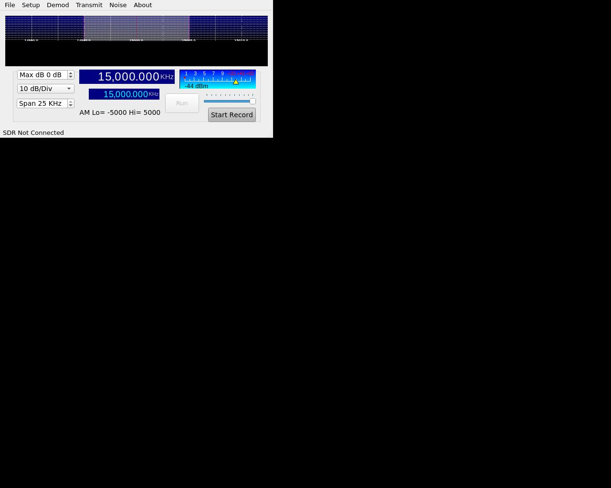 | N/A |
| [cuyo](./cuyo) | amd64  | ubuntu-noble | 2.1.0-1build1 |  | N/A |
| [cycle](./cycle) | amd64  | ubuntu-noble | 0.3.3-1-20250327 | 失败 | N/A |
| [cyclograph-gtk3](./cyclograph-gtk3) | amd64  | ubuntu-noble | 1.9.1-1.2-20250327 | 失败 | N/A |
| [cyclograph-qt5](./cyclograph-qt5) | amd64  | ubuntu-noble | 1.9.1-1.2-20250327 | 失败 | N/A |
| [cynthiune.app](./cynthiune.app) | amd64  | ubuntu-noble | 1.0.0-2build9 | 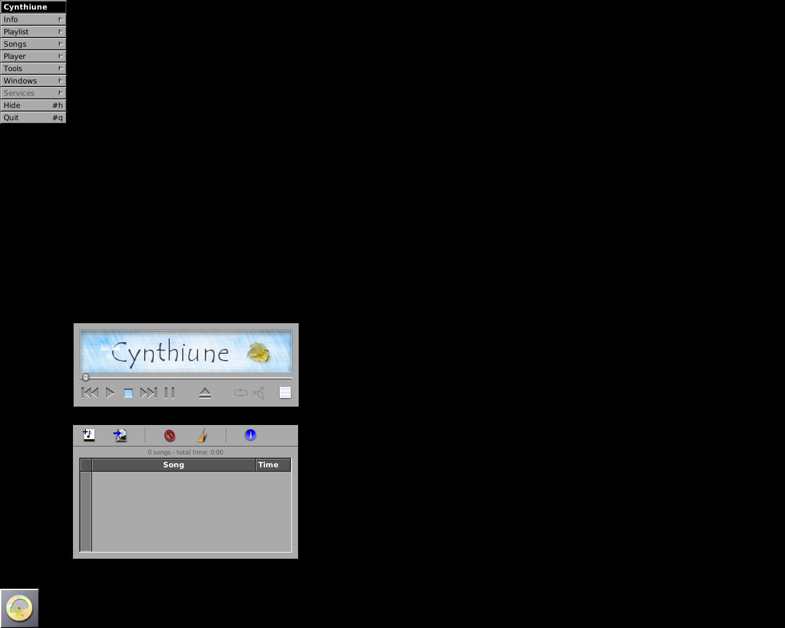 | N/A |
| [cytadela](./cytadela) | amd64  | ubuntu-noble | 1.1.0-4build1-20250327 | 失败 | N/A |
| [d-feet](./d-feet) | amd64  | deepin-v23 | 0.3.16-3 | 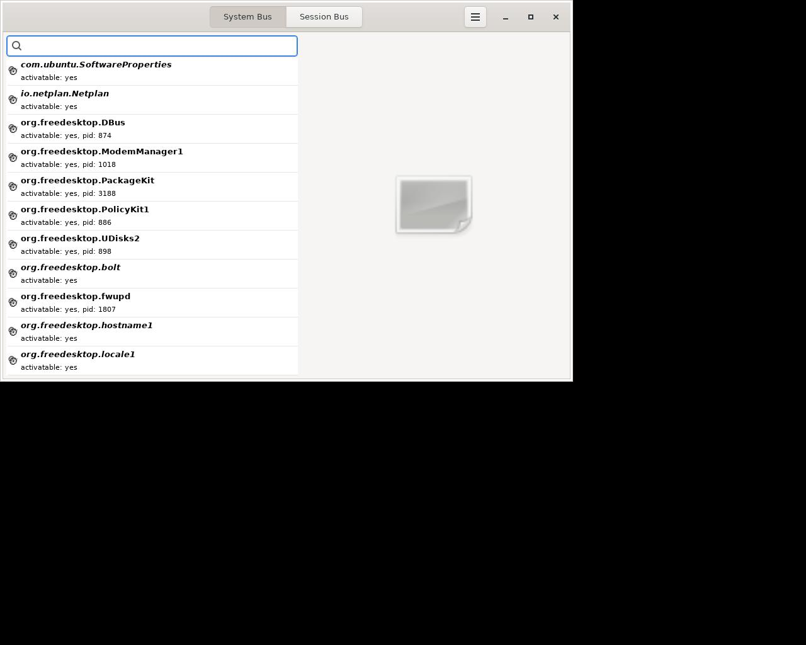 | [SHA256](./d-feet/SHA256SUMS) |
| [d-spy](./d-spy) | amd64  | ubuntu-noble | 1.10.0-1build1 |  | N/A |
| [d1x-rebirth](./d1x-rebirth) | amd64  | ubuntu-noble | 0.58.1-1.2-20250327 | 失败 | N/A |
| [d2x-rebirth](./d2x-rebirth) | amd64  | ubuntu-noble | 0.58.1-1.3-20250327 | 失败 | N/A |
| [daisy-player](./daisy-player) | amd64  | ubuntu-noble | 13.0-4build2-20250327 | 失败 | N/A |
| [dangen](./dangen) | amd64  | ubuntu-noble | 0.5-7 |  | N/A |
| [danmaq](./danmaq) | amd64  | ubuntu-noble | 0.2.3.2-2build2 |  | N/A |
| [darkradiant](./darkradiant) | amd64  | ubuntu-noble | 3.8.0-2build4 |  | N/A |
| [darktable](./darktable) | amd64  | ubuntu-noble | 4.6.1-2ubuntu1 |  | N/A |
| [darnwdl](./darnwdl) | amd64  | ubuntu-noble | 0.8-1build1 |  | N/A |
| [dasher](./dasher) | amd64  | ubuntu-noble | 5.0.0~beta~repack2-4build3 | 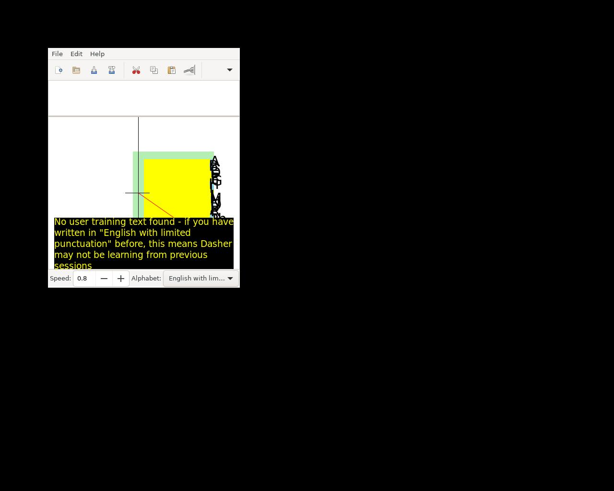 | N/A |
| [davegnukem](./davegnukem) | amd64  | ubuntu-noble | 1.0.3-4 |  | N/A |
| [davmail](./davmail) | amd64  | ubuntu-noble | 6.2.1.3496-1 |  | N/A |
| [dawg](./dawg) | amd64  | ubuntu-noble | 1.2-4-20250327 | 失败 | N/A |
| [dclock](./dclock) | amd64  | ubuntu-noble | 2.2.2-14build2 | 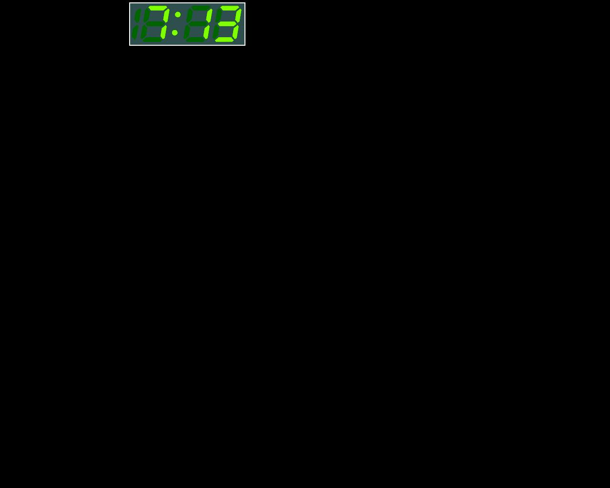 | N/A |
| [dconf-editor](./dconf-editor) | amd64  | ubuntu-noble | 45.0.1-1build2 | 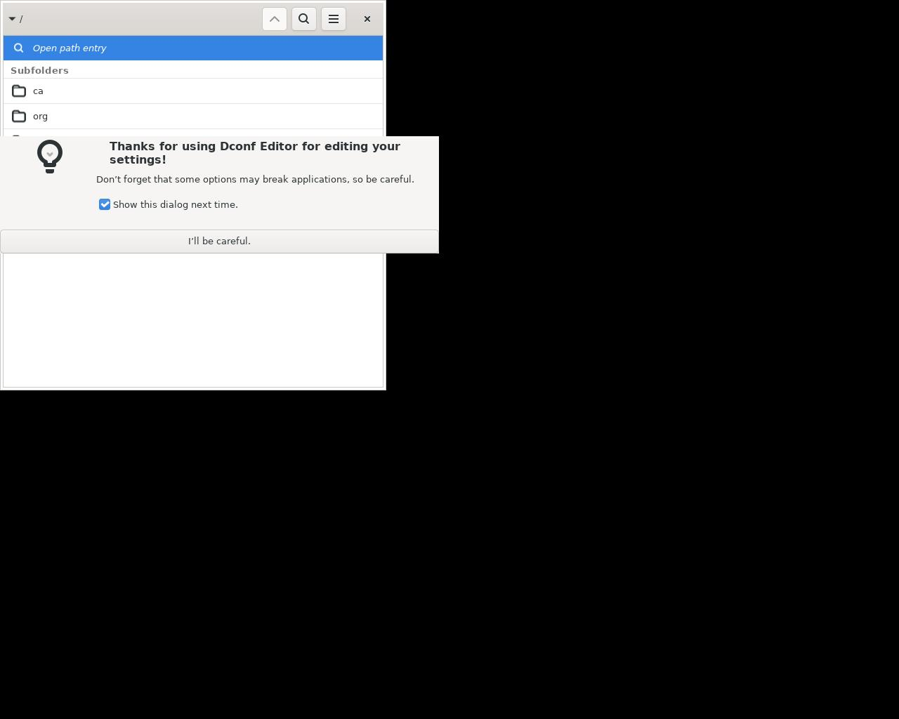 | N/A |
| [ddcui](./ddcui) | amd64  | ubuntu-noble | 0.3.0-1build3 | 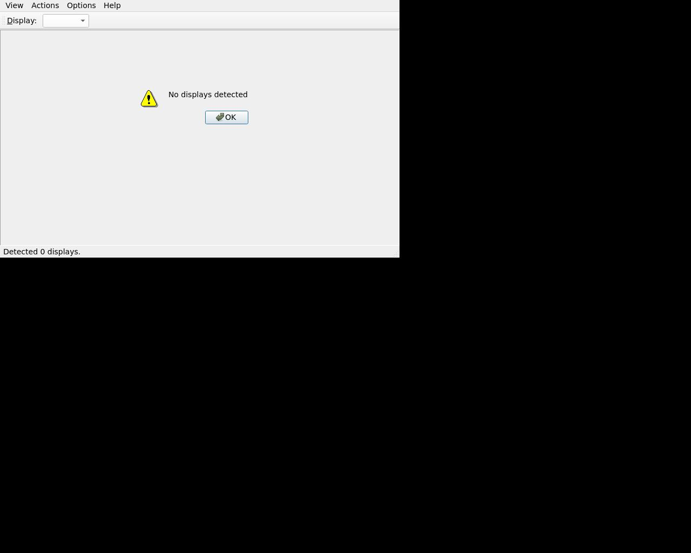 | N/A |
| [ddd](./ddd) | amd64  | ubuntu-noble | 3.3.12-5.4build2 |  | N/A |
| [dde-calendar](./dde-calendar) | amd64  | deepin-v23 | 5.14.7-20250327 | 失败 | N/A |
| [dde-control-center](./dde-control-center) | amd64  | deepin-v23 | 6.0.75+deepin0+rb1-20250327 | 失败 | N/A |
| [dde-cooperation](./dde-cooperation) | amd64  | deepin-v23 | 1.0.2-1 |  | [SHA256](./dde-cooperation/SHA256SUMS) |
| [dde-desktop](./dde-desktop) | amd64  | deepin-v23 | 6.5.10.4-20250327 | 失败 | N/A |
| [dde-device-formatter](./dde-device-formatter) | amd64  | deepin-v23 | 0.0.1.16-20250327 | 失败 | N/A |
| [dde-file-manager](./dde-file-manager) | amd64  | deepin-v23 | 6.5.10.4-20250327 | 失败 | N/A |
| [dde-introduction](./dde-introduction) | amd64  | deepin-v23 | 7.0.9 | 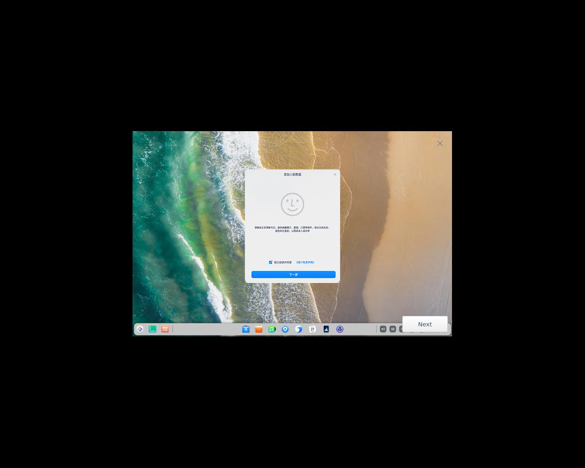 | [SHA256](./dde-introduction/SHA256SUMS) |
| [dde-printer](./dde-printer) | amd64  | deepin-v23 | 1.0.25-1+1060 |  | N/A |
| [dde-session-shell](./dde-session-shell) | amd64  | deepin-v23 | 6.0.23-20250327 | 失败 | N/A |
| [dde-store](./dde-store) | amd64  | ubuntu-noble | 1.2.5-1build2-20250327 | 失败 | N/A |
| [ddnet](./ddnet) | amd64  | ubuntu-noble | 16.4-1.2build5 |  | N/A |
| [ddrescueview](./ddrescueview) | amd64  | ubuntu-noble | 0.4.5-2 |  | N/A |
| [deb-gview](./deb-gview) | amd64  | ubuntu-noble | 0.3.7build2 | 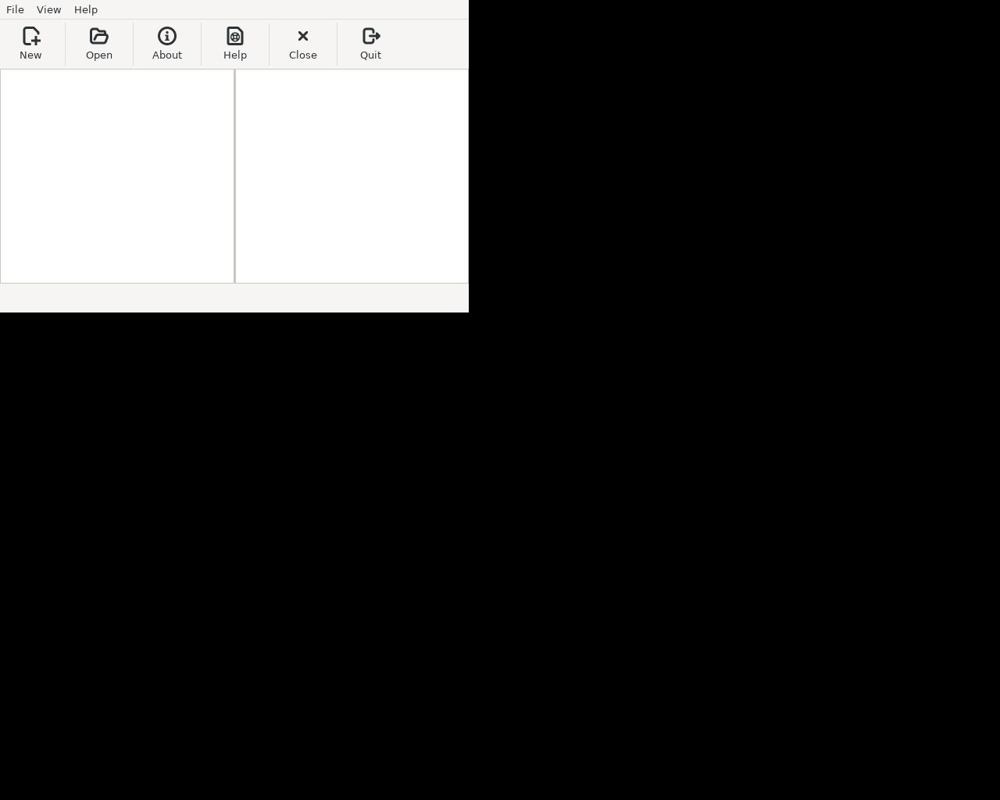 | N/A |
| [debian-installer-launcher](./debian-installer-launcher) | amd64  | ubuntu-noble | 41 |  | N/A |
| [debian-reference-common](./debian-reference-common) | amd64  | ubuntu-noble | 2.122-20250327 | 失败 | N/A |
| [deepin-album](./deepin-album) | amd64  | deepin-v23 | 5.10.25 |  | [SHA256](./deepin-album/SHA256SUMS) |
| [deepin-app-store](./deepin-app-store) | amd64  | deepin-v23 | 8.0.7.0010 |  | [SHA256](./deepin-app-store/SHA256SUMS) |
| [deepin-boot-maker](./deepin-boot-maker) | amd64  | deepin-v23 | 5.7.10-20250327 | 失败 | N/A |
| [deepin-calculator](./deepin-calculator) | amd64  | deepin-v23 | 6.0.1 |  | [SHA256](./deepin-calculator/SHA256SUMS) |
| [deepin-camera](./deepin-camera) | amd64  | deepin-v23 | 6.5.5-20250327 | 失败 | N/A |
| [deepin-compatibility-mode](./deepin-compatibility-mode) | amd64  | deepin-v23 | 0.1.2 |  | N/A |
| [deepin-compressor](./deepin-compressor) | amd64  | deepin-v23 | 6.0.2 |  | [SHA256](./deepin-compressor/SHA256SUMS) |
| [deepin-data-transfer](./deepin-data-transfer) | amd64  | deepin-v23 | 1.0.2-1 |  | [SHA256](./deepin-data-transfer/SHA256SUMS) |
| [deepin-deb-installer](./deepin-deb-installer) | amd64  | deepin-v23 | 6.5.0-20250327 | 失败 | N/A |
| [deepin-devicemanager](./deepin-devicemanager) | amd64  | deepin-v23 | 6.0.28-20250327 | 失败 | N/A |
| [deepin-diskmanager](./deepin-diskmanager) | amd64  | deepin-v23 | 1.4.1 |  | [SHA256](./deepin-diskmanager/SHA256SUMS) |
| [deepin-distrobox-ubuntu](./deepin-distrobox-ubuntu) | amd64  | deepin-v23 | 0 |  | N/A |
| [deepin-draw](./deepin-draw) | amd64  | deepin-v23 | 7.0.4 | 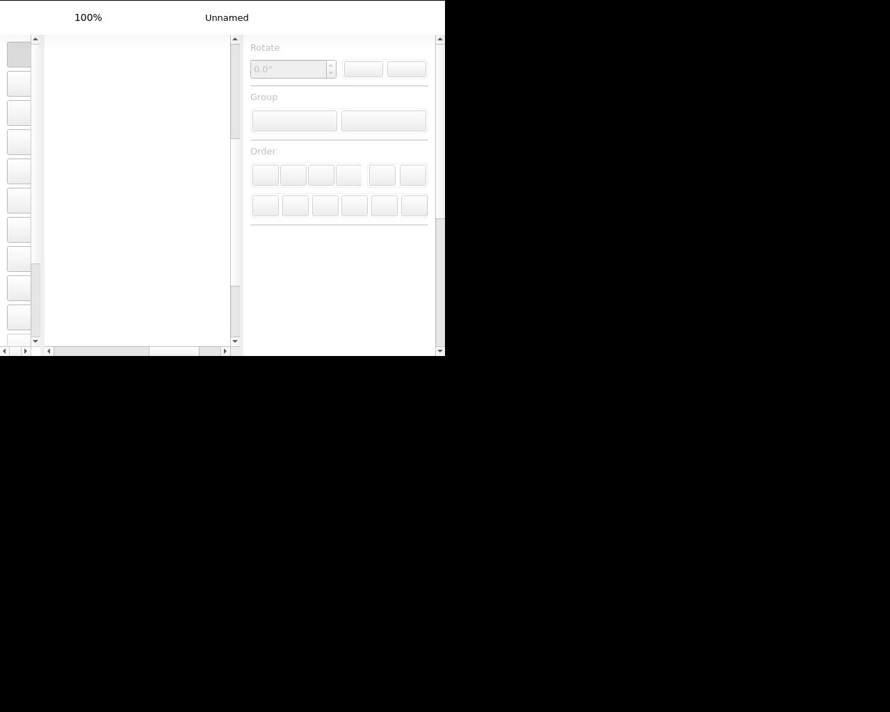 | [SHA256](./deepin-draw/SHA256SUMS) |
| [deepin-editor](./deepin-editor) | amd64  | deepin-v23 | 6.5.7 |  | N/A |
| [deepin-feedback](./deepin-feedback) | amd64  | deepin-v23 | 6.0.0-20250327 | 失败 | N/A |
| [deepin-font-manager](./deepin-font-manager) | amd64  | deepin-v23 | 6.5.3-20250327 | 失败 | N/A |
| [deepin-home](./deepin-home) | amd64  | deepin-v23 | 1.6.3 |  | N/A |
| [deepin-image-viewer](./deepin-image-viewer) | amd64  | deepin-v23 | 5.9.20 |  | [SHA256](./deepin-image-viewer/SHA256SUMS) |
| [deepin-log-viewer](./deepin-log-viewer) | amd64  | deepin-v23 | 6.5.2 |  | [SHA256](./deepin-log-viewer/SHA256SUMS) |
| [deepin-mail](./deepin-mail) | amd64  | deepin-v23 | 6.4.10-20250327 | 失败 | N/A |
| [deepin-manual](./deepin-manual) | amd64  | deepin-v23 | 6.5.6.1-20250327 | 失败 | N/A |
| [deepin-movie](./deepin-movie) | amd64  | deepin-v23 | 6.0.13-1-20250327 | 失败 | N/A |
| [deepin-music](./deepin-music) | amd64  | deepin-v23 | 6.2.40-20250327 | 失败 | N/A |
| [deepin-ocr](./deepin-ocr) | amd64  | deepin-v23 | 1.1.2-20250327 | 失败 | N/A |
| [deepin-picker](./deepin-picker) | amd64  | deepin-v23 | 6.0.1-20250327 | 失败 | N/A |
| [deepin-reader](./deepin-reader) | amd64  | deepin-v23 | 6.5.2-20250327 | 失败 | N/A |
| [deepin-screen-recorder](./deepin-screen-recorder) | amd64  | deepin-v23 | 6.0.9+deepin0+rb1-20250327 | 失败 | N/A |
| [deepin-system-monitor](./deepin-system-monitor) | amd64  | deepin-v23 | 6.5.2 |  | [SHA256](./deepin-system-monitor/SHA256SUMS) |
| [deepin-system-upgrade](./deepin-system-upgrade) | amd64  | deepin-v23 | 6.0.3 |  | [SHA256](./deepin-system-upgrade/SHA256SUMS) |
| [deepin-terminal](./deepin-terminal) | amd64  | deepin-v23 | 6.0.16 |  | N/A |
| [deepin-unioncode](./deepin-unioncode) | amd64  | deepin-v23 | 1.4.8-1-20250327 | 失败 | N/A |
| [deepin-voice-note](./deepin-voice-note) | amd64  | deepin-v23 | 6.0.17-20250327 | 失败 | N/A |
| [deja-dup](./deja-dup) | amd64  | ubuntu-noble | 45.2-1build2 |  | N/A |
| [deli-printer-a111](./deli-printer-a111) | amd64  | deepin-v23 | 1.1.022-20250327 | 失败 | N/A |
| [dell-recovery](./dell-recovery) | amd64  | ubuntu-noble | 1.66-20250327 | 失败 | N/A |
| [deluge-gtk](./deluge-gtk) | amd64  | ubuntu-noble | 2.1.2~dev0+20240121-1-20250327 | 失败 | N/A |
| [denemo](./denemo) | amd64  | ubuntu-noble | 2.6.18-1build3-20250327 | 失败 | N/A |
| [desktopfolder](./desktopfolder) | amd64  | ubuntu-noble | 1.1.3-3build2 |  | N/A |
| [devede](./devede) | amd64  | ubuntu-noble | 4.17.0-1-20250327 | 失败 | N/A |
| [developers-reference](./developers-reference) | amd64  | ubuntu-noble | 13.4-20250327 | 失败 | N/A |
| [devhelp](./devhelp) | amd64  | ubuntu-noble | 43.0-4build3 |  | N/A |
| [dfcgen-gtk](./dfcgen-gtk) | amd64  | ubuntu-noble | 0.6-2build2 |  | N/A |
| [dgedit](./dgedit) | amd64  | ubuntu-noble | 0.10.0-2build3 |  | N/A |
| [dhelp](./dhelp) | amd64  | ubuntu-noble | 0.6.30-20250327 | 失败 | N/A |
| [dhewm3-d3xp](./dhewm3-d3xp) | amd64  | ubuntu-noble | 1.5.2+dfsg-1build2-20250327 | 失败 | N/A |
| [dhewm3-doom3](./dhewm3-doom3) | amd64  | ubuntu-noble | 1.5.2+dfsg-1build2-20250327 | 失败 | N/A |
| [dia](./dia) | amd64  | ubuntu-noble | 0.98+git20240130-1build4-20250327 | 失败 | N/A |
| [dialect](./dialect) | amd64  | ubuntu-noble | 2.1.1+~2.1.1-1-20250327 | 失败 | N/A |
| [dianara](./dianara) | amd64  | ubuntu-noble | 1.4.4-1build2 | 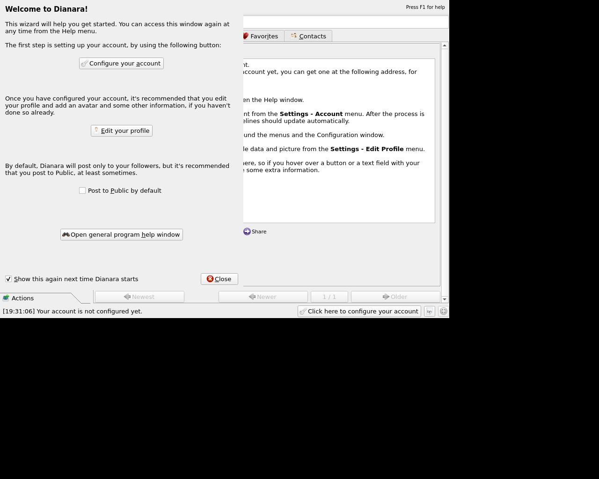 | N/A |
| [dictionaryreader.app](./dictionaryreader.app) | amd64  | ubuntu-noble | 0+20080616+dfsg-2.1build1 |  | N/A |
| [diffpdf](./diffpdf) | amd64  | ubuntu-noble | 2.1.3.1-2build3 |  | N/A |
| [diffuse](./diffuse) | amd64  | ubuntu-noble | 0.8.2-1ubuntu1.1-20250327 | 失败 | N/A |
| [digikam](./digikam) | amd64  | ubuntu-noble | 8.2.0-0ubuntu6.2 | 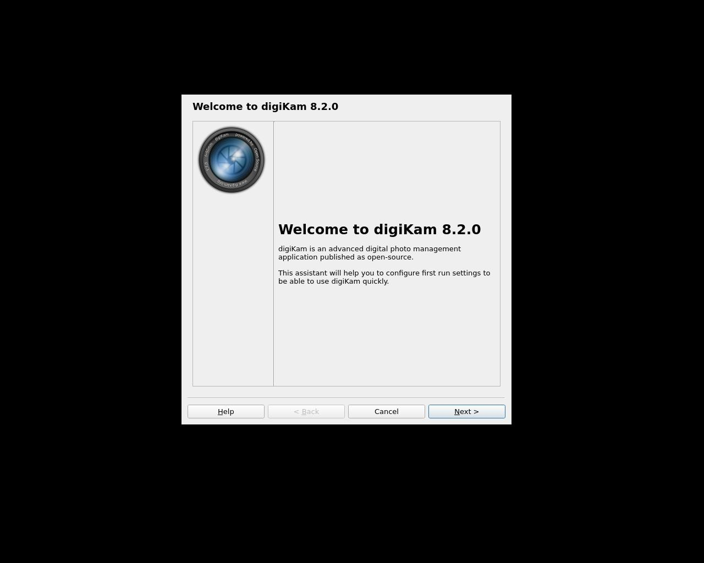 | N/A |
| [dillo](./dillo) | amd64  | ubuntu-noble | 3.0.5-7build5 |  | N/A |
| [din](./din) | amd64  | ubuntu-noble | 58.1+ds-1-20250327 | 失败 | N/A |
| [ding](./ding) | amd64  | ubuntu-noble | 1.9-7 | 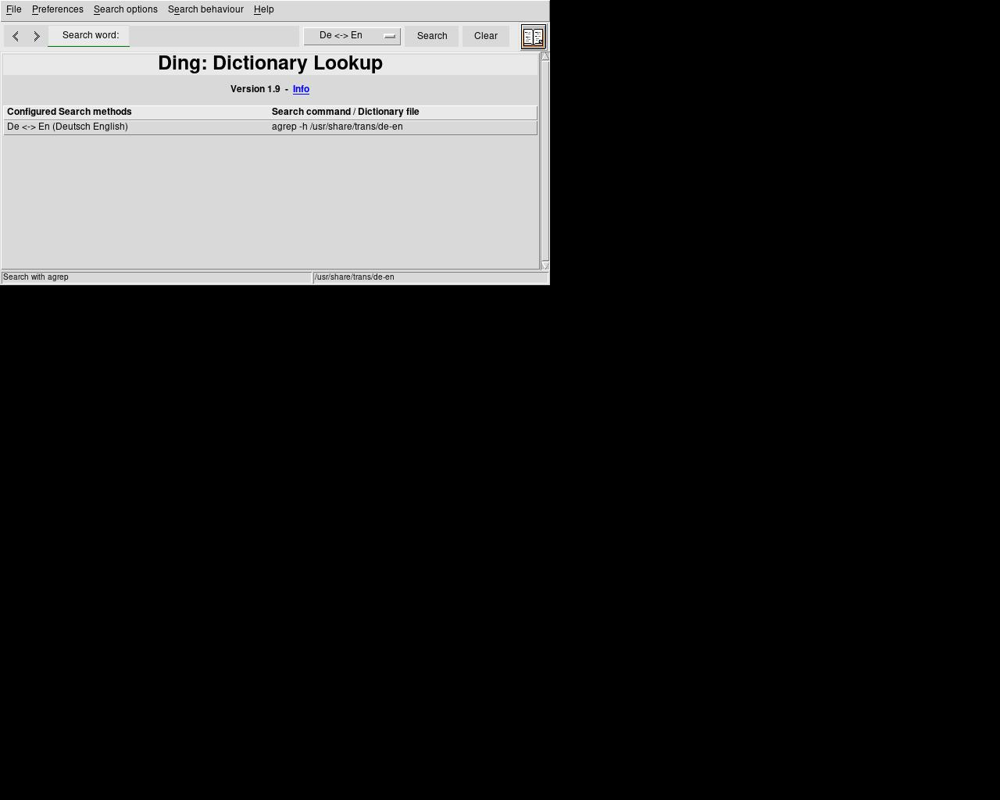 | N/A |
| [dino-im](./dino-im) | amd64  | ubuntu-noble | 0.4.3-3 |  | N/A |
| [diodon](./diodon) | amd64  | ubuntu-noble | 1.13.0-1build2 |  | N/A |
| [direwolf](./direwolf) | amd64  | ubuntu-noble | 1.7+dfsg-2build2-20250327 | 失败 | N/A |
| [displaycal](./displaycal) | amd64  | ubuntu-noble | 3.9.11-2ubuntu0.24.04.1-20250327 | 失败 | N/A |
| [distccmon-gnome](./distccmon-gnome) | amd64  | deepin-v23 | 3.4+really3.4-4deepin1 |  | [SHA256](./distccmon-gnome/SHA256SUMS) |
| [djview4](./djview4) | amd64  | ubuntu-noble | 4.12-3build3 |  | N/A |
| [dkopp](./dkopp) | amd64  | ubuntu-noble | 6.5-2build2-20250327 | 失败 | N/A |
| [dlt-viewer](./dlt-viewer) | amd64  | ubuntu-noble | 2.25.0+dfsg-2build3-20250327 | 失败 | N/A |
| [dochelp](./dochelp) | amd64  | ubuntu-noble | 0.1.8-20250327 | 失败 | N/A |
| [dodgindiamond2](./dodgindiamond2) | amd64  | ubuntu-noble | 0.2.2-4 |  | N/A |
| [dolphin](./dolphin) | amd64  | ubuntu-noble | 23.08.5-0ubuntu4 |  | N/A |
| [domino-chain](./domino-chain) | amd64  | ubuntu-noble | 1.1-3build3-20250327 | 失败 | N/A |
| [doomsday](./doomsday) | amd64  | ubuntu-noble | 2.3.1+ds1-1build3 |  | N/A |
| [doomsday-server](./doomsday-server) | amd64  | ubuntu-noble | 2.3.1+ds1-1build3 |  | N/A |
| [dopewars](./dopewars) | amd64  | ubuntu-noble | 1.6.2-1build4-20250327 | 失败 | N/A |
| [dosbox](./dosbox) | amd64  | ubuntu-noble | 0.74-3-5build2 |  | N/A |
| [dosbox-x](./dosbox-x) | amd64  | ubuntu-noble | 2024.03.01+dfsg-1build2 |  | N/A |
| [dossizola](./dossizola) | amd64  | ubuntu-noble | 1.0-12 | 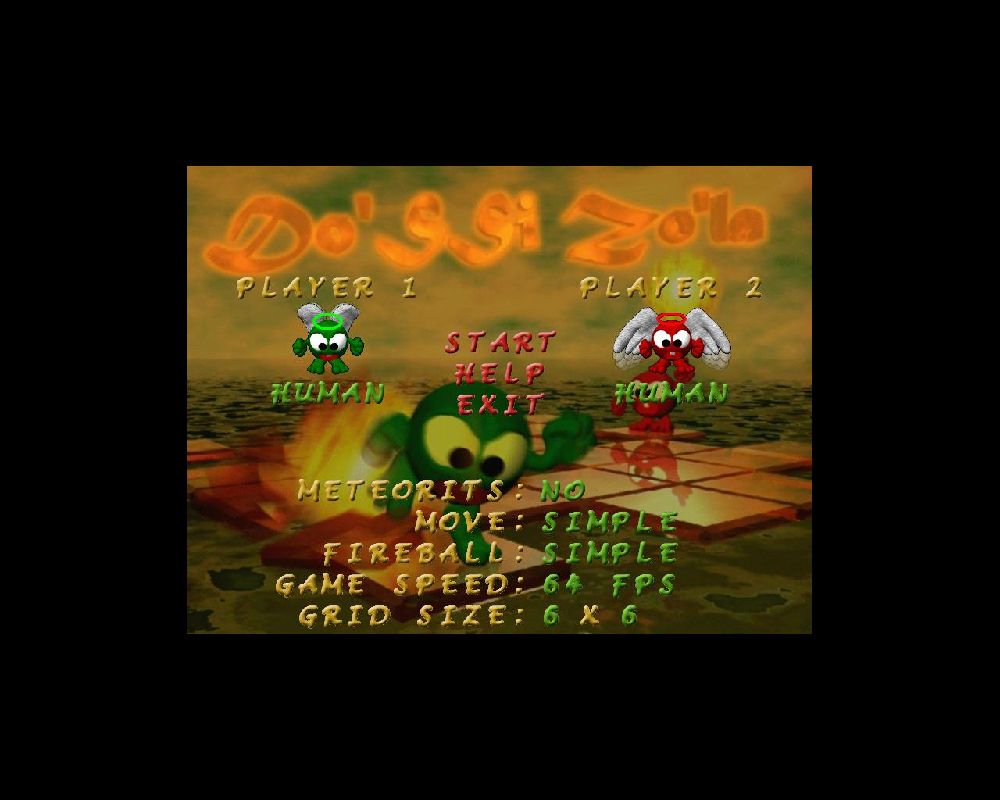 | N/A |
| [doublecmd-common](./doublecmd-common) | amd64  | ubuntu-noble | 1.1.11-1build1 |  | N/A |
| [dozzaqueux](./dozzaqueux) | amd64  | ubuntu-noble | 3.51-4 |  | N/A |
| [dpkg-www](./dpkg-www) | amd64  | ubuntu-noble | 2.65-20250327 | 失败 | N/A |
| [dragonplayer](./dragonplayer) | amd64  | ubuntu-noble | 23.08.5-0ubuntu3 |  | N/A |
| [drascula](./drascula) | amd64  | ubuntu-noble | 1.0+ds4-2 |  | N/A |
| [drascula-french](./drascula-french) | amd64  | ubuntu-noble | 1.0+ds4-2 |  | N/A |
| [drascula-german](./drascula-german) | amd64  | ubuntu-noble | 1.0+ds4-2 |  | N/A |
| [drascula-italian](./drascula-italian) | amd64  | ubuntu-noble | 1.0+ds4-2 |  | N/A |
| [drascula-spanish](./drascula-spanish) | amd64  | ubuntu-noble | 1.0+ds4-2 |  | N/A |
| [drawing](./drawing) | amd64  | ubuntu-noble | 1.0.2-1build1-20250327 | 失败 | N/A |
| [drawxtl](./drawxtl) | amd64  | ubuntu-noble | 5.5-6.1build2 |  | N/A |
| [dreamchess](./dreamchess) | amd64  | ubuntu-noble | 0.3.0-2 |  | N/A |
| [driftnet](./driftnet) | amd64  | ubuntu-noble | 1.5.0-0.2build3-20250327 | 失败 | N/A |
| [drkonqi](./drkonqi) | amd64  | ubuntu-noble | 5.27.11-0ubuntu3-20250327 | 失败 | N/A |
| [drumkv1](./drumkv1) | amd64  | ubuntu-noble | 0.9.34-1build3 | 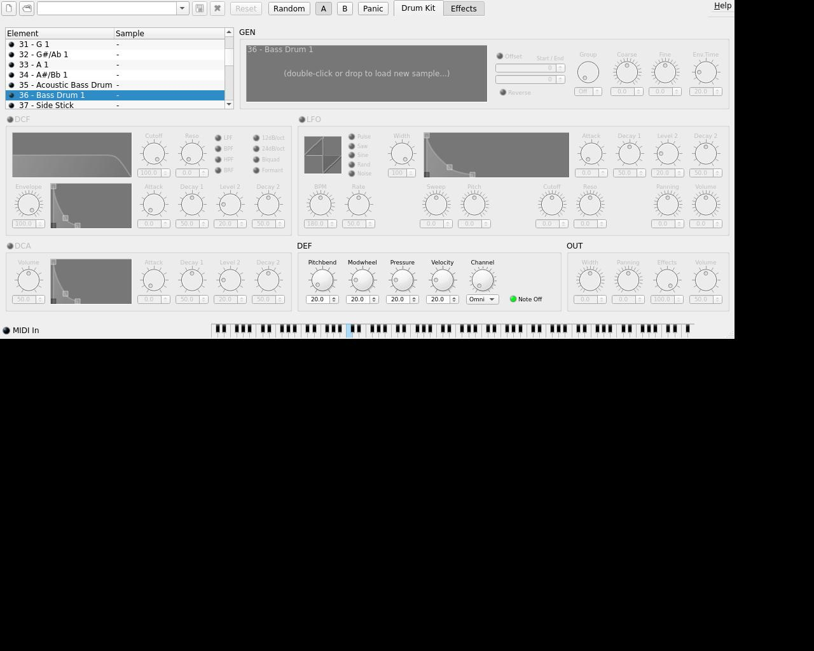 | N/A |
| [drumstick-tools](./drumstick-tools) | amd64  | ubuntu-noble | 2.9.0-1.1build2 |   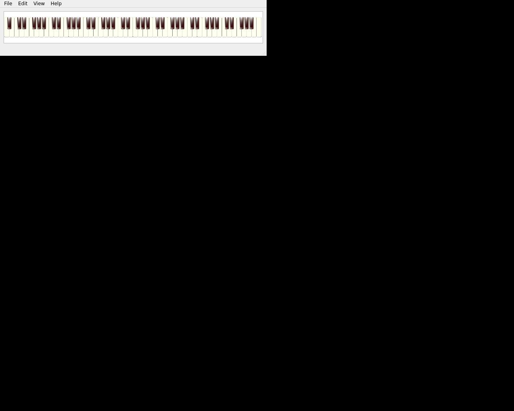 | N/A |
| [dsda-doom](./dsda-doom) | amd64  | ubuntu-noble | 0.27.5+dfsg-1build2 | 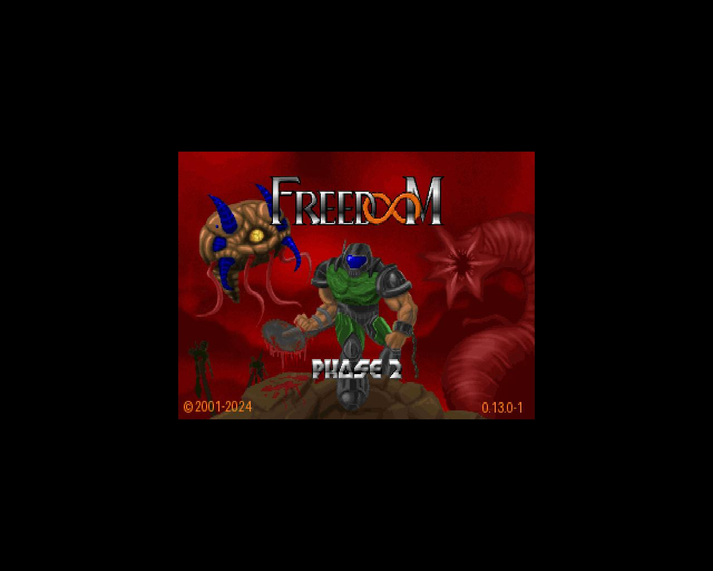 | N/A |
| [dspdfviewer](./dspdfviewer) | amd64  | ubuntu-noble | 1.15.1-1.1build5 |  | N/A |
| [dummyapp-wpsoffice](./dummyapp-wpsoffice) | amd64  | deepin-v23 | 1.0.2-20250327 | 失败 | N/A |
| [dupeguru](./dupeguru) | amd64  | ubuntu-noble | 4.3.1-4build1 |  | N/A |
| [dustracing2d](./dustracing2d) | amd64  | ubuntu-noble | 2.1.1-2build2 | 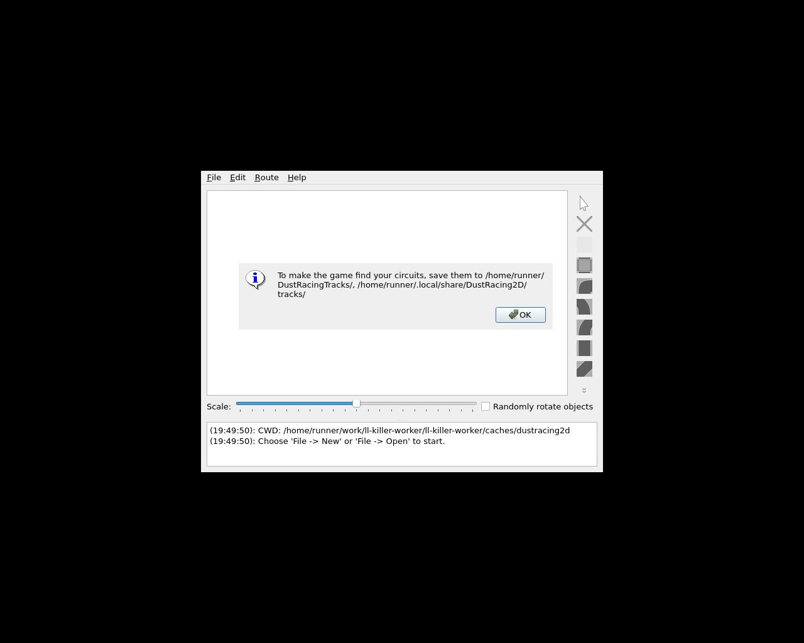  | N/A |
| [dvb-apps](./dvb-apps) | amd64  | ubuntu-noble | 1.1.1+rev1500-1.4build3-20250327 | 失败 | N/A |
| [dvbcut](./dvbcut) | amd64  | ubuntu-noble | 0.7.4-1build4 |  | N/A |
| [dvorak7min](./dvorak7min) | amd64  | ubuntu-noble | 1.6.1+repack-4-20250327 | 失败 | N/A |
| [dwarf-fortress](./dwarf-fortress) | amd64  | ubuntu-noble | 0.47.04+dfsg1-1build3 |  | N/A |
| [dwww](./dwww) | amd64  | ubuntu-noble | 1.16-20250327 | 失败 | N/A |
| [dx](./dx) | amd64  | ubuntu-noble | 4.4.4-15.1build2 |  | N/A |
| [dxf2gcode](./dxf2gcode) | amd64  | ubuntu-noble | 20191025-2 | 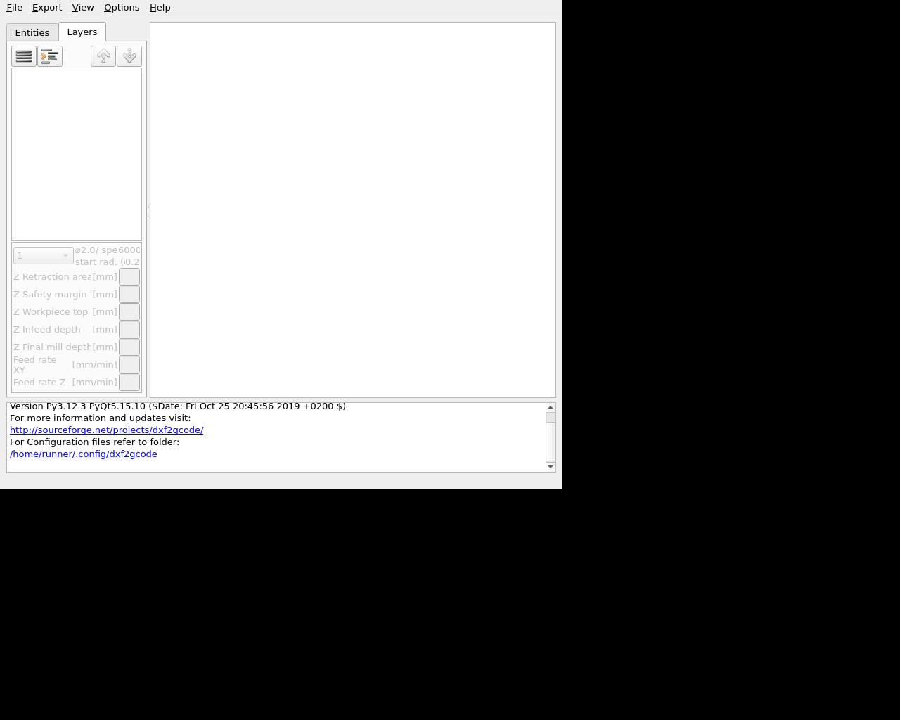 | N/A |
| [dyssol-gui](./dyssol-gui) | amd64  | ubuntu-noble | 1.1.1+ds1-2.1build4 |  | N/A |
| [eartag](./eartag) | amd64  | ubuntu-noble | 0.6.0-1-20250327 | 失败 | N/A |
| [easychem](./easychem) | amd64  | ubuntu-noble | 0.6-9build2 |  | N/A |
| [easyeffects](./easyeffects) | amd64  | deepin-v23 | 7.1.7-1-20250327 | 失败 | N/A |
| [easyssh](./easyssh) | amd64  | ubuntu-noble | 1.7.9-4build2 |  | N/A |
| [easytag](./easytag) | amd64  | ubuntu-noble | 2.4.3-5build3 |  | N/A |
| [ebook-speaker](./ebook-speaker) | amd64  | ubuntu-noble | 6.2.0-5build2-20250327 | 失败 | N/A |
| [ebook2cwgui](./ebook2cwgui) | amd64  | ubuntu-noble | 0.1.2-7build3 |  | N/A |
| [ebumeter](./ebumeter) | amd64  | ubuntu-noble | 0.5.1-1build2-20250327 | 失败 | N/A |
| [edb-debugger](./edb-debugger) | amd64  | deepin-v23 | 1.3.0-2.1deepin0 |  | [SHA256](./edb-debugger/SHA256SUMS) |
| [edenmath.app](./edenmath.app) | amd64  | ubuntu-noble | 1.1.1a-8build5 |  | N/A |
| [edfbrowser](./edfbrowser) | amd64  | ubuntu-noble | 2.06+dfsg-1build2 | 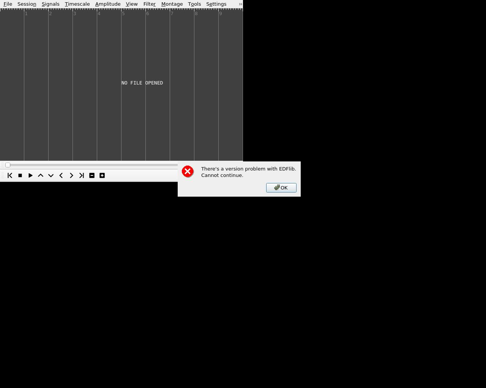 | N/A |
| [edgar](./edgar) | amd64  | ubuntu-noble | 1.37-1build2 |  | N/A |
| [edubuntu-docs](./edubuntu-docs) | amd64  | ubuntu-noble | 11.03.3 |  | N/A |
| [edubuntu-installer](./edubuntu-installer) | amd64  | ubuntu-noble | 0.6 |  | N/A |
| [edubuntu-menu](./edubuntu-menu) | amd64  | ubuntu-noble | 24.04.2.2-20250327 | 失败 | N/A |
| [eekboek-gui](./eekboek-gui) | amd64  | ubuntu-noble | 2.04-1build1 |  | N/A |
| [efte](./efte) | amd64  | ubuntu-noble | 1.1-4 |  | N/A |
| [eiciel](./eiciel) | amd64  | ubuntu-noble | 0.10.0-1build2 |  | N/A |
| [einstein](./einstein) | amd64  | ubuntu-noble | 2.0.dfsg.2-10build1 |  | N/A |
| [eiskaltdcpp-gtk](./eiskaltdcpp-gtk) | amd64  | ubuntu-noble | 2.4.2-1.1build6 |  | N/A |
| [eiskaltdcpp-qt](./eiskaltdcpp-qt) | amd64  | ubuntu-noble | 2.4.2-1.1build6 |  | N/A |
| [eiskaltdcpp-web](./eiskaltdcpp-web) | amd64  | ubuntu-noble | 1.0.1-2-20250327 | 失败 | N/A |
| [electric](./electric) | amd64  | ubuntu-noble | 9.07+dfsg-7-20250327 | 失败 | N/A |
| [elektroid](./elektroid) | amd64  | ubuntu-noble | 3.0.1-2build1 |  | N/A |
| [elisa](./elisa) | amd64  | ubuntu-noble | 23.08.5-0ubuntu3 |  | N/A |
| [elki](./elki) | amd64  | ubuntu-noble | 0.7.1-10.1-20250327 | 失败 | N/A |
| [emacs-common](./emacs-common) | amd64  | ubuntu-noble | 29.3+1-1ubuntu2-20250327 | 失败 | N/A |
| [emacs-gtk](./emacs-gtk) | amd64  | ubuntu-noble | 29.3+1-1ubuntu2 |  | N/A |
| [emacs-lucid](./emacs-lucid) | amd64  | ubuntu-noble | 29.3+1-1ubuntu2 |  | N/A |
| [emacs-pgtk](./emacs-pgtk) | amd64  | ubuntu-noble | 29.3+1-1ubuntu2 |  | N/A |
| [email-reminder](./email-reminder) | amd64  | ubuntu-noble | 0.8.3-1 |  | N/A |
| [emboss-explorer](./emboss-explorer) | amd64  | ubuntu-noble | 2.2.0-12-20250327 | 失败 | N/A |
| [emerald](./emerald) | amd64  | ubuntu-noble | 0.8.18-4.2build1 |  | N/A |
| [empire](./empire) | amd64  | ubuntu-noble | 1.16-2-20250327 | 失败 | N/A |
| [endeavour](./endeavour) | amd64  | ubuntu-noble | 43.0-1build3 |  | N/A |
| [endless-sky](./endless-sky) | amd64  | ubuntu-noble | 0.10.4-1build2 |  | N/A |
| [enemylines3](./enemylines3) | amd64  | ubuntu-noble | 1.25-1build3 |  | N/A |
| [enemylines7](./enemylines7) | amd64  | ubuntu-noble | 0.6-6 | 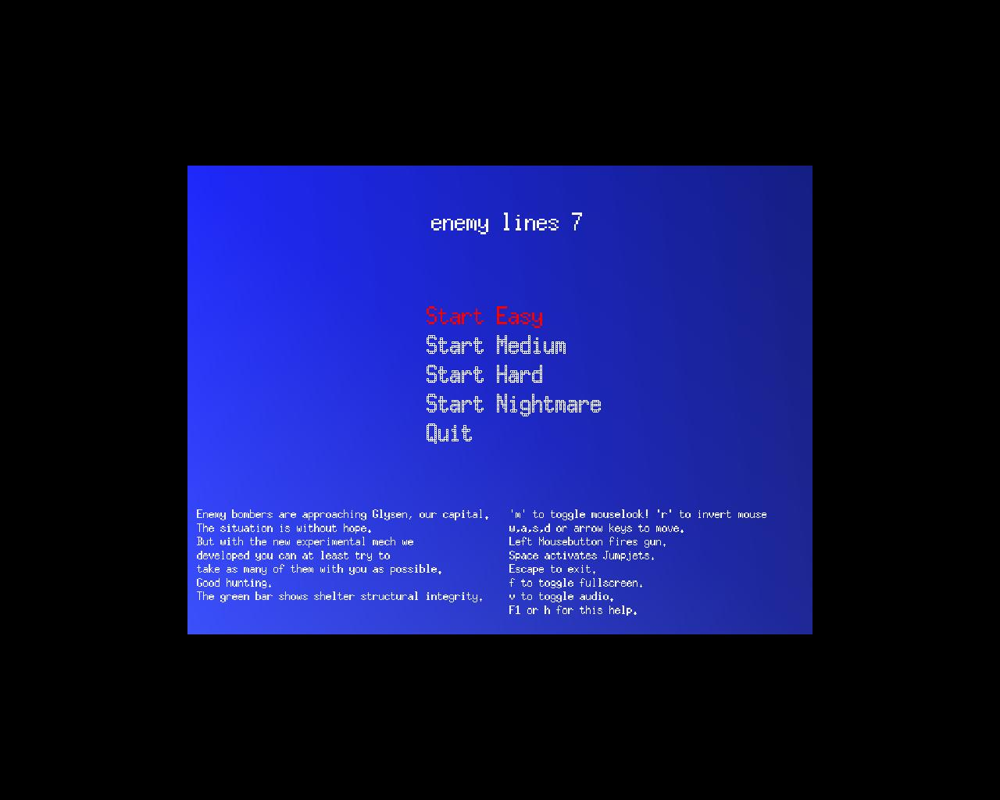 | N/A |
| [engauge-digitizer](./engauge-digitizer) | amd64  | ubuntu-noble | 12.1+ds.1-1build3 |  | N/A |
| [engrampa](./engrampa) | amd64  | ubuntu-noble | 1.26.2-4 | 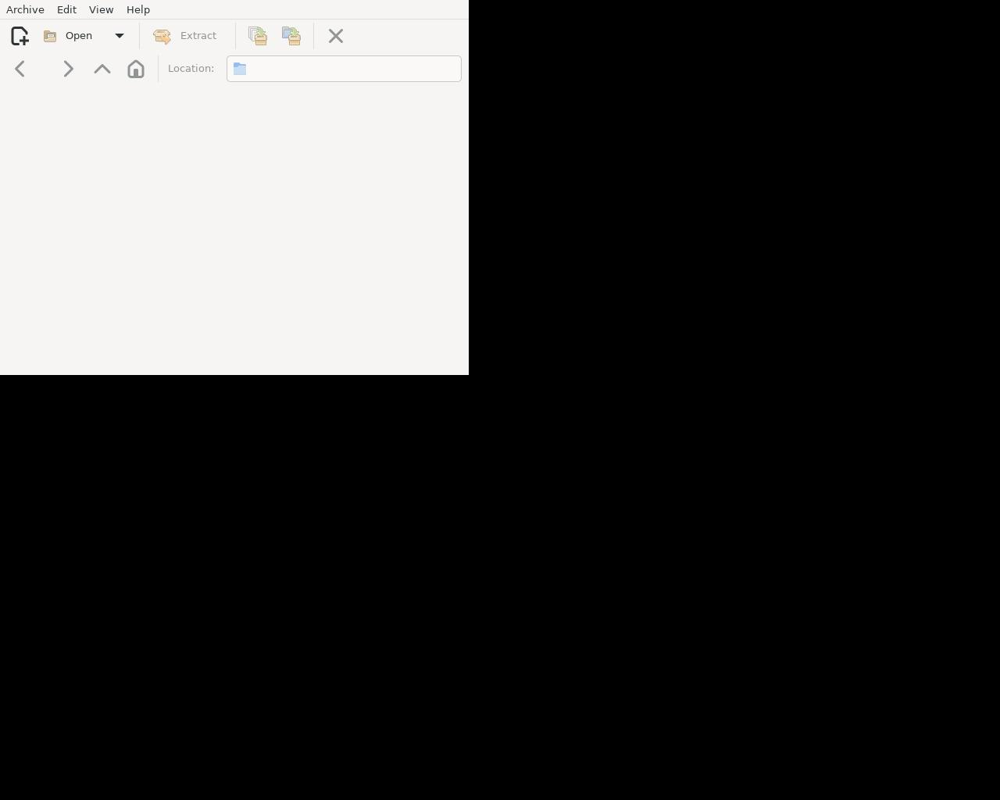 | N/A |
| [enigma](./enigma) | amd64  | ubuntu-noble | 1.30+dfsg-1build2 |  | N/A |
| [enlightenment](./enlightenment) | amd64  | ubuntu-noble | 0.26.0-2build2 |    | N/A |
| [entagged](./entagged) | amd64  | ubuntu-noble | 0.35-6 |  | N/A |
| [entangle](./entangle) | amd64  | ubuntu-noble | 3.0-4build2-20250327 | 失败 | N/A |
| [eog](./eog) | amd64  | ubuntu-noble | 45.3-1ubuntu2-20250327 | 失败 | N/A |
| [eom](./eom) | amd64  | ubuntu-noble | 1.26.1-1build3-20250327 | 失败 | N/A |
| [ephoto](./ephoto) | amd64  | ubuntu-noble | 1.6.0-1build2 |  | N/A |
| [epiphany](./epiphany) | amd64  | ubuntu-noble | 0.7.0+0-7-20250327 | 失败 | N/A |
| [epiphany-browser](./epiphany-browser) | amd64  | ubuntu-noble | 46.0-2build1 |  | N/A |
| [epoptes](./epoptes) | amd64  | ubuntu-noble | 23.08-1-20250327 | 失败 | N/A |
| [epson-tdbridge-pp100api](./epson-tdbridge-pp100api) | amd64  | deepin-v23 | 2.5.2-20250327 | 失败 | N/A |
| [epsonscan2](./epsonscan2) | amd64  | deepin-v23 | 6.7.42.10-1 |  | [SHA256](./epsonscan2/SHA256SUMS) |
| [eqonomize](./eqonomize) | amd64  | ubuntu-noble | 1.5.6-1build2 |  | N/A |
| [eric](./eric) | amd64  | ubuntu-noble | 23.2+ds1-2ubuntu1 | 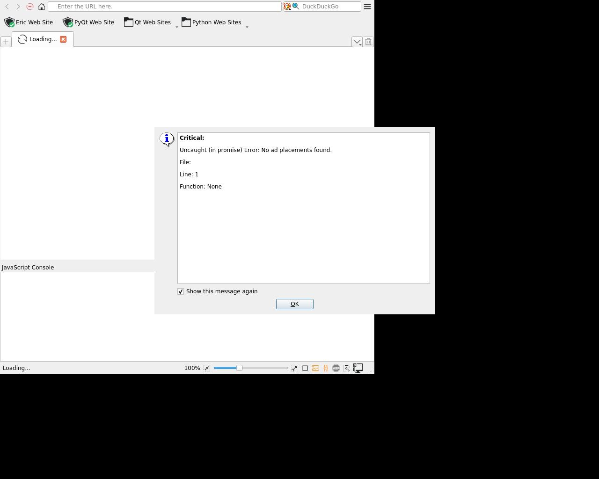  | N/A |
| [errands](./errands) | amd64  | ubuntu-noble | 45.1.9-2-20250327 | 失败 | N/A |
| [eskeysetuplog-admin](./eskeysetuplog-admin) | amd64  | deepin-v23 | 6.3.0.3 |  | N/A |
| [espeakedit](./espeakedit) | amd64  | ubuntu-noble | 1.48.15-2build3 |  | N/A |
| [etherape](./etherape) | amd64  | ubuntu-noble | 0.9.20-2build3 |  | N/A |
| [etm](./etm) | amd64  | ubuntu-noble | 3.2.39-1 |  | N/A |
| [etoys](./etoys) | amd64  | ubuntu-noble | 5.0.2408-1build1 |  | N/A |
| [ettercap-graphical](./ettercap-graphical) | amd64  | ubuntu-noble | 0.8.3.1-13build3-20250327 | 失败 | N/A |
| [etw](./etw) | amd64  | ubuntu-noble | 3.6+svn162-6build3 |  | N/A |
| [euler](./euler) | amd64  | ubuntu-noble | 1.61.0-12build2-20250327 | 失败 | N/A |
| [eureka](./eureka) | amd64  | ubuntu-noble | 1.27b-2build2 |  | N/A |
| [eviacam](./eviacam) | amd64  | ubuntu-noble | 2.1.4-2.1build2 |  | N/A |
| [evilwm](./evilwm) | amd64  | deepin-v23 | 1.4.2-1-20250327 | 失败 | N/A |
| [evince](./evince) | amd64  | ubuntu-noble | 46.3.1-0ubuntu1 |  | N/A |
| [evolution](./evolution) | amd64  | ubuntu-noble | 3.52.3-0ubuntu1 |  | N/A |
| [evolution-data-server](./evolution-data-server) | amd64  | ubuntu-noble | 3.52.3-0ubuntu1-20250327 | 失败 | N/A |
| [evolvotron](./evolvotron) | amd64  | ubuntu-noble | 0.8.1-1build3 |  | N/A |
| [exadrums](./exadrums) | amd64  | ubuntu-noble | 0.7.0-1build2 |  | N/A |
| [exaile](./exaile) | amd64  | ubuntu-noble | 4.1.3+dfsg-2ubuntu1-20250327 | 失败 | N/A |
| [excellent-bifurcation](./excellent-bifurcation) | amd64  | ubuntu-noble | 0.0.20071015-9build2 |  | N/A |
| [exfalso](./exfalso) | amd64  | deepin-v23 | 4.6.0-3 |  | [SHA256](./exfalso/SHA256SUMS) |
| [expeyes](./expeyes) | amd64  | ubuntu-noble | 5.3.1+repack-6build1 |  | N/A |
| [expeyes-doc-common](./expeyes-doc-common) | amd64  | ubuntu-noble | 4.3-3-20250327 | 失败 | N/A |
| [explosive-c4](./explosive-c4) | amd64  | ubuntu-noble | 1.2-3build2 |  | N/A |
| [extremetuxracer](./extremetuxracer) | amd64  | ubuntu-noble | 0.8.3-1build1 |  | [SHA256](./extremetuxracer/SHA256SUMS) |
| [exult](./exult) | amd64  | ubuntu-noble | 1.8-2build3 | 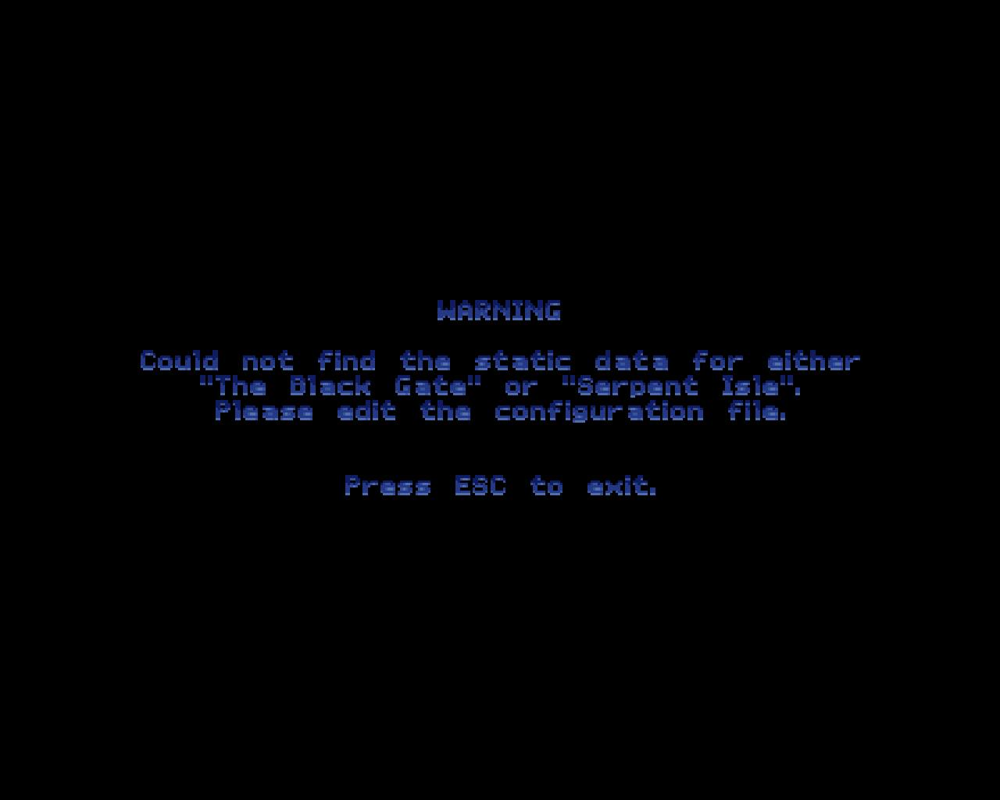 | N/A |
| [eyes17](./eyes17) | amd64  | ubuntu-noble | 5.3.1+repack-6build1 |  | N/A |
| [f3d](./f3d) | amd64  | ubuntu-noble | 2.2.1+dfsg-2build3 |  | N/A |
| [falkon](./falkon) | amd64  | ubuntu-noble | 24.01.75-1build3 |  | N/A |
| [fanwor](./fanwor) | amd64  | ubuntu-noble | 1.16-1build2 |  | N/A |
| [far2l](./far2l) | amd64  | ubuntu-noble | 2.6.0~beta+ds-1ubuntu0.3 |  | N/A |
| [fastqc](./fastqc) | amd64  | ubuntu-noble | 0.12.1+dfsg-3 |  | N/A |
| [faustworks](./faustworks) | amd64  | ubuntu-noble | 0.5~repack0-6build3 |  | N/A |
| [fbreader](./fbreader) | amd64  | ubuntu-noble | 0.99.4+dfsg-5.1build3 |  | N/A |
| [fbzx](./fbzx) | amd64  | ubuntu-noble | 4.8.0-2build2 |  | N/A |
| [fccexam](./fccexam) | amd64  | ubuntu-noble | 1.0.7-1.1 |  | N/A |
| [fceux](./fceux) | amd64  | ubuntu-noble | 2.6.5+dfsg1-2build3 |  | N/A |
| [fcitx-config-gtk](./fcitx-config-gtk) | amd64  | deepin-v23 | 0.4.10.32-2deepin-20250327 | 失败 | N/A |
| [fcitx-data](./fcitx-data) | amd64  | deepin-v23 | 4.2.9.32.38-deepin-20250327 | 失败 | N/A |
| [fcitx-ui-light](./fcitx-ui-light) | amd64  | ubuntu-noble | 0.1.3-5-20250327 | 失败 | N/A |
| [fcitx-ui-qimpanel](./fcitx-ui-qimpanel) | amd64  | ubuntu-noble | 2.1.3-2build4 |  | N/A |
| [fcitx5](./fcitx5) | amd64  | deepin-v23 | 5.1.11-2deepin2 |   | [SHA256](./fcitx5/SHA256SUMS) |
| [fcitx5-config-qt](./fcitx5-config-qt) | amd64  | ubuntu-noble | 5.1.4-1 |   | N/A |
| [fcitx5-frontend-qt5](./fcitx5-frontend-qt5) | amd64  | deepin-v23 | 5.1.8-2deepin1+rb1-20250327 | 失败 | N/A |
| [fcitx5-frontend-qt6](./fcitx5-frontend-qt6) | amd64  | deepin-v23 | 5.1.8-2deepin1+rb1-20250327 | 失败 | N/A |
| [feathernotes](./feathernotes) | amd64  | ubuntu-noble | 1.1.1-1build2 | 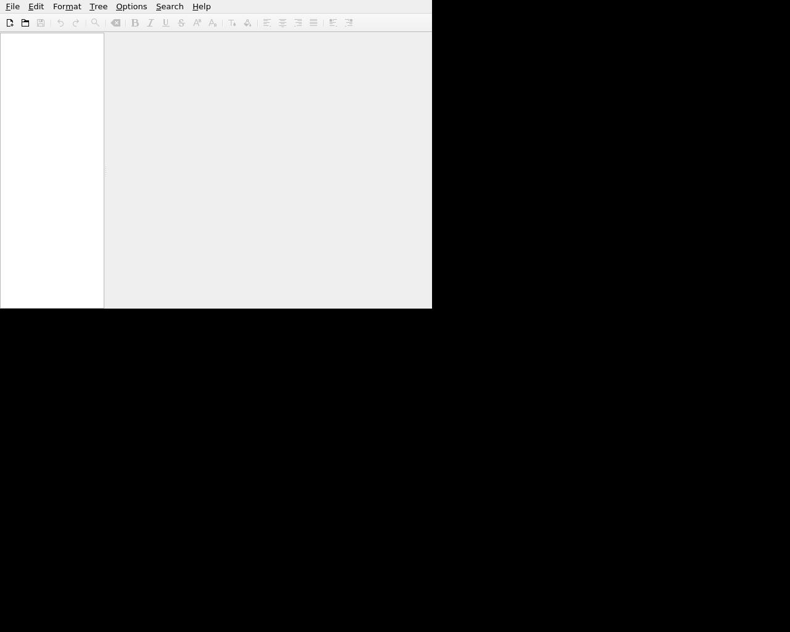 | N/A |
| [featherpad](./featherpad) | amd64  | ubuntu-noble | 1.4.1-0ubuntu4 |  | N/A |
| [feh](./feh) | amd64  | ubuntu-noble | 3.10.1-1ubuntu0.1-20250327 | 失败 | N/A |
| [felix-latin](./felix-latin) | amd64  | ubuntu-noble | 2.0-14build2 |  | N/A |
| [ferret](./ferret) | amd64  | ubuntu-noble | 0.7-3 |  | N/A |
| [ferret-vis](./ferret-vis) | amd64  | ubuntu-noble | 7.6.0-7ubuntu1 |  | N/A |
| [fet](./fet) | amd64  | ubuntu-noble | 6.8.5-1build2 |  | N/A |
| [ffado-mixer-qt4](./ffado-mixer-qt4) | amd64  | deepin-v23 | 2.4.9-1 |  | [SHA256](./ffado-mixer-qt4/SHA256SUMS) |
| [fgallery](./fgallery) | amd64  | ubuntu-noble | 1.9.1+ds-2-20250327 | 失败 | N/A |
| [fheroes2](./fheroes2) | amd64  | ubuntu-noble | 1.0.12+dfsg-1 |  | N/A |
| [file-roller](./file-roller) | amd64  | ubuntu-noble | 44.3-0ubuntu1 |  | N/A |
| [filelight](./filelight) | amd64  | ubuntu-noble | 23.08.5-0ubuntu3 |  | N/A |
| [filezilla](./filezilla) | amd64  | ubuntu-noble | 3.66.5-2build2 |  | N/A |
| [filius](./filius) | amd64  | ubuntu-noble | 2.5.1+ds-1-20250327 | 失败 | N/A |
| [filler](./filler) | amd64  | ubuntu-noble | 1.02-6.4 | 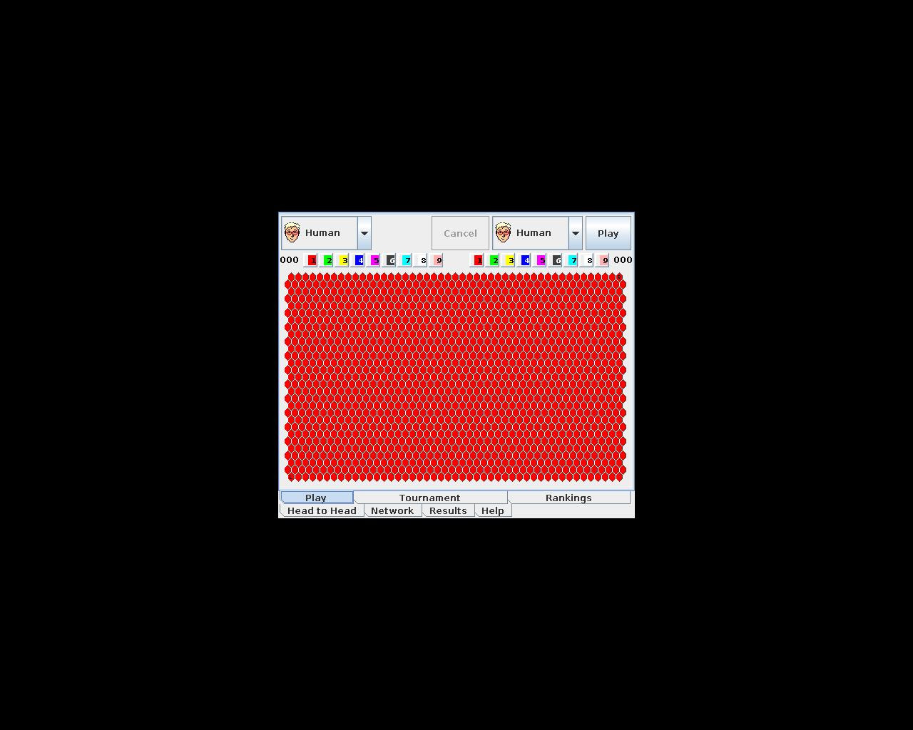 | N/A |
| [fillets-ng](./fillets-ng) | amd64  | ubuntu-noble | 1.0.1-4build2 |  | N/A |
| [firefox](./firefox) | amd64  | deepin-v23 | 131.0.3-1deepin1 |  | [SHA256](./firefox/SHA256SUMS) |
| [firefox-esr](./firefox-esr) | amd64  | deepin-v23 | 115.2.1esr-1 |  | [SHA256](./firefox-esr/SHA256SUMS) |
| [firetools](./firetools) | amd64  | ubuntu-noble | 0.9.72-1build2 |   | N/A |
| [firewall-config](./firewall-config) | amd64  | deepin-v23 | 2.1.2-1-20250327 | 失败 | N/A |
| [fish-common](./fish-common) | amd64  | deepin-v23 | 3.7.1-1 |  | N/A |
| [fityk](./fityk) | amd64  | ubuntu-noble | 1.3.2-3build3 |  | N/A |
| [five-or-more](./five-or-more) | amd64  | ubuntu-noble | 3.32.3-1build2 | 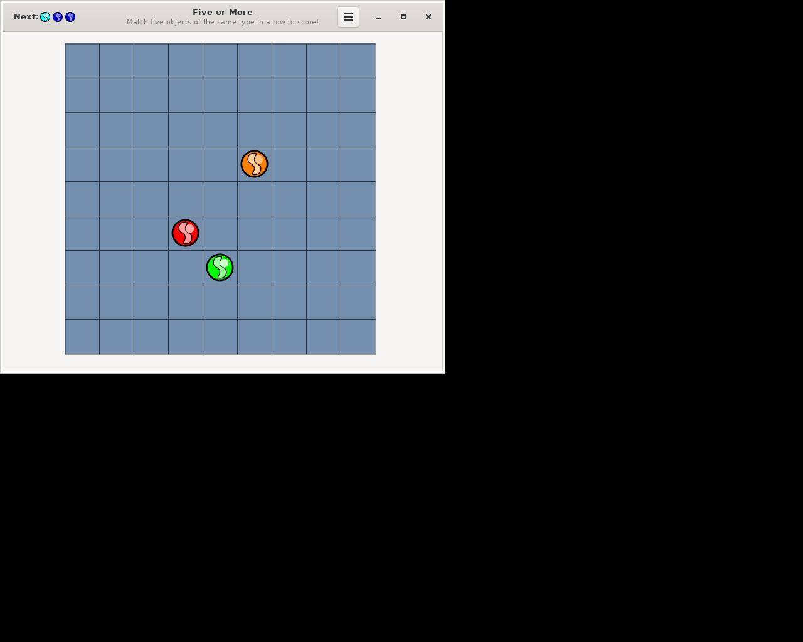 | N/A |
| [flamerobin](./flamerobin) | amd64  | ubuntu-noble | 0.9.10.ds.2-1build2 |  | N/A |
| [flameshot](./flameshot) | amd64  | deepin-v23 | 12.1.0-3 |  | [SHA256](./flameshot/SHA256SUMS) |
| [flamp](./flamp) | amd64  | ubuntu-noble | 2.2.09-1build2 | 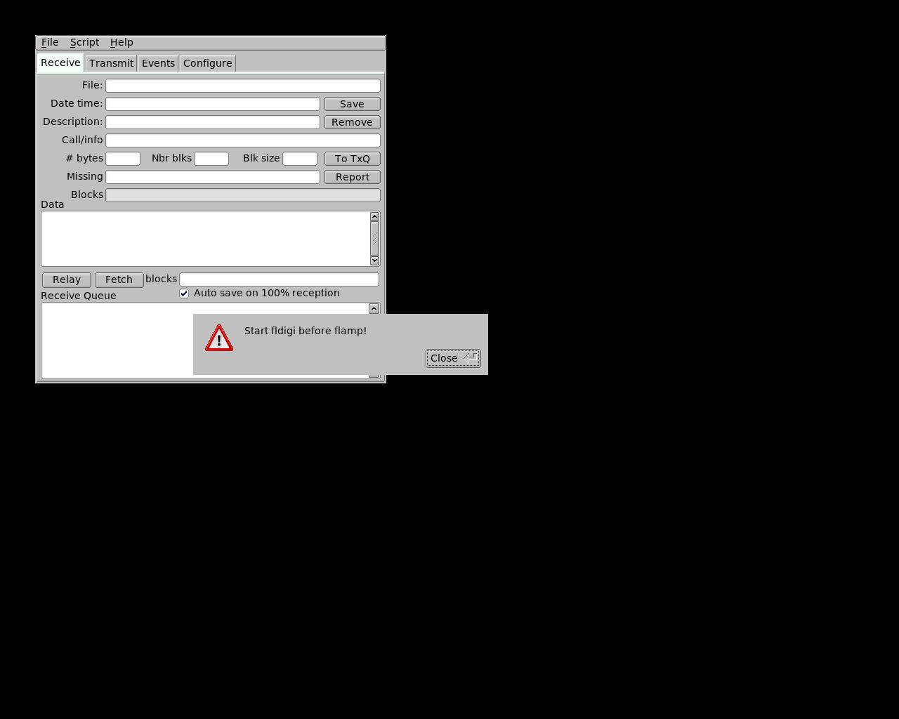 | N/A |
| [flare-engine](./flare-engine) | amd64  | ubuntu-noble | 1.14-3 |  | N/A |
| [fldiff](./fldiff) | amd64  | ubuntu-noble | 1.1+0-6build3 |  | N/A |
| [fldigi](./fldigi) | amd64  | ubuntu-noble | 4.2.03-1build3 |   | N/A |
| [flent](./flent) | amd64  | ubuntu-noble | 2.1.1-2-20250327 | 失败 | N/A |
| [flight-of-the-amazon-queen](./flight-of-the-amazon-queen) | amd64  | ubuntu-noble | 1.0.0-9 |  | N/A |
| [flightgear](./flightgear) | amd64  | ubuntu-noble | 2020.3.18+dfsg-1.1 |   | N/A |
| [flmsg](./flmsg) | amd64  | ubuntu-noble | 4.0.23-1build2 | 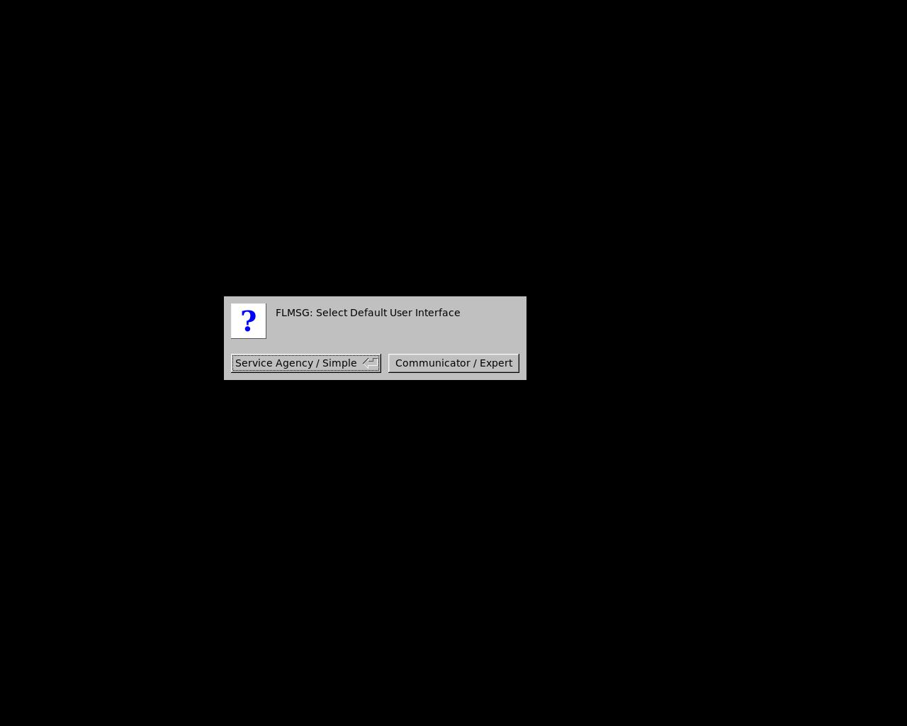 | N/A |
| [flobopuyo](./flobopuyo) | amd64  | ubuntu-noble | 0.20-5.1 |  | N/A |
| [flowblade](./flowblade) | amd64  | ubuntu-noble | 2.12.0.2-1ubuntu1-20250327 | 失败 | N/A |
| [flpsed](./flpsed) | amd64  | ubuntu-noble | 0.7.3-9build2 | 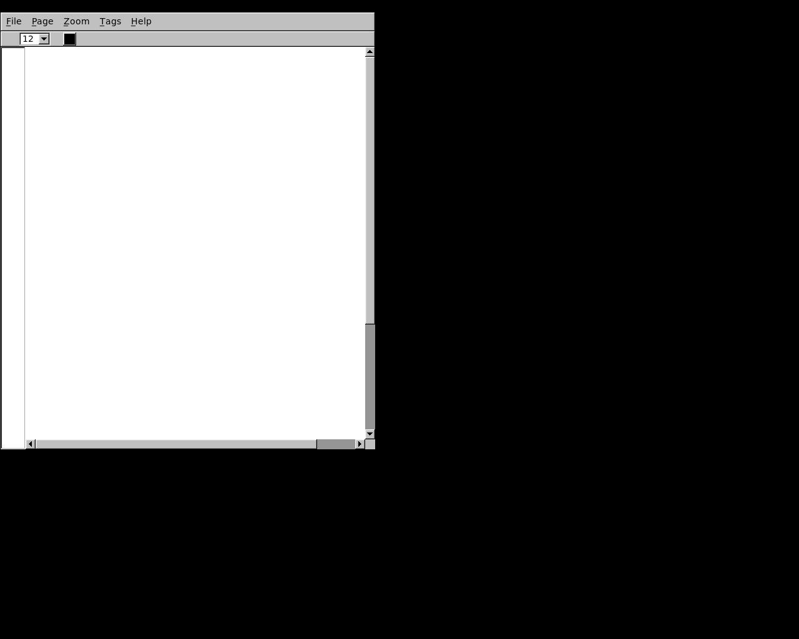 | N/A |
| [flrig](./flrig) | amd64  | ubuntu-noble | 2.0.04-1build2 |  | N/A |
| [fltk1.1-games](./fltk1.1-games) | amd64  | deepin-v23 | 1.1.10-29 |    | [SHA256](./fltk1.1-games/SHA256SUMS) |
| [fltk1.3-games](./fltk1.3-games) | amd64  | ubuntu-noble | 1.3.8-6.1build2 |  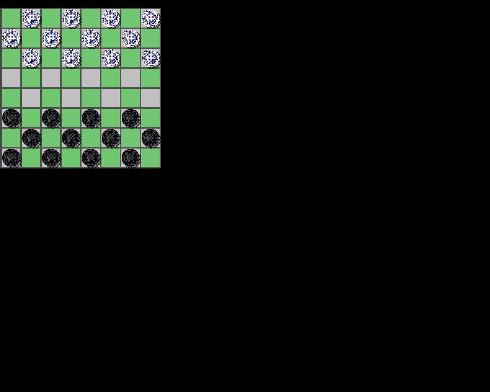  | N/A |
| [fluid](./fluid) | amd64  | ubuntu-noble | 1.3.8-6.1build2 |  | N/A |
| [fluidsynth-dssi](./fluidsynth-dssi) | amd64  | ubuntu-noble | 1.0.0-9build1-20250327 | 失败 | N/A |
| [flwrap](./flwrap) | amd64  | ubuntu-noble | 1.3.6-1build2 |  | N/A |
| [fmit](./fmit) | amd64  | ubuntu-noble | 1.2.14-0.1build4 |  | N/A |
| [fnott](./fnott) | amd64  | ubuntu-noble | 1.4.1+ds-1build3-20250327 | 失败 | N/A |
| [focuswriter](./focuswriter) | amd64  | ubuntu-noble | 1.8.6-1build2 |  | N/A |
| [foliate](./foliate) | amd64  | ubuntu-noble | 4.~really3.1.1-1-20250327 | 失败 | N/A |
| [font-downloader](./font-downloader) | amd64  | ubuntu-noble | 10.0.0-3-20250327 | 失败 | N/A |
| [font-manager](./font-manager) | amd64  | ubuntu-noble | 0.8.8-4build2 | 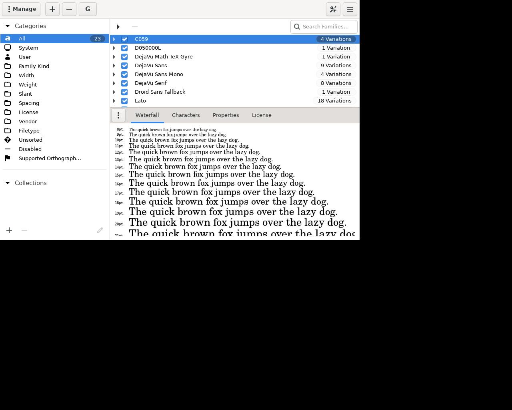 | N/A |
| [font-viewer](./font-viewer) | amd64  | ubuntu-noble | 0.8.8-4build2 |  | N/A |
| [fontforge](./fontforge) | amd64  | deepin-v23 | 20230101~dfsg-3 |  | [SHA256](./fontforge/SHA256SUMS) |
| [fontmatrix](./fontmatrix) | amd64  | ubuntu-noble | 0.9.100+ds-1build2 | 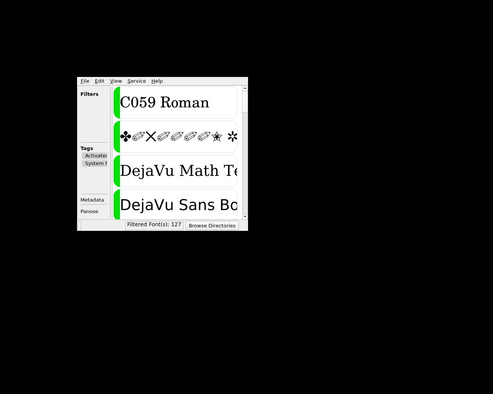 | N/A |
| [foobillardplus](./foobillardplus) | amd64  | ubuntu-noble | 3.43~svn170+dfsg-7build2 | 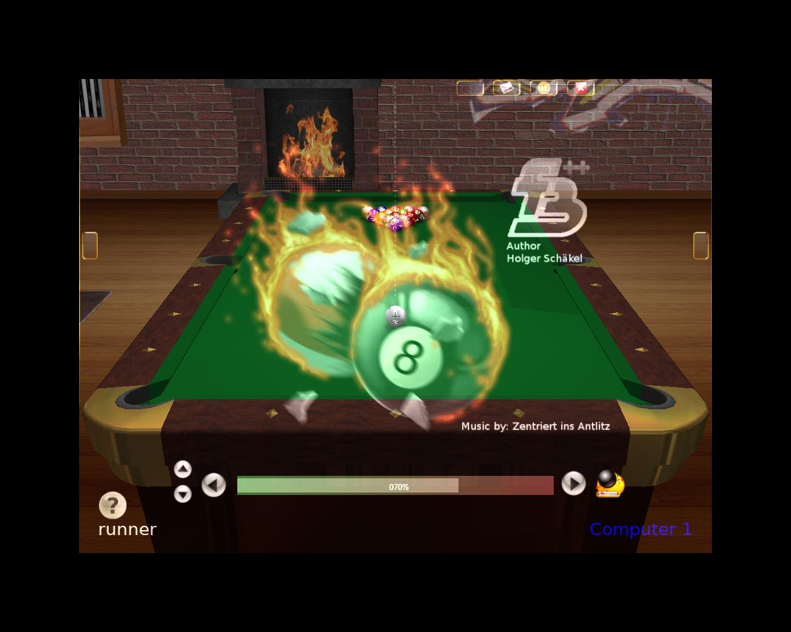 | N/A |
| [fookb](./fookb) | amd64  | ubuntu-noble | 4.1-3 |  | N/A |
| [foot](./foot) | amd64  | ubuntu-noble | 1.16.2-2ubuntu0.1-20250327 | 失败 | N/A |
| [form](./form) | amd64  | ubuntu-noble | 4.3.0+git20230104+ds-1build2-20250327 | 失败 | N/A |
| [formiko](./formiko) | amd64  | ubuntu-noble | 1.4.3-2.1-20250327 | 失败 | N/A |
| [fotoxx](./fotoxx) | amd64  | ubuntu-noble | 20.08-2build5 |  | N/A |
| [founder-sane-backend](./founder-sane-backend) | amd64  | deepin-v23 | 20200526-1.4.5.011-20250327 | 失败 | N/A |
| [four-in-a-row](./four-in-a-row) | amd64  | deepin-v23 | 3.38.1-deepin1-20250327 | 失败 | N/A |
| [foxtrotgps](./foxtrotgps) | amd64  | ubuntu-noble | 1.2.2+bzr332-1build4 |  | N/A |
| [fqterm](./fqterm) | amd64  | ubuntu-noble | 0.9.10.1-4build3 | 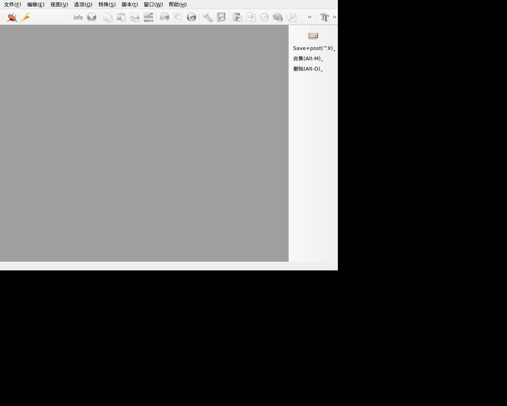 | N/A |
| [fracplanet](./fracplanet) | amd64  | ubuntu-noble | 0.5.1-6build3 |  | N/A |
| [fractalnow](./fractalnow) | amd64  | ubuntu-noble | 0.8.2-5build2 |  | N/A |
| [fractgen](./fractgen) | amd64  | ubuntu-noble | 2.1.13-1build3 | 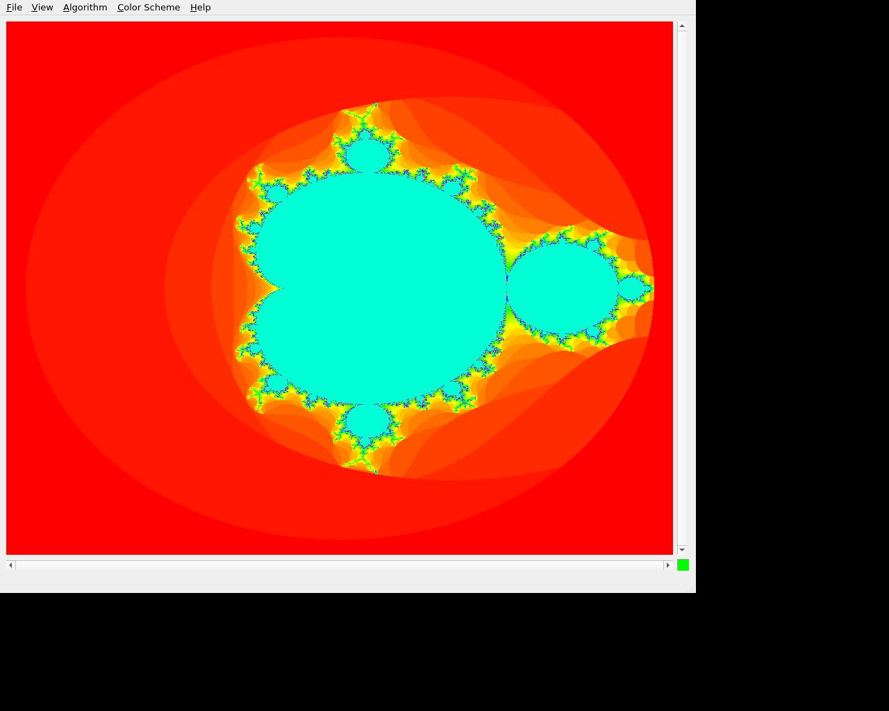 | N/A |
| [fraqtive](./fraqtive) | amd64  | ubuntu-noble | 0.4.8.1-1build3 |  | N/A |
| [free42-nologo](./free42-nologo) | amd64  | ubuntu-noble | 3.1.4+ds-1build2 |  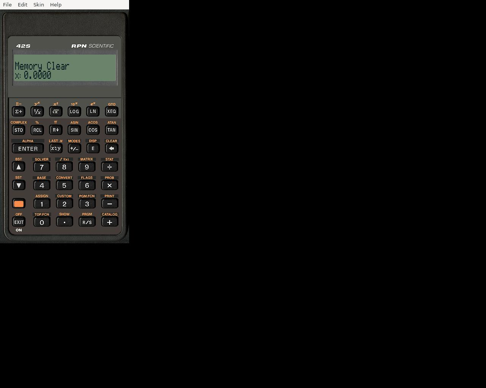 | N/A |
| [freealchemist](./freealchemist) | amd64  | ubuntu-noble | 0.5-2 |  | N/A |
| [freeciv-client-extras](./freeciv-client-extras) | amd64  | ubuntu-noble | 3.1.0+ds-1build5 |  | N/A |
| [freeciv-client-gtk3](./freeciv-client-gtk3) | amd64  | ubuntu-noble | 3.1.0+ds-1build5 |  | N/A |
| [freeciv-client-qt](./freeciv-client-qt) | amd64  | ubuntu-noble | 3.1.0+ds-1build5 |  | N/A |
| [freeciv-client-sdl](./freeciv-client-sdl) | amd64  | ubuntu-noble | 3.1.0+ds-1build5 |  | N/A |
| [freeciv-ruleset-tools](./freeciv-ruleset-tools) | amd64  | ubuntu-noble | 3.1.0+ds-1build5 |  | N/A |
| [freeciv-server](./freeciv-server) | amd64  | ubuntu-noble | 3.1.0+ds-1build5 |  | N/A |
| [freecol](./freecol) | amd64  | ubuntu-noble | 1.1.0-1-20250327 | 失败 | N/A |
| [freedink-dfarc](./freedink-dfarc) | amd64  | ubuntu-noble | 3.14-5build3 | 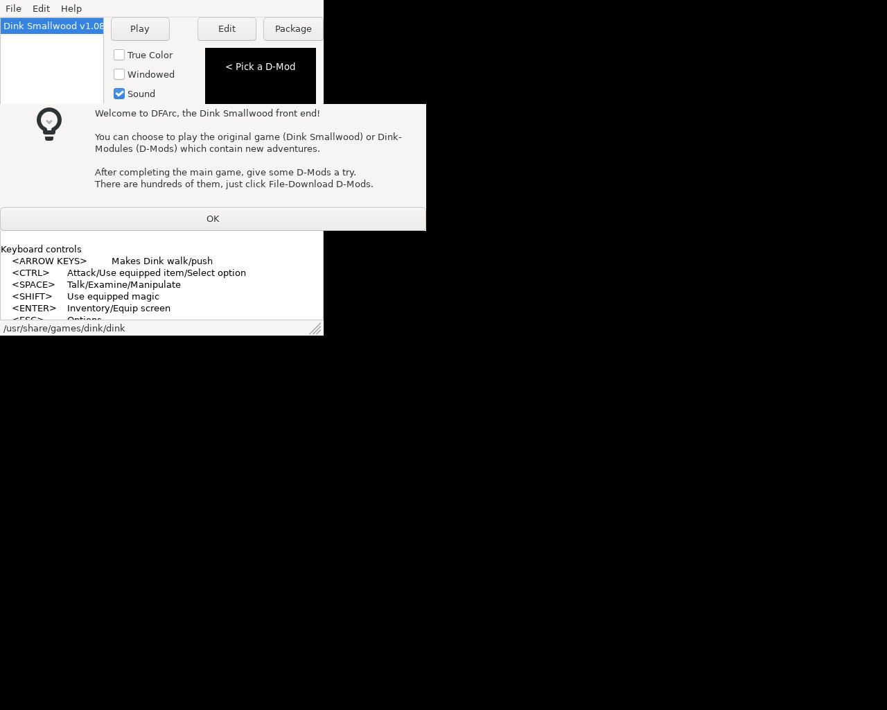 | N/A |
| [freedink-engine](./freedink-engine) | amd64  | ubuntu-noble | 109.6-5 |   | N/A |
| [freedm](./freedm) | amd64  | ubuntu-noble | 0.13.0-1 |  | N/A |
| [freedoom](./freedoom) | amd64  | ubuntu-noble | 0.13.0-1 |   | N/A |
| [freedroid](./freedroid) | amd64  | ubuntu-noble | 1.0.2+cvs040112-7 |  | N/A |
| [freedroidrpg](./freedroidrpg) | amd64  | ubuntu-noble | 1.0-1build2 |  | N/A |
| [freedv](./freedv) | amd64  | ubuntu-noble | 1.8.11-1build4 |  | N/A |
| [freefilesync](./freefilesync) | amd64  | ubuntu-noble | 13.3-2build3 |  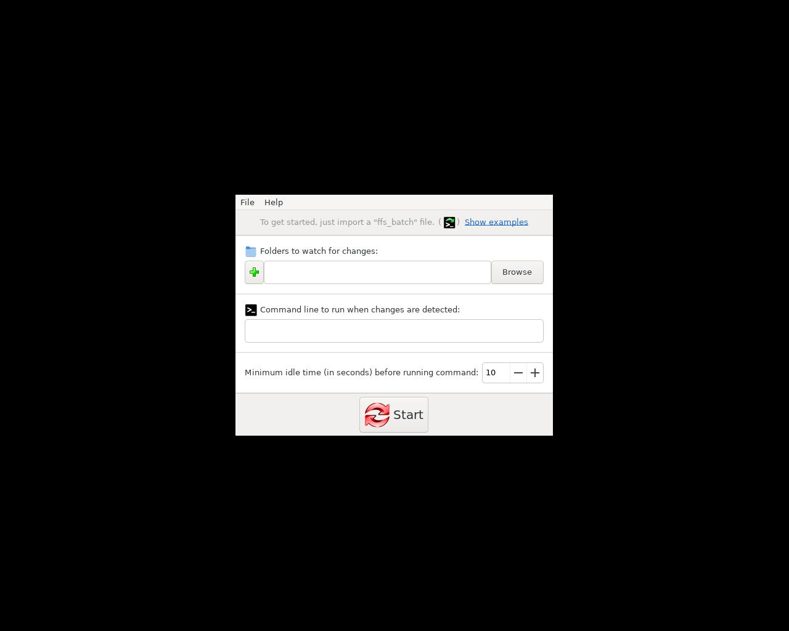 | N/A |
| [freegish](./freegish) | amd64  | ubuntu-noble | 1.53+git20170110+dfsg-2build2 |  | N/A |
| [freeorion](./freeorion) | amd64  | ubuntu-noble | 0.5+git20230820-4build5 | 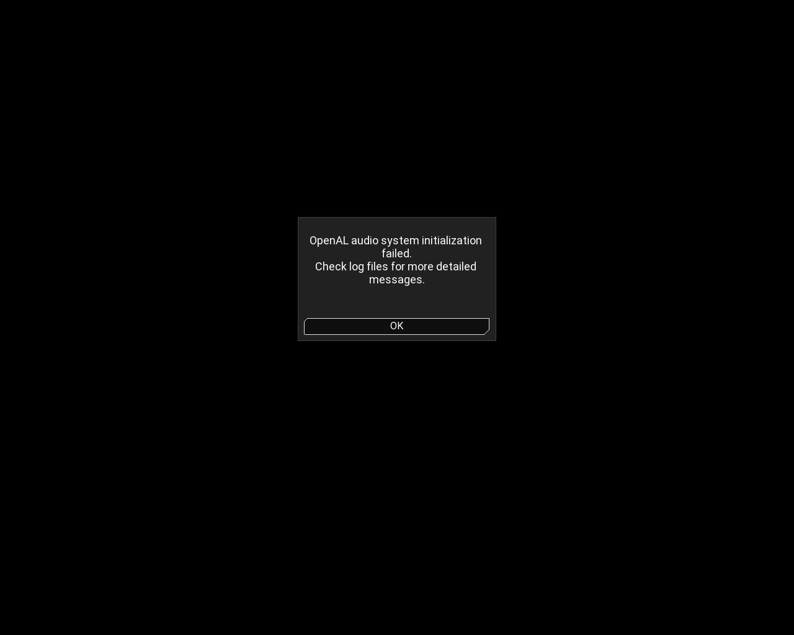 | N/A |
| [freeplane](./freeplane) | amd64  | ubuntu-noble | 1.7.10-1-20250327 | 失败 | N/A |
| [freespace2-launcher-wxlauncher](./freespace2-launcher-wxlauncher) | amd64  | ubuntu-noble | 0.12.0~rc3+dfsg-1build2 |   | N/A |
| [freesweep](./freesweep) | amd64  | ubuntu-noble | 1.0.2-1-20250327 | 失败 | N/A |
| [freetuxtv](./freetuxtv) | amd64  | ubuntu-noble | 0.6.8~dfsg1-2build3 |  | N/A |
| [freewheeling](./freewheeling) | amd64  | ubuntu-noble | 0.6.6-1build3-20250327 | 失败 | N/A |
| [frescobaldi](./frescobaldi) | amd64  | ubuntu-noble | 3.3.0+ds1-2 |  | N/A |
| [fritzing](./fritzing) | amd64  | ubuntu-noble | 1.0.1-1build4 | 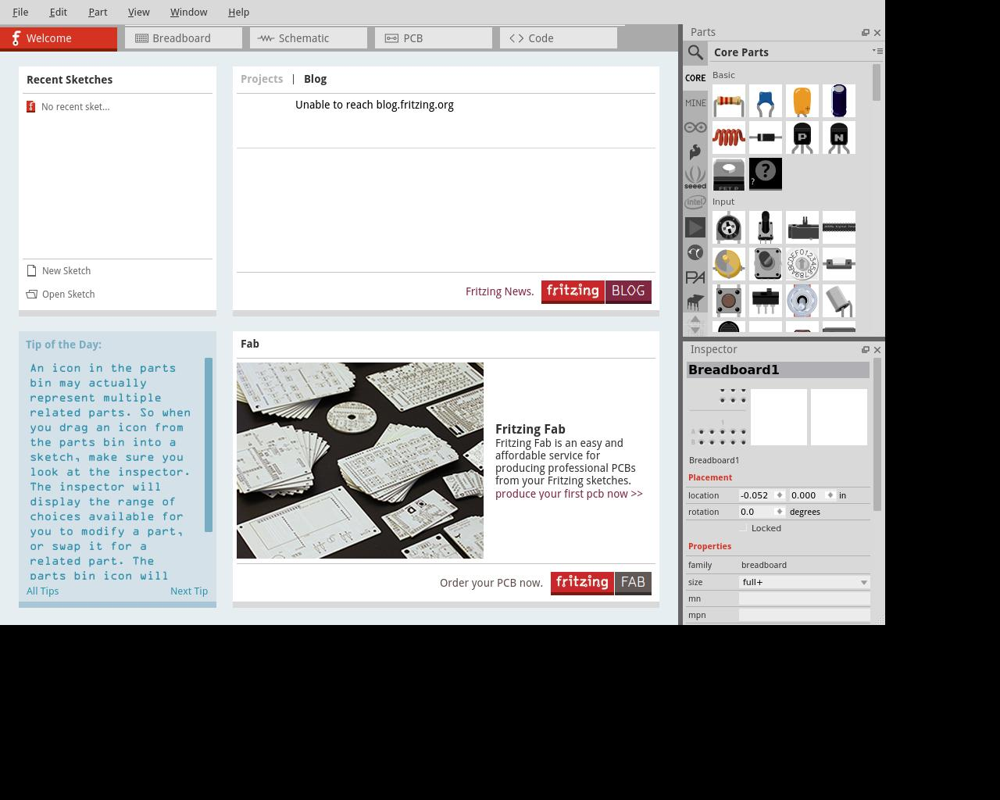 | N/A |
| [frogatto](./frogatto) | amd64  | ubuntu-noble | 1.3.1+dfsg-6build4 |  | N/A |
| [frogr](./frogr) | amd64  | ubuntu-noble | 1.8.1-1build3 |  | [SHA256](./frogr/SHA256SUMS) |
| [frozen-bubble](./frozen-bubble) | amd64  | ubuntu-noble | 2.212-12build5 |  | [SHA256](./frozen-bubble/SHA256SUMS) |
| [fs-uae](./fs-uae) | amd64  | ubuntu-noble | 3.1.66-2build2-20250327 | 失败 | [SHA256](./fs-uae/SHA256SUMS) |
| [fs-uae-arcade](./fs-uae-arcade) | amd64  | ubuntu-noble | 3.1.63-2-20250327 | 失败 | [SHA256](./fs-uae-arcade/SHA256SUMS) |
| [ft2-clone](./ft2-clone) | amd64  | ubuntu-noble | 1.72.1+ds-1build3 |  | [SHA256](./ft2-clone/SHA256SUMS) |
| [ftools-fv](./ftools-fv) | amd64  | ubuntu-noble | 5.5.2+dfsg-3-20250327 | 失败 | [SHA256](./ftools-fv/SHA256SUMS) |
| [ftp.app](./ftp.app) | amd64  | ubuntu-noble | 0.6-2build5 |  | [SHA256](./ftp.app/SHA256SUMS) |
| [funguloids](./funguloids) | amd64  | ubuntu-noble | 1.06-15build2-20250327 | 失败 | [SHA256](./funguloids/SHA256SUMS) |
| [funnyboat](./funnyboat) | amd64  | ubuntu-noble | 1.5-11-20250327 | 失败 | [SHA256](./funnyboat/SHA256SUMS) |
| [fuse-emulator-gtk](./fuse-emulator-gtk) | amd64  | ubuntu-noble | 1.6.0+dfsg1-2build3 |  | [SHA256](./fuse-emulator-gtk/SHA256SUMS) |
| [fuse-emulator-sdl](./fuse-emulator-sdl) | amd64  | ubuntu-noble | 1.6.0+dfsg1-2build3 |  | [SHA256](./fuse-emulator-sdl/SHA256SUMS) |
| [fusion-icon](./fusion-icon) | amd64  | ubuntu-noble | 0.2.4-8-20250327 | 失败 | N/A |
| [fwbuilder](./fwbuilder) | amd64  | ubuntu-noble | 5.3.7-5ubuntu0.24.04.1 |  | [SHA256](./fwbuilder/SHA256SUMS) |
| [gabedit](./gabedit) | amd64  | ubuntu-noble | 2.5.1+ds-1build3 |  | [SHA256](./gabedit/SHA256SUMS) |
| [gajim](./gajim) | amd64  | ubuntu-noble | 1.8.4-3-20250327 | 失败 | N/A |
| [galculator](./galculator) | amd64  | ubuntu-noble | 2.1.4-1.2build2 |  | [SHA256](./galculator/SHA256SUMS) |
| [galois](./galois) | amd64  | ubuntu-noble | 0.8-1build2 |  | [SHA256](./galois/SHA256SUMS) |
| [galternatives](./galternatives) | amd64  | ubuntu-noble | 1.0.9-20250327 | 失败 | N/A |
| [gamazons](./gamazons) | amd64  | ubuntu-noble | 0.83-12 |  | [SHA256](./gamazons/SHA256SUMS) |
| [gambas3-ide](./gambas3-ide) | amd64  | ubuntu-noble | 3.19.0-2ubuntu10 |  | [SHA256](./gambas3-ide/SHA256SUMS) |
| [game-data-packager-runtime](./game-data-packager-runtime) | amd64  | ubuntu-noble | 77ubuntu2-20250327 | 失败 | N/A |
| [gameconqueror](./gameconqueror) | amd64  | ubuntu-noble | 0.17-5build2-20250327 | 失败 | N/A |
| [gamgi](./gamgi) | amd64  | ubuntu-noble | 0.17.5-1build2 |  | [SHA256](./gamgi/SHA256SUMS) |
| [gamine](./gamine) | amd64  | ubuntu-noble | 1.6-1build3 |  | [SHA256](./gamine/SHA256SUMS) |
| [gammaray](./gammaray) | amd64  | deepin-v23 | 2.11.3-3-20250327 | 失败 | N/A |
| [gammastep](./gammastep) | amd64  | ubuntu-noble | 2.0.9-1build2-20250327 | 失败 | [SHA256](./gammastep/SHA256SUMS) |
| [ganyremote](./ganyremote) | amd64  | ubuntu-noble | 8.1.1-1-20250327 | 失败 | N/A |
| [garden-of-coloured-lights](./garden-of-coloured-lights) | amd64  | ubuntu-noble | 1.0.9-2build3 |  | [SHA256](./garden-of-coloured-lights/SHA256SUMS) |
| [gargoyle-free](./gargoyle-free) | amd64  | ubuntu-noble | 2023.1+dfsg-4build4 |  | [SHA256](./gargoyle-free/SHA256SUMS) |
| [garlic](./garlic) | amd64  | ubuntu-noble | 1.6-3 |  | [SHA256](./garlic/SHA256SUMS) |
| [gastman](./gastman) | amd64  | ubuntu-noble | 0.99+1.0rc1-0ubuntu12 |  | [SHA256](./gastman/SHA256SUMS) |
| [gaupol](./gaupol) | amd64  | ubuntu-noble | 1.11-2-20250327 | 失败 | N/A |
| [gausssum](./gausssum) | amd64  | ubuntu-noble | 3.0.2-2-20250327 | 失败 | [SHA256](./gausssum/SHA256SUMS) |
| [gav](./gav) | amd64  | ubuntu-noble | 0.9.0-3.2 |  | [SHA256](./gav/SHA256SUMS) |
| [gbatnav](./gbatnav) | amd64  | ubuntu-noble | 1.0.4cvs20051004-7 |   | [SHA256](./gbatnav/SHA256SUMS) |
| [gbemol](./gbemol) | amd64  | ubuntu-noble | 0.3.2-2ubuntu6 |  | [SHA256](./gbemol/SHA256SUMS) |
| [gbgoffice](./gbgoffice) | amd64  | ubuntu-noble | 1.4-12build2 |  | [SHA256](./gbgoffice/SHA256SUMS) |
| [gbonds](./gbonds) | amd64  | ubuntu-noble | 2.0.3-17build3 |  | [SHA256](./gbonds/SHA256SUMS) |
| [gbrainy](./gbrainy) | amd64  | ubuntu-noble | 2.4.6-2build1 |  | [SHA256](./gbrainy/SHA256SUMS) |
| [gbsplay](./gbsplay) | amd64  | ubuntu-noble | 0.0.96-1build3-20250327 | 失败 | [SHA256](./gbsplay/SHA256SUMS) |
| [gchempaint](./gchempaint) | amd64  | ubuntu-noble | 0.14.17-6.2build2 |  | [SHA256](./gchempaint/SHA256SUMS) |
| [gcin](./gcin) | amd64  | ubuntu-noble | 2.9.0+dfsg1-3build1 |  | [SHA256](./gcin/SHA256SUMS) |
| [gcolor3](./gcolor3) | amd64  | ubuntu-noble | 2.4.0-2build2 |  | [SHA256](./gcolor3/SHA256SUMS) |
| [gcompris-qt](./gcompris-qt) | amd64  | ubuntu-noble | 4.0-1build3 |  | [SHA256](./gcompris-qt/SHA256SUMS) |
| [gconjugue](./gconjugue) | amd64  | ubuntu-noble | 0.8.5-2build2 |  | [SHA256](./gconjugue/SHA256SUMS) |
| [gcr](./gcr) | amd64  | ubuntu-noble | 3.41.2-1build3-20250327 | 失败 | [SHA256](./gcr/SHA256SUMS) |
| [gcrystal](./gcrystal) | amd64  | ubuntu-noble | 0.14.17-6.2build2 |  | [SHA256](./gcrystal/SHA256SUMS) |
| [gddccontrol](./gddccontrol) | amd64  | deepin-v23 | 1.0.3-1deepin1 | 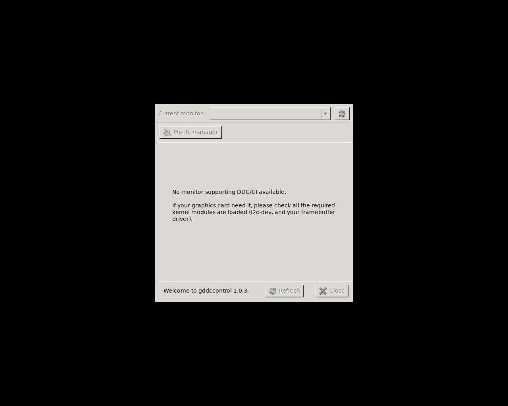 | [SHA256](./gddccontrol/SHA256SUMS) |
| [gdebi](./gdebi) | amd64  | deepin-v23 | 0.9.5.7+nmu7-20250327 | 失败 | N/A |
| [gdigi](./gdigi) | amd64  | ubuntu-noble | 0.4.0+git20200615+1c2c89f-3build3-20250327 | 失败 | [SHA256](./gdigi/SHA256SUMS) |
| [gdis](./gdis) | amd64  | ubuntu-noble | 0.90-6build3 |  | [SHA256](./gdis/SHA256SUMS) |
| [gdm-settings](./gdm-settings) | amd64  | ubuntu-noble | 4.3-1-20250327 | 失败 | N/A |
| [gdm3](./gdm3) | amd64  | ubuntu-noble | 46.2-1ubuntu1~24.04.1-20250327 | 失败 | N/A |
| [gdmap](./gdmap) | amd64  | ubuntu-noble | 1.2.0-1build2 |  | [SHA256](./gdmap/SHA256SUMS) |
| [gdpc](./gdpc) | amd64  | ubuntu-noble | 2.2.5-16build2 | 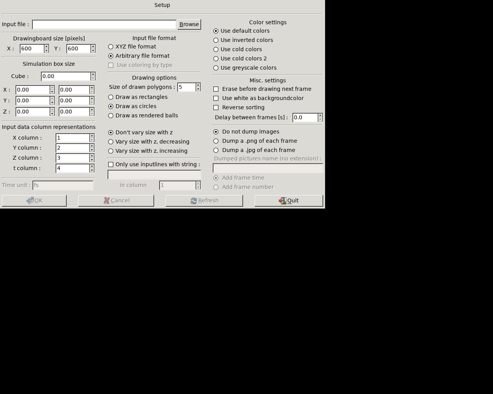 | [SHA256](./gdpc/SHA256SUMS) |
| [geany](./geany) | amd64  | ubuntu-noble | 2.0-1build2 |  | [SHA256](./geany/SHA256SUMS) |
| [gearhead-sdl](./gearhead-sdl) | amd64  | ubuntu-noble | 1.310-3-20250327 | 失败 | [SHA256](./gearhead-sdl/SHA256SUMS) |
| [gearhead2](./gearhead2) | amd64  | ubuntu-noble | 0.701-2 |  | [SHA256](./gearhead2/SHA256SUMS) |
| [gearhead2-sdl](./gearhead2-sdl) | amd64  | ubuntu-noble | 0.701-2-20250327 | 失败 | [SHA256](./gearhead2-sdl/SHA256SUMS) |
| [geary](./geary) | amd64  | ubuntu-noble | 44.1-2build2-20250327 | 失败 | [SHA256](./geary/SHA256SUMS) |
| [gedit](./gedit) | amd64  | ubuntu-noble | 46.2-2-20250327 | 失败 | N/A |
| [geoclue-2-demo](./geoclue-2-demo) | amd64  | deepin-v23 | 2.7.1-2-07be3ef | 失败 | N/A |
| [geoclue-2.0](./geoclue-2.0) | amd64  | deepin-v23 | 2.7.1-2-07be3ef | 失败 | N/A |
| [gftp-gtk](./gftp-gtk) | amd64  | ubuntu-noble | 2.8.0~beta-1 |  | [SHA256](./gftp-gtk/SHA256SUMS) |
| [ghex](./ghex) | amd64  | ubuntu-noble | 3.41.0-1 | 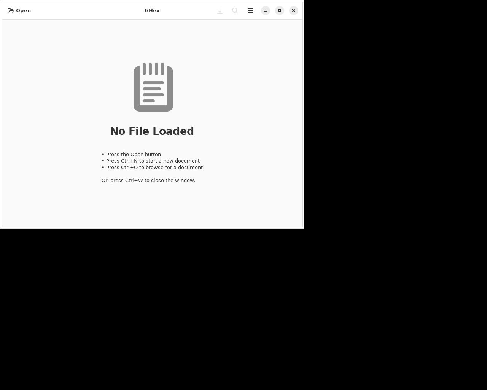 | [SHA256](./ghex/SHA256SUMS) |
| [gimp](./gimp) | amd64  | deepin-v23 | 2.10.38-1deepin2-07be3ef | 失败 | N/A |
| [gkbd-capplet](./gkbd-capplet) | amd64  | ubuntu-noble | 3.28.1-1-07be3ef | 失败 | N/A |
| [glade](./glade) | amd64  | ubuntu-noble | 3.40.0-3deepin1+rb1 |  | [SHA256](./glade/SHA256SUMS) |
| [gnugo](./gnugo) | amd64  | ubuntu-noble | 3.8-11 |  | [SHA256](./gnugo/SHA256SUMS) |
| [goldendict](./goldendict) | amd64  | ubuntu-noble | 1.5.0-1-07be3ef | 失败 | N/A |
| [gpac](./gpac) | amd64  | ubuntu-noble | 2.2.1+dfsg1-3 |  | [SHA256](./gpac/SHA256SUMS) |
| [gparted](./gparted) | amd64  | deepin-v23 | 1.5.0-1deepin0-07be3ef | 失败 | N/A |
| [gpicview](./gpicview) | amd64  | deepin-v23 | 0.2.5-deepin1-07be3ef | 失败 | N/A |
| [gprename](./gprename) | amd64  | deepin-v23 | 20210415-1 | 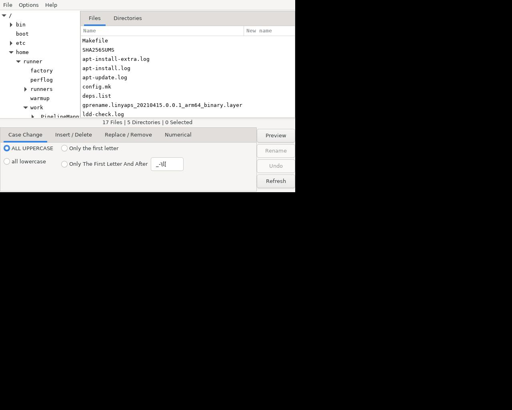 | [SHA256](./gprename/SHA256SUMS) |
| [gprompter](./gprompter) | amd64  | deepin-v23 | 0.9.1-2.2-deepin1+rb1 |  | [SHA256](./gprompter/SHA256SUMS) |
| [gpsd-clients](./gpsd-clients) | amd64  | ubuntu-noble | 3.25-2deepin3-07be3ef | 失败 | N/A |
| [gpy](./gpy) | amd64  | deepin-v23 | 1.0.2.20210607-07be3ef | 失败 | N/A |
| [granatier](./granatier) | amd64  | ubuntu-noble | 21.08.0-1-07be3ef | 失败 | N/A |
| [grandprinter-mfp](./grandprinter-mfp) | amd64  | deepin-v23 | 1.0.0-22041-07be3ef | 失败 | N/A |
| [granite-demo](./granite-demo) | amd64  | ubuntu-noble | 6.1.2-1-07be3ef | 失败 | N/A |
| [groovy](./groovy) | amd64  | ubuntu-noble | 2.4.21-1-07be3ef | 失败 | N/A |
| [grsync](./grsync) | amd64  | ubuntu-noble | 1.3.0-1 |  | [SHA256](./grsync/SHA256SUMS) |
| [grub-customizer](./grub-customizer) | amd64  | deepin-v23 | 5.2.3-1deepin0-07be3ef | 失败 | N/A |
| [gtk-3-examples](./gtk-3-examples) | amd64  | ubuntu-noble | 3.24.41-1deepin3-07be3ef | 失败 | N/A |
| [gtk-4-examples](./gtk-4-examples) | amd64  | ubuntu-noble | 4.12.3+ds-1deepin1 |  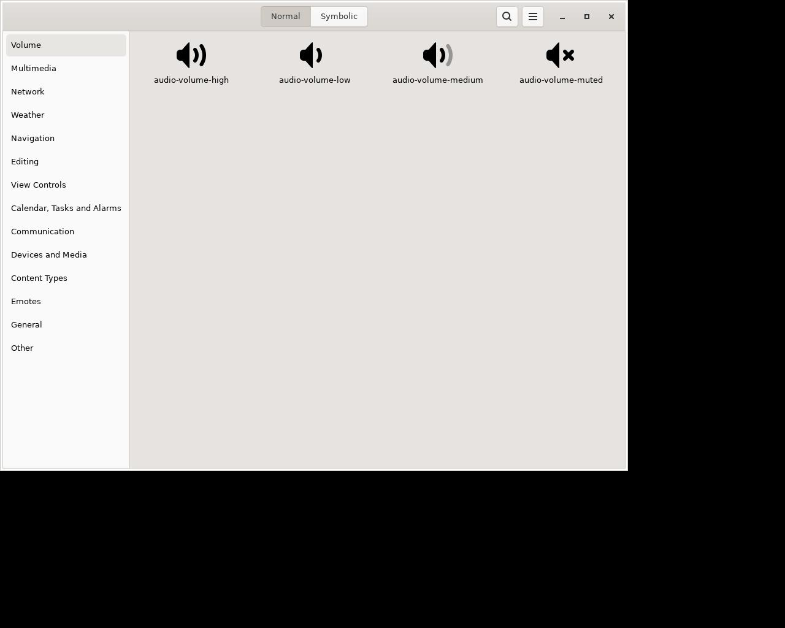    | N/A |
| [gtk-vector-screenshot](./gtk-vector-screenshot) | amd64  | ubuntu-noble | 0.3.3-1 |  | N/A |
| [gucharmap](./gucharmap) | amd64  | deepin-v23 | 15.1.5-1 |  | N/A |
| [gufw](./gufw) | amd64  | ubuntu-noble | 20.04.1-2-07be3ef | 失败 | N/A |
| [guvcview](./guvcview) | amd64  | ubuntu-noble | 2.0.8-1+rb2 |  | N/A |
| [gwaei](./gwaei) | amd64  | ubuntu-noble | 3.6.2-9-07be3ef | 失败 | N/A |
| [hexchat](./hexchat) | amd64  | ubuntu-noble | 2.16.1-1 |  | N/A |
| [hoteldruid](./hoteldruid) | amd64  | ubuntu-noble | 3.0.3-1-07be3ef | 失败 | N/A |
| [hotspot](./hotspot) | amd64  | ubuntu-noble | 1.3.0-2-07be3ef | 失败 | N/A |
| [hplip-gui](./hplip-gui) | amd64  | ubuntu-noble | 3.22.10+dfsg0-5deepin2-07be3ef | 失败 | N/A |
| [hsqldb-utils](./hsqldb-utils) | amd64  | ubuntu-noble | 2.6.1-1-07be3ef | 失败 | N/A |
| [htmldoc](./htmldoc) | amd64  | ubuntu-noble | 1.9.13-1 |  | N/A |
| [htop](./htop) | amd64  | ubuntu-noble | 3.2.2-2-07be3ef | 失败 | N/A |
| [huawei-pixlab-series](./huawei-pixlab-series) | amd64  | deepin-v23 | 1.0-71 |  | N/A |
| [hwloc](./hwloc) | amd64  | deepin-v23 | 2.11.0-2 | 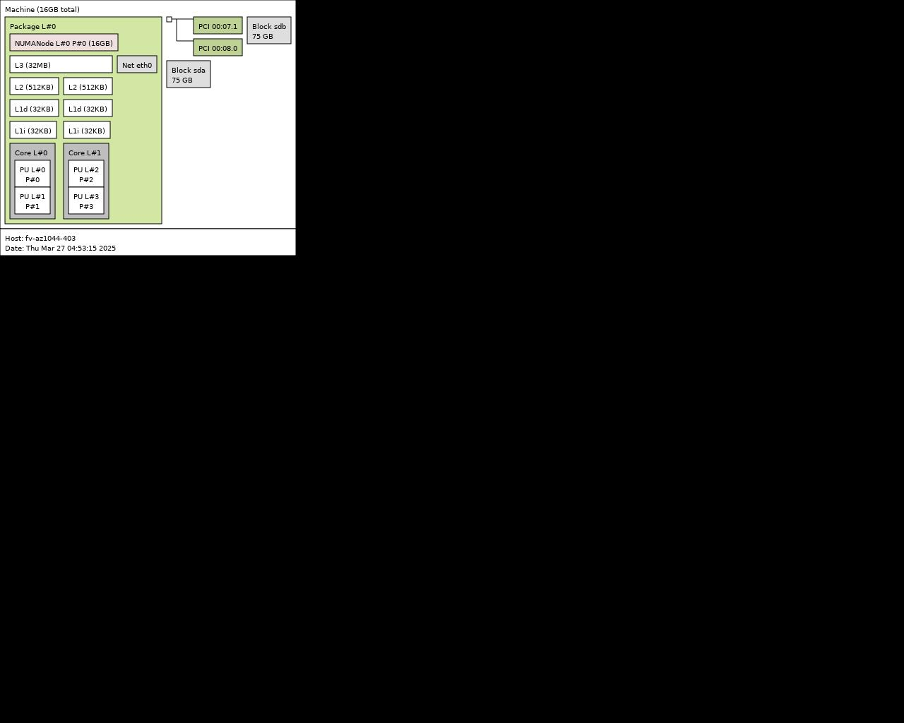 | N/A |
| [iagno](./iagno) | amd64  | ubuntu-noble | 3.38.1-2 |  | N/A |
| [ibus](./ibus) | amd64  | ubuntu-noble | 1.5.29~rc1-1 |  | N/A |
| [ibus-cangjie](./ibus-cangjie) | amd64  | deepin-v23 | 2.4-7 |   | N/A |
| [ibus-chewing](./ibus-chewing) | amd64  | ubuntu-noble | 1.6.1-2-07be3ef | 失败 | N/A |
| [ibus-pinyin](./ibus-pinyin) | amd64  | ubuntu-noble | 1.5.0-11-af50a04 | 失败 | [SHA256](./ibus-pinyin/SHA256SUMS) |
| [ibus-table](./ibus-table) | amd64  | ubuntu-noble | 1.14.1-1-af50a04 | 失败 | [SHA256](./ibus-table/SHA256SUMS) |
| [idle-python2.7](./idle-python2.7) | amd64  | deepin-v23 | 2.7.18.1-1+deepin-af50a04 | 失败 | N/A |
| [im-config](./im-config) | amd64  | deepin-v23 | 0.57-2deepin2-af50a04 | 失败 | [SHA256](./im-config/SHA256SUMS) |
| [info](./info) | amd64  | ubuntu-noble | 7.1-2deepin1-af50a04 | 失败 | [SHA256](./info/SHA256SUMS) |
| [isag](./isag) | amd64  | deepin-v23 | 12.7.5-2-af50a04 | 失败 | N/A |
| [juk](./juk) | amd64  | ubuntu-noble | 21.08.0-1deepin0-af50a04 | 失败 | N/A |
| [kalgebra](./kalgebra) | amd64  | ubuntu-noble | 21.08.0-1-af50a04 | 失败 | N/A |
| [kapman](./kapman) | amd64  | ubuntu-noble | 21.08.0-1-af50a04 | 失败 | N/A |
| [katomic](./katomic) | amd64  | ubuntu-noble | 21.08.0-1-af50a04 | 失败 | N/A |
| [kblackbox](./kblackbox) | amd64  | ubuntu-noble | 21.08.0-1-af50a04 | 失败 | N/A |
| [kblocks](./kblocks) | amd64  | ubuntu-noble | 21.08.0-1-af50a04 | 失败 | N/A |
| [kbounce](./kbounce) | amd64  | ubuntu-noble | 21.08.0-1-af50a04 | 失败 | N/A |
| [kbreakout](./kbreakout) | amd64  | ubuntu-noble | 21.08.0-1-af50a04 | 失败 | N/A |
| [kded5](./kded5) | amd64  | ubuntu-noble | 5.103.0-1-af50a04 | 失败 | [SHA256](./kded5/SHA256SUMS) |
| [kdiamond](./kdiamond) | amd64  | ubuntu-noble | 21.08.0-1-af50a04 | 失败 | N/A |
| [keditbookmarks](./keditbookmarks) | amd64  | ubuntu-noble | 21.08.0-1-af50a04 | 失败 | [SHA256](./keditbookmarks/SHA256SUMS) |
| [kernelshark](./kernelshark) | amd64  | deepin-v23 | 2.9.3+really2.3.1-2-af50a04 | 失败 | N/A |
| [kgoldrunner](./kgoldrunner) | amd64  | ubuntu-noble | 21.08.0-1-af50a04 | 失败 | N/A |
| [kgpg](./kgpg) | amd64  | ubuntu-noble | 21.08.0-deepin1-af50a04 | 失败 | N/A |
| [kigo](./kigo) | amd64  | ubuntu-noble | 21.08.0-1-af50a04 | 失败 | N/A |
| [kimagemapeditor](./kimagemapeditor) | amd64  | ubuntu-noble | 21.08.0-1deepin0-af50a04 | 失败 | N/A |
| [kio](./kio) | amd64  | ubuntu-noble | 5.103.0-1deepin0-af50a04 | 失败 | [SHA256](./kio/SHA256SUMS) |
| [kiriki](./kiriki) | amd64  | ubuntu-noble | 21.08.0-1-af50a04 | 失败 | N/A |
| [kjumpingcube](./kjumpingcube) | amd64  | ubuntu-noble | 21.08.0-1-af50a04 | 失败 | N/A |
| [kleopatra](./kleopatra) | amd64  | ubuntu-noble | 21.08.1-2deepin0-af50a04 | 失败 | N/A |
| [klickety](./klickety) | amd64  | ubuntu-noble | 21.08.0-1-af50a04 | 失败 | N/A |
| [klines](./klines) | amd64  | ubuntu-noble | 21.08.0-1-af50a04 | 失败 | N/A |
| [kmahjongg](./kmahjongg) | amd64  | ubuntu-noble | 21.08.3-1-af50a04 | 失败 | N/A |
| [kmines](./kmines) | amd64  | ubuntu-noble | 21.08.0-1-af50a04 | 失败 | N/A |
| [kmousetool](./kmousetool) | amd64  | ubuntu-noble | 21.08.0-1deepin0-af50a04 | 失败 | N/A |
| [knavalbattle](./knavalbattle) | amd64  | ubuntu-noble | 21.08.0-1-af50a04 | 失败 | N/A |
| [kollision](./kollision) | amd64  | ubuntu-noble | 21.08.0-1-af50a04 | 失败 | N/A |
| [kolourpaint](./kolourpaint) | amd64  | ubuntu-noble | 21.08.2-1-af50a04 | 失败 | N/A |
| [konquest](./konquest) | amd64  | ubuntu-noble | 21.08.0-1-af50a04 | 失败 | N/A |
| [kpat](./kpat) | amd64  | ubuntu-noble | 21.08.0-1-af50a04 | 失败 | N/A |
| [kshisen](./kshisen) | amd64  | ubuntu-noble | 21.08.0-1-af50a04 | 失败 | N/A |
| [ksnakeduel](./ksnakeduel) | amd64  | ubuntu-noble | 21.08.0-1-af50a04 | 失败 | N/A |
| [kspaceduel](./kspaceduel) | amd64  | ubuntu-noble | 21.08.0-1-af50a04 | 失败 | N/A |
| [ksquares](./ksquares) | amd64  | ubuntu-noble | 21.08.0-1-af50a04 | 失败 | N/A |
| [ktservice-driver-kaer](./ktservice-driver-kaer) | amd64  | deepin-v23 | 1.0.28-af50a04 | 失败 | N/A |
| [kyodialog](./kyodialog) | amd64  | deepin-v23 | 9.4-0-af50a04 | 失败 | [SHA256](./kyodialog/SHA256SUMS) |
| [lanxum-ga2820dn](./lanxum-ga2820dn) | amd64  | deepin-v23 | 1.0-af50a04 | 失败 | [SHA256](./lanxum-ga2820dn/SHA256SUMS) |
| [lanxum-sane-backend](./lanxum-sane-backend) | amd64  | deepin-v23 | 20200707-2.6.8.020-af50a04 | 失败 | N/A |
| [lanxum-touchscreen](./lanxum-touchscreen) | amd64  | deepin-v23 | 1.0.2-2020.05.27-af50a04 | 失败 | N/A |
| [lenovo-image-g-series](./lenovo-image-g-series) | amd64  | deepin-v23 | 1.0-17-af50a04 | 失败 | N/A |
| [lenovo-image-lj23-series](./lenovo-image-lj23-series) | amd64  | deepin-v23 | 1.0-16deepin0-af50a04 | 失败 | N/A |
| [lenovo-printer-driver](./lenovo-printer-driver) | amd64  | deepin-v23 | 1.51-230329-af50a04 | 失败 | N/A |
| [lenovo-sane-backend](./lenovo-sane-backend) | amd64  | deepin-v23 | 0.1.0-21166-af50a04 | 失败 | N/A |
| [lenovo-spx251-321-series](./lenovo-spx251-321-series) | amd64  | deepin-v23 | 1.5.7-2-af50a04 | 失败 | N/A |
| [lftp](./lftp) | amd64  | ubuntu-noble | 4.9.2-1-af50a04 | 失败 | N/A |
| [libadwaita-1-examples](./libadwaita-1-examples) | amd64  | ubuntu-noble | 1.5.0-1deepin1+rb1-af50a04 | 失败 | [SHA256](./libadwaita-1-examples/SHA256SUMS) |
| [libglib2.0-tests](./libglib2.0-tests) | amd64  | deepin-v23 | 2.80.1-1deepin1-af50a04 | 失败 | [SHA256](./libglib2.0-tests/SHA256SUMS) |
| [libkf5guiaddons-bin](./libkf5guiaddons-bin) | amd64  | deepin-v23 | 5.103.0-1-af50a04 | 失败 | [SHA256](./libkf5guiaddons-bin/SHA256SUMS) |
| [libkf5newstuff-data](./libkf5newstuff-data) | amd64  | ubuntu-noble | 5.103.0-1-af50a04 | 失败 | [SHA256](./libkf5newstuff-data/SHA256SUMS) |
| [libkf5wallet-bin](./libkf5wallet-bin) | amd64  | ubuntu-noble | 5.103.0-1deepin0-af50a04 | 失败 | [SHA256](./libkf5wallet-bin/SHA256SUMS) |
| [libreoffice-base](./libreoffice-base) | amd64  | ubuntu-noble | 24.2.0-1deepin2-af50a04 | 失败 | N/A |
| [libreoffice-calc](./libreoffice-calc) | amd64  | ubuntu-noble | 24.2.0-1deepin2-af50a04 | 失败 | N/A |
| [libreoffice-common](./libreoffice-common) | amd64  | ubuntu-noble | 24.2.0-1deepin2-af50a04 | 失败 | N/A |
| [libreoffice-draw](./libreoffice-draw) | amd64  | ubuntu-noble | 24.2.0-1deepin2-af50a04 | 失败 | N/A |
| [libreoffice-math](./libreoffice-math) | amd64  | ubuntu-noble | 24.2.0-1deepin2-af50a04 | 失败 | N/A |
| [libreoffice-writer](./libreoffice-writer) | amd64  | ubuntu-noble | 24.2.0-1deepin2-af50a04 | 失败 | N/A |
| [libts-bin](./libts-bin) | amd64  | ubuntu-noble | 1.22-1+rb3-af50a04 | 失败 | [SHA256](./libts-bin/SHA256SUMS) |
| [linglong-installer](./linglong-installer) | amd64  | deepin-v23 | 1.6.3-1-af50a04 | 失败 | [SHA256](./linglong-installer/SHA256SUMS) |
| [links2](./links2) | amd64  | ubuntu-noble | 2.25.1-1+dde-af50a04 | 失败 | N/A |
| [love](./love) | amd64  | ubuntu-noble | 11.4-1-af50a04 | 失败 | [SHA256](./love/SHA256SUMS) |
| [lshw-gtk](./lshw-gtk) | amd64  | deepin-v23 | 02.19.git.2021.06.19.996aaad9c7-2deepin0-af50a04 | 失败 | [SHA256](./lshw-gtk/SHA256SUMS) |
| [lskat](./lskat) | amd64  | ubuntu-noble | 21.08.0-1-af50a04 | 失败 | N/A |
| [lxpanel](./lxpanel) | amd64  | ubuntu-noble | 0.10.1-2-af50a04 | 失败 | [SHA256](./lxpanel/SHA256SUMS) |
| [lxqt-about](./lxqt-about) | amd64  | ubuntu-noble | 0.16.0-1-af50a04 | 失败 | N/A |
| [lxqt-config](./lxqt-config) | amd64  | ubuntu-noble | 0.16.1-1deepin0-af50a04 | 失败 | N/A |
| [lxqt-globalkeys](./lxqt-globalkeys) | amd64  | ubuntu-noble | 0.16.0-1-af50a04 | 失败 | N/A |
| [lxqt-notificationd](./lxqt-notificationd) | amd64  | ubuntu-noble | 0.16.0-1-af50a04 | 失败 | N/A |
| [lxqt-powermanagement](./lxqt-powermanagement) | amd64  | ubuntu-noble | 0.16.0-1-af50a04 | 失败 | N/A |
| [lxqt-session](./lxqt-session) | amd64  | ubuntu-noble | 0.16.0-1-af50a04 | 失败 | N/A |
| [lxsession-default-apps](./lxsession-default-apps) | amd64  | deepin-v23 | 0.5.5-deepin1-af50a04 | 失败 | N/A |
| [lyx](./lyx) | amd64  | ubuntu-noble | 2.3.6.1-deepin1+rb4-af50a04 | 失败 | N/A |
| [malcontent-gui](./malcontent-gui) | amd64  | deepin-v23 | 0.11.1-3deepin1-af50a04 | 失败 | N/A |
| [marble](./marble) | amd64  | ubuntu-noble | 21.08.3-1deepin0-af50a04 | 失败 | N/A |
| [marble-data](./marble-data) | amd64  | ubuntu-noble | 21.08.3-1deepin0-af50a04 | 失败 | [SHA256](./marble-data/SHA256SUMS) |
| [marble-maps](./marble-maps) | amd64  | ubuntu-noble | 21.08.3-1deepin0-af50a04 | 失败 | N/A |
| [marble-qt](./marble-qt) | amd64  | ubuntu-noble | 21.08.3-1deepin0-af50a04 | 失败 | N/A |
| [marco](./marco) | amd64  | ubuntu-noble | 1.24.1-3-af50a04 | 失败 | [SHA256](./marco/SHA256SUMS) |
| [mate-control-center](./mate-control-center) | amd64  | ubuntu-noble | 1.24.1-deepin1-af50a04 | 失败 | N/A |
| [mate-session-manager](./mate-session-manager) | amd64  | ubuntu-noble | 1.24.1-2-af50a04 | 失败 | N/A |
| [mc](./mc) | amd64  | deepin-v23 | 4.8.31-1-af50a04 | 失败 | N/A |
| [obs-studio](./obs-studio) | amd64  | obs-studio | 31.0.2 |  | [SHA256](./obs-studio/SHA256SUMS) |
