# arm64 - 构建统计
| 索引数  | 构建数 | 成功数 | 失败数  | 成功率  | 完成度  |
|--------|--------|-------|---------| -------|-----|
|3099|2028|1219 |809 | 60.11%| 39.34%|
## 仓库统计
| 仓库  | 索引数 |构建数| 成功数 | 失败数  | 成功率  | 完成度  |
|--------|------|-----|-------|---------| -------|-----|
|ubuntu-noble|2759|1747|1116 |631 | 63.88%| 40.45%|
|deepin-v23|340|281|103 |178 | 36.65%| 30.29%|
## 详细结果
| 包名  | 架构 |仓库| 版本 | 测试结果 | SHA256 |killer版本|
|-------|-----|----|------|---------|--------|---------|
| [0install](./0install) | arm64  | ubuntu-noble | 2.18-2ubuntu2 | 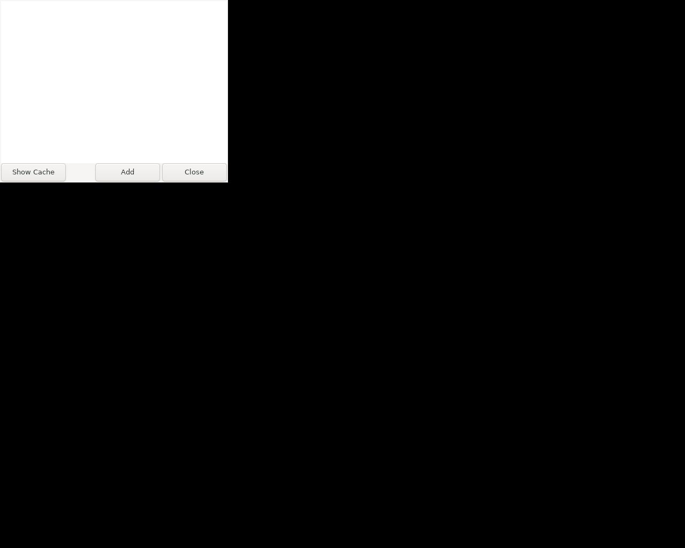 | N/A | N/A |
| [2048](./2048) | arm64  | ubuntu-noble | 0.20221023.1237-1 | 失败 | [SHA256](./2048/SHA256SUMS) | N/A |
| [2048-qt](./2048-qt) | arm64  | ubuntu-noble | 0.1.6-2build4 |  | [SHA256](./2048-qt/SHA256SUMS) | N/A |
| [3dchess](./3dchess) | arm64  | ubuntu-noble | 0.8.1-21ubuntu1 |  | [SHA256](./3dchess/SHA256SUMS) | N/A |
| [3depict](./3depict) | arm64  | ubuntu-noble | 0.0.23-2build3 |  | [SHA256](./3depict/SHA256SUMS) | N/A |
| [4pane](./4pane) | arm64  | ubuntu-noble | 8.0-1build4 |  | [SHA256](./4pane/SHA256SUMS) | N/A |
| [7kaa](./7kaa) | arm64  | ubuntu-noble | 2.15.6+ds-1build2 | 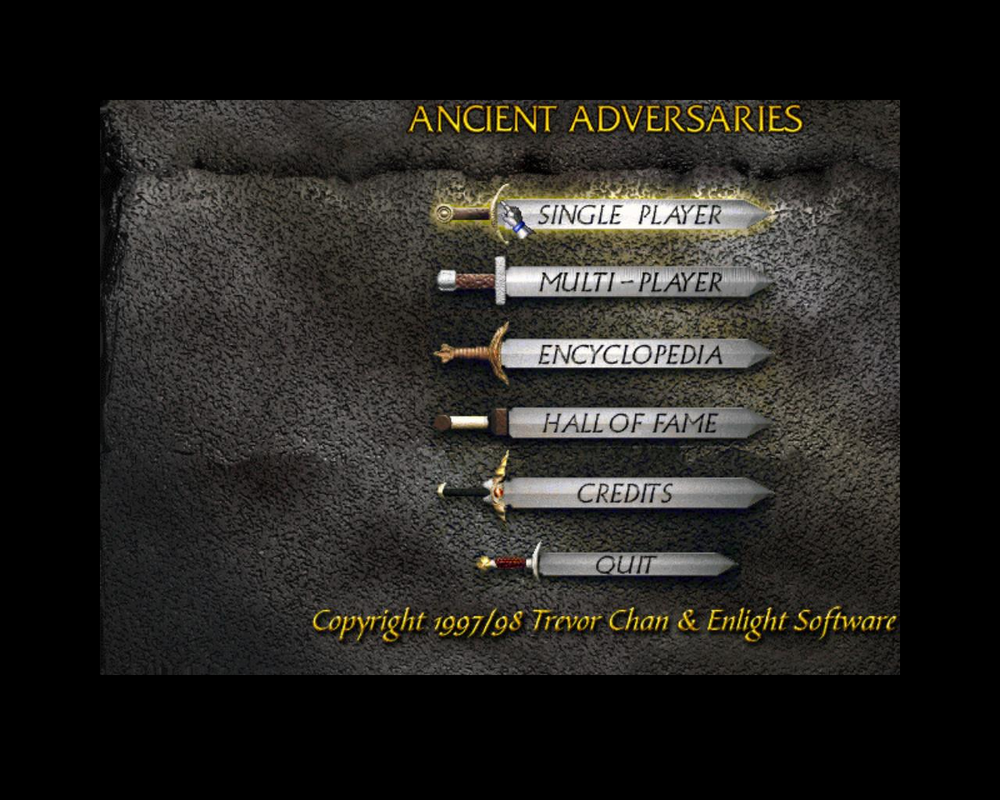 | [SHA256](./7kaa/SHA256SUMS) | N/A |
| [a2d](./a2d) | arm64  | ubuntu-noble | 2.0.3-2-20250327 | 失败 | N/A | N/A |
| [a7xpg](./a7xpg) | arm64  | ubuntu-noble | 0.11.dfsg1-11 |  | [SHA256](./a7xpg/SHA256SUMS) | N/A |
| [abe](./abe) | arm64  | ubuntu-noble | 1.1+dfsg-5 |  | [SHA256](./abe/SHA256SUMS) | N/A |
| [abiword](./abiword) | arm64  | ubuntu-noble | 3.0.5~dfsg-3.2build4 |  | [SHA256](./abiword/SHA256SUMS) | N/A |
| [accerciser](./accerciser) | arm64  | ubuntu-noble | 3.42.0-1ubuntu0.1-20250327 | 失败 | N/A | N/A |
| [accountwizard](./accountwizard) | arm64  | ubuntu-noble | 23.08.5-0ubuntu3-20250327 | 失败 | N/A | N/A |
| [ace-of-penguins](./ace-of-penguins) | arm64  | ubuntu-noble | 1.5~rc2-5ubuntu4 |      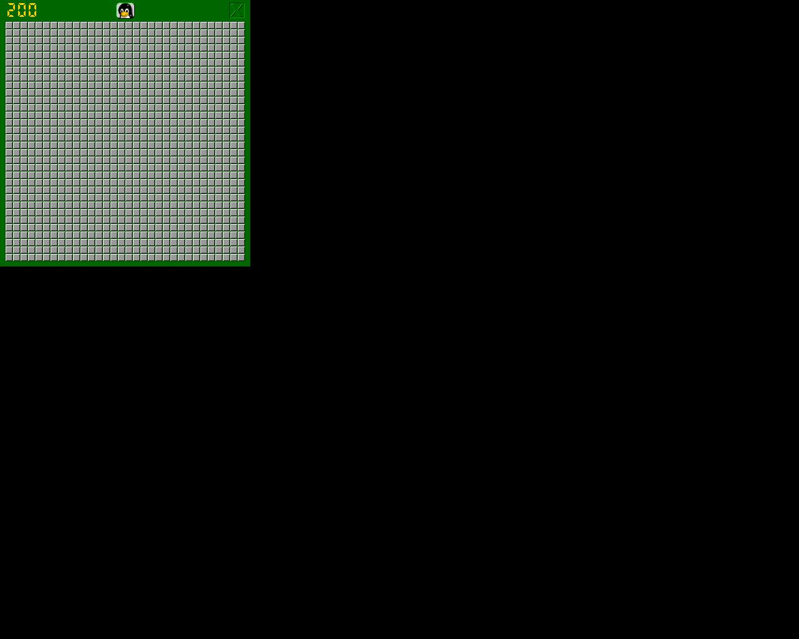 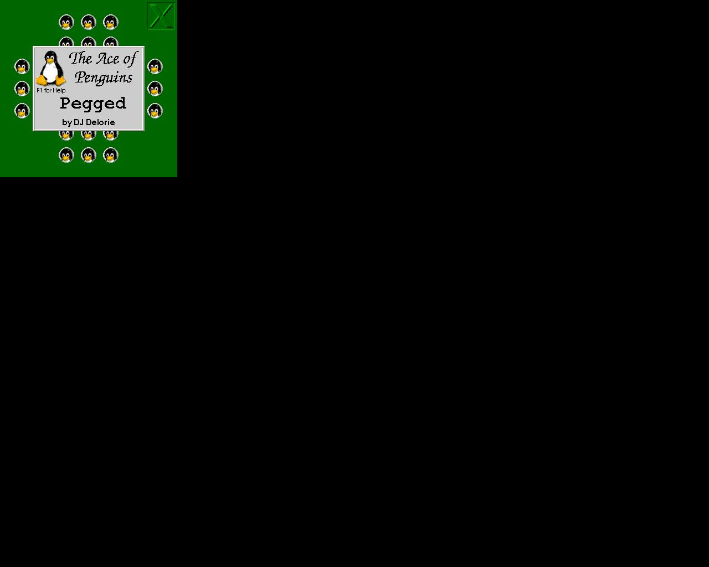      | [SHA256](./ace-of-penguins/SHA256SUMS) | N/A |
| [acetoneiso](./acetoneiso) | arm64  | ubuntu-noble | 2.4-4build2 |  | [SHA256](./acetoneiso/SHA256SUMS) | N/A |
| [achilles](./achilles) | arm64  | ubuntu-noble | 2-12build2 |  | [SHA256](./achilles/SHA256SUMS) | N/A |
| [aclock.app](./aclock.app) | arm64  | ubuntu-noble | 0.4.0-2build5 |  | [SHA256](./aclock.app/SHA256SUMS) | N/A |
| [aconnectgui](./aconnectgui) | arm64  | ubuntu-noble | 0.9.0rc2-1-10.3build2 |  | [SHA256](./aconnectgui/SHA256SUMS) | N/A |
| [actiona](./actiona) | arm64  | ubuntu-noble | 3.10.1-1build6 |  | [SHA256](./actiona/SHA256SUMS) | N/A |
| [activity-aware-firefox](./activity-aware-firefox) | arm64  | ubuntu-noble | 0.4.2-1-20250327 | 失败 | N/A | N/A |
| [activity-log-manager](./activity-log-manager) | arm64  | ubuntu-noble | 0.9.7-0ubuntu31 |  | N/A | N/A |
| [add64](./add64) | arm64  | ubuntu-noble | 3.9.3-0ubuntu3 |  | [SHA256](./add64/SHA256SUMS) | N/A |
| [addressmanager.app](./addressmanager.app) | arm64  | ubuntu-noble | 0.4.8-3build6 |  | [SHA256](./addressmanager.app/SHA256SUMS) | N/A |
| [adonthell-data](./adonthell-data) | arm64  | ubuntu-noble | 0.3.8-1 | 失败 | [SHA256](./adonthell-data/SHA256SUMS) | N/A |
| [adun.app](./adun.app) | arm64  | ubuntu-noble | 0.81-14build4 |  | [SHA256](./adun.app/SHA256SUMS) | N/A |
| [aegisub](./aegisub) | arm64  | ubuntu-noble | 3.2.2+dfsg-7.1build2 | 失败 | [SHA256](./aegisub/SHA256SUMS) | N/A |
| [aeolus](./aeolus) | arm64  | ubuntu-noble | 0.10.4-1build3 | 失败 | [SHA256](./aeolus/SHA256SUMS) | N/A |
| [aerc](./aerc) | arm64  | ubuntu-noble | 0.17.0-1ubuntu0.24.04.2 | 失败 | [SHA256](./aerc/SHA256SUMS) | N/A |
| [afterstep](./afterstep) | arm64  | ubuntu-noble | 2.2.12-17.1build3-20250327 | 失败 | N/A | N/A |
| [afterstep-data](./afterstep-data) | arm64  | ubuntu-noble | 2.2.12-17.1build3-20250327 | 失败 | N/A | N/A |
| [agenda.app](./agenda.app) | arm64  | ubuntu-noble | 0.46-3build3 | 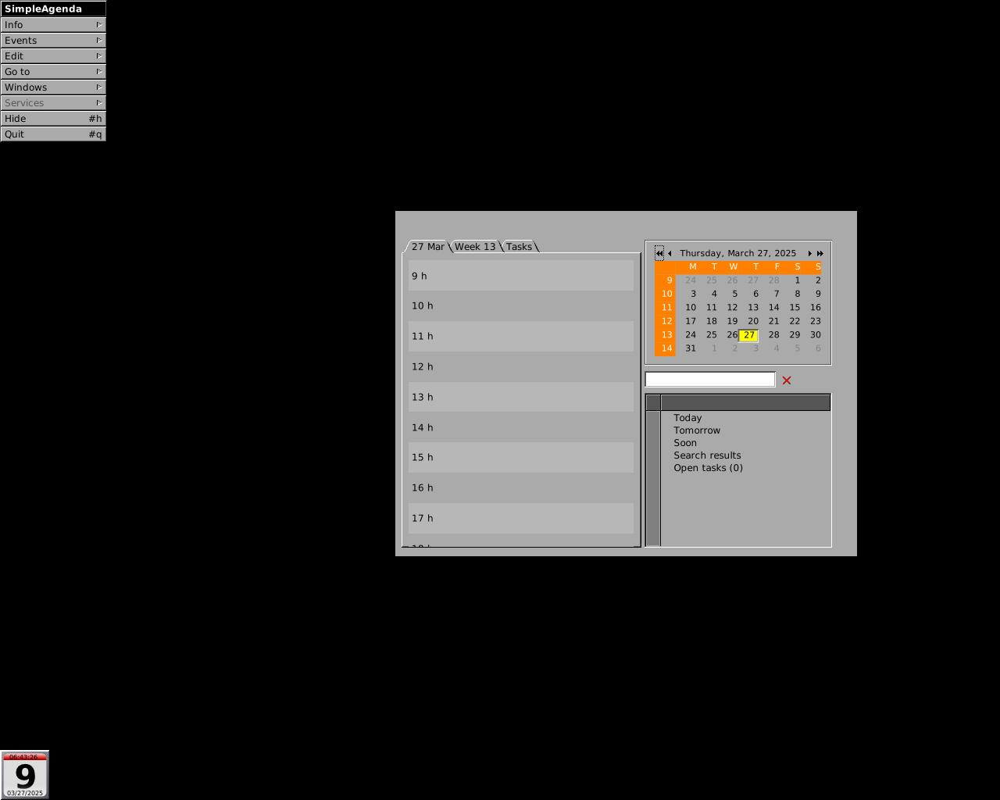 | [SHA256](./agenda.app/SHA256SUMS) | N/A |
| [aghermann](./aghermann) | arm64  | ubuntu-noble | 1.1.2-5build2 |  | [SHA256](./aghermann/SHA256SUMS) | N/A |
| [agordejo](./agordejo) | arm64  | ubuntu-noble | 0.4.2-0ubuntu1 | 失败 | [SHA256](./agordejo/SHA256SUMS) | N/A |
| [airstrike](./airstrike) | arm64  | ubuntu-noble | 0.99+1.0pre6a-11 |  | [SHA256](./airstrike/SHA256SUMS) | N/A |
| [aisleriot](./aisleriot) | arm64  | ubuntu-noble | 3.22.31-1build2 | 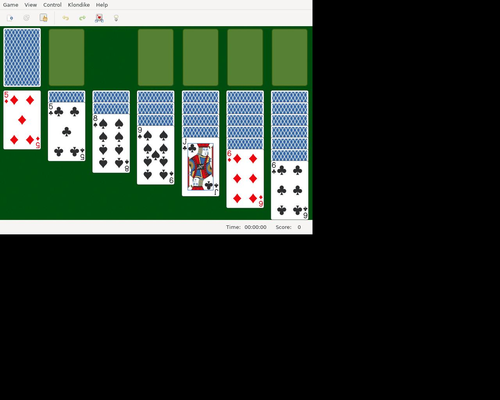 | N/A | N/A |
| [akira](./akira) | arm64  | ubuntu-noble | 0.0.16-2build2 |  | [SHA256](./akira/SHA256SUMS) | N/A |
| [akonadi-import-wizard](./akonadi-import-wizard) | arm64  | ubuntu-noble | 23.08.5-0ubuntu4 |  | N/A | N/A |
| [akonadiconsole](./akonadiconsole) | arm64  | ubuntu-noble | 23.08.5-0ubuntu5.2 |  | N/A | N/A |
| [akregator](./akregator) | arm64  | ubuntu-noble | 23.08.5-0ubuntu4.1 |  | N/A | N/A |
| [alacarte](./alacarte) | arm64  | ubuntu-noble | 3.52.0-1-20250327 | 失败 | N/A | N/A |
| [alacritty](./alacritty) | arm64  | deepin-v23 | 0.13.2-2 |  | [SHA256](./alacritty/SHA256SUMS) | N/A |
| [aladin](./aladin) | arm64  | ubuntu-noble | 12.060+dfsg-3 |  | N/A | N/A |
| [alarm-clock-applet](./alarm-clock-applet) | arm64  | ubuntu-noble | 0.4.1-5build2 |  | [SHA256](./alarm-clock-applet/SHA256SUMS) | N/A |
| [alex4](./alex4) | arm64  | ubuntu-noble | 1.1-10ubuntu4 | 失败 | [SHA256](./alex4/SHA256SUMS) | N/A |
| [algobox](./algobox) | arm64  | ubuntu-noble | 1.1.1+dfsg-1build2 | 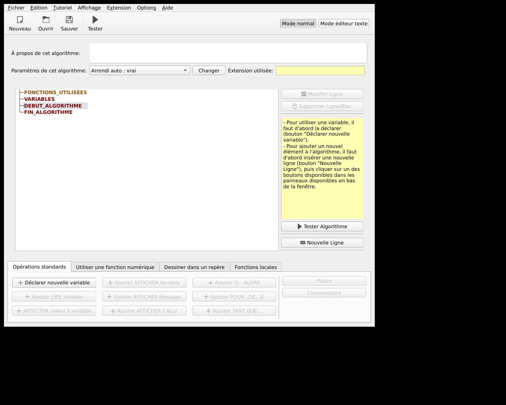 | N/A | N/A |
| [alien-arena](./alien-arena) | arm64  | ubuntu-noble | 7.71.3+dfsg-3ubuntu1 | 失败 | [SHA256](./alien-arena/SHA256SUMS) | N/A |
| [alienblaster](./alienblaster) | arm64  | ubuntu-noble | 1.1.0-11 |  | [SHA256](./alienblaster/SHA256SUMS) | N/A |
| [aliki](./aliki) | arm64  | ubuntu-noble | 0.3.0-6build2 |   | [SHA256](./aliki/SHA256SUMS) | N/A |
| [alkimia-bin](./alkimia-bin) | arm64  | ubuntu-noble | 8.1.2-2build2-20250327 | 失败 | N/A | N/A |
| [allure](./allure) | arm64  | ubuntu-noble | 0.11.0.0-1 |  | [SHA256](./allure/SHA256SUMS) | N/A |
| [almanah](./almanah) | arm64  | ubuntu-noble | 0.12.3-2build3 |  | N/A | N/A |
| [alsa-scarlett-gui](./alsa-scarlett-gui) | arm64  | ubuntu-noble | 0.4.0-1 |  | [SHA256](./alsa-scarlett-gui/SHA256SUMS) | N/A |
| [alsa-tools-gui](./alsa-tools-gui) | arm64  | deepin-v23 | 1.2.11-1.1-20250327 | 失败 | N/A | N/A |
| [alsamixergui](./alsamixergui) | arm64  | ubuntu-noble | 0.9.0rc2-1-10.2build2 |  | [SHA256](./alsamixergui/SHA256SUMS) | N/A |
| [alsaplayer-common](./alsaplayer-common) | arm64  | ubuntu-noble | 0.99.81-2build6 |  | [SHA256](./alsaplayer-common/SHA256SUMS) | N/A |
| [altos](./altos) | arm64  | ubuntu-noble | 1.9.17-1ubuntu3 |   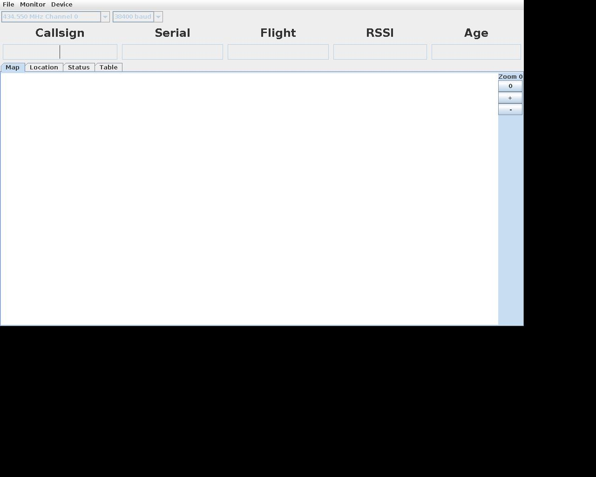 | [SHA256](./altos/SHA256SUMS) | N/A |
| [amberol](./amberol) | arm64  | ubuntu-noble | 0.10.3-3ubuntu1 |  | [SHA256](./amberol/SHA256SUMS) | N/A |
| [amide](./amide) | arm64  | ubuntu-noble | 1.0.6-5build2 |  | [SHA256](./amide/SHA256SUMS) | N/A |
| [amoebax](./amoebax) | arm64  | ubuntu-noble | 0.2.1+dfsg-6 |  | [SHA256](./amoebax/SHA256SUMS) | N/A |
| [amphetamine](./amphetamine) | arm64  | ubuntu-noble | 0.8.10-21build1 |  | [SHA256](./amphetamine/SHA256SUMS) | N/A |
| [ams](./ams) | arm64  | ubuntu-noble | 2.2.1-1build3 | 失败 | [SHA256](./ams/SHA256SUMS) | N/A |
| [amsynth](./amsynth) | arm64  | ubuntu-noble | 1.13.2-1build2 | 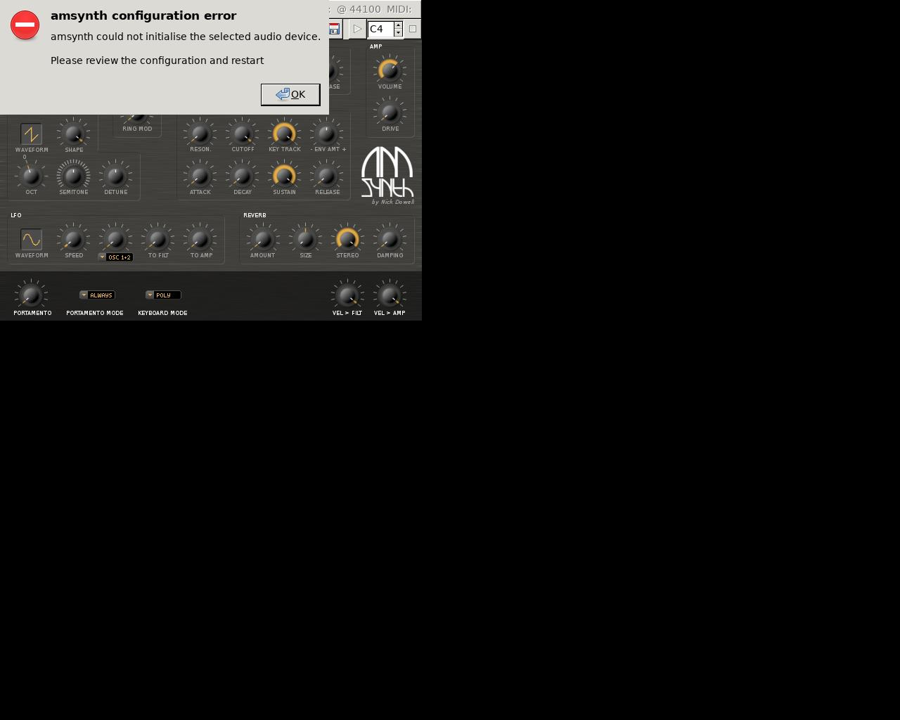 | [SHA256](./amsynth/SHA256SUMS) | N/A |
| [amule](./amule) | arm64  | ubuntu-noble | 2.3.3-3build5 |  | [SHA256](./amule/SHA256SUMS) | N/A |
| [amule-utils-gui](./amule-utils-gui) | arm64  | ubuntu-noble | 2.3.3-3build5 |    | [SHA256](./amule-utils-gui/SHA256SUMS) | N/A |
| [anarchism](./anarchism) | arm64  | ubuntu-noble | 15.3-3 | 失败 | [SHA256](./anarchism/SHA256SUMS) | N/A |
| [android-file-transfer](./android-file-transfer) | arm64  | ubuntu-noble | 4.3-1build3 |  | [SHA256](./android-file-transfer/SHA256SUMS) | N/A |
| [angband-data](./angband-data) | arm64  | ubuntu-noble | 4.2.5+dfsg1-1 | 失败 | [SHA256](./angband-data/SHA256SUMS) | N/A |
| [angelfish](./angelfish) | arm64  | ubuntu-noble | 23.08.5-0ubuntu3-20250327 | 失败 | N/A | N/A |
| [angrydd](./angrydd) | arm64  | ubuntu-noble | 1.0.1-14 |  | [SHA256](./angrydd/SHA256SUMS) | N/A |
| [anki](./anki) | arm64  | ubuntu-noble | 2.1.15+dfsg-3ubuntu4.1 |  | N/A | N/A |
| [ansifilter-gui](./ansifilter-gui) | arm64  | ubuntu-noble | 2.18+dfsg1-2build2 | 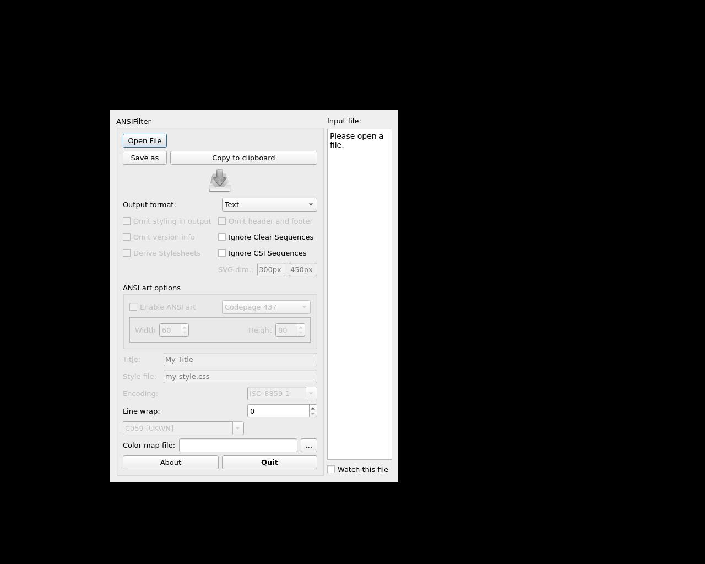 | [SHA256](./ansifilter-gui/SHA256SUMS) | N/A |
| [antigravitaattori](./antigravitaattori) | arm64  | ubuntu-noble | 0.0.3-10build2 | 失败 | [SHA256](./antigravitaattori/SHA256SUMS) | N/A |
| [antimicro](./antimicro) | arm64  | ubuntu-noble | 3.1.4-2 |  | [SHA256](./antimicro/SHA256SUMS) | N/A |
| [antimony](./antimony) | arm64  | ubuntu-noble | 0.9.3-2build9 |  | [SHA256](./antimony/SHA256SUMS) | N/A |
| [anymeal](./anymeal) | arm64  | ubuntu-noble | 1.26-1build2 |  | [SHA256](./anymeal/SHA256SUMS) | N/A |
| [aobook](./aobook) | arm64  | ubuntu-noble | 1.0.3-3build2 |  | [SHA256](./aobook/SHA256SUMS) | N/A |
| [aoflagger](./aoflagger) | arm64  | ubuntu-noble | 3.4.0-2build4 |   | [SHA256](./aoflagger/SHA256SUMS) | N/A |
| [apitrace-gui](./apitrace-gui) | arm64  | ubuntu-noble | 11.1+repack-1.2build3 |  | [SHA256](./apitrace-gui/SHA256SUMS) | N/A |
| [apostrophe](./apostrophe) | arm64  | ubuntu-noble | 2.6.3-4-20250327 | 失败 | N/A | N/A |
| [apper](./apper) | arm64  | ubuntu-noble | 1.0.0-5build2-20250327 | 失败 | N/A | N/A |
| [apport-gtk](./apport-gtk) | arm64  | ubuntu-noble | 2.28.1-0ubuntu3.5-20250327 | 失败 | N/A | N/A |
| [apport-kde](./apport-kde) | arm64  | ubuntu-noble | 2.28.1-0ubuntu3.5-20250327 | 失败 | N/A | N/A |
| [apt-offline-gui](./apt-offline-gui) | arm64  | ubuntu-noble | 1.8.5-1 |  | [SHA256](./apt-offline-gui/SHA256SUMS) | N/A |
| [apturl-common](./apturl-common) | arm64  | ubuntu-noble | 0.5.2ubuntu23 | 失败 | [SHA256](./apturl-common/SHA256SUMS) | N/A |
| [apvlv](./apvlv) | arm64  | ubuntu-noble | 0.5.0+repack-2build3 |  | [SHA256](./apvlv/SHA256SUMS) | N/A |
| [aqemu](./aqemu) | arm64  | ubuntu-noble | 0.9.2-3ubuntu2 |  | [SHA256](./aqemu/SHA256SUMS) | N/A |
| [arandr](./arandr) | arm64  | ubuntu-noble | 0.1.11-1-20250327 | 失败 | N/A | N/A |
| [aranym](./aranym) | arm64  | ubuntu-noble | 1.1.0-2 |   | N/A | N/A |
| [aravis-tools](./aravis-tools) | arm64  | ubuntu-noble | 0.8.30-1build2 | 失败 | [SHA256](./aravis-tools/SHA256SUMS) | N/A |
| [arb](./arb) | arm64  | ubuntu-noble | 6.0.6-7build3-20250327 | 失败 | N/A | N/A |
| [arc-gui-clients](./arc-gui-clients) | arm64  | ubuntu-noble | 0.4.6-7build5 |     | N/A | N/A |
| [ardentryst](./ardentryst) | arm64  | ubuntu-noble | 1.71-10 |  | [SHA256](./ardentryst/SHA256SUMS) | N/A |
| [ardour](./ardour) | arm64  | ubuntu-noble | 8.4.0+ds1-2ubuntu8 |  | [SHA256](./ardour/SHA256SUMS) | N/A |
| [arduino](./arduino) | arm64  | ubuntu-noble | 1.8.19+dfsg1-2 | 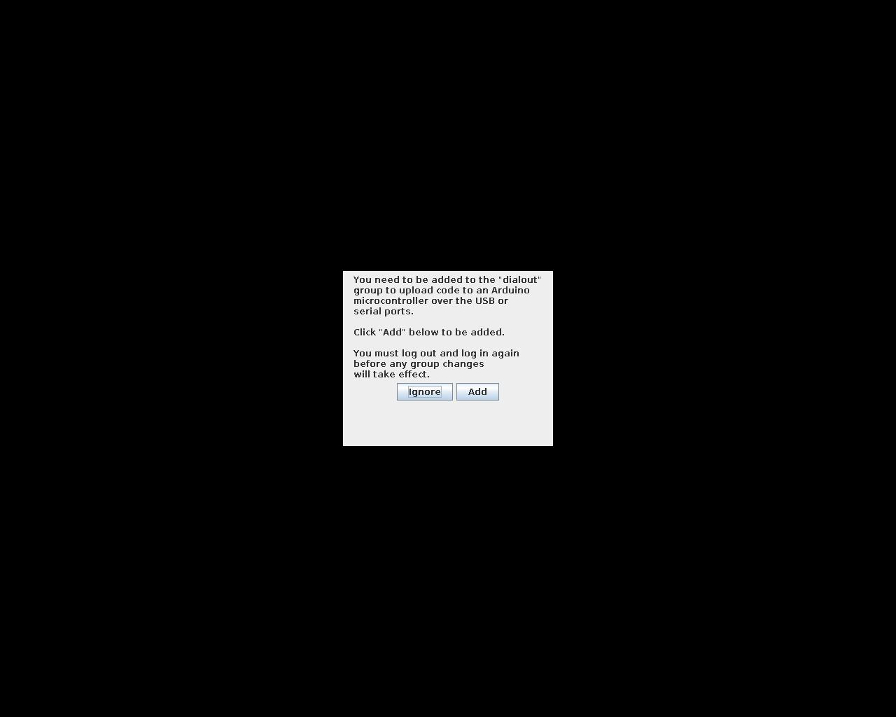 | N/A | N/A |
| [ares](./ares) | arm64  | ubuntu-noble | 134+dfsg-1build2 | 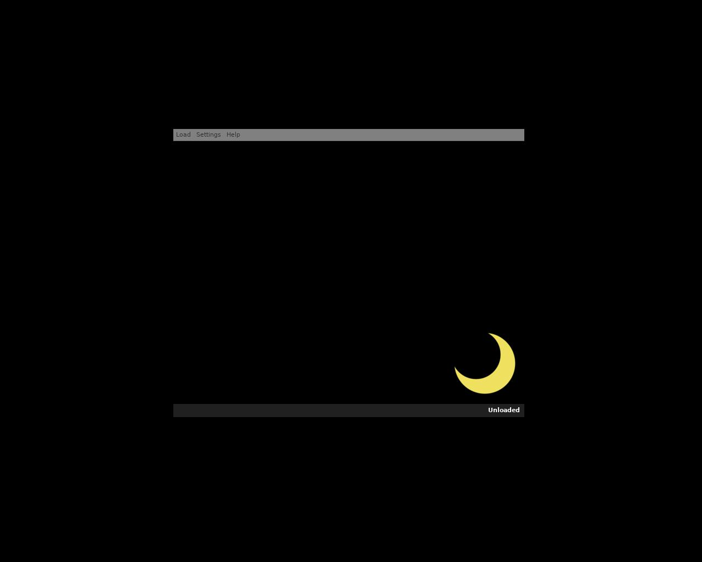 | [SHA256](./ares/SHA256SUMS) | N/A |
| [ario](./ario) | arm64  | ubuntu-noble | 1.6-1.2build4 | 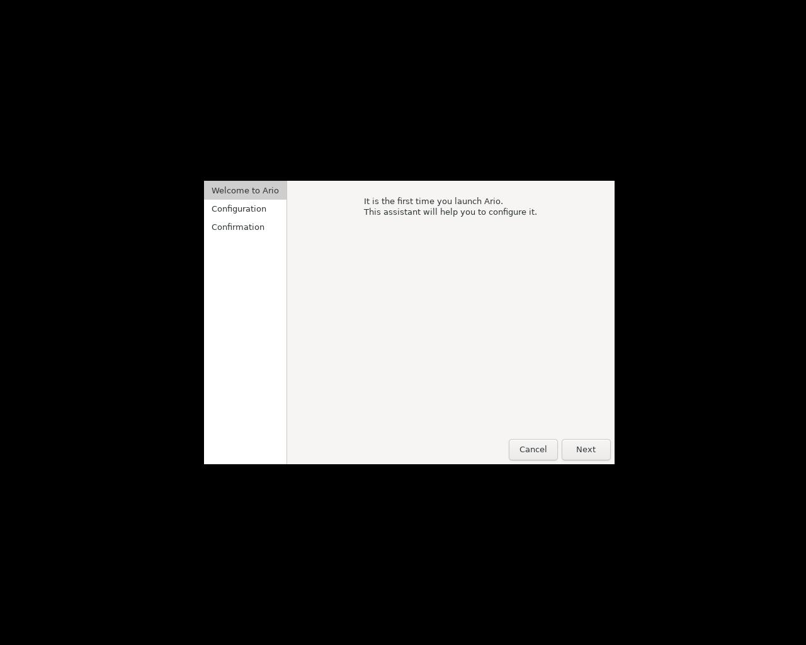 | [SHA256](./ario/SHA256SUMS) | N/A |
| [ark](./ark) | arm64  | ubuntu-noble | 23.08.5-0ubuntu5 |  | N/A | N/A |
| [armagetronad](./armagetronad) | arm64  | ubuntu-noble | 0.2.9.1.1-1build2 |  | [SHA256](./armagetronad/SHA256SUMS) | N/A |
| [arqiver](./arqiver) | arm64  | ubuntu-noble | 0.9.0-1build2 | 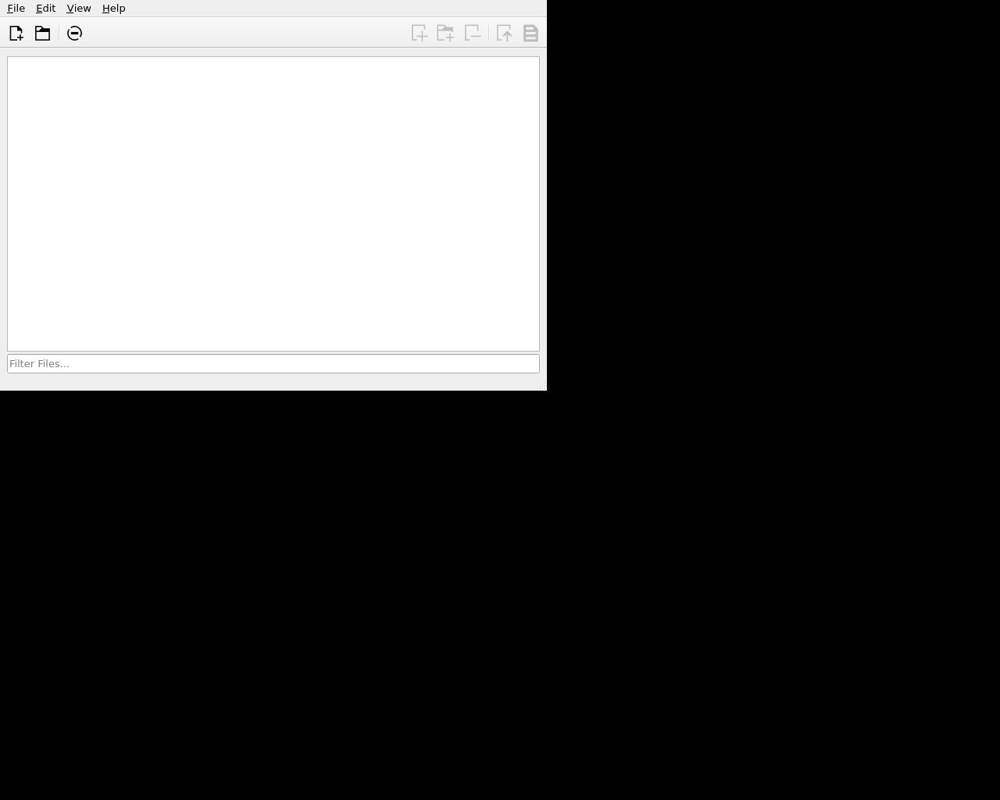 | [SHA256](./arqiver/SHA256SUMS) | N/A |
| [artemis](./artemis) | arm64  | ubuntu-noble | 18.2.0+dfsg-3 |     | [SHA256](./artemis/SHA256SUMS) | N/A |
| [artha](./artha) | arm64  | ubuntu-noble | 1.0.5-3build2 |  | [SHA256](./artha/SHA256SUMS) | N/A |
| [artikulate](./artikulate) | arm64  | ubuntu-noble | 23.08.5-0ubuntu3 |  | N/A | N/A |
| [asc](./asc) | arm64  | ubuntu-noble | 2.6.1.0-9build5 |  | [SHA256](./asc/SHA256SUMS) | N/A |
| [asciijump](./asciijump) | arm64  | ubuntu-noble | 1.0.2~beta-10-20250327 | 失败 | N/A | N/A |
| [ase](./ase) | arm64  | ubuntu-noble | 3.22.1-4 | 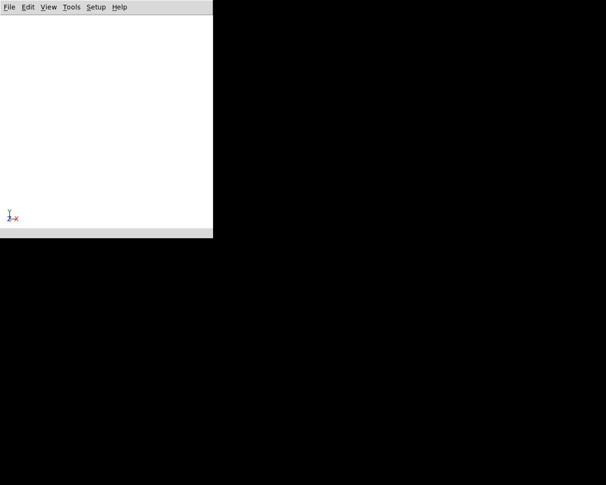 | [SHA256](./ase/SHA256SUMS) | N/A |
| [aseba](./aseba) | arm64  | ubuntu-noble | 1.6.99+dfsg-9build2 |        | [SHA256](./aseba/SHA256SUMS) | N/A |
| [assaultcube](./assaultcube) | arm64  | ubuntu-noble | 1.3.0.2+dfsg-5 |  | N/A | N/A |
| [astromenace](./astromenace) | arm64  | ubuntu-noble | 1.3.2+repack-7 |  | N/A | N/A |
| [asunder](./asunder) | arm64  | ubuntu-noble | 3.0.1+ds-1build2 |  | [SHA256](./asunder/SHA256SUMS) | N/A |
| [asylum](./asylum) | arm64  | ubuntu-noble | 0.3.2-3build1 |  | N/A | N/A |
| [atanks](./atanks) | arm64  | ubuntu-noble | 6.6~dfsg-1build2 |  | [SHA256](./atanks/SHA256SUMS) | N/A |
| [atari800](./atari800) | arm64  | ubuntu-noble | 5.0.0-1build2 | 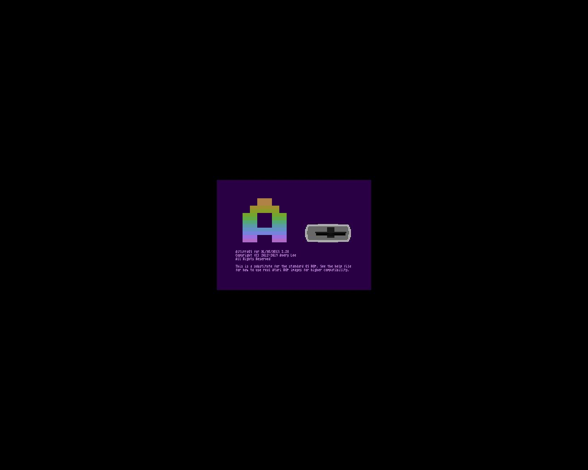 | [SHA256](./atari800/SHA256SUMS) | N/A |
| [atomes](./atomes) | arm64  | ubuntu-noble | 1.1.12+repack-2ubuntu2 |  | [SHA256](./atomes/SHA256SUMS) | N/A |
| [atomix](./atomix) | arm64  | ubuntu-noble | 44.0-3build3 |  | [SHA256](./atomix/SHA256SUMS) | N/A |
| [atril](./atril) | arm64  | ubuntu-noble | 1.26.2-3build2 |  | N/A | N/A |
| [audacious](./audacious) | arm64  | ubuntu-noble | 4.3.1-2.1build2 |  | [SHA256](./audacious/SHA256SUMS) | N/A |
| [audacity](./audacity) | arm64  | deepin-v23 | 3.4.2+dfsg-1deepin0 |  | [SHA256](./audacity/SHA256SUMS) | N/A |
| [audmes](./audmes) | arm64  | ubuntu-noble | 2024.02.18-1build2 |  | [SHA256](./audmes/SHA256SUMS) | N/A |
| [aumix](./aumix) | arm64  | ubuntu-noble | 2.9.1-7.1 | 失败 | [SHA256](./aumix/SHA256SUMS) | N/A |
| [auralquiz](./auralquiz) | arm64  | ubuntu-noble | 1.0.0-3build3 |  | [SHA256](./auralquiz/SHA256SUMS) | N/A |
| [ausweisapp](./ausweisapp) | arm64  | ubuntu-noble | 2.1.0-1build1 |  | [SHA256](./ausweisapp/SHA256SUMS) | N/A |
| [auto-multiple-choice](./auto-multiple-choice) | arm64  | ubuntu-noble | 1.6.0-3build4-20250327 | 失败 | N/A | N/A |
| [autokey-gtk](./autokey-gtk) | arm64  | ubuntu-noble | 0.95.10-2.1-20250327 | 失败 | N/A | N/A |
| [autokey-qt](./autokey-qt) | arm64  | ubuntu-noble | 0.95.10-2.1 |  | [SHA256](./autokey-qt/SHA256SUMS) | N/A |
| [autorenamer](./autorenamer) | arm64  | ubuntu-noble | 0.6-1-20250327 | 失败 | N/A | N/A |
| [avahi-discover](./avahi-discover) | arm64  | ubuntu-noble | 0.8-13ubuntu6-20250327 | 失败 | N/A | N/A |
| [avahi-ui-utils](./avahi-ui-utils) | arm64  | ubuntu-noble | 0.8-13ubuntu6 |  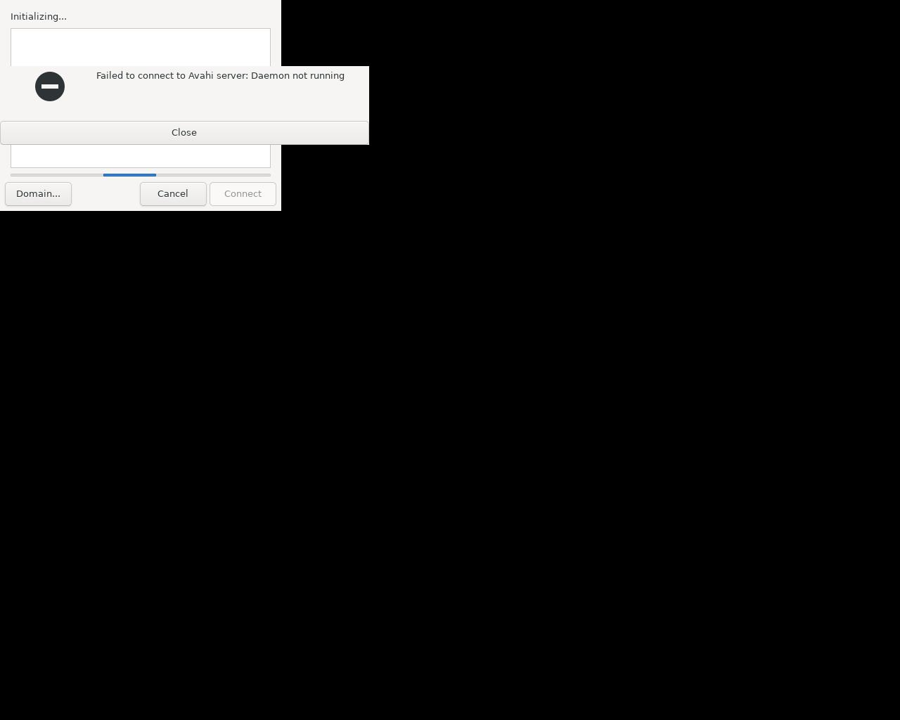 | N/A | N/A |
| [avogadro](./avogadro) | arm64  | ubuntu-noble | 1.99.0-1build2 |  | [SHA256](./avogadro/SHA256SUMS) | N/A |
| [awf-gtk3](./awf-gtk3) | arm64  | ubuntu-noble | 2.8.0-1build2 |  | [SHA256](./awf-gtk3/SHA256SUMS) | N/A |
| [awf-gtk4](./awf-gtk4) | arm64  | ubuntu-noble | 2.8.0-1build2 | 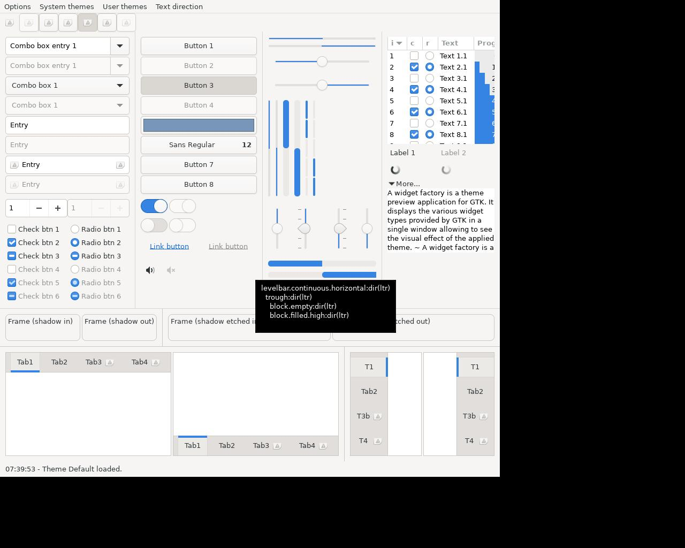 | [SHA256](./awf-gtk4/SHA256SUMS) | N/A |
| [ayatana-settings](./ayatana-settings) | arm64  | ubuntu-noble | 23.11.14-1-20250327 | 失败 | N/A | N/A |
| [ayatana-webmail](./ayatana-webmail) | arm64  | ubuntu-noble | 23.12.25+dfsg-1-20250327 | 失败 | N/A | N/A |
| [backintime-qt](./backintime-qt) | arm64  | ubuntu-noble | 1.4.3-1 |  | N/A | N/A |
| [bacula-console-qt](./bacula-console-qt) | arm64  | ubuntu-noble | 13.0.4-1build3 |  | N/A | N/A |
| [bacula-tray-monitor](./bacula-tray-monitor) | arm64  | ubuntu-noble | 13.0.4-1build3 |  | N/A | N/A |
| [ballerburg](./ballerburg) | arm64  | ubuntu-noble | 1.2.1-1 | 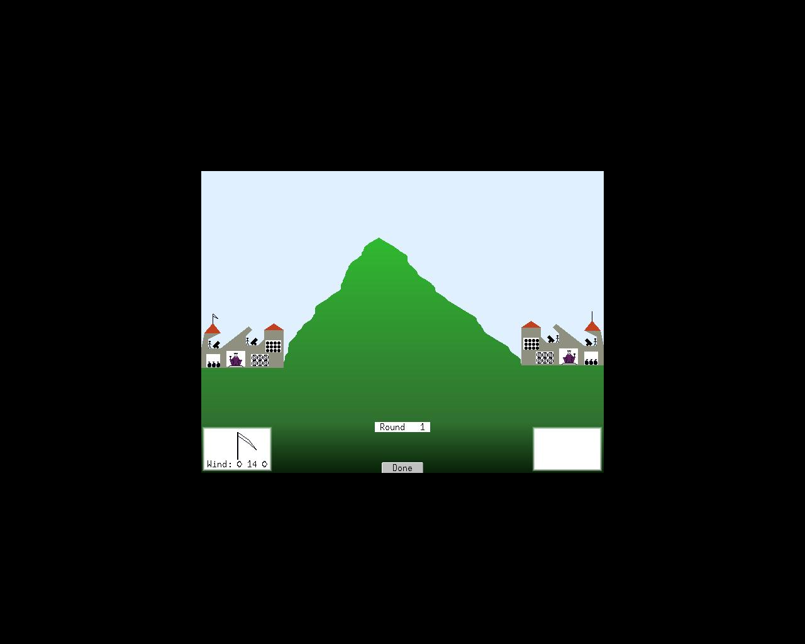 | [SHA256](./ballerburg/SHA256SUMS) | N/A |
| [ballview](./ballview) | arm64  | ubuntu-noble | 1.5.0+git20180813.37fc53c-11build5 | 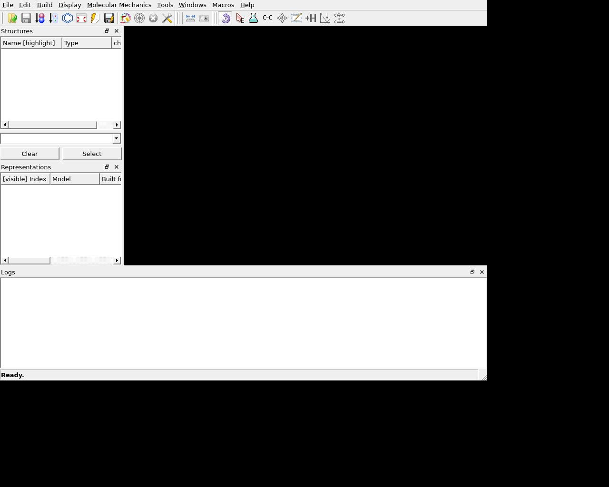 | N/A | N/A |
| [ballz](./ballz) | arm64  | ubuntu-noble | 1.0.4-1.1build2 |  | [SHA256](./ballz/SHA256SUMS) | N/A |
| [balsa](./balsa) | arm64  | ubuntu-noble | 2.6.4-2build5-20250327 | 失败 | N/A | N/A |
| [bambam](./bambam) | arm64  | ubuntu-noble | 1.2.1+dfsg-1 |  | [SHA256](./bambam/SHA256SUMS) | N/A |
| [bambootracker](./bambootracker) | arm64  | ubuntu-noble | 0.6.1-1build2 | 失败 | [SHA256](./bambootracker/SHA256SUMS) | N/A |
| [baobab](./baobab) | arm64  | ubuntu-noble | 46.0-1build1 |  | N/A | N/A |
| [barrage](./barrage) | arm64  | ubuntu-noble | 1.0.5-1 |  | [SHA256](./barrage/SHA256SUMS) | N/A |
| [barrier](./barrier) | arm64  | ubuntu-noble | 2.4.0+dfsg-4build3 |  | N/A | N/A |
| [basex](./basex) | arm64  | ubuntu-noble | 10.5-1 | 失败 | [SHA256](./basex/SHA256SUMS) | N/A |
| [basic256](./basic256) | arm64  | ubuntu-noble | 2.0.99.7-2build3 |  | [SHA256](./basic256/SHA256SUMS) | N/A |
| [basilisk2](./basilisk2) | arm64  | ubuntu-noble | 0.9.20240401-1 | 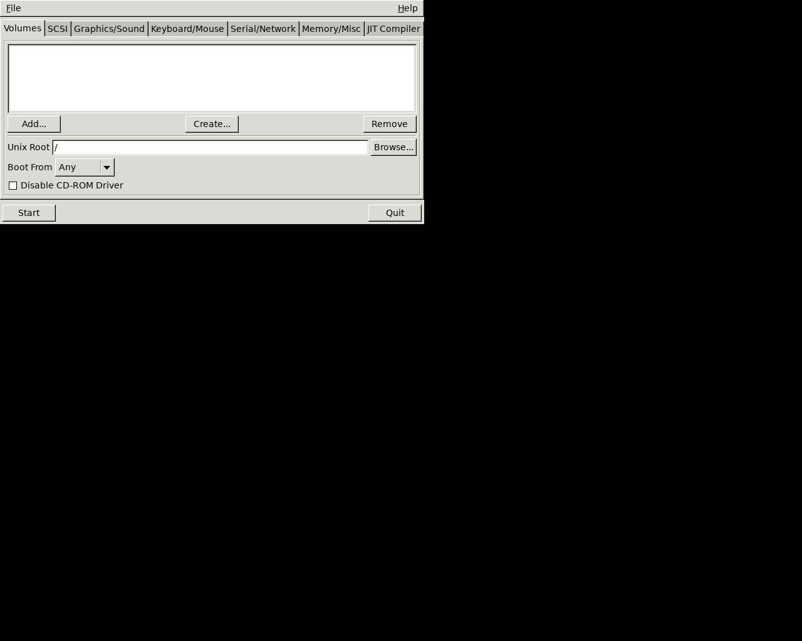 | [SHA256](./basilisk2/SHA256SUMS) | N/A |
| [basket](./basket) | arm64  | ubuntu-noble | 2.49-1build3 | 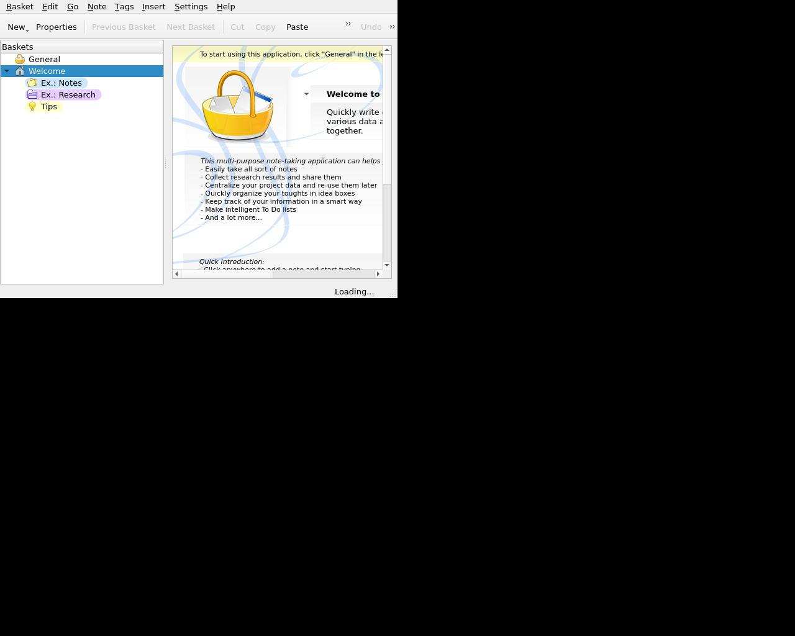 | N/A | N/A |
| [bastet](./bastet) | arm64  | ubuntu-noble | 0.43-7build1-20250327 | 失败 | N/A | N/A |
| [batmon.app](./batmon.app) | arm64  | ubuntu-noble | 0.9-2build5 |  | [SHA256](./batmon.app/SHA256SUMS) | N/A |
| [battery-stats](./battery-stats) | arm64  | ubuntu-noble | 0.5.6-2.1 |  | N/A | N/A |
| [bb](./bb) | arm64  | deepin-v23 | 1.3rc1-13 | 失败 | [SHA256](./bb/SHA256SUMS) | N/A |
| [bbpager](./bbpager) | arm64  | ubuntu-noble | 0.4.7-10 | 失败 | [SHA256](./bbpager/SHA256SUMS) | N/A |
| [bcnc](./bcnc) | arm64  | ubuntu-noble | 0.9.14.318+ds-4 | 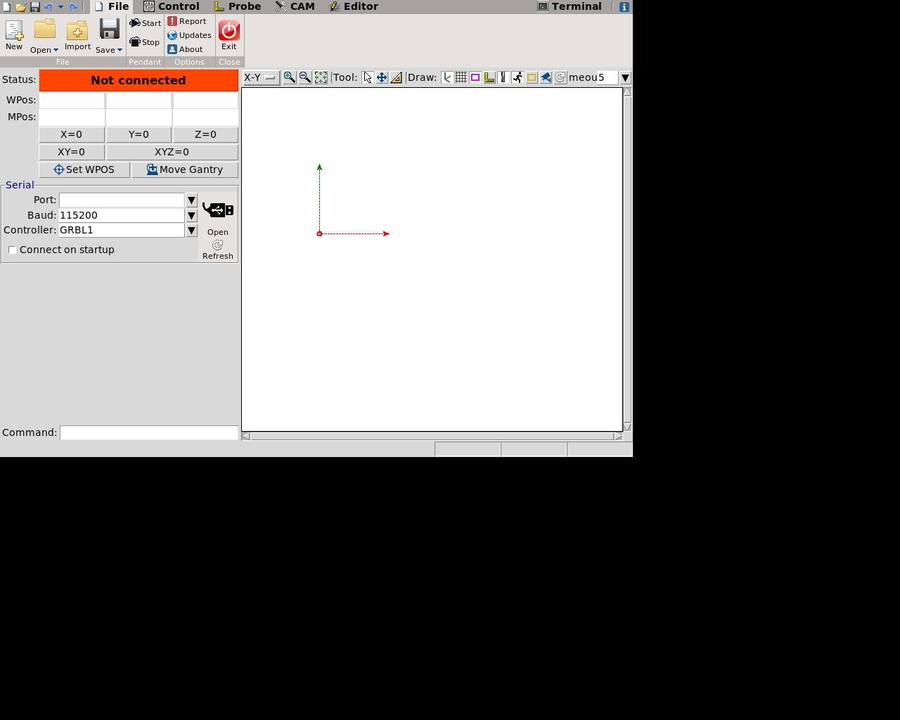 | [SHA256](./bcnc/SHA256SUMS) | N/A |
| [bdbvu](./bdbvu) | arm64  | ubuntu-noble | 0.1-3.1build2 |  | [SHA256](./bdbvu/SHA256SUMS) | N/A |
| [beads](./beads) | arm64  | ubuntu-noble | 1.1.22-1build4 |  | [SHA256](./beads/SHA256SUMS) | N/A |
| [bear-factory](./bear-factory) | arm64  | ubuntu-noble | 0.6.0-8build5 |    | [SHA256](./bear-factory/SHA256SUMS) | N/A |
| [beneath-a-steel-sky](./beneath-a-steel-sky) | arm64  | ubuntu-noble | 0.0372-8 |  | [SHA256](./beneath-a-steel-sky/SHA256SUMS) | N/A |
| [berusky](./berusky) | arm64  | ubuntu-noble | 1.7.2-3build2 |  | [SHA256](./berusky/SHA256SUMS) | N/A |
| [berusky2](./berusky2) | arm64  | ubuntu-noble | 0.12-4 |  | [SHA256](./berusky2/SHA256SUMS) | N/A |
| [bespokesynth](./bespokesynth) | arm64  | ubuntu-noble | 1.2.1+dfsg-4build4 |  | [SHA256](./bespokesynth/SHA256SUMS) | N/A |
| [betaradio](./betaradio) | arm64  | ubuntu-noble | 1.6-1build3 |  | [SHA256](./betaradio/SHA256SUMS) | N/A |
| [between](./between) | arm64  | ubuntu-noble | 6+dfsg1-4 |  | [SHA256](./between/SHA256SUMS) | N/A |
| [bibledit](./bibledit) | arm64  | ubuntu-noble | 5.1.002-1build5 |  | [SHA256](./bibledit/SHA256SUMS) | N/A |
| [bibletime](./bibletime) | arm64  | ubuntu-noble | 3.0.3-3build2 |  | [SHA256](./bibletime/SHA256SUMS) | N/A |
| [bibshelf](./bibshelf) | arm64  | ubuntu-noble | 1.6.0-0ubuntu9 |  | [SHA256](./bibshelf/SHA256SUMS) | N/A |
| [biglybt](./biglybt) | arm64  | ubuntu-noble | 3.4.0.0-1 | 失败 | [SHA256](./biglybt/SHA256SUMS) | N/A |
| [bijiben](./bijiben) | arm64  | ubuntu-noble | 40.1-6build4-20250327 | 失败 | N/A | N/A |
| [billard-gl](./billard-gl) | arm64  | ubuntu-noble | 1.75-17build2 |  | [SHA256](./billard-gl/SHA256SUMS) | N/A |
| [biloba](./biloba) | arm64  | ubuntu-noble | 0.9.3-11 |  | [SHA256](./biloba/SHA256SUMS) | N/A |
| [biniax2](./biniax2) | arm64  | ubuntu-noble | 1.30-7 |  | [SHA256](./biniax2/SHA256SUMS) | N/A |
| [bino](./bino) | arm64  | ubuntu-noble | 2.1-1build2 | 失败 | [SHA256](./bino/SHA256SUMS) | N/A |
| [biogenesis](./biogenesis) | arm64  | ubuntu-noble | 0.8-3.1 |  | [SHA256](./biogenesis/SHA256SUMS) | N/A |
| [birdfont](./birdfont) | arm64  | ubuntu-noble | 2.33.1-3build3 |  | [SHA256](./birdfont/SHA256SUMS) | N/A |
| [bisheng-engine](./bisheng-engine) | arm64  | deepin-v23 | 2.0.13-1-20250327 | 失败 | N/A | N/A |
| [bitsnpicas](./bitsnpicas) | arm64  | ubuntu-noble | 2.0+ds-2 | 失败 | [SHA256](./bitsnpicas/SHA256SUMS) | N/A |
| [biz.zcjt.gaopaiyi](./biz.zcjt.gaopaiyi) | arm64  | deepin-v23 | 1.0.0-20250327 | 失败 | N/A | N/A |
| [biz.zcjt.scanner](./biz.zcjt.scanner) | arm64  | deepin-v23 | 1.0.2.0-20250327 | 失败 | N/A | N/A |
| [biz.zcjt.zc-a5930dn](./biz.zcjt.zc-a5930dn) | arm64  | deepin-v23 | 1.0.0-23166 |   | N/A | N/A |
| [biz.zcjt.zc-a5933dn](./biz.zcjt.zc-a5933dn) | arm64  | deepin-v23 | 1.0.0-23324 |   | N/A | N/A |
| [biz.zcjt.zhongchu-sane](./biz.zcjt.zhongchu-sane) | arm64  | deepin-v23 | 20240911-6.6.10.030-20250327 | 失败 | N/A | N/A |
| [bkchem](./bkchem) | arm64  | ubuntu-noble | 0.14.0~pre4+git20211228-3 | 失败 | [SHA256](./bkchem/SHA256SUMS) | N/A |
| [black-box](./black-box) | arm64  | ubuntu-noble | 1.4.8-4build1 |  | [SHA256](./black-box/SHA256SUMS) | N/A |
| [blackbox-terminal](./blackbox-terminal) | arm64  | ubuntu-noble | 0.14.0-2build2 |  | [SHA256](./blackbox-terminal/SHA256SUMS) | N/A |
| [bleachbit](./bleachbit) | arm64  | ubuntu-noble | 4.6.0-3-20250327 | 失败 | N/A | N/A |
| [blender](./blender) | arm64  | ubuntu-noble | 4.0.2+dfsg-1ubuntu8 |  | [SHA256](./blender/SHA256SUMS) | N/A |
| [blinken](./blinken) | arm64  | ubuntu-noble | 23.08.5-0ubuntu4 |  | N/A | N/A |
| [blobandconquer](./blobandconquer) | arm64  | ubuntu-noble | 1.11-dfsg+20-2 | 失败 | [SHA256](./blobandconquer/SHA256SUMS) | N/A |
| [blobby](./blobby) | arm64  | ubuntu-noble | 1.1+ds-1ubuntu1 |  | [SHA256](./blobby/SHA256SUMS) | N/A |
| [bloboats](./bloboats) | arm64  | ubuntu-noble | 1.0.2+dfsg-4 |  | [SHA256](./bloboats/SHA256SUMS) | N/A |
| [blobwars](./blobwars) | arm64  | ubuntu-noble | 2.00-4ubuntu1 |  | [SHA256](./blobwars/SHA256SUMS) | N/A |
| [blockattack](./blockattack) | arm64  | ubuntu-noble | 2.8.0-1build1 |  | [SHA256](./blockattack/SHA256SUMS) | N/A |
| [blockout2](./blockout2) | arm64  | ubuntu-noble | 2.5+dfsg1-1build3 | 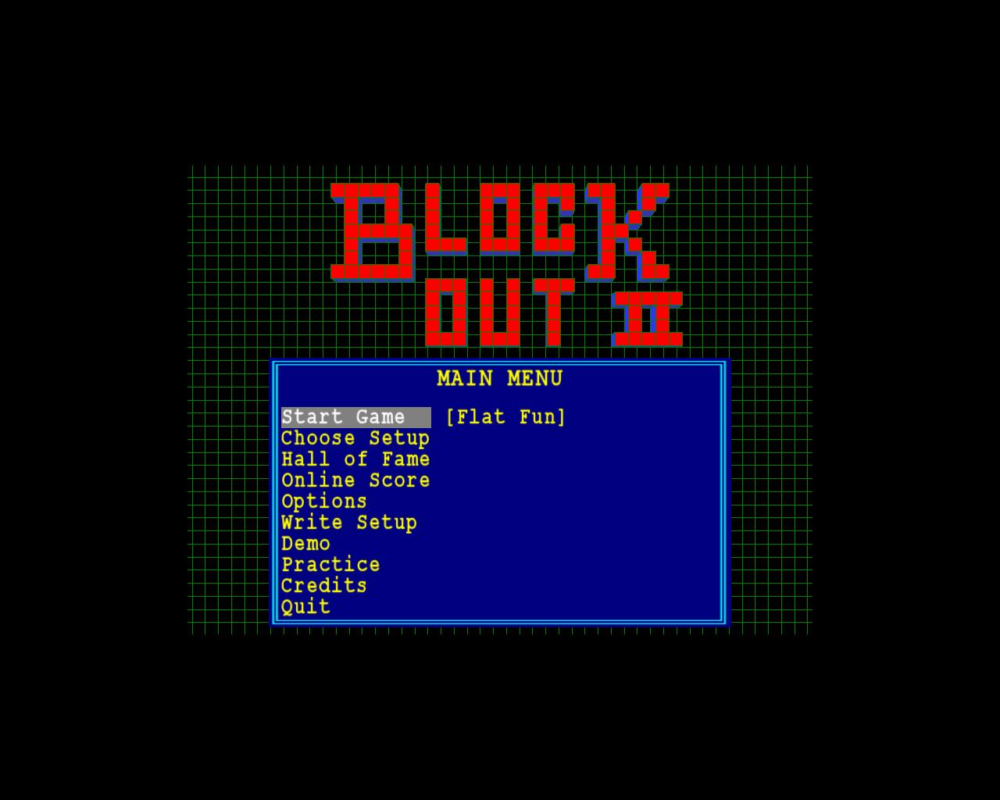 | [SHA256](./blockout2/SHA256SUMS) | N/A |
| [blocks-of-the-undead](./blocks-of-the-undead) | arm64  | ubuntu-noble | 1.0-7build1 | 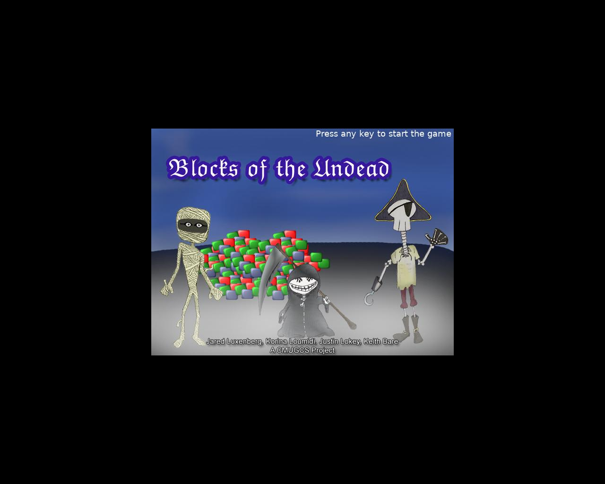 | [SHA256](./blocks-of-the-undead/SHA256SUMS) | N/A |
| [bluedevil](./bluedevil) | arm64  | ubuntu-noble | 5.27.11-0ubuntu2 |  | N/A | N/A |
| [bluefish](./bluefish) | arm64  | ubuntu-noble | 2.2.15-1 | 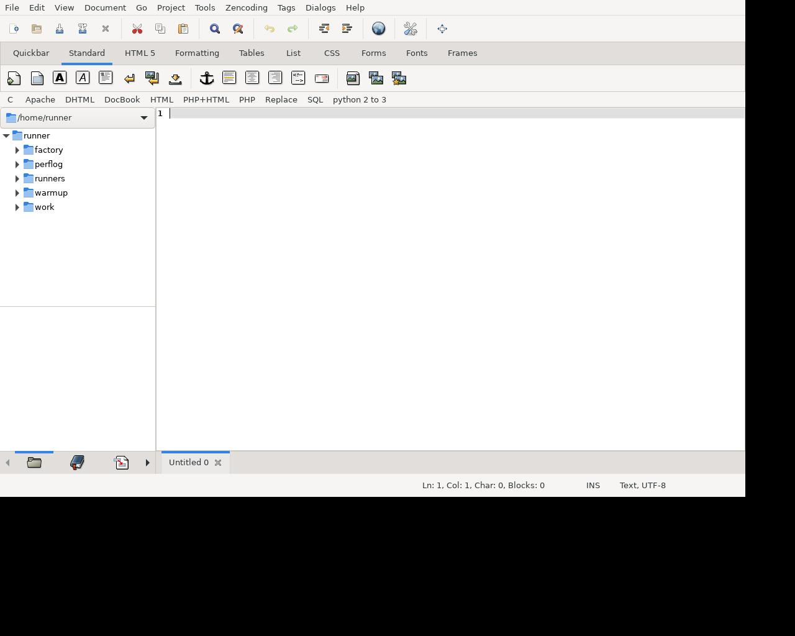 | N/A | N/A |
| [blueman](./blueman) | arm64  | deepin-v23 | 2.3.5-3deepin0+rb1-20250327 | 失败 | N/A | N/A |
| [blupimania](./blupimania) | arm64  | ubuntu-noble | 1.6.2-17-g5f6cf8b-1 |  | [SHA256](./blupimania/SHA256SUMS) | N/A |
| [boats](./boats) | arm64  | ubuntu-noble | 202008-1build2 |  | [SHA256](./boats/SHA256SUMS) | N/A |
| [boinc-manager](./boinc-manager) | arm64  | ubuntu-noble | 7.24.1+dfsg-4build1 |  | N/A | N/A |
| [bomber](./bomber) | arm64  | ubuntu-noble | 23.08.5-0ubuntu3 |  | N/A | N/A |
| [bomberclone](./bomberclone) | arm64  | ubuntu-noble | 0.11.9-7.1 |  | [SHA256](./bomberclone/SHA256SUMS) | N/A |
| [bookletimposer](./bookletimposer) | arm64  | ubuntu-noble | 0.3.1-4ubuntu1-20250327 | 失败 | N/A | N/A |
| [bookworm](./bookworm) | arm64  | ubuntu-noble | 1.1.2+git20210715-4build3 |  | [SHA256](./bookworm/SHA256SUMS) | N/A |
| [boomaga](./boomaga) | arm64  | ubuntu-noble | 3.0.0+git13-g7f7ad47-1build4 |  | [SHA256](./boomaga/SHA256SUMS) | N/A |
| [bossa](./bossa) | arm64  | ubuntu-noble | 1.9.1-3ubuntu5 |  | [SHA256](./bossa/SHA256SUMS) | N/A |
| [boswars](./boswars) | arm64  | ubuntu-noble | 2.8-2build2 |  | [SHA256](./boswars/SHA256SUMS) | N/A |
| [bouncy](./bouncy) | arm64  | ubuntu-noble | 0.6.20071104-9 |  | [SHA256](./bouncy/SHA256SUMS) | N/A |
| [bovo](./bovo) | arm64  | ubuntu-noble | 23.08.5-0ubuntu3 |  | N/A | N/A |
| [bpython](./bpython) | arm64  | ubuntu-noble | 0.24-1 |  | [SHA256](./bpython/SHA256SUMS) | N/A |
| [brainparty](./brainparty) | arm64  | ubuntu-noble | 0.61+dfsg-7 |  | N/A | N/A |
| [brasero](./brasero) | arm64  | ubuntu-noble | 3.12.3-2build4 | 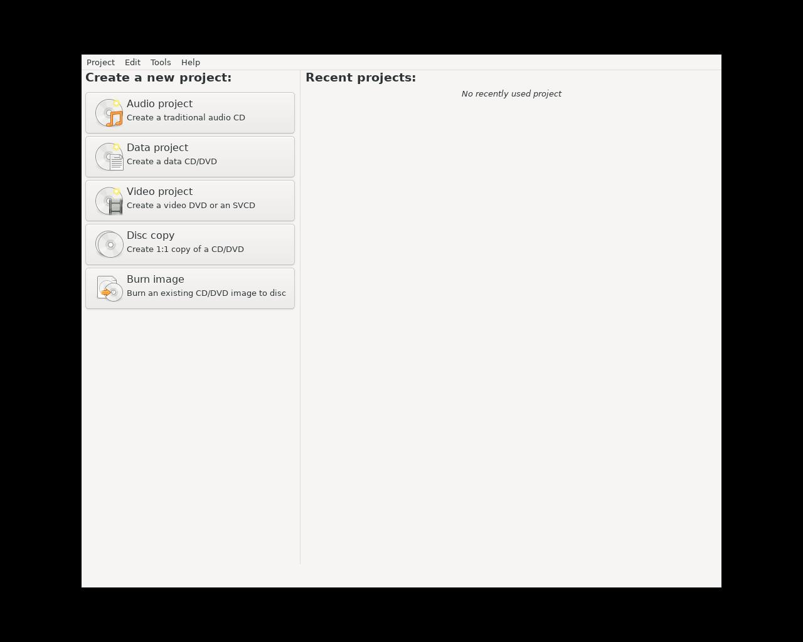 | N/A | N/A |
| [brewtarget](./brewtarget) | arm64  | ubuntu-noble | 3.0.6-1build2 |  | [SHA256](./brewtarget/SHA256SUMS) | N/A |
| [briquolo](./briquolo) | arm64  | ubuntu-noble | 0.5.7-11build2 |  | [SHA256](./briquolo/SHA256SUMS) | N/A |
| [brp-pacu](./brp-pacu) | arm64  | ubuntu-noble | 2.1.2+git20210421-1build2 |  | N/A | N/A |
| [brutalchess](./brutalchess) | arm64  | ubuntu-noble | 0.5.2+dfsg-8build1 |  | [SHA256](./brutalchess/SHA256SUMS) | N/A |
| [bsdgames](./bsdgames) | arm64  | ubuntu-noble | 2.17-33 |           | N/A | N/A |
| [btanks](./btanks) | arm64  | ubuntu-noble | 0.9.8083-9build1 |  | [SHA256](./btanks/SHA256SUMS) | N/A |
| [btop](./btop) | arm64  | deepin-v23 | 1.3.0-1-20250327 | 失败 | N/A | N/A |
| [budgie-arm-environment](./budgie-arm-environment) | arm64  | ubuntu-noble | 0.20.13-20250327 | 失败 | N/A | N/A |
| [budgie-control-center](./budgie-control-center) | arm64  | ubuntu-noble | 1.4.0-2build3-20250327 | 失败 | N/A | N/A |
| [budgie-core](./budgie-core) | arm64  | ubuntu-noble | 10.9.1-3ubuntu4-20250327 | 失败 | N/A | N/A |
| [budgie-desktop-environment](./budgie-desktop-environment) | arm64  | ubuntu-noble | 0.20.13-20250327 | 失败 | N/A | N/A |
| [budgie-desktop-view](./budgie-desktop-view) | arm64  | ubuntu-noble | 1.3-2build1-20250327 | 失败 | N/A | N/A |
| [budgie-hotcorners-applet](./budgie-hotcorners-applet) | arm64  | ubuntu-noble | 1.8.0-1build3 |  | N/A | N/A |
| [budgie-previews](./budgie-previews) | arm64  | ubuntu-noble | 1.8.0-1build3 |  | [SHA256](./budgie-previews/SHA256SUMS) | N/A |
| [budgie-quickchar](./budgie-quickchar) | arm64  | ubuntu-noble | 1.8.0-1build3-20250327 | 失败 | N/A | N/A |
| [budgie-wallstreet](./budgie-wallstreet) | arm64  | ubuntu-noble | 1.8.0-1build3 |  | [SHA256](./budgie-wallstreet/SHA256SUMS) | N/A |
| [budgie-welcome](./budgie-welcome) | arm64  | ubuntu-noble | 0.6.1 |     | N/A | N/A |
| [budgie-window-shuffler](./budgie-window-shuffler) | arm64  | ubuntu-noble | 1.8.0-1build3 |  | [SHA256](./budgie-window-shuffler/SHA256SUMS) | N/A |
| [bugsquish](./bugsquish) | arm64  | ubuntu-noble | 0.0.6-10 |  | [SHA256](./bugsquish/SHA256SUMS) | N/A |
| [bumprace](./bumprace) | arm64  | ubuntu-noble | 1.5.8-1 |  | [SHA256](./bumprace/SHA256SUMS) | N/A |
| [burgerspace](./burgerspace) | arm64  | ubuntu-noble | 1.9.5-1build1 | 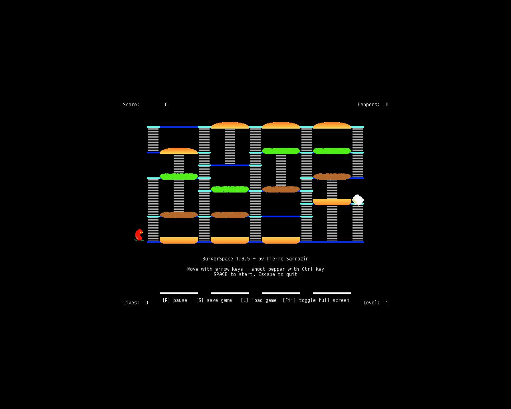 | [SHA256](./burgerspace/SHA256SUMS) | N/A |
| [bustle](./bustle) | arm64  | ubuntu-noble | 0.8.0-2build2 |  | [SHA256](./bustle/SHA256SUMS) | N/A |
| [butt](./butt) | arm64  | ubuntu-noble | 0.1.37-2build4 |  | [SHA256](./butt/SHA256SUMS) | N/A |
| [buzztrax](./buzztrax) | arm64  | ubuntu-noble | 0.10.2-9build2 |  | [SHA256](./buzztrax/SHA256SUMS) | N/A |
| [bzflag-client](./bzflag-client) | arm64  | ubuntu-noble | 2.4.26-1build3 | 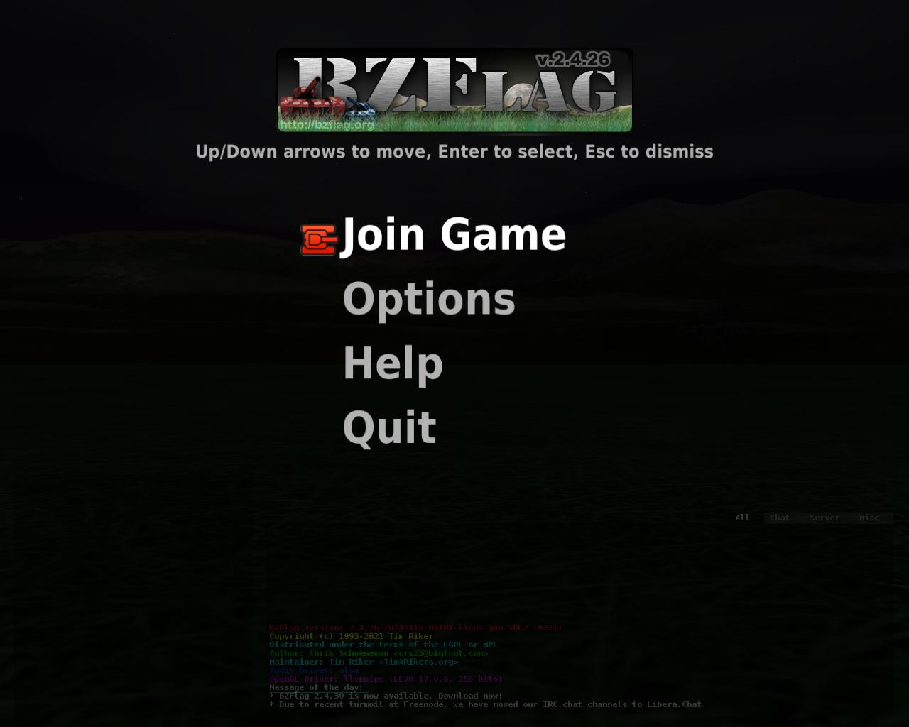 | [SHA256](./bzflag-client/SHA256SUMS) | N/A |
| [c-evo-dh-gtk2](./c-evo-dh-gtk2) | arm64  | ubuntu-noble | 1.10-1build3 |   | [SHA256](./c-evo-dh-gtk2/SHA256SUMS) | N/A |
| [cadabra2](./cadabra2) | arm64  | ubuntu-noble | 2.4.5.4-0ubuntu1-20250327 | 失败 | N/A | N/A |
| [caffeine](./caffeine) | arm64  | ubuntu-noble | 2.9.12-1-20250327 | 失败 | N/A | N/A |
| [cairo-dock-core](./cairo-dock-core) | arm64  | ubuntu-noble | 3.4.1+git20201103.0836f5d1-1build3 |   | [SHA256](./cairo-dock-core/SHA256SUMS) | N/A |
| [caja](./caja) | arm64  | ubuntu-noble | 1.26.3-1build3-20250327 | 失败 | N/A | N/A |
| [caja-actions](./caja-actions) | arm64  | ubuntu-noble | 1.27.0-1build3 | 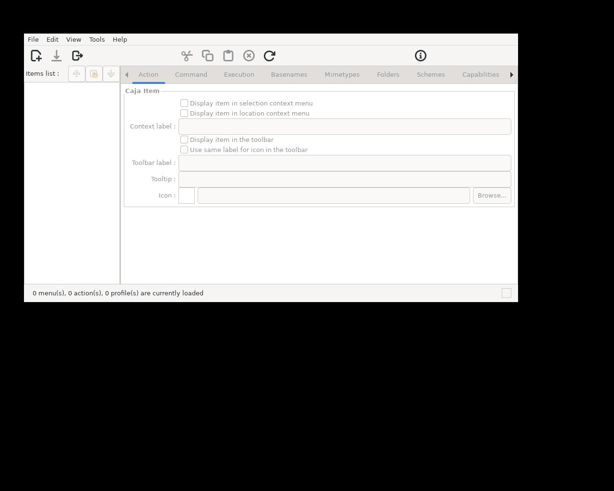 | [SHA256](./caja-actions/SHA256SUMS) | N/A |
| [caja-eiciel](./caja-eiciel) | arm64  | ubuntu-noble | 1.20.1-3build2 | 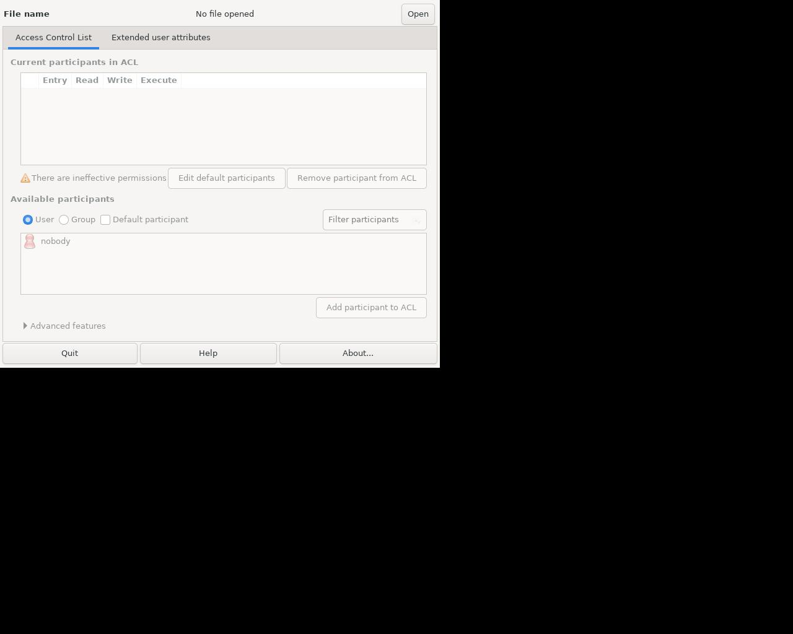 | N/A | N/A |
| [caja-seahorse](./caja-seahorse) | arm64  | ubuntu-noble | 1.18.5-3-20250327 | 失败 | N/A | N/A |
| [calamares](./calamares) | arm64  | ubuntu-noble | 3.3.5-0ubuntu4-20250327 | 失败 | N/A | N/A |
| [calamares-settings-debian](./calamares-settings-debian) | arm64  | ubuntu-noble | 13.0.5-1-20250327 | 失败 | N/A | N/A |
| [calamares-settings-kubuntu](./calamares-settings-kubuntu) | arm64  | ubuntu-noble | 24.04.40-20250327 | 失败 | N/A | N/A |
| [calamares-settings-lubuntu](./calamares-settings-lubuntu) | arm64  | ubuntu-noble | 24.04.40-20250327 | 失败 | N/A | N/A |
| [calamares-settings-ubuntu-unity](./calamares-settings-ubuntu-unity) | arm64  | ubuntu-noble | 24.04.40-20250327 | 失败 | N/A | N/A |
| [calc-common](./calc-common) | arm64  | ubuntu-noble | 2.15.0.4-1build2-20250327 | 失败 | N/A | N/A |
| [calf-plugins](./calf-plugins) | arm64  | ubuntu-noble | 0.90.3-4build2-20250327 | 失败 | N/A | N/A |
| [calibre](./calibre) | arm64  | ubuntu-noble | 7.6.0+ds-1build1-20250327 | 失败 | N/A | N/A |
| [calindori](./calindori) | arm64  | ubuntu-noble | 23.08.5-0ubuntu4 | 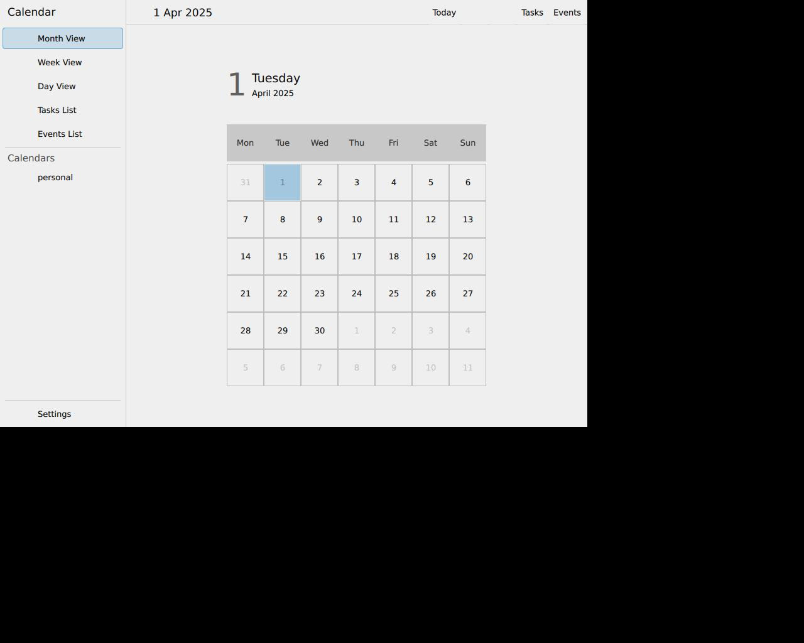 | N/A | N/A |
| [calligra-data](./calligra-data) | arm64  | ubuntu-noble | 3.2.1+dfsg-8build4-20250327 | 失败 | N/A | N/A |
| [calligra-gemini](./calligra-gemini) | arm64  | ubuntu-noble | 3.2.1+dfsg-8build4 |  | N/A | N/A |
| [calligraplan](./calligraplan) | arm64  | ubuntu-noble | 3.3.0-2build2 |   | N/A | N/A |
| [calligrasheets](./calligrasheets) | arm64  | ubuntu-noble | 3.2.1+dfsg-8build4 |  | N/A | N/A |
| [calligrastage](./calligrastage) | arm64  | ubuntu-noble | 3.2.1+dfsg-8build4 |  | N/A | N/A |
| [calligrawords](./calligrawords) | arm64  | ubuntu-noble | 3.2.1+dfsg-8build4 |  | N/A | N/A |
| [camera.app](./camera.app) | arm64  | ubuntu-noble | 0.8.0-13build4 |  | [SHA256](./camera.app/SHA256SUMS) | N/A |
| [caneda](./caneda) | arm64  | ubuntu-noble | 0.3.1+gitg08e22168-1build2 |  | [SHA256](./caneda/SHA256SUMS) | N/A |
| [cantata](./cantata) | arm64  | ubuntu-noble | 2.5.0.ds1-2build3 |  | [SHA256](./cantata/SHA256SUMS) | N/A |
| [cantor](./cantor) | arm64  | ubuntu-noble | 23.08.5-0ubuntu4.2 | 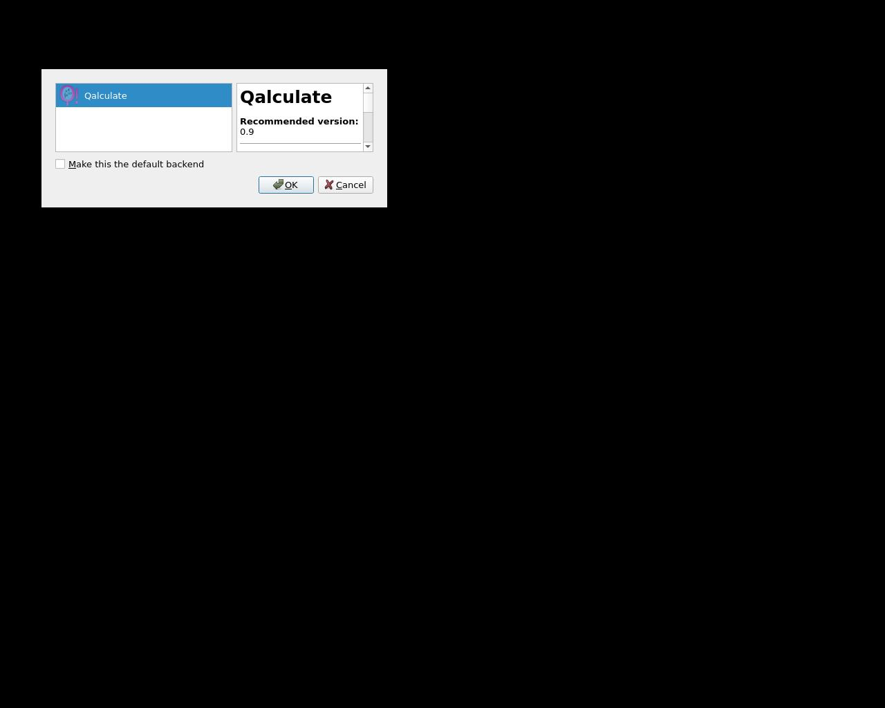 | N/A | N/A |
| [carburetor](./carburetor) | arm64  | ubuntu-noble | 4.5.1-1-20250327 | 失败 | N/A | N/A |
| [cardpeek](./cardpeek) | arm64  | ubuntu-noble | 0.8.4-1.3build1 |  | [SHA256](./cardpeek/SHA256SUMS) | N/A |
| [carmetal](./carmetal) | arm64  | ubuntu-noble | 4.3-2-20250327 | 失败 | N/A | N/A |
| [cataclysm-dda-sdl](./cataclysm-dda-sdl) | arm64  | deepin-v23 | 0.G-4deepin1 |  | [SHA256](./cataclysm-dda-sdl/SHA256SUMS) | N/A |
| [catfish](./catfish) | arm64  | ubuntu-noble | 4.16.4-2-20250327 | 失败 | N/A | N/A |
| [caveexpress](./caveexpress) | arm64  | ubuntu-noble | 2.5.2-2 |  | [SHA256](./caveexpress/SHA256SUMS) | N/A |
| [cavepacker](./cavepacker) | arm64  | ubuntu-noble | 2.5.2-2 |  | [SHA256](./cavepacker/SHA256SUMS) | N/A |
| [cb2bib](./cb2bib) | arm64  | ubuntu-noble | 2.0.1-2build2 |   | N/A | N/A |
| [cc.lotuscard.demo](./cc.lotuscard.demo) | arm64  | deepin-v23 | 1.0.0.0-20250327 | 失败 | N/A | N/A |
| [cdogs-sdl](./cdogs-sdl) | arm64  | ubuntu-noble | 2.0.0+dfsg-1 |  | [SHA256](./cdogs-sdl/SHA256SUMS) | N/A |
| [cecilia](./cecilia) | arm64  | ubuntu-noble | 5.4.1-2 |  | [SHA256](./cecilia/SHA256SUMS) | N/A |
| [ceferino](./ceferino) | arm64  | ubuntu-noble | 0.97.8+svn37-3 |  | [SHA256](./ceferino/SHA256SUMS) | N/A |
| [celluloid](./celluloid) | arm64  | ubuntu-noble | 0.26-1build2 |  | [SHA256](./celluloid/SHA256SUMS) | N/A |
| [ceni](./ceni) | arm64  | ubuntu-noble | 2.33-4-20250327 | 失败 | N/A | N/A |
| [cenon.app](./cenon.app) | arm64  | ubuntu-noble | 4.0.6+ds1-2build5 |  | [SHA256](./cenon.app/SHA256SUMS) | N/A |
| [cervisia](./cervisia) | arm64  | ubuntu-noble | 23.08.5-0ubuntu3 |  | N/A | N/A |
| [cf900](./cf900) | arm64  | deepin-v23 | 1.0 |   | N/A | N/A |
| [cgoban](./cgoban) | arm64  | deepin-v23 | 1.9.14-19-20250327 | 失败 | N/A | N/A |
| [charmap.app](./charmap.app) | arm64  | ubuntu-noble | 0.3~rc1-4build3 |  | [SHA256](./charmap.app/SHA256SUMS) | N/A |
| [charmtimetracker](./charmtimetracker) | arm64  | ubuntu-noble | 1.12.0-3build2 |  | N/A | N/A |
| [chatty](./chatty) | arm64  | ubuntu-noble | 0.8.2-1ubuntu2 |  | N/A | N/A |
| [cheese](./cheese) | arm64  | ubuntu-noble | 44.1-1build4 |  | N/A | N/A |
| [cheesecutter](./cheesecutter) | arm64  | ubuntu-noble | 2.9+git20211011-2-20250327 | 失败 | N/A | N/A |
| [chemtool](./chemtool) | arm64  | ubuntu-noble | 1.6.14-6build2 |  | [SHA256](./chemtool/SHA256SUMS) | N/A |
| [cherrytree](./cherrytree) | arm64  | ubuntu-noble | 1.1.2+dfsg-1 |  | [SHA256](./cherrytree/SHA256SUMS) | N/A |
| [chessx](./chessx) | arm64  | ubuntu-noble | 1.4.6-2build3 |  | [SHA256](./chessx/SHA256SUMS) | N/A |
| [chewing-editor](./chewing-editor) | arm64  | ubuntu-noble | 0.1.1-5build2 |  | [SHA256](./chewing-editor/SHA256SUMS) | N/A |
| [chiaki](./chiaki) | arm64  | ubuntu-noble | 2.2.0-1build3 |  | [SHA256](./chiaki/SHA256SUMS) | N/A |
| [chirp](./chirp) | arm64  | ubuntu-noble | 20240224-1ubuntu0.1 | 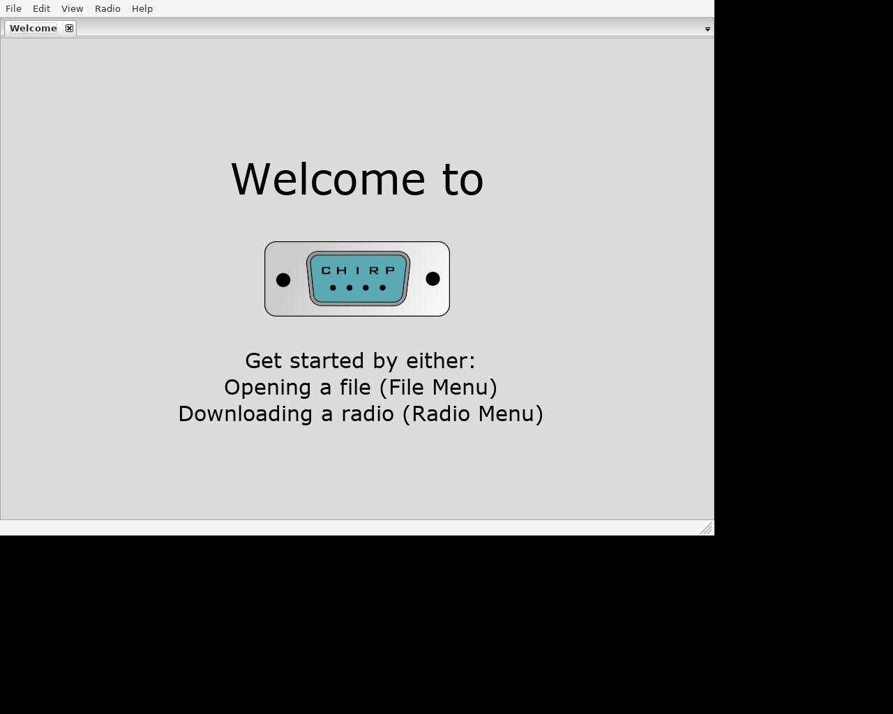 | [SHA256](./chirp/SHA256SUMS) | N/A |
| [chocolate-doom](./chocolate-doom) | arm64  | ubuntu-noble | 3.0.1+really3.0.0+git1548-1build2 |    | [SHA256](./chocolate-doom/SHA256SUMS) | N/A |
| [choqok](./choqok) | arm64  | ubuntu-noble | 1.7.0-2build2 |  | N/A | N/A |
| [chroma](./chroma) | arm64  | ubuntu-noble | 1.19-1ubuntu1 |  | [SHA256](./chroma/SHA256SUMS) | N/A |
| [chromium](./chromium) | arm64  | deepin-v23 | 128.0.6613.84-1deepin1-20250327 | 失败 | N/A | N/A |
| [chromium-browser](./chromium-browser) | arm64  | ubuntu-noble | 1snap1-0ubuntu2-20250327 | 失败 | N/A | N/A |
| [chromium-bsu](./chromium-bsu) | arm64  | ubuntu-noble | 0.9.16.1-3 |  | [SHA256](./chromium-bsu/SHA256SUMS) | N/A |
| [chromono](./chromono) | arm64  | ubuntu-noble | 1.1.1-1.1 |  | N/A | N/A |
| [cinnamon](./cinnamon) | arm64  | ubuntu-noble | 6.0.4-4-20250327 | 失败 | N/A | N/A |
| [cinnamon-control-center](./cinnamon-control-center) | arm64  | ubuntu-noble | 6.0.1-3-20250327 | 失败 | N/A | N/A |
| [cinnamon-screensaver](./cinnamon-screensaver) | arm64  | ubuntu-noble | 6.0.3-1build2-20250327 | 失败 | N/A | N/A |
| [cinnamon-settings-daemon](./cinnamon-settings-daemon) | arm64  | ubuntu-noble | 6.0.0-1build4-20250327 | 失败 | N/A | N/A |
| [circuslinux](./circuslinux) | arm64  | ubuntu-noble | 1.0.3-35 |  | N/A | N/A |
| [ckb-next](./ckb-next) | arm64  | ubuntu-noble | 0.6.0+dfsg-0.2build2 |  | [SHA256](./ckb-next/SHA256SUMS) | N/A |
| [clamtk](./clamtk) | arm64  | ubuntu-noble | 6.07-1.1-20250327 | 失败 | N/A | N/A |
| [clamz](./clamz) | arm64  | ubuntu-noble | 0.5-2.1build2-20250327 | 失败 | N/A | N/A |
| [clapper](./clapper) | arm64  | ubuntu-noble | 0.5.2-8build2-20250327 | 失败 | N/A | N/A |
| [classicmenu-indicator](./classicmenu-indicator) | arm64  | ubuntu-noble | 0.11-0ubuntu1-20250327 | 失败 | N/A | N/A |
| [classified-ads](./classified-ads) | arm64  | ubuntu-noble | 0.15-1build3 |  | [SHA256](./classified-ads/SHA256SUMS) | N/A |
| [claws-mail](./claws-mail) | arm64  | ubuntu-noble | 4.2.0-2build7-20250327 | 失败 | N/A | N/A |
| [clawsker](./clawsker) | arm64  | ubuntu-noble | 1.3.8-1-20250327 | 失败 | N/A | N/A |
| [clementine](./clementine) | arm64  | ubuntu-noble | 1.4.0~rc1+git867-g9ef681b0e+dfsg-1ubuntu4 |  | [SHA256](./clementine/SHA256SUMS) | N/A |
| [clipit](./clipit) | arm64  | ubuntu-noble | 1.4.5+git20210313-2 |  | [SHA256](./clipit/SHA256SUMS) | N/A |
| [clips](./clips) | arm64  | ubuntu-noble | 6.30-4.1build1 |  | [SHA256](./clips/SHA256SUMS) | N/A |
| [cloudcompare](./cloudcompare) | arm64  | ubuntu-noble | 2.11.3-7.1build3 |  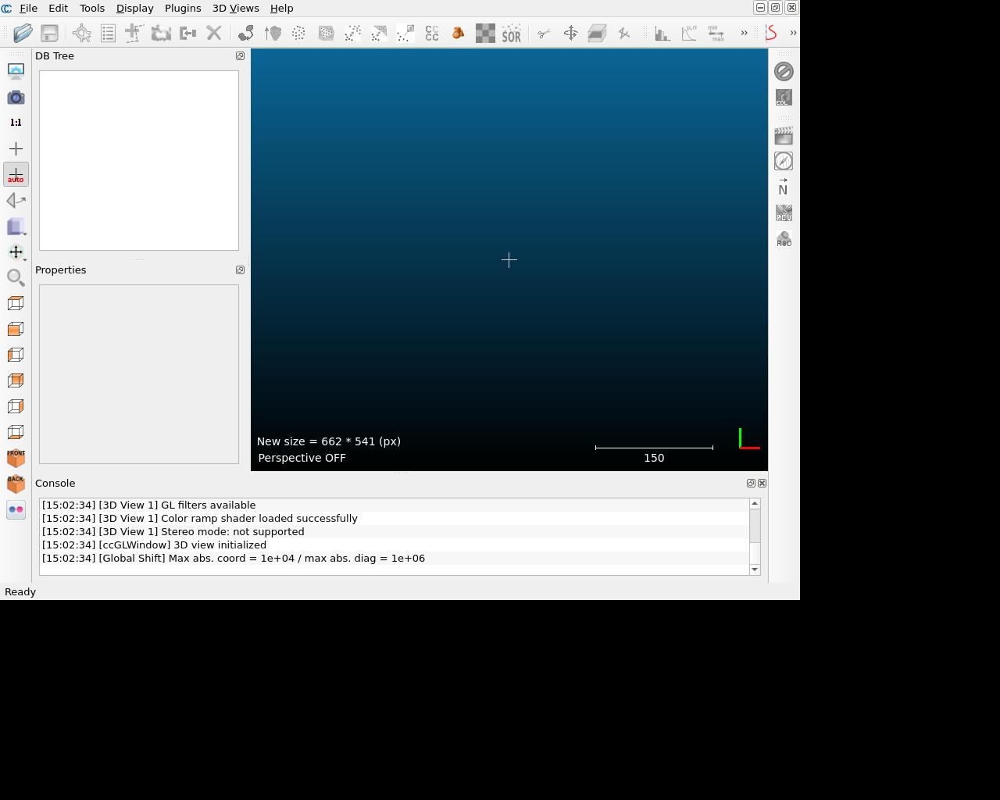 | [SHA256](./cloudcompare/SHA256SUMS) | N/A |
| [clustalx](./clustalx) | arm64  | ubuntu-noble | 2.1+lgpl-9build2 |  | [SHA256](./clustalx/SHA256SUMS) | N/A |
| [clusterssh](./clusterssh) | arm64  | ubuntu-noble | 4.16-4 |  | N/A | N/A |
| [cmake-qt-gui](./cmake-qt-gui) | arm64  | deepin-v23 | 3.30.5-1 |  | N/A | N/A |
| [cmatrix](./cmatrix) | arm64  | ubuntu-noble | 2.0-6-20250327 | 失败 | N/A | N/A |
| [cmst](./cmst) | arm64  | ubuntu-noble | 2023.03.14-1build2 |  | [SHA256](./cmst/SHA256SUMS) | N/A |
| [cn.com.hisign.hidscanner](./cn.com.hisign.hidscanner) | arm64  | deepin-v23 | 1.0.0-1-20250327 | 失败 | N/A | N/A |
| [cn.com.hisign.hsivlive](./cn.com.hisign.hsivlive) | arm64  | deepin-v23 | 3.10.8-20250327 | 失败 | N/A | N/A |
| [cn.com.hsic.demo](./cn.com.hsic.demo) | arm64  | deepin-v23 | 1.0.0-1-20250327 | 失败 | N/A | N/A |
| [cn.com.secuprint.smlmfp](./cn.com.secuprint.smlmfp) | arm64  | deepin-v23 | 1.0.3.0 | 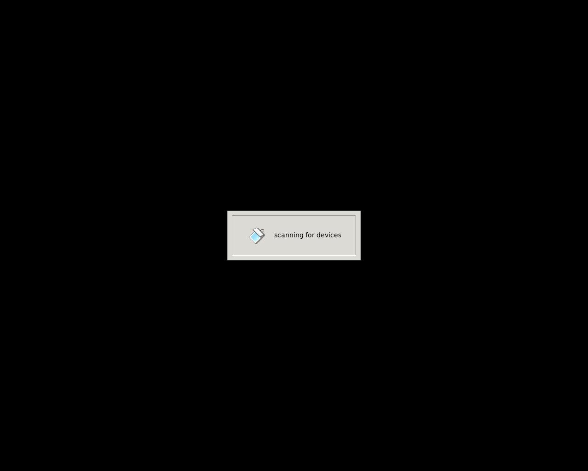 | N/A | N/A |
| [cn.com.signpro.hwtabletserv](./cn.com.signpro.hwtabletserv) | arm64  | deepin-v23 | 2.7+b69-20250327 | 失败 | N/A | N/A |
| [cn.com.signpro.sphttpserv](./cn.com.signpro.sphttpserv) | arm64  | deepin-v23 | 3.2+b83-20250327 | 失败 | N/A | N/A |
| [cn.dascom.dc8600-driver](./cn.dascom.dc8600-driver) | arm64  | deepin-v23 | 1.0.0-20250327 | 失败 | N/A | N/A |
| [cn.hengbao.hbd7600-driver](./cn.hengbao.hbd7600-driver) | arm64  | deepin-v23 | 1.0.8-20250327 | 失败 | N/A | N/A |
| [cn.huahom.pam.unlock](./cn.huahom.pam.unlock) | arm64  | deepin-v23 | 0.1.0-20250327 | 失败 | N/A | N/A |
| [cn.microdone.passguardservice](./cn.microdone.passguardservice) | arm64  | deepin-v23 | 1.0.0.0-20250327 | 失败 | N/A | N/A |
| [cn.microdone.passguardservice.bj](./cn.microdone.passguardservice.bj) | arm64  | deepin-v23 | 1.0.0.0-20250327 | 失败 | N/A | N/A |
| [cn.microdone.passguardservice.nb](./cn.microdone.passguardservice.nb) | arm64  | deepin-v23 | 1.0.0.7 |  | N/A | N/A |
| [cn.microdone.signmessenger.hz](./cn.microdone.signmessenger.hz) | arm64  | deepin-v23 | 1.0.0.0-20250327 | 失败 | N/A | N/A |
| [cn.microdone.signmessenger.nb](./cn.microdone.signmessenger.nb) | arm64  | deepin-v23 | 1.0.0.2 |  | N/A | N/A |
| [cn.naturalcard.eserver](./cn.naturalcard.eserver) | arm64  | deepin-v23 | 1.0.0.1-20250327 | 失败 | N/A | N/A |
| [cn.net.zonewin.smartscanner](./cn.net.zonewin.smartscanner) | arm64  | deepin-v23 | 1.0.11 |  | [SHA256](./cn.net.zonewin.smartscanner/SHA256SUMS) | N/A |
| [cn.tianyi.eserver](./cn.tianyi.eserver) | arm64  | deepin-v23 | 1.0.0.1-20250327 | 失败 | N/A | N/A |
| [cnrdrvcups-ufr2lt-uk](./cnrdrvcups-ufr2lt-uk) | arm64  | deepin-v23 | 5.02-1 |  | N/A | N/A |
| [coccinella](./coccinella) | arm64  | ubuntu-noble | 0.96.20-9 |  | [SHA256](./coccinella/SHA256SUMS) | N/A |
| [codeblocks-common](./codeblocks-common) | arm64  | ubuntu-noble | 20.03+svn13046-0.3build2-20250327 | 失败 | N/A | N/A |
| [codelite](./codelite) | arm64  | ubuntu-noble | 17.0.0+dfsg-2build2 |  | N/A | N/A |
| [codfis](./codfis) | arm64  | ubuntu-noble | 0.4.7-2build4 |  | [SHA256](./codfis/SHA256SUMS) | N/A |
| [colmap](./colmap) | arm64  | ubuntu-noble | 3.9.1-2build2 |  | [SHA256](./colmap/SHA256SUMS) | N/A |
| [colobot](./colobot) | arm64  | ubuntu-noble | 0.2.1-1build3 |  | [SHA256](./colobot/SHA256SUMS) | N/A |
| [color-picker](./color-picker) | arm64  | ubuntu-noble | 1.0.3-2ubuntu3 |  | N/A | N/A |
| [colorcode](./colorcode) | arm64  | ubuntu-noble | 0.8.7-1build2 |  | [SHA256](./colorcode/SHA256SUMS) | N/A |
| [colord-kde](./colord-kde) | arm64  | ubuntu-noble | 23.08.5-0ubuntu4-20250327 | 失败 | N/A | N/A |
| [colorhug-client](./colorhug-client) | arm64  | ubuntu-noble | 0.2.8-3build4 |  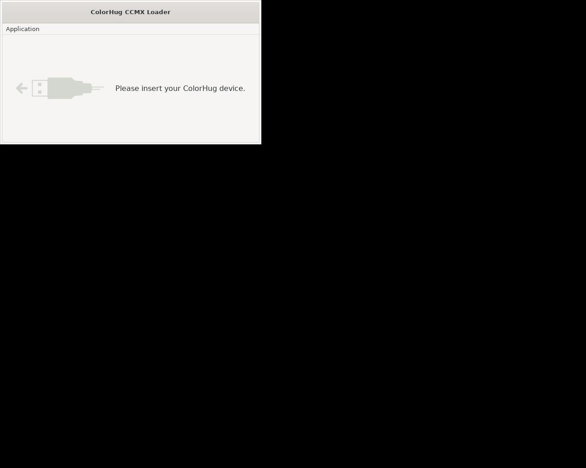   | N/A | N/A |
| [colossal-cave-adventure](./colossal-cave-adventure) | arm64  | ubuntu-noble | 1.6-1 |  | [SHA256](./colossal-cave-adventure/SHA256SUMS) | N/A |
| [com.arc-uds.smartscan](./com.arc-uds.smartscan) | arm64  | deepin-v23 | 3.1.0.1 |  | N/A | N/A |
| [com.avision.a4pq-series](./com.avision.a4pq-series) | arm64  | deepin-v23 | 1.0.0-23293 |   | N/A | N/A |
| [com.avision.avision-sane](./com.avision.avision-sane) | arm64  | deepin-v23 | 20231120-8.6.10.020-20250327 | 失败 | N/A | N/A |
| [com.bjnja.njaep3kgmutil](./com.bjnja.njaep3kgmutil) | arm64  | deepin-v23 | 1.0.2-20250327 | 失败 | N/A | N/A |
| [com.btit.linuxaction](./com.btit.linuxaction) | arm64  | deepin-v23 | 3.1.10.24193-uosv20-20250327 | 失败 | N/A | N/A |
| [com.canon.ufr2](./com.canon.ufr2) | arm64  | deepin-v23 | 6.00-1.00-20250327 | 失败 | N/A | N/A |
| [com.centerm.gwq](./com.centerm.gwq) | arm64  | deepin-v23 | 2021.3.26-1 |  | N/A | N/A |
| [com.centerm.gwq.common](./com.centerm.gwq.common) | arm64  | deepin-v23 | 1.0.0.0-1-20250327 | 失败 | N/A | N/A |
| [com.colortrac](./com.colortrac) | arm64  | deepin-v23 | 1.0.7-20250327 | 失败 | N/A | N/A |
| [com.comet.comet-sane](./com.comet.comet-sane) | arm64  | deepin-v23 | 20240814-11.7.11.063-20250327 | 失败 | N/A | N/A |
| [com.contexscan](./com.contexscan) | arm64  | deepin-v23 | 1.0.7-20250327 | 失败 | N/A | N/A |
| [com.deepin.gomoku](./com.deepin.gomoku) | arm64  | deepin-v23 | 1.0.11 | 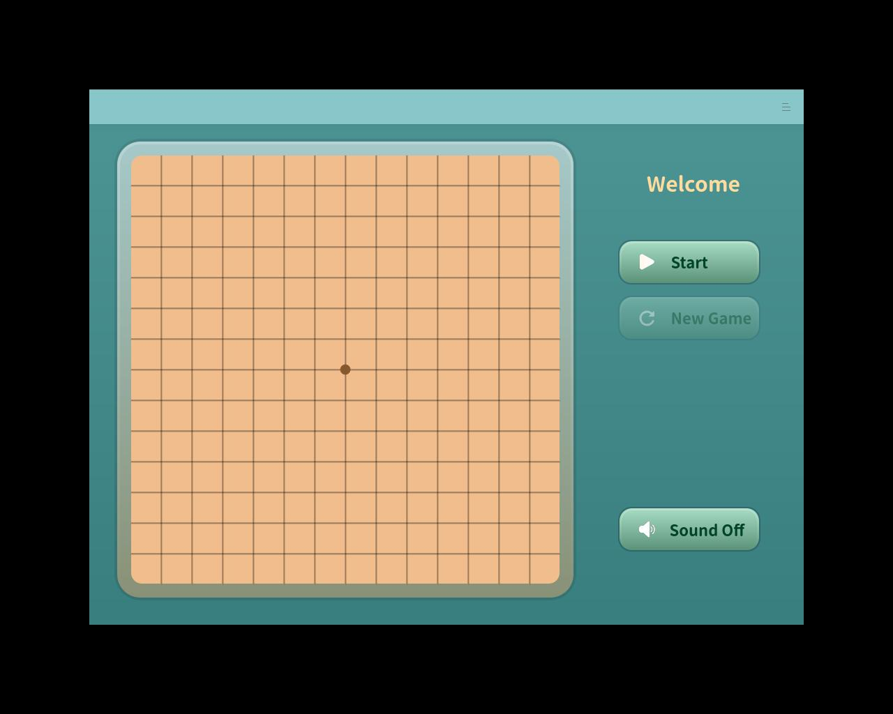 | N/A | N/A |
| [com.deepin.lianliankan](./com.deepin.lianliankan) | arm64  | deepin-v23 | 1.0.12 |  | N/A | N/A |
| [com.deepin.microbox-scanner](./com.deepin.microbox-scanner) | arm64  | deepin-v23 | 1.2.2-20250327 | 失败 | N/A | N/A |
| [com.deli.camera](./com.deli.camera) | arm64  | deepin-v23 | 2.1.7.9-20250327 | 失败 | N/A | N/A |
| [com.deli.printer-c111](./com.deli.printer-c111) | arm64  | deepin-v23 | 1.0.038-20250327 | 失败 | N/A | N/A |
| [com.deli.printer-d11](./com.deli.printer-d11) | arm64  | deepin-v23 | 1.10-1-20250327 | 失败 | N/A | N/A |
| [com.deli.printer-d21](./com.deli.printer-d21) | arm64  | deepin-v23 | 1.10-1-20250327 | 失败 | N/A | N/A |
| [com.delichina.deliscan](./com.delichina.deliscan) | arm64  | deepin-v23 | 4.51.24220.23319-20250327 | 失败 | N/A | N/A |
| [com.elineprint.e-gm3001-an-3in1](./com.elineprint.e-gm3001-an-3in1) | arm64  | deepin-v23 | 1.0.0-20206-20250327 | 失败 | N/A | N/A |
| [com.farshine.ygdevservice](./com.farshine.ygdevservice) | arm64  | deepin-v23 | 2.5.2-20250327 | 失败 | N/A | N/A |
| [com.founder.linuxaction](./com.founder.linuxaction) | arm64  | deepin-v23 | 2.1.96.24335-uosv20 | 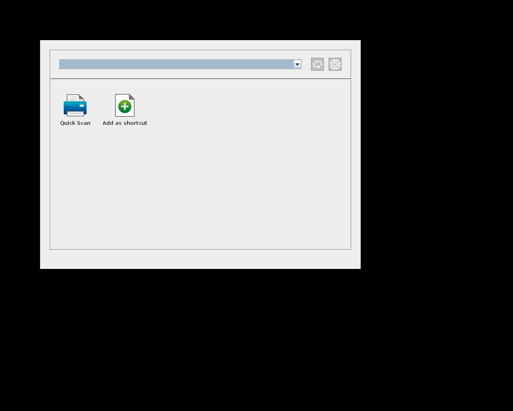 | N/A | N/A |
| [com.founderinternational.founder-sane](./com.founderinternational.founder-sane) | arm64  | deepin-v23 | 20240820-1.6.10.015-20250327 | 失败 | N/A | N/A |
| [com.ftsafe.epass3000gm-spabank](./com.ftsafe.epass3000gm-spabank) | arm64  | deepin-v23 | 1.2.4-1+b1-20250327 | 失败 | N/A | N/A |
| [com.ftsafe.epass3000gmg-hnxa](./com.ftsafe.epass3000gmg-hnxa) | arm64  | deepin-v23 | 1.0.1-1+b1 |  | N/A | N/A |
| [com.ftsafe.interpass3000-cib](./com.ftsafe.interpass3000-cib) | arm64  | deepin-v23 | 1.0.16.d1-1+b1-uos-20250327 | 失败 | N/A | N/A |
| [com.ftsafe.interpass3000-cmbc](./com.ftsafe.interpass3000-cmbc) | arm64  | deepin-v23 | 1.3.13.d0-1+b1 |  | N/A | N/A |
| [com.ftsafe.interpass3000-lfbk](./com.ftsafe.interpass3000-lfbk) | arm64  | deepin-v23 | 1.0.7-1+b1 |  | N/A | N/A |
| [com.ftsafe.interpass3000-nbbank](./com.ftsafe.interpass3000-nbbank) | arm64  | deepin-v23 | 1.0.9-20250327 | 失败 | N/A | N/A |
| [com.ftsafe.interpass3000-rzbank](./com.ftsafe.interpass3000-rzbank) | arm64  | deepin-v23 | 1.0.1-1+b1-20250327 | 失败 | N/A | N/A |
| [com.ftsafe.interpass3000-scb](./com.ftsafe.interpass3000-scb) | arm64  | deepin-v23 | 1.0.5-1+b1-20250327 | 失败 | N/A | N/A |
| [com.ftsafe.interpass3000-wfbank](./com.ftsafe.interpass3000-wfbank) | arm64  | deepin-v23 | 1.0.0.d1-1+b1-20250327 | 失败 | N/A | N/A |
| [com.ftsafe.interpass3000zjrc](./com.ftsafe.interpass3000zjrc) | arm64  | deepin-v23 | 1.2.21-1+b1 |  | N/A | N/A |
| [com.ftsafe.interpasscitic](./com.ftsafe.interpasscitic) | arm64  | deepin-v23 | 1.2.8-1+b1 |  | N/A | N/A |
| [com.fujitsu.fsane](./com.fujitsu.fsane) | arm64  | deepin-v23 | 2.0.1-3-20250327 | 失败 | N/A | N/A |
| [com.fytech.cfs300b](./com.fytech.cfs300b) | arm64  | deepin-v23 | 1.0.0 |  | N/A | N/A |
| [com.fytech.pfs408](./com.fytech.pfs408) | arm64  | deepin-v23 | 2021.5.28 | 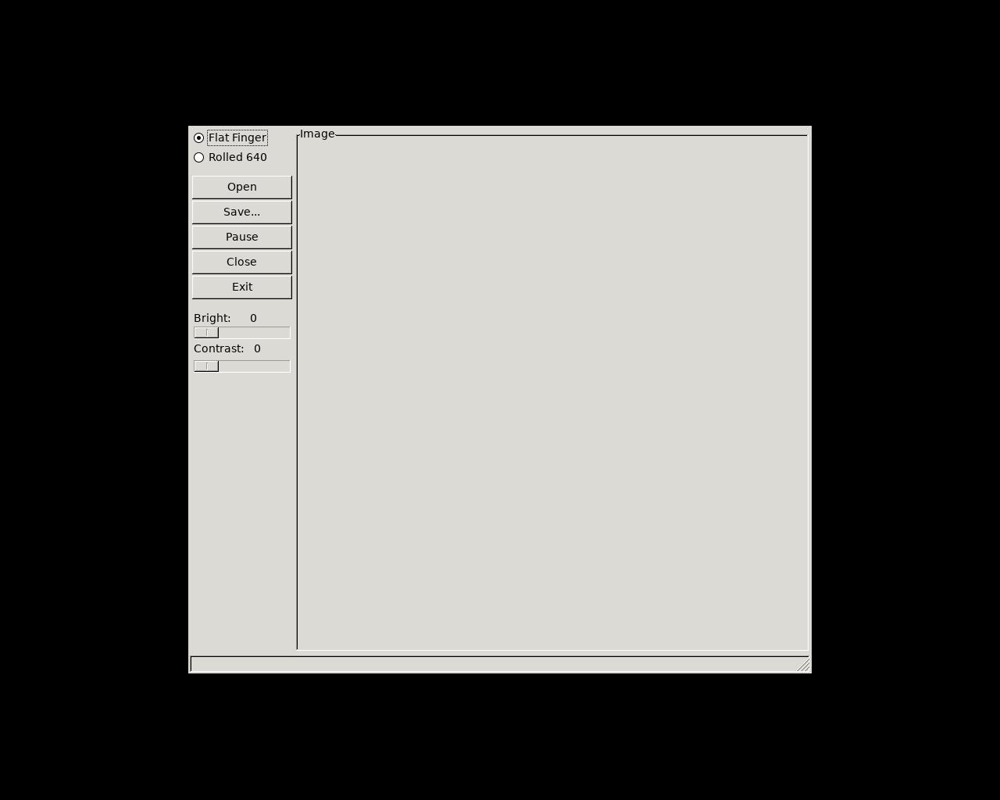 | N/A | N/A |
| [com.fytech.ps1300](./com.fytech.ps1300) | arm64  | deepin-v23 | 1.0.0 |  | N/A | N/A |
| [com.ggimage.ggimage-printer](./com.ggimage.ggimage-printer) | arm64  | deepin-v23 | 1.0.3-1+uos | 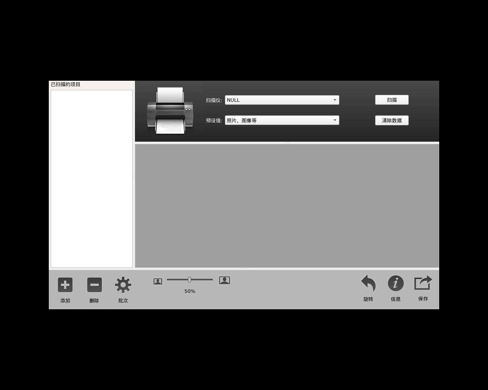 | N/A | N/A |
| [com.gmrz.fido](./com.gmrz.fido) | arm64  | deepin-v23 | 1.0.3.2-20250327 | 失败 | N/A | N/A |
| [com.goke.gksecurity](./com.goke.gksecurity) | arm64  | deepin-v23 | 2.0.3-20250327 | 失败 | N/A | N/A |
| [com.greatwalltech.greatwall-sane](./com.greatwalltech.greatwall-sane) | arm64  | deepin-v23 | 20240918-7.6.10.051-20250327 | 失败 | N/A | N/A |
| [com.gwi.dpm760a-tool](./com.gwi.dpm760a-tool) | arm64  | deepin-v23 | 1.0.0 |  | N/A | N/A |
| [com.haitaichina.htukeytool20079](./com.haitaichina.htukeytool20079) | arm64  | deepin-v23 | 1.0.0.2404081-20250327 | 失败 | N/A | N/A |
| [com.hanguang.hgfchanguangprinter](./com.hanguang.hgfchanguangprinter) | arm64  | deepin-v23 | 1-1-20250327 | 失败 | N/A | N/A |
| [com.hanguang.hgfcscanner](./com.hanguang.hgfcscanner) | arm64  | deepin-v23 | 1-1-20250327 | 失败 | N/A | N/A |
| [com.hanwang.linuxaction-sdk](./com.hanwang.linuxaction-sdk) | arm64  | deepin-v23 | 2.1.53.22043-uosv20 |  | N/A | N/A |
| [com.hsreader.demo](./com.hsreader.demo) | arm64  | deepin-v23 | 1.1.0-20250327 | 失败 | N/A | N/A |
| [com.huagaochina.huagoscan](./com.huagaochina.huagoscan) | arm64  | deepin-v23 | 2.2.3-1+rc4 |  | N/A | N/A |
| [com.huawei.cv81-series](./com.huawei.cv81-series) | arm64  | deepin-v23 | 2.0-88-20250327 | 失败 | N/A | N/A |
| [com.hw.signdriver](./com.hw.signdriver) | arm64  | deepin-v23 | 1.0.0-20250327 | 失败 | N/A | N/A |
| [com.hw99.hanvon-sane](./com.hw99.hanvon-sane) | arm64  | deepin-v23 | 20230206-9.6.10.053-20250327 | 失败 | N/A | N/A |
| [com.joyusing.gwq](./com.joyusing.gwq) | arm64  | deepin-v23 | 1.0.0-20250327 | 失败 | N/A | N/A |
| [com.joyusing.visualizer](./com.joyusing.visualizer) | arm64  | deepin-v23 | 1.0.0-20250327 | 失败 | N/A | N/A |
| [com.joyusing.w05](./com.joyusing.w05) | arm64  | deepin-v23 | 1.0.0-20250327 | 失败 | N/A | N/A |
| [com.kinghun.kinghuncamera](./com.kinghun.kinghuncamera) | arm64  | deepin-v23 | 1.0.0-20250327 | 失败 | N/A | N/A |
| [com.lanxum-ga-series](./com.lanxum-ga-series) | arm64  | deepin-v23 | 1.0.1-20250327 | 失败 | N/A | N/A |
| [com.lanxum.ga2630dn-psm-2in1](./com.lanxum.ga2630dn-psm-2in1) | arm64  | deepin-v23 | 1.0.0-20301-20250327 | 失败 | N/A | N/A |
| [com.lanxum.ga30-psm-2in1](./com.lanxum.ga30-psm-2in1) | arm64  | deepin-v23 | 1.0.0-21032-20250327 | 失败 | N/A | N/A |
| [com.lanxum.ga7030dn-psm-2in1](./com.lanxum.ga7030dn-psm-2in1) | arm64  | deepin-v23 | 1.0.0-21034-20250327 | 失败 | N/A | N/A |
| [com.lanxum.gasd06.printerdriver](./com.lanxum.gasd06.printerdriver) | arm64  | deepin-v23 | 1.0.0-5+0-20250327 | 失败 | N/A | N/A |
| [com.lanxum.gd34xxdn](./com.lanxum.gd34xxdn) | arm64  | deepin-v23 | 3.3.0 |  | N/A | N/A |
| [com.lanxum.linuxaction](./com.lanxum.linuxaction) | arm64  | deepin-v23 | 2.1.91.24084-uosv20 |  | N/A | N/A |
| [com.lanxum.printdevicemanager](./com.lanxum.printdevicemanager) | arm64  | deepin-v23 | 2.0.0-1+0-20250327 | 失败 | N/A | N/A |
| [com.lanxum.rongtuscan](./com.lanxum.rongtuscan) | arm64  | deepin-v23 | 2.0.9 | 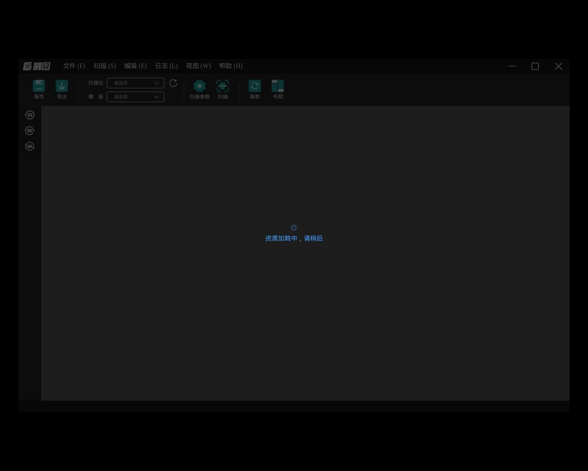 | N/A | N/A |
| [com.lanxum.sp1800-1-driver](./com.lanxum.sp1800-1-driver) | arm64  | deepin-v23 | 1.1.0-20250327 | 失败 | N/A | N/A |
| [com.lanxum.sp1800-1-tool](./com.lanxum.sp1800-1-tool) | arm64  | deepin-v23 | 1.1.0-20250327 | 失败 | N/A | N/A |
| [com.lenovo.lenovo-gpy](./com.lenovo.lenovo-gpy) | arm64  | deepin-v23 | 2.1.7.3-20250327 | 失败 | N/A | N/A |
| [com.microtek.scaner](./com.microtek.scaner) | arm64  | deepin-v23 | 1.0.0-9c-20250327 | 失败 | N/A | N/A |
| [com.mindeo.scannertext](./com.mindeo.scannertext) | arm64  | deepin-v23 | 1.2.2.4 |  | N/A | N/A |
| [com.mt.cnlinux](./com.mt.cnlinux) | arm64  | deepin-v23 | 1.0.0.3 | 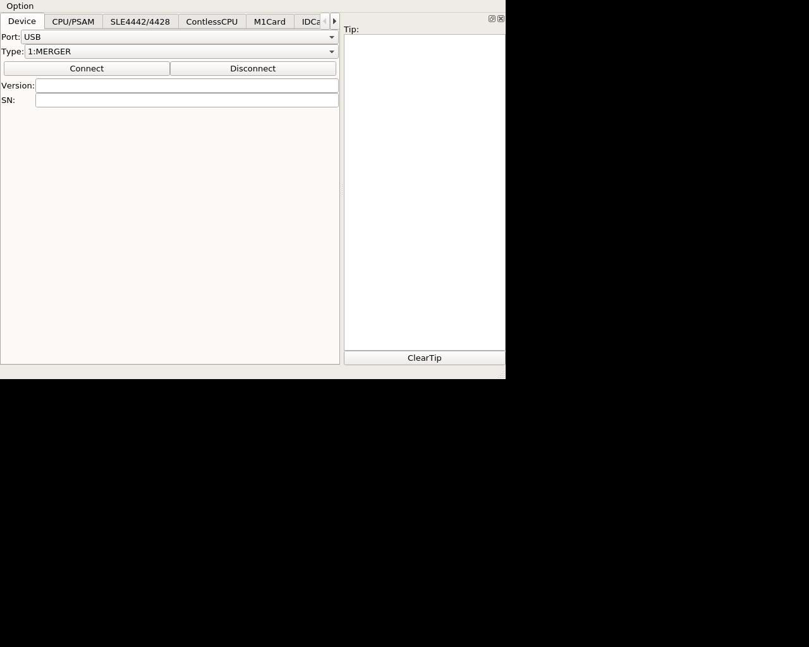 | N/A | N/A |
| [com.mt.cnsscard](./com.mt.cnsscard) | arm64  | deepin-v23 | 1.0.0.4 |  | N/A | N/A |
| [com.nantian.bpport](./com.nantian.bpport) | arm64  | deepin-v23 | 1.0.0.20210910 |  | N/A | N/A |
| [com.nantian.clientscreen](./com.nantian.clientscreen) | arm64  | deepin-v23 | 1.0.2.02261802-20250327 | 失败 | N/A | N/A |
| [com.nantian.mmjp](./com.nantian.mmjp) | arm64  | deepin-v23 | 1.0.0.20210312-20250327 | 失败 | N/A | N/A |
| [com.nbdeli.deli-sane](./com.nbdeli.deli-sane) | arm64  | deepin-v23 | 20240820-5.7.10.027-20250327 | 失败 | N/A | N/A |
| [com.ncmem.down2](./com.ncmem.down2) | arm64  | deepin-v23 | 2020.12.3-1-20250327 | 失败 | N/A | N/A |
| [com.ncmem.up6](./com.ncmem.up6) | arm64  | deepin-v23 | 2020.12.3-1-20250327 | 失败 | N/A | N/A |
| [com.ncmem.wordpaster](./com.ncmem.wordpaster) | arm64  | deepin-v23 | 2020.12.3-1-20250327 | 失败 | N/A | N/A |
| [com.neutralchina.neuscan](./com.neutralchina.neuscan) | arm64  | deepin-v23 | 4.52.26220.24289 |  | N/A | N/A |
| [com.pantum.pantum](./com.pantum.pantum) | arm64  | deepin-v23 | 7.4.182-1+uos-20250327 | 失败 | N/A | N/A |
| [com.pantum.pantum-235-325-2165](./com.pantum.pantum-235-325-2165) | arm64  | deepin-v23 | 1.0.0ab02-1+uos |     | N/A | N/A |
| [com.pantum.pantum-scan-assistant](./com.pantum.pantum-scan-assistant) | arm64  | deepin-v23 | 3.0.1 |  | N/A | N/A |
| [com.pantum.pantumprint](./com.pantum.pantumprint) | arm64  | deepin-v23 | 1.1.24-1+uos |   | N/A | N/A |
| [com.plustek.linuxaction](./com.plustek.linuxaction) | arm64  | deepin-v23 | 3.0.6.22502-uosv20-20250327 | 失败 | N/A | N/A |
| [com.ricoh.pfu.fsane](./com.ricoh.pfu.fsane) | arm64  | deepin-v23 | 4.0.1-1-20250327 | 失败 | N/A | N/A |
| [com.rightcolor](./com.rightcolor) | arm64  | deepin-v23 | 1.0.7-20250327 | 失败 | N/A | N/A |
| [com.scanner.hanguang](./com.scanner.hanguang) | arm64  | deepin-v23 | 1.0-6-20250327 | 失败 | N/A | N/A |
| [com.semxum.aisystem](./com.semxum.aisystem) | arm64  | deepin-v23 | 1.0.0-2+b1-20250327 | 失败 | N/A | N/A |
| [com.sogou.ime.ng.fcitx5.deepin](./com.sogou.ime.ng.fcitx5.deepin) | arm64  | deepin-v23 | 10.0.9.0.8-981-20250327 | 失败 | N/A | N/A |
| [com.sunrise.device](./com.sunrise.device) | arm64  | deepin-v23 | 2020.09.15-1-20250327 | 失败 | N/A | N/A |
| [com.sxylzinfo.sxsscardsv](./com.sxylzinfo.sxsscardsv) | arm64  | deepin-v23 | 3.5.15 | 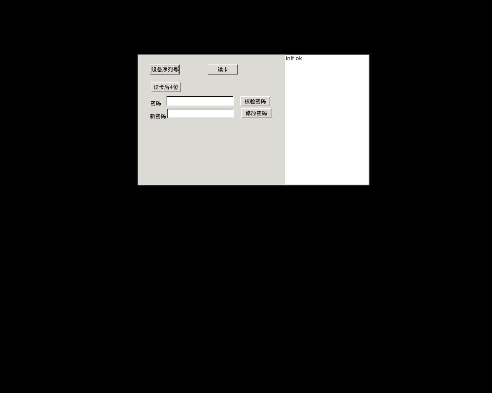 | N/A | N/A |
| [com.szshenshu.aidemo](./com.szshenshu.aidemo) | arm64  | deepin-v23 | 2022.01.15-1 |  | N/A | N/A |
| [com.tdr.uosicbc](./com.tdr.uosicbc) | arm64  | deepin-v23 | 9.0.6-5-20250327 | 失败 | N/A | N/A |
| [com.tg.aqdl](./com.tg.aqdl) | arm64  | deepin-v23 | 5.1.0.4 |  | N/A | N/A |
| [com.toec.oem3000dn](./com.toec.oem3000dn) | arm64  | deepin-v23 | 2.6-4 |  | N/A | N/A |
| [com.toec.toeca3oemseries](./com.toec.toeca3oemseries) | arm64  | deepin-v23 | 1.0-20250327 | 失败 | N/A | N/A |
| [com.toec.toeca3series](./com.toec.toeca3series) | arm64  | deepin-v23 | 2.5-7.1-20250327 | 失败 | N/A | N/A |
| [com.toec.toeca4faxseries](./com.toec.toeca4faxseries) | arm64  | deepin-v23 | 2.6-4.1-20250327 | 失败 | N/A | N/A |
| [com.toec.toeca4printer](./com.toec.toeca4printer) | arm64  | deepin-v23 | 1.0-18.2-20250327 | 失败 | N/A | N/A |
| [com.toec.toeca4series](./com.toec.toeca4series) | arm64  | deepin-v23 | 2.7-3-20250327 | 失败 | N/A | N/A |
| [com.toec.toecmyseries](./com.toec.toecmyseries) | arm64  | deepin-v23 | 3.0.0.11-20250327 | 失败 | N/A | N/A |
| [com.toec.toecrlseries](./com.toec.toecrlseries) | arm64  | deepin-v23 | 1.1-7-20250327 | 失败 | N/A | N/A |
| [com.toec.toecrlwseries](./com.toec.toecrlwseries) | arm64  | deepin-v23 | 1.1-1-20250327 | 失败 | N/A | N/A |
| [com.toec.toecscanner](./com.toec.toecscanner) | arm64  | deepin-v23 | 2.6-4-20250327 | 失败 | N/A | N/A |
| [com.tr.gpyapp](./com.tr.gpyapp) | arm64  | deepin-v23 | 1.0.0.4-20250327 | 失败 | N/A | N/A |
| [com.utel.uboxweb](./com.utel.uboxweb) | arm64  | deepin-v23 | 1.0.0.10 | 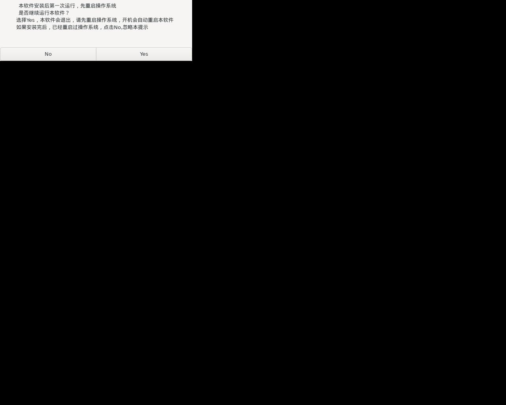 | N/A | N/A |
| [com.wendouscanner](./com.wendouscanner) | arm64  | deepin-v23 | 1.0-20250327 | 失败 | N/A | N/A |
| [com.winmage.winmage-sane](./com.winmage.winmage-sane) | arm64  | deepin-v23 | 20240911-4.6.10.053-20250327 | 失败 | N/A | N/A |
| [com.winuim.wmr06](./com.winuim.wmr06) | arm64  | deepin-v23 | 1.0.0.4-1 |  | N/A | N/A |
| [com.wsd.gpy](./com.wsd.gpy) | arm64  | deepin-v23 | 1.0.26-20250327 | 失败 | N/A | N/A |
| [com.yjcloud.asr.agent](./com.yjcloud.asr.agent) | arm64  | deepin-v23 | 5.0.0-20250327 | 失败 | N/A | N/A |
| [com.zebra.jaguardriver](./com.zebra.jaguardriver) | arm64  | deepin-v23 | 1.0.0.0-20250327 | 失败 | N/A | N/A |
| [com.ztsave.ztfinger](./com.ztsave.ztfinger) | arm64  | deepin-v23 | 1.0.0-1 |  | N/A | N/A |
| [compiz-boxmenu](./compiz-boxmenu) | arm64  | ubuntu-noble | 1.1.12-7build2-20250327 | 失败 | N/A | N/A |
| [compiz-core](./compiz-core) | arm64  | ubuntu-noble | 0.9.14.2+22.10.20220822-0ubuntu12-20250327 | 失败 | N/A | N/A |
| [compizconfig-settings-manager](./compizconfig-settings-manager) | arm64  | ubuntu-noble | 0.9.14.2+22.10.20220822-0ubuntu12-20250327 | 失败 | N/A | N/A |
| [comptext](./comptext) | arm64  | ubuntu-noble | 1.0.1-6build2 | 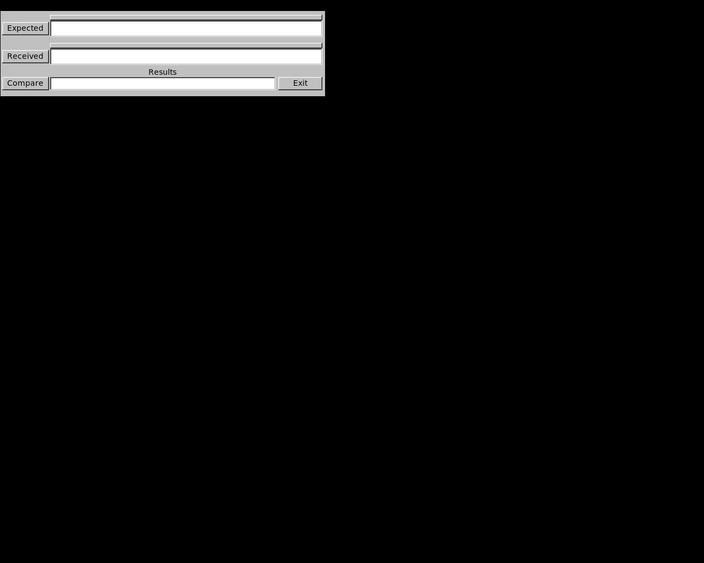 | N/A | N/A |
| [compton](./compton) | arm64  | ubuntu-noble | 1-3 |  | N/A | N/A |
| [compton-conf](./compton-conf) | arm64  | ubuntu-noble | 0.16.0-1ubuntu3 | 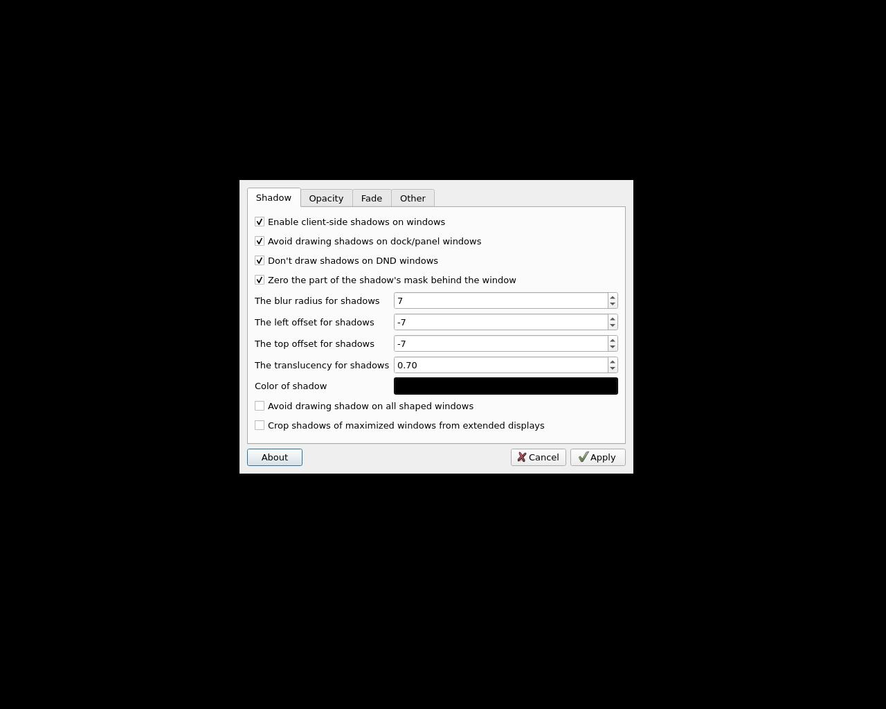 | N/A | N/A |
| [comptty](./comptty) | arm64  | ubuntu-noble | 1.0.1-5build2 |  | N/A | N/A |
| [confclerk](./confclerk) | arm64  | ubuntu-noble | 0.7.1-1build2 |  | N/A | N/A |
| [configure-debian](./configure-debian) | arm64  | ubuntu-noble | 1.0.3+nmu3-20250327 | 失败 | N/A | N/A |
| [confy](./confy) | arm64  | ubuntu-noble | 0.7.0-1-20250327 | 失败 | N/A | N/A |
| [congruity](./congruity) | arm64  | ubuntu-noble | 21-1 |  | N/A | N/A |
| [conky-all](./conky-all) | arm64  | deepin-v23 | 1.21.1-1-20250327 | 失败 | N/A | N/A |
| [conky-cli](./conky-cli) | arm64  | deepin-v23 | 1.21.1-1-20250327 | 失败 | N/A | N/A |
| [conky-std](./conky-std) | arm64  | deepin-v23 | 1.21.1-1-20250327 | 失败 | N/A | N/A |
| [connectagram](./connectagram) | arm64  | ubuntu-noble | 1.3.5-2build1 |  | N/A | N/A |
| [connectome-workbench](./connectome-workbench) | arm64  | ubuntu-noble | 1.5.0-2build2 |  | N/A | N/A |
| [connman-gtk](./connman-gtk) | arm64  | ubuntu-noble | 1.1.1+git20180626.b72c6ab-3build2 |  | N/A | N/A |
| [content-hub](./content-hub) | arm64  | ubuntu-noble | 1.1.1-1build5-20250327 | 失败 | N/A | N/A |
| [content-hub-testability](./content-hub-testability) | arm64  | ubuntu-noble | 1.1.1-1build5 |    | N/A | N/A |
| [converseen](./converseen) | arm64  | ubuntu-noble | 0.12.1.0-1build2 |  | N/A | N/A |
| [convertall](./convertall) | arm64  | ubuntu-noble | 0.8.0-2 | 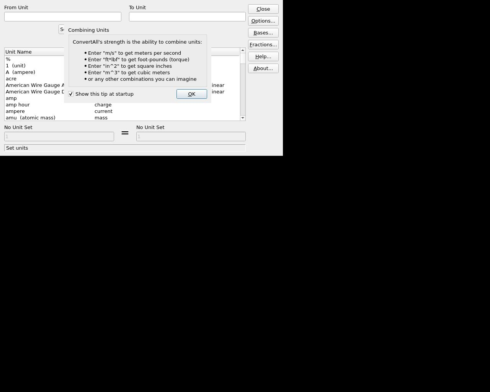 | N/A | N/A |
| [cool-retro-term](./cool-retro-term) | arm64  | ubuntu-noble | 1.2.0+ds2-2build2 | 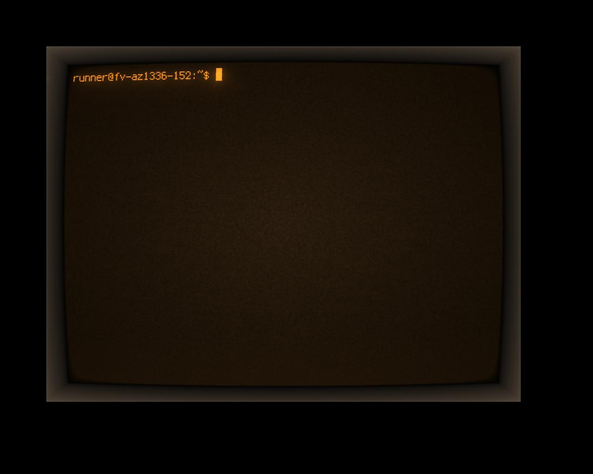 | N/A | N/A |
| [copyq](./copyq) | arm64  | ubuntu-noble | 7.1.0-1build2 |  | N/A | N/A |
| [coqide](./coqide) | arm64  | ubuntu-noble | 8.18.0+dfsg-1build2 |  | N/A | N/A |
| [corectrl](./corectrl) | arm64  | ubuntu-noble | 1.3.11+ds-1build1-20250327 | 失败 | N/A | N/A |
| [corsix-th](./corsix-th) | arm64  | ubuntu-noble | 0.67-1 |  | N/A | N/A |
| [cppcheck-gui](./cppcheck-gui) | arm64  | ubuntu-noble | 2.13.0-2ubuntu3 |  | N/A | N/A |
| [cpupower-gui](./cpupower-gui) | arm64  | ubuntu-noble | 0.7.2-2.1ubuntu2-20250327 | 失败 | N/A | N/A |
| [cqrlog](./cqrlog) | arm64  | ubuntu-noble | 2.5.2-3ubuntu2 | 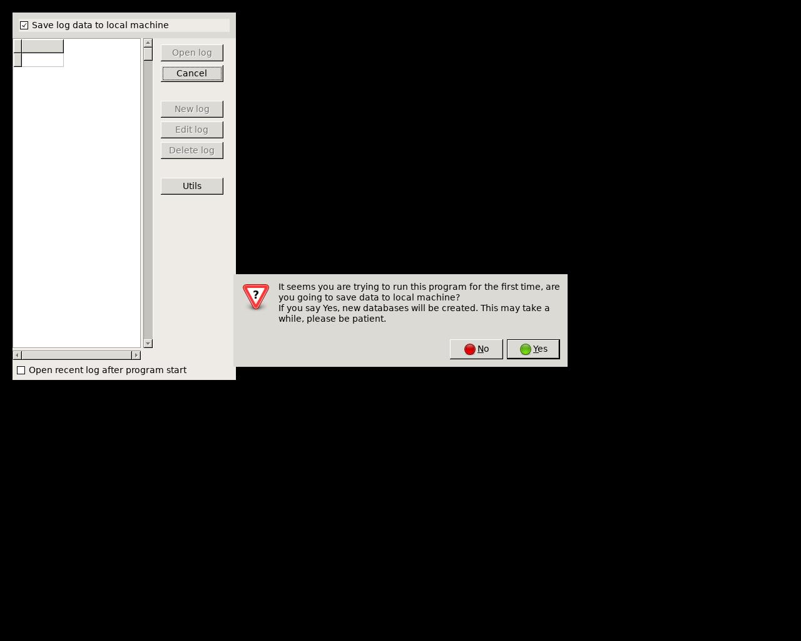 | N/A | N/A |
| [crack-attack](./crack-attack) | arm64  | ubuntu-noble | 1.1.14-9.2build2 |  | N/A | N/A |
| [crawl](./crawl) | arm64  | ubuntu-noble | 0.28.0-1.1-20250327 | 失败 | N/A | N/A |
| [crawl-tiles](./crawl-tiles) | arm64  | ubuntu-noble | 0.28.0-1.1 |  | N/A | N/A |
| [cream](./cream) | arm64  | ubuntu-noble | 0.43-3.1-20250327 | 失败 | N/A | N/A |
| [crimson](./crimson) | arm64  | ubuntu-noble | 0.5.2-1.1build2 |  | N/A | N/A |
| [crispy-doom](./crispy-doom) | arm64  | ubuntu-noble | 6.0-2build2 |    | N/A | N/A |
| [criticalmass](./criticalmass) | arm64  | ubuntu-noble | 1.0.2-4build3-20250327 | 失败 | N/A | N/A |
| [critterding](./critterding) | arm64  | ubuntu-noble | 1.0-beta12.1-1.3build1 |  | N/A | N/A |
| [cronometer](./cronometer) | arm64  | ubuntu-noble | 0.9.9+dfsg1-1-20250327 | 失败 | N/A | N/A |
| [crossfire-client](./crossfire-client) | arm64  | ubuntu-noble | 1.75.0-2build4 |  | N/A | N/A |
| [crow-translate](./crow-translate) | arm64  | ubuntu-noble | 2.11.1+git20240108+ds-1build2 |  | N/A | N/A |
| [crrcsim](./crrcsim) | arm64  | ubuntu-noble | 0.9.13-3.2build2 |  | N/A | N/A |
| [crystal-facet-uml](./crystal-facet-uml) | arm64  | ubuntu-noble | 1.55.3-1build2 |  | N/A | N/A |
| [csoundqt](./csoundqt) | arm64  | ubuntu-noble | 1.1.1+dfsg0-1build2 |  | N/A | N/A |
| [ctsim](./ctsim) | arm64  | ubuntu-noble | 6.0.2-6build3 |  | N/A | N/A |
| [cube2-data](./cube2-data) | arm64  | ubuntu-noble | 1.3-1 |  | N/A | N/A |
| [cubicsdr](./cubicsdr) | arm64  | ubuntu-noble | 0.2.7+dfsg-2build3 |  | N/A | N/A |
| [cultivation](./cultivation) | arm64  | ubuntu-noble | 9+dfsg1-2build5 |  | N/A | N/A |
| [curtain](./curtain) | arm64  | ubuntu-noble | 0.3-1.1build3 |  | N/A | N/A |
| [cutecom](./cutecom) | arm64  | ubuntu-noble | 0.51.0-1build2 |  | N/A | N/A |
| [cutemaze](./cutemaze) | arm64  | ubuntu-noble | 1.3.2-1build2 |  | N/A | N/A |
| [cutesdr](./cutesdr) | arm64  | ubuntu-noble | 1.20-4build2 |  | N/A | N/A |
| [cuyo](./cuyo) | arm64  | ubuntu-noble | 2.1.0-1build1 |  | N/A | N/A |
| [cycle](./cycle) | arm64  | ubuntu-noble | 0.3.3-1-20250327 | 失败 | N/A | N/A |
| [cyclograph-gtk3](./cyclograph-gtk3) | arm64  | ubuntu-noble | 1.9.1-1.2-20250327 | 失败 | N/A | N/A |
| [cyclograph-qt5](./cyclograph-qt5) | arm64  | ubuntu-noble | 1.9.1-1.2-20250327 | 失败 | N/A | N/A |
| [cynthiune.app](./cynthiune.app) | arm64  | ubuntu-noble | 1.0.0-2build9 |  | N/A | N/A |
| [cytadela](./cytadela) | arm64  | ubuntu-noble | 1.1.0-4build1-20250327 | 失败 | N/A | N/A |
| [d-feet](./d-feet) | arm64  | deepin-v23 | 0.3.16-3 |  | N/A | N/A |
| [d-spy](./d-spy) | arm64  | ubuntu-noble | 1.10.0-1build1 |  | N/A | N/A |
| [d1x-rebirth](./d1x-rebirth) | arm64  | ubuntu-noble | 0.58.1-1.2-20250327 | 失败 | N/A | N/A |
| [d2x-rebirth](./d2x-rebirth) | arm64  | ubuntu-noble | 0.58.1-1.3-20250327 | 失败 | N/A | N/A |
| [daisy-player](./daisy-player) | arm64  | ubuntu-noble | 13.0-4build2-20250327 | 失败 | N/A | N/A |
| [dangen](./dangen) | arm64  | ubuntu-noble | 0.5-7 |  | N/A | N/A |
| [danmaq](./danmaq) | arm64  | ubuntu-noble | 0.2.3.2-2build2 |  | N/A | N/A |
| [darkradiant](./darkradiant) | arm64  | ubuntu-noble | 3.8.0-2build4 |  | N/A | N/A |
| [darktable](./darktable) | arm64  | ubuntu-noble | 4.6.1-2ubuntu1 |  | N/A | N/A |
| [darnwdl](./darnwdl) | arm64  | ubuntu-noble | 0.8-1build1 |  | N/A | N/A |
| [dasher](./dasher) | arm64  | ubuntu-noble | 5.0.0~beta~repack2-4build3 |  | N/A | N/A |
| [davegnukem](./davegnukem) | arm64  | ubuntu-noble | 1.0.3-4 |  | N/A | N/A |
| [davmail](./davmail) | arm64  | ubuntu-noble | 6.2.1.3496-1 |  | N/A | N/A |
| [dawg](./dawg) | arm64  | ubuntu-noble | 1.2-4-20250327 | 失败 | N/A | N/A |
| [dclock](./dclock) | arm64  | ubuntu-noble | 2.2.2-14build2 |  | N/A | N/A |
| [dconf-editor](./dconf-editor) | arm64  | ubuntu-noble | 45.0.1-1build2 |  | N/A | N/A |
| [ddcui](./ddcui) | arm64  | ubuntu-noble | 0.3.0-1build3 |  | N/A | N/A |
| [ddd](./ddd) | arm64  | ubuntu-noble | 3.3.12-5.4build2 |  | N/A | N/A |
| [dde-calendar](./dde-calendar) | arm64  | deepin-v23 | 5.14.7-20250327 | 失败 | N/A | N/A |
| [dde-control-center](./dde-control-center) | arm64  | deepin-v23 | 6.0.75+deepin0+rb1-20250327 | 失败 | N/A | N/A |
| [dde-cooperation](./dde-cooperation) | arm64  | deepin-v23 | 1.0.2-1 |  | N/A | N/A |
| [dde-desktop](./dde-desktop) | arm64  | deepin-v23 | 6.5.10.4-20250327 | 失败 | N/A | N/A |
| [dde-device-formatter](./dde-device-formatter) | arm64  | deepin-v23 | 0.0.1.16-20250327 | 失败 | N/A | N/A |
| [dde-file-manager](./dde-file-manager) | arm64  | deepin-v23 | 6.5.10.4-20250327 | 失败 | N/A | N/A |
| [dde-introduction](./dde-introduction) | arm64  | deepin-v23 | 7.0.9 |  | N/A | N/A |
| [dde-printer](./dde-printer) | arm64  | deepin-v23 | 1.0.25-1+1060 |  | N/A | N/A |
| [dde-session-shell](./dde-session-shell) | arm64  | deepin-v23 | 6.0.23-20250327 | 失败 | N/A | N/A |
| [dde-store](./dde-store) | arm64  | ubuntu-noble | 1.2.5-1build2-20250327 | 失败 | N/A | N/A |
| [ddnet](./ddnet) | arm64  | ubuntu-noble | 16.4-1.2build5 |  | N/A | N/A |
| [ddrescueview](./ddrescueview) | arm64  | ubuntu-noble | 0.4.5-2 |  | N/A | N/A |
| [deb-gview](./deb-gview) | arm64  | ubuntu-noble | 0.3.7build2 |  | N/A | N/A |
| [debian-installer-launcher](./debian-installer-launcher) | arm64  | ubuntu-noble | 41 |  | N/A | N/A |
| [debian-reference-common](./debian-reference-common) | arm64  | ubuntu-noble | 2.122-20250327 | 失败 | N/A | N/A |
| [deepin-album](./deepin-album) | arm64  | deepin-v23 | 5.10.25 |  | N/A | N/A |
| [deepin-app-store](./deepin-app-store) | arm64  | deepin-v23 | 8.0.7.0010 |  | N/A | N/A |
| [deepin-boot-maker](./deepin-boot-maker) | arm64  | deepin-v23 | 5.7.10-20250327 | 失败 | N/A | N/A |
| [deepin-calculator](./deepin-calculator) | arm64  | deepin-v23 | 6.0.1 |  | N/A | N/A |
| [deepin-camera](./deepin-camera) | arm64  | deepin-v23 | 6.5.5-20250327 | 失败 | N/A | N/A |
| [deepin-compressor](./deepin-compressor) | arm64  | deepin-v23 | 6.0.2 |  | N/A | N/A |
| [deepin-data-transfer](./deepin-data-transfer) | arm64  | deepin-v23 | 1.0.2-1 |  | N/A | N/A |
| [deepin-deb-installer](./deepin-deb-installer) | arm64  | deepin-v23 | 6.5.0-20250327 | 失败 | N/A | N/A |
| [deepin-devicemanager](./deepin-devicemanager) | arm64  | deepin-v23 | 6.0.28-20250327 | 失败 | N/A | N/A |
| [deepin-diskmanager](./deepin-diskmanager) | arm64  | deepin-v23 | 1.4.1 |  | N/A | N/A |
| [deepin-distrobox-ubuntu](./deepin-distrobox-ubuntu) | arm64  | deepin-v23 | 0 |  | N/A | N/A |
| [deepin-draw](./deepin-draw) | arm64  | deepin-v23 | 7.0.4 |  | N/A | N/A |
| [deepin-editor](./deepin-editor) | arm64  | deepin-v23 | 6.5.7 |  | N/A | N/A |
| [deepin-feedback](./deepin-feedback) | arm64  | deepin-v23 | 6.0.0-20250327 | 失败 | N/A | N/A |
| [deepin-font-manager](./deepin-font-manager) | arm64  | deepin-v23 | 6.5.3-20250327 | 失败 | N/A | N/A |
| [deepin-home](./deepin-home) | arm64  | deepin-v23 | 1.6.3 |  | N/A | N/A |
| [deepin-image-viewer](./deepin-image-viewer) | arm64  | deepin-v23 | 5.9.20 |  | N/A | N/A |
| [deepin-log-viewer](./deepin-log-viewer) | arm64  | deepin-v23 | 6.5.2 |  | N/A | N/A |
| [deepin-mail](./deepin-mail) | arm64  | deepin-v23 | 6.4.10-20250327 | 失败 | N/A | N/A |
| [deepin-manual](./deepin-manual) | arm64  | deepin-v23 | 6.5.6.1-20250327 | 失败 | N/A | N/A |
| [deepin-movie](./deepin-movie) | arm64  | deepin-v23 | 6.0.10-20250327 | 失败 | N/A | N/A |
| [deepin-music](./deepin-music) | arm64  | deepin-v23 | 6.2.40-20250327 | 失败 | N/A | N/A |
| [deepin-ocr](./deepin-ocr) | arm64  | deepin-v23 | 1.1.2-20250327 | 失败 | N/A | N/A |
| [deepin-picker](./deepin-picker) | arm64  | deepin-v23 | 6.0.1-20250327 | 失败 | N/A | N/A |
| [deepin-reader](./deepin-reader) | arm64  | deepin-v23 | 6.5.2-20250327 | 失败 | N/A | N/A |
| [deepin-screen-recorder](./deepin-screen-recorder) | arm64  | deepin-v23 | 6.0.9+deepin0+rb1-20250327 | 失败 | N/A | N/A |
| [deepin-system-monitor](./deepin-system-monitor) | arm64  | deepin-v23 | 6.5.2 |  | N/A | N/A |
| [deepin-system-upgrade](./deepin-system-upgrade) | arm64  | deepin-v23 | 6.0.3 |  | N/A | N/A |
| [deepin-terminal](./deepin-terminal) | arm64  | deepin-v23 | 6.0.16 |  | N/A | N/A |
| [deepin-unioncode](./deepin-unioncode) | arm64  | deepin-v23 | 1.3.16-20250327 | 失败 | N/A | N/A |
| [deepin-voice-note](./deepin-voice-note) | arm64  | deepin-v23 | 6.0.17-20250327 | 失败 | N/A | N/A |
| [deja-dup](./deja-dup) | arm64  | ubuntu-noble | 45.2-1build2 |  | N/A | N/A |
| [deli-printer-a111](./deli-printer-a111) | arm64  | deepin-v23 | 1.1.022-20250327 | 失败 | N/A | N/A |
| [dell-recovery](./dell-recovery) | arm64  | ubuntu-noble | 1.66-20250327 | 失败 | N/A | N/A |
| [deluge-gtk](./deluge-gtk) | arm64  | ubuntu-noble | 2.1.2~dev0+20240121-1-20250327 | 失败 | N/A | N/A |
| [denemo](./denemo) | arm64  | ubuntu-noble | 2.6.18-1build3-20250327 | 失败 | N/A | N/A |
| [desktopfolder](./desktopfolder) | arm64  | ubuntu-noble | 1.1.3-3build2 |  | N/A | N/A |
| [devede](./devede) | arm64  | ubuntu-noble | 4.17.0-1-20250327 | 失败 | N/A | N/A |
| [developers-reference](./developers-reference) | arm64  | ubuntu-noble | 13.4-20250327 | 失败 | N/A | N/A |
| [devhelp](./devhelp) | arm64  | ubuntu-noble | 43.0-4build3 |  | N/A | N/A |
| [dfcgen-gtk](./dfcgen-gtk) | arm64  | ubuntu-noble | 0.6-2build2 |  | N/A | N/A |
| [dgedit](./dgedit) | arm64  | ubuntu-noble | 0.10.0-2build3 |  | N/A | N/A |
| [dhelp](./dhelp) | arm64  | ubuntu-noble | 0.6.30-20250327 | 失败 | N/A | N/A |
| [dhewm3-d3xp](./dhewm3-d3xp) | arm64  | ubuntu-noble | 1.5.2+dfsg-1build2-20250327 | 失败 | N/A | N/A |
| [dhewm3-doom3](./dhewm3-doom3) | arm64  | ubuntu-noble | 1.5.2+dfsg-1build2-20250327 | 失败 | N/A | N/A |
| [dia](./dia) | arm64  | ubuntu-noble | 0.98+git20240130-1build4-20250327 | 失败 | N/A | N/A |
| [dialect](./dialect) | arm64  | ubuntu-noble | 2.1.1+~2.1.1-1-20250327 | 失败 | N/A | N/A |
| [dianara](./dianara) | arm64  | ubuntu-noble | 1.4.4-1build2 |  | N/A | N/A |
| [dictionaryreader.app](./dictionaryreader.app) | arm64  | ubuntu-noble | 0+20080616+dfsg-2.1build1 |  | N/A | N/A |
| [diffpdf](./diffpdf) | arm64  | ubuntu-noble | 2.1.3.1-2build3 |  | N/A | N/A |
| [diffuse](./diffuse) | arm64  | ubuntu-noble | 0.8.2-1ubuntu1.1-20250327 | 失败 | N/A | N/A |
| [digikam](./digikam) | arm64  | ubuntu-noble | 8.2.0-0ubuntu6.2 |  | N/A | N/A |
| [dillo](./dillo) | arm64  | ubuntu-noble | 3.0.5-7build5 |  | N/A | N/A |
| [din](./din) | arm64  | ubuntu-noble | 58.1+ds-1-20250327 | 失败 | N/A | N/A |
| [ding](./ding) | arm64  | ubuntu-noble | 1.9-7 |  | N/A | N/A |
| [dino-im](./dino-im) | arm64  | ubuntu-noble | 0.4.3-3 |  | N/A | N/A |
| [diodon](./diodon) | arm64  | ubuntu-noble | 1.13.0-1build2 |  | N/A | N/A |
| [direwolf](./direwolf) | arm64  | ubuntu-noble | 1.7+dfsg-2build2-20250327 | 失败 | N/A | N/A |
| [displaycal](./displaycal) | arm64  | ubuntu-noble | 3.9.11-2ubuntu0.24.04.1-20250327 | 失败 | N/A | N/A |
| [distccmon-gnome](./distccmon-gnome) | arm64  | deepin-v23 | 3.4+really3.4-4deepin1 |  | N/A | N/A |
| [djview4](./djview4) | arm64  | ubuntu-noble | 4.12-3build3 |  | N/A | N/A |
| [dkopp](./dkopp) | arm64  | ubuntu-noble | 6.5-2build2-20250327 | 失败 | N/A | N/A |
| [dlt-viewer](./dlt-viewer) | arm64  | ubuntu-noble | 2.25.0+dfsg-2build3 |  | N/A | N/A |
| [dochelp](./dochelp) | arm64  | ubuntu-noble | 0.1.8-20250327 | 失败 | N/A | N/A |
| [dodgindiamond2](./dodgindiamond2) | arm64  | ubuntu-noble | 0.2.2-4 |  | N/A | N/A |
| [dolphin](./dolphin) | arm64  | ubuntu-noble | 23.08.5-0ubuntu4 |  | N/A | N/A |
| [domino-chain](./domino-chain) | arm64  | ubuntu-noble | 1.1-3build3-20250327 | 失败 | N/A | N/A |
| [doomsday](./doomsday) | arm64  | ubuntu-noble | 2.3.1+ds1-1build3 |  | N/A | N/A |
| [doomsday-server](./doomsday-server) | arm64  | ubuntu-noble | 2.3.1+ds1-1build3 |  | N/A | N/A |
| [dopewars](./dopewars) | arm64  | ubuntu-noble | 1.6.2-1build4-20250327 | 失败 | N/A | N/A |
| [dosbox](./dosbox) | arm64  | ubuntu-noble | 0.74-3-5build2 |  | N/A | N/A |
| [dosbox-x](./dosbox-x) | arm64  | ubuntu-noble | 2024.03.01+dfsg-1build2 |  | N/A | N/A |
| [dossizola](./dossizola) | arm64  | ubuntu-noble | 1.0-12 |  | N/A | N/A |
| [doublecmd-common](./doublecmd-common) | arm64  | ubuntu-noble | 1.1.11-1build1 |  | N/A | N/A |
| [dozzaqueux](./dozzaqueux) | arm64  | ubuntu-noble | 3.51-4 |  | N/A | N/A |
| [dpkg-www](./dpkg-www) | arm64  | ubuntu-noble | 2.65-20250327 | 失败 | N/A | N/A |
| [dragonplayer](./dragonplayer) | arm64  | ubuntu-noble | 23.08.5-0ubuntu3 |  | N/A | N/A |
| [drascula](./drascula) | arm64  | ubuntu-noble | 1.0+ds4-2 |  | N/A | N/A |
| [drascula-french](./drascula-french) | arm64  | ubuntu-noble | 1.0+ds4-2 |  | N/A | N/A |
| [drascula-german](./drascula-german) | arm64  | ubuntu-noble | 1.0+ds4-2 |  | N/A | N/A |
| [drascula-italian](./drascula-italian) | arm64  | ubuntu-noble | 1.0+ds4-2 |  | N/A | N/A |
| [drascula-spanish](./drascula-spanish) | arm64  | ubuntu-noble | 1.0+ds4-2 |  | N/A | N/A |
| [drawing](./drawing) | arm64  | ubuntu-noble | 1.0.2-1build1-20250327 | 失败 | N/A | N/A |
| [drawxtl](./drawxtl) | arm64  | ubuntu-noble | 5.5-6.1build2 |  | N/A | N/A |
| [dreamchess](./dreamchess) | arm64  | ubuntu-noble | 0.3.0-2 |  | N/A | N/A |
| [driftnet](./driftnet) | arm64  | ubuntu-noble | 1.5.0-0.2build3-20250327 | 失败 | N/A | N/A |
| [drkonqi](./drkonqi) | arm64  | ubuntu-noble | 5.27.11-0ubuntu3-20250327 | 失败 | N/A | N/A |
| [drumkv1](./drumkv1) | arm64  | ubuntu-noble | 0.9.34-1build3 |  | N/A | N/A |
| [drumstick-tools](./drumstick-tools) | arm64  | ubuntu-noble | 2.9.0-1.1build2 |    | N/A | N/A |
| [dsda-doom](./dsda-doom) | arm64  | ubuntu-noble | 0.27.5+dfsg-1build2 |  | N/A | N/A |
| [dspdfviewer](./dspdfviewer) | arm64  | ubuntu-noble | 1.15.1-1.1build5 |  | N/A | N/A |
| [dummyapp-wpsoffice](./dummyapp-wpsoffice) | arm64  | deepin-v23 | 1.0.2-20250327 | 失败 | N/A | N/A |
| [dupeguru](./dupeguru) | arm64  | ubuntu-noble | 4.3.1-4build1 |  | N/A | N/A |
| [dustracing2d](./dustracing2d) | arm64  | ubuntu-noble | 2.1.1-2build2 |   | N/A | N/A |
| [dvb-apps](./dvb-apps) | arm64  | ubuntu-noble | 1.1.1+rev1500-1.4build3-20250327 | 失败 | N/A | N/A |
| [dvbcut](./dvbcut) | arm64  | ubuntu-noble | 0.7.4-1build4 |  | N/A | N/A |
| [dvorak7min](./dvorak7min) | arm64  | ubuntu-noble | 1.6.1+repack-4-20250327 | 失败 | N/A | N/A |
| [dwww](./dwww) | arm64  | ubuntu-noble | 1.16-20250327 | 失败 | N/A | N/A |
| [dx](./dx) | arm64  | ubuntu-noble | 4.4.4-15.1build2 |  | N/A | N/A |
| [dxf2gcode](./dxf2gcode) | arm64  | ubuntu-noble | 20191025-2 |  | N/A | N/A |
| [dyssol-gui](./dyssol-gui) | arm64  | ubuntu-noble | 1.1.1+ds1-2.1build4 |  | N/A | N/A |
| [eartag](./eartag) | arm64  | ubuntu-noble | 0.6.0-1-20250327 | 失败 | N/A | N/A |
| [easychem](./easychem) | arm64  | ubuntu-noble | 0.6-9build2 |  | N/A | N/A |
| [easyeffects](./easyeffects) | arm64  | deepin-v23 | 7.1.7-1-20250327 | 失败 | N/A | N/A |
| [easyssh](./easyssh) | arm64  | ubuntu-noble | 1.7.9-4build2 |  | N/A | N/A |
| [easytag](./easytag) | arm64  | ubuntu-noble | 2.4.3-5build3 |  | N/A | N/A |
| [ebook-speaker](./ebook-speaker) | arm64  | ubuntu-noble | 6.2.0-5build2-20250327 | 失败 | N/A | N/A |
| [ebook2cwgui](./ebook2cwgui) | arm64  | ubuntu-noble | 0.1.2-7build3 |  | N/A | N/A |
| [ebumeter](./ebumeter) | arm64  | ubuntu-noble | 0.5.1-1build2-20250327 | 失败 | N/A | N/A |
| [edenmath.app](./edenmath.app) | arm64  | ubuntu-noble | 1.1.1a-8build5 |  | N/A | N/A |
| [edfbrowser](./edfbrowser) | arm64  | ubuntu-noble | 2.06+dfsg-1build2 |  | N/A | N/A |
| [edgar](./edgar) | arm64  | ubuntu-noble | 1.37-1build2 |  | N/A | N/A |
| [edubuntu-docs](./edubuntu-docs) | arm64  | ubuntu-noble | 11.03.3 |  | N/A | N/A |
| [edubuntu-installer](./edubuntu-installer) | arm64  | ubuntu-noble | 0.6 |  | N/A | N/A |
| [edubuntu-menu](./edubuntu-menu) | arm64  | ubuntu-noble | 24.04.2.2-20250327 | 失败 | N/A | N/A |
| [eekboek-gui](./eekboek-gui) | arm64  | ubuntu-noble | 2.04-1build1 |  | N/A | N/A |
| [efte](./efte) | arm64  | ubuntu-noble | 1.1-4 |  | N/A | N/A |
| [eiciel](./eiciel) | arm64  | ubuntu-noble | 0.10.0-1build2 |  | N/A | N/A |
| [einstein](./einstein) | arm64  | ubuntu-noble | 2.0.dfsg.2-10build1 |  | N/A | N/A |
| [eiskaltdcpp-gtk](./eiskaltdcpp-gtk) | arm64  | ubuntu-noble | 2.4.2-1.1build6 |  | N/A | N/A |
| [eiskaltdcpp-qt](./eiskaltdcpp-qt) | arm64  | ubuntu-noble | 2.4.2-1.1build6 |  | N/A | N/A |
| [eiskaltdcpp-web](./eiskaltdcpp-web) | arm64  | ubuntu-noble | 1.0.1-2-20250327 | 失败 | N/A | N/A |
| [electric](./electric) | arm64  | ubuntu-noble | 9.07+dfsg-7-20250327 | 失败 | N/A | N/A |
| [elektroid](./elektroid) | arm64  | ubuntu-noble | 3.0.1-2build1 |  | N/A | N/A |
| [elisa](./elisa) | arm64  | ubuntu-noble | 23.08.5-0ubuntu3 |  | N/A | N/A |
| [elki](./elki) | arm64  | ubuntu-noble | 0.7.1-10.1-20250327 | 失败 | N/A | N/A |
| [emacs-common](./emacs-common) | arm64  | ubuntu-noble | 29.3+1-1ubuntu2-20250327 | 失败 | N/A | N/A |
| [emacs-gtk](./emacs-gtk) | arm64  | ubuntu-noble | 29.3+1-1ubuntu2 |  | N/A | N/A |
| [emacs-lucid](./emacs-lucid) | arm64  | ubuntu-noble | 29.3+1-1ubuntu2 |  | N/A | N/A |
| [emacs-pgtk](./emacs-pgtk) | arm64  | ubuntu-noble | 29.3+1-1ubuntu2 |  | N/A | N/A |
| [email-reminder](./email-reminder) | arm64  | ubuntu-noble | 0.8.3-1 |  | N/A | N/A |
| [emboss-explorer](./emboss-explorer) | arm64  | ubuntu-noble | 2.2.0-12-20250327 | 失败 | N/A | N/A |
| [emerald](./emerald) | arm64  | ubuntu-noble | 0.8.18-4.2build1 |  | N/A | N/A |
| [empire](./empire) | arm64  | ubuntu-noble | 1.16-2-20250327 | 失败 | N/A | N/A |
| [endeavour](./endeavour) | arm64  | ubuntu-noble | 43.0-1build3 |  | N/A | N/A |
| [endless-sky](./endless-sky) | arm64  | ubuntu-noble | 0.10.4-1build2 |  | N/A | N/A |
| [enemylines3](./enemylines3) | arm64  | ubuntu-noble | 1.25-1build3 |  | N/A | N/A |
| [enemylines7](./enemylines7) | arm64  | ubuntu-noble | 0.6-6 |  | N/A | N/A |
| [engauge-digitizer](./engauge-digitizer) | arm64  | ubuntu-noble | 12.1+ds.1-1build3 |  | N/A | N/A |
| [engrampa](./engrampa) | arm64  | ubuntu-noble | 1.26.2-4 |  | N/A | N/A |
| [enigma](./enigma) | arm64  | ubuntu-noble | 1.30+dfsg-1build2 |  | N/A | N/A |
| [enlightenment](./enlightenment) | arm64  | ubuntu-noble | 0.26.0-2build2 |    | N/A | N/A |
| [entagged](./entagged) | arm64  | ubuntu-noble | 0.35-6 |  | N/A | N/A |
| [entangle](./entangle) | arm64  | ubuntu-noble | 3.0-4build2-20250327 | 失败 | N/A | N/A |
| [eog](./eog) | arm64  | ubuntu-noble | 45.3-1ubuntu2-20250327 | 失败 | N/A | N/A |
| [eom](./eom) | arm64  | ubuntu-noble | 1.26.1-1build3-20250327 | 失败 | N/A | N/A |
| [ephoto](./ephoto) | arm64  | ubuntu-noble | 1.6.0-1build2 |  | N/A | N/A |
| [epiphany](./epiphany) | arm64  | ubuntu-noble | 0.7.0+0-7-20250327 | 失败 | N/A | N/A |
| [epiphany-browser](./epiphany-browser) | arm64  | ubuntu-noble | 46.0-2build1 |  | N/A | N/A |
| [epoptes](./epoptes) | arm64  | ubuntu-noble | 23.08-1-20250327 | 失败 | N/A | N/A |
| [epson-tdbridge-pp100api](./epson-tdbridge-pp100api) | arm64  | deepin-v23 | 2.5.2-20250327 | 失败 | N/A | N/A |
| [eqonomize](./eqonomize) | arm64  | ubuntu-noble | 1.5.6-1build2 |  | N/A | N/A |
| [eric](./eric) | arm64  | ubuntu-noble | 23.2+ds1-2ubuntu1 |   | N/A | N/A |
| [errands](./errands) | arm64  | ubuntu-noble | 45.1.9-2-20250327 | 失败 | N/A | N/A |
| [eskeysetuplog-admin](./eskeysetuplog-admin) | arm64  | deepin-v23 | 6.3.0.3 |  | N/A | N/A |
| [espeakedit](./espeakedit) | arm64  | ubuntu-noble | 1.48.15-2build3 |  | N/A | N/A |
| [etherape](./etherape) | arm64  | ubuntu-noble | 0.9.20-2build3 |  | N/A | N/A |
| [etm](./etm) | arm64  | ubuntu-noble | 3.2.39-1 |  | N/A | N/A |
| [etoys](./etoys) | arm64  | ubuntu-noble | 5.0.2408-1build1 |  | N/A | N/A |
| [ettercap-graphical](./ettercap-graphical) | arm64  | ubuntu-noble | 0.8.3.1-13build3-20250327 | 失败 | N/A | N/A |
| [etw](./etw) | arm64  | ubuntu-noble | 3.6+svn162-6build3 |  | N/A | N/A |
| [euler](./euler) | arm64  | ubuntu-noble | 1.61.0-12build2-20250327 | 失败 | N/A | N/A |
| [eureka](./eureka) | arm64  | ubuntu-noble | 1.27b-2build2 |  | N/A | N/A |
| [eviacam](./eviacam) | arm64  | ubuntu-noble | 2.1.4-2.1build2 |  | N/A | N/A |
| [evilwm](./evilwm) | arm64  | deepin-v23 | 1.4.2-1-20250327 | 失败 | N/A | N/A |
| [evince](./evince) | arm64  | ubuntu-noble | 46.3.1-0ubuntu1 |  | N/A | N/A |
| [evolution](./evolution) | arm64  | ubuntu-noble | 3.52.3-0ubuntu1 |  | N/A | N/A |
| [evolution-data-server](./evolution-data-server) | arm64  | ubuntu-noble | 3.52.3-0ubuntu1-20250327 | 失败 | N/A | N/A |
| [evolvotron](./evolvotron) | arm64  | ubuntu-noble | 0.8.1-1build3 |  | N/A | N/A |
| [exadrums](./exadrums) | arm64  | ubuntu-noble | 0.7.0-1build2 |  | N/A | N/A |
| [exaile](./exaile) | arm64  | ubuntu-noble | 4.1.3+dfsg-2ubuntu1-20250327 | 失败 | N/A | N/A |
| [excellent-bifurcation](./excellent-bifurcation) | arm64  | ubuntu-noble | 0.0.20071015-9build2 |  | N/A | N/A |
| [exfalso](./exfalso) | arm64  | deepin-v23 | 4.6.0-3 |  | N/A | N/A |
| [expeyes](./expeyes) | arm64  | ubuntu-noble | 5.3.1+repack-6build1 |  | N/A | N/A |
| [expeyes-doc-common](./expeyes-doc-common) | arm64  | ubuntu-noble | 4.3-3-20250327 | 失败 | N/A | N/A |
| [explosive-c4](./explosive-c4) | arm64  | ubuntu-noble | 1.2-3build2 |  | N/A | N/A |
| [extremetuxracer](./extremetuxracer) | arm64  | ubuntu-noble | 0.8.3-1build1 |  | [SHA256](./extremetuxracer/SHA256SUMS) | N/A |
| [exult](./exult) | arm64  | ubuntu-noble | 1.8-2build3 |  | N/A | N/A |
| [eyes17](./eyes17) | arm64  | ubuntu-noble | 5.3.1+repack-6build1 |  | N/A | N/A |
| [f3d](./f3d) | arm64  | ubuntu-noble | 2.2.1+dfsg-2build3 |  | N/A | N/A |
| [falkon](./falkon) | arm64  | ubuntu-noble | 24.01.75-1build3 |  | N/A | N/A |
| [fanwor](./fanwor) | arm64  | ubuntu-noble | 1.16-1build2 |  | N/A | N/A |
| [far2l](./far2l) | arm64  | ubuntu-noble | 2.6.0~beta+ds-1ubuntu0.3 |  | N/A | N/A |
| [fastqc](./fastqc) | arm64  | ubuntu-noble | 0.12.1+dfsg-3 |  | N/A | N/A |
| [faustworks](./faustworks) | arm64  | ubuntu-noble | 0.5~repack0-6build3 |  | N/A | N/A |
| [fbreader](./fbreader) | arm64  | ubuntu-noble | 0.99.4+dfsg-5.1build3 |  | N/A | N/A |
| [fbzx](./fbzx) | arm64  | ubuntu-noble | 4.8.0-2build2 |  | N/A | N/A |
| [fccexam](./fccexam) | arm64  | ubuntu-noble | 1.0.7-1.1 |  | N/A | N/A |
| [fceux](./fceux) | arm64  | ubuntu-noble | 2.6.5+dfsg1-2build3 |  | N/A | N/A |
| [fcitx-config-gtk](./fcitx-config-gtk) | arm64  | deepin-v23 | 0.4.10.32-2deepin-20250327 | 失败 | N/A | N/A |
| [fcitx-data](./fcitx-data) | arm64  | deepin-v23 | 4.2.9.32.38-deepin-20250327 | 失败 | N/A | N/A |
| [fcitx-ui-light](./fcitx-ui-light) | arm64  | ubuntu-noble | 0.1.3-5-20250327 | 失败 | N/A | N/A |
| [fcitx-ui-qimpanel](./fcitx-ui-qimpanel) | arm64  | ubuntu-noble | 2.1.3-2build4 |  | N/A | N/A |
| [fcitx5](./fcitx5) | arm64  | deepin-v23 | 5.1.11-2deepin2 |   | N/A | N/A |
| [fcitx5-config-qt](./fcitx5-config-qt) | arm64  | ubuntu-noble | 5.1.4-1 |   | N/A | N/A |
| [fcitx5-frontend-qt5](./fcitx5-frontend-qt5) | arm64  | deepin-v23 | 5.1.8-2deepin1+rb1-20250327 | 失败 | N/A | N/A |
| [fcitx5-frontend-qt6](./fcitx5-frontend-qt6) | arm64  | deepin-v23 | 5.1.8-2deepin1+rb1-20250327 | 失败 | N/A | N/A |
| [feathernotes](./feathernotes) | arm64  | ubuntu-noble | 1.1.1-1build2 |  | N/A | N/A |
| [featherpad](./featherpad) | arm64  | ubuntu-noble | 1.4.1-0ubuntu4 |  | N/A | N/A |
| [feh](./feh) | arm64  | ubuntu-noble | 3.10.1-1ubuntu0.1-20250327 | 失败 | N/A | N/A |
| [felix-latin](./felix-latin) | arm64  | ubuntu-noble | 2.0-14build2 |  | N/A | N/A |
| [ferret](./ferret) | arm64  | ubuntu-noble | 0.7-3 |  | N/A | N/A |
| [ferret-vis](./ferret-vis) | arm64  | ubuntu-noble | 7.6.0-7ubuntu1 |  | N/A | N/A |
| [fet](./fet) | arm64  | ubuntu-noble | 6.8.5-1build2 |  | N/A | N/A |
| [ffado-mixer-qt4](./ffado-mixer-qt4) | arm64  | deepin-v23 | 2.4.9-1 |  | N/A | N/A |
| [fgallery](./fgallery) | arm64  | ubuntu-noble | 1.9.1+ds-2-20250327 | 失败 | N/A | N/A |
| [fheroes2](./fheroes2) | arm64  | ubuntu-noble | 1.0.12+dfsg-1 |  | N/A | N/A |
| [file-roller](./file-roller) | arm64  | ubuntu-noble | 44.3-0ubuntu1 |  | N/A | N/A |
| [filelight](./filelight) | arm64  | ubuntu-noble | 23.08.5-0ubuntu3 |  | N/A | N/A |
| [filezilla](./filezilla) | arm64  | ubuntu-noble | 3.66.5-2build2 |  | N/A | N/A |
| [filius](./filius) | arm64  | ubuntu-noble | 2.5.1+ds-1-20250327 | 失败 | N/A | N/A |
| [filler](./filler) | arm64  | ubuntu-noble | 1.02-6.4 |  | N/A | N/A |
| [fillets-ng](./fillets-ng) | arm64  | ubuntu-noble | 1.0.1-4build2 |  | N/A | N/A |
| [firefox](./firefox) | arm64  | deepin-v23 | 131.0.3-1deepin1 |  | N/A | N/A |
| [firefox-esr](./firefox-esr) | arm64  | deepin-v23 | 115.2.1esr-1 |  | N/A | N/A |
| [firetools](./firetools) | arm64  | ubuntu-noble | 0.9.72-1build2 |   | N/A | N/A |
| [firewall-config](./firewall-config) | arm64  | deepin-v23 | 2.1.2-1-20250327 | 失败 | N/A | N/A |
| [fish-common](./fish-common) | arm64  | deepin-v23 | 3.7.1-1 |  | N/A | N/A |
| [fityk](./fityk) | arm64  | ubuntu-noble | 1.3.2-3build3 |  | N/A | N/A |
| [five-or-more](./five-or-more) | arm64  | ubuntu-noble | 3.32.3-1build2 |  | N/A | N/A |
| [flamerobin](./flamerobin) | arm64  | ubuntu-noble | 0.9.10.ds.2-1build2 |  | N/A | N/A |
| [flameshot](./flameshot) | arm64  | deepin-v23 | 12.1.0-3 |  | N/A | N/A |
| [flamp](./flamp) | arm64  | ubuntu-noble | 2.2.09-1build2 |  | N/A | N/A |
| [flare-engine](./flare-engine) | arm64  | ubuntu-noble | 1.14-3 |  | N/A | N/A |
| [fldiff](./fldiff) | arm64  | ubuntu-noble | 1.1+0-6build3 |  | N/A | N/A |
| [fldigi](./fldigi) | arm64  | ubuntu-noble | 4.2.03-1build3 |   | N/A | N/A |
| [flent](./flent) | arm64  | ubuntu-noble | 2.1.1-2-20250327 | 失败 | N/A | N/A |
| [flight-of-the-amazon-queen](./flight-of-the-amazon-queen) | arm64  | ubuntu-noble | 1.0.0-9 |  | N/A | N/A |
| [flightgear](./flightgear) | arm64  | ubuntu-noble | 2020.3.18+dfsg-1.1 |   | N/A | N/A |
| [flmsg](./flmsg) | arm64  | ubuntu-noble | 4.0.23-1build2 |  | N/A | N/A |
| [flobopuyo](./flobopuyo) | arm64  | ubuntu-noble | 0.20-5.1 |  | N/A | N/A |
| [flowblade](./flowblade) | arm64  | ubuntu-noble | 2.12.0.2-1ubuntu1-20250327 | 失败 | N/A | N/A |
| [flpsed](./flpsed) | arm64  | ubuntu-noble | 0.7.3-9build2 |  | N/A | N/A |
| [flrig](./flrig) | arm64  | ubuntu-noble | 2.0.04-1build2 |  | N/A | N/A |
| [fltk1.1-games](./fltk1.1-games) | arm64  | deepin-v23 | 1.1.10-29 |    | N/A | N/A |
| [fltk1.3-games](./fltk1.3-games) | arm64  | ubuntu-noble | 1.3.8-6.1build2 |    | N/A | N/A |
| [fluid](./fluid) | arm64  | ubuntu-noble | 1.3.8-6.1build2 |  | N/A | N/A |
| [fluidsynth-dssi](./fluidsynth-dssi) | arm64  | ubuntu-noble | 1.0.0-9build1-20250327 | 失败 | N/A | N/A |
| [flwrap](./flwrap) | arm64  | ubuntu-noble | 1.3.6-1build2 |  | N/A | N/A |
| [fmit](./fmit) | arm64  | ubuntu-noble | 1.2.14-0.1build4 |  | N/A | N/A |
| [fnott](./fnott) | arm64  | ubuntu-noble | 1.4.1+ds-1build3-20250327 | 失败 | N/A | N/A |
| [focuswriter](./focuswriter) | arm64  | ubuntu-noble | 1.8.6-1build2 |  | N/A | N/A |
| [foliate](./foliate) | arm64  | ubuntu-noble | 4.~really3.1.1-1-20250327 | 失败 | N/A | N/A |
| [font-downloader](./font-downloader) | arm64  | ubuntu-noble | 10.0.0-3-20250327 | 失败 | N/A | N/A |
| [font-manager](./font-manager) | arm64  | ubuntu-noble | 0.8.8-4build2 |  | N/A | N/A |
| [font-viewer](./font-viewer) | arm64  | ubuntu-noble | 0.8.8-4build2 |  | N/A | N/A |
| [fontforge](./fontforge) | arm64  | deepin-v23 | 20230101~dfsg-3 |  | N/A | N/A |
| [fontmatrix](./fontmatrix) | arm64  | ubuntu-noble | 0.9.100+ds-1build2 |  | N/A | N/A |
| [foobillardplus](./foobillardplus) | arm64  | ubuntu-noble | 3.43~svn170+dfsg-7build2 |  | N/A | N/A |
| [fookb](./fookb) | arm64  | ubuntu-noble | 4.1-3 |  | N/A | N/A |
| [foot](./foot) | arm64  | ubuntu-noble | 1.16.2-2ubuntu0.1-20250327 | 失败 | N/A | N/A |
| [form](./form) | arm64  | ubuntu-noble | 4.3.0+git20230104+ds-1build2-20250327 | 失败 | N/A | N/A |
| [formiko](./formiko) | arm64  | ubuntu-noble | 1.4.3-2.1-20250327 | 失败 | N/A | N/A |
| [fotoxx](./fotoxx) | arm64  | ubuntu-noble | 20.08-2build5 |  | N/A | N/A |
| [founder-sane-backend](./founder-sane-backend) | arm64  | deepin-v23 | 20200622-1.5.7.015-20250327 | 失败 | N/A | N/A |
| [four-in-a-row](./four-in-a-row) | arm64  | deepin-v23 | 3.38.1-deepin1-20250327 | 失败 | N/A | N/A |
| [foxtrotgps](./foxtrotgps) | arm64  | ubuntu-noble | 1.2.2+bzr332-1build4 |  | N/A | N/A |
| [fqterm](./fqterm) | arm64  | ubuntu-noble | 0.9.10.1-4build3 |  | N/A | N/A |
| [fracplanet](./fracplanet) | arm64  | ubuntu-noble | 0.5.1-6build3 |  | N/A | N/A |
| [fractalnow](./fractalnow) | arm64  | ubuntu-noble | 0.8.2-5build2 |  | N/A | N/A |
| [fractgen](./fractgen) | arm64  | ubuntu-noble | 2.1.13-1build3 |  | N/A | N/A |
| [fraqtive](./fraqtive) | arm64  | ubuntu-noble | 0.4.8.1-1build3 |  | N/A | N/A |
| [free42-nologo](./free42-nologo) | arm64  | ubuntu-noble | 3.1.4+ds-1build2 |   | N/A | N/A |
| [freealchemist](./freealchemist) | arm64  | ubuntu-noble | 0.5-2 |  | N/A | N/A |
| [freeciv-client-extras](./freeciv-client-extras) | arm64  | ubuntu-noble | 3.1.0+ds-1build5 |  | N/A | N/A |
| [freeciv-client-gtk3](./freeciv-client-gtk3) | arm64  | ubuntu-noble | 3.1.0+ds-1build5 |  | N/A | N/A |
| [freeciv-client-qt](./freeciv-client-qt) | arm64  | ubuntu-noble | 3.1.0+ds-1build5 |  | N/A | N/A |
| [freeciv-client-sdl](./freeciv-client-sdl) | arm64  | ubuntu-noble | 3.1.0+ds-1build5 |  | N/A | N/A |
| [freeciv-ruleset-tools](./freeciv-ruleset-tools) | arm64  | ubuntu-noble | 3.1.0+ds-1build5 |  | N/A | N/A |
| [freeciv-server](./freeciv-server) | arm64  | ubuntu-noble | 3.1.0+ds-1build5 |  | N/A | N/A |
| [freecol](./freecol) | arm64  | ubuntu-noble | 1.1.0-1-20250327 | 失败 | N/A | N/A |
| [freedink-dfarc](./freedink-dfarc) | arm64  | ubuntu-noble | 3.14-5build3 |  | N/A | N/A |
| [freedink-engine](./freedink-engine) | arm64  | ubuntu-noble | 109.6-5 |   | N/A | N/A |
| [freedm](./freedm) | arm64  | ubuntu-noble | 0.13.0-1 |  | N/A | N/A |
| [freedoom](./freedoom) | arm64  | ubuntu-noble | 0.13.0-1 |   | N/A | N/A |
| [freedroid](./freedroid) | arm64  | ubuntu-noble | 1.0.2+cvs040112-7 |  | N/A | N/A |
| [freedroidrpg](./freedroidrpg) | arm64  | ubuntu-noble | 1.0-1build2 |  | N/A | N/A |
| [freedv](./freedv) | arm64  | ubuntu-noble | 1.8.11-1build4 |  | N/A | N/A |
| [freefilesync](./freefilesync) | arm64  | ubuntu-noble | 13.3-2build3 |   | N/A | N/A |
| [freegish](./freegish) | arm64  | ubuntu-noble | 1.53+git20170110+dfsg-2build2 |  | N/A | N/A |
| [freeorion](./freeorion) | arm64  | ubuntu-noble | 0.5+git20230820-4build5 |  | N/A | N/A |
| [freeplane](./freeplane) | arm64  | ubuntu-noble | 1.7.10-1-20250327 | 失败 | N/A | N/A |
| [freespace2-launcher-wxlauncher](./freespace2-launcher-wxlauncher) | arm64  | ubuntu-noble | 0.12.0~rc3+dfsg-1build2 |   | N/A | N/A |
| [freesweep](./freesweep) | arm64  | ubuntu-noble | 1.0.2-1-20250327 | 失败 | N/A | N/A |
| [freetuxtv](./freetuxtv) | arm64  | ubuntu-noble | 0.6.8~dfsg1-2build3 |  | N/A | N/A |
| [freewheeling](./freewheeling) | arm64  | ubuntu-noble | 0.6.6-1build3-20250327 | 失败 | N/A | N/A |
| [frescobaldi](./frescobaldi) | arm64  | ubuntu-noble | 3.3.0+ds1-2 |  | N/A | N/A |
| [fritzing](./fritzing) | arm64  | ubuntu-noble | 1.0.1-1build4 |  | N/A | N/A |
| [frogatto](./frogatto) | arm64  | ubuntu-noble | 1.3.1+dfsg-6build4 |  | N/A | N/A |
| [frogr](./frogr) | arm64  | ubuntu-noble | 1.8.1-1build3 |  | N/A | N/A |
| [frozen-bubble](./frozen-bubble) | arm64  | ubuntu-noble | 2.212-12build5 |  | N/A | N/A |
| [fs-uae](./fs-uae) | arm64  | ubuntu-noble | 3.1.66-2build2-20250327 | 失败 | N/A | N/A |
| [fs-uae-arcade](./fs-uae-arcade) | arm64  | ubuntu-noble | 3.1.63-2-20250327 | 失败 | N/A | N/A |
| [ft2-clone](./ft2-clone) | arm64  | ubuntu-noble | 1.72.1+ds-1build3 |  | N/A | N/A |
| [ftools-fv](./ftools-fv) | arm64  | ubuntu-noble | 5.5.2+dfsg-3-20250327 | 失败 | N/A | N/A |
| [ftp.app](./ftp.app) | arm64  | ubuntu-noble | 0.6-2build5 |  | N/A | N/A |
| [funguloids](./funguloids) | arm64  | ubuntu-noble | 1.06-15build2-20250327 | 失败 | N/A | N/A |
| [funnyboat](./funnyboat) | arm64  | ubuntu-noble | 1.5-11-20250327 | 失败 | N/A | N/A |
| [fuse-emulator-gtk](./fuse-emulator-gtk) | arm64  | ubuntu-noble | 1.6.0+dfsg1-2build3 |  | N/A | N/A |
| [fuse-emulator-sdl](./fuse-emulator-sdl) | arm64  | ubuntu-noble | 1.6.0+dfsg1-2build3 |  | N/A | N/A |
| [fusion-icon](./fusion-icon) | arm64  | ubuntu-noble | 0.2.4-8-20250327 | 失败 | N/A | N/A |
| [fwbuilder](./fwbuilder) | arm64  | ubuntu-noble | 5.3.7-5ubuntu0.24.04.1 |  | N/A | N/A |
| [gabedit](./gabedit) | arm64  | ubuntu-noble | 2.5.1+ds-1build3 |  | N/A | N/A |
| [gajim](./gajim) | arm64  | ubuntu-noble | 1.8.4-3-20250327 | 失败 | N/A | N/A |
| [galculator](./galculator) | arm64  | ubuntu-noble | 2.1.4-1.2build2 |  | N/A | N/A |
| [galois](./galois) | arm64  | ubuntu-noble | 0.8-1build2 |  | N/A | N/A |
| [galternatives](./galternatives) | arm64  | ubuntu-noble | 1.0.9-20250327 | 失败 | N/A | N/A |
| [gamazons](./gamazons) | arm64  | ubuntu-noble | 0.83-12 |  | N/A | N/A |
| [gambas3-ide](./gambas3-ide) | arm64  | ubuntu-noble | 3.19.0-2ubuntu10 |  | N/A | N/A |
| [game-data-packager-runtime](./game-data-packager-runtime) | arm64  | ubuntu-noble | 77ubuntu2-20250327 | 失败 | N/A | N/A |
| [gameconqueror](./gameconqueror) | arm64  | ubuntu-noble | 0.17-5build2-20250327 | 失败 | N/A | N/A |
| [gamgi](./gamgi) | arm64  | ubuntu-noble | 0.17.5-1build2 |  | N/A | N/A |
| [gamine](./gamine) | arm64  | ubuntu-noble | 1.6-1build3 |  | N/A | N/A |
| [gammaray](./gammaray) | arm64  | deepin-v23 | 2.11.3-3-20250327 | 失败 | N/A | N/A |
| [gammastep](./gammastep) | arm64  | ubuntu-noble | 2.0.9-1build2-20250327 | 失败 | N/A | N/A |
| [ganyremote](./ganyremote) | arm64  | ubuntu-noble | 8.1.1-1-20250327 | 失败 | N/A | N/A |
| [garden-of-coloured-lights](./garden-of-coloured-lights) | arm64  | ubuntu-noble | 1.0.9-2build3 |  | N/A | N/A |
| [gargoyle-free](./gargoyle-free) | arm64  | ubuntu-noble | 2023.1+dfsg-4build4 |  | N/A | N/A |
| [garlic](./garlic) | arm64  | ubuntu-noble | 1.6-3 |  | N/A | N/A |
| [gastman](./gastman) | arm64  | ubuntu-noble | 0.99+1.0rc1-0ubuntu12 |  | N/A | N/A |
| [gaupol](./gaupol) | arm64  | ubuntu-noble | 1.11-2-20250327 | 失败 | N/A | N/A |
| [gausssum](./gausssum) | arm64  | ubuntu-noble | 3.0.2-2-20250327 | 失败 | N/A | N/A |
| [gav](./gav) | arm64  | ubuntu-noble | 0.9.0-3.2 |  | N/A | N/A |
| [gbatnav](./gbatnav) | arm64  | ubuntu-noble | 1.0.4cvs20051004-7 |   | N/A | N/A |
| [gbemol](./gbemol) | arm64  | ubuntu-noble | 0.3.2-2ubuntu6 |  | N/A | N/A |
| [gbgoffice](./gbgoffice) | arm64  | ubuntu-noble | 1.4-12build2 |  | N/A | N/A |
| [gbonds](./gbonds) | arm64  | ubuntu-noble | 2.0.3-17build3 |  | N/A | N/A |
| [gbrainy](./gbrainy) | arm64  | ubuntu-noble | 2.4.6-2build1 |  | N/A | N/A |
| [gbsplay](./gbsplay) | arm64  | ubuntu-noble | 0.0.96-1build3-20250327 | 失败 | N/A | N/A |
| [gchempaint](./gchempaint) | arm64  | ubuntu-noble | 0.14.17-6.2build2 |  | N/A | N/A |
| [gcin](./gcin) | arm64  | ubuntu-noble | 2.9.0+dfsg1-3build1 |  | N/A | N/A |
| [gcolor3](./gcolor3) | arm64  | ubuntu-noble | 2.4.0-2build2 |  | N/A | N/A |
| [gcompris-qt](./gcompris-qt) | arm64  | ubuntu-noble | 4.0-1build3 |  | N/A | N/A |
| [gconjugue](./gconjugue) | arm64  | ubuntu-noble | 0.8.5-2build2 |  | N/A | N/A |
| [gcr](./gcr) | arm64  | ubuntu-noble | 3.41.2-1build3-20250327 | 失败 | N/A | N/A |
| [gcrystal](./gcrystal) | arm64  | ubuntu-noble | 0.14.17-6.2build2 |  | N/A | N/A |
| [gcu-bin](./gcu-bin) | arm64  | ubuntu-noble | 0.14.17-6.2build2 |     | N/A | N/A |
| [gddccontrol](./gddccontrol) | arm64  | deepin-v23 | 1.0.3-1deepin1 |  | [SHA256](./gddccontrol/SHA256SUMS) | N/A |
| [gdebi](./gdebi) | arm64  | deepin-v23 | 0.9.5.7+nmu7-20250327 | 失败 | N/A | N/A |
| [gdigi](./gdigi) | arm64  | ubuntu-noble | 0.4.0+git20200615+1c2c89f-3build3-20250327 | 失败 | [SHA256](./gdigi/SHA256SUMS) | N/A |
| [gdis](./gdis) | arm64  | ubuntu-noble | 0.90-6build3 |  | [SHA256](./gdis/SHA256SUMS) | N/A |
| [gdm-settings](./gdm-settings) | arm64  | ubuntu-noble | 4.3-1-20250327 | 失败 | N/A | N/A |
| [gdm3](./gdm3) | arm64  | ubuntu-noble | 46.2-1ubuntu1~24.04.1-20250327 | 失败 | N/A | N/A |
| [gdmap](./gdmap) | arm64  | ubuntu-noble | 1.2.0-1build2 |  | [SHA256](./gdmap/SHA256SUMS) | N/A |
| [gdpc](./gdpc) | arm64  | ubuntu-noble | 2.2.5-16build2 |  | [SHA256](./gdpc/SHA256SUMS) | N/A |
| [geany](./geany) | arm64  | ubuntu-noble | 2.0-1build2 |  | [SHA256](./geany/SHA256SUMS) | N/A |
| [gearhead](./gearhead) | arm64  | ubuntu-noble | 1.310-3 |  | [SHA256](./gearhead/SHA256SUMS) | N/A |
| [gearhead-sdl](./gearhead-sdl) | arm64  | ubuntu-noble | 1.310-3 |  | [SHA256](./gearhead-sdl/SHA256SUMS) | N/A |
| [gearhead2](./gearhead2) | arm64  | ubuntu-noble | 0.701-2 |  | [SHA256](./gearhead2/SHA256SUMS) | N/A |
| [gearhead2-sdl](./gearhead2-sdl) | arm64  | ubuntu-noble | 0.701-2 |  | [SHA256](./gearhead2-sdl/SHA256SUMS) | N/A |
| [geary](./geary) | arm64  | ubuntu-noble | 44.1-2build2 |  | [SHA256](./geary/SHA256SUMS) | N/A |
| [gedit](./gedit) | arm64  | ubuntu-noble | 46.2-2-20250327 | 失败 | N/A | N/A |
| [geeqie](./geeqie) | arm64  | ubuntu-noble | 2.2-2build4-20250327 | 失败 | [SHA256](./geeqie/SHA256SUMS) | N/A |
| [geeqie-common](./geeqie-common) | arm64  | ubuntu-noble | 2.2-2build4-20250327 | 失败 | [SHA256](./geeqie-common/SHA256SUMS) | N/A |
| [geg](./geg) | arm64  | ubuntu-noble | 2.0.9-4build2 |  | [SHA256](./geg/SHA256SUMS) | N/A |
| [geis-tools](./geis-tools) | arm64  | ubuntu-noble | 2.2.17+16.04.20160126-0ubuntu10-20250327 | 失败 | [SHA256](./geis-tools/SHA256SUMS) | N/A |
| [geki2](./geki2) | arm64  | ubuntu-noble | 2.0.3-10 |  | [SHA256](./geki2/SHA256SUMS) | N/A |
| [geki3](./geki3) | arm64  | ubuntu-noble | 1.0.3-10 |  | [SHA256](./geki3/SHA256SUMS) | N/A |
| [gelemental](./gelemental) | arm64  | ubuntu-noble | 2.0.2-1.1build2 |  | [SHA256](./gelemental/SHA256SUMS) | N/A |
| [gemdropx](./gemdropx) | arm64  | ubuntu-noble | 0.9-9 |  | [SHA256](./gemdropx/SHA256SUMS) | N/A |
| [gemrb](./gemrb) | arm64  | ubuntu-noble | 0.9.2+dfsg-1build3-20250327 | 失败 | [SHA256](./gemrb/SHA256SUMS) | N/A |
| [gemrb-baldurs-gate](./gemrb-baldurs-gate) | arm64  | ubuntu-noble | 0.9.2+dfsg-1build3-20250327 | 失败 | [SHA256](./gemrb-baldurs-gate/SHA256SUMS) | N/A |
| [gemrb-baldurs-gate-2](./gemrb-baldurs-gate-2) | arm64  | ubuntu-noble | 0.9.2+dfsg-1build3-20250327 | 失败 | [SHA256](./gemrb-baldurs-gate-2/SHA256SUMS) | N/A |
| [gemrb-icewind-dale](./gemrb-icewind-dale) | arm64  | ubuntu-noble | 0.9.2+dfsg-1build3-20250327 | 失败 | [SHA256](./gemrb-icewind-dale/SHA256SUMS) | N/A |
| [gemrb-icewind-dale-2](./gemrb-icewind-dale-2) | arm64  | ubuntu-noble | 0.9.2+dfsg-1build3-20250327 | 失败 | [SHA256](./gemrb-icewind-dale-2/SHA256SUMS) | N/A |
| [gemrb-planescape-torment](./gemrb-planescape-torment) | arm64  | ubuntu-noble | 0.9.2+dfsg-1build3-20250327 | 失败 | [SHA256](./gemrb-planescape-torment/SHA256SUMS) | N/A |
| [gentle](./gentle) | arm64  | ubuntu-noble | 1.9.5~alpha1+dfsg-1build2 |  | [SHA256](./gentle/SHA256SUMS) | N/A |
| [gentoo](./gentoo) | arm64  | ubuntu-noble | 0.20.7-3build2 |  | [SHA256](./gentoo/SHA256SUMS) | N/A |
| [geoclue-2-demo](./geoclue-2-demo) | arm64  | deepin-v23 | 2.7.1-2-20250327 | 失败 | N/A | N/A |
| [geoclue-2.0](./geoclue-2.0) | arm64  | deepin-v23 | 2.7.1-2-20250327 | 失败 | N/A | N/A |
| [geogebra](./geogebra) | arm64  | ubuntu-noble | 4.0.34.0+dfsg1-9 |  | [SHA256](./geogebra/SHA256SUMS) | N/A |
| [geomview](./geomview) | arm64  | ubuntu-noble | 1.9.5-4.1build2 |  | [SHA256](./geomview/SHA256SUMS) | N/A |
| [geonkick](./geonkick) | arm64  | ubuntu-noble | 2.10.2-0ubuntu4-20250327 | 失败 | [SHA256](./geonkick/SHA256SUMS) | N/A |
| [geophar](./geophar) | arm64  | ubuntu-noble | 18.09+dfsg1-2-20250327 | 失败 | [SHA256](./geophar/SHA256SUMS) | N/A |
| [geotranz](./geotranz) | arm64  | ubuntu-noble | 3.7-3ubuntu1 |  | [SHA256](./geotranz/SHA256SUMS) | N/A |
| [gerbera](./gerbera) | arm64  | ubuntu-noble | 2.0.0+dfsg-1build3-20250327 | 失败 | [SHA256](./gerbera/SHA256SUMS) | N/A |
| [gerbv](./gerbv) | arm64  | ubuntu-noble | 2.10.0-1build2 |  | [SHA256](./gerbv/SHA256SUMS) | N/A |
| [gfaim](./gfaim) | arm64  | ubuntu-noble | 0.30-0ubuntu6-20250327 | 失败 | [SHA256](./gfaim/SHA256SUMS) | N/A |
| [gfm](./gfm) | arm64  | ubuntu-noble | 1.09~git20220826.71eaa92-1build2 |  | [SHA256](./gfm/SHA256SUMS) | N/A |
| [gfpoken](./gfpoken) | arm64  | ubuntu-noble | 1-4build2 |  | [SHA256](./gfpoken/SHA256SUMS) | N/A |
| [gftp-gtk](./gftp-gtk) | arm64  | ubuntu-noble | 2.9.1~beta-2build2 |  | [SHA256](./gftp-gtk/SHA256SUMS) | N/A |
| [ggobi](./ggobi) | arm64  | ubuntu-noble | 2.1.11-2build3 |  | [SHA256](./ggobi/SHA256SUMS) | N/A |
| [ghex](./ghex) | arm64  | ubuntu-noble | 46.0-1build1 |  | [SHA256](./ghex/SHA256SUMS) | N/A |
| [ghextris](./ghextris) | arm64  | ubuntu-noble | 0.9.0-5-20250327 | 失败 | N/A | N/A |
| [ghostwriter](./ghostwriter) | arm64  | ubuntu-noble | 23.08.5+ds-0ubuntu3 |  | [SHA256](./ghostwriter/SHA256SUMS) | N/A |
| [giada](./giada) | arm64  | ubuntu-noble | 0.22.0-4build2 |  | [SHA256](./giada/SHA256SUMS) | N/A |
| [giara](./giara) | arm64  | ubuntu-noble | 1.1.0-0.1-20250327 | 失败 | N/A | N/A |
| [gigalomania](./gigalomania) | arm64  | ubuntu-noble | 1.0+ds1-1.1 |  | [SHA256](./gigalomania/SHA256SUMS) | N/A |
| [giggle](./giggle) | arm64  | ubuntu-noble | 0.7-6build2 |  | [SHA256](./giggle/SHA256SUMS) | N/A |
| [gigolo](./gigolo) | arm64  | ubuntu-noble | 0.5.3-1build2 |  | [SHA256](./gigolo/SHA256SUMS) | N/A |
| [gimagereader](./gimagereader) | arm64  | ubuntu-noble | 3.4.2-2build6-20250327 | 失败 | N/A | N/A |
| [gimagereader-qt5](./gimagereader-qt5) | arm64  | ubuntu-noble | 3.4.2-2build6-20250327 | 失败 | N/A | N/A |
| [gimp](./gimp) | arm64  | deepin-v23 | 2.10.38-1deepin2 |  | [SHA256](./gimp/SHA256SUMS) | N/A |
| [ginga](./ginga) | arm64  | ubuntu-noble | 5.0.0-1 |  | [SHA256](./ginga/SHA256SUMS) | N/A |
| [git-annex](./git-annex) | arm64  | ubuntu-noble | 10.20240129-1build1 |  | [SHA256](./git-annex/SHA256SUMS) | N/A |
| [git-cola](./git-cola) | arm64  | ubuntu-noble | 4.6.1-1 |   | [SHA256](./git-cola/SHA256SUMS) | N/A |
| [gitg](./gitg) | arm64  | ubuntu-noble | 44-1build2-20250327 | 失败 | N/A | N/A |
| [gitso](./gitso) | arm64  | ubuntu-noble | 0.6.2+svn158+dfsg-4 |  | [SHA256](./gitso/SHA256SUMS) | N/A |
| [gjacktransport](./gjacktransport) | arm64  | ubuntu-noble | 0.6.4-1build2 |   | [SHA256](./gjacktransport/SHA256SUMS) | N/A |
| [gjiten](./gjiten) | arm64  | ubuntu-noble | 3.1-2build2 |  | [SHA256](./gjiten/SHA256SUMS) | N/A |
| [gjots2](./gjots2) | arm64  | ubuntu-noble | 3.1.9-0ubuntu2-20250327 | 失败 | [SHA256](./gjots2/SHA256SUMS) | N/A |
| [gkamus](./gkamus) | arm64  | ubuntu-noble | 1.0-0ubuntu6 |  | [SHA256](./gkamus/SHA256SUMS) | N/A |
| [gkbd-capplet](./gkbd-capplet) | arm64  | ubuntu-noble | 3.28.1-1build3-20250327 | 失败 | [SHA256](./gkbd-capplet/SHA256SUMS) | N/A |
| [gkdebconf](./gkdebconf) | arm64  | ubuntu-noble | 2.1.1build2 |  | [SHA256](./gkdebconf/SHA256SUMS) | N/A |
| [gkrellm](./gkrellm) | arm64  | ubuntu-noble | 2.3.11-2build2 |  | [SHA256](./gkrellm/SHA256SUMS) | N/A |
| [gl-117](./gl-117) | arm64  | ubuntu-noble | 1.3.2-3.1build1 |  | [SHA256](./gl-117/SHA256SUMS) | N/A |
| [glabels](./glabels) | arm64  | ubuntu-noble | 3.4.1-4build3 |  | [SHA256](./glabels/SHA256SUMS) | N/A |
| [glade](./glade) | arm64  | ubuntu-noble | 3.40.0-5build2-20250327 | 失败 | N/A | N/A |
| [glassgui](./glassgui) | arm64  | ubuntu-noble | 2.0.1-2build5 |   | [SHA256](./glassgui/SHA256SUMS) | N/A |
| [glob2](./glob2) | arm64  | ubuntu-noble | 0.9.4.4-6build1 |  | [SHA256](./glob2/SHA256SUMS) | N/A |
| [glogg](./glogg) | arm64  | ubuntu-noble | 1.1.4-1.1ubuntu2 |  | [SHA256](./glogg/SHA256SUMS) | N/A |
| [glogic](./glogic) | arm64  | ubuntu-noble | 2.6-6-20250327 | 失败 | N/A | N/A |
| [glom](./glom) | arm64  | ubuntu-noble | 1.30.4-7build8-20250327 | 失败 | N/A | N/A |
| [glpeces](./glpeces) | arm64  | ubuntu-noble | 5.2-3build3-20250327 | 失败 | [SHA256](./glpeces/SHA256SUMS) | N/A |
| [gltron](./gltron) | arm64  | ubuntu-noble | 0.70final-12.4build2 |  | [SHA256](./gltron/SHA256SUMS) | N/A |
| [glueviz](./glueviz) | arm64  | ubuntu-noble | 1.17.1+dfsg-1-20250327 | 失败 | [SHA256](./glueviz/SHA256SUMS) | N/A |
| [gm-assistant](./gm-assistant) | arm64  | ubuntu-noble | 1.2.4-1build3 |  | [SHA256](./gm-assistant/SHA256SUMS) | N/A |
| [gmanedit](./gmanedit) | arm64  | ubuntu-noble | 0.4.2-8build3 |  | [SHA256](./gmanedit/SHA256SUMS) | N/A |
| [gmerlin](./gmerlin) | arm64  | ubuntu-noble | 2.0.0~svn6298~dfsg0-3.1build3 |     | [SHA256](./gmerlin/SHA256SUMS) | N/A |
| [gmidimonitor](./gmidimonitor) | arm64  | ubuntu-noble | 3.6+dfsg0-4build3-20250327 | 失败 | [SHA256](./gmidimonitor/SHA256SUMS) | N/A |
| [gmpc](./gmpc) | arm64  | ubuntu-noble | 11.8.16-21build1 |  | [SHA256](./gmpc/SHA256SUMS) | N/A |
| [gmrun](./gmrun) | arm64  | ubuntu-noble | 0.9.2-3build3 |  | [SHA256](./gmrun/SHA256SUMS) | N/A |
| [gmsh](./gmsh) | arm64  | ubuntu-noble | 4.12.1+ds1-1.1build2 |  | [SHA256](./gmsh/SHA256SUMS) | N/A |
| [gmtp](./gmtp) | arm64  | ubuntu-noble | 1.3.11-3.1build3 |  | [SHA256](./gmtp/SHA256SUMS) | N/A |
| [gmult](./gmult) | arm64  | ubuntu-noble | 11.0-1build2 |  | [SHA256](./gmult/SHA256SUMS) | N/A |
| [gniall](./gniall) | arm64  | ubuntu-noble | 0.7.1-9build2 |  | [SHA256](./gniall/SHA256SUMS) | N/A |
| [gnomad2](./gnomad2) | arm64  | ubuntu-noble | 2.9.6-8ubuntu1 |  | [SHA256](./gnomad2/SHA256SUMS) | N/A |
| [gnome-2048](./gnome-2048) | arm64  | ubuntu-noble | 3.38.2-3build2 |  | [SHA256](./gnome-2048/SHA256SUMS) | N/A |
| [gnome-activity-journal](./gnome-activity-journal) | arm64  | ubuntu-noble | 1.0.0-3ubuntu0.24.04.1-20250327 | 失败 | N/A | N/A |
| [gnome-authenticator](./gnome-authenticator) | arm64  | ubuntu-noble | 3.32.2+dfsg1-5-20250327 | 失败 | N/A | N/A |
| [gnome-bluetooth-sendto](./gnome-bluetooth-sendto) | arm64  | ubuntu-noble | 46.0-1ubuntu1-20250327 | 失败 | [SHA256](./gnome-bluetooth-sendto/SHA256SUMS) | N/A |
| [gnome-boxes](./gnome-boxes) | arm64  | ubuntu-noble | 46.0-1build1-20250327 | 失败 | N/A | N/A |
| [gnome-breakout](./gnome-breakout) | arm64  | ubuntu-noble | 0.5.3-8 |  | [SHA256](./gnome-breakout/SHA256SUMS) | N/A |
| [gnome-browser-connector](./gnome-browser-connector) | arm64  | ubuntu-noble | 42.1-4-20250327 | 失败 | N/A | N/A |
| [gnome-builder](./gnome-builder) | arm64  | ubuntu-noble | 46.2-0ubuntu1-20250327 | 失败 | N/A | N/A |
| [gnome-calculator](./gnome-calculator) | arm64  | ubuntu-noble | 46.1-1ubuntu1~24.04.1 |  | [SHA256](./gnome-calculator/SHA256SUMS) | N/A |
| [gnome-calendar](./gnome-calendar) | arm64  | ubuntu-noble | 46.1-0ubuntu2 |  | [SHA256](./gnome-calendar/SHA256SUMS) | N/A |
| [gnome-calls](./gnome-calls) | arm64  | ubuntu-noble | 46.0-1ubuntu1 |  | [SHA256](./gnome-calls/SHA256SUMS) | N/A |
| [gnome-characters](./gnome-characters) | arm64  | ubuntu-noble | 46.0-1build1-20250327 | 失败 | N/A | N/A |
| [gnome-chess](./gnome-chess) | arm64  | ubuntu-noble | 46.0-1build1 |  | [SHA256](./gnome-chess/SHA256SUMS) | N/A |
| [gnome-clocks](./gnome-clocks) | arm64  | ubuntu-noble | 46.0-1build1 |  | [SHA256](./gnome-clocks/SHA256SUMS) | N/A |
| [gnome-color-manager](./gnome-color-manager) | arm64  | ubuntu-noble | 3.36.0-2build2 |  | [SHA256](./gnome-color-manager/SHA256SUMS) | N/A |
| [gnome-commander](./gnome-commander) | arm64  | ubuntu-noble | 1.16.1-1build4 |  | [SHA256](./gnome-commander/SHA256SUMS) | N/A |
| [gnome-connections](./gnome-connections) | arm64  | ubuntu-noble | 46.0-2 |  | [SHA256](./gnome-connections/SHA256SUMS) | N/A |
| [gnome-console](./gnome-console) | arm64  | ubuntu-noble | 46.0-1build1 |  | [SHA256](./gnome-console/SHA256SUMS) | N/A |
| [gnome-contacts](./gnome-contacts) | arm64  | ubuntu-noble | 46.0-1build1 |  | [SHA256](./gnome-contacts/SHA256SUMS) | N/A |
| [gnome-control-center](./gnome-control-center) | arm64  | ubuntu-noble | 46.5-0ubuntu0.24.04.1-20250327 | 失败 | N/A | N/A |
| [gnome-dictionary](./gnome-dictionary) | arm64  | ubuntu-noble | 40.0-3build2-20250327 | 失败 | [SHA256](./gnome-dictionary/SHA256SUMS) | N/A |
| [gnome-disk-utility](./gnome-disk-utility) | arm64  | ubuntu-noble | 46.0-1ubuntu3 |  | [SHA256](./gnome-disk-utility/SHA256SUMS) | N/A |
| [gnome-dvb-client](./gnome-dvb-client) | arm64  | ubuntu-noble | 0.2.91~git20170110-5build3-20250327 | 失败 | N/A | N/A |
| [gnome-feeds](./gnome-feeds) | arm64  | ubuntu-noble | 2.2.0-3-20250327 | 失败 | N/A | N/A |
| [gnome-firmware](./gnome-firmware) | arm64  | ubuntu-noble | 46.0-1build1 |  | [SHA256](./gnome-firmware/SHA256SUMS) | N/A |
| [gnome-flashback](./gnome-flashback) | arm64  | ubuntu-noble | 3.52.1-2ubuntu1.1-20250327 | 失败 | N/A | N/A |
| [gnome-font-viewer](./gnome-font-viewer) | arm64  | ubuntu-noble | 46.0-1build1 |  | [SHA256](./gnome-font-viewer/SHA256SUMS) | N/A |
| [gnome-genius](./gnome-genius) | arm64  | ubuntu-noble | 1.0.27-1build4 |  | [SHA256](./gnome-genius/SHA256SUMS) | N/A |
| [gnome-initial-setup](./gnome-initial-setup) | arm64  | ubuntu-noble | 46.3-1ubuntu3~24.04.1-20250327 | 失败 | [SHA256](./gnome-initial-setup/SHA256SUMS) | N/A |
| [gnome-keysign](./gnome-keysign) | arm64  | ubuntu-noble | 1.3.0-3-20250327 | 失败 | N/A | N/A |
| [gnome-kiosk](./gnome-kiosk) | arm64  | ubuntu-noble | 46.0-1build2-20250327 | 失败 | N/A | N/A |
| [gnome-kiosk-script-session](./gnome-kiosk-script-session) | arm64  | ubuntu-noble | 46.0-1build2-20250327 | 失败 | N/A | N/A |
| [gnome-kiosk-search-appliance](./gnome-kiosk-search-appliance) | arm64  | ubuntu-noble | 46.0-1build2-20250327 | 失败 | N/A | N/A |
| [gnome-klotski](./gnome-klotski) | arm64  | ubuntu-noble | 3.38.2-1build3 |  | [SHA256](./gnome-klotski/SHA256SUMS) | N/A |
| [gnome-logs](./gnome-logs) | arm64  | ubuntu-noble | 45.0-1build1 |  | [SHA256](./gnome-logs/SHA256SUMS) | N/A |
| [gnome-mahjongg](./gnome-mahjongg) | arm64  | ubuntu-noble | 3.40.1-1 |  | [SHA256](./gnome-mahjongg/SHA256SUMS) | N/A |
| [gnome-maps](./gnome-maps) | arm64  | ubuntu-noble | 46.0-1build1-20250327 | 失败 | N/A | N/A |
| [gnome-mastermind](./gnome-mastermind) | arm64  | ubuntu-noble | 0.4.0-4build2 |  | [SHA256](./gnome-mastermind/SHA256SUMS) | N/A |
| [gnome-metronome](./gnome-metronome) | arm64  | ubuntu-noble | 1.3.0-2-20250327 | 失败 | [SHA256](./gnome-metronome/SHA256SUMS) | N/A |
| [gnome-mines](./gnome-mines) | arm64  | ubuntu-noble | 40.1-1build2 |  | [SHA256](./gnome-mines/SHA256SUMS) | N/A |
| [gnome-mousetrap](./gnome-mousetrap) | arm64  | ubuntu-noble | 3.17.3-9-20250327 | 失败 | N/A | N/A |
| [gnome-multi-writer](./gnome-multi-writer) | arm64  | ubuntu-noble | 3.32.1-2build3 |  | [SHA256](./gnome-multi-writer/SHA256SUMS) | N/A |
| [gnome-music](./gnome-music) | arm64  | ubuntu-noble | 46.0-1build1-20250327 | 失败 | N/A | N/A |
| [gnome-nettool](./gnome-nettool) | arm64  | ubuntu-noble | 42.0-1build2 |  | [SHA256](./gnome-nettool/SHA256SUMS) | N/A |
| [gnome-network-displays](./gnome-network-displays) | arm64  | ubuntu-noble | 0.92.1-2build2 |  | [SHA256](./gnome-network-displays/SHA256SUMS) | N/A |
| [gnome-nibbles](./gnome-nibbles) | arm64  | ubuntu-noble | 4.0.4-1 |  | [SHA256](./gnome-nibbles/SHA256SUMS) | N/A |
| [gnome-online-accounts](./gnome-online-accounts) | arm64  | ubuntu-noble | 3.50.4-0ubuntu2-20250327 | 失败 | [SHA256](./gnome-online-accounts/SHA256SUMS) | N/A |
| [gnome-online-accounts-gtk](./gnome-online-accounts-gtk) | arm64  | ubuntu-noble | 3.50.1-0ubuntu1 |  | [SHA256](./gnome-online-accounts-gtk/SHA256SUMS) | N/A |
| [gnome-package-updater](./gnome-package-updater) | arm64  | ubuntu-noble | 43.0-2build3-20250327 | 失败 | N/A | N/A |
| [gnome-packagekit](./gnome-packagekit) | arm64  | ubuntu-noble | 43.0-2build3-20250327 | 失败 | N/A | N/A |
| [gnome-paint](./gnome-paint) | arm64  | ubuntu-noble | 0.4.0-9ubuntu1 |  | [SHA256](./gnome-paint/SHA256SUMS) | N/A |
| [gnome-panel](./gnome-panel) | arm64  | ubuntu-noble | 3.52.0-1ubuntu2-20250327 | 失败 | [SHA256](./gnome-panel/SHA256SUMS) | N/A |
| [gnome-pass-search-provider](./gnome-pass-search-provider) | arm64  | ubuntu-noble | 1.3.0-1-20250327 | 失败 | N/A | N/A |
| [gnome-pie](./gnome-pie) | arm64  | ubuntu-noble | 0.7.3-2build2 |  | [SHA256](./gnome-pie/SHA256SUMS) | N/A |
| [gnome-power-manager](./gnome-power-manager) | arm64  | ubuntu-noble | 43.0-2build2-20250327 | 失败 | [SHA256](./gnome-power-manager/SHA256SUMS) | N/A |
| [gnome-remote-desktop](./gnome-remote-desktop) | arm64  | ubuntu-noble | 46.3-0ubuntu1-20250327 | 失败 | [SHA256](./gnome-remote-desktop/SHA256SUMS) | N/A |
| [gnome-robots](./gnome-robots) | arm64  | ubuntu-noble | 40.0-2build2 |  | [SHA256](./gnome-robots/SHA256SUMS) | N/A |
| [gnome-screensaver](./gnome-screensaver) | arm64  | ubuntu-noble | 3.6.1-13ubuntu4-20250327 | 失败 | [SHA256](./gnome-screensaver/SHA256SUMS) | N/A |
| [gnome-screensaver-flags](./gnome-screensaver-flags) | arm64  | ubuntu-noble | 0.1-1.1-20250327 | 失败 | [SHA256](./gnome-screensaver-flags/SHA256SUMS) | N/A |
| [gnome-screenshot](./gnome-screenshot) | arm64  | ubuntu-noble | 41.0-2build2 |  | [SHA256](./gnome-screenshot/SHA256SUMS) | N/A |
| [gnome-shell](./gnome-shell) | arm64  | ubuntu-noble | 46.0-0ubuntu6~24.04.8-20250327 | 失败 | N/A | N/A |
| [gnome-shell-extension-gsconnect](./gnome-shell-extension-gsconnect) | arm64  | ubuntu-noble | 57-1-20250327 | 失败 | N/A | N/A |
| [gnome-shell-extension-manager](./gnome-shell-extension-manager) | arm64  | ubuntu-noble | 0.5.0-1build1-20250327 | 失败 | N/A | N/A |
| [gnome-shell-extension-prefs](./gnome-shell-extension-prefs) | arm64  | ubuntu-noble | 46.0-0ubuntu6~24.04.8-20250327 | 失败 | N/A | N/A |
| [gnome-shell-pomodoro](./gnome-shell-pomodoro) | arm64  | ubuntu-noble | 0.25.1-1-20250327 | 失败 | N/A | N/A |
| [gnome-snapshot](./gnome-snapshot) | arm64  | ubuntu-noble | 46.2-1ubuntu2-20250327 | 失败 | [SHA256](./gnome-snapshot/SHA256SUMS) | N/A |
| [gnome-software](./gnome-software) | arm64  | ubuntu-noble | 46.0-1ubuntu2-20250327 | 失败 | N/A | N/A |
| [gnome-sound-recorder](./gnome-sound-recorder) | arm64  | ubuntu-noble | 43~beta-1-20250327 | 失败 | N/A | N/A |
| [gnome-split](./gnome-split) | arm64  | ubuntu-noble | 1.2-5 |  | [SHA256](./gnome-split/SHA256SUMS) | N/A |
| [gnome-startup-applications](./gnome-startup-applications) | arm64  | ubuntu-noble | 46.0-1ubuntu4 |  | [SHA256](./gnome-startup-applications/SHA256SUMS) | N/A |
| [gnome-subtitles](./gnome-subtitles) | arm64  | ubuntu-noble | 1.8-1 |  | [SHA256](./gnome-subtitles/SHA256SUMS) | N/A |
| [gnome-sudoku](./gnome-sudoku) | arm64  | ubuntu-noble | 46.0-1build1 |  | [SHA256](./gnome-sudoku/SHA256SUMS) | N/A |
| [gnome-system-monitor](./gnome-system-monitor) | arm64  | ubuntu-noble | 46.0-1build1 |   | [SHA256](./gnome-system-monitor/SHA256SUMS) | N/A |
| [gnome-system-tools](./gnome-system-tools) | arm64  | ubuntu-noble | 3.0.0-9.1ubuntu4 |   | [SHA256](./gnome-system-tools/SHA256SUMS) | N/A |
| [gnome-taquin](./gnome-taquin) | arm64  | ubuntu-noble | 3.38.1-2build2 |  | [SHA256](./gnome-taquin/SHA256SUMS) | N/A |
| [gnome-terminal](./gnome-terminal) | arm64  | ubuntu-noble | 3.52.0-1ubuntu2-20250327 | 失败 | N/A | N/A |
| [gnome-tetravex](./gnome-tetravex) | arm64  | ubuntu-noble | 3.38.2-3build2 |  | [SHA256](./gnome-tetravex/SHA256SUMS) | N/A |
| [gnome-text-editor](./gnome-text-editor) | arm64  | ubuntu-noble | 46.3-0ubuntu2 |  | [SHA256](./gnome-text-editor/SHA256SUMS) | N/A |
| [gnome-tour](./gnome-tour) | arm64  | ubuntu-noble | 46.0-2 |  | [SHA256](./gnome-tour/SHA256SUMS) | N/A |
| [gnome-tweaks](./gnome-tweaks) | arm64  | ubuntu-noble | 46.0-2-20250327 | 失败 | N/A | N/A |
| [gnome-usage](./gnome-usage) | arm64  | ubuntu-noble | 46.0-1build1 |  | [SHA256](./gnome-usage/SHA256SUMS) | N/A |
| [gnome-user-share](./gnome-user-share) | arm64  | ubuntu-noble | 43.0-1build2-20250327 | 失败 | [SHA256](./gnome-user-share/SHA256SUMS) | N/A |
| [gnome-video-arcade](./gnome-video-arcade) | arm64  | ubuntu-noble | 0.8.8-5build3 |  | [SHA256](./gnome-video-arcade/SHA256SUMS) | N/A |
| [gnome-video-trimmer](./gnome-video-trimmer) | arm64  | ubuntu-noble | 0.8.2-2 |  | [SHA256](./gnome-video-trimmer/SHA256SUMS) | N/A |
| [gnome-weather](./gnome-weather) | arm64  | ubuntu-noble | 46.0-1-20250327 | 失败 | N/A | N/A |
| [gnomekiss](./gnomekiss) | arm64  | ubuntu-noble | 2.0-6.1build4 |  | [SHA256](./gnomekiss/SHA256SUMS) | N/A |
| [gnomint](./gnomint) | arm64  | ubuntu-noble | 1.3.0-4build2 |  | [SHA256](./gnomint/SHA256SUMS) | N/A |
| [gnote](./gnote) | arm64  | ubuntu-noble | 46.0-1 |  | [SHA256](./gnote/SHA256SUMS) | N/A |
| [gnubg](./gnubg) | arm64  | ubuntu-noble | 1.07.001-3build6 |  | [SHA256](./gnubg/SHA256SUMS) | N/A |
| [gnubiff](./gnubiff) | arm64  | ubuntu-noble | 2.2.17-5build3 |  | [SHA256](./gnubiff/SHA256SUMS) | N/A |
| [gnucash](./gnucash) | arm64  | ubuntu-noble | 5.5-1.2build1-20250327 | 失败 | N/A | N/A |
| [gnudatalanguage](./gnudatalanguage) | arm64  | ubuntu-noble | 1.0.4-1build6 |  | [SHA256](./gnudatalanguage/SHA256SUMS) | N/A |
| [gnugo](./gnugo) | arm64  | ubuntu-noble | 3.8-11build2 |  | [SHA256](./gnugo/SHA256SUMS) | N/A |
| [gnujump](./gnujump) | arm64  | ubuntu-noble | 1.0.8-3.1 |  | [SHA256](./gnujump/SHA256SUMS) | N/A |
| [gnumail.app](./gnumail.app) | arm64  | ubuntu-noble | 1.4.0-2 |  | [SHA256](./gnumail.app/SHA256SUMS) | N/A |
| [gnumed-client](./gnumed-client) | arm64  | ubuntu-noble | 1.8.18+dfsg-2-20250327 | 失败 | N/A | N/A |
| [gnumeric](./gnumeric) | arm64  | ubuntu-noble | 1.12.56-2build5 |  | [SHA256](./gnumeric/SHA256SUMS) | N/A |
| [gnunet](./gnunet) | arm64  | ubuntu-noble | 0.20.0-4.1build3-20250327 | 失败 | [SHA256](./gnunet/SHA256SUMS) | N/A |
| [gnunet-gtk](./gnunet-gtk) | arm64  | ubuntu-noble | 0.20.0-4 |  | [SHA256](./gnunet-gtk/SHA256SUMS) | N/A |
| [gnuradio](./gnuradio) | arm64  | ubuntu-noble | 3.10.9.2-1.1ubuntu2-20250327 | 失败 | N/A | N/A |
| [gnurobbo](./gnurobbo) | arm64  | ubuntu-noble | 0.68+dfsg-6 |  | [SHA256](./gnurobbo/SHA256SUMS) | N/A |
| [gnuserv](./gnuserv) | arm64  | ubuntu-noble | 3.12.8-12-20250327 | 失败 | [SHA256](./gnuserv/SHA256SUMS) | N/A |
| [gnusim8085](./gnusim8085) | arm64  | ubuntu-noble | 1.4.1-1build3 |  | [SHA256](./gnusim8085/SHA256SUMS) | N/A |
| [gnustep-dl2](./gnustep-dl2) | arm64  | ubuntu-noble | 0.12.0-16build2 |  | [SHA256](./gnustep-dl2/SHA256SUMS) | N/A |
| [gnustep-examples](./gnustep-examples) | arm64  | ubuntu-noble | 1.4.0-3build3 |   | [SHA256](./gnustep-examples/SHA256SUMS) | N/A |
| [go-for-it](./go-for-it) | arm64  | ubuntu-noble | 1.9.6-4build3 |  | [SHA256](./go-for-it/SHA256SUMS) | N/A |
| [goattracker](./goattracker) | arm64  | ubuntu-noble | 2.76+ds-3 |  | [SHA256](./goattracker/SHA256SUMS) | N/A |
| [goban-ss](./goban-ss) | arm64  | ubuntu-noble | 1.1-6 |                                                                                                                                                                                                                                                       | [SHA256](./goban-ss/SHA256SUMS) | N/A |
| [gobby](./gobby) | arm64  | ubuntu-noble | 0.6.0-2build2 |  | [SHA256](./gobby/SHA256SUMS) | N/A |
| [godot3](./godot3) | arm64  | ubuntu-noble | 3.5.2-stable-2build4 |  | [SHA256](./godot3/SHA256SUMS) | N/A |
| [goldencheetah](./goldencheetah) | arm64  | ubuntu-noble | 3.5-2ubuntu2 |  | [SHA256](./goldencheetah/SHA256SUMS) | N/A |
| [goldendict](./goldendict) | arm64  | ubuntu-noble | 1.5.0-1build4 |  | [SHA256](./goldendict/SHA256SUMS) | N/A |
| [goldendict-ng](./goldendict-ng) | arm64  | ubuntu-noble | 23.12.26-1build2 |  | [SHA256](./goldendict-ng/SHA256SUMS) | N/A |
| [goldendict-webengine](./goldendict-webengine) | arm64  | ubuntu-noble | 23.10.01-1build3 |  | [SHA256](./goldendict-webengine/SHA256SUMS) | N/A |
| [golly](./golly) | arm64  | ubuntu-noble | 3.3-1.1build3 |  | [SHA256](./golly/SHA256SUMS) | N/A |
| [gom](./gom) | arm64  | ubuntu-noble | 0.30.4-1-20250327 | 失败 | [SHA256](./gom/SHA256SUMS) | N/A |
| [gomoku.app](./gomoku.app) | arm64  | ubuntu-noble | 1.2.9-5build1 |  | [SHA256](./gomoku.app/SHA256SUMS) | N/A |
| [goobox](./goobox) | arm64  | ubuntu-noble | 3.6.0-11build2 |  | [SHA256](./goobox/SHA256SUMS) | N/A |
| [goodvibes](./goodvibes) | arm64  | ubuntu-noble | 0.7.9-1build2 |  | [SHA256](./goodvibes/SHA256SUMS) | N/A |
| [gopchop](./gopchop) | arm64  | ubuntu-noble | 1.1.8-7build4 |  | [SHA256](./gopchop/SHA256SUMS) | N/A |
| [gorm.app](./gorm.app) | arm64  | ubuntu-noble | 1.3.1-1build1 |  | [SHA256](./gorm.app/SHA256SUMS) | N/A |
| [gosa-desktop](./gosa-desktop) | arm64  | ubuntu-noble | 2.8~git20230203.10abe45+dfsg-11-20250327 | 失败 | N/A | N/A |
| [gourmand](./gourmand) | arm64  | ubuntu-noble | 1.1.0+really1.1.0~rc3-3-20250327 | 失败 | N/A | N/A |
| [goverlay](./goverlay) | arm64  | ubuntu-noble | 0.9.1-2 |  | [SHA256](./goverlay/SHA256SUMS) | N/A |
| [goxel](./goxel) | arm64  | ubuntu-noble | 0.11.0-1.1build3 |  | [SHA256](./goxel/SHA256SUMS) | N/A |
| [gpa](./gpa) | arm64  | ubuntu-noble | 0.10.0-6 |  | [SHA256](./gpa/SHA256SUMS) | N/A |
| [gpac](./gpac) | arm64  | ubuntu-noble | 2.2.1+dfsg1-3.1build2 |  | [SHA256](./gpac/SHA256SUMS) | N/A |
| [gparted](./gparted) | arm64  | deepin-v23 | 1.5.0-1deepin0-20250327 | 失败 | N/A | N/A |
| [gpaste-2](./gpaste-2) | arm64  | ubuntu-noble | 45-2ubuntu5 |  | [SHA256](./gpaste-2/SHA256SUMS) | N/A |
| [gperiodic](./gperiodic) | arm64  | ubuntu-noble | 3.0.3-1build2 |  | [SHA256](./gperiodic/SHA256SUMS) | N/A |
| [gpick](./gpick) | arm64  | ubuntu-noble | 0.2.6-1ubuntu2 |  | [SHA256](./gpick/SHA256SUMS) | N/A |
| [gpicview](./gpicview) | arm64  | deepin-v23 | 0.2.5-deepin1 |  | [SHA256](./gpicview/SHA256SUMS) | N/A |
| [gplanarity](./gplanarity) | arm64  | ubuntu-noble | 17906-7build3 |  | [SHA256](./gplanarity/SHA256SUMS) | N/A |
| [gpodder](./gpodder) | arm64  | ubuntu-noble | 3.11.3-2ubuntu1-20250327 | 失败 | N/A | N/A |
| [gpredict-doc](./gpredict-doc) | arm64  | ubuntu-noble | 2.3-115-g0f3beb6-3build3-20250327 | 失败 | [SHA256](./gpredict-doc/SHA256SUMS) | N/A |
| [gprename](./gprename) | arm64  | deepin-v23 | 20210415-1 |  | [SHA256](./gprename/SHA256SUMS) | N/A |
| [gprompter](./gprompter) | arm64  | deepin-v23 | 0.9.1-2.2-deepin1+rb1 |  | [SHA256](./gprompter/SHA256SUMS) | N/A |
| [gpsbabel-gui](./gpsbabel-gui) | arm64  | ubuntu-noble | 1.9.0+ds-2build3 |  | [SHA256](./gpsbabel-gui/SHA256SUMS) | N/A |
| [gpscorrelate-gui](./gpscorrelate-gui) | arm64  | ubuntu-noble | 2.0-4build2 |  | [SHA256](./gpscorrelate-gui/SHA256SUMS) | N/A |
| [gpsd-clients](./gpsd-clients) | arm64  | ubuntu-noble | 3.25-3ubuntu3.1-20250327 | 失败 | N/A | N/A |
| [gpsprune](./gpsprune) | arm64  | ubuntu-noble | 23.2-1 |  | [SHA256](./gpsprune/SHA256SUMS) | N/A |
| [gpxviewer](./gpxviewer) | arm64  | ubuntu-noble | 1.1.0-5-20250327 | 失败 | N/A | N/A |
| [gpy](./gpy) | arm64  | deepin-v23 | 1.0.2.20210607 |  | [SHA256](./gpy/SHA256SUMS) | N/A |
| [gqrx-sdr](./gqrx-sdr) | arm64  | ubuntu-noble | 2.17.4-2build3-20250327 | 失败 | N/A | N/A |
| [grace](./grace) | arm64  | ubuntu-noble | 5.1.25-14 |  | [SHA256](./grace/SHA256SUMS) | N/A |
| [gradebook](./gradebook) | arm64  | ubuntu-noble | 1.2-0ubuntu3 |  | [SHA256](./gradebook/SHA256SUMS) | N/A |
| [grads](./grads) | arm64  | ubuntu-noble | 2.2.1-6build2 |  | [SHA256](./grads/SHA256SUMS) | N/A |
| [grafx2](./grafx2) | arm64  | ubuntu-noble | 2.8+ds-3build3 |  | [SHA256](./grafx2/SHA256SUMS) | N/A |
| [graide](./graide) | arm64  | ubuntu-noble | 1.1.0+dfsg-4.1 |  | [SHA256](./graide/SHA256SUMS) | N/A |
| [gramps](./gramps) | arm64  | ubuntu-noble | 5.1.6+dfsg-1ubuntu1-20250327 | 失败 | N/A | N/A |
| [granatier](./granatier) | arm64  | ubuntu-noble | 23.08.5-0ubuntu3 |  | [SHA256](./granatier/SHA256SUMS) | N/A |
| [grandorgue](./grandorgue) | arm64  | ubuntu-noble | 3.13.1-1build2 |  | [SHA256](./grandorgue/SHA256SUMS) | N/A |
| [grandprinter-mfp](./grandprinter-mfp) | arm64  | deepin-v23 | 1.0.0-22041-20250327 | 失败 | N/A | N/A |
| [granite-7-demo](./granite-7-demo) | arm64  | ubuntu-noble | 7.4.0-1build3-20250327 | 失败 | [SHA256](./granite-7-demo/SHA256SUMS) | N/A |
| [granite-demo](./granite-demo) | arm64  | ubuntu-noble | 6.2.0-3build3-20250327 | 失败 | [SHA256](./granite-demo/SHA256SUMS) | N/A |
| [granule](./granule) | arm64  | ubuntu-noble | 1.4.0-7-10build3 |  | [SHA256](./granule/SHA256SUMS) | N/A |
| [grass-core](./grass-core) | arm64  | ubuntu-noble | 8.3.2-1ubuntu2 |  | [SHA256](./grass-core/SHA256SUMS) | N/A |
| [gravitation](./gravitation) | arm64  | ubuntu-noble | 3+dfsg1-6 |  | [SHA256](./gravitation/SHA256SUMS) | N/A |
| [gravitywars](./gravitywars) | arm64  | ubuntu-noble | 1.102-35 |  | [SHA256](./gravitywars/SHA256SUMS) | N/A |
| [grdesktop](./grdesktop) | arm64  | ubuntu-noble | 0.23+d040330-7build3 |  | [SHA256](./grdesktop/SHA256SUMS) | N/A |
| [greed](./greed) | arm64  | ubuntu-noble | 4.2-1-20250327 | 失败 | [SHA256](./greed/SHA256SUMS) | N/A |
| [gretl-common](./gretl-common) | arm64  | ubuntu-noble | 2023c-2.1build3-20250327 | 失败 | [SHA256](./gretl-common/SHA256SUMS) | N/A |
| [gridlock.app](./gridlock.app) | arm64  | ubuntu-noble | 1.10-5build4 |  | [SHA256](./gridlock.app/SHA256SUMS) | N/A |
| [grig](./grig) | arm64  | ubuntu-noble | 0.9.0-1build2 |  | [SHA256](./grig/SHA256SUMS) | N/A |
| [grimripper](./grimripper) | arm64  | ubuntu-noble | 3.0.2-3build2 |  | [SHA256](./grimripper/SHA256SUMS) | N/A |
| [gringotts](./gringotts) | arm64  | ubuntu-noble | 1.2.10-4build3 |  | [SHA256](./gringotts/SHA256SUMS) | N/A |
| [grisbi](./grisbi) | arm64  | ubuntu-noble | 3.0.3-1build3 |  | [SHA256](./grisbi/SHA256SUMS) | N/A |
| [gromit](./gromit) | arm64  | ubuntu-noble | 20041213-9build3 |  | [SHA256](./gromit/SHA256SUMS) | N/A |
| [gromit-mpx](./gromit-mpx) | arm64  | ubuntu-noble | 1.5.1-1build2 |  | [SHA256](./gromit-mpx/SHA256SUMS) | N/A |
| [groovy](./groovy) | arm64  | ubuntu-noble | 2.4.21-10-20250327 | 失败 | [SHA256](./groovy/SHA256SUMS) | N/A |
| [grop](./grop) | arm64  | ubuntu-noble | 0.10-1.2build2 |  | [SHA256](./grop/SHA256SUMS) | N/A |
| [growl-for-linux](./growl-for-linux) | arm64  | ubuntu-noble | 0.8.5-9.1build3 |  | [SHA256](./growl-for-linux/SHA256SUMS) | N/A |
| [grpn](./grpn) | arm64  | ubuntu-noble | 1.4.1-1.1build3 |  | [SHA256](./grpn/SHA256SUMS) | N/A |
| [grr.app](./grr.app) | arm64  | ubuntu-noble | 1.0-1build8 |  | [SHA256](./grr.app/SHA256SUMS) | N/A |
| [grsync](./grsync) | arm64  | ubuntu-noble | 1.3.0-1build2 |  | [SHA256](./grsync/SHA256SUMS) | N/A |
| [grub-customizer](./grub-customizer) | arm64  | deepin-v23 | 5.2.3-1deepin0-20250327 | 失败 | N/A | N/A |
| [gscan2pdf](./gscan2pdf) | arm64  | ubuntu-noble | 2.13.2-1-20250327 | 失败 | N/A | N/A |
| [gsequencer](./gsequencer) | arm64  | ubuntu-noble | 6.5.2-1build3 |  | [SHA256](./gsequencer/SHA256SUMS) | N/A |
| [gshutdown](./gshutdown) | arm64  | ubuntu-noble | 0.2-0ubuntu14 |  | [SHA256](./gshutdown/SHA256SUMS) | N/A |
| [gsmartcontrol](./gsmartcontrol) | arm64  | ubuntu-noble | 1.1.4-1build2-20250327 | 失败 | [SHA256](./gsmartcontrol/SHA256SUMS) | N/A |
| [gtamsanalyzer.app](./gtamsanalyzer.app) | arm64  | ubuntu-noble | 0.42-8build1 |  | [SHA256](./gtamsanalyzer.app/SHA256SUMS) | N/A |
| [gtans](./gtans) | arm64  | ubuntu-noble | 1.99.0-2.1build2 |  | [SHA256](./gtans/SHA256SUMS) | N/A |
| [gtetrinet](./gtetrinet) | arm64  | ubuntu-noble | 0.7.11+git20200916.46e7ade-2build4 |  | [SHA256](./gtetrinet/SHA256SUMS) | N/A |
| [gtg](./gtg) | arm64  | ubuntu-noble | 0.6-7-20250327 | 失败 | N/A | N/A |
| [gthumb](./gthumb) | arm64  | ubuntu-noble | 3.12.6-1 |  | [SHA256](./gthumb/SHA256SUMS) | N/A |
| [gtimelog](./gtimelog) | arm64  | ubuntu-noble | 0.12.0-1-20250327 | 失败 | N/A | N/A |
| [gtk-3-examples](./gtk-3-examples) | arm64  | ubuntu-noble | 3.24.41-4ubuntu1.2-20250327 | 失败 | [SHA256](./gtk-3-examples/SHA256SUMS) | N/A |
| [gtk-4-examples](./gtk-4-examples) | arm64  | ubuntu-noble | 4.14.2+ds-1ubuntu2 |      | [SHA256](./gtk-4-examples/SHA256SUMS) | N/A |
| [gtk-chtheme](./gtk-chtheme) | arm64  | ubuntu-noble | 0.3.1-6.1ubuntu1 |  | [SHA256](./gtk-chtheme/SHA256SUMS) | N/A |
| [gtk-vector-screenshot](./gtk-vector-screenshot) | arm64  | ubuntu-noble | 0.3.3-2build2 |  | [SHA256](./gtk-vector-screenshot/SHA256SUMS) | N/A |
| [gtkam](./gtkam) | arm64  | ubuntu-noble | 1.0-4build1 |  | [SHA256](./gtkam/SHA256SUMS) | N/A |
| [gtkatlantic](./gtkatlantic) | arm64  | ubuntu-noble | 0.6.3-2build2 |  | [SHA256](./gtkatlantic/SHA256SUMS) | N/A |
| [gtkballs](./gtkballs) | arm64  | ubuntu-noble | 3.1.5+git20210713.6e53b66-1build2 |  | [SHA256](./gtkballs/SHA256SUMS) | N/A |
| [gtkcrypto](./gtkcrypto) | arm64  | ubuntu-noble | 1.0.2-2build3 |  | [SHA256](./gtkcrypto/SHA256SUMS) | N/A |
| [gtkhash](./gtkhash) | arm64  | ubuntu-noble | 1.5-1build2 |  | [SHA256](./gtkhash/SHA256SUMS) | N/A |
| [gtkterm](./gtkterm) | arm64  | ubuntu-noble | 1.2.1-1ubuntu1 |  | [SHA256](./gtkterm/SHA256SUMS) | N/A |
| [gtkwave](./gtkwave) | arm64  | ubuntu-noble | 3.3.116-1build2 |  | [SHA256](./gtkwave/SHA256SUMS) | N/A |
| [gtranscribe](./gtranscribe) | arm64  | ubuntu-noble | 0.11-3-20250327 | 失败 | N/A | N/A |
| [gtranslator](./gtranslator) | arm64  | ubuntu-noble | 46.0-1build1 |  | [SHA256](./gtranslator/SHA256SUMS) | N/A |
| [guake](./guake) | arm64  | ubuntu-noble | 3.10-2-20250327 | 失败 | N/A | N/A |
| [guake-indicator](./guake-indicator) | arm64  | ubuntu-noble | 1.4.5-2build2-20250327 | 失败 | N/A | N/A |
| [gucharmap](./gucharmap) | arm64  | deepin-v23 | 15.1.5-1 |  | [SHA256](./gucharmap/SHA256SUMS) | N/A |
| [gufw](./gufw) | arm64  | ubuntu-noble | 24.04.0-2-20250327 | 失败 | N/A | N/A |
| [guidedog](./guidedog) | arm64  | ubuntu-noble | 1.3.0-1build3 |  | [SHA256](./guidedog/SHA256SUMS) | N/A |
| [guitarix](./guitarix) | arm64  | ubuntu-noble | 0.46.0+dfsg-1 |  | [SHA256](./guitarix/SHA256SUMS) | N/A |
| [gummi](./gummi) | arm64  | ubuntu-noble | 0.8.3+really0.8.3-1build3-20250327 | 失败 | N/A | N/A |
| [gunroar](./gunroar) | arm64  | ubuntu-noble | 0.15.dfsg1-10 |  | [SHA256](./gunroar/SHA256SUMS) | N/A |
| [gupnp-tools](./gupnp-tools) | arm64  | ubuntu-noble | 0.12.1-1build2 |    | [SHA256](./gupnp-tools/SHA256SUMS) | N/A |
| [guvcview](./guvcview) | arm64  | ubuntu-noble | 2.0.8-2.1build3 |  | [SHA256](./guvcview/SHA256SUMS) | N/A |
| [guymager](./guymager) | arm64  | ubuntu-noble | 0.8.13-2build2-20250327 | 失败 | [SHA256](./guymager/SHA256SUMS) | N/A |
| [gv](./gv) | arm64  | ubuntu-noble | 3.7.4-2build2-20250327 | 失败 | [SHA256](./gv/SHA256SUMS) | N/A |
| [gvb](./gvb) | arm64  | ubuntu-noble | 1.4-1.1-20250327 | 失败 | N/A | N/A |
| [gvidm](./gvidm) | arm64  | ubuntu-noble | 0.8-15build3-20250327 | 失败 | [SHA256](./gvidm/SHA256SUMS) | N/A |
| [gwaei](./gwaei) | arm64  | ubuntu-noble | 3.6.2-9.2build1-20250327 | 失败 | [SHA256](./gwaei/SHA256SUMS) | N/A |
| [gwakeonlan](./gwakeonlan) | arm64  | ubuntu-noble | 0.8.5-3-20250327 | 失败 | N/A | N/A |
| [gwaterfall](./gwaterfall) | arm64  | ubuntu-noble | 0.1-5.1build3 |  | [SHA256](./gwaterfall/SHA256SUMS) | N/A |
| [gweled](./gweled) | arm64  | ubuntu-noble | 1.0~beta1-1 |  | [SHA256](./gweled/SHA256SUMS) | N/A |
| [gwenview](./gwenview) | arm64  | ubuntu-noble | 23.08.5-0ubuntu5 |  | [SHA256](./gwenview/SHA256SUMS) | N/A |
| [gworkspace.app](./gworkspace.app) | arm64  | ubuntu-noble | 1.0.0-1build2-20250327 | 失败 | [SHA256](./gworkspace.app/SHA256SUMS) | N/A |
| [gworldclock](./gworldclock) | arm64  | ubuntu-noble | 1.4.4-11build2 |  | [SHA256](./gworldclock/SHA256SUMS) | N/A |
| [gwyddion](./gwyddion) | arm64  | ubuntu-noble | 2.64-1.1build3 |  | [SHA256](./gwyddion/SHA256SUMS) | N/A |
| [gxkb](./gxkb) | arm64  | ubuntu-noble | 0.9.3-1build2-20250327 | 失败 | [SHA256](./gxkb/SHA256SUMS) | N/A |
| [gxtuner](./gxtuner) | arm64  | ubuntu-noble | 3.0-3build2-20250327 | 失败 | [SHA256](./gxtuner/SHA256SUMS) | N/A |
| [gyrus](./gyrus) | arm64  | ubuntu-noble | 0.4.2-1.1build2 |  | [SHA256](./gyrus/SHA256SUMS) | N/A |
| [hamexam](./hamexam) | arm64  | ubuntu-noble | 1.10.1-1-20250327 | 失败 | [SHA256](./hamexam/SHA256SUMS) | N/A |
| [hamster-time-tracker](./hamster-time-tracker) | arm64  | ubuntu-noble | 3.0.3-1ubuntu1-20250327 | 失败 | N/A | N/A |
| [handbrake](./handbrake) | arm64  | ubuntu-noble | 1.7.2+ds1-1build2 |  | [SHA256](./handbrake/SHA256SUMS) | N/A |
| [hannah](./hannah) | arm64  | ubuntu-noble | 2.0.1+ds1-0.3-20250327 | 失败 | [SHA256](./hannah/SHA256SUMS) | N/A |
| [hannah-foo2zjs](./hannah-foo2zjs) | arm64  | ubuntu-noble | 6build2 |  | [SHA256](./hannah-foo2zjs/SHA256SUMS) | N/A |
| [hardinfo](./hardinfo) | arm64  | ubuntu-noble | 0.5.1+git20180227-2.1build3 |  | [SHA256](./hardinfo/SHA256SUMS) | N/A |
| [haruna](./haruna) | arm64  | ubuntu-noble | 0.12.3-1build4 |  | [SHA256](./haruna/SHA256SUMS) | N/A |
| [hasciicam](./hasciicam) | arm64  | ubuntu-noble | 1.1.2-1ubuntu3-20250327 | 失败 | [SHA256](./hasciicam/SHA256SUMS) | N/A |
| [hashcheck](./hashcheck) | arm64  | ubuntu-noble | 1.0.0-2build2 |  | [SHA256](./hashcheck/SHA256SUMS) | N/A |
| [hatari](./hatari) | arm64  | ubuntu-noble | 2.4.1+dfsg-2build2-20250327 | 失败 | N/A | N/A |
| [hdate-applet](./hdate-applet) | arm64  | ubuntu-noble | 0.15.11-4build2 |  | [SHA256](./hdate-applet/SHA256SUMS) | N/A |
| [hdf-compass](./hdf-compass) | arm64  | ubuntu-noble | 0.7~b8-3 |  | [SHA256](./hdf-compass/SHA256SUMS) | N/A |
| [hdhomerun-config-gui](./hdhomerun-config-gui) | arm64  | ubuntu-noble | 20161117-0ubuntu8 |  | [SHA256](./hdhomerun-config-gui/SHA256SUMS) | N/A |
| [heaptrack-gui](./heaptrack-gui) | arm64  | ubuntu-noble | 1.5.0+dfsg1-2ubuntu3 |  | [SHA256](./heaptrack-gui/SHA256SUMS) | N/A |
| [hedgewars](./hedgewars) | arm64  | ubuntu-noble | 1.0.2-9build5 |  | [SHA256](./hedgewars/SHA256SUMS) | N/A |
| [helpman](./helpman) | arm64  | ubuntu-noble | 2.4-1-20250327 | 失败 | N/A | N/A |
| [helpviewer.app](./helpviewer.app) | arm64  | ubuntu-noble | 0.4-1build1-20250327 | 失败 | [SHA256](./helpviewer.app/SHA256SUMS) | N/A |
| [helvum](./helvum) | arm64  | ubuntu-noble | 0.5.1+20240328-1 |  | [SHA256](./helvum/SHA256SUMS) | N/A |
| [herculesstudio](./herculesstudio) | arm64  | ubuntu-noble | 1.5.0-6build2 |  | [SHA256](./herculesstudio/SHA256SUMS) | N/A |
| [heroes](./heroes) | arm64  | ubuntu-noble | 0.21-18 |  | [SHA256](./heroes/SHA256SUMS) | N/A |
| [hex-a-hop](./hex-a-hop) | arm64  | ubuntu-noble | 1.1.0+git20140926-2-20250327 | 失败 | [SHA256](./hex-a-hop/SHA256SUMS) | N/A |
| [hexalate](./hexalate) | arm64  | ubuntu-noble | 1.2.2-1build2 |  | [SHA256](./hexalate/SHA256SUMS) | N/A |
| [hexchat](./hexchat) | arm64  | ubuntu-noble | 2.16.2-1build2 |  | [SHA256](./hexchat/SHA256SUMS) | N/A |
| [hexter](./hexter) | arm64  | ubuntu-noble | 1.1.1-2build2-20250327 | 失败 | [SHA256](./hexter/SHA256SUMS) | N/A |
| [hijra-applet](./hijra-applet) | arm64  | ubuntu-noble | 1.0-4-20250327 | 失败 | N/A | N/A |
| [hime](./hime) | arm64  | ubuntu-noble | 0.9.11+dfsg-4build6 |  | [SHA256](./hime/SHA256SUMS) | N/A |
| [hitori](./hitori) | arm64  | ubuntu-noble | 44.0-2build2 |  | [SHA256](./hitori/SHA256SUMS) | N/A |
| [hivelytracker](./hivelytracker) | arm64  | ubuntu-noble | 1.9+git20221114+ds-2build2 |  | [SHA256](./hivelytracker/SHA256SUMS) | N/A |
| [holotz-castle](./holotz-castle) | arm64  | ubuntu-noble | 1.3.14-12 |  | [SHA256](./holotz-castle/SHA256SUMS) | N/A |
| [homebank](./homebank) | arm64  | ubuntu-noble | 5.7.4-1build4 |  | [SHA256](./homebank/SHA256SUMS) | N/A |
| [horae](./horae) | arm64  | ubuntu-noble | 071~svn537+ds1-1-20250327 | 失败 | [SHA256](./horae/SHA256SUMS) | N/A |
| [horgand](./horgand) | arm64  | ubuntu-noble | 1.14-8build2-20250327 | 失败 | [SHA256](./horgand/SHA256SUMS) | N/A |
| [horizon-eda](./horizon-eda) | arm64  | ubuntu-noble | 2.5.0-1build4 |  | [SHA256](./horizon-eda/SHA256SUMS) | N/A |
| [hoteldruid](./hoteldruid) | arm64  | ubuntu-noble | 3.0.6-1-20250327 | 失败 | [SHA256](./hoteldruid/SHA256SUMS) | N/A |
| [hotspot](./hotspot) | arm64  | ubuntu-noble | 1.3.0-2ubuntu4 |  | [SHA256](./hotspot/SHA256SUMS) | N/A |
| [hplip-gui](./hplip-gui) | arm64  | ubuntu-noble | 3.23.12+dfsg0-0ubuntu5-20250327 | 失败 | N/A | N/A |
| [hsqldb-utils](./hsqldb-utils) | arm64  | ubuntu-noble | 2.7.2-1-20250327 | 失败 | [SHA256](./hsqldb-utils/SHA256SUMS) | N/A |
| [htmldoc](./htmldoc) | arm64  | ubuntu-noble | 1.9.17-1build3 |  | [SHA256](./htmldoc/SHA256SUMS) | N/A |
| [htop](./htop) | arm64  | ubuntu-noble | 3.3.0-4build1-20250327 | 失败 | [SHA256](./htop/SHA256SUMS) | N/A |
| [httraqt](./httraqt) | arm64  | ubuntu-noble | 1.4.11-1build2 |  | [SHA256](./httraqt/SHA256SUMS) | N/A |
| [huawei-pixlab-series](./huawei-pixlab-series) | arm64  | deepin-v23 | 1.0-32-20250327 | 失败 | N/A | N/A |
| [hud-tools](./hud-tools) | arm64  | ubuntu-noble | 14.10+17.10.20170619-0ubuntu6 |  | [SHA256](./hud-tools/SHA256SUMS) | N/A |
| [hugin](./hugin) | arm64  | ubuntu-noble | 2023.0.0+dfsg-1build4 |    | [SHA256](./hugin/SHA256SUMS) | N/A |
| [hv3](./hv3) | arm64  | ubuntu-noble | 3.0~fossil20110109-8-20250327 | 失败 | [SHA256](./hv3/SHA256SUMS) | N/A |
| [hwloc](./hwloc) | arm64  | deepin-v23 | 2.11.0-2-20250327 | 失败 | [SHA256](./hwloc/SHA256SUMS) | N/A |
| [hydra-gtk](./hydra-gtk) | arm64  | ubuntu-noble | 9.5-1build3 |  | [SHA256](./hydra-gtk/SHA256SUMS) | N/A |
| [hydrapaper](./hydrapaper) | arm64  | ubuntu-noble | 3.3.1-2-20250327 | 失败 | N/A | N/A |
| [hydrogen](./hydrogen) | arm64  | ubuntu-noble | 1.2.0~beta1+dfsg-1build4 |  | [SHA256](./hydrogen/SHA256SUMS) | N/A |
| [hyperrogue](./hyperrogue) | arm64  | ubuntu-noble | 12.1q-1 |  | [SHA256](./hyperrogue/SHA256SUMS) | N/A |
| [i3-wm](./i3-wm) | arm64  | ubuntu-noble | 4.23-1build2-20250327 | 失败 | [SHA256](./i3-wm/SHA256SUMS) | N/A |
| [iagno](./iagno) | arm64  | ubuntu-noble | 3.38.1-2build2 |  | [SHA256](./iagno/SHA256SUMS) | N/A |
| [iannix](./iannix) | arm64  | ubuntu-noble | 0.9.20~dfsg1-1build3 |  | [SHA256](./iannix/SHA256SUMS) | N/A |
| [ibus](./ibus) | arm64  | ubuntu-noble | 1.5.29-2-20250327 | 失败 | N/A | N/A |
| [ibus-avro](./ibus-avro) | arm64  | ubuntu-noble | 1.2-6-20250327 | 失败 | N/A | N/A |
| [ibus-braille](./ibus-braille) | arm64  | ubuntu-noble | 0.3-8-20250327 | 失败 | N/A | N/A |
| [ibus-cangjie](./ibus-cangjie) | arm64  | deepin-v23 | 2.4-7 |   | [SHA256](./ibus-cangjie/SHA256SUMS) | N/A |
| [ibus-chewing](./ibus-chewing) | arm64  | ubuntu-noble | 2.0.0-1build2-20250327 | 失败 | N/A | N/A |
| [ibus-hangul](./ibus-hangul) | arm64  | ubuntu-noble | 1.5.5-2build2-20250327 | 失败 | N/A | N/A |
| [ibus-input-pad](./ibus-input-pad) | arm64  | ubuntu-noble | 1.4.99.20140916-3build2-20250327 | 失败 | N/A | N/A |
| [ibus-kkc](./ibus-kkc) | arm64  | ubuntu-noble | 1.5.22-4build2-20250327 | 失败 | N/A | N/A |
| [ibus-libpinyin](./ibus-libpinyin) | arm64  | ubuntu-noble | 1.15.7-1build2-20250327 | 失败 | N/A | N/A |
| [ibus-libzhuyin](./ibus-libzhuyin) | arm64  | ubuntu-noble | 1.10.3-1build2-20250327 | 失败 | N/A | N/A |
| [ibus-m17n](./ibus-m17n) | arm64  | ubuntu-noble | 1.4.28-1build2-20250327 | 失败 | N/A | N/A |
| [ibus-pinyin](./ibus-pinyin) | arm64  | ubuntu-noble | 1.5.0-11build2-20250327 | 失败 | N/A | N/A |
| [ibus-skk](./ibus-skk) | arm64  | ubuntu-noble | 1.4.3-3build2-20250327 | 失败 | N/A | N/A |
| [ibus-table](./ibus-table) | arm64  | ubuntu-noble | 1.17.4-2-20250327 | 失败 | N/A | N/A |
| [ibus-typing-booster](./ibus-typing-booster) | arm64  | ubuntu-noble | 2.25.4-1-20250327 | 失败 | N/A | N/A |
| [ibus-unikey](./ibus-unikey) | arm64  | deepin-v23 | 0.7.0~beta1-1deepin0-20250327 | 失败 | [SHA256](./ibus-unikey/SHA256SUMS) | N/A |
| [icebreaker](./icebreaker) | arm64  | ubuntu-noble | 2.2.0-1-20250327 | 失败 | [SHA256](./icebreaker/SHA256SUMS) | N/A |
| [icecc-monitor](./icecc-monitor) | arm64  | ubuntu-noble | 3.3-2build2 |  | [SHA256](./icecc-monitor/SHA256SUMS) | N/A |
| [icedtea-netx](./icedtea-netx) | arm64  | ubuntu-noble | 1.8.8-2ubuntu1 |  | [SHA256](./icedtea-netx/SHA256SUMS) | N/A |
| [idle](./idle) | arm64  | ubuntu-noble | 3.12.3-0ubuntu2-20250327 | 失败 | [SHA256](./idle/SHA256SUMS) | N/A |
| [idle-python2.7](./idle-python2.7) | arm64  | deepin-v23 | 2.7.18.1-1+deepin-20250327 | 失败 | N/A | N/A |
| [idle-python3.11](./idle-python3.11) | arm64  | deepin-v23 | 3.11.8-1-20250327 | 失败 | [SHA256](./idle-python3.11/SHA256SUMS) | N/A |
| [idle-python3.12](./idle-python3.12) | arm64  | deepin-v23 | 3.12.4-0deepin1-20250327 | 失败 | [SHA256](./idle-python3.12/SHA256SUMS) | N/A |
| [iem-plugin-suite-standalone](./iem-plugin-suite-standalone) | arm64  | ubuntu-noble | 1.14.1-1build2 |                      | [SHA256](./iem-plugin-suite-standalone/SHA256SUMS) | N/A |
| [igv](./igv) | arm64  | ubuntu-noble | 2.17.3+dfsg-1 |  | [SHA256](./igv/SHA256SUMS) | N/A |
| [ii-esu](./ii-esu) | arm64  | ubuntu-noble | 1.0a.dfsg2-2 |  | [SHA256](./ii-esu/SHA256SUMS) | N/A |
| [im-config](./im-config) | arm64  | deepin-v23 | 0.57-2deepin2-20250327 | 失败 | [SHA256](./im-config/SHA256SUMS) | v1.5.0-arm64-nevm |
| [imagej](./imagej) | arm64  | ubuntu-noble | 1.54g-1-20250327 | 失败 | [SHA256](./imagej/SHA256SUMS) | v1.5.0-arm64-nevm |
| [imagemagick-6.q16](./imagemagick-6.q16) | arm64  | deepin-v23 | 6.9.13.12+dfsg1-1deepin1-20250327 | 失败 | [SHA256](./imagemagick-6.q16/SHA256SUMS) | v1.5.0-arm64-nevm |
| [imagemagick-6.q16hdri](./imagemagick-6.q16hdri) | arm64  | deepin-v23 | 6.9.13.12+dfsg1-1deepin1-20250327 | 失败 | [SHA256](./imagemagick-6.q16hdri/SHA256SUMS) | v1.5.0-arm64-nevm |
| [imagination](./imagination) | arm64  | ubuntu-noble | 3.6-2build3 |  | [SHA256](./imagination/SHA256SUMS) | v1.5.0-arm64-nevm |
| [imv](./imv) | arm64  | ubuntu-noble | 4.4.0-1build3-20250327 | 失败 | [SHA256](./imv/SHA256SUMS) | v1.5.0-arm64-nevm |
| [imview](./imview) | arm64  | ubuntu-noble | 1.1.9h-4build3 |  | [SHA256](./imview/SHA256SUMS) | v1.5.0-arm64-nevm |
| [indicator-china-weather](./indicator-china-weather) | arm64  | ubuntu-noble | 3.0.4.1-0ubuntu3-20250327 | 失败 | [SHA256](./indicator-china-weather/SHA256SUMS) | v1.5.0-arm64-nevm |
| [indicator-multiload](./indicator-multiload) | arm64  | ubuntu-noble | 0.4-0ubuntu7-20250327 | 失败 | [SHA256](./indicator-multiload/SHA256SUMS) | v1.5.0-arm64-nevm |
| [indicator-sensors](./indicator-sensors) | arm64  | ubuntu-noble | 1.4-1build2-20250327 | 失败 | N/A | v1.5.0-arm64-nevm |
| [info](./info) | arm64  | ubuntu-noble | 7.1-3build2-20250327 | 失败 | [SHA256](./info/SHA256SUMS) | v1.5.0-arm64-nevm |
| [inkscape](./inkscape) | arm64  | deepin-v23 | 1.2.2-4 |  | [SHA256](./inkscape/SHA256SUMS) | v1.5.0-arm64-nevm |
| [input-pad](./input-pad) | arm64  | ubuntu-noble | 1.0.99.20210817-2build2 |  | [SHA256](./input-pad/SHA256SUMS) | v1.5.0-arm64-nevm |
| [input-remapper-gtk](./input-remapper-gtk) | arm64  | ubuntu-noble | 2.0.1-1-20250327 | 失败 | N/A | v1.5.0-arm64-nevm |
| [instead](./instead) | arm64  | ubuntu-noble | 3.3.2-1.1build4 |  | [SHA256](./instead/SHA256SUMS) | v1.5.0-arm64-nevm |
| [iotas](./iotas) | arm64  | ubuntu-noble | 0.2.8+ds-1-20250327 | 失败 | N/A | v1.5.0-arm64-nevm |
| [ipqalc](./ipqalc) | arm64  | ubuntu-noble | 1.5.3+git20200816.523b207-3build2 |  | [SHA256](./ipqalc/SHA256SUMS) | v1.5.0-arm64-nevm |
| [iptux](./iptux) | arm64  | ubuntu-noble | 0.8.4-1build2 |  | [SHA256](./iptux/SHA256SUMS) | v1.5.0-arm64-nevm |
| [iraf](./iraf) | arm64  | ubuntu-noble | 2.17.1-5build3-20250327 | 失败 | [SHA256](./iraf/SHA256SUMS) | v1.5.0-arm64-nevm |
| [ironseed](./ironseed) | arm64  | ubuntu-noble | 0.3.6-5 |  | [SHA256](./ironseed/SHA256SUMS) | v1.5.0-arm64-nevm |
| [isag](./isag) | arm64  | deepin-v23 | 12.7.5-2-20250327 | 失败 | [SHA256](./isag/SHA256SUMS) | v1.5.0-arm64-nevm |
| [isenkram](./isenkram) | arm64  | ubuntu-noble | 0.57-20250327 | 失败 | N/A | v1.5.0-arm64-nevm |
| [itinerary](./itinerary) | arm64  | ubuntu-noble | 23.08.5-0ubuntu3-20250327 | 失败 | [SHA256](./itinerary/SHA256SUMS) | v1.5.0-arm64-nevm |
| [jaaa](./jaaa) | arm64  | ubuntu-noble | 0.9.2-1build2-20250327 | 失败 | [SHA256](./jaaa/SHA256SUMS) | v1.5.0-arm64-nevm |
| [jabref](./jabref) | arm64  | ubuntu-noble | 3.8.2+ds-17-20250327 | 失败 | [SHA256](./jabref/SHA256SUMS) | v1.5.0-arm64-nevm |
| [jack-keyboard](./jack-keyboard) | arm64  | ubuntu-noble | 2.7.2-1build2 |  | [SHA256](./jack-keyboard/SHA256SUMS) | v1.5.0-arm64-nevm |
| [jack-mixer](./jack-mixer) | arm64  | ubuntu-noble | 18-1build3-20250327 | 失败 | [SHA256](./jack-mixer/SHA256SUMS) | v1.5.0-arm64-nevm |
| [jacktrip-gui](./jacktrip-gui) | arm64  | ubuntu-noble | 2.2.2+ds-1build2 |  | [SHA256](./jacktrip-gui/SHA256SUMS) | v1.5.0-arm64-nevm |
| [jag](./jag) | arm64  | ubuntu-noble | 0.3.8-2build2-20250327 | 失败 | [SHA256](./jag/SHA256SUMS) | v1.5.0-arm64-nevm |
| [jalv](./jalv) | arm64  | ubuntu-noble | 1.6.8-1build3 |  | [SHA256](./jalv/SHA256SUMS) | v1.5.0-arm64-nevm |
| [jalview](./jalview) | arm64  | ubuntu-noble | 2.11.3.1+dfsg-1 |  | [SHA256](./jalview/SHA256SUMS) | v1.5.0-arm64-nevm |
| [jameica](./jameica) | arm64  | ubuntu-noble | 2.10.4+dfsg-1-20250327 | 失败 | [SHA256](./jameica/SHA256SUMS) | v1.5.0-arm64-nevm |
| [jami](./jami) | arm64  | ubuntu-noble | 20231201.0~ds2-1-20250327 | 失败 | [SHA256](./jami/SHA256SUMS) | v1.5.0-arm64-nevm |
| [jamin](./jamin) | arm64  | ubuntu-noble | 0.98.9~git20170111~199091~repack1-2build2-20250327 | 失败 | [SHA256](./jamin/SHA256SUMS) | v1.5.0-arm64-nevm |
| [jamulus](./jamulus) | arm64  | ubuntu-noble | 3.9.1+dfsg-1build2 |  | [SHA256](./jamulus/SHA256SUMS) | v1.5.0-arm64-nevm |
| [japa](./japa) | arm64  | ubuntu-noble | 0.9.4-1build2-20250327 | 失败 | [SHA256](./japa/SHA256SUMS) | v1.5.0-arm64-nevm |
| [jargoninformatique](./jargoninformatique) | arm64  | ubuntu-noble | 1.3.6-0ubuntu11 |  | [SHA256](./jargoninformatique/SHA256SUMS) | v1.5.0-arm64-nevm |
| [javamorph](./javamorph) | arm64  | ubuntu-noble | 0.0.20100201-4-20250327 | 失败 | [SHA256](./javamorph/SHA256SUMS) | v1.5.0-arm64-nevm |
| [jaxe](./jaxe) | arm64  | ubuntu-noble | 3.5-14 |  | [SHA256](./jaxe/SHA256SUMS) | v1.5.0-arm64-nevm |
| [jclic](./jclic) | arm64  | ubuntu-noble | 0.3.2.10-1.1-20250327 | 失败 | N/A | v1.5.0-arm64-nevm |
| [jdim](./jdim) | arm64  | ubuntu-noble | 0.10.1-1build2 |  | [SHA256](./jdim/SHA256SUMS) | v1.5.0-arm64-nevm |
| [jed](./jed) | arm64  | ubuntu-noble | 0.99.20~pre.180+dfsg-2-20250327 | 失败 | [SHA256](./jed/SHA256SUMS) | v1.5.0-arm64-nevm |
| [jedit](./jedit) | arm64  | ubuntu-noble | 5.5.0+dfsg-2-20250327 | 失败 | [SHA256](./jedit/SHA256SUMS) | v1.5.0-arm64-nevm |
| [jeex](./jeex) | arm64  | ubuntu-noble | 12.0.4-1.1build3 |  | [SHA256](./jeex/SHA256SUMS) | v1.5.0-arm64-nevm |
| [jemboss](./jemboss) | arm64  | ubuntu-noble | 6.6.0+dfsg-12ubuntu2-20250327 | 失败 | [SHA256](./jemboss/SHA256SUMS) | v1.5.0-arm64-nevm |
| [jester](./jester) | arm64  | ubuntu-noble | 1.0-15-20250327 | 失败 | [SHA256](./jester/SHA256SUMS) | v1.5.0-arm64-nevm |
| [jfractionlab](./jfractionlab) | arm64  | ubuntu-noble | 0.92-3 |  | [SHA256](./jfractionlab/SHA256SUMS) | v1.5.0-arm64-nevm |
| [jftp](./jftp) | arm64  | ubuntu-noble | 1.60+dfsg-4-20250327 | 失败 | [SHA256](./jftp/SHA256SUMS) | v1.5.0-arm64-nevm |
| [jgmenu](./jgmenu) | arm64  | ubuntu-noble | 4.4.1-2build1-20250327 | 失败 | N/A | v1.5.0-arm64-nevm |
| [jigzo](./jigzo) | arm64  | ubuntu-noble | 0.6.1-7.1build2 |  | [SHA256](./jigzo/SHA256SUMS) | v1.5.0-arm64-nevm |
| [jkmeter](./jkmeter) | arm64  | ubuntu-noble | 0.9.0-1build2-20250327 | 失败 | [SHA256](./jkmeter/SHA256SUMS) | v1.5.0-arm64-nevm |
| [jmeter](./jmeter) | arm64  | ubuntu-noble | 2.13-5-20250327 | 失败 | [SHA256](./jmeter/SHA256SUMS) | v1.5.0-arm64-nevm |
| [jmeters](./jmeters) | arm64  | ubuntu-noble | 0.4.5-1build2-20250327 | 失败 | [SHA256](./jmeters/SHA256SUMS) | v1.5.0-arm64-nevm |
| [jmol](./jmol) | arm64  | ubuntu-noble | 14.32.83+dfsg-3 |  | [SHA256](./jmol/SHA256SUMS) | v1.5.0-arm64-nevm |
| [jnoisemeter](./jnoisemeter) | arm64  | ubuntu-noble | 0.4.1-1build2-20250327 | 失败 | [SHA256](./jnoisemeter/SHA256SUMS) | v1.5.0-arm64-nevm |
| [joe](./joe) | arm64  | ubuntu-noble | 4.6-1.2-20250327 | 失败 | [SHA256](./joe/SHA256SUMS) | v1.5.0-arm64-nevm |
| [joe-jupp](./joe-jupp) | arm64  | ubuntu-noble | 3.1.41-1-20250327 | 失败 | [SHA256](./joe-jupp/SHA256SUMS) | v1.5.0-arm64-nevm |
| [josm](./josm) | arm64  | ubuntu-noble | 0.0.svn18969+dfsg-1 |  | [SHA256](./josm/SHA256SUMS) | v1.5.0-arm64-nevm |
| [josm-installer](./josm-installer) | arm64  | ubuntu-noble | 0.0.3+svn18889-20250327 | 失败 | [SHA256](./josm-installer/SHA256SUMS) | v1.5.0-arm64-nevm |
| [js8call](./js8call) | arm64  | ubuntu-noble | 2.2.0+ds-5build2 |  | [SHA256](./js8call/SHA256SUMS) | v1.5.0-arm64-nevm |
| [jstest-gtk](./jstest-gtk) | arm64  | ubuntu-noble | 0.1.1~git20180602-2build2 |  | [SHA256](./jstest-gtk/SHA256SUMS) | v1.5.1-arm64-nevm |
| [jtdx](./jtdx) | arm64  | ubuntu-noble | 2.2.159-2build2 |  | [SHA256](./jtdx/SHA256SUMS) | v1.5.0-arm64-nevm |
| [juce-tools](./juce-tools) | arm64  | ubuntu-noble | 7.0.5+ds-2 |  | [SHA256](./juce-tools/SHA256SUMS) | v1.5.0-arm64-nevm |
| [juffed](./juffed) | arm64  | ubuntu-noble | 0.10-89-g3690b60-8.1build3 |  | [SHA256](./juffed/SHA256SUMS) | v1.5.0-arm64-nevm |
| [jugglinglab](./jugglinglab) | arm64  | ubuntu-noble | 0.6.2+ds.1-2.1-20250327 | 失败 | [SHA256](./jugglinglab/SHA256SUMS) | v1.5.0-arm64-nevm |
| [juk](./juk) | arm64  | ubuntu-noble | 23.08.5-0ubuntu3 |  | [SHA256](./juk/SHA256SUMS) | v1.5.0-arm64-nevm |
| [jumpnbump](./jumpnbump) | arm64  | ubuntu-noble | 1.61-4-20250327 | 失败 | N/A | v1.5.0-arm64-nevm |
| [jupp](./jupp) | arm64  | ubuntu-noble | 3.1.41-1-20250327 | 失败 | [SHA256](./jupp/SHA256SUMS) | v1.5.1-arm64-nevm |
| [jupyter-notebook](./jupyter-notebook) | arm64  | ubuntu-noble | 6.4.12-2.2ubuntu1-20250327 | 失败 | [SHA256](./jupyter-notebook/SHA256SUMS) | v1.5.0-arm64-nevm |
| [jupyter-qtconsole](./jupyter-qtconsole) | arm64  | ubuntu-noble | 5.5.1-1 |  | [SHA256](./jupyter-qtconsole/SHA256SUMS) | v1.5.0-arm64-nevm |
| [jverein](./jverein) | arm64  | ubuntu-noble | 2.8.19+dfsg-1-20250327 | 失败 | [SHA256](./jverein/SHA256SUMS) | v1.5.0-arm64-nevm |
| [jxplorer](./jxplorer) | arm64  | ubuntu-noble | 3.3.2+dfsg-7-20250327 | 失败 | [SHA256](./jxplorer/SHA256SUMS) | v1.5.0-arm64-nevm |
| [k3b](./k3b) | arm64  | ubuntu-noble | 23.08.5-0ubuntu5 |  | [SHA256](./k3b/SHA256SUMS) | v1.5.0-arm64-nevm |
| [k4dirstat](./k4dirstat) | arm64  | ubuntu-noble | 3.4.3-1build2 |  | [SHA256](./k4dirstat/SHA256SUMS) | v1.5.0-arm64-nevm |
| [kaccounts-integration](./kaccounts-integration) | arm64  | ubuntu-noble | 23.08.5-0ubuntu4-20250327 | 失败 | [SHA256](./kaccounts-integration/SHA256SUMS) | v1.5.0-arm64-nevm |
| [kaddressbook](./kaddressbook) | arm64  | ubuntu-noble | 23.08.5-0ubuntu3 |  | [SHA256](./kaddressbook/SHA256SUMS) | v1.5.0-arm64-nevm |
| [kaffeine](./kaffeine) | arm64  | ubuntu-noble | 2.0.18+git20230226.439cd0d-1build2 |  | [SHA256](./kaffeine/SHA256SUMS) | v1.5.0-arm64-nevm |
| [kaidan](./kaidan) | arm64  | ubuntu-noble | 0.9.1-3build2 |  | [SHA256](./kaidan/SHA256SUMS) | v1.5.0-arm64-nevm |
| [kajongg](./kajongg) | arm64  | ubuntu-noble | 23.08.5-0ubuntu1 |  | [SHA256](./kajongg/SHA256SUMS) | v1.5.0-arm64-nevm |
| [kalarm](./kalarm) | arm64  | ubuntu-noble | 23.08.5-0ubuntu3 |  | [SHA256](./kalarm/SHA256SUMS) | v1.5.0-arm64-nevm |
| [kalgebra](./kalgebra) | arm64  | ubuntu-noble | 23.08.5-0ubuntu4.2 |  | [SHA256](./kalgebra/SHA256SUMS) | v1.5.0-arm64-nevm |
| [kalgebramobile](./kalgebramobile) | arm64  | ubuntu-noble | 23.08.5-0ubuntu4.2 |  | [SHA256](./kalgebramobile/SHA256SUMS) | v1.5.0-arm64-nevm |
| [kalk](./kalk) | arm64  | ubuntu-noble | 23.08.5-0ubuntu3-20250327 | 失败 | [SHA256](./kalk/SHA256SUMS) | v1.5.0-arm64-nevm |
| [kalzium](./kalzium) | arm64  | ubuntu-noble | 23.08.5-0ubuntu4 |  | [SHA256](./kalzium/SHA256SUMS) | v1.5.0-arm64-nevm |
| [kamera](./kamera) | arm64  | ubuntu-noble | 23.08.5-0ubuntu4-20250327 | 失败 | [SHA256](./kamera/SHA256SUMS) | v1.5.0-arm64-nevm |
| [kamoso](./kamoso) | arm64  | ubuntu-noble | 23.08.5-0ubuntu4 |  | [SHA256](./kamoso/SHA256SUMS) | v1.5.0-arm64-nevm |
| [kanadic](./kanadic) | arm64  | ubuntu-noble | 6.5deb2-13ubuntu1-20250327 | 失败 | [SHA256](./kanadic/SHA256SUMS) | v1.5.0-arm64-nevm |
| [kanagram](./kanagram) | arm64  | ubuntu-noble | 23.08.5-0ubuntu4 |  | [SHA256](./kanagram/SHA256SUMS) | v1.5.0-arm64-nevm |
| [kanatest](./kanatest) | arm64  | ubuntu-noble | 0.4.10~git20200611.860e790-1build2 |  | [SHA256](./kanatest/SHA256SUMS) | v1.5.0-arm64-nevm |
| [kanyremote](./kanyremote) | arm64  | ubuntu-noble | 8.1.1-1 |  | [SHA256](./kanyremote/SHA256SUMS) | v1.5.0-arm64-nevm |
| [kapman](./kapman) | arm64  | ubuntu-noble | 23.08.5-0ubuntu3 |  | [SHA256](./kapman/SHA256SUMS) | v1.5.0-arm64-nevm |
| [kapptemplate](./kapptemplate) | arm64  | ubuntu-noble | 23.08.5-0ubuntu3 |  | [SHA256](./kapptemplate/SHA256SUMS) | v1.5.0-arm64-nevm |
| [karbon](./karbon) | arm64  | ubuntu-noble | 3.2.1+dfsg-8build4 |  | [SHA256](./karbon/SHA256SUMS) | v1.5.0-arm64-nevm |
| [kasts](./kasts) | arm64  | ubuntu-noble | 23.08.5-1ubuntu3 |  | [SHA256](./kasts/SHA256SUMS) | v1.5.0-arm64-nevm |
| [kasumi](./kasumi) | arm64  | ubuntu-noble | 2.5+debian1-1build2 |  | [SHA256](./kasumi/SHA256SUMS) | v1.5.0-arm64-nevm |
| [kate](./kate) | arm64  | ubuntu-noble | 23.08.5-0ubuntu3 |  | [SHA256](./kate/SHA256SUMS) | v1.5.0-arm64-nevm |
| [katomic](./katomic) | arm64  | ubuntu-noble | 23.08.5-0ubuntu3 |  | [SHA256](./katomic/SHA256SUMS) | v1.5.0-arm64-nevm |
| [kazam](./kazam) | arm64  | ubuntu-noble | 1.4.5-6-20250327 | 失败 | N/A | v1.5.0-arm64-nevm |
| [kbackup](./kbackup) | arm64  | ubuntu-noble | 23.08.5-0ubuntu4 |  | [SHA256](./kbackup/SHA256SUMS) | v1.5.0-arm64-nevm |
| [kball](./kball) | arm64  | ubuntu-noble | 0.0.20041216-11build2-20250327 | 失败 | [SHA256](./kball/SHA256SUMS) | v1.5.0-arm64-nevm |
| [kbibtex](./kbibtex) | arm64  | ubuntu-noble | 0.10.0-1build3 |  | [SHA256](./kbibtex/SHA256SUMS) | v1.5.0-arm64-nevm |
| [kblackbox](./kblackbox) | arm64  | ubuntu-noble | 23.08.5-0ubuntu3 |  | [SHA256](./kblackbox/SHA256SUMS) | v1.5.0-arm64-nevm |
| [kblocks](./kblocks) | arm64  | ubuntu-noble | 23.08.5-0ubuntu3 |  | [SHA256](./kblocks/SHA256SUMS) | v1.5.0-arm64-nevm |
| [kbounce](./kbounce) | arm64  | ubuntu-noble | 23.08.5-0ubuntu3 |  | [SHA256](./kbounce/SHA256SUMS) | v1.5.0-arm64-nevm |
| [kbreakout](./kbreakout) | arm64  | ubuntu-noble | 23.08.5-0ubuntu3 |  | [SHA256](./kbreakout/SHA256SUMS) | v1.5.0-arm64-nevm |
| [kbruch](./kbruch) | arm64  | ubuntu-noble | 23.08.5-0ubuntu4 |  | [SHA256](./kbruch/SHA256SUMS) | v1.5.0-arm64-nevm |
| [kcachegrind](./kcachegrind) | arm64  | ubuntu-noble | 23.08.5-0ubuntu3 |  | [SHA256](./kcachegrind/SHA256SUMS) | v1.5.0-arm64-nevm |
| [kcalc](./kcalc) | arm64  | ubuntu-noble | 23.08.5-0ubuntu4 |  | [SHA256](./kcalc/SHA256SUMS) | v1.5.0-arm64-nevm |
| [kcemu](./kcemu) | arm64  | ubuntu-noble | 0.5.2+dfsg-2 |  | [SHA256](./kcemu/SHA256SUMS) | v1.5.0-arm64-nevm |
| [kcharselect](./kcharselect) | arm64  | ubuntu-noble | 23.08.5-0ubuntu4 |  | [SHA256](./kcharselect/SHA256SUMS) | v1.5.0-arm64-nevm |
| [kcheckers](./kcheckers) | arm64  | ubuntu-noble | 0.8.1-6build2 |  | [SHA256](./kcheckers/SHA256SUMS) | v1.5.0-arm64-nevm |
| [kchmviewer](./kchmviewer) | arm64  | ubuntu-noble | 8.0-2build2 |  | [SHA256](./kchmviewer/SHA256SUMS) | v1.5.0-arm64-nevm |
| [kclock](./kclock) | arm64  | ubuntu-noble | 23.08.5-0ubuntu3-20250327 | 失败 | [SHA256](./kclock/SHA256SUMS) | v1.5.0-arm64-nevm |
| [kcollectd](./kcollectd) | arm64  | ubuntu-noble | 0.12.1-1build3 |  | [SHA256](./kcollectd/SHA256SUMS) | v1.5.0-arm64-nevm |
| [kcolorchooser](./kcolorchooser) | arm64  | ubuntu-noble | 23.08.5-0ubuntu4 |  | [SHA256](./kcolorchooser/SHA256SUMS) | v1.5.0-arm64-nevm |
| [kde-cli-tools](./kde-cli-tools) | arm64  | ubuntu-noble | 5.27.12-0ubuntu0.1-20250327 | 失败 | [SHA256](./kde-cli-tools/SHA256SUMS) | v1.5.0-arm64-nevm |
| [kde-config-cddb](./kde-config-cddb) | arm64  | ubuntu-noble | 23.08.5-0ubuntu3-20250327 | 失败 | [SHA256](./kde-config-cddb/SHA256SUMS) | v1.5.0-arm64-nevm |
| [kde-config-cron](./kde-config-cron) | arm64  | ubuntu-noble | 23.08.5-0ubuntu3-20250327 | 失败 | [SHA256](./kde-config-cron/SHA256SUMS) | v1.5.0-arm64-nevm |
| [kde-config-fcitx](./kde-config-fcitx) | arm64  | ubuntu-noble | 0.5.6+git20221120-1build3 |  | [SHA256](./kde-config-fcitx/SHA256SUMS) | v1.5.1-arm64-nevm |
| [kde-config-fcitx5](./kde-config-fcitx5) | arm64  | ubuntu-noble | 5.1.4-1 |  | [SHA256](./kde-config-fcitx5/SHA256SUMS) | v1.5.1-arm64-nevm |
| [kde-config-flatpak](./kde-config-flatpak) | arm64  | ubuntu-noble | 5.27.11-0ubuntu2-20250327 | 失败 | [SHA256](./kde-config-flatpak/SHA256SUMS) | v1.5.1-arm64-nevm |
| [kde-config-plymouth](./kde-config-plymouth) | arm64  | ubuntu-noble | 5.27.11-0ubuntu2-20250327 | 失败 | [SHA256](./kde-config-plymouth/SHA256SUMS) | v1.5.1-arm64-nevm |
| [kde-config-screenlocker](./kde-config-screenlocker) | arm64  | ubuntu-noble | 5.27.11-0ubuntu2-20250327 | 失败 | [SHA256](./kde-config-screenlocker/SHA256SUMS) | v1.5.1-arm64-nevm |
| [kde-config-sddm](./kde-config-sddm) | arm64  | ubuntu-noble | 5.27.11-0ubuntu2-20250327 | 失败 | [SHA256](./kde-config-sddm/SHA256SUMS) | v1.5.1-arm64-nevm |
| [kde-config-tablet](./kde-config-tablet) | arm64  | ubuntu-noble | 3.2.0-5build2 |  | [SHA256](./kde-config-tablet/SHA256SUMS) | v1.5.1-arm64-nevm |
| [kde-config-updates](./kde-config-updates) | arm64  | ubuntu-noble | 5.27.12-0ubuntu0.1-20250327 | 失败 | [SHA256](./kde-config-updates/SHA256SUMS) | v1.5.1-arm64-nevm |
| [kde-spectacle](./kde-spectacle) | arm64  | ubuntu-noble | 23.08.5-0ubuntu3 |  | [SHA256](./kde-spectacle/SHA256SUMS) | v1.5.1-arm64-nevm |
| [kde-style-breeze](./kde-style-breeze) | arm64  | ubuntu-noble | 5.27.12-0ubuntu0.1-20250327 | 失败 | [SHA256](./kde-style-breeze/SHA256SUMS) | v1.5.1-arm64-nevm |
| [kde-telepathy-contact-list](./kde-telepathy-contact-list) | arm64  | ubuntu-noble | 23.04.3-0ubuntu3 |  | [SHA256](./kde-telepathy-contact-list/SHA256SUMS) | v1.5.1-arm64-nevm |
| [kde-telepathy-text-ui](./kde-telepathy-text-ui) | arm64  | ubuntu-noble | 23.04.3-0ubuntu3 |  | [SHA256](./kde-telepathy-text-ui/SHA256SUMS) | v1.5.1-arm64-nevm |
| [kdebugsettings](./kdebugsettings) | arm64  | ubuntu-noble | 23.08.5-0ubuntu3 |  | [SHA256](./kdebugsettings/SHA256SUMS) | v1.5.1-arm64-nevm |
| [kdeconnect](./kdeconnect) | arm64  | ubuntu-noble | 23.08.5-0ubuntu5 |    | [SHA256](./kdeconnect/SHA256SUMS) | v1.5.1-arm64-nevm |
| [kded5](./kded5) | arm64  | ubuntu-noble | 5.115.0-0ubuntu5-20250327 | 失败 | [SHA256](./kded5/SHA256SUMS) | v1.5.1-arm64-nevm |
| [kdenlive](./kdenlive) | arm64  | ubuntu-noble | 23.08.5-0ubuntu4 |  | [SHA256](./kdenlive/SHA256SUMS) | v1.5.1-arm64-nevm |
| [kdepim-runtime](./kdepim-runtime) | arm64  | ubuntu-noble | 23.08.5-0ubuntu3-20250327 | 失败 | [SHA256](./kdepim-runtime/SHA256SUMS) | v1.5.1-arm64-nevm |
| [kdepim-themeeditors](./kdepim-themeeditors) | arm64  | ubuntu-noble | 23.08.5-0ubuntu4 |    | [SHA256](./kdepim-themeeditors/SHA256SUMS) | v1.5.1-arm64-nevm |
| [kdesvn](./kdesvn) | arm64  | ubuntu-noble | 2.1.0-3build2 |  | [SHA256](./kdesvn/SHA256SUMS) | v1.5.1-arm64-nevm |
| [kdevelop](./kdevelop) | arm64  | ubuntu-noble | 23.08.5-0ubuntu3 |   | [SHA256](./kdevelop/SHA256SUMS) | v1.5.1-arm64-nevm |
| [kdf](./kdf) | arm64  | ubuntu-noble | 23.08.5-0ubuntu3 |  | [SHA256](./kdf/SHA256SUMS) | v1.5.1-arm64-nevm |
| [kdialog](./kdialog) | arm64  | ubuntu-noble | 23.08.5-0ubuntu4-20250327 | 失败 | [SHA256](./kdialog/SHA256SUMS) | v1.5.1-arm64-nevm |
| [kdiamond](./kdiamond) | arm64  | ubuntu-noble | 23.08.5-0ubuntu3 |  | [SHA256](./kdiamond/SHA256SUMS) | v1.5.1-arm64-nevm |
| [kdiff3](./kdiff3) | arm64  | ubuntu-noble | 1.10.7-1build2 |  | [SHA256](./kdiff3/SHA256SUMS) | v1.5.1-arm64-nevm |
| [kdiskmark](./kdiskmark) | arm64  | ubuntu-noble | 3.1.3+ds-4build2 |  | [SHA256](./kdiskmark/SHA256SUMS) | v1.5.1-arm64-nevm |
| [kdocker](./kdocker) | arm64  | ubuntu-noble | 5.4-1build2-20250327 | 失败 | [SHA256](./kdocker/SHA256SUMS) | v1.5.1-arm64-nevm |
| [kdrill](./kdrill) | arm64  | ubuntu-noble | 6.5deb2-13ubuntu1-20250327 | 失败 | [SHA256](./kdrill/SHA256SUMS) | v1.5.1-arm64-nevm |
| [keditbookmarks](./keditbookmarks) | arm64  | ubuntu-noble | 23.08.5-0ubuntu4-20250327 | 失败 | [SHA256](./keditbookmarks/SHA256SUMS) | v1.5.1-arm64-nevm |
| [keepass2](./keepass2) | arm64  | ubuntu-noble | 2.47+dfsg-2-20250327 | 失败 | [SHA256](./keepass2/SHA256SUMS) | v1.5.1-arm64-nevm |
| [keepassxc](./keepassxc) | arm64  | ubuntu-noble | 2.7.6+dfsg.1-1build3 |  | [SHA256](./keepassxc/SHA256SUMS) | v1.5.1-arm64-nevm |
| [kernelshark](./kernelshark) | arm64  | deepin-v23 | 2.9.3+really2.3.1-2-20250327 | 失败 | N/A | v1.5.1-arm64-nevm |
| [ketm](./ketm) | arm64  | ubuntu-noble | 0.0.6-25 |  | [SHA256](./ketm/SHA256SUMS) | v1.5.1-arm64-nevm |
| [keurocalc](./keurocalc) | arm64  | ubuntu-noble | 1.3.0-4build2 |  | [SHA256](./keurocalc/SHA256SUMS) | v1.5.1-arm64-nevm |
| [kexi](./kexi) | arm64  | ubuntu-noble | 3.2.0-3build5 |  | [SHA256](./kexi/SHA256SUMS) | v1.5.1-arm64-nevm |
| [keyman](./keyman) | arm64  | ubuntu-noble | 17.0.295-1-20250327 | 失败 | N/A | v1.5.1-arm64-nevm |
| [kfind](./kfind) | arm64  | ubuntu-noble | 23.08.5-0ubuntu3 |  | [SHA256](./kfind/SHA256SUMS) | v1.5.1-arm64-nevm |
| [kfloppy](./kfloppy) | arm64  | ubuntu-noble | 23.04.3-0ubuntu3 |  | [SHA256](./kfloppy/SHA256SUMS) | v1.5.1-arm64-nevm |
| [kfourinline](./kfourinline) | arm64  | ubuntu-noble | 23.08.5-0ubuntu3 |  | [SHA256](./kfourinline/SHA256SUMS) | v1.5.1-arm64-nevm |
| [kgames](./kgames) | arm64  | ubuntu-noble | 2.3-1build2-20250327 | 失败 | [SHA256](./kgames/SHA256SUMS) | v1.5.1-arm64-nevm |
| [kgeography](./kgeography) | arm64  | ubuntu-noble | 23.08.5-0ubuntu4 |  | [SHA256](./kgeography/SHA256SUMS) | v1.5.1-arm64-nevm |
| [kgeotag](./kgeotag) | arm64  | ubuntu-noble | 1.5.0-1ubuntu3.1 |  | [SHA256](./kgeotag/SHA256SUMS) | v1.5.1-arm64-nevm |
| [kget](./kget) | arm64  | ubuntu-noble | 23.08.5-0ubuntu3 |  | [SHA256](./kget/SHA256SUMS) | v1.5.1-arm64-nevm |
| [kgoldrunner](./kgoldrunner) | arm64  | ubuntu-noble | 23.08.5-0ubuntu3 |  | [SHA256](./kgoldrunner/SHA256SUMS) | v1.5.1-arm64-nevm |
| [kgpg](./kgpg) | arm64  | ubuntu-noble | 23.08.5-0ubuntu3 |  | [SHA256](./kgpg/SHA256SUMS) | v1.5.1-arm64-nevm |
| [khangman](./khangman) | arm64  | ubuntu-noble | 23.08.5-0ubuntu4 |  | [SHA256](./khangman/SHA256SUMS) | v1.5.1-arm64-nevm |
| [khelpcenter](./khelpcenter) | arm64  | ubuntu-noble | 23.08.5-0ubuntu4 |  | [SHA256](./khelpcenter/SHA256SUMS) | v1.5.1-arm64-nevm |
| [kicad](./kicad) | arm64  | ubuntu-noble | 7.0.11+dfsg-1build4 |       | [SHA256](./kicad/SHA256SUMS) | v1.5.1-arm64-nevm |
| [kid3](./kid3) | arm64  | ubuntu-noble | 3.9.5-1build4 |  | [SHA256](./kid3/SHA256SUMS) | v1.5.1-arm64-nevm |
| [kid3-qt](./kid3-qt) | arm64  | ubuntu-noble | 3.9.5-1build4 |  | [SHA256](./kid3-qt/SHA256SUMS) | v1.5.1-arm64-nevm |
| [kig](./kig) | arm64  | ubuntu-noble | 23.08.5-0ubuntu5 |  | [SHA256](./kig/SHA256SUMS) | v1.5.1-arm64-nevm |
| [kigo](./kigo) | arm64  | ubuntu-noble | 23.08.5-0ubuntu3 |  | [SHA256](./kigo/SHA256SUMS) | v1.5.1-arm64-nevm |
| [kildclient](./kildclient) | arm64  | ubuntu-noble | 3.2.1-1build4-20250327 | 失败 | N/A | v1.5.1-arm64-nevm |
| [kile](./kile) | arm64  | ubuntu-noble | 2.9.93-2build3 |  | [SHA256](./kile/SHA256SUMS) | v1.5.1-arm64-nevm |
| [killbots](./killbots) | arm64  | ubuntu-noble | 23.08.5-0ubuntu3 |  | [SHA256](./killbots/SHA256SUMS) | v1.5.1-arm64-nevm |
| [kimagemapeditor](./kimagemapeditor) | arm64  | ubuntu-noble | 23.08.5-0ubuntu3 |  | [SHA256](./kimagemapeditor/SHA256SUMS) | v1.5.1-arm64-nevm |
| [kinfocenter](./kinfocenter) | arm64  | ubuntu-noble | 5.27.12-0ubuntu0.1-20250327 | 失败 | N/A | v1.5.1-arm64-nevm |
| [king](./king) | arm64  | ubuntu-noble | 2.24+dfsg2-2-20250327 | 失败 | [SHA256](./king/SHA256SUMS) | v1.5.1-arm64-nevm |
| [kio](./kio) | arm64  | ubuntu-noble | 5.115.0-0ubuntu6-20250327 | 失败 | [SHA256](./kio/SHA256SUMS) | v1.5.1-arm64-nevm |
| [kio-audiocd](./kio-audiocd) | arm64  | ubuntu-noble | 23.08.5-0ubuntu4-20250327 | 失败 | [SHA256](./kio-audiocd/SHA256SUMS) | v1.5.1-arm64-nevm |
| [kipi-plugins](./kipi-plugins) | arm64  | ubuntu-noble | 23.08.5-0ubuntu4-20250327 | 失败 | [SHA256](./kipi-plugins/SHA256SUMS) | v1.5.1-arm64-nevm |
| [kirigami-gallery](./kirigami-gallery) | arm64  | ubuntu-noble | 23.08.5-0ubuntu3 |  | [SHA256](./kirigami-gallery/SHA256SUMS) | v1.5.1-arm64-nevm |
| [kiriki](./kiriki) | arm64  | ubuntu-noble | 23.08.5-0ubuntu3 |  | [SHA256](./kiriki/SHA256SUMS) | v1.5.1-arm64-nevm |
| [kiten](./kiten) | arm64  | ubuntu-noble | 23.08.5-0ubuntu3 |  | [SHA256](./kiten/SHA256SUMS) | v1.5.1-arm64-nevm |
| [kitty](./kitty) | arm64  | deepin-v23 | 0.35.2-1 |  | [SHA256](./kitty/SHA256SUMS) | v1.5.1-arm64-nevm |
| [kiwix](./kiwix) | arm64  | ubuntu-noble | 2.3.1-2build2 |  | [SHA256](./kiwix/SHA256SUMS) | v1.5.1-arm64-nevm |
| [kjots](./kjots) | arm64  | ubuntu-noble | 5.1.1-0ubuntu5 |  | [SHA256](./kjots/SHA256SUMS) | v1.5.1-arm64-nevm |
| [kjumpingcube](./kjumpingcube) | arm64  | ubuntu-noble | 23.08.5-0ubuntu3 |  | [SHA256](./kjumpingcube/SHA256SUMS) | v1.5.1-arm64-nevm |
| [klatexformula](./klatexformula) | arm64  | ubuntu-noble | 4.1.0-1build3 |  | [SHA256](./klatexformula/SHA256SUMS) | v1.5.1-arm64-nevm |
| [klavaro](./klavaro) | arm64  | ubuntu-noble | 3.11-1build3 |  | [SHA256](./klavaro/SHA256SUMS) | v1.5.1-arm64-nevm |
| [klayout](./klayout) | arm64  | ubuntu-noble | 0.28.16-0ubuntu0.24.04.1 |  | [SHA256](./klayout/SHA256SUMS) | v1.5.1-arm64-nevm |
| [kleopatra](./kleopatra) | arm64  | ubuntu-noble | 23.08.5-0ubuntu3 |  | [SHA256](./kleopatra/SHA256SUMS) | v1.5.1-arm64-nevm |
| [klettres](./klettres) | arm64  | ubuntu-noble | 23.08.5-0ubuntu4 |  | [SHA256](./klettres/SHA256SUMS) | v1.5.1-arm64-nevm |
| [klickety](./klickety) | arm64  | ubuntu-noble | 23.08.5-0ubuntu3 |   | [SHA256](./klickety/SHA256SUMS) | v1.5.1-arm64-nevm |
| [klines](./klines) | arm64  | ubuntu-noble | 23.08.5-0ubuntu3 |  | [SHA256](./klines/SHA256SUMS) | v1.5.1-arm64-nevm |
| [klog](./klog) | arm64  | ubuntu-noble | 2.3.3-2build2 |  | [SHA256](./klog/SHA256SUMS) | v1.5.1-arm64-nevm |
| [kluppe](./kluppe) | arm64  | ubuntu-noble | 0.6.20-1.2build2 |  | [SHA256](./kluppe/SHA256SUMS) | v1.5.1-arm64-nevm |
| [klystrack](./klystrack) | arm64  | ubuntu-noble | 0.20171212-6 |  | [SHA256](./klystrack/SHA256SUMS) | v1.5.1-arm64-nevm |
| [kmag](./kmag) | arm64  | ubuntu-noble | 23.08.5-0ubuntu3 |  | [SHA256](./kmag/SHA256SUMS) | v1.5.1-arm64-nevm |
| [kmahjongg](./kmahjongg) | arm64  | ubuntu-noble | 23.08.5-0ubuntu4 |  | [SHA256](./kmahjongg/SHA256SUMS) | v1.5.1-arm64-nevm |
| [kmail](./kmail) | arm64  | ubuntu-noble | 23.08.5-0ubuntu5.1 |   | [SHA256](./kmail/SHA256SUMS) | v1.5.1-arm64-nevm |
| [kmenuedit](./kmenuedit) | arm64  | ubuntu-noble | 5.27.11-0ubuntu3 |  | [SHA256](./kmenuedit/SHA256SUMS) | v1.5.1-arm64-nevm |
| [kmetronome](./kmetronome) | arm64  | ubuntu-noble | 1.4.0-1build2 |  | [SHA256](./kmetronome/SHA256SUMS) | v1.5.1-arm64-nevm |
| [kmines](./kmines) | arm64  | ubuntu-noble | 23.08.5-0ubuntu4 |  | [SHA256](./kmines/SHA256SUMS) | v1.5.1-arm64-nevm |
| [kmix](./kmix) | arm64  | ubuntu-noble | 23.08.5-0ubuntu5 |  | [SHA256](./kmix/SHA256SUMS) | v1.5.1-arm64-nevm |
| [kmousetool](./kmousetool) | arm64  | ubuntu-noble | 23.08.5-0ubuntu3 |  | [SHA256](./kmousetool/SHA256SUMS) | v1.5.1-arm64-nevm |
| [kmouth](./kmouth) | arm64  | ubuntu-noble | 23.08.5-0ubuntu3 |  | [SHA256](./kmouth/SHA256SUMS) | v1.5.1-arm64-nevm |
| [kmplayer](./kmplayer) | arm64  | ubuntu-noble | 0.12.0b+de96d9e-1build2 |  | [SHA256](./kmplayer/SHA256SUMS) | v1.5.1-arm64-nevm |
| [kmplot](./kmplot) | arm64  | ubuntu-noble | 23.08.5-0ubuntu4 |  | [SHA256](./kmplot/SHA256SUMS) | v1.5.1-arm64-nevm |
| [kmymoney](./kmymoney) | arm64  | ubuntu-noble | 5.1.3-1build15 |  | [SHA256](./kmymoney/SHA256SUMS) | v1.5.1-arm64-nevm |
| [knavalbattle](./knavalbattle) | arm64  | ubuntu-noble | 23.08.5-0ubuntu3 |  | [SHA256](./knavalbattle/SHA256SUMS) | v1.5.1-arm64-nevm |
| [knetwalk](./knetwalk) | arm64  | ubuntu-noble | 23.08.5-0ubuntu4 |  | [SHA256](./knetwalk/SHA256SUMS) | v1.5.1-arm64-nevm |
| [knights](./knights) | arm64  | ubuntu-noble | 23.08.5-0ubuntu4 |  | [SHA256](./knights/SHA256SUMS) | v1.5.1-arm64-nevm |
| [knotes](./knotes) | arm64  | ubuntu-noble | 23.08.5-0ubuntu3-20250327 | 失败 | [SHA256](./knotes/SHA256SUMS) | v1.5.1-arm64-nevm |
| [knowthelist](./knowthelist) | arm64  | ubuntu-noble | 2.3.1-1build4 |  | [SHA256](./knowthelist/SHA256SUMS) | v1.5.1-arm64-nevm |
| [kobodeluxe](./kobodeluxe) | arm64  | ubuntu-noble | 0.5.1-10build1 |  | [SHA256](./kobodeluxe/SHA256SUMS) | v1.5.1-arm64-nevm |
| [kodi](./kodi) | arm64  | ubuntu-noble | 20.5+dfsg-1ubuntu1-20250327 | 失败 | [SHA256](./kodi/SHA256SUMS) | v1.5.1-arm64-nevm |
| [koko](./koko) | arm64  | ubuntu-noble | 23.08.5+ds.1-1ubuntu2 |  | [SHA256](./koko/SHA256SUMS) | v1.5.1-arm64-nevm |
| [kolf](./kolf) | arm64  | ubuntu-noble | 23.08.5-0ubuntu3 |  | [SHA256](./kolf/SHA256SUMS) | v1.5.1-arm64-nevm |
| [kollision](./kollision) | arm64  | ubuntu-noble | 23.08.5-0ubuntu3 |  | [SHA256](./kollision/SHA256SUMS) | v1.5.1-arm64-nevm |
| [kolourpaint](./kolourpaint) | arm64  | ubuntu-noble | 23.08.5-0ubuntu3 |  | [SHA256](./kolourpaint/SHA256SUMS) | v1.5.1-arm64-nevm |
| [kompare](./kompare) | arm64  | ubuntu-noble | 23.08.5-0ubuntu3 |  | [SHA256](./kompare/SHA256SUMS) | v1.5.1-arm64-nevm |
| [kongress](./kongress) | arm64  | ubuntu-noble | 23.08.5-0ubuntu3 |  | [SHA256](./kongress/SHA256SUMS) | v1.5.1-arm64-nevm |
| [konqueror](./konqueror) | arm64  | ubuntu-noble | 23.08.5-0ubuntu3.2 |  | [SHA256](./konqueror/SHA256SUMS) | v1.5.1-arm64-nevm |
| [konquest](./konquest) | arm64  | ubuntu-noble | 23.08.5-0ubuntu3 |  | [SHA256](./konquest/SHA256SUMS) | v1.5.1-arm64-nevm |
| [konsole](./konsole) | arm64  | ubuntu-noble | 23.08.5-0ubuntu4 |  | [SHA256](./konsole/SHA256SUMS) | v1.5.1-arm64-nevm |
| [konsolekalendar](./konsolekalendar) | arm64  | ubuntu-noble | 23.08.5-0ubuntu3-20250327 | 失败 | [SHA256](./konsolekalendar/SHA256SUMS) | v1.5.1-arm64-nevm |
| [kontact](./kontact) | arm64  | ubuntu-noble | 23.08.5-0ubuntu4.2 |  | [SHA256](./kontact/SHA256SUMS) | v1.5.1-arm64-nevm |
| [kontrast](./kontrast) | arm64  | ubuntu-noble | 23.08.5-0ubuntu4 |  | [SHA256](./kontrast/SHA256SUMS) | v1.5.1-arm64-nevm |
| [konversation](./konversation) | arm64  | ubuntu-noble | 23.08.5-0ubuntu4 |  | [SHA256](./konversation/SHA256SUMS) | v1.5.1-arm64-nevm |
| [kookbook](./kookbook) | arm64  | ubuntu-noble | 0.2.1-3build2 |   | [SHA256](./kookbook/SHA256SUMS) | v1.5.1-arm64-nevm |
| [kopete](./kopete) | arm64  | ubuntu-noble | 23.08.5-0ubuntu3 |  | [SHA256](./kopete/SHA256SUMS) | v1.5.1-arm64-nevm |
| [korganizer](./korganizer) | arm64  | ubuntu-noble | 23.08.5-0ubuntu3 |  | [SHA256](./korganizer/SHA256SUMS) | v1.5.1-arm64-nevm |
| [koules](./koules) | arm64  | ubuntu-noble | 1.4-28-20250327 | 失败 | [SHA256](./koules/SHA256SUMS) | v1.5.1-arm64-nevm |
| [kpat](./kpat) | arm64  | ubuntu-noble | 23.08.5-0ubuntu4 |  | [SHA256](./kpat/SHA256SUMS) | v1.5.1-arm64-nevm |
| [kphotoalbum](./kphotoalbum) | arm64  | ubuntu-noble | 5.12.0-1build2 |  | [SHA256](./kphotoalbum/SHA256SUMS) | v1.5.1-arm64-nevm |
| [kraft](./kraft) | arm64  | ubuntu-noble | 1.1-1ubuntu4 |  | [SHA256](./kraft/SHA256SUMS) | v1.5.1-arm64-nevm |
| [krank](./krank) | arm64  | ubuntu-noble | 0.7+dfsg2-4ubuntu0.24.04.1 |  | [SHA256](./krank/SHA256SUMS) | v1.5.1-arm64-nevm |
| [kraptor](./kraptor) | arm64  | ubuntu-noble | 0.0.20040403+ds-3ubuntu1-20250327 | 失败 | [SHA256](./kraptor/SHA256SUMS) | v1.5.1-arm64-nevm |
| [krb5-auth-dialog](./krb5-auth-dialog) | arm64  | ubuntu-noble | 43.0-1build2-20250327 | 失败 | [SHA256](./krb5-auth-dialog/SHA256SUMS) | v1.5.1-arm64-nevm |
| [krdc](./krdc) | arm64  | ubuntu-noble | 23.08.5-0ubuntu4 |  | [SHA256](./krdc/SHA256SUMS) | v1.5.1-arm64-nevm |
| [krename](./krename) | arm64  | ubuntu-noble | 5.0.2-2fakesync1build2-20250327 | 失败 | [SHA256](./krename/SHA256SUMS) | v1.5.1-arm64-nevm |
| [kreversi](./kreversi) | arm64  | ubuntu-noble | 23.08.5-0ubuntu3 |  | [SHA256](./kreversi/SHA256SUMS) | v1.5.1-arm64-nevm |
| [krfb](./krfb) | arm64  | ubuntu-noble | 23.08.5-0ubuntu3 |  | [SHA256](./krfb/SHA256SUMS) | v1.5.1-arm64-nevm |
| [kristall](./kristall) | arm64  | ubuntu-noble | 0.4+dfsg-2build4 |  | [SHA256](./kristall/SHA256SUMS) | v1.5.1-arm64-nevm |
| [krita](./krita) | arm64  | ubuntu-noble | 5.2.2+dfsg-2build8 |  | [SHA256](./krita/SHA256SUMS) | v1.5.1-arm64-nevm |
| [kronometer](./kronometer) | arm64  | ubuntu-noble | 2.3.0-1build2 |  | [SHA256](./kronometer/SHA256SUMS) | v1.5.1-arm64-nevm |
| [krop](./krop) | arm64  | ubuntu-noble | 0.6.0-2ubuntu2 |  | [SHA256](./krop/SHA256SUMS) | v1.5.1-arm64-nevm |
| [kruler](./kruler) | arm64  | ubuntu-noble | 23.08.5-0ubuntu3 |  | [SHA256](./kruler/SHA256SUMS) | v1.5.1-arm64-nevm |
| [krusader](./krusader) | arm64  | ubuntu-noble | 2.8.1-0ubuntu3 |  | [SHA256](./krusader/SHA256SUMS) | v1.5.1-arm64-nevm |
| [kscreen](./kscreen) | arm64  | ubuntu-noble | 5.27.11-0ubuntu2-20250327 | 失败 | [SHA256](./kscreen/SHA256SUMS) | v1.5.1-arm64-nevm |
| [kshisen](./kshisen) | arm64  | ubuntu-noble | 23.08.5-0ubuntu3 |  | [SHA256](./kshisen/SHA256SUMS) | v1.5.1-arm64-nevm |
| [kshutdown](./kshutdown) | arm64  | ubuntu-noble | 5.2-2build2 |  | [SHA256](./kshutdown/SHA256SUMS) | v1.5.1-arm64-nevm |
| [ksirk](./ksirk) | arm64  | ubuntu-noble | 23.08.5-0ubuntu3 |   | [SHA256](./ksirk/SHA256SUMS) | v1.5.1-arm64-nevm |
| [ksnakeduel](./ksnakeduel) | arm64  | ubuntu-noble | 23.08.5-0ubuntu3 |  | [SHA256](./ksnakeduel/SHA256SUMS) | v1.5.1-arm64-nevm |
| [ksnip](./ksnip) | arm64  | ubuntu-noble | 1.10.1-1build2 |  | [SHA256](./ksnip/SHA256SUMS) | v1.5.1-arm64-nevm |
| [kspaceduel](./kspaceduel) | arm64  | ubuntu-noble | 23.08.5-0ubuntu3 |  | [SHA256](./kspaceduel/SHA256SUMS) | v1.5.1-arm64-nevm |
| [ksquares](./ksquares) | arm64  | ubuntu-noble | 23.08.5-0ubuntu3 |  | [SHA256](./ksquares/SHA256SUMS) | v1.5.1-arm64-nevm |
| [kst](./kst) | arm64  | ubuntu-noble | 2.0.8-5build4 |  | [SHA256](./kst/SHA256SUMS) | v1.5.1-arm64-nevm |
| [kstars](./kstars) | arm64  | ubuntu-noble | 3.6.2-2ubuntu5 |  | [SHA256](./kstars/SHA256SUMS) | v1.5.1-arm64-nevm |
| [ksudoku](./ksudoku) | arm64  | ubuntu-noble | 23.08.5-0ubuntu4 |  | [SHA256](./ksudoku/SHA256SUMS) | v1.5.1-arm64-nevm |
| [ksystemlog](./ksystemlog) | arm64  | ubuntu-noble | 23.08.5-0ubuntu4 |  | [SHA256](./ksystemlog/SHA256SUMS) | v1.5.1-arm64-nevm |
| [kteatime](./kteatime) | arm64  | ubuntu-noble | 23.08.5-0ubuntu3-20250327 | 失败 | [SHA256](./kteatime/SHA256SUMS) | v1.5.1-arm64-nevm |
| [ktechlab](./ktechlab) | arm64  | ubuntu-noble | 0.51.0-2build2 |  | [SHA256](./ktechlab/SHA256SUMS) | v1.5.1-arm64-nevm |
| [ktikz](./ktikz) | arm64  | ubuntu-noble | 0.13.2+ds1-1build3 |  | [SHA256](./ktikz/SHA256SUMS) | v1.5.1-arm64-nevm |
| [ktimer](./ktimer) | arm64  | ubuntu-noble | 23.08.5-0ubuntu3 |  | [SHA256](./ktimer/SHA256SUMS) | v1.5.1-arm64-nevm |
| [ktimetracker](./ktimetracker) | arm64  | ubuntu-noble | 5.0.1-3ubuntu3 |  | [SHA256](./ktimetracker/SHA256SUMS) | v1.5.1-arm64-nevm |
| [ktnef](./ktnef) | arm64  | ubuntu-noble | 23.08.5-0ubuntu5.1 |  | [SHA256](./ktnef/SHA256SUMS) | v1.5.1-arm64-nevm |
| [ktorrent](./ktorrent) | arm64  | ubuntu-noble | 23.08.5-0ubuntu3 |  | [SHA256](./ktorrent/SHA256SUMS) | v1.5.1-arm64-nevm |
| [ktouch](./ktouch) | arm64  | ubuntu-noble | 23.08.5-0ubuntu3 |  | [SHA256](./ktouch/SHA256SUMS) | v1.5.1-arm64-nevm |
| [ktrip](./ktrip) | arm64  | ubuntu-noble | 23.08.5-0ubuntu3 |  | [SHA256](./ktrip/SHA256SUMS) | v1.5.1-arm64-nevm |
| [ktservice-driver-kaer](./ktservice-driver-kaer) | arm64  | deepin-v23 | 1.0.28-20250327 | 失败 | N/A | v1.5.1-arm64-nevm |
| [ktuberling](./ktuberling) | arm64  | ubuntu-noble | 23.08.5-0ubuntu3 |  | [SHA256](./ktuberling/SHA256SUMS) | v1.5.1-arm64-nevm |
| [kturtle](./kturtle) | arm64  | ubuntu-noble | 23.08.5-0ubuntu4 |  | [SHA256](./kturtle/SHA256SUMS) | v1.5.1-arm64-nevm |
| [kubrick](./kubrick) | arm64  | ubuntu-noble | 23.08.5-0ubuntu3 |  | [SHA256](./kubrick/SHA256SUMS) | v1.5.1-arm64-nevm |
| [kuiviewer](./kuiviewer) | arm64  | ubuntu-noble | 23.08.5-0ubuntu3 |  | [SHA256](./kuiviewer/SHA256SUMS) | v1.5.1-arm64-nevm |
| [kupfer](./kupfer) | arm64  | ubuntu-noble | 326-2-20250327 | 失败 | N/A | v1.5.1-arm64-nevm |
| [kuserfeedback-bin](./kuserfeedback-bin) | arm64  | ubuntu-noble | 1.3.0-3build3 |  | [SHA256](./kuserfeedback-bin/SHA256SUMS) | v1.5.1-arm64-nevm |
| [kvirc](./kvirc) | arm64  | ubuntu-noble | 5.0.0+dfsg-6build13-20250327 | 失败 | N/A | v1.5.1-arm64-nevm |
| [kwalletmanager](./kwalletmanager) | arm64  | ubuntu-noble | 23.08.5-0ubuntu4 |  | [SHA256](./kwalletmanager/SHA256SUMS) | v1.5.1-arm64-nevm |
| [kwartz-client](./kwartz-client) | arm64  | ubuntu-noble | 3.0-5-20250327 | 失败 | N/A | v1.5.1-arm64-nevm |
| [kwave](./kwave) | arm64  | ubuntu-noble | 23.08.5-0ubuntu4 |  | [SHA256](./kwave/SHA256SUMS) | v1.5.1-arm64-nevm |
| [kwin-data](./kwin-data) | arm64  | ubuntu-noble | 5.27.11-0ubuntu3-20250327 | 失败 | [SHA256](./kwin-data/SHA256SUMS) | v1.5.1-arm64-nevm |
| [kwin-style-breeze](./kwin-style-breeze) | arm64  | ubuntu-noble | 5.27.12-0ubuntu0.1-20250327 | 失败 | [SHA256](./kwin-style-breeze/SHA256SUMS) | v1.5.1-arm64-nevm |
| [kwordquiz](./kwordquiz) | arm64  | ubuntu-noble | 23.08.5-0ubuntu4-20250327 | 失败 | [SHA256](./kwordquiz/SHA256SUMS) | v1.5.1-arm64-nevm |
| [kwrite](./kwrite) | arm64  | ubuntu-noble | 23.08.5-0ubuntu3 |  | [SHA256](./kwrite/SHA256SUMS) | v1.5.1-arm64-nevm |
| [kxstitch](./kxstitch) | arm64  | ubuntu-noble | 2.2.0-3build3 |  | [SHA256](./kxstitch/SHA256SUMS) | v1.5.1-arm64-nevm |
| [kylin-burner](./kylin-burner) | arm64  | ubuntu-noble | 3.0.10-1.2build4 |  | [SHA256](./kylin-burner/SHA256SUMS) | v1.5.1-arm64-nevm |
| [kylin-scanner](./kylin-scanner) | arm64  | ubuntu-noble | 1.0.0-1.1build6 |  | [SHA256](./kylin-scanner/SHA256SUMS) | v1.5.1-arm64-nevm |
| [kylin-video](./kylin-video) | arm64  | ubuntu-noble | 3.1.3-5build3-20250327 | 失败 | N/A | v1.5.1-arm64-nevm |
| [l3afpad](./l3afpad) | arm64  | ubuntu-noble | 0.8.18.1.11-4build2 |  | [SHA256](./l3afpad/SHA256SUMS) | v1.5.1-arm64-nevm |
| [labelme](./labelme) | arm64  | ubuntu-noble | 5.4.1-1-20250327 | 失败 | [SHA256](./labelme/SHA256SUMS) | v1.5.1-arm64-nevm |
| [labplot](./labplot) | arm64  | ubuntu-noble | 2.10.1-2build3 |  | [SHA256](./labplot/SHA256SUMS) | v1.5.1-arm64-nevm |
| [laby](./laby) | arm64  | ubuntu-noble | 0.7.0-2build2 |  | [SHA256](./laby/SHA256SUMS) | v1.5.1-arm64-nevm |
| [language-selector-gnome](./language-selector-gnome) | arm64  | ubuntu-noble | 0.225-20250327 | 失败 | N/A | v1.5.1-arm64-nevm |
| [lanxum-ga2820dn](./lanxum-ga2820dn) | arm64  | deepin-v23 | 1.0-20250327 | 失败 | [SHA256](./lanxum-ga2820dn/SHA256SUMS) | v1.5.1-arm64-nevm |
| [lanxum-sane-backend](./lanxum-sane-backend) | arm64  | deepin-v23 | 20200702-2.6.8.020-20250327 | 失败 | N/A | v1.5.1-arm64-nevm |
| [lanxum-touchscreen](./lanxum-touchscreen) | arm64  | deepin-v23 | 1.0.1-2019.12.19-20250327 | 失败 | N/A | v1.5.1-arm64-nevm |
| [laptop-mode-tools](./laptop-mode-tools) | arm64  | ubuntu-noble | 1.74-1.3 |  | [SHA256](./laptop-mode-tools/SHA256SUMS) | v1.5.1-arm64-nevm |
| [late](./late) | arm64  | ubuntu-noble | 0.1.0-14 |  | [SHA256](./late/SHA256SUMS) | v1.5.1-arm64-nevm |
| [latexdraw](./latexdraw) | arm64  | ubuntu-noble | 3.3.8+ds1-2-20250327 | 失败 | [SHA256](./latexdraw/SHA256SUMS) | v1.5.1-arm64-nevm |
| [latexila-data](./latexila-data) | arm64  | ubuntu-noble | 3.22.0-1.1build3-20250327 | 失败 | [SHA256](./latexila-data/SHA256SUMS) | v1.5.1-arm64-nevm |
| [latte-dock](./latte-dock) | arm64  | ubuntu-noble | 0.10.9-1build2-20250327 | 失败 | N/A | v1.5.1-arm64-nevm |
| [lazarus-ide-3.0](./lazarus-ide-3.0) | arm64  | ubuntu-noble | 3.0+dfsg1-8build3 |  | [SHA256](./lazarus-ide-3.0/SHA256SUMS) | v1.5.1-arm64-nevm |
| [lazpaint-gtk2](./lazpaint-gtk2) | arm64  | ubuntu-noble | 7.2.2.1-1build2 |  | [SHA256](./lazpaint-gtk2/SHA256SUMS) | v1.5.1-arm64-nevm |
| [lazpaint-qt5](./lazpaint-qt5) | arm64  | ubuntu-noble | 7.2.2.1-1build2 |  | [SHA256](./lazpaint-qt5/SHA256SUMS) | v1.5.1-arm64-nevm |
| [lbreakouthd](./lbreakouthd) | arm64  | ubuntu-noble | 1.1.6-1 |  | [SHA256](./lbreakouthd/SHA256SUMS) | v1.5.1-arm64-nevm |
| [le](./le) | arm64  | ubuntu-noble | 1.16.8-0.1-20250327 | 失败 | [SHA256](./le/SHA256SUMS) | v1.5.1-arm64-nevm |
| [lebiniou](./lebiniou) | arm64  | ubuntu-noble | 3.66.0-2build4-20250327 | 失败 | [SHA256](./lebiniou/SHA256SUMS) | v1.5.1-arm64-nevm |
| [ledgerhelpers](./ledgerhelpers) | arm64  | ubuntu-noble | 0.3.10-2-20250327 | 失败 | N/A | v1.5.1-arm64-nevm |
| [lenovo-image-g-series](./lenovo-image-g-series) | arm64  | deepin-v23 | 1.0-17-20250327 | 失败 | N/A | v1.5.1-arm64-nevm |
| [lenovo-image-lj23-series-printer](./lenovo-image-lj23-series-printer) | arm64  | deepin-v23 | 1.09 |  | [SHA256](./lenovo-image-lj23-series-printer/SHA256SUMS) | v1.5.1-arm64-nevm |
| [lenovo-printer-driver](./lenovo-printer-driver) | arm64  | deepin-v23 | 1.51-230707 |   | [SHA256](./lenovo-printer-driver/SHA256SUMS) | v1.5.1-arm64-nevm |
| [lenovo-sane-backend](./lenovo-sane-backend) | arm64  | deepin-v23 | 0.1.0-21166 |  | [SHA256](./lenovo-sane-backend/SHA256SUMS) | v1.5.1-arm64-nevm |
| [lenovo-spx251-321-series](./lenovo-spx251-321-series) | arm64  | deepin-v23 | 1.5.7-1-20250327 | 失败 | [SHA256](./lenovo-spx251-321-series/SHA256SUMS) | v1.5.1-arm64-nevm |
| [leocad](./leocad) | arm64  | ubuntu-noble | 21.06-1build2 |  | [SHA256](./leocad/SHA256SUMS) | v1.5.1-arm64-nevm |
| [lepton-eda](./lepton-eda) | arm64  | ubuntu-noble | 1.9.18-2build2 |  | [SHA256](./lepton-eda/SHA256SUMS) | v1.5.1-arm64-nevm |
| [lftp](./lftp) | arm64  | ubuntu-noble | 4.9.2-2ubuntu1-20250327 | 失败 | [SHA256](./lftp/SHA256SUMS) | v1.5.1-arm64-nevm |
| [lgeneral](./lgeneral) | arm64  | ubuntu-noble | 1.4.4-2 |  | [SHA256](./lgeneral/SHA256SUMS) | v1.5.1-arm64-nevm |
| [libadwaita-1-examples](./libadwaita-1-examples) | arm64  | ubuntu-noble | 1.5.0-1ubuntu2-20250327 | 失败 | [SHA256](./libadwaita-1-examples/SHA256SUMS) | v1.5.1-arm64-nevm |
| [libelementary-bin](./libelementary-bin) | arm64  | ubuntu-noble | 1.27.0-1.1build4 |    | [SHA256](./libelementary-bin/SHA256SUMS) | v1.5.1-arm64-nevm |
| [libfm-tools](./libfm-tools) | arm64  | ubuntu-noble | 1.3.2-4.1build3 |  | [SHA256](./libfm-tools/SHA256SUMS) | v1.5.1-arm64-nevm |
| [libglib2.0-tests](./libglib2.0-tests) | arm64  | deepin-v23 | 2.80.1-1deepin1-20250327 | 失败 | [SHA256](./libglib2.0-tests/SHA256SUMS) | v1.5.1-arm64-nevm |
| [libkf5guiaddons-bin](./libkf5guiaddons-bin) | arm64  | deepin-v23 | 5.103.0-1-20250327 | 失败 | [SHA256](./libkf5guiaddons-bin/SHA256SUMS) | v1.5.1-arm64-nevm |
| [libkf5guiaddons-data](./libkf5guiaddons-data) | arm64  | ubuntu-noble | 5.115.0-0ubuntu5-20250327 | 失败 | [SHA256](./libkf5guiaddons-data/SHA256SUMS) | v1.5.1-arm64-nevm |
| [libkf5newstuff-data](./libkf5newstuff-data) | arm64  | ubuntu-noble | 5.115.0-0ubuntu5-20250327 | 失败 | [SHA256](./libkf5newstuff-data/SHA256SUMS) | v1.5.1-arm64-nevm |
| [libkf5wallet-bin](./libkf5wallet-bin) | arm64  | ubuntu-noble | 5.115.0-0ubuntu3-20250327 | 失败 | [SHA256](./libkf5wallet-bin/SHA256SUMS) | v1.5.1-arm64-nevm |
| [libportal-tests](./libportal-tests) | arm64  | deepin-v23 | 0.4-2 |  | [SHA256](./libportal-tests/SHA256SUMS) | v1.5.1-arm64-nevm |
| [libportal-tests-gtk3](./libportal-tests-gtk3) | arm64  | ubuntu-noble | 0.7.1-5build5 |  | [SHA256](./libportal-tests-gtk3/SHA256SUMS) | v1.5.1-arm64-nevm |
| [libportal-tests-gtk4](./libportal-tests-gtk4) | arm64  | ubuntu-noble | 0.7.1-5build5-20250327 | 失败 | N/A | v1.5.1-arm64-nevm |
| [libqofono-examples](./libqofono-examples) | arm64  | ubuntu-noble | 0.122-2-20250327 | 失败 | [SHA256](./libqofono-examples/SHA256SUMS) | v1.5.1-arm64-nevm |
| [librecad](./librecad) | arm64  | ubuntu-noble | 2.2.0.2-1build3 |  | [SHA256](./librecad/SHA256SUMS) | v1.5.1-arm64-nevm |
| [libreoffice-base](./libreoffice-base) | arm64  | ubuntu-noble | 24.2.7-0ubuntu0.24.04.3 |  | [SHA256](./libreoffice-base/SHA256SUMS) | v1.5.1-arm64-nevm |
| [libreoffice-calc](./libreoffice-calc) | arm64  | ubuntu-noble | 24.2.7-0ubuntu0.24.04.3 |  | [SHA256](./libreoffice-calc/SHA256SUMS) | v1.5.1-arm64-nevm |
| [libreoffice-common](./libreoffice-common) | arm64  | ubuntu-noble | 24.2.7-0ubuntu0.24.04.3 |  | [SHA256](./libreoffice-common/SHA256SUMS) | v1.5.1-arm64-nevm |
| [libreoffice-draw](./libreoffice-draw) | arm64  | ubuntu-noble | 24.2.7-0ubuntu0.24.04.3 |  | [SHA256](./libreoffice-draw/SHA256SUMS) | v1.5.1-arm64-nevm |
| [libreoffice-impress](./libreoffice-impress) | arm64  | ubuntu-noble | 24.2.7-0ubuntu0.24.04.3 |  | [SHA256](./libreoffice-impress/SHA256SUMS) | v1.5.1-arm64-nevm |
| [libreoffice-math](./libreoffice-math) | arm64  | ubuntu-noble | 24.2.7-0ubuntu0.24.04.3 |  | [SHA256](./libreoffice-math/SHA256SUMS) | v1.5.1-arm64-nevm |
| [libreoffice-writer](./libreoffice-writer) | arm64  | ubuntu-noble | 24.2.7-0ubuntu0.24.04.3 |  | [SHA256](./libreoffice-writer/SHA256SUMS) | v1.5.1-arm64-nevm |
| [libts-bin](./libts-bin) | arm64  | ubuntu-noble | 1.22-1.1build1-20250327 | 失败 | [SHA256](./libts-bin/SHA256SUMS) | v1.5.1-arm64-nevm |
| [libu1db-qt5-examples](./libu1db-qt5-examples) | arm64  | ubuntu-noble | 0.1.7-1build2-20250327 | 失败 | [SHA256](./libu1db-qt5-examples/SHA256SUMS) | v1.5.1-arm64-nevm |
| [libwine](./libwine) | arm64  | ubuntu-noble | 9.0~repack-4build3-20250327 | 失败 | [SHA256](./libwine/SHA256SUMS) | v1.5.1-arm64-nevm |
| [libxfce4ui-utils](./libxfce4ui-utils) | arm64  | deepin-v23 | 4.18.6-1 |  | [SHA256](./libxfce4ui-utils/SHA256SUMS) | v1.5.1-arm64-nevm |
| [lierolibre](./lierolibre) | arm64  | ubuntu-noble | 0.5-3build4 |  | [SHA256](./lierolibre/SHA256SUMS) | v1.5.1-arm64-nevm |
| [lifeograph](./lifeograph) | arm64  | ubuntu-noble | 2.0.3-1build2 |  | [SHA256](./lifeograph/SHA256SUMS) | v1.5.1-arm64-nevm |
| [liferea](./liferea) | arm64  | ubuntu-noble | 1.15.4-1ubuntu2-20250327 | 失败 | N/A | v1.5.1-arm64-nevm |
| [light-locker-settings](./light-locker-settings) | arm64  | ubuntu-noble | 1.5.0-0ubuntu4-20250327 | 失败 | N/A | v1.5.1-arm64-nevm |
| [lightdm-gtk-greeter-settings](./lightdm-gtk-greeter-settings) | arm64  | ubuntu-noble | 1.2.3-0ubuntu1-20250327 | 失败 | N/A | v1.5.1-arm64-nevm |
| [lightdm-settings](./lightdm-settings) | arm64  | ubuntu-noble | 2.0.1-1-20250327 | 失败 | N/A | v1.5.1-arm64-nevm |
| [lightsoff](./lightsoff) | arm64  | ubuntu-noble | 46.0-1 |  | [SHA256](./lightsoff/SHA256SUMS) | v1.5.1-arm64-nevm |
| [lightyears](./lightyears) | arm64  | ubuntu-noble | 1.5.0-3 |  | [SHA256](./lightyears/SHA256SUMS) | v1.5.1-arm64-nevm |
| [lilyterm](./lilyterm) | arm64  | ubuntu-noble | 0.9.9.4+git20150208.f600c0-5build3 |  | [SHA256](./lilyterm/SHA256SUMS) | v1.5.1-arm64-nevm |
| [limesuite](./limesuite) | arm64  | ubuntu-noble | 23.11.0+dfsg-2build2 |  | [SHA256](./limesuite/SHA256SUMS) | v1.5.1-arm64-nevm |
| [lincity](./lincity) | arm64  | ubuntu-noble | 1.13.1-16build1-20250327 | 失败 | [SHA256](./lincity/SHA256SUMS) | v1.5.1-arm64-nevm |
| [lincity-ng](./lincity-ng) | arm64  | ubuntu-noble | 2.10.2-1 |  | [SHA256](./lincity-ng/SHA256SUMS) | v1.5.1-arm64-nevm |
| [linglong-installer](./linglong-installer) | arm64  | deepin-v23 | 1.6.3-1-20250327 | 失败 | [SHA256](./linglong-installer/SHA256SUMS) | v1.5.1-arm64-nevm |
| [lingot](./lingot) | arm64  | ubuntu-noble | 1.1.1-5build3 |  | [SHA256](./lingot/SHA256SUMS) | v1.5.1-arm64-nevm |
| [links2](./links2) | arm64  | ubuntu-noble | 2.29-1build6-20250327 | 失败 | [SHA256](./links2/SHA256SUMS) | v1.5.1-arm64-nevm |
| [linphone-desktop](./linphone-desktop) | arm64  | ubuntu-noble | 5.0.2-4build5 |  | [SHA256](./linphone-desktop/SHA256SUMS) | v1.5.1-arm64-nevm |
| [linssid](./linssid) | arm64  | ubuntu-noble | 3.6-8build4-20250327 | 失败 | [SHA256](./linssid/SHA256SUMS) | v1.5.1-arm64-nevm |
| [linux-show-player](./linux-show-player) | arm64  | ubuntu-noble | 0.5.3-1-20250327 | 失败 | N/A | v1.5.1-arm64-nevm |
| [linuxaudio-new-session-manager](./linuxaudio-new-session-manager) | arm64  | ubuntu-noble | 1.6.1-0ubuntu3 |  | [SHA256](./linuxaudio-new-session-manager/SHA256SUMS) | v1.5.1-arm64-nevm |
| [lios](./lios) | arm64  | ubuntu-noble | 2.7.2-7-20250327 | 失败 | N/A | v1.5.1-arm64-nevm |
| [liquidwar](./liquidwar) | arm64  | ubuntu-noble | 5.6.5-2build2-20250327 | 失败 | [SHA256](./liquidwar/SHA256SUMS) | v1.5.1-arm64-nevm |
| [literki](./literki) | arm64  | ubuntu-noble | 0.0.0+20100113.git1da40724-1.2ubuntu3-20250327 | 失败 | [SHA256](./literki/SHA256SUMS) | v1.5.1-arm64-nevm |
| [littlewizard](./littlewizard) | arm64  | ubuntu-noble | 1.2.2-4.1build2 |  | [SHA256](./littlewizard/SHA256SUMS) | v1.5.1-arm64-nevm |
| [live-clone](./live-clone) | arm64  | ubuntu-noble | 3.1-1-20250327 | 失败 | N/A | v1.5.1-arm64-nevm |
| [livi](./livi) | arm64  | ubuntu-noble | 0.1.0-1ubuntu1 |  | [SHA256](./livi/SHA256SUMS) | v1.5.1-arm64-nevm |
| [lmarbles](./lmarbles) | arm64  | ubuntu-noble | 1.0.8-0.2 |  | [SHA256](./lmarbles/SHA256SUMS) | v1.5.1-arm64-nevm |
| [lmemory](./lmemory) | arm64  | ubuntu-noble | 0.6c-11build2 |  | [SHA256](./lmemory/SHA256SUMS) | v1.5.1-arm64-nevm |
| [lmms](./lmms) | arm64  | ubuntu-noble | 1.2.2+dfsg1-6build7 |  | [SHA256](./lmms/SHA256SUMS) | v1.5.1-arm64-nevm |
| [logisim](./logisim) | arm64  | ubuntu-noble | 2.7.1~dfsg-4-20250327 | 失败 | [SHA256](./logisim/SHA256SUMS) | v1.5.1-arm64-nevm |
| [lokalize](./lokalize) | arm64  | ubuntu-noble | 23.08.5-0ubuntu3 |  | [SHA256](./lokalize/SHA256SUMS) | v1.5.1-arm64-nevm |
| [lollypop](./lollypop) | arm64  | ubuntu-noble | 1.4.37-1-20250327 | 失败 | N/A | v1.5.1-arm64-nevm |
| [lomiri](./lomiri) | arm64  | ubuntu-noble | 0.2.1-10build1-20250327 | 失败 | N/A | v1.5.1-arm64-nevm |
| [lomiri-calculator-app](./lomiri-calculator-app) | arm64  | ubuntu-noble | 4.0.1-1-20250327 | 失败 | [SHA256](./lomiri-calculator-app/SHA256SUMS) | v1.5.1-arm64-nevm |
| [lomiri-clock-app](./lomiri-clock-app) | arm64  | ubuntu-noble | 4.0.3-1build3-20250327 | 失败 | [SHA256](./lomiri-clock-app/SHA256SUMS) | v1.5.1-arm64-nevm |
| [lomiri-docviewer-app](./lomiri-docviewer-app) | arm64  | ubuntu-noble | 3.0.4+dfsg-2build2 |  | [SHA256](./lomiri-docviewer-app/SHA256SUMS) | v1.5.1-arm64-nevm |
| [lomiri-filemanager-app](./lomiri-filemanager-app) | arm64  | ubuntu-noble | 1.0.4+dfsg-1ubuntu3 |  | [SHA256](./lomiri-filemanager-app/SHA256SUMS) | v1.5.1-arm64-nevm |
| [lomiri-gallery-app-common](./lomiri-gallery-app-common) | arm64  | ubuntu-noble | 3.0.2-1build2-20250327 | 失败 | [SHA256](./lomiri-gallery-app-common/SHA256SUMS) | v1.5.1-arm64-nevm |
| [lomiri-mediaplayer-app](./lomiri-mediaplayer-app) | arm64  | ubuntu-noble | 1.0.4+dfsg-1build2 |  | [SHA256](./lomiri-mediaplayer-app/SHA256SUMS) | v1.5.1-arm64-nevm |
| [lomiri-music-app](./lomiri-music-app) | arm64  | ubuntu-noble | 3.0.3-1-20250327 | 失败 | [SHA256](./lomiri-music-app/SHA256SUMS) | v1.5.1-arm64-nevm |
| [lomiri-system-settings](./lomiri-system-settings) | arm64  | ubuntu-noble | 1.1.0-2-20250327 | 失败 | N/A | v1.5.1-arm64-nevm |
| [lomiri-telephony-service](./lomiri-telephony-service) | arm64  | ubuntu-noble | 0.5.3-1build3-20250327 | 失败 | N/A | v1.5.1-arm64-nevm |
| [lomiri-terminal-app](./lomiri-terminal-app) | arm64  | ubuntu-noble | 2.0.2-2build2 |  | [SHA256](./lomiri-terminal-app/SHA256SUMS) | v1.5.1-arm64-nevm |
| [lomiri-tests](./lomiri-tests) | arm64  | ubuntu-noble | 0.2.1-10build1-20250327 | 失败 | N/A | v1.5.1-arm64-nevm |
| [lomiri-url-dispatcher-tools-gui](./lomiri-url-dispatcher-tools-gui) | arm64  | ubuntu-noble | 0.1.3-1build3-20250327 | 失败 | [SHA256](./lomiri-url-dispatcher-tools-gui/SHA256SUMS) | v1.5.1-arm64-nevm |
| [loook](./loook) | arm64  | ubuntu-noble | 0.9.0-1-20250327 | 失败 | [SHA256](./loook/SHA256SUMS) | v1.5.1-arm64-nevm |
| [loqui](./loqui) | arm64  | ubuntu-noble | 0.7.0-2ubuntu1 |  | [SHA256](./loqui/SHA256SUMS) | v1.5.1-arm64-nevm |
| [lordsawar](./lordsawar) | arm64  | ubuntu-noble | 0.3.2+frogknows-1build3 |  | [SHA256](./lordsawar/SHA256SUMS) | v1.5.1-arm64-nevm |
| [loupe](./loupe) | arm64  | ubuntu-noble | 46.2-0ubuntu1 |  | [SHA256](./loupe/SHA256SUMS) | v1.5.1-arm64-nevm |
| [love](./love) | arm64  | ubuntu-noble | 11.5-1build1-20250327 | 失败 | [SHA256](./love/SHA256SUMS) | v1.5.1-arm64-nevm |
| [lshw-gtk](./lshw-gtk) | arm64  | deepin-v23 | 02.19.git.2021.06.19.996aaad9c7-2deepin0-20250327 | 失败 | [SHA256](./lshw-gtk/SHA256SUMS) | v1.5.1-arm64-nevm |
| [lskat](./lskat) | arm64  | ubuntu-noble | 23.08.5-0ubuntu3 |  | [SHA256](./lskat/SHA256SUMS) | v1.5.1-arm64-nevm |
| [lsp-plugins-jack](./lsp-plugins-jack) | arm64  | ubuntu-noble | 1.2.14-1-20250327 | 失败 | [SHA256](./lsp-plugins-jack/SHA256SUMS) | v1.5.1-arm64-nevm |
| [ltris](./ltris) | arm64  | ubuntu-noble | 1.2.8-1 |  | [SHA256](./ltris/SHA256SUMS) | v1.5.1-arm64-nevm |
| [ltrsift](./ltrsift) | arm64  | ubuntu-noble | 1.0.2-9ubuntu2 |  | [SHA256](./ltrsift/SHA256SUMS) | v1.5.1-arm64-nevm |
| [luakit](./luakit) | arm64  | ubuntu-noble | 2.3.6-1build2 |  | [SHA256](./luakit/SHA256SUMS) | v1.5.1-arm64-nevm |
| [lubuntu-default-settings](./lubuntu-default-settings) | arm64  | ubuntu-noble | 24.04.11-20250327 | 失败 | N/A | v1.5.1-arm64-nevm |
| [lubuntu-update-notifier](./lubuntu-update-notifier) | arm64  | ubuntu-noble | 1.0.0build2-20250327 | 失败 | [SHA256](./lubuntu-update-notifier/SHA256SUMS) | v1.5.1-arm64-nevm |
| [luckybackup](./luckybackup) | arm64  | ubuntu-noble | 0.5.0-7build2 |  | [SHA256](./luckybackup/SHA256SUMS) | v1.5.1-arm64-nevm |
| [luckyluks](./luckyluks) | arm64  | ubuntu-noble | 2.1.0-3-20250327 | 失败 | [SHA256](./luckyluks/SHA256SUMS) | v1.5.1-arm64-nevm |
| [lugaru](./lugaru) | arm64  | ubuntu-noble | 1.2-6build2 |  | [SHA256](./lugaru/SHA256SUMS) | v1.5.1-arm64-nevm |
| [luminance-hdr](./luminance-hdr) | arm64  | ubuntu-noble | 2.6.1.1+dfsg-3build3 |  | [SHA256](./luminance-hdr/SHA256SUMS) | v1.5.1-arm64-nevm |
| [luola](./luola) | arm64  | ubuntu-noble | 1.3.2-14 |  | [SHA256](./luola/SHA256SUMS) | v1.5.1-arm64-nevm |
| [lure-of-the-temptress](./lure-of-the-temptress) | arm64  | ubuntu-noble | 1.1+ds3-1 |  | [SHA256](./lure-of-the-temptress/SHA256SUMS) | v1.5.1-arm64-nevm |
| [lusernet.app](./lusernet.app) | arm64  | ubuntu-noble | 0.4.3-1build5-20250327 | 失败 | [SHA256](./lusernet.app/SHA256SUMS) | v1.5.1-arm64-nevm |
| [lutris](./lutris) | arm64  | ubuntu-noble | 0.5.14-2-20250327 | 失败 | N/A | v1.5.1-arm64-nevm |
| [lxappearance](./lxappearance) | arm64  | deepin-v23 | 0.6.3-deepin1 |  | [SHA256](./lxappearance/SHA256SUMS) | v1.5.1-arm64-nevm |
| [lxhotkey-gtk](./lxhotkey-gtk) | arm64  | ubuntu-noble | 0.1.1-2build3 |  | [SHA256](./lxhotkey-gtk/SHA256SUMS) | v1.5.1-arm64-nevm |
| [lxi-tools](./lxi-tools) | arm64  | ubuntu-noble | 2.7-1build2 |  | [SHA256](./lxi-tools/SHA256SUMS) | v1.5.1-arm64-nevm |
| [lximage-qt](./lximage-qt) | arm64  | ubuntu-noble | 1.4.0-0ubuntu6-20250327 | 失败 | N/A | v1.5.1-arm64-nevm |
| [lxinput](./lxinput) | arm64  | deepin-v23 | 0.3.5-deepin1 |  | [SHA256](./lxinput/SHA256SUMS) | v1.5.1-arm64-nevm |
| [lxmusic](./lxmusic) | arm64  | ubuntu-noble | 0.4.7-2build2 |  | [SHA256](./lxmusic/SHA256SUMS) | v1.5.1-arm64-nevm |
| [lxpanel](./lxpanel) | arm64  | ubuntu-noble | 0.10.1-4build5-20250327 | 失败 | [SHA256](./lxpanel/SHA256SUMS) | v1.5.1-arm64-nevm |
| [lxqt-about](./lxqt-about) | arm64  | ubuntu-noble | 1.4.0-0ubuntu4-20250327 | 失败 | N/A | v1.5.1-arm64-nevm |
| [lxqt-admin](./lxqt-admin) | arm64  | ubuntu-noble | 1.4.0-0ubuntu4-20250327 | 失败 | N/A | v1.5.1-arm64-nevm |
| [lxqt-archiver](./lxqt-archiver) | arm64  | ubuntu-noble | 0.9.1-0ubuntu6-20250327 | 失败 | N/A | v1.5.1-arm64-nevm |
| [lxqt-branding-debian](./lxqt-branding-debian) | arm64  | ubuntu-noble | 0.14.0.4 |  | [SHA256](./lxqt-branding-debian/SHA256SUMS) | v1.5.1-arm64-nevm |
| [lxqt-config](./lxqt-config) | arm64  | ubuntu-noble | 1.4.0-0ubuntu4-20250327 | 失败 | N/A | v1.5.1-arm64-nevm |
| [lxqt-globalkeys](./lxqt-globalkeys) | arm64  | ubuntu-noble | 1.4.0-0ubuntu4-20250327 | 失败 | N/A | v1.5.1-arm64-nevm |
| [lxqt-notificationd](./lxqt-notificationd) | arm64  | ubuntu-noble | 1.4.0-0ubuntu4-20250327 | 失败 | N/A | v1.5.1-arm64-nevm |
| [lxqt-powermanagement](./lxqt-powermanagement) | arm64  | ubuntu-noble | 1.4.0-0ubuntu5-20250327 | 失败 | N/A | v1.5.1-arm64-nevm |
| [lxqt-session](./lxqt-session) | arm64  | ubuntu-noble | 1.4.0-0ubuntu6-20250327 | 失败 | N/A | v1.5.1-arm64-nevm |
| [lxrandr](./lxrandr) | arm64  | deepin-v23 | 0.3.2-deepin1 |  | [SHA256](./lxrandr/SHA256SUMS) | v1.5.1-arm64-nevm |
| [lxsession-default-apps](./lxsession-default-apps) | arm64  | deepin-v23 | 0.5.5-deepin1-20250327 | 失败 | N/A | v1.5.1-arm64-nevm |
| [lxsession-edit](./lxsession-edit) | arm64  | deepin-v23 | 0.5.5-deepin1 |  | [SHA256](./lxsession-edit/SHA256SUMS) | v1.5.1-arm64-nevm |
| [lxtask](./lxtask) | arm64  | ubuntu-noble | 0.1.10-2build2 |  | [SHA256](./lxtask/SHA256SUMS) | v1.5.1-arm64-nevm |
| [lxterminal](./lxterminal) | arm64  | ubuntu-noble | 0.4.0-2build2 |  | [SHA256](./lxterminal/SHA256SUMS) | v1.5.1-arm64-nevm |
| [lybniz](./lybniz) | arm64  | ubuntu-noble | 3.0.4-6-20250327 | 失败 | N/A | v1.5.1-arm64-nevm |
| [lynis](./lynis) | arm64  | ubuntu-noble | 3.0.9-1-20250327 | 失败 | [SHA256](./lynis/SHA256SUMS) | v1.5.1-arm64-nevm |
| [lynkeos.app](./lynkeos.app) | arm64  | ubuntu-noble | 3.7+dfsg-1build2-20250327 | 失败 | [SHA256](./lynkeos.app/SHA256SUMS) | v1.5.1-arm64-nevm |
| [lyricue](./lyricue) | arm64  | ubuntu-noble | 4.0.13.isreally.4.0.12-0ubuntu7-20250327 | 失败 | N/A | v1.5.1-arm64-nevm |
| [lyx](./lyx) | arm64  | ubuntu-noble | 2.4.0~RC3-1build4-20250327 | 失败 | N/A | v1.5.1-arm64-nevm |
| [madbomber](./madbomber) | arm64  | ubuntu-noble | 0.2.5-9 |  | [SHA256](./madbomber/SHA256SUMS) | v1.5.1-arm64-nevm |
| [maelstrom](./maelstrom) | arm64  | ubuntu-noble | 3.0.7-4 |  | [SHA256](./maelstrom/SHA256SUMS) | v1.5.1-arm64-nevm |
| [magnus](./magnus) | arm64  | ubuntu-noble | 1.0.3-4-20250327 | 失败 | N/A | v1.5.1-arm64-nevm |
| [mah-jong](./mah-jong) | arm64  | ubuntu-noble | 1.16-1build2 |  | [SHA256](./mah-jong/SHA256SUMS) | v1.5.1-arm64-nevm |
| [mailnag](./mailnag) | arm64  | ubuntu-noble | 2.2.0-2-20250327 | 失败 | N/A | v1.5.1-arm64-nevm |
| [malcontent-gui](./malcontent-gui) | arm64  | deepin-v23 | 0.11.1-3deepin1-20250327 | 失败 | N/A | v1.5.1-arm64-nevm |
| [maliit-keyboard](./maliit-keyboard) | arm64  | ubuntu-noble | 2.3.1-5build2-20250327 | 失败 | [SHA256](./maliit-keyboard/SHA256SUMS) | v1.5.1-arm64-nevm |
| [mame](./mame) | arm64  | ubuntu-noble | 0.264+dfsg.1-1 |  | [SHA256](./mame/SHA256SUMS) | v1.5.1-arm64-nevm |
| [manaplus](./manaplus) | arm64  | ubuntu-noble | 2.1.3.17-7build3 |  | [SHA256](./manaplus/SHA256SUMS) | v1.5.1-arm64-nevm |
| [mancala](./mancala) | arm64  | ubuntu-noble | 1.0.3-1build2-20250327 | 失败 | [SHA256](./mancala/SHA256SUMS) | v1.5.1-arm64-nevm |
| [mandelbulber2](./mandelbulber2) | arm64  | ubuntu-noble | 2.20-2build4 |  | [SHA256](./mandelbulber2/SHA256SUMS) | v1.5.1-arm64-nevm |
| [mangler](./mangler) | arm64  | ubuntu-noble | 1.2.5-5.1build3-20250327 | 失败 | [SHA256](./mangler/SHA256SUMS) | v1.5.1-arm64-nevm |
| [mantis-xray](./mantis-xray) | arm64  | ubuntu-noble | 3.1.15-1 |  | [SHA256](./mantis-xray/SHA256SUMS) | v1.5.1-arm64-nevm |
| [manuskript](./manuskript) | arm64  | ubuntu-noble | 0.16.1-1 |  | [SHA256](./manuskript/SHA256SUMS) | v1.5.1-arm64-nevm |
| [mapivi](./mapivi) | arm64  | ubuntu-noble | 1.2+svn356-1-20250327 | 失败 | [SHA256](./mapivi/SHA256SUMS) | v1.5.1-arm64-nevm |
| [marble](./marble) | arm64  | ubuntu-noble | 23.08.5-0ubuntu3.2 |  | [SHA256](./marble/SHA256SUMS) | v1.5.1-arm64-nevm |
| [marble-data](./marble-data) | arm64  | ubuntu-noble | 23.08.5-0ubuntu3.2-20250327 | 失败 | [SHA256](./marble-data/SHA256SUMS) | v1.5.1-arm64-nevm |
| [marble-maps](./marble-maps) | arm64  | ubuntu-noble | 23.08.5-0ubuntu3.2 |  | [SHA256](./marble-maps/SHA256SUMS) | v1.5.1-arm64-nevm |
| [marble-qt](./marble-qt) | arm64  | ubuntu-noble | 23.08.5-0ubuntu3.2 |  | [SHA256](./marble-qt/SHA256SUMS) | v1.5.1-arm64-nevm |
| [marco](./marco) | arm64  | ubuntu-noble | 1.26.2-4build4-20250327 | 失败 | [SHA256](./marco/SHA256SUMS) | v1.5.1-arm64-nevm |
| [marsshooter](./marsshooter) | arm64  | ubuntu-noble | 0.7.6-7build1-20250327 | 失败 | [SHA256](./marsshooter/SHA256SUMS) | v1.5.1-arm64-nevm |
| [massif-visualizer](./massif-visualizer) | arm64  | ubuntu-noble | 0.7.0-4build2 |  | [SHA256](./massif-visualizer/SHA256SUMS) | v1.5.1-arm64-nevm |
| [massxpert2](./massxpert2) | arm64  | ubuntu-noble | 8.3.0-1build2 |  | [SHA256](./massxpert2/SHA256SUMS) | v1.5.1-arm64-nevm |
| [matanza](./matanza) | arm64  | ubuntu-noble | 0.13+ds2-1build2-20250327 | 失败 | [SHA256](./matanza/SHA256SUMS) | v1.5.1-arm64-nevm |
| [matchbox-keyboard](./matchbox-keyboard) | arm64  | ubuntu-noble | 0.2+git20160713-1build5-20250327 | 失败 | [SHA256](./matchbox-keyboard/SHA256SUMS) | v1.5.1-arm64-nevm |
| [matchbox-panel](./matchbox-panel) | arm64  | ubuntu-noble | 0.9.3+git20100816-1build2-20250327 | 失败 | [SHA256](./matchbox-panel/SHA256SUMS) | v1.5.1-arm64-nevm |
| [matchbox-panel-manager](./matchbox-panel-manager) | arm64  | ubuntu-noble | 0.1+git20041202-1build3-20250327 | 失败 | [SHA256](./matchbox-panel-manager/SHA256SUMS) | v1.5.1-arm64-nevm |
| [mate-calc](./mate-calc) | arm64  | ubuntu-noble | 1.26.0-1build2 |  | [SHA256](./mate-calc/SHA256SUMS) | v1.5.1-arm64-nevm |
| [mate-control-center](./mate-control-center) | arm64  | ubuntu-noble | 1.26.1-1.1build3-20250327 | 失败 | N/A | v1.5.1-arm64-nevm |
| [mate-desktop](./mate-desktop) | arm64  | ubuntu-noble | 1.26.2-1.1build3 |  | [SHA256](./mate-desktop/SHA256SUMS) | v1.5.1-arm64-nevm |
| [mate-hud](./mate-hud) | arm64  | ubuntu-noble | 22.10.3-2-20250327 | 失败 | N/A | v1.5.1-arm64-nevm |
| [mate-media](./mate-media) | arm64  | ubuntu-noble | 1.26.2-1build4 |  | [SHA256](./mate-media/SHA256SUMS) | v1.5.1-arm64-nevm |
| [mate-notification-daemon](./mate-notification-daemon) | arm64  | ubuntu-noble | 1.26.1-1build4-20250327 | 失败 | N/A | v1.5.1-arm64-nevm |
| [mate-panel](./mate-panel) | arm64  | ubuntu-noble | 1.27.1-2build3-20250327 | 失败 | N/A | v1.5.1-arm64-nevm |
| [mate-power-manager](./mate-power-manager) | arm64  | ubuntu-noble | 1.26.1-1build4-20250327 | 失败 | [SHA256](./mate-power-manager/SHA256SUMS) | v1.5.1-arm64-nevm |
| [mate-screensaver](./mate-screensaver) | arm64  | ubuntu-noble | 1.26.2-1build2 |       | [SHA256](./mate-screensaver/SHA256SUMS) | v1.5.1-arm64-nevm |
| [mate-session-manager](./mate-session-manager) | arm64  | ubuntu-noble | 1.26.1-2build2 |  | [SHA256](./mate-session-manager/SHA256SUMS) | v1.5.1-arm64-nevm |
| [mate-system-monitor](./mate-system-monitor) | arm64  | ubuntu-noble | 1.26.3-1build3 |  | [SHA256](./mate-system-monitor/SHA256SUMS) | v1.5.1-arm64-nevm |
| [mate-terminal](./mate-terminal) | arm64  | ubuntu-noble | 1.26.1-1build3 |  | [SHA256](./mate-terminal/SHA256SUMS) | v1.5.1-arm64-nevm |
| [mate-tweak](./mate-tweak) | arm64  | ubuntu-noble | 22.10.0-3-20250327 | 失败 | N/A | v1.5.1-arm64-nevm |
| [mate-user-admin](./mate-user-admin) | arm64  | ubuntu-noble | 1.7.0-1build3 |  | [SHA256](./mate-user-admin/SHA256SUMS) | v1.5.1-arm64-nevm |
| [mate-user-guide](./mate-user-guide) | arm64  | ubuntu-noble | 1.26.2-1 |  | [SHA256](./mate-user-guide/SHA256SUMS) | v1.5.1-arm64-nevm |
| [mate-user-share](./mate-user-share) | arm64  | ubuntu-noble | 1.26.0-1build3 |  | [SHA256](./mate-user-share/SHA256SUMS) | v1.5.1-arm64-nevm |
| [mate-utils](./mate-utils) | arm64  | ubuntu-noble | 1.26.1-1build4 |       | [SHA256](./mate-utils/SHA256SUMS) | v1.5.1-arm64-nevm |
| [matekbd-keyboard-display](./matekbd-keyboard-display) | arm64  | ubuntu-noble | 23.11.1-1build2-20250327 | 失败 | [SHA256](./matekbd-keyboard-display/SHA256SUMS) | v1.5.1-arm64-nevm |
| [mathgl](./mathgl) | arm64  | ubuntu-noble | 8.0.1-7.1build1-20250327 | 失败 | [SHA256](./mathgl/SHA256SUMS) | v1.5.1-arm64-nevm |
| [mathomatic](./mathomatic) | arm64  | ubuntu-noble | 16.0.5-5-20250327 | 失败 | [SHA256](./mathomatic/SHA256SUMS) | v1.5.1-arm64-nevm |
| [matlab-support](./matlab-support) | arm64  | ubuntu-noble | 0.1-20250327 | 失败 | N/A | v1.5.1-arm64-nevm |
| [mauve-aligner](./mauve-aligner) | arm64  | ubuntu-noble | 2.4.0+4736-6-20250327 | 失败 | [SHA256](./mauve-aligner/SHA256SUMS) | v1.5.1-arm64-nevm |
| [mbox-importer](./mbox-importer) | arm64  | ubuntu-noble | 23.08.5-0ubuntu3 |  | [SHA256](./mbox-importer/SHA256SUMS) | v1.5.1-arm64-nevm |
| [mc](./mc) | arm64  | deepin-v23 | 4.8.31-1-20250327 | 失败 | [SHA256](./mc/SHA256SUMS) | v1.5.1-arm64-nevm |
| [mcomix](./mcomix) | arm64  | ubuntu-noble | 3.0.0-1-20250327 | 失败 | N/A | v1.5.1-arm64-nevm |
| [mcpdisp](./mcpdisp) | arm64  | ubuntu-noble | 0.1.2-0ubuntu4 |   | [SHA256](./mcpdisp/SHA256SUMS) | v1.5.1-arm64-nevm |
| [mcu8051ide](./mcu8051ide) | arm64  | ubuntu-noble | 1.4.9-2 |  | [SHA256](./mcu8051ide/SHA256SUMS) | v1.5.1-arm64-nevm |
| [mdfinder.app](./mdfinder.app) | arm64  | ubuntu-noble | 1.0.0-1build2-20250327 | 失败 | [SHA256](./mdfinder.app/SHA256SUMS) | v1.5.1-arm64-nevm |
| [medcon](./medcon) | arm64  | ubuntu-noble | 0.23.0-gtk3+dfsg-1.1build3-20250327 | 失败 | [SHA256](./medcon/SHA256SUMS) | v1.5.1-arm64-nevm |
| [mediaconch-gui](./mediaconch-gui) | arm64  | ubuntu-noble | 23.10-1build3 |  | [SHA256](./mediaconch-gui/SHA256SUMS) | v1.5.1-arm64-nevm |
| [mediainfo-gui](./mediainfo-gui) | arm64  | ubuntu-noble | 24.01.1-1build2 |  | [SHA256](./mediainfo-gui/SHA256SUMS) | v1.5.1-arm64-nevm |
| [mediathekview](./mediathekview) | arm64  | ubuntu-noble | 13.2.1+ds-1-20250327 | 失败 | [SHA256](./mediathekview/SHA256SUMS) | v1.5.1-arm64-nevm |
| [mednafen](./mednafen) | arm64  | ubuntu-noble | 1.29.0+dfsg-1build3-20250327 | 失败 | [SHA256](./mednafen/SHA256SUMS) | v1.5.1-arm64-nevm |
| [mednaffe](./mednaffe) | arm64  | ubuntu-noble | 0.9.2-1build2 |  | [SHA256](./mednaffe/SHA256SUMS) | v1.5.1-arm64-nevm |
| [megaglest-data](./megaglest-data) | arm64  | ubuntu-noble | 3.13.0-3-20250327 | 失败 | [SHA256](./megaglest-data/SHA256SUMS) | v1.5.1-arm64-nevm |
| [megan-ce](./megan-ce) | arm64  | ubuntu-noble | 6.21.1+dfsg-3 |  | [SHA256](./megan-ce/SHA256SUMS) | v1.5.1-arm64-nevm |
| [megapixels](./megapixels) | arm64  | ubuntu-noble | 1.8.1-1-20250327 | 失败 | [SHA256](./megapixels/SHA256SUMS) | v1.5.1-arm64-nevm |
| [meld](./meld) | arm64  | deepin-v23 | 3.22.2-1 |  | [SHA256](./meld/SHA256SUMS) | v1.5.1-arm64-nevm |
| [menulibre](./menulibre) | arm64  | ubuntu-noble | 2.4.0-0ubuntu1-20250327 | 失败 | N/A | v1.5.1-arm64-nevm |
| [meritous](./meritous) | arm64  | ubuntu-noble | 1.5-1.1 |  | [SHA256](./meritous/SHA256SUMS) | v1.5.1-arm64-nevm |
| [merkaartor](./merkaartor) | arm64  | ubuntu-noble | 0.19.0+ds-5 |  | [SHA256](./merkaartor/SHA256SUMS) | v1.5.1-arm64-nevm |
| [merkuro](./merkuro) | arm64  | ubuntu-noble | 23.08.5-0ubuntu3.1 |   | [SHA256](./merkuro/SHA256SUMS) | v1.5.1-arm64-nevm |
| [meshlab](./meshlab) | arm64  | ubuntu-noble | 2020.09+dfsg1-2build2 |  | [SHA256](./meshlab/SHA256SUMS) | v1.5.1-arm64-nevm |
| [mess-desktop-entries](./mess-desktop-entries) | arm64  | ubuntu-noble | 0.2-4.1-20250327 | 失败 | [SHA256](./mess-desktop-entries/SHA256SUMS) | v1.5.1-arm64-nevm |
| [metacity](./metacity) | arm64  | ubuntu-noble | 3.52.0-1build1-20250327 | 失败 | [SHA256](./metacity/SHA256SUMS) | v1.5.1-arm64-nevm |
| [metadata-cleaner](./metadata-cleaner) | arm64  | ubuntu-noble | 2.5.2+ds-1-20250327 | 失败 | N/A | v1.5.1-arm64-nevm |
| [meteo-qt](./meteo-qt) | arm64  | ubuntu-noble | 3.3-2.1-20250327 | 失败 | [SHA256](./meteo-qt/SHA256SUMS) | v1.5.1-arm64-nevm |
| [meterbridge](./meterbridge) | arm64  | ubuntu-noble | 0.9.2-14build1-20250327 | 失败 | [SHA256](./meterbridge/SHA256SUMS) | v1.5.1-arm64-nevm |
| [mgba-qt](./mgba-qt) | arm64  | ubuntu-noble | 0.10.2+dfsg-1.1build3 |  | [SHA256](./mgba-qt/SHA256SUMS) | v1.5.1-arm64-nevm |
| [mhwaveedit](./mhwaveedit) | arm64  | ubuntu-noble | 1.4.24-1build2 |  | [SHA256](./mhwaveedit/SHA256SUMS) | v1.5.1-arm64-nevm |
| [mialmpick](./mialmpick) | arm64  | ubuntu-noble | 0.2.15-2build3 |  | [SHA256](./mialmpick/SHA256SUMS) | v1.5.1-arm64-nevm |
| [miceamaze](./miceamaze) | arm64  | ubuntu-noble | 4.2.1-3build1 |  | [SHA256](./miceamaze/SHA256SUMS) | v1.5.1-arm64-nevm |
| [micro](./micro) | arm64  | ubuntu-noble | 2.0.13-1-20250327 | 失败 | [SHA256](./micro/SHA256SUMS) | v1.5.1-arm64-nevm |
| [microhope](./microhope) | arm64  | ubuntu-noble | 5.3.1+repack-6build1 |  | [SHA256](./microhope/SHA256SUMS) | v1.5.1-arm64-nevm |
| [micropolis](./micropolis) | arm64  | ubuntu-noble | 0.0.20071228-10-20250327 | 失败 | [SHA256](./micropolis/SHA256SUMS) | v1.5.1-arm64-nevm |
| [mikutter](./mikutter) | arm64  | ubuntu-noble | 5.0.4+dfsg1-2-20250327 | 失败 | N/A | v1.5.1-arm64-nevm |
| [milkytracker](./milkytracker) | arm64  | ubuntu-noble | 1.04.00.20230830+dfsg-1build2 |  | [SHA256](./milkytracker/SHA256SUMS) | v1.5.1-arm64-nevm |
| [minder](./minder) | arm64  | ubuntu-noble | 1.16.2-1build2 |  | [SHA256](./minder/SHA256SUMS) | v1.5.1-arm64-nevm |
| [minetest](./minetest) | arm64  | ubuntu-noble | 5.6.1+dfsg+~1.9.0mt8+dfsg-4build3 |  | [SHA256](./minetest/SHA256SUMS) | v1.5.1-arm64-nevm |
| [minicom](./minicom) | arm64  | ubuntu-noble | 2.9-4-20250327 | 失败 | [SHA256](./minicom/SHA256SUMS) | v1.5.1-arm64-nevm |
| [minigalaxy](./minigalaxy) | arm64  | ubuntu-noble | 1.2.6-2-20250327 | 失败 | N/A | v1.5.1-arm64-nevm |
| [minitube](./minitube) | arm64  | ubuntu-noble | 3.9.3-2build2 |  | [SHA256](./minitube/SHA256SUMS) | v1.5.1-arm64-nevm |
| [minizinc-ide](./minizinc-ide) | arm64  | ubuntu-noble | 2.8.2-1build2 |  | [SHA256](./minizinc-ide/SHA256SUMS) | v1.5.1-arm64-nevm |
| [mintstick](./mintstick) | arm64  | ubuntu-noble | 1.6.0-1-20250327 | 失败 | N/A | v1.5.1-arm64-nevm |
| [minuet](./minuet) | arm64  | ubuntu-noble | 23.08.5-0ubuntu3-20250327 | 失败 | [SHA256](./minuet/SHA256SUMS) | v1.5.1-arm64-nevm |
| [mir-demos](./mir-demos) | arm64  | ubuntu-noble | 2.14.1-4.1ubuntu3-20250327 | 失败 | [SHA256](./mir-demos/SHA256SUMS) | v1.5.1-arm64-nevm |
| [mirage](./mirage) | arm64  | ubuntu-noble | 0.11.2-1build1-20250327 | 失败 | N/A | v1.5.1-arm64-nevm |
| [mirrormagic](./mirrormagic) | arm64  | ubuntu-noble | 3.3.0+dfsg1-1 |  | [SHA256](./mirrormagic/SHA256SUMS) | v1.5.1-arm64-nevm |
| [mixxx](./mixxx) | arm64  | ubuntu-noble | 2.4.0+dfsg-2build4 |  | [SHA256](./mixxx/SHA256SUMS) | v1.5.1-arm64-nevm |
| [mkchromecast](./mkchromecast) | arm64  | ubuntu-noble | 0.3.9~git20200902+db2964a-2.1-20250327 | 失败 | N/A | v1.5.1-arm64-nevm |
| [mkvtoolnix-gui](./mkvtoolnix-gui) | arm64  | ubuntu-noble | 82.0-1build2-20250327 | 失败 | [SHA256](./mkvtoolnix-gui/SHA256SUMS) | v1.5.1-arm64-nevm |
| [mlterm-common](./mlterm-common) | arm64  | ubuntu-noble | 3.9.3-1build2 |  | [SHA256](./mlterm-common/SHA256SUMS) | v1.5.1-arm64-nevm |
| [mm3d](./mm3d) | arm64  | ubuntu-noble | 1.3.14-2build2 |  | [SHA256](./mm3d/SHA256SUMS) | v1.5.1-arm64-nevm |
| [mnemosyne](./mnemosyne) | arm64  | ubuntu-noble | 2.9+ds1-1 |  | [SHA256](./mnemosyne/SHA256SUMS) | v1.5.1-arm64-nevm |
| [mobile-atlas-creator](./mobile-atlas-creator) | arm64  | ubuntu-noble | 2.1.4+dfsg.1-2 |  | [SHA256](./mobile-atlas-creator/SHA256SUMS) | v1.5.1-arm64-nevm |
| [modem-manager-gui](./modem-manager-gui) | arm64  | ubuntu-noble | 0.0.20-6build3 |  | [SHA256](./modem-manager-gui/SHA256SUMS) | v1.5.1-arm64-nevm |
| [mokomaze](./mokomaze) | arm64  | ubuntu-noble | 0.7.1-1build4 |  | [SHA256](./mokomaze/SHA256SUMS) | v1.5.1-arm64-nevm |
| [monajat-applet](./monajat-applet) | arm64  | ubuntu-noble | 4.1-2-20250327 | 失败 | N/A | v1.5.1-arm64-nevm |
| [mono-tools-gui](./mono-tools-gui) | arm64  | deepin-v23 | 4.2-3.1 |  | [SHA256](./mono-tools-gui/SHA256SUMS) | v1.5.1-arm64-nevm |
| [monodoc-http](./monodoc-http) | arm64  | ubuntu-noble | 4.2-3.2-20250327 | 失败 | [SHA256](./monodoc-http/SHA256SUMS) | v1.5.1-arm64-nevm |
| [monsterz](./monsterz) | arm64  | ubuntu-noble | 0.7.1-12build1 |  | [SHA256](./monsterz/SHA256SUMS) | v1.5.1-arm64-nevm |
| [moon-lander](./moon-lander) | arm64  | ubuntu-noble | 1.0-9-20250327 | 失败 | [SHA256](./moon-lander/SHA256SUMS) | v1.5.1-arm64-nevm |
| [moonshot-ui](./moonshot-ui) | arm64  | ubuntu-noble | 1.1.0+libsecret~2ubuntu1 |  | [SHA256](./moonshot-ui/SHA256SUMS) | v1.5.1-arm64-nevm |
| [mopidy](./mopidy) | arm64  | ubuntu-noble | 3.4.2-1ubuntu0.1-20250327 | 失败 | N/A | v1.5.1-arm64-nevm |
| [moria](./moria) | arm64  | ubuntu-noble | 5.7.13-1-20250327 | 失败 | [SHA256](./moria/SHA256SUMS) | v1.5.1-arm64-nevm |
| [morph-browser](./morph-browser) | arm64  | ubuntu-noble | 1.1.0+dfsg-1build2-20250327 | 失败 | [SHA256](./morph-browser/SHA256SUMS) | v1.5.1-arm64-nevm |
| [morris](./morris) | arm64  | ubuntu-noble | 0.3-1build2 |  | [SHA256](./morris/SHA256SUMS) | v1.5.1-arm64-nevm |
| [moserial](./moserial) | arm64  | ubuntu-noble | 3.0.12-0ubuntu4 |  | [SHA256](./moserial/SHA256SUMS) | v1.5.1-arm64-nevm |
| [mousepad](./mousepad) | arm64  | ubuntu-noble | 0.6.1-1build2 |   | [SHA256](./mousepad/SHA256SUMS) | v1.5.1-arm64-nevm |
| [mousetrap](./mousetrap) | arm64  | ubuntu-noble | 1.0c-2build1 |  | [SHA256](./mousetrap/SHA256SUMS) | v1.5.1-arm64-nevm |
| [mozc-utils-gui](./mozc-utils-gui) | arm64  | deepin-v23 | 2.28.4715.102+dfsg-2.3deepin1 |  | [SHA256](./mozc-utils-gui/SHA256SUMS) | v1.5.1-arm64-nevm |
| [mozo](./mozo) | arm64  | ubuntu-noble | 1.26.2-1-20250327 | 失败 | N/A | v1.5.1-arm64-nevm |
| [mp3diags](./mp3diags) | arm64  | ubuntu-noble | 1.5.01-2build3 |  | [SHA256](./mp3diags/SHA256SUMS) | v1.5.1-arm64-nevm |
| [mp3splt-gtk](./mp3splt-gtk) | arm64  | ubuntu-noble | 0.9.2-3.2build5 |  | [SHA256](./mp3splt-gtk/SHA256SUMS) | v1.5.1-arm64-nevm |
| [mpdcon.app](./mpdcon.app) | arm64  | ubuntu-noble | 1.5.1-0.2build1-20250327 | 失败 | [SHA256](./mpdcon.app/SHA256SUMS) | v1.5.1-arm64-nevm |
| [mpdris2](./mpdris2) | arm64  | ubuntu-noble | 0.9.1-2-20250327 | 失败 | N/A | v1.5.1-arm64-nevm |
| [mplayer-gui](./mplayer-gui) | arm64  | ubuntu-noble | 1.5+svn38446-1build5-20250327 | 失败 | [SHA256](./mplayer-gui/SHA256SUMS) | v1.5.1-arm64-nevm |
| [mplinuxman](./mplinuxman) | arm64  | ubuntu-noble | 1.5-0ubuntu5 |  | [SHA256](./mplinuxman/SHA256SUMS) | v1.5.1-arm64-nevm |
| [mpv](./mpv) | arm64  | deepin-v23 | 0.38.0-1deepin1 |  | [SHA256](./mpv/SHA256SUMS) | v1.5.1-arm64-nevm |
| [mrboom](./mrboom) | arm64  | ubuntu-noble | 5.4+ds-1build2 |  | [SHA256](./mrboom/SHA256SUMS) | v1.5.1-arm64-nevm |
| [mricron](./mricron) | arm64  | ubuntu-noble | 1.2.20211006+dfsg-5 |  | [SHA256](./mricron/SHA256SUMS) | v1.5.1-arm64-nevm |
| [mrrescue](./mrrescue) | arm64  | ubuntu-noble | 1.02e-3 |  | [SHA256](./mrrescue/SHA256SUMS) | v1.5.1-arm64-nevm |
| [mrtrix3](./mrtrix3) | arm64  | ubuntu-noble | 3.0.4-1build2 |  | [SHA256](./mrtrix3/SHA256SUMS) | v1.5.1-arm64-nevm |
| [mtink](./mtink) | arm64  | ubuntu-noble | 1.0.16-15build2-20250327 | 失败 | [SHA256](./mtink/SHA256SUMS) | v1.5.1-arm64-nevm |
| [mtpaint](./mtpaint) | arm64  | ubuntu-noble | 3.50-0.1build3 |  | [SHA256](./mtpaint/SHA256SUMS) | v1.5.1-arm64-nevm |
| [mu-cade](./mu-cade) | arm64  | ubuntu-noble | 0.11.dfsg1-13build2 |  | [SHA256](./mu-cade/SHA256SUMS) | v1.5.1-arm64-nevm |
| [mudita24](./mudita24) | arm64  | ubuntu-noble | 1.0.3+svn13-7build3-20250327 | 失败 | [SHA256](./mudita24/SHA256SUMS) | v1.5.1-arm64-nevm |
| [muffin](./muffin) | arm64  | ubuntu-noble | 6.0.1-2build2-20250327 | 失败 | [SHA256](./muffin/SHA256SUMS) | v1.5.1-arm64-nevm |
| [mugshot](./mugshot) | arm64  | ubuntu-noble | 0.4.3-1-20250327 | 失败 | N/A | v1.5.1-arm64-nevm |
| [mumble](./mumble) | arm64  | ubuntu-noble | 1.5.517-1ubuntu2 |  | [SHA256](./mumble/SHA256SUMS) | v1.5.1-arm64-nevm |
| [munipack-gui](./munipack-gui) | arm64  | ubuntu-noble | 0.6.1-1build3 |  | [SHA256](./munipack-gui/SHA256SUMS) | v1.5.1-arm64-nevm |
| [mupdf](./mupdf) | arm64  | ubuntu-noble | 1.23.10+ds1-1build3-20250327 | 失败 | [SHA256](./mupdf/SHA256SUMS) | v1.5.1-arm64-nevm |
| [muse](./muse) | arm64  | ubuntu-noble | 4.2.1-1build3 |  | [SHA256](./muse/SHA256SUMS) | v1.5.1-arm64-nevm |
| [musescore](./musescore) | arm64  | ubuntu-noble | 2.3.2+dfsg4-15build3 |  | [SHA256](./musescore/SHA256SUMS) | v1.5.1-arm64-nevm |
| [musescore3](./musescore3) | arm64  | ubuntu-noble | 3.2.3+dfsg2-16build5 |  | [SHA256](./musescore3/SHA256SUMS) | v1.5.1-arm64-nevm |
| [mustang-plug](./mustang-plug) | arm64  | ubuntu-noble | 1.2-3build3 |  | [SHA256](./mustang-plug/SHA256SUMS) | v1.5.1-arm64-nevm |
| [mutt](./mutt) | arm64  | deepin-v23 | 2.2.13-1-20250327 | 失败 | [SHA256](./mutt/SHA256SUMS) | v1.5.1-arm64-nevm |
| [mx44](./mx44) | arm64  | ubuntu-noble | 1.0-0ubuntu8-20250327 | 失败 | [SHA256](./mx44/SHA256SUMS) | v1.5.1-arm64-nevm |
| [mypaint](./mypaint) | arm64  | ubuntu-noble | 2.0.1-10build2-20250327 | 失败 | N/A | v1.5.1-arm64-nevm |
| [mystiq](./mystiq) | arm64  | ubuntu-noble | 20.03.23-3build2 |  | [SHA256](./mystiq/SHA256SUMS) | v1.5.1-arm64-nevm |
| [mythtv-backend](./mythtv-backend) | arm64  | ubuntu-noble | 34.0+fixes.20240210.e3e165a1-0ubuntu6-20250327 | 失败 | [SHA256](./mythtv-backend/SHA256SUMS) | v1.5.1-arm64-nevm |
| [mythtv-frontend](./mythtv-frontend) | arm64  | ubuntu-noble | 34.0+fixes.20240210.e3e165a1-0ubuntu6-20250327 | 失败 | [SHA256](./mythtv-frontend/SHA256SUMS) | v1.5.1-arm64-nevm |
| [naev](./naev) | arm64  | ubuntu-noble | 0.8.2-1build3 |  | [SHA256](./naev/SHA256SUMS) | v1.5.1-arm64-nevm |
| [nagstamon](./nagstamon) | arm64  | ubuntu-noble | 3.14.0+ds1-1 |  | [SHA256](./nagstamon/SHA256SUMS) | v1.5.1-arm64-nevm |
| [natbraille](./natbraille) | arm64  | ubuntu-noble | 2.0rc3-15-20250327 | 失败 | [SHA256](./natbraille/SHA256SUMS) | v1.5.1-arm64-nevm |
| [nautic](./nautic) | arm64  | ubuntu-noble | 1.5-6build3 |  | [SHA256](./nautic/SHA256SUMS) | v1.5.1-arm64-nevm |
| [nautilus](./nautilus) | arm64  | ubuntu-noble | 46.2-0ubuntu0.3-20250327 | 失败 | N/A | v1.5.1-arm64-nevm |
| [nautilus-scripts-manager](./nautilus-scripts-manager) | arm64  | ubuntu-noble | 2.0-1.1-20250327 | 失败 | N/A | v1.5.1-arm64-nevm |
| [navit](./navit) | arm64  | ubuntu-noble | 0.5.6+dfsg.1-2build4 |  | [SHA256](./navit/SHA256SUMS) | v1.5.1-arm64-nevm |
| [nbsdgames](./nbsdgames) | arm64  | ubuntu-noble | 5-6-20250327 | 失败 | [SHA256](./nbsdgames/SHA256SUMS) | v1.5.1-arm64-nevm |
| [ncbi-cn3d](./ncbi-cn3d) | arm64  | ubuntu-noble | 3.0.20170106+dfsg2-2-20250327 | 失败 | [SHA256](./ncbi-cn3d/SHA256SUMS) | v1.5.1-arm64-nevm |
| [ncbi-tools-x11](./ncbi-tools-x11) | arm64  | ubuntu-noble | 6.1.20170106+dfsg2-2-20250327 | 失败 | [SHA256](./ncbi-tools-x11/SHA256SUMS) | v1.5.1-arm64-nevm |
| [ncmpc](./ncmpc) | arm64  | ubuntu-noble | 0.49-1build2-20250327 | 失败 | [SHA256](./ncmpc/SHA256SUMS) | v1.5.1-arm64-nevm |
| [ncmpcpp](./ncmpcpp) | arm64  | ubuntu-noble | 0.9.2-2build9-20250327 | 失败 | [SHA256](./ncmpcpp/SHA256SUMS) | v1.5.1-arm64-nevm |
| [nec2c](./nec2c) | arm64  | ubuntu-noble | 1.3.1-2-20250327 | 失败 | [SHA256](./nec2c/SHA256SUMS) | v1.5.1-arm64-nevm |
| [nedit](./nedit) | arm64  | ubuntu-noble | 5.7-5build2-20250327 | 失败 | [SHA256](./nedit/SHA256SUMS) | v1.5.1-arm64-nevm |
| [needrestart-session](./needrestart-session) | arm64  | ubuntu-noble | 0.3-12-20250327 | 失败 | N/A | v1.5.1-arm64-nevm |
| [nemo](./nemo) | arm64  | ubuntu-noble | 6.0.2-1ubuntu2-20250327 | 失败 | N/A | v1.5.1-arm64-nevm |
| [neobio](./neobio) | arm64  | ubuntu-noble | 0.0.20030929-6-20250327 | 失败 | [SHA256](./neobio/SHA256SUMS) | v1.5.1-arm64-nevm |
| [neochat](./neochat) | arm64  | ubuntu-noble | 23.08.5-0ubuntu4.1 |  | [SHA256](./neochat/SHA256SUMS) | v1.5.1-arm64-nevm |
| [neomutt](./neomutt) | arm64  | ubuntu-noble | 20231103+dfsg1-1build3-20250327 | 失败 | [SHA256](./neomutt/SHA256SUMS) | v1.5.1-arm64-nevm |
| [neovim-qt](./neovim-qt) | arm64  | ubuntu-noble | 0.2.18-1build2 |  | [SHA256](./neovim-qt/SHA256SUMS) | v1.5.1-arm64-nevm |
| [neovim-runtime](./neovim-runtime) | arm64  | ubuntu-noble | 0.9.5-6ubuntu2-20250327 | 失败 | [SHA256](./neovim-runtime/SHA256SUMS) | v1.5.1-arm64-nevm |
| [nestopia](./nestopia) | arm64  | ubuntu-noble | 1.52.0-1build2-20250327 | 失败 | N/A | v1.5.1-arm64-nevm |
| [net.hesan.gpy](./net.hesan.gpy) | arm64  | deepin-v23 | 1.0.26-20250327 | 失败 | N/A | v1.5.1-arm64-nevm |
| [netgen](./netgen) | arm64  | ubuntu-noble | 6.2.2401+dfsg1-1.1build3-20250327 | 失败 | [SHA256](./netgen/SHA256SUMS) | v1.5.1-arm64-nevm |
| [nethack-console](./nethack-console) | arm64  | ubuntu-noble | 3.6.7-1build3-20250327 | 失败 | [SHA256](./nethack-console/SHA256SUMS) | v1.5.1-arm64-nevm |
| [nethack-qt](./nethack-qt) | arm64  | ubuntu-noble | 3.6.7-1build3-20250327 | 失败 | [SHA256](./nethack-qt/SHA256SUMS) | v1.5.1-arm64-nevm |
| [nethack-x11](./nethack-x11) | arm64  | ubuntu-noble | 3.6.7-1build3-20250327 | 失败 | [SHA256](./nethack-x11/SHA256SUMS) | v1.5.1-arm64-nevm |
| [netmate](./netmate) | arm64  | ubuntu-noble | 0.2.0-12build2 |  | [SHA256](./netmate/SHA256SUMS) | v1.5.1-arm64-nevm |
| [netpanzer](./netpanzer) | arm64  | ubuntu-noble | 0.8.7+ds-5 |  | [SHA256](./netpanzer/SHA256SUMS) | v1.5.1-arm64-nevm |
| [netrek-client-cow](./netrek-client-cow) | arm64  | ubuntu-noble | 3.3.2-1build2-20250327 | 失败 | [SHA256](./netrek-client-cow/SHA256SUMS) | v1.5.1-arm64-nevm |
| [netsurf-gtk](./netsurf-gtk) | arm64  | ubuntu-noble | 3.11-1build5 |  | [SHA256](./netsurf-gtk/SHA256SUMS) | v1.5.1-arm64-nevm |
| [nettoe](./nettoe) | arm64  | ubuntu-noble | 1.5.1-3-20250327 | 失败 | [SHA256](./nettoe/SHA256SUMS) | v1.5.1-arm64-nevm |
| [network-manager-gnome](./network-manager-gnome) | arm64  | deepin-v23 | 1.34.0-2-20250327 | 失败 | N/A | v1.5.1-arm64-nevm |
| [neurodebian-desktop](./neurodebian-desktop) | arm64  | ubuntu-noble | 0.42.1-20250327 | 失败 | [SHA256](./neurodebian-desktop/SHA256SUMS) | v1.5.1-arm64-nevm |
| [neverball](./neverball) | arm64  | ubuntu-noble | 1.6.0+git20180603-3build2 |  | [SHA256](./neverball/SHA256SUMS) | v1.5.1-arm64-nevm |
| [neverputt](./neverputt) | arm64  | ubuntu-noble | 1.6.0+git20180603-3build2 |  | [SHA256](./neverputt/SHA256SUMS) | v1.5.1-arm64-nevm |
| [nextcloud-desktop](./nextcloud-desktop) | arm64  | ubuntu-noble | 3.11.0-1.1build4 |  | [SHA256](./nextcloud-desktop/SHA256SUMS) | v1.5.1-arm64-nevm |
| [nexuiz](./nexuiz) | arm64  | ubuntu-noble | 2.5.2+dp-9 |  | [SHA256](./nexuiz/SHA256SUMS) | v1.5.1-arm64-nevm |
| [nfoview](./nfoview) | arm64  | ubuntu-noble | 1.99-1-20250327 | 失败 | N/A | v1.5.1-arm64-nevm |
| [ngraph-gtk](./ngraph-gtk) | arm64  | ubuntu-noble | 6.09.07-1build4 |  | [SHA256](./ngraph-gtk/SHA256SUMS) | v1.5.1-arm64-nevm |
| [nheko](./nheko) | arm64  | ubuntu-noble | 0.11.3+~0.9.2+~1.0.0+~0.3.0-1build4 |  | [SHA256](./nheko/SHA256SUMS) | v1.5.1-arm64-nevm |
| [nicotine](./nicotine) | arm64  | ubuntu-noble | 3.2.9-2-20250327 | 失败 | N/A | v1.5.1-arm64-nevm |
| [nikwi](./nikwi) | arm64  | ubuntu-noble | 0.0.20120213-6 |  | [SHA256](./nikwi/SHA256SUMS) | v1.5.1-arm64-nevm |
| [nip2](./nip2) | arm64  | ubuntu-noble | 8.9.1-1build3-20250327 | 失败 | N/A | v1.5.1-arm64-nevm |
| [nitrogen](./nitrogen) | arm64  | ubuntu-noble | 1.6.1-2build3 |  | [SHA256](./nitrogen/SHA256SUMS) | v1.5.1-arm64-nevm |
| [nitrokey-app](./nitrokey-app) | arm64  | ubuntu-noble | 1.4.2-1ubuntu2 |  | [SHA256](./nitrokey-app/SHA256SUMS) | v1.5.1-arm64-nevm |
| [nitrokey-authenticator](./nitrokey-authenticator) | arm64  | ubuntu-noble | 1.2.4-2build3 |  | [SHA256](./nitrokey-authenticator/SHA256SUMS) | v1.5.1-arm64-nevm |
| [nixnote2](./nixnote2) | arm64  | ubuntu-noble | 2.1.10+dfsg1-2build4 |  | [SHA256](./nixnote2/SHA256SUMS) | v1.5.1-arm64-nevm |
| [njam](./njam) | arm64  | ubuntu-noble | 1.25-12fakesync1 |  | [SHA256](./njam/SHA256SUMS) | v1.5.1-arm64-nevm |
| [njplot](./njplot) | arm64  | ubuntu-noble | 2.4-9build2-20250327 | 失败 | [SHA256](./njplot/SHA256SUMS) | v1.5.1-arm64-nevm |
| [nlkt](./nlkt) | arm64  | ubuntu-noble | 0.3.2.6-2.1build2 |  | [SHA256](./nlkt/SHA256SUMS) | v1.5.1-arm64-nevm |
| [nm-tray](./nm-tray) | arm64  | ubuntu-noble | 0.5.0-0ubuntu4-20250327 | 失败 | [SHA256](./nm-tray/SHA256SUMS) | v1.5.1-arm64-nevm |
| [nmapsi4](./nmapsi4) | arm64  | ubuntu-noble | 0.5~alpha2-4build2 |  | [SHA256](./nmapsi4/SHA256SUMS) | v1.5.1-arm64-nevm |
| [noblenote](./noblenote) | arm64  | ubuntu-noble | 1.2.0-1build4 |  | [SHA256](./noblenote/SHA256SUMS) | v1.5.1-arm64-nevm |
| [noiz2sa](./noiz2sa) | arm64  | ubuntu-noble | 0.51a-13 |  | [SHA256](./noiz2sa/SHA256SUMS) | v1.5.1-arm64-nevm |
| [nomacs](./nomacs) | arm64  | ubuntu-noble | 3.17.2282+dfsg-2build2 |  | [SHA256](./nomacs/SHA256SUMS) | v1.5.1-arm64-nevm |
| [notedeln](./notedeln) | arm64  | ubuntu-noble | 1.5.2-1build2 |  | [SHA256](./notedeln/SHA256SUMS) | v1.5.1-arm64-nevm |
| [notepadqq](./notepadqq) | arm64  | ubuntu-noble | 2.0.0~beta1-4build2 |  | [SHA256](./notepadqq/SHA256SUMS) | v1.5.1-arm64-nevm |
| [notification-daemon](./notification-daemon) | arm64  | deepin-v23 | 3.20.0-deepin1-20250327 | 失败 | [SHA256](./notification-daemon/SHA256SUMS) | v1.5.1-arm64-nevm |
| [notmuch](./notmuch) | arm64  | ubuntu-noble | 0.38.3-1ubuntu2-20250327 | 失败 | [SHA256](./notmuch/SHA256SUMS) | v1.5.1-arm64-nevm |
| [nsnake](./nsnake) | arm64  | ubuntu-noble | 3.0.1-2.1-20250327 | 失败 | [SHA256](./nsnake/SHA256SUMS) | v1.5.1-arm64-nevm |
| [nsxiv](./nsxiv) | arm64  | ubuntu-noble | 32-1build2-20250327 | 失败 | [SHA256](./nsxiv/SHA256SUMS) | v1.5.1-arm64-nevm |
| [nted](./nted) | arm64  | ubuntu-noble | 1.10.18-13build3 |  | [SHA256](./nted/SHA256SUMS) | v1.5.1-arm64-nevm |
| [numberstation](./numberstation) | arm64  | ubuntu-noble | 1.4.0-1-20250327 | 失败 | N/A | v1.5.1-arm64-nevm |
| [numptyphysics](./numptyphysics) | arm64  | ubuntu-noble | 0.3.10-0.2ubuntu3 |  | [SHA256](./numptyphysics/SHA256SUMS) | v1.5.1-arm64-nevm |
| [nuntius](./nuntius) | arm64  | ubuntu-noble | 0.2.0-5build3-20250327 | 失败 | [SHA256](./nuntius/SHA256SUMS) | v1.5.1-arm64-nevm |
| [nut-monitor](./nut-monitor) | arm64  | ubuntu-noble | 2.8.1-3.1ubuntu2 |  | [SHA256](./nut-monitor/SHA256SUMS) | v1.5.1-arm64-nevm |
| [nvidia-settings](./nvidia-settings) | arm64  | ubuntu-noble | 510.47.03-0ubuntu4-20250327 | 失败 | N/A | v1.5.1-arm64-nevm |
| [nvpy](./nvpy) | arm64  | ubuntu-noble | 2.0.0-2-20250327 | 失败 | [SHA256](./nvpy/SHA256SUMS) | v1.5.1-arm64-nevm |
| [nvtop](./nvtop) | arm64  | deepin-v23 | 3.0.2-1-20250327 | 失败 | [SHA256](./nvtop/SHA256SUMS) | v1.5.1-arm64-nevm |
| [obconf](./obconf) | arm64  | ubuntu-noble | 2.0.4+git20150213-3build1 |  | [SHA256](./obconf/SHA256SUMS) | v1.5.1-arm64-nevm |
| [obconf-qt](./obconf-qt) | arm64  | ubuntu-noble | 0.16.4-0ubuntu6 |  | [SHA256](./obconf-qt/SHA256SUMS) | v1.5.1-arm64-nevm |
| [obfuscate](./obfuscate) | arm64  | ubuntu-noble | 0.0.9-3 |  | [SHA256](./obfuscate/SHA256SUMS) | v1.5.1-arm64-nevm |
| [obs-studio](./obs-studio) | arm64  | ubuntu-noble | 30.0.2+dfsg-3build1 |  | [SHA256](./obs-studio/SHA256SUMS) | v1.5.1-arm64-nevm |
| [ocaml-interp](./ocaml-interp) | arm64  | ubuntu-noble | 4.14.1-1ubuntu1-20250327 | 失败 | [SHA256](./ocaml-interp/SHA256SUMS) | v1.5.1-arm64-nevm |
| [occt-draw](./occt-draw) | arm64  | ubuntu-noble | 7.6.3+dfsg1-7.1build1-20250327 | 失败 | [SHA256](./occt-draw/SHA256SUMS) | v1.5.1-arm64-nevm |
| [ocrfeeder](./ocrfeeder) | arm64  | ubuntu-noble | 0.8.5-1-20250327 | 失败 | N/A | v1.5.1-arm64-nevm |
| [octave](./octave) | arm64  | ubuntu-noble | 8.4.0-1build5 |  | [SHA256](./octave/SHA256SUMS) | v1.5.1-arm64-nevm |
| [odin](./odin) | arm64  | ubuntu-noble | 2.0.5-5build4 |   | [SHA256](./odin/SHA256SUMS) | v1.5.1-arm64-nevm |
| [oidc-agent-desktop](./oidc-agent-desktop) | arm64  | ubuntu-noble | 4.2.6-1.1build3-20250327 | 失败 | [SHA256](./oidc-agent-desktop/SHA256SUMS) | v1.5.1-arm64-nevm |
| [okteta](./okteta) | arm64  | ubuntu-noble | 0.26.15-1build3 |  | [SHA256](./okteta/SHA256SUMS) | v1.5.1-arm64-nevm |
| [okular](./okular) | arm64  | ubuntu-noble | 23.08.5-0ubuntu5 |  | [SHA256](./okular/SHA256SUMS) | v1.5.1-arm64-nevm |
| [okular-backend-odp](./okular-backend-odp) | arm64  | ubuntu-noble | 3.2.1+dfsg-8build4-20250327 | 失败 | [SHA256](./okular-backend-odp/SHA256SUMS) | v1.5.1-arm64-nevm |
| [okular-backend-odt](./okular-backend-odt) | arm64  | ubuntu-noble | 3.2.1+dfsg-8build4-20250327 | 失败 | [SHA256](./okular-backend-odt/SHA256SUMS) | v1.5.1-arm64-nevm |
| [okular-extra-backends](./okular-extra-backends) | arm64  | ubuntu-noble | 23.08.5-0ubuntu5-20250327 | 失败 | [SHA256](./okular-extra-backends/SHA256SUMS) | v1.5.1-arm64-nevm |
| [okular-mobile](./okular-mobile) | arm64  | ubuntu-noble | 23.08.5-0ubuntu5-20250327 | 失败 | [SHA256](./okular-mobile/SHA256SUMS) | v1.5.1-arm64-nevm |
| [omega-rpg](./omega-rpg) | arm64  | ubuntu-noble | 0.90-pa9-17-20250327 | 失败 | [SHA256](./omega-rpg/SHA256SUMS) | v1.5.1-arm64-nevm |
| [omegat](./omegat) | arm64  | ubuntu-noble | 3.6.0.10+dfsg-3 |  | [SHA256](./omegat/SHA256SUMS) | v1.5.1-arm64-nevm |
| [onboard](./onboard) | arm64  | deepin-v23 | 1.4.1.1-deepin7+rb1 |   | [SHA256](./onboard/SHA256SUMS) | v1.5.1-arm64-nevm |
| [onedriver](./onedriver) | arm64  | ubuntu-noble | 0.14.1-1build2 |  | [SHA256](./onedriver/SHA256SUMS) | v1.5.1-arm64-nevm |
| [oneisenough](./oneisenough) | arm64  | ubuntu-noble | 0.40-6 |  | [SHA256](./oneisenough/SHA256SUMS) | v1.5.1-arm64-nevm |
| [oneko](./oneko) | arm64  | ubuntu-noble | 1.2.sakura.6-15-20250327 | 失败 | [SHA256](./oneko/SHA256SUMS) | v1.5.1-arm64-nevm |
| [onioncircuits](./onioncircuits) | arm64  | ubuntu-noble | 0.8.1-1-20250327 | 失败 | N/A | v1.5.1-arm64-nevm |
| [onionshare](./onionshare) | arm64  | ubuntu-noble | 2.6-6ubuntu1 |  | [SHA256](./onionshare/SHA256SUMS) | v1.5.1-arm64-nevm |
| [open-adventure](./open-adventure) | arm64  | ubuntu-noble | 1.12-1-20250327 | 失败 | [SHA256](./open-adventure/SHA256SUMS) | v1.5.1-arm64-nevm |
| [open-invaders](./open-invaders) | arm64  | ubuntu-noble | 0.3-8build2-20250327 | 失败 | [SHA256](./open-invaders/SHA256SUMS) | v1.5.1-arm64-nevm |
| [open3d-viewer](./open3d-viewer) | arm64  | ubuntu-noble | 0.18.0+ds-3.1build2-20250327 | 失败 | N/A | v1.5.1-arm64-nevm |
| [openarena](./openarena) | arm64  | ubuntu-noble | 0.8.8+dfsg-7 |  | [SHA256](./openarena/SHA256SUMS) | v1.5.1-arm64-nevm |
| [openboard](./openboard) | arm64  | ubuntu-noble | 1.6.4+dfsg-1build8 |  | [SHA256](./openboard/SHA256SUMS) | v1.5.1-arm64-nevm |
| [openbox](./openbox) | arm64  | ubuntu-noble | 3.6.1-12build5-20250327 | 失败 | [SHA256](./openbox/SHA256SUMS) | v1.5.1-arm64-nevm |
| [opencfu](./opencfu) | arm64  | ubuntu-noble | 4.0.0+dfsg-2build2 |  | [SHA256](./opencfu/SHA256SUMS) | v1.5.1-arm64-nevm |
| [opencity](./opencity) | arm64  | ubuntu-noble | 0.0.6.5stable-5 |  | [SHA256](./opencity/SHA256SUMS) | v1.5.1-arm64-nevm |
| [openclonk](./openclonk) | arm64  | ubuntu-noble | 8.1-4build3-20250327 | 失败 | [SHA256](./openclonk/SHA256SUMS) | v1.5.1-arm64-nevm |
| [opencpn](./opencpn) | arm64  | ubuntu-noble | 5.8.4+dfsg-1build4 |  | [SHA256](./opencpn/SHA256SUMS) | v1.5.1-arm64-nevm |
| [opencubicplayer](./opencubicplayer) | arm64  | ubuntu-noble | 0.2.107+ds-1build3-20250327 | 失败 | [SHA256](./opencubicplayer/SHA256SUMS) | v1.5.1-arm64-nevm |
| [opendrop](./opendrop) | arm64  | ubuntu-noble | 3.3.1-6build2-20250327 | 失败 | N/A | v1.5.1-arm64-nevm |
| [openjazz](./openjazz) | arm64  | ubuntu-noble | 20231028-2-20250327 | 失败 | [SHA256](./openjazz/SHA256SUMS) | v1.5.1-arm64-nevm |
| [openjdk-11-jre](./openjdk-11-jre) | arm64  | ubuntu-noble | 11.0.26+4-1ubuntu1~24.04-20250327 | 失败 | [SHA256](./openjdk-11-jre/SHA256SUMS) | v1.5.1-arm64-nevm |
| [openjdk-17-jre](./openjdk-17-jre) | arm64  | ubuntu-noble | 17.0.14+7-1~24.04-20250327 | 失败 | [SHA256](./openjdk-17-jre/SHA256SUMS) | v1.5.1-arm64-nevm |
| [openjdk-21-jre](./openjdk-21-jre) | arm64  | ubuntu-noble | 21.0.6+7-1~24.04.1-20250327 | 失败 | [SHA256](./openjdk-21-jre/SHA256SUMS) | v1.5.1-arm64-nevm |
| [openjdk-8-jre](./openjdk-8-jre) | arm64  | ubuntu-noble | 8u442-b06~us1-0ubuntu1~24.04 |  | [SHA256](./openjdk-8-jre/SHA256SUMS) | v1.5.1-arm64-nevm |
| [openlp](./openlp) | arm64  | ubuntu-noble | 3.1.0~rc4-1-20250327 | 失败 | N/A | v1.5.1-arm64-nevm |
| [openmcdf](./openmcdf) | arm64  | ubuntu-noble | 1.5.4-3.1-20250327 | 失败 | [SHA256](./openmcdf/SHA256SUMS) | v1.5.1-arm64-nevm |
| [openmrac](./openmrac) | arm64  | ubuntu-noble | 1.2-2build2 |  | [SHA256](./openmrac/SHA256SUMS) | v1.5.1-arm64-nevm |
| [openmsx](./openmsx) | arm64  | ubuntu-noble | 19.1+dfsg-1ubuntu3 |  | [SHA256](./openmsx/SHA256SUMS) | v1.5.1-arm64-nevm |
| [openmsx-catapult](./openmsx-catapult) | arm64  | ubuntu-noble | 19.0-1build2 |  | [SHA256](./openmsx-catapult/SHA256SUMS) | v1.5.1-arm64-nevm |
| [openmsx-debugger](./openmsx-debugger) | arm64  | ubuntu-noble | 0.1~git20230804-1build2 |  | [SHA256](./openmsx-debugger/SHA256SUMS) | v1.5.1-arm64-nevm |
| [openmw-cs](./openmw-cs) | arm64  | ubuntu-noble | 0.48.0-1ubuntu5 |  | [SHA256](./openmw-cs/SHA256SUMS) | v1.5.1-arm64-nevm |
| [openmw-launcher](./openmw-launcher) | arm64  | ubuntu-noble | 0.48.0-1ubuntu5 |  | [SHA256](./openmw-launcher/SHA256SUMS) | v1.5.1-arm64-nevm |
| [openorienteering-mapper](./openorienteering-mapper) | arm64  | ubuntu-noble | 0.9.5-3.1build5 |  | [SHA256](./openorienteering-mapper/SHA256SUMS) | v1.5.1-arm64-nevm |
| [openpgp-applet](./openpgp-applet) | arm64  | ubuntu-noble | 1.1-3-20250327 | 失败 | N/A | v1.5.1-arm64-nevm |
| [openpref](./openpref) | arm64  | ubuntu-noble | 0.1.3-3build3 |  | [SHA256](./openpref/SHA256SUMS) | v1.5.1-arm64-nevm |
| [openrct2](./openrct2) | arm64  | ubuntu-noble | 0.4.10+ds-1ubuntu1 |  | [SHA256](./openrct2/SHA256SUMS) | v1.5.1-arm64-nevm |
| [openrefine](./openrefine) | arm64  | ubuntu-noble | 3.7.7-1-20250327 | 失败 | [SHA256](./openrefine/SHA256SUMS) | v1.5.1-arm64-nevm |
| [openrocket](./openrocket) | arm64  | ubuntu-noble | 15.03.6-20250327 | 失败 | [SHA256](./openrocket/SHA256SUMS) | v1.5.1-arm64-nevm |
| [opensc](./opensc) | arm64  | deepin-v23 | 0.25.1-1-20250327 | 失败 | [SHA256](./opensc/SHA256SUMS) | v1.5.1-arm64-nevm |
| [openscad](./openscad) | arm64  | ubuntu-noble | 2021.01-6build4 |  | [SHA256](./openscad/SHA256SUMS) | v1.5.1-arm64-nevm |
| [openshot-qt](./openshot-qt) | arm64  | ubuntu-noble | 3.1.1+dfsg1-1 |  | [SHA256](./openshot-qt/SHA256SUMS) | v1.5.1-arm64-nevm |
| [openssn](./openssn) | arm64  | ubuntu-noble | 1.4-4 |  | [SHA256](./openssn/SHA256SUMS) | v1.5.1-arm64-nevm |
| [openstereogram](./openstereogram) | arm64  | ubuntu-noble | 0.1+20080921-3-20250327 | 失败 | [SHA256](./openstereogram/SHA256SUMS) | v1.5.1-arm64-nevm |
| [openswitcher](./openswitcher) | arm64  | ubuntu-noble | 0.10.0-1build1-20250327 | 失败 | N/A | v1.5.1-arm64-nevm |
| [openttd](./openttd) | arm64  | ubuntu-noble | 13.4-1build3 |  | [SHA256](./openttd/SHA256SUMS) | v1.5.1-arm64-nevm |
| [opentyrian](./opentyrian) | arm64  | ubuntu-noble | 2.1.20221123-1-20250327 | 失败 | [SHA256](./opentyrian/SHA256SUMS) | v1.5.1-arm64-nevm |
| [openuniverse](./openuniverse) | arm64  | ubuntu-noble | 1.0beta3.1+dfsg-7.1build1-20250327 | 失败 | [SHA256](./openuniverse/SHA256SUMS) | v1.5.1-arm64-nevm |
| [openyahtzee](./openyahtzee) | arm64  | ubuntu-noble | 1.9.3-5build3 |  | [SHA256](./openyahtzee/SHA256SUMS) | v1.5.1-arm64-nevm |
| [ophcrack](./ophcrack) | arm64  | ubuntu-noble | 3.8.0-3build4 |  | [SHA256](./ophcrack/SHA256SUMS) | v1.5.1-arm64-nevm |
| [optgeo](./optgeo) | arm64  | ubuntu-noble | 2.25-4 |  | [SHA256](./optgeo/SHA256SUMS) | v1.5.1-arm64-nevm |
| [opticalraytracer](./opticalraytracer) | arm64  | ubuntu-noble | 9.6-4 |  | [SHA256](./opticalraytracer/SHA256SUMS) | v1.5.1-arm64-nevm |
| [orage](./orage) | arm64  | ubuntu-noble | 4.18.0-1build3 |   | [SHA256](./orage/SHA256SUMS) | v1.5.1-arm64-nevm |
| [orbital-eunuchs-sniper](./orbital-eunuchs-sniper) | arm64  | ubuntu-noble | 1.30+svn20070601-4.1-20250327 | 失败 | [SHA256](./orbital-eunuchs-sniper/SHA256SUMS) | v1.5.1-arm64-nevm |
| [org.deepin.downloader](./org.deepin.downloader) | arm64  | deepin-v23 | 5.3.77 |  | [SHA256](./org.deepin.downloader/SHA256SUMS) | v1.5.1-arm64-nevm |
| [org.szra.uoslzbukey](./org.szra.uoslzbukey) | arm64  | deepin-v23 | 3.33.2.4-b5-20250327 | 失败 | [SHA256](./org.szra.uoslzbukey/SHA256SUMS) | v1.5.1-arm64-nevm |
| [org.szra.uosxabukey](./org.szra.uosxabukey) | arm64  | deepin-v23 | 3.29.2.4-b5-20250327 | 失败 | [SHA256](./org.szra.uosxabukey/SHA256SUMS) | v1.5.1-arm64-nevm |
| [osdlyrics](./osdlyrics) | arm64  | ubuntu-noble | 0.5.15+dfsg-2build2-20250327 | 失败 | N/A | v1.5.1-arm64-nevm |
| [osmo](./osmo) | arm64  | ubuntu-noble | 0.4.4-2.1build2-20250327 | 失败 | N/A | v1.5.1-arm64-nevm |
| [osmose-emulator](./osmose-emulator) | arm64  | ubuntu-noble | 1.6-1build3 |  | [SHA256](./osmose-emulator/SHA256SUMS) | v1.5.1-arm64-nevm |
| [othman](./othman) | arm64  | ubuntu-noble | 1.0.0-2-20250327 | 失败 | N/A | v1.5.1-arm64-nevm |
| [otpclient](./otpclient) | arm64  | ubuntu-noble | 3.2.1-2build4 |  | [SHA256](./otpclient/SHA256SUMS) | v1.5.1-arm64-nevm |
| [overgod](./overgod) | arm64  | ubuntu-noble | 1.0-6build2-20250327 | 失败 | [SHA256](./overgod/SHA256SUMS) | v1.5.1-arm64-nevm |
| [owncloud-client](./owncloud-client) | arm64  | ubuntu-noble | 5.2.1.13040+dfsg-2build1 |  | [SHA256](./owncloud-client/SHA256SUMS) | v1.5.1-arm64-nevm |
| [owncloud-client-cmd](./owncloud-client-cmd) | arm64  | ubuntu-noble | 5.2.1.13040+dfsg-2build1-20250327 | 失败 | [SHA256](./owncloud-client-cmd/SHA256SUMS) | v1.5.1-arm64-nevm |
| [package-update-indicator](./package-update-indicator) | arm64  | ubuntu-noble | 8-2build2-20250327 | 失败 | N/A | v1.5.1-arm64-nevm |
| [packagesearch](./packagesearch) | arm64  | ubuntu-noble | 2.8.1build3-20250327 | 失败 | N/A | v1.5.1-arm64-nevm |
| [packetsender](./packetsender) | arm64  | ubuntu-noble | 8.5.2-1build2-20250327 | 失败 | [SHA256](./packetsender/SHA256SUMS) | v1.5.1-arm64-nevm |
| [pacman](./pacman) | arm64  | ubuntu-noble | 10-19-20250327 | 失败 | [SHA256](./pacman/SHA256SUMS) | v1.5.1-arm64-nevm |
| [pacman4console](./pacman4console) | arm64  | ubuntu-noble | 1.3-1build3-20250327 | 失败 | [SHA256](./pacman4console/SHA256SUMS) | v1.5.1-arm64-nevm |
| [padthv1](./padthv1) | arm64  | ubuntu-noble | 0.9.34-1build3 |  | [SHA256](./padthv1/SHA256SUMS) | v1.5.1-arm64-nevm |
| [pageedit](./pageedit) | arm64  | ubuntu-noble | 2.0.0+dfsg-1build2 |  | [SHA256](./pageedit/SHA256SUMS) | v1.5.1-arm64-nevm |
| [paje.app](./paje.app) | arm64  | ubuntu-noble | 1.98-1.1build1-20250327 | 失败 | [SHA256](./paje.app/SHA256SUMS) | v1.5.1-arm64-nevm |
| [palapeli](./palapeli) | arm64  | ubuntu-noble | 23.08.5-0ubuntu3 |  | [SHA256](./palapeli/SHA256SUMS) | v1.5.1-arm64-nevm |
| [pan](./pan) | arm64  | ubuntu-noble | 0.155-1build2 |  | [SHA256](./pan/SHA256SUMS) | v1.5.1-arm64-nevm |
| [pangzero](./pangzero) | arm64  | ubuntu-noble | 1.4.1+git20121103-6 |  | [SHA256](./pangzero/SHA256SUMS) | v1.5.1-arm64-nevm |
| [paprefs](./paprefs) | arm64  | ubuntu-noble | 1.2-1fakesync1build2 |  | [SHA256](./paprefs/SHA256SUMS) | v1.5.1-arm64-nevm |
| [parcellite](./parcellite) | arm64  | ubuntu-noble | 1.2.1-8build2-20250327 | 失败 | [SHA256](./parcellite/SHA256SUMS) | v1.5.1-arm64-nevm |
